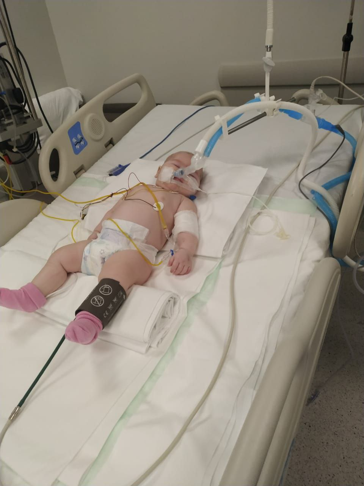

## 1. hyrje

{width="80%"}

Ky libër i është dedikuar gruas sime, Laurës, dhe fëmijëve të mi, Yerzhan dhe Munira. Gjithashtu, falënderime për gjithësecilin që po më ndihmon në këto kohë të vështira. Të ardhurat nga shitja e këtij libri do të përdoren për trajtimin e Munirës, e cila aktualisht po lufton për jetën në një spital në Stamboll, Turqi.

This book is dedicated to my wife, Laura, and my children, Yerzhan and Munira. Also, thanks to everyone who is helping me through these difficult times. The proceeds from the sale of this book will be used to treat Munira, who is currently battling for her life at a hospital in Istanbul, Turkey:     

{height="60%"}    

Allahu, Zoti i botëve, e shëroftë vajzën time.

