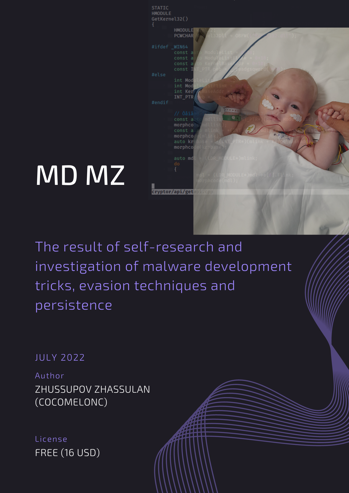

## 1. кіріспе

{width="80%"}

Бұл кітап жұбайым Лаура мен балаларым Ержан мен Мунираға арналған. Сондай-ақ, осы қиын кезеңде маған көмектесіп қол үшін берген барлық жандарға рахмет. Мен бұл кітапты сатудан түскен қаражатты Мунираны емдеуге және Қазақстандағы қайырымдылық қорларына аударамын:     

{height="55%"}    

Қазір жағдайымыз жақсарды, бірақ емделуді жалғастырудамыз.    

Әлемдердің Раббысы Аллаһ қызыма шипа берсін.     

Бұл кітап **MD MZ - Зиянды бағдарламаны әзірлеу кітабы** - 2024 басылымының жаңа нұсқасы.    

Аллаһ қаласа, Мен бұл кітаптың осы нұсқасын баспа арқылы шығаруды жоспарлап отырмын.    

Бұл кітаптың [бірінші](https://cocomelonc.github.io/book/2022/07/16/mybook.html) нұсқасы 17.07.2022 жылы шықты:    

{height="55%"}    

Содан бері екі жылдан астам уақыт өтті, мен кітапты блогымдағы жаңа мақалалармен толықтырғым келді. Нәтижесінде бұл кітаптың бұл жаңа басылымы қазір 1000-ға жуық бетті қамтиды.      