\newpage
\subsection{11. Windows Shellcoding - Часть 2. Поиск адреса kernel32}

الرَّحِيمِ الرَّحْمَٰنِ للَّهِ بِسْمِ 

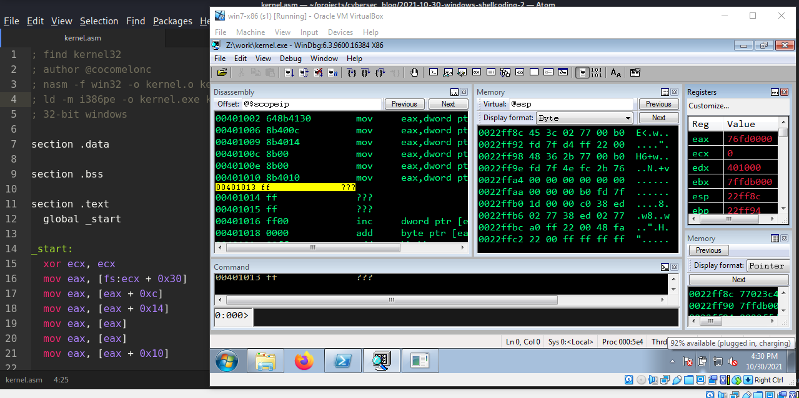{width="80%"}         

В [первой](https://cocomelonc.github.io/tutorial/2021/10/27/windows-shellcoding-1.html) части моего поста о shellcoding в Windows мы находили адреса `kernel32` и функций, используя следующую логику:
```cpp
/*
getaddr.c - get addresses of functions
(ExitProcess, WinExec) in memory
*/
#include <windows.h>
#include <stdio.h>

int main() {
  unsigned long Kernel32Addr;      // kernel32.dll address
  unsigned long ExitProcessAddr;   // ExitProcess address
  unsigned long WinExecAddr;       // WinExec address

  Kernel32Addr = GetModuleHandle("kernel32.dll");
  printf("KERNEL32 address in memory: 0x%08p\n", Kernel32Addr);

  ExitProcessAddr = GetProcAddress(Kernel32Addr, "ExitProcess");
  printf("ExitProcess address in memory is: 0x%08p\n", 
  ExitProcessAddr);

  WinExecAddr = GetProcAddress(Kernel32Addr, "WinExec");
  printf("WinExec address in memory is: 0x%08p\n", WinExecAddr);

  getchar();
  return 0;
}
```

Затем мы вставили найденный адрес в наш shellcode:
```nasm
; void ExitProcess([in] UINT uExitCode);
xor  eax, eax         ; zero out eax
push eax              ; push NULL
mov  eax, 0x76ed214f  ; call ExitProcess function 
                      ; addr in kernel32.dll
jmp  eax              ; execute the ExitProcess function
```

Проблема в том, что адреса всех DLL и их функций меняются при перезагрузке и различны для каждой системы. По этой причине мы не можем жестко задавать какие-либо адреса в нашем коде на ASM:        

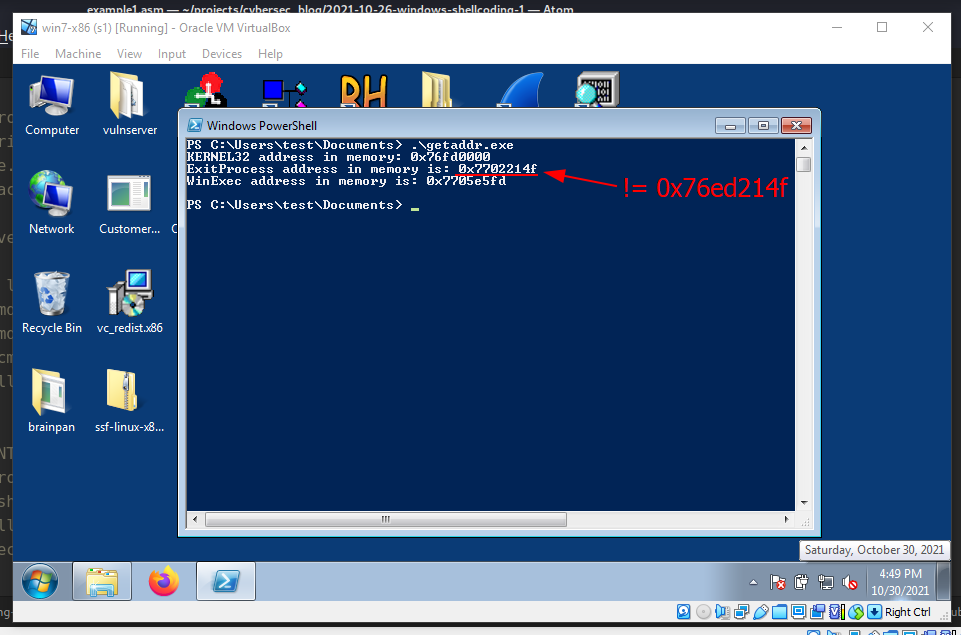{width="80%"}        

Прежде всего, как найти адрес `kernel32.dll`?         

### Структуры TEB и PEB

Каждый раз, когда мы выполняем exe-файл, первое, что создается (по крайней мере, насколько я знаю) в ОС, - это [PEB](https://docs.microsoft.com/en-us/windows/win32/api/winternl/ns-winternl-peb):                  
 
```cpp
typedef struct _PEB {
  BYTE                          Reserved1[2];
  BYTE                          BeingDebugged;
  BYTE                          Reserved2[1];
  PVOID                         Reserved3[2];
  PPEB_LDR_DATA                 Ldr;
  PRTL_USER_PROCESS_PARAMETERS  ProcessParameters;
  PVOID                         Reserved4[3];
  PVOID                         AtlThunkSListPtr;
  PVOID                         Reserved5;
  ULONG                         Reserved6;
  PVOID                         Reserved7;
  ULONG                         Reserved8;
  ULONG                         AtlThunkSListPtr32;
  PVOID                         Reserved9[45];
  BYTE                          Reserved10[96];
  PPS_POST_PROCESS_INIT_ROUTINE PostProcessInitRoutine;
  BYTE                          Reserved11[128];
  PVOID                         Reserved12[1];
  ULONG                         SessionId;
} PEB, *PPEB;
```

и [TEB](https://docs.microsoft.com/en-us/windows/win32/api/winternl/ns-winternl-teb):        

```cpp
typedef struct _TEB {
  PVOID Reserved1[12];
  PPEB  ProcessEnvironmentBlock;
  PVOID Reserved2[399];
  BYTE  Reserved3[1952];
  PVOID TlsSlots[64];
  BYTE  Reserved4[8];
  PVOID Reserved5[26];
  PVOID ReservedForOle;
  PVOID Reserved6[4];
  PVOID TlsExpansionSlots;
} TEB, *PTEB;
```

`PEB` - это структура процесса в Windows, заполняемая загрузчиком на этапе создания процесса, которая содержит информацию, необходимую для функционирования процесса.     

`TEB` - это структура, используемая для хранения информации о потоках в текущем процессе, каждый поток имеет свой собственный TEB.        

Откроем любую программу в отладчике `windbg` и выполним команду:
```cmd
dt _teb
```

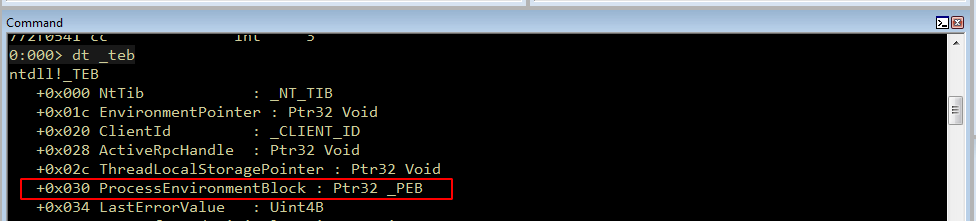{width="80%"}        

Как видим, `PEB` имеет смещение `0x030`. Аналогично можно посмотреть содержимое структуры `PEB`, используя команду:
```cmd
dt _peb
```

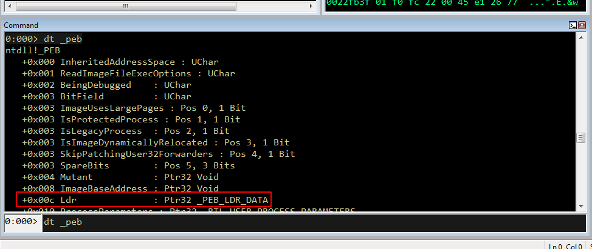{width="80%"}        

Теперь нам нужно посмотреть на элемент, находящийся по смещению `0x00c` от базового адреса `PEB`, это [PEB_LDR_DATA](https://docs.microsoft.com/en-us/windows/win32/api/winternl/ns-winternl-peb_ldr_data). `PEB_LDR_DATA` содержит информацию о загруженных модулях процесса.     

Также можно исследовать структуру `PEB_LDR_DATA` с помощью `windbg`:
```cmd
dt _PEB_LDR_DATA
```

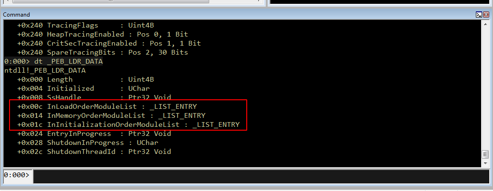{width="80%"}        

Здесь мы видим, что смещение `InLoadOrderModuleList` равно `0x00c`, `InMemoryOrderModuleList` равно `0x014`, а `InInitializationOrderModuleList` равно `0x01c`.

`InMemoryOrderModuleList` представляет собой двусвязный список, где каждый элемент списка указывает на структуру `LDR_DATA_TABLE_ENTRY`, поэтому `Windbg` показывает, что тип структуры - `LIST_ENTRY`.      

Прежде чем продолжить, выполним команду:             
```cmd
!peb
```

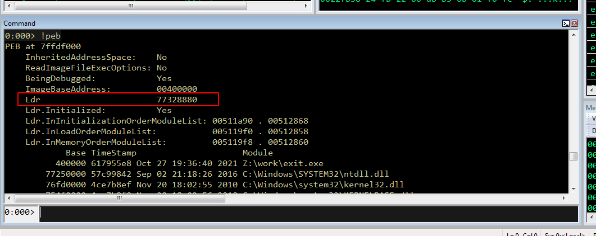{width="80%"}        

Как видим, адрес `LDR` (структура `PEB`) - `77328880`.        

Теперь, чтобы увидеть адреса `InLoadOrderModuleList`, `InMemoryOrderModuleList` и `InInitializationOrderModuleList`, выполним команду:
```cmd
dt _PEB_LDR_DATA 77328880
```

Эта команда покажет нам соответствующие начальные и конечные адреса связанных списков:        

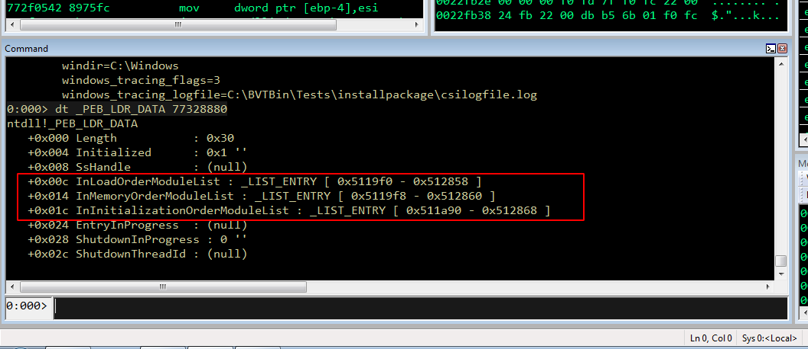{width="80%"}        

Давайте попробуем просмотреть модули, загруженные в структуру `LDR_DATA_TABLE_ENTRY`, и укажем начальный адрес этой структуры `0x5119f8`, чтобы увидеть базовые адреса загруженных модулей. Помним, что `0x5119f8` - это адрес структуры, поэтому первая запись будет на 8 байт меньше этого адреса:          

```cmd
dt _LDR_DATA_TABLE_ENTRY 0x5119f8-8
```

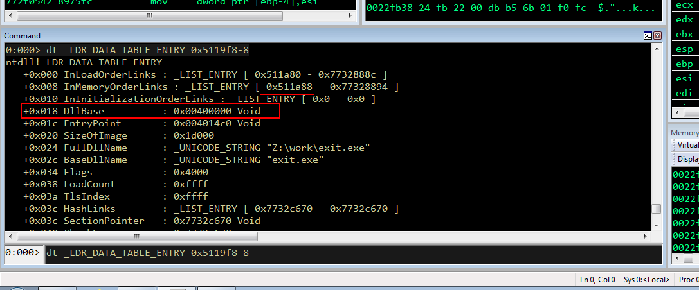{width="80%"}        

Как видим, `BaseDllName` - это наш `exit.exe`. Это исполняемый файл, который я запустил.         
Также видно, что адрес `InMemoryOrderLinks` теперь `0x511a88`. `DllBase` по смещению `0x018` содержит базовый адрес `BaseDllName`. Следующий загруженный модуль должен находиться на 8 байт дальше от `0x511a88`, то есть `0x5119f8-8`:     

```cmd
dt _LDR_DATA_TABLE_ENTRY 0x5119f8-8
```

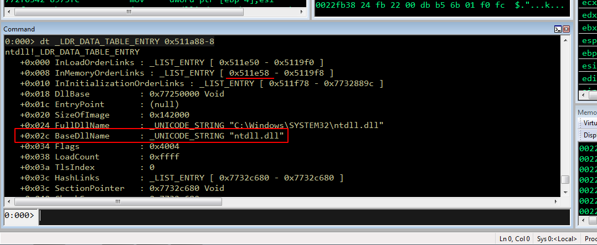{width="80%"}        

Как видим, `BaseDllName` - это `ntdll.dll`. Его адрес `0x77250000`, а следующий модуль находится на 8 байт после `0x511e58`. Тогда:

```cmd
dt _LDR_DATA_TABLE_ENTRY 0x511e58-8
```

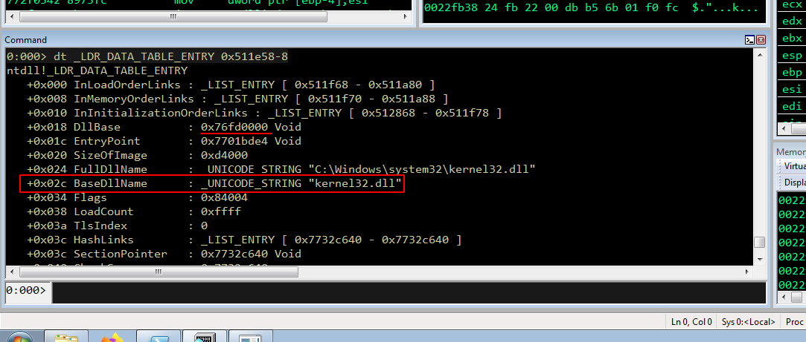{width="80%"}        

Теперь третий модуль - это `kernel32.dll`, его адрес `0x76fd0000`, смещение `0x018`. Чтобы убедиться в правильности, можно запустить `getaddr.exe`:

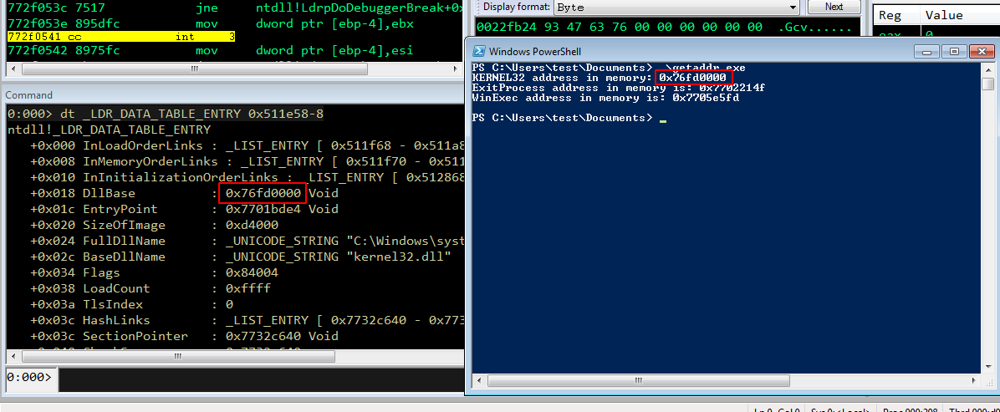{width="80%"}        

Этот порядок загрузки модулей всегда будет фиксированным (по крайней мере, насколько мне известно) для Windows 10, 7. Поэтому, когда мы пишем на ASM, мы можем пройтись по всей структуре PEB LDR и найти адрес `kernel32.dll`, чтобы загрузить его в наш shellcode.       

Как я писал в [первой части](https://cocomelonc.github.io/tutorial/2021/10/27/windows-shellcoding-1.html), следующий модуль - `kernelbase.dll`. Для эксперимента, чтобы убедиться, можно выполнить:

```cmd
dt _LDR_DATA_TABLE_ENTRY 0x511f70-8
```

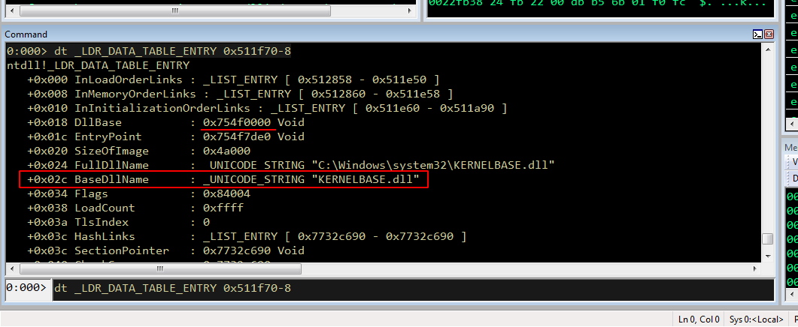{width="80%"}        

Таким образом, мы получили следующее:    
1. Смещение до структуры `PEB`: `0x030`    
2. Смещение до `LDR` внутри `PEB`: `0x00c`    
3. Смещение до `InMemoryOrderModuleList`: `0x014`    
4. Первый загруженный модуль - наш `.exe`    
5. Второй загруженный модуль - `ntdll.dll`    
6. Третий загруженный модуль - `kernel32.dll`    
7. Четвертый загруженный модуль - `kernelbase.dll`    

Во всех последних версиях Windows (по крайней мере, насколько мне известно) регистр `FS` указывает на `TEB`. Следовательно, для получения базового адреса `kernel32.dll` (`kernel.asm`):        

```nasm
; find kernel32
; author @cocomelonc
; nasm -f win32 -o kernel.o kernel.asm
; ld -m i386pe -o kernel.exe kernel.o
; 32-bit windows

section .data

section .bss

section .text
  global _start               ; must be declared for linker

_start:
  mov eax, [fs:ecx + 0x30]    ; offset to the PEB struct
  mov eax, [eax + 0xc]        ; offset to LDR within PEB
  mov eax, [eax + 0x14]       ; offset to 
                              ; InMemoryOrderModuleList
  mov eax, [eax]              ; kernel.exe address loaded 
                              ; in eax (1st module)
  mov eax, [eax]              ; ntdll.dll address loaded
                              ; (2nd module)
  mov eax, [eax + 0x10]       ; kernel32.dll address 
                              ; loaded (3rd module)
```

С помощью этого кода на ассемблере мы можем найти адрес `kernel32.dll` и сохранить его в регистре `EAX`. Теперь компилируем:

```bash
nasm -f win32 -o kernel.o kernel.asm
ld -m i386pe -o kernel.exe kernel.o
```

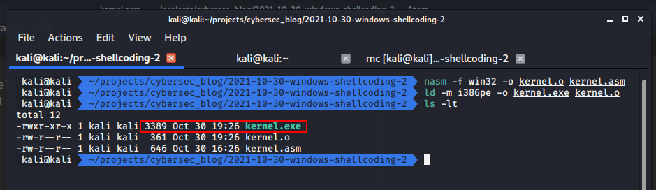{width="80%"}        

Скопируйте этот код и запустите его в отладчике на Windows 7:         

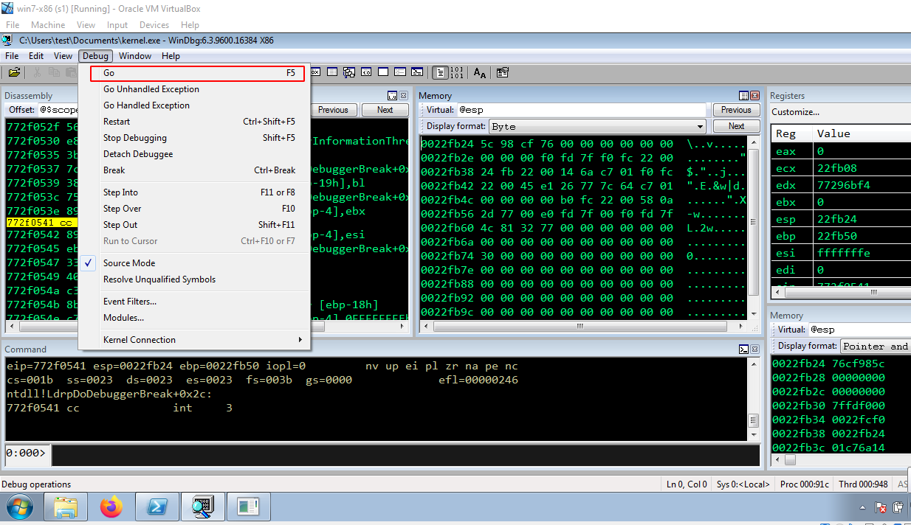{width="80%"}       

Запуск:   

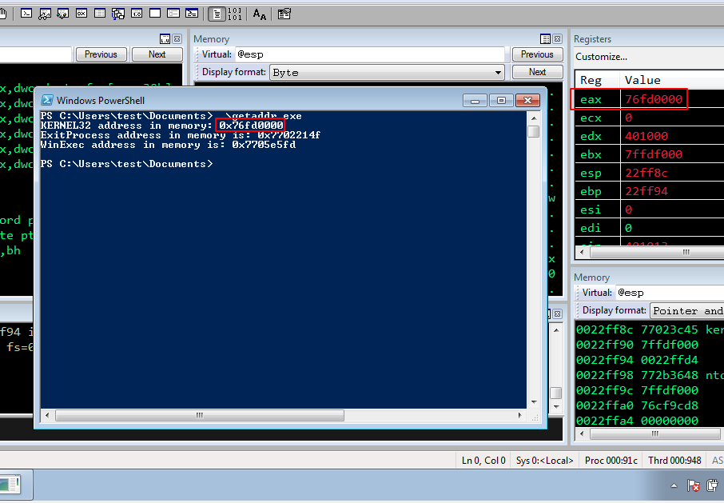{width="80%"}       

Как видите, всё работает отлично!    

Следующий шаг - найти адрес функции (например, `ExitProcess`) с помощью `LoadLibraryA` и вызвать её. Это будет в следующей части.

[History and Advances in Windows Shellcode](http://www.phrack.org/archives/issues/62/7.txt)       
[PEB structure](https://docs.microsoft.com/en-us/windows/win32/api/winternl/ns-winternl-peb)        
[TEB structure](https://docs.microsoft.com/en-us/windows/win32/api/winternl/ns-winternl-teb)       
[PEB_LDR_DATA structure](https://docs.microsoft.com/en-us/windows/win32/api/winternl/ns-winternl-peb_ldr_data)            
[The Shellcoder's Handbook](https://www.wiley.com/en-us/The+Shellcoder%27s+Handbook%3A+Discovering+and+Exploiting+Security+Holes%2C+2nd+Edition-p-9780470080238)              
[windows shellcoding part 1](https://cocomelonc.github.io/tutorial/2021/10/27/windows-shellcoding-1.html)             
[исходный код на Github](https://github.com/cocomelonc/2021-10-30-windows-shellcoding-2)         
