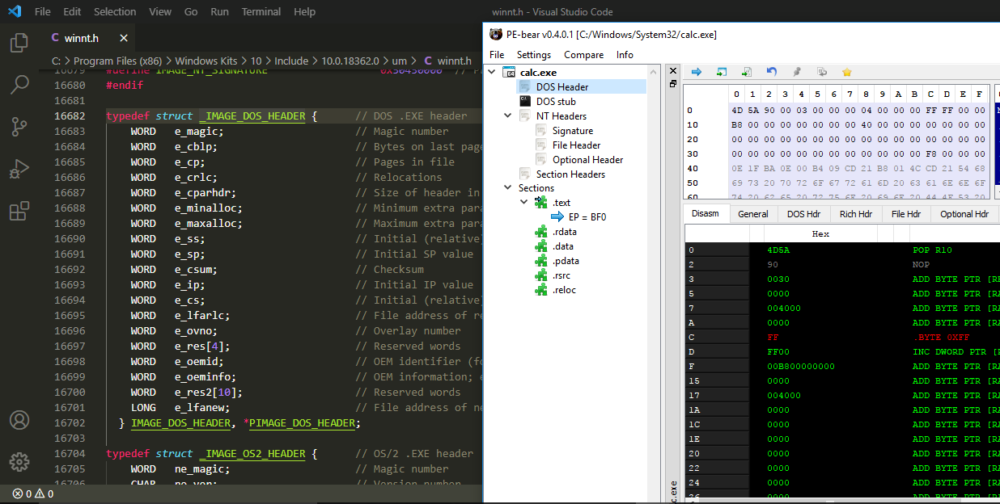
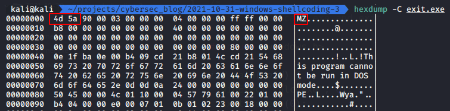
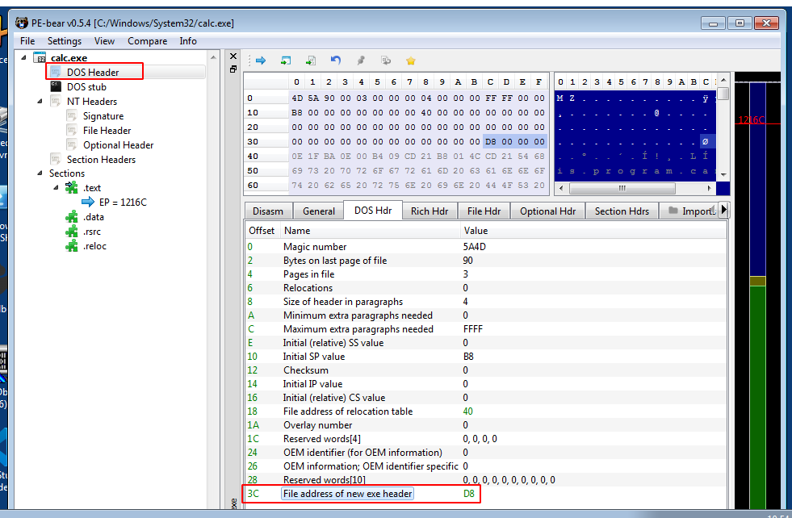
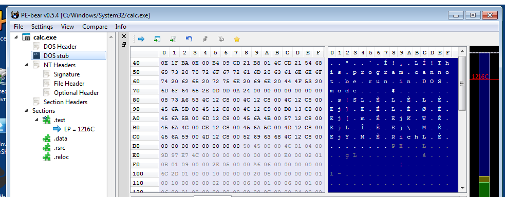
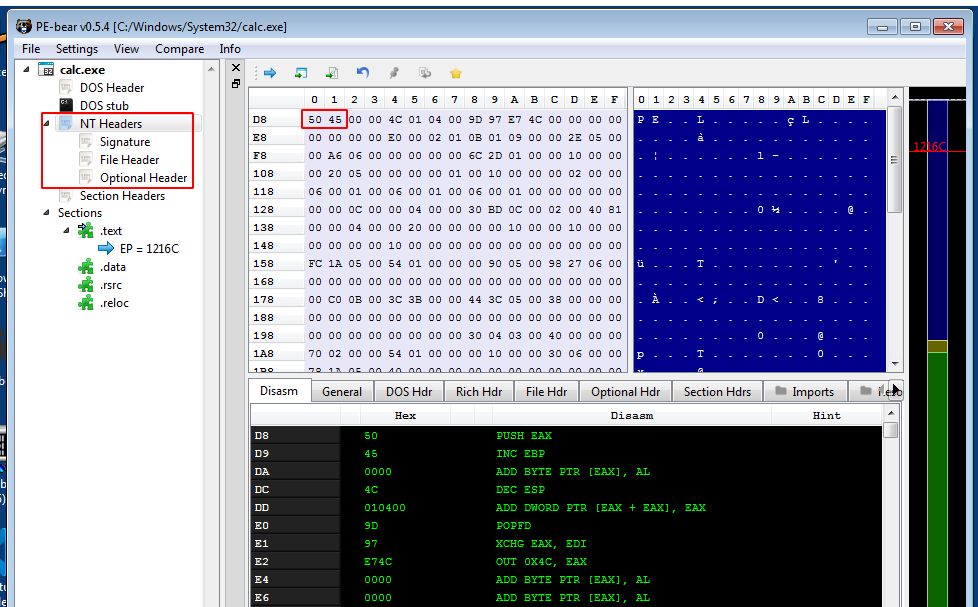
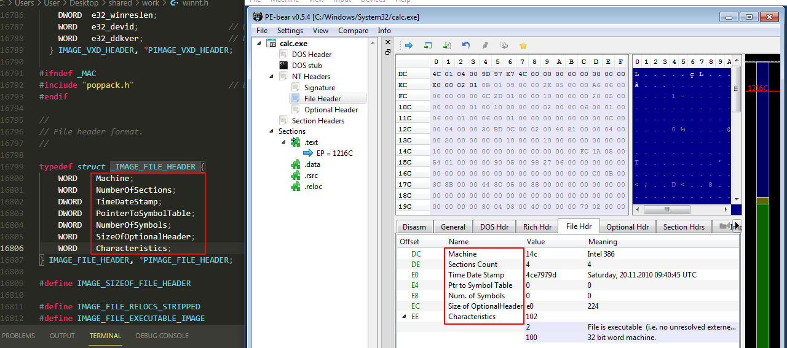
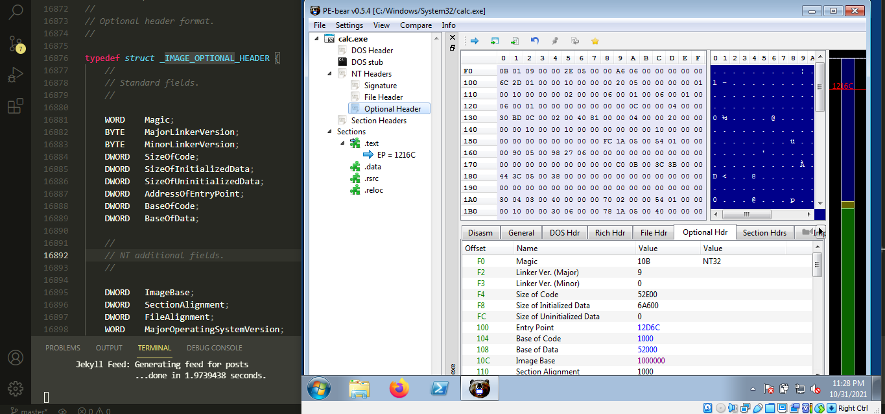
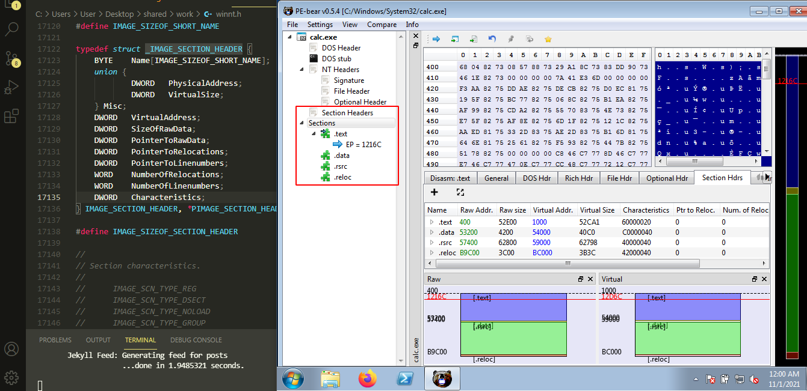
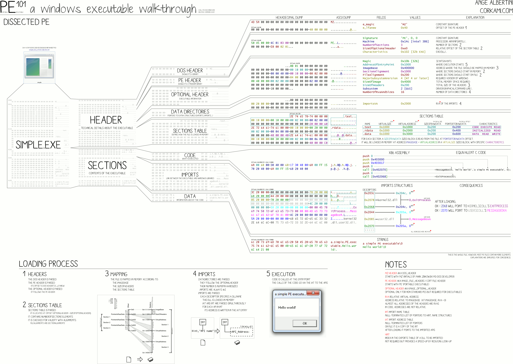

\newpage
\subsection{12. Windows Shellcoding - Часть 3. Формат PE-файла}

﷽

{width="80%"}         

Этот раздел можно читать не только как продолжение предыдущих, но и как отдельный материал. В данном разделе рассматривается структура PE-файла.           

### PE-файл

Что такое формат PE-файла? Это родной формат файлов для Win32. Его спецификация частично основана на формате Unix Coff (Common Object File Format). Термин "Portable Executable" означает, что формат файла является универсальным для платформы Win32: загрузчик PE-файлов в любой версии Win32 распознает и использует этот формат даже при запуске Windows на платформах с процессорами, отличными от Intel. Однако это не означает, что PE-файлы могут быть перенесены на другие платформы без изменений. Таким образом, изучение формата PE-файлов дает ценные сведения о структуре Windows.     

В общем виде структура PE-файла выглядит так:                     

{width="80%"}         

Формат PE-файла определяется заголовком PE, поэтому важно сначала изучить его. Вам не обязательно понимать каждую его часть, но следует иметь представление о структуре и уметь идентифицировать наиболее важные компоненты.

### Заголовок DOS

Заголовок DOS содержит информацию, необходимую для загрузки PE-файла. Поэтому этот заголовок является обязательным для загрузки PE-файла.            

Структура заголовка DOS:          
```cpp
typedef struct _IMAGE_DOS_HEADER {// DOS .EXE header
    WORD   e_magic;       // Магическое число
    WORD   e_cblp;        // Количество байт на последней странице файла
    WORD   e_cp;          // Количество страниц в файле
    WORD   e_crlc;        // Количество переадресаций
    WORD   e_cparhdr;     // Размер заголовка в параграфах
    WORD   e_minalloc;    // Минимальное количество дополнительных параграфов
    WORD   e_maxalloc;    // Максимальное количество дополнительных параграфов
    WORD   e_ss;          // Начальное (относительное) значение SS
    WORD   e_sp;          // Начальное значение SP
    WORD   e_csum;        // Контрольная сумма
    WORD   e_ip;          // Начальное значение IP
    WORD   e_cs;          // Начальное (относительное) значение CS
    WORD   e_lfarlc;      // Файловый адрес таблицы переадресации
    WORD   e_ovno;        // Номер оверлея
    WORD   e_res[4];      // Зарезервированные слова
    WORD   e_oemid;       // OEM-идентификатор
    WORD   e_oeminfo;     // OEM-информация
    WORD   e_res2[10];    // Зарезервированные слова
    LONG   e_lfanew;      // Файловый адрес нового заголовка EXE
  } IMAGE_DOS_HEADER, *PIMAGE_DOS_HEADER;
```

Этот заголовок занимает `64` байта. В данной структуре наиболее важными полями являются `e_magic` и `e_lfanew`. Первые два байта заголовка — это магические байты, идентифицирующие тип файла: `4D 5A` или "MZ" — инициалы Марка Збиковски, который работал над DOS в Microsoft. Эти магические байты определяют файл как PE-файл:

{width="80%"}         

Поле `e_lfanew` находится по смещению `0x3c` в заголовке DOS и содержит смещение до заголовка PE:

{width="80%"}         

### DOS stub

После первых `64` байтов файла начинается `DOS stub`. Эта область памяти в основном заполнена нулями:     

{width="80%"}         

### PE-заголовок

Этот раздел небольшой и просто содержит сигнатуру файла, которая представлена магическими байтами `PE\0\0` или `50 45 00 00`:

{width="80%"}         

Его структура:        
```cpp
typedef struct _IMAGE_NT_HEADERS {
    DWORD Signature;
    IMAGE_FILE_HEADER FileHeader;
    IMAGE_OPTIONAL_HEADER32 OptionalHeader;
} IMAGE_NT_HEADERS32, *PIMAGE_NT_HEADERS32;
```

Рассмотрим эту структуру подробнее.        

**File Header** (или COFF Header) - набор полей, описывающих основные характеристики файла:       
```cpp
typedef struct _IMAGE_FILE_HEADER {
    WORD    Machine;
    WORD    NumberOfSections;
    DWORD   TimeDateStamp;
    DWORD   PointerToSymbolTable;
    DWORD   NumberOfSymbols;
    WORD    SizeOfOptionalHeader;
    WORD    Characteristics;
} IMAGE_FILE_HEADER, *PIMAGE_FILE_HEADER;
```

{width="80%"}         

**Optional Header** - опционален в контексте COFF-объектных файлов, но обязателен для PE-файлов. Он содержит множество важных переменных, таких как `AddressOfEntryPoint`, `ImageBase`, `Section Alignment`, `SizeOfImage`, `SizeOfHeaders` и `DataDirectory`. Данная структура имеет 32-битные и 64-битные версии:

```cpp
typedef struct _IMAGE_OPTIONAL_HEADER {
    //
    // Standard fields.
    //

    WORD    Magic;
    BYTE    MajorLinkerVersion;
    BYTE    MinorLinkerVersion;
    DWORD   SizeOfCode;
    DWORD   SizeOfInitializedData;
    DWORD   SizeOfUninitializedData;
    DWORD   AddressOfEntryPoint;
    DWORD   BaseOfCode;
    DWORD   BaseOfData;

    //
    // NT additional fields.
    //

    DWORD   ImageBase;
    DWORD   SectionAlignment;
    DWORD   FileAlignment;
    WORD    MajorOperatingSystemVersion;
    WORD    MinorOperatingSystemVersion;
    WORD    MajorImageVersion;
    WORD    MinorImageVersion;
    WORD    MajorSubsystemVersion;
    WORD    MinorSubsystemVersion;
    DWORD   Win32VersionValue;
    DWORD   SizeOfImage;
    DWORD   SizeOfHeaders;
    DWORD   CheckSum;
    WORD    Subsystem;
    WORD    DllCharacteristics;
    DWORD   SizeOfStackReserve;
    DWORD   SizeOfStackCommit;
    DWORD   SizeOfHeapReserve;
    DWORD   SizeOfHeapCommit;
    DWORD   LoaderFlags;
    DWORD   NumberOfRvaAndSizes;
    IMAGE_DATA_DIRECTORY 
    DataDirectory[IMAGE_NUMBEROF_DIRECTORY_ENTRIES];
} IMAGE_OPTIONAL_HEADER32, *PIMAGE_OPTIONAL_HEADER32;
```

{width="80%"}         

Здесь хочу обратить ваше внимание на `IMAGE_DATA_DIRECTORY`:
```cpp
typedef struct _IMAGE_DATA_DIRECTORY {
  DWORD VirtualAddress;
  DWORD Size;
} IMAGE_DATA_DIRECTORY, *PIMAGE_DATA_DIRECTORY;
```

Это таблица данных. Проще говоря, это массив (`16` элементов), каждый из которых содержит структуру из двух `DWORD` значений.    

В настоящее время PE-файлы могут содержать следующие таблицы данных:       

- Export Table
- Import Table
- Resource Table
- Exception Table
- Certificate Table
- Base Relocation Table
- Debug
- Architecture
- Global Ptr
- TLS Table
- Load Config Table
- Bound Import
- IAT (Import Address Table)
- Delay Import Descriptor
- CLR Runtime Header
- Reserved, must be zero

Как я писал ранее, я подробно рассмотрю только некоторые из них.                 

### Таблица секций

Содержит массив структур `IMAGE_SECTION_HEADER`, которые определяют секции PE-файла, такие как `.text` и `.data`.
Структура `IMAGE_SECTION_HEADER`:
```cpp
typedef struct _IMAGE_SECTION_HEADER {
    BYTE    Name[IMAGE_SIZEOF_SHORT_NAME];
    union {
            DWORD   PhysicalAddress;
            DWORD   VirtualSize;
    } Misc;
    DWORD   VirtualAddress;
    DWORD   SizeOfRawData;
    DWORD   PointerToRawData;
    DWORD   PointerToRelocations;
    DWORD   PointerToLinenumbers;
    WORD    NumberOfRelocations;
    WORD    NumberOfLinenumbers;
    DWORD   Characteristics;
} IMAGE_SECTION_HEADER, *PIMAGE_SECTION_HEADER;
```

Размер структуры составляет `0x28` байт.

### Секции

После таблицы секций идут сами секции:             

{width="80%"}         

Приложения не работают напрямую с физической памятью, а используют только виртуальную память. Секции представляют собой область, загружаемую в виртуальную память, и все операции выполняются непосредственно с этими данными. Адрес в виртуальной памяти без каких-либо смещений называется **Virtual Address** (**VA**). Другими словами, **VA** — это адрес памяти, который используется приложением. Предпочтительное место загрузки приложения задаётся в поле **ImageBase**. Оно указывает точку, с которой начинается область приложения в виртуальной памяти. Смещения **RVA (Relative Virtual Address)** вычисляются относительно этой точки. Мы можем вычислить **RVA** по формуле: `RVA = VA - ImageBase`. `ImageBase` всегда известен, и, получив VA или RVA, можно выразить одно через другое.     

Размер каждой секции фиксирован в таблице секций, поэтому они должны иметь определённый размер, и для этого дополняются нулевыми байтами (`00`).              

Приложение в Windows NT обычно содержит несколько предопределённых секций, таких как `.text`, `.bss`, `.rdata`, `.data`, `.rsrc`. В зависимости от приложения могут использоваться не все эти секции.         

##### .text

В Windows все сегменты кода находятся в секции `.text`. 

##### .rdata

Константы и строки, доступные только для чтения, находятся в секции `.rdata`.

##### .rsrc

Секция `.rsrc` содержит ресурсы приложения. Обычно здесь находятся иконки и изображения, включённые в файл. Она начинается с структуры `IMAGE_RESOURCE_DIRECTORY`, формирующей корневой узел и ветви дерева ресурсов:
```cpp
typedef struct _IMAGE_RESOURCE_DIRECTORY {
    DWORD   Characteristics;
    DWORD   TimeDateStamp;
    WORD    MajorVersion;
    WORD    MinorVersion;
    WORD    NumberOfNamedEntries;
    WORD    NumberOfIdEntries;
} IMAGE_RESOURCE_DIRECTORY, *PIMAGE_RESOURCE_DIRECTORY;
```

##### .edata

Секция `.edata` содержит экспортируемые данные приложения или DLL. При наличии экспортного каталога он представлен структурой `IMAGE_EXPORT_DIRECTORY`:
```cpp
typedef struct _IMAGE_EXPORT_DIRECTORY {
    ULONG   Characteristics;
    ULONG   TimeDateStamp;
    USHORT  MajorVersion;
    USHORT  MinorVersion;
    ULONG   Name;
    ULONG   Base;
    ULONG   NumberOfFunctions;
    ULONG   NumberOfNames;
    PULONG  *AddressOfFunctions;
    PULONG  *AddressOfNames;
    PUSHORT *AddressOfNameOrdinals;
} IMAGE_EXPORT_DIRECTORY, *PIMAGE_EXPORT_DIRECTORY;
```

Экспортируемые символы обычно находятся в DLL, но DLL также могут импортировать символы. Основная цель таблицы экспорта — связывание имён и/или номеров экспортируемых функций с их RVA (позицией в памяти процесса). 

### Import Address Table

Таблица **Import Address Table (IAT)** состоит из указателей на функции и используется для получения адресов функций при загрузке DLL. Компилированное приложение не использует жестко закодированные адреса API, а работает через указатели на функции.  

### Заключение

Формат PE-файлов сложнее, чем описано в этом посте. Например, интересную визуализацию исполняемых файлов Windows можно найти в проекте [corkami](https://github.com/corkami/pics/blob/master/binary/pe101/README.md) на GitHub Ange Albertini:

{width="80%"}         

[PE bear](https://github.com/hasherezade/pe-bear-releases)                  
[MSDN PE format](https://docs.microsoft.com/en-us/windows/win32/debug/pe-format)                
[corkami](https://github.com/corkami/pics/blob/master/binary/pe101/README.md)                    
[An In-Depth Look into the Win32 Portable Executable File Format](https://docs.microsoft.com/en-us/archive/msdn-magazine/2002/february/inside-windows-win32-portable-executable-file-format-in-detail)            
[An In-Depth Look into the Win32 Portable Executable File Format, Part 2](https://docs.microsoft.com/en-us/archive/msdn-magazine/2002/march/inside-windows-an-in-depth-look-into-the-win32-portable-executable-file-format-part-2)                 
[MSDN IMAGE_NT_HEADERS](https://docs.microsoft.com/en-us/windows/win32/api/winnt/ns-winnt-image_nt_headers32)                
[MSDN IMAGE_FILE_HEADER](https://docs.microsoft.com/en-us/windows/win32/api/winnt/ns-winnt-image_file_header)               
[MSDN IMAGE_OPTIONAL_HEADER](https://docs.microsoft.com/en-us/windows/win32/api/winnt/ns-winnt-image_optional_header32)             
[MSDN IMAGE_DATA_DIRECTORY](https://docs.microsoft.com/en-us/windows/win32/api/winnt/ns-winnt-image_data_directory)           
