\newpage
\subsection{19. перехват API Windows. Простой пример на C++.}

الرَّحِيمِ الرَّحْمَٰنِ للَّهِ بِسْمِ 

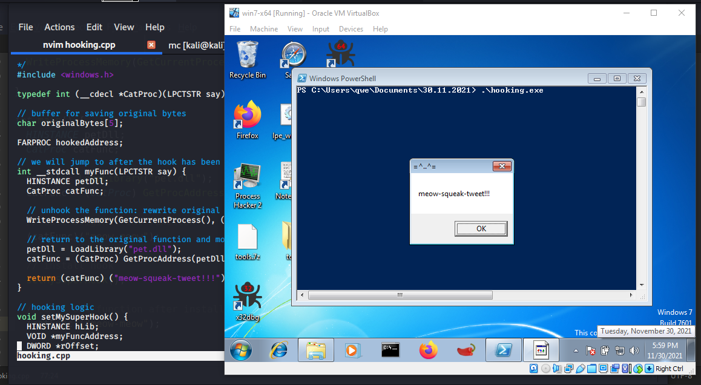{width="80%"}    

### Что такое перехват API?

Перехват API (API hooking) - это техника, с помощью которой мы можем инструментировать и изменять поведение и поток вызовов API. Этот метод также используется многими антивирусными решениями для определения того, является ли код вредоносным.   

### пример 1

Прежде чем перехватывать функции API Windows, я рассмотрю случай, когда это делается с экспортированной функцией из DLL.    

Например, у нас есть DLL со следующей логикой (`pet.cpp`):

```cpp
/*
pet.dll - DLL example for basic hooking
*/

#include <windows.h>
#pragma comment (lib, "user32.lib")

BOOL APIENTRY DllMain(HMODULE hModule, 
DWORD ul_reason_for_call, LPVOID lpReserved) {
  switch (ul_reason_for_call) {
    case DLL_PROCESS_ATTACH:
      break;
    case DLL_PROCESS_DETACH:
      break;
    case DLL_THREAD_ATTACH:
      break;
    case DLL_THREAD_DETACH:
      break;
  }
  return TRUE;
}

extern "C" {
  __declspec(dllexport) int _cdecl Cat(LPCTSTR say) {
    MessageBox(NULL, say, "=^..^=", MB_OK);
	  return 1;
	}
}

extern "C" {
  __declspec(dllexport) int _cdecl Mouse(LPCTSTR say) {
    MessageBox(NULL, say, "<:3()~~", MB_OK);
	  return 1;
	}
}

extern "C" {
  __declspec(dllexport) int _cdecl Frog(LPCTSTR say) {
    MessageBox(NULL, say, "8)~", MB_OK);
	  return 1;
	}
}

extern "C" {
  __declspec(dllexport) int _cdecl Bird(LPCTSTR say) {
    MessageBox(NULL, say, "<(-)", MB_OK);
	  return 1;
	}
}
```

Как видно, эта DLL содержит простейшие экспортированные функции: `Cat`, `Mouse`, `Frog`, `Bird` с одним параметром `say`. Логика этих функций проста - просто вывод всплывающего сообщения с заголовком.    

Компилируем DLL:    
```bash
x86_64-w64-mingw32-gcc -shared -o pet.dll pet.cpp -fpermissive
```

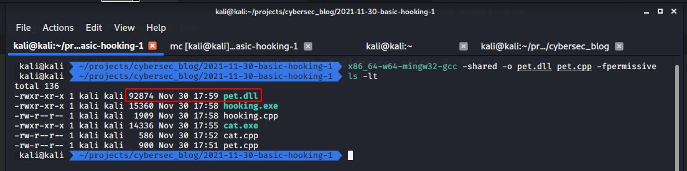{width="80%"}    

Затем создаем простой код для проверки этой DLL (`cat.cpp`):  
```cpp
#include <windows.h>

typedef int (__cdecl *CatProc)(LPCTSTR say);
typedef int (__cdecl *BirdProc)(LPCTSTR say);

int main(void) {
  HINSTANCE petDll;
  CatProc catFunc;
  BirdProc birdFunc;
  BOOL freeRes;

  petDll = LoadLibrary("pet.dll");

  if (petDll != NULL) {
    catFunc = (CatProc) GetProcAddress(petDll, "Cat");
    birdFunc = (BirdProc) GetProcAddress(petDll, "Bird");
    if ((catFunc != NULL) && (birdFunc != NULL)) {
      (catFunc) ("meow-meow");
      (catFunc) ("mmmmeow");
      (birdFunc) ("tweet-tweet");
    }
    freeRes = FreeLibrary(petDll);
  }

  return 0;
}
```

Компилируем:  
```bash
x86_64-w64-mingw32-g++ -O2 cat.cpp -o cat.exe \
-mconsole -I/usr/share/mingw-w64/include/ -s \
-ffunction-sections -fdata-sections -Wno-write-strings \
-fno-exceptions -fmerge-all-constants -static-libstdc++ \
-static-libgcc -fpermissive
```

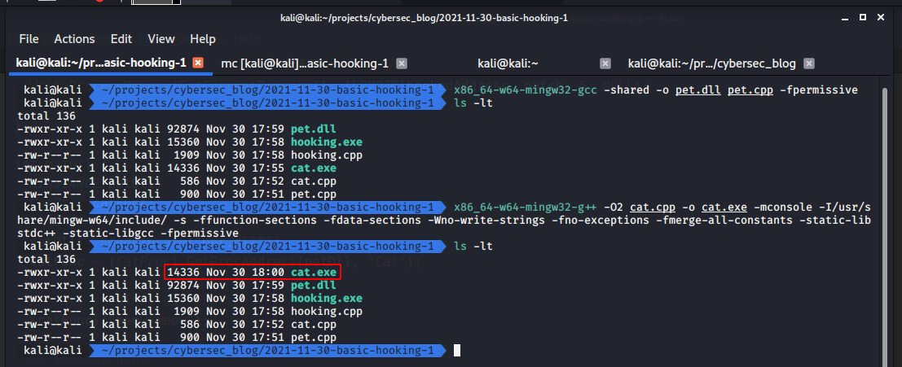{width="80%"}    

Запускаем на `Windows 7 x64`:  
```cmd
.\cat.exe
```

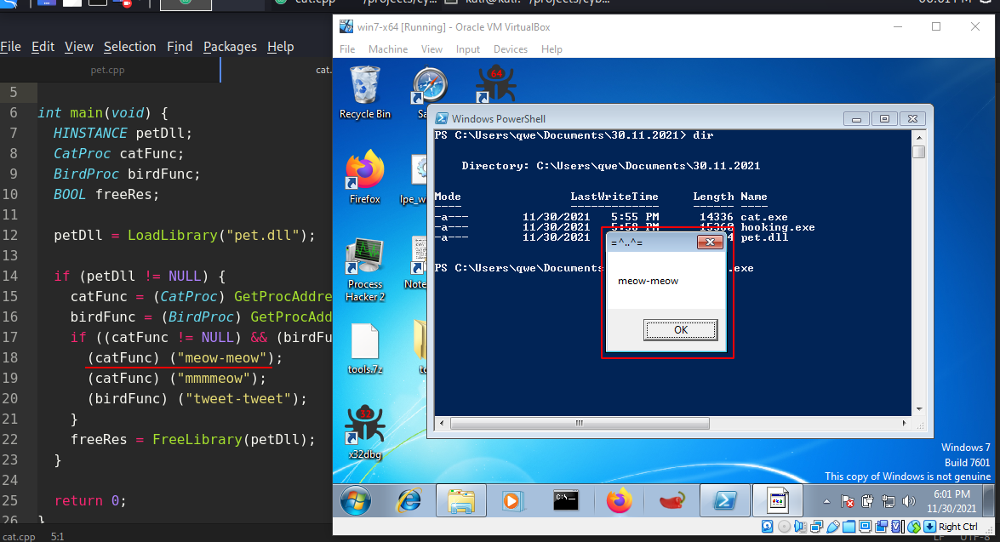{width="80%"}    

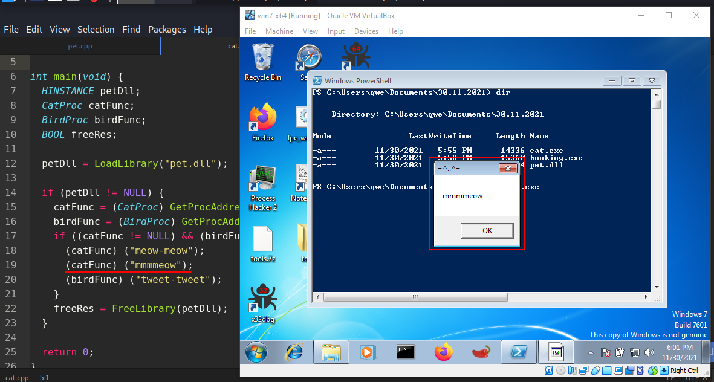{width="80%"}    

{width="80%"}    

Как видно, всё работает так, как ожидалось.    

Теперь, например, функцию `Cat` можно перехватить в этом сценарии, но это может быть любая другая функция.    

Алгоритм данной техники следующий:    

Сначала получаем адрес в памяти функции `Cat`.    

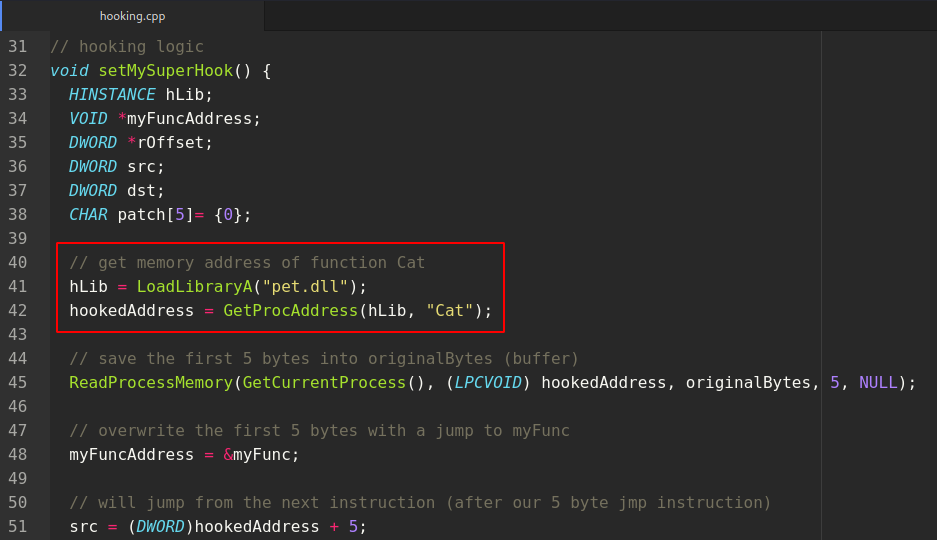{width="80%"}    

Затем сохраняем первые `5` байтов функции `Cat`, так как они нам понадобятся:    

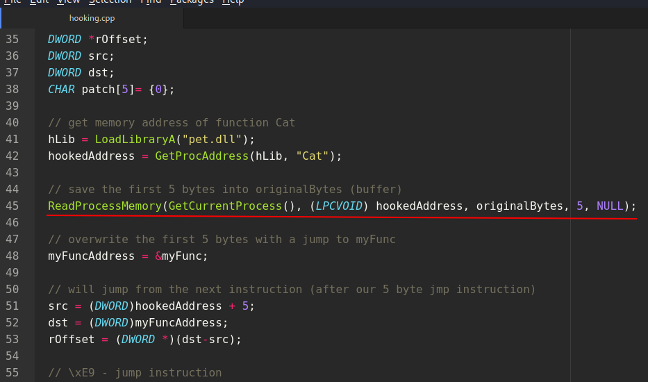{width="80%"}    

Далее создаем функцию `myFunc`, которая будет выполняться при вызове оригинальной `Cat`:    

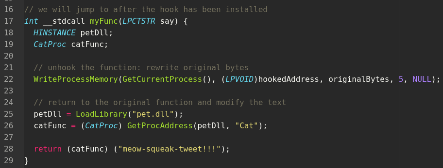{width="80%"}    

Перезаписываем `5` байтов, добавляя переход (`jmp`) на `myFunc`:    

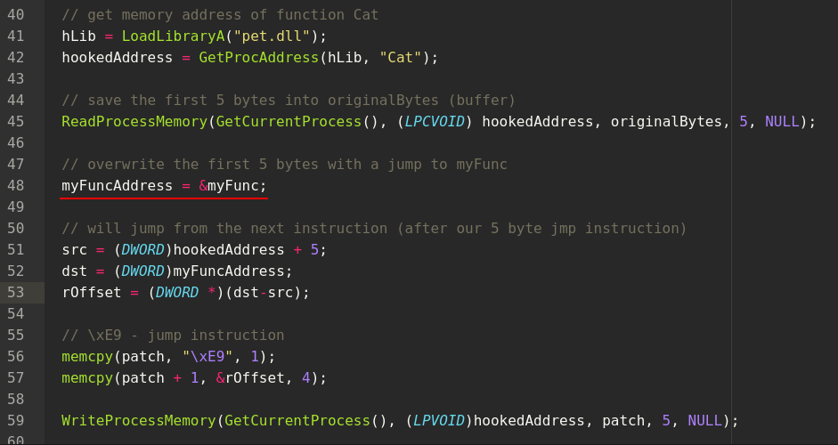{width="80%"}    

Затем создаем "патч":    

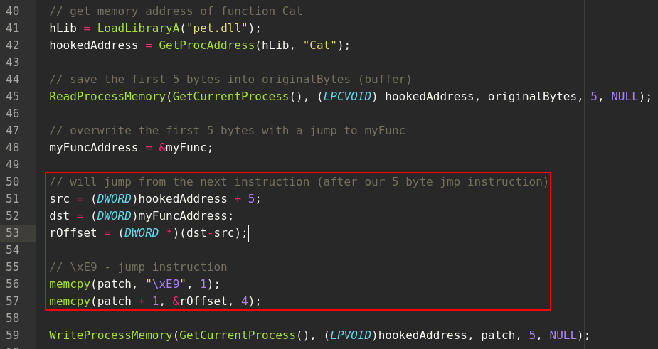{width="80%"}    

На следующем шаге патчим функцию `Cat`, перенаправляя её на `myFunc`:    

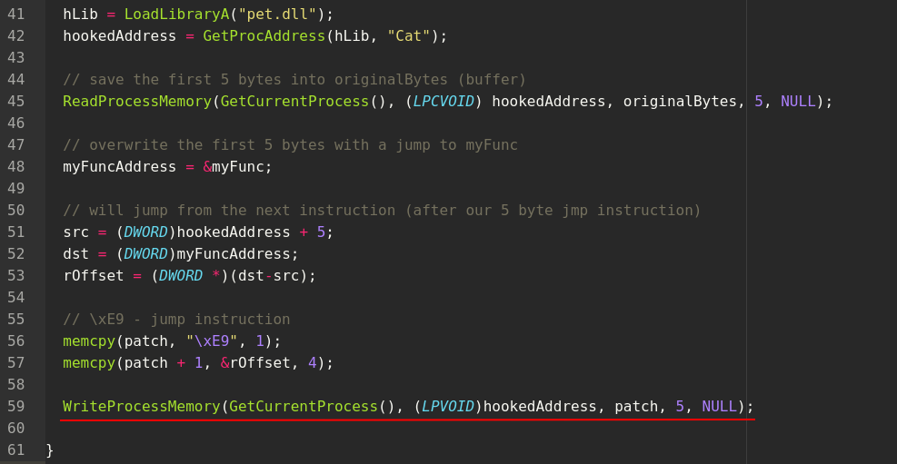{width="80%"}    

Что мы здесь сделали? Этот трюк - это техника *"классического 5-байтового перехвата"*. Если дизассемблировать функцию:    

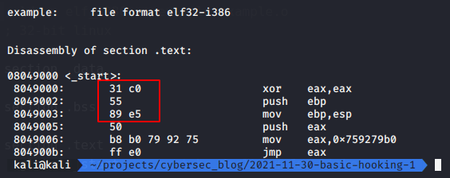{width="80%"}    

Выделенные `5` байтов - это типичный пролог, встречающийся во многих API-функциях. Перезаписывая эти первые `5` байтов инструкцией `jmp`, мы перенаправляем выполнение в нашу собственную функцию. Мы сохраняем оригинальные байты, чтобы можно было вернуть выполнение обратно в перехваченную функцию.    

Сначала вызываем оригинальную `Cat`, устанавливаем хук и снова вызываем `Cat`:    

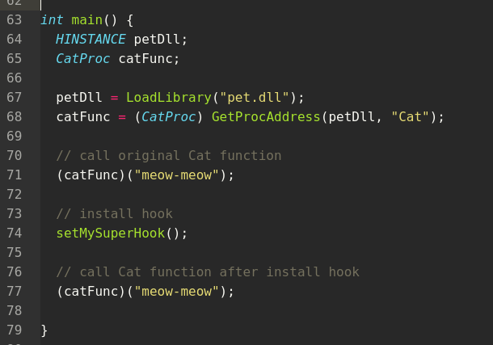{width="80%"}    

Полный исходный код:

```cpp
/*
hooking.cpp
basic hooking example
author: @cocomelonc
https://cocomelonc.github.io/tutorial/
2021/11/30/basic-hooking-1.html
*/
#include <windows.h>

typedef int (__cdecl *CatProc)(LPCTSTR say);

// buffer for saving original bytes
char originalBytes[5];

FARPROC hookedAddress;

// we will jump to after the hook has been installed
int __stdcall myFunc(LPCTSTR say) {
  HINSTANCE petDll;
  CatProc catFunc;

  // unhook the function: rewrite original bytes
  WriteProcessMemory(GetCurrentProcess(), 
  (LPVOID)hookedAddress, 
  originalBytes, 5, NULL);

  // return to the original function and modify the text
  petDll = LoadLibrary("pet.dll");
  catFunc = (CatProc) GetProcAddress(petDll, "Cat");

  return (catFunc) ("meow-squeak-tweet!!!");
}

// hooking logic
void setMySuperHook() {
  HINSTANCE hLib;
  VOID *myFuncAddress;
  DWORD *rOffset;
  DWORD src;
  DWORD dst;
  CHAR patch[5]= {0};

  // get memory address of function Cat
  hLib = LoadLibraryA("pet.dll");
  hookedAddress = GetProcAddress(hLib, "Cat");

  // save the first 5 bytes into originalBytes (buffer)
  ReadProcessMemory(GetCurrentProcess(), 
  (LPCVOID) hookedAddress, 
  originalBytes, 5, NULL);

  // overwrite the first 5 bytes with a jump to myFunc
  myFuncAddress = &myFunc;

  // will jump from the next instruction 
  // (after our 5 byte jmp instruction)
  src = (DWORD)hookedAddress + 5;
  dst = (DWORD)myFuncAddress;
  rOffset = (DWORD *)(dst-src);

  // \xE9 - jump instruction
  memcpy(patch, "\xE9", 1);
  memcpy(patch + 1, &rOffset, 4);

  WriteProcessMemory(GetCurrentProcess(), 
  (LPVOID)hookedAddress, patch, 
  5, NULL);

}

int main() {
  HINSTANCE petDll;
  CatProc catFunc;

  petDll = LoadLibrary("pet.dll");
  catFunc = (CatProc) GetProcAddress(petDll, "Cat");

  // call original Cat function
  (catFunc)("meow-meow");

  // install hook
  setMySuperHook();

  // call Cat function after install hook
  (catFunc)("meow-meow");

}

```

Компилируем код:
```bash
x86_64-w64-mingw32-g++ -O2 hooking.cpp -o hooking.exe \
-mconsole -I/usr/share/mingw-w64/include/ -s \
-ffunction-sections -fdata-sections -Wno-write-strings \
-fno-exceptions -fmerge-all-constants -static-libstdc++ \
-static-libgcc -fpermissive
```

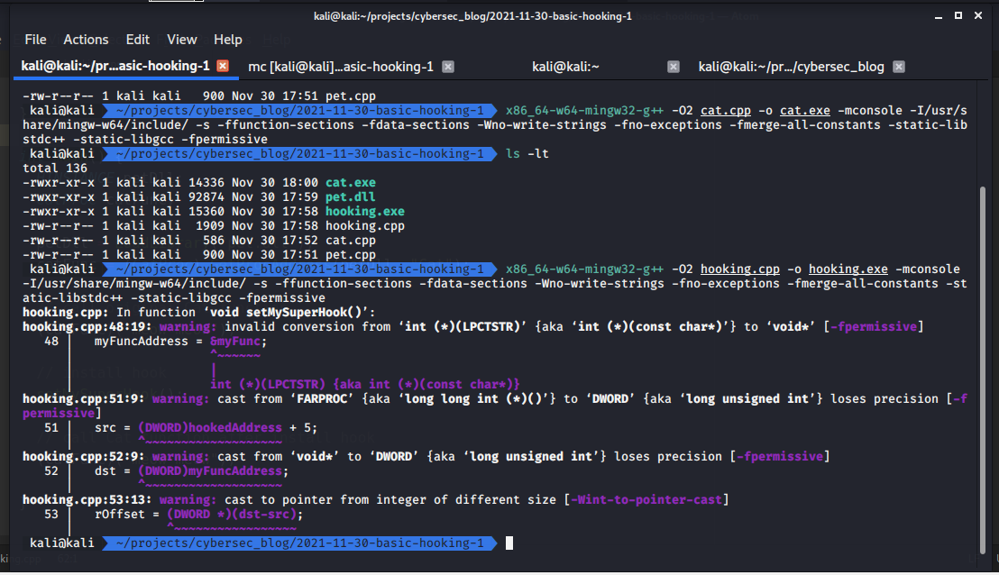{width="80%"}    

Запускаем и смотрим в действии (на `Windows 7 x64` в данном случае):
```cmd
.\hooking.exe
```

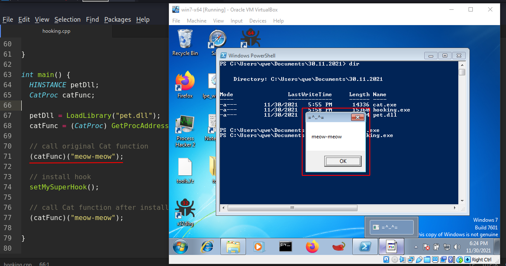{width="80%"}    

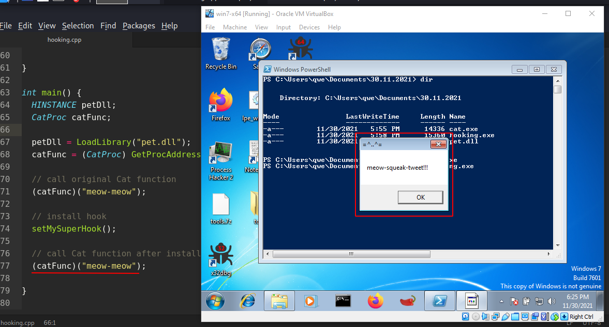{width="80%"}    

Как видно, наш хук сработал идеально!! Кот теперь говорит `meow-squeak-tweet!!!` вместо `meow-meow`!    

### пример 2

Аналогично, можно перехватить, например, функцию `WinExec` из `kernel32.dll` (`hooking2.cpp`):

```cpp
#include <windows.h>

// buffer for saving original bytes
char originalBytes[5];

FARPROC hookedAddress;

// we will jump to after the hook has been installed
int __stdcall myFunc(LPCSTR lpCmdLine, UINT uCmdShow) {

  // unhook the function: rewrite original bytes
  WriteProcessMemory(GetCurrentProcess(), 
  (LPVOID)hookedAddress, originalBytes, 5, NULL);

  // return to the original function and modify the text
  return WinExec("calc", uCmdShow);
}

// hooking logic
void setMySuperHook() {
  HINSTANCE hLib;
  VOID *myFuncAddress;
  DWORD *rOffset;
  DWORD src;
  DWORD dst;
  CHAR patch[5]= {0};

  // get memory address of function MessageBoxA
  hLib = LoadLibraryA("kernel32.dll");
  hookedAddress = GetProcAddress(hLib, "WinExec");

  // save the first 5 bytes into originalBytes (buffer)
  ReadProcessMemory(GetCurrentProcess(), 
  (LPCVOID) hookedAddress, originalBytes, 5, NULL);

  // overwrite the first 5 bytes with a jump to myFunc
  myFuncAddress = &myFunc;

  // will jump from the next instruction 
  // (after our 5 byte jmp instruction)
  src = (DWORD)hookedAddress + 5;
  dst = (DWORD)myFuncAddress;
  rOffset = (DWORD *)(dst-src);

  // \xE9 - jump instruction
  memcpy(patch, "\xE9", 1);
  memcpy(patch + 1, &rOffset, 4);

  WriteProcessMemory(GetCurrentProcess(), 
  (LPVOID)hookedAddress, patch, 5, NULL);

}

int main() {

  // call original
  WinExec("notepad", SW_SHOWDEFAULT);

  // install hook
  setMySuperHook();

  // call after install hook
  WinExec("notepad", SW_SHOWDEFAULT);

}
```

Компилируем:
```bash
x86_64-w64-mingw32-g++ -O2 hooking2.cpp -o hooking2.exe \
-mconsole -I/usr/share/mingw-w64/include/ -s \
-ffunction-sections -fdata-sections -Wno-write-strings \
-fno-exceptions -fmerge-all-constants -static-libstdc++ \
-static-libgcc -fpermissive
```

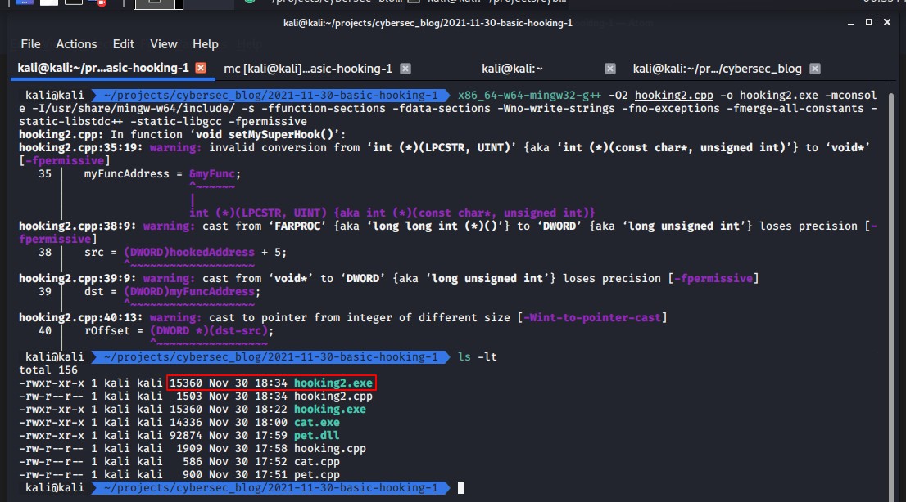{width="80%"}    

Запускаем:   
```powershell
.\hooking2.exe
```

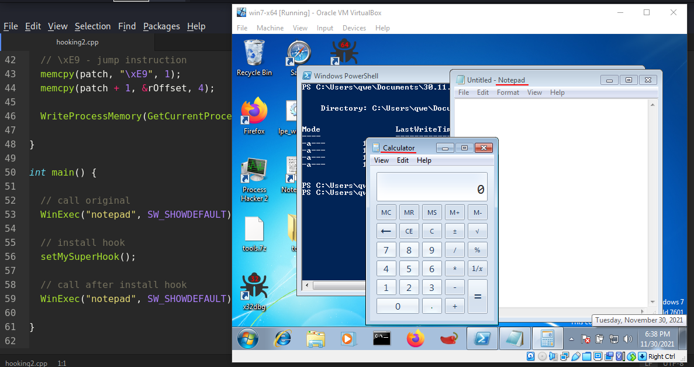{width="80%"}    

Итак, всё сработало как ожидалось.   

[исходный код на Github](https://github.com/cocomelonc/2021-11-30-basic-hooking-1)
[MessageBox](https://docs.microsoft.com/en-us/windows/win32/api/winuser/nf-winuser-messagebox)    
[WinExec](https://docs.microsoft.com/en-us/windows/win32/api/winbase/nf-winbase-winexec)    
[Exporting from DLL using __declspec](https://docs.microsoft.com/en-us/cpp/build/exporting-from-a-dll-using-declspec-dllexport?view=msvc-170)    
