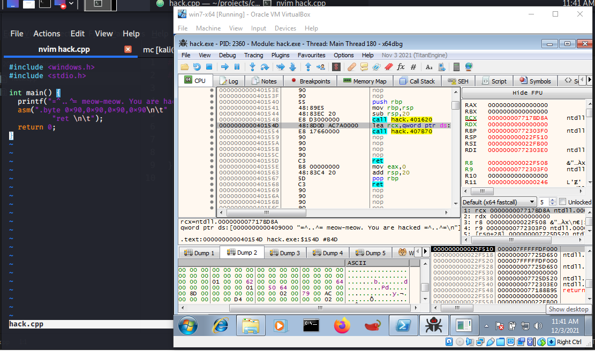
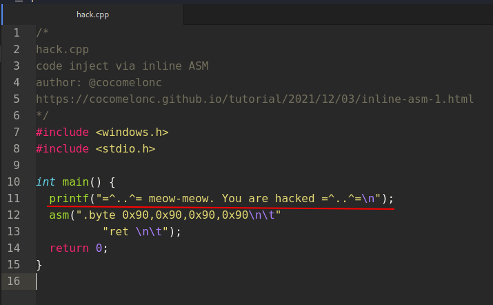
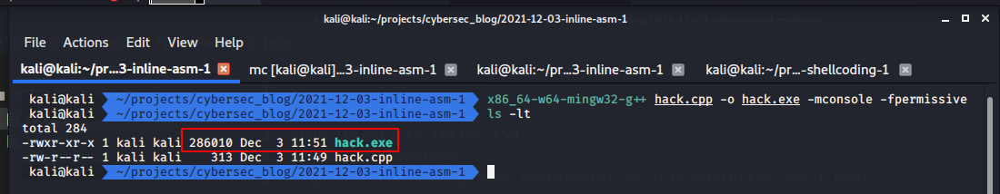
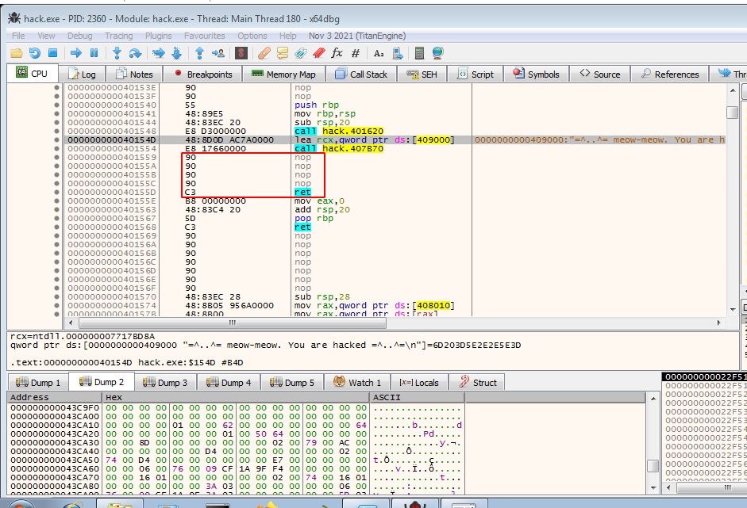

\newpage
\subsection{20. Запуск шеллкода через inline ASM. Простой пример на C++.}

﷽

{width="80%"}    

Этот раздел очень короткий и описывает пример использования встроенного ассемблера для запуска шеллкода во вредоносном коде.   

Рассмотрим исходный код примера на C++:

```cpp
/*
hack.cpp
инъекция кода через inline ASM
автор: @cocomelonc
https://cocomelonc.github.io/tutorial/
2021/12/03/inline-asm-1.html
*/
#include <windows.h>
#include <stdio.h>

int main() {
  printf("=^..^= meow-meow. You are hacked =^..^=\n");
  asm(".byte 0x90,0x90,0x90,0x90\n\t"
          "ret \n\t");
  return 0;
}
```

Как видно, логика проста: я просто добавил 4 инструкции `NOP` и перед этим вывожу строку `meow-meow`. В отладчике я легко могу найти шеллкод, ориентируясь на эту строку `meow`:   

{width="80%"}    

Компилируем:   
```bash
x86_64-w64-mingw32-g++ hack.cpp -o hack.exe \
-mconsole -fpermissive
```

{width="80%"}    

Запускаем в `x96dbg` (в моем случае на `Windows 7 x64`):

{width="80%"}    

Как видно, выделенные инструкции - это мои `NOP`, так что всё работает идеально, как и ожидалось.    

Преимущество этой техники в том, что она не требует выделения новой памяти `RWX` для копирования шеллкода с помощью `VirtualAlloc`, что является более популярным, подозрительным методом и часто проверяется специалистами по безопасности (синими командами). 

Я надеюсь, что этот пост повысит осведомленность синих команд об этой интересной технике и добавит ещё одно оружие в арсенал красных команд.    

[Встроенный ассемблер](https://docs.microsoft.com/en-us/cpp/assembler/inline/inline-assembler?view=msvc-170)    
[Исходный код на Github](https://github.com/cocomelonc/2021-12-03-inline-asm-1)
