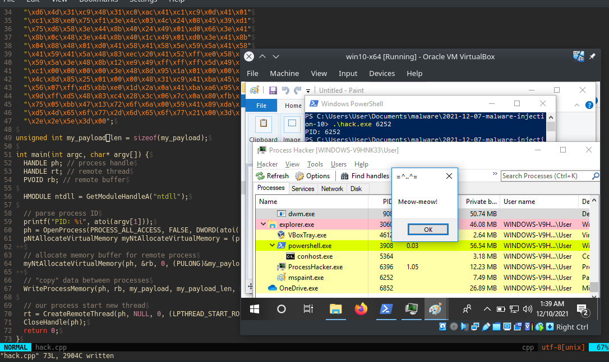
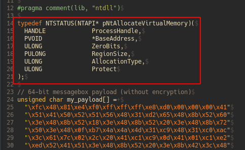
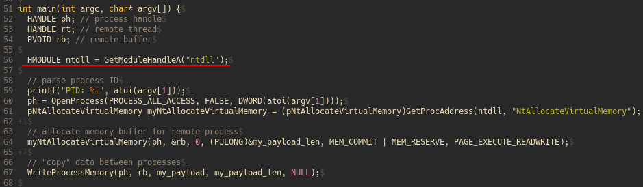
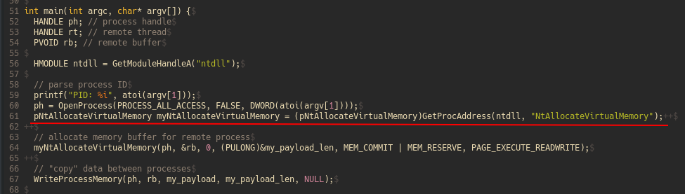
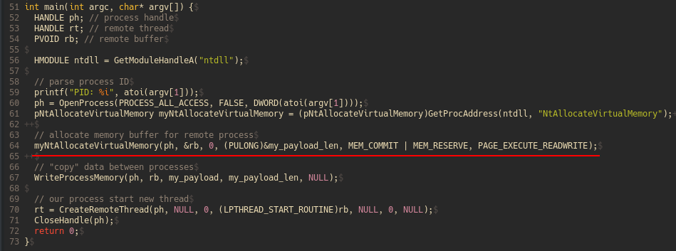
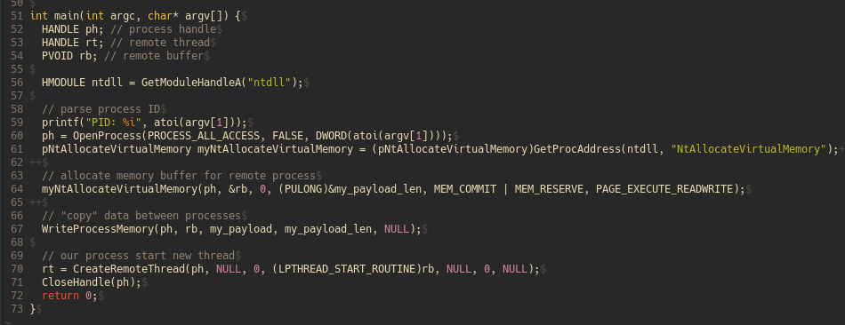
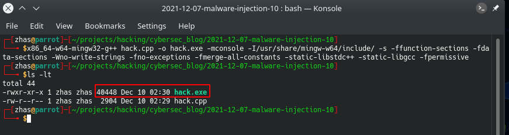
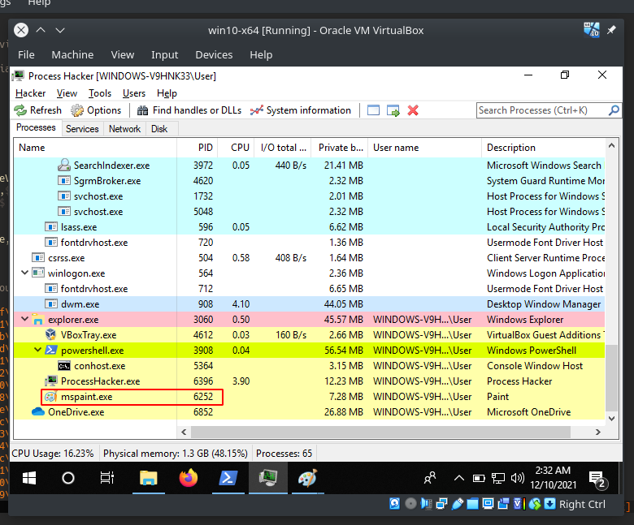
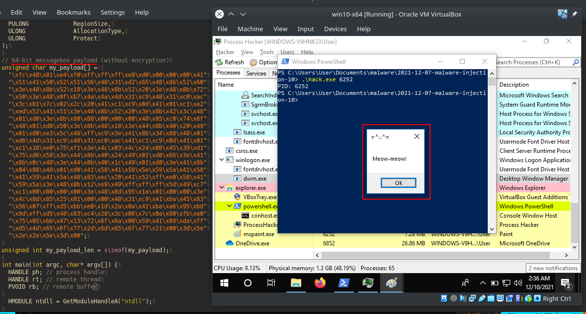
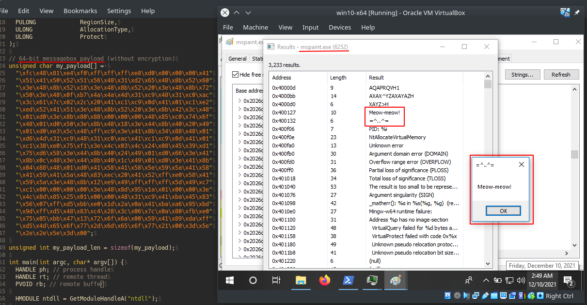

\newpage
\subsection{22. инъекция кода через недокументированную функцию NtAllocateVirtualMemory. Простой пример на C++.}

الرَّحِيمِ الرَّحْمَٰنِ للَّهِ بِسْمِ 

{width="80%"}    

В предыдущем разделе я писал о DLL-инъекции через недокументированную функцию `NtCreateThreadEx`.    

Сегодня я попробовал заменить другую функцию, например, `VirtualAllocEx` на недокументированную функцию NT API `NtAllocateVirtualMemory`. Вот что из этого вышло. Давайте разберем, как можно внедрить полезную нагрузку в удаленный процесс, используя функции WIN API `WriteProcessMemory`, `CreateRemoteThread`, а также официально недокументированный Native API `NtAllocateVirtualMemory`.    

Прежде всего, рассмотрим синтаксис функции `NtAllocateVirtualMemory`:

```cpp
NTSYSAPI 
NTSTATUS
NTAPI NtAllocateVirtualMemory(
  IN HANDLE               ProcessHandle,
  IN OUT PVOID            *BaseAddress,
  IN ULONG                ZeroBits,
  IN OUT PULONG           RegionSize,
  IN ULONG                AllocationType,
  IN ULONG                Protect
);
```
Что делает эта функция? Согласно [документации](https://docs.microsoft.com/en-us/windows-hardware/drivers/ddi/ntifs/nf-ntifs-ntallocatevirtualmemory), она резервирует, выделяет или делает и то, и другое для области страниц в пользовательском адресном пространстве указанного процесса. То есть, она похожа на Win API `VirtualAllocEx`.    

Для использования функции `NtAllocateVirtualMemory` нам необходимо определить её сигнатуру в коде:

{width="80%"}    

Затем загружаем библиотеку `ntdll.dll`, чтобы вызвать `NtAllocateVirtualMemory`:    

{width="80%"}    

Далее получаем начальный адрес нашей функции:   

{width="80%"}    

И, наконец, выделяем память:   

{width="80%"}    

Во всем остальном основная логика остается прежней.    

{width="80%"}    

Как показано в этом коде, вызовы Windows API могут быть заменены на функции Native API. Например, `VirtualAllocEx` можно заменить на `NtAllocateVirtualMemory`, а `WriteProcessMemory` на `NtWriteProcessMemory`. 

Недостатком этого метода является то, что функция `NtAllocateVirtualMemory` недокументирована, поэтому в будущем она может измениться. 

Теперь давайте посмотрим на наш простой вредоносный код в действии. Компилируем `hack.cpp`:

```bash
x86_64-w64-mingw32-g++ hack.cpp -o hack.exe -mconsole \
-I/usr/share/mingw-w64/include/ -s -ffunction-sections \
-fdata-sections -Wno-write-strings -fno-exceptions \
-fmerge-all-constants -static-libstdc++ -static-libgcc \
-fpermissive
```

{width="80%"}    

Запускаем Process Hacker 2:

{width="80%"}    

Например, выделенный процесс `mspaint.exe` - это наша "жертва".    

Запускаем наше вредоносное ПО:   
```cmd
.\hack.exe 6252
```

{width="80%"}    

Как видно, наше всплывающее окно `meow-meow` появилось.    

Теперь исследуем свойства процесса жертвы `PID: 6252`:   

{width="80%"}    

Как видно, наш `meow-meow` успешно внедрен, как и ожидалось!    

Преимущество этой техники в том, что мы не используем `VirtualAllocEx`, который является более популярным, а значит, более подозрительным и чаще проверяется синими командами.    

Я надеюсь, что этот раздел повысит осведомленность синих команд об этой интересной технике и добавит ещё одно оружие в арсенал красных команд.    

В следующем разделе я попробую рассмотреть другие функции NT API, основная логика остается той же, но есть нюанс, связанный с определением структур и соответствующих параметров. Без их определения код работать не будет.

[VirtualAllocEx](https://docs.microsoft.com/en-us/windows/win32/api/memoryapi/nf-memoryapi-virtualallocex)    
[NtAllocateVirtualMemory](https://docs.microsoft.com/en-us/windows-hardware/drivers/ddi/ntifs/nf-ntifs-ntallocatevirtualmemory)    
[WriteProcessMemory](https://docs.microsoft.com/en-us/windows/win32/api/memoryapi/nf-memoryapi-writeprocessmemory)    
[CreateRemoteThread](https://docs.microsoft.com/en-us/windows/win32/api/processthreadsapi/nf-processthreadsapi-createremotethread)    
[исходный код на Github](https://github.com/cocomelonc/2021-12-07-malware-injection-10)    
