\newpage
\subsection{23. Инъекция кода через недокументированные функции Native API. Простой пример на C++.}

﷽

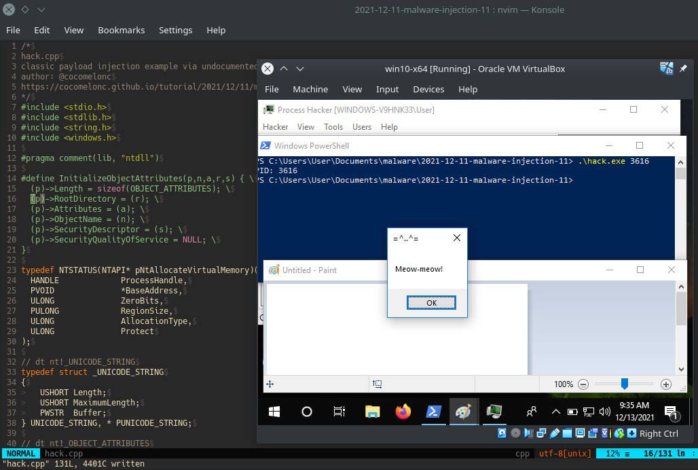{width="80%"}    

В предыдущих разделах я писал о DLL-инъекции через недокументированные функции `NtCreateThreadEx` и `NtAllocateVirtualMemory`.    

Этот пост является результатом самостоятельного изучения техник разработки вредоносного ПО, а именно взаимодействия с недокументированными функциями Native API.    

Сегодня я попробовал заменить ещё одну функцию, `OpenProcess`, на недокументированную функцию Native API `NtOpenProcess`.    

Прежде всего, рассмотрим синтаксис функции `NtOpenProcess`:    
```cpp
__kernel_entry NTSYSCALLAPI NTSTATUS NtOpenProcess(
  [out]          PHANDLE            ProcessHandle,
  [in]           ACCESS_MASK        DesiredAccess,
  [in]           POBJECT_ATTRIBUTES ObjectAttributes,
  [in, optional] PCLIENT_ID         ClientId
);
```

Здесь стоит обратить внимание на параметры `ObjectAttributes` и `ClientId`. `ObjectAttributes` — это указатель на структуру `OBJECT_ATTRIBUTES`, которая определяет атрибуты, применяемые к дескриптору объекта процесса. Она должна быть определена и инициализирована перед открытием дескриптора. `ClientId` — это указатель на `CLIENT_ID`, который идентифицирует поток, чей процесс должен быть открыт.    

Для использования функции `NtOpenProcess` нам необходимо определить её сигнатуру в коде:

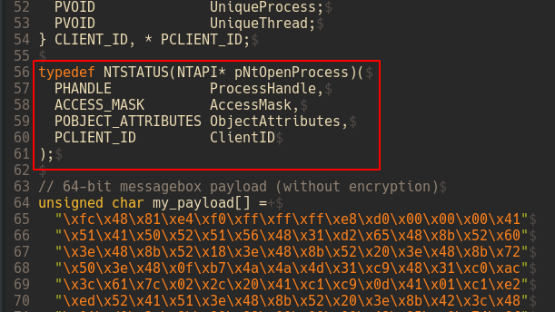{width="80%"}    

Аналогично, `OBJECT_ATTRIBUTES` и `PCLIENT_ID` также должны быть определены. Эти структуры объявлены в заголовочных файлах ядра NT.    

Можно запустить `WinDBG` в локальном режиме ядра и выполнить команду:    
```bash
dt nt!_OBJECT_ATTRIBUTES
```

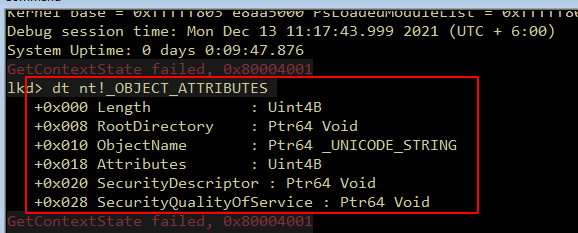{width="80%"}    

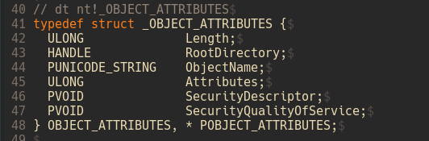{width="80%"}    

Затем выполнить:
```bash
dt nt!_CLIENT_ID
```

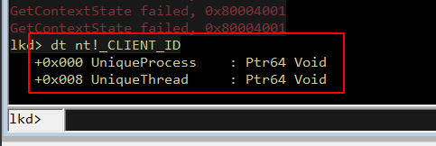{width="80%"}    

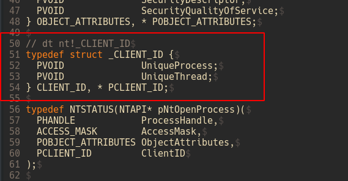{width="80%"}    

И далее:
```bash
dt nt!_UNICODE_STRING
```

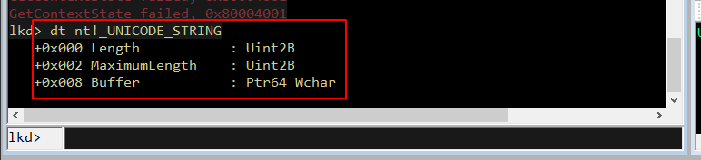{width="80%"}    

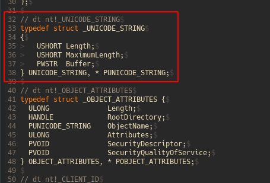{width="80%"}    

Есть ещё один нюанс. Прежде чем функция `NtOpenProcess` вернёт дескриптор, необходимо инициализировать `ObjectAttributes`, который будет применяться к этому дескриптору. Для этого используется макрос `InitializeObjectAttributes`, который определяет свойства объекта для функций, открывающих дескрипторы.    

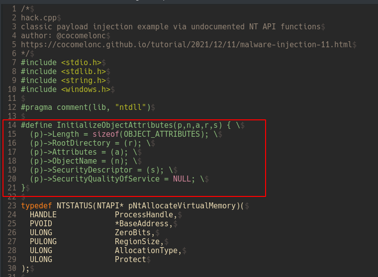{width="80%"}    

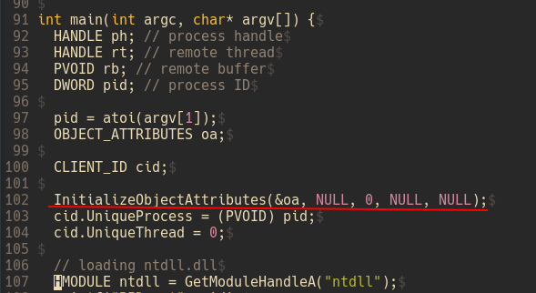{width="80%"}    

> [InitializeObjectAttributes](https://docs.microsoft.com/en-us/windows/win32/api/ntdef/nf-ntdef-initializeobjectattributes)

Затем загружаем библиотеку `ntdll.dll`, чтобы вызвать `NtOpenProcess`:    

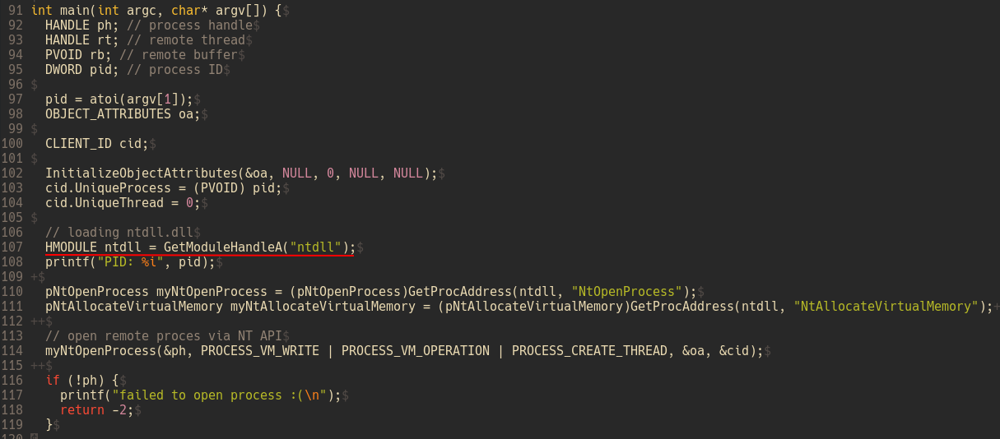{width="80%"}    

Далее получаем начальные адреса наших функций:   

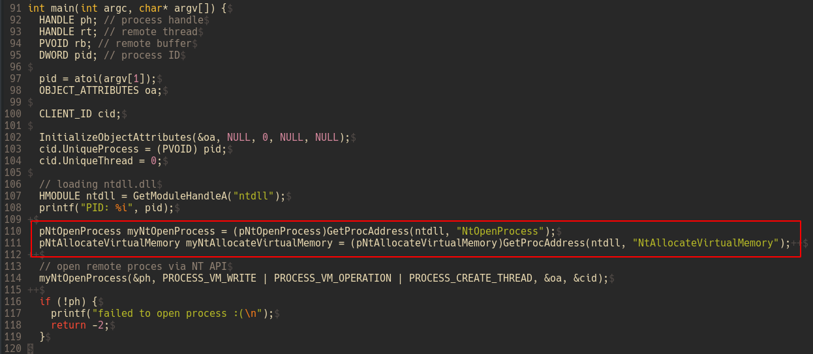{width="80%"}    

И, наконец, открываем процесс:   

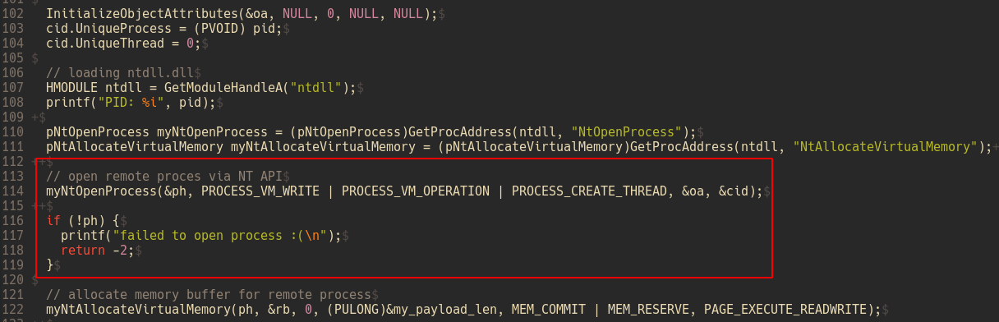{width="80%"}    

В остальном основная логика остаётся той же.     

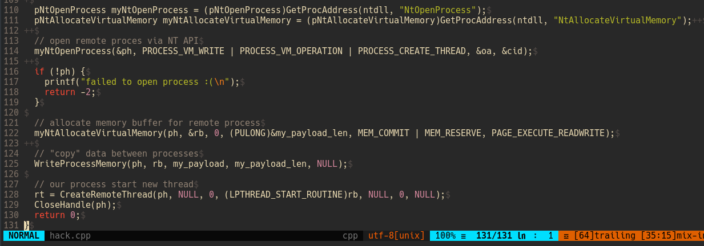{width="80%"}    

Как показано в этом коде, вызов Windows API `OpenProcess` можно заменить на функцию Native API `NtOpenProcess`. Однако для этого необходимо определить структуры, которые объявлены в заголовочных файлах ядра NT.    

Недостатком этого метода является то, что функция `NtOpenProcess` недокументирована, поэтому в будущем она может измениться.    

Теперь давайте посмотрим наш вредоносный код в действии. Компилируем `hack.cpp`:
```bash
x86_64-w64-mingw32-g++ hack.cpp -o hack.exe -mconsole \
-I/usr/share/mingw-w64/include/ -s -ffunction-sections \
-fdata-sections -Wno-write-strings -fno-exceptions \
-fmerge-all-constants -static-libstdc++ -static-libgcc \
-fpermissive
```

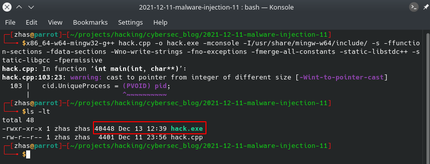{width="80%"}    

Запускаем Process Hacker 2:

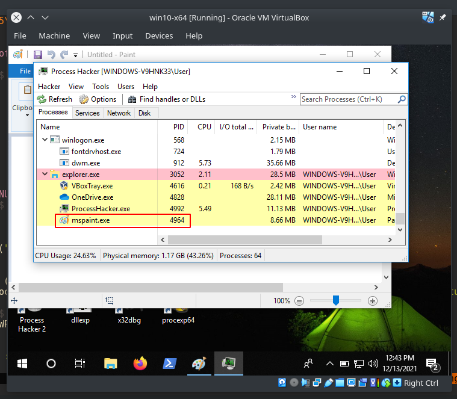{width="80%"}    

Например, выделенный процесс `mspaint.exe` — это наша "жертва".    

Запускаем наше вредоносное ПО:   
```cmd
.\hack.exe 4964
```

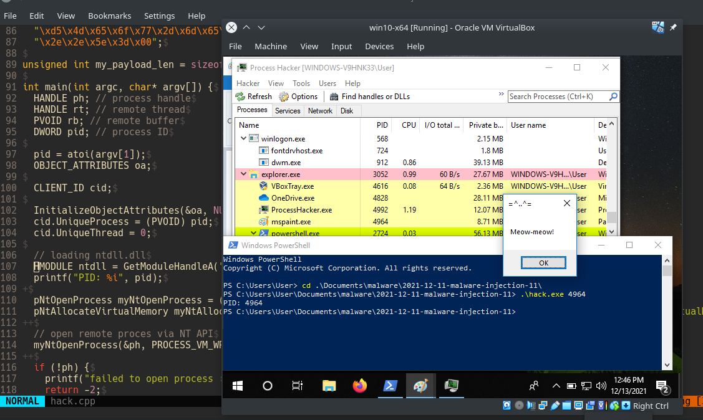{width="80%"}    

{width="80%"}    

Как видно, наше всплывающее окно `meow-meow` появилось.    

Теперь исследуем свойства процесса жертвы `PID: 4964`:   

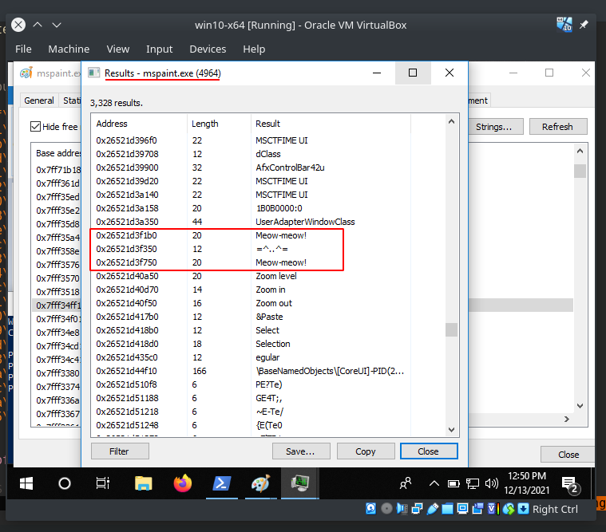{width="80%"}    

Как видно, наш `meow-meow` успешно внедрен, как и ожидалось!    

Основная логика остается той же, что и в предыдущих техниках вызова функций NT API, но есть нюанс с определением структур и соответствующих параметров. Без их определения код работать не будет.    

Преимущество этой техники в том, что мы не используем `OpenProcess`, который является более популярным, а значит, более подозрительным и чаще проверяется синими командами.    

Загружаем наш новый `hack.exe` с зашифрованной командой на Virustotal (13.12.2021):

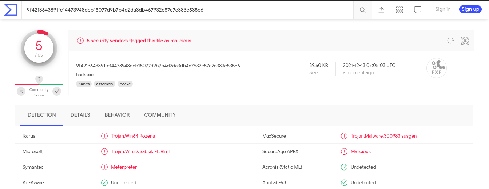{width="80%"}    

[https://www.virustotal.com/gui/file/9f4213643891fc14473948deb15077d9b7b4d2da3db467932e57e7e383e535e6?nocache=1](https://www.virustotal.com/gui/file/9f4213643891fc14473948deb15077d9b7b4d2da3db467932e57e7e383e535e6?nocache=1)    

**Итак, 5 из 65 антивирусных движков обнаруживают наш файл как вредоносный.** 

Если мы хотим добиться лучшего результата, мы можем добавить [шифрование полезной нагрузки](https://cocomelonc.github.io/tutorial/2021/09/04/simple-malware-av-evasion.html) с ключом или [обфусцировать](https://cocomelonc.github.io/tutorial/2021/09/06/simple-malware-av-evasion-2.html) функции, либо комбинировать обе эти техники.    

Я надеюсь, что этот раздел повысит осведомленность синих команд об этой интересной технике и добавит ещё одно оружие в арсенал красных команд.

[WinDBG kernel debugging](https://docs.microsoft.com/en-us/windows-hardware/drivers/debugger/performing-local-kernel-debugging)    
[VirtualAllocEx](https://docs.microsoft.com/en-us/windows/win32/api/memoryapi/nf-memoryapi-virtualallocex)    
[NtOpenProcess](https://docs.microsoft.com/en-us/windows-hardware/drivers/ddi/ntddk/nf-ntddk-ntopenprocess)    
[NtAllocateVirtualMemory](https://docs.microsoft.com/en-us/windows-hardware/drivers/ddi/ntifs/nf-ntifs-ntallocatevirtualmemory)    
[WriteProcessMemory](https://docs.microsoft.com/en-us/windows/win32/api/memoryapi/nf-memoryapi-writeprocessmemory)    
[CreateRemoteThread](https://docs.microsoft.com/en-us/windows/win32/api/processthreadsapi/nf-processthreadsapi-createremotethread)    
[исходный код на Github](https://github.com/cocomelonc/2021-12-11-malware-injection-11)    
