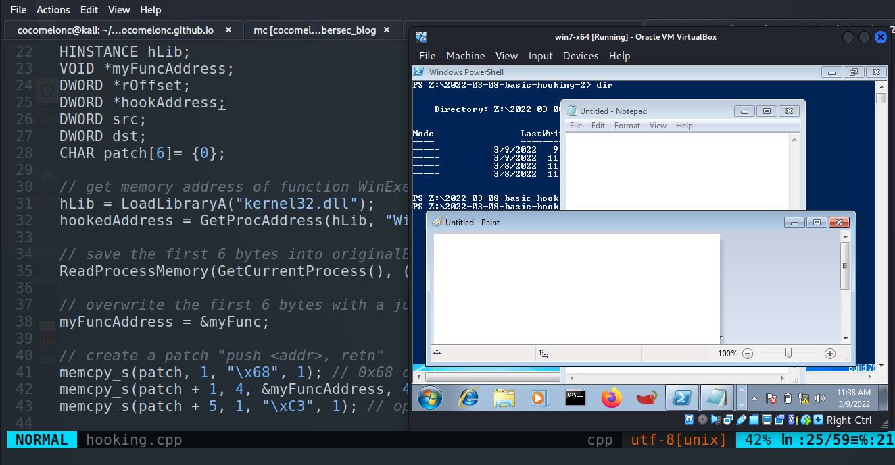
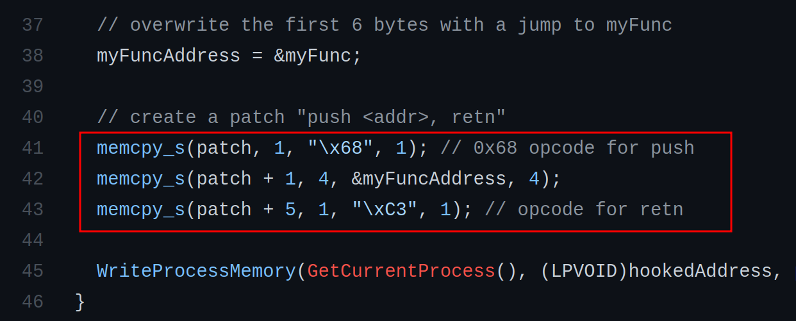
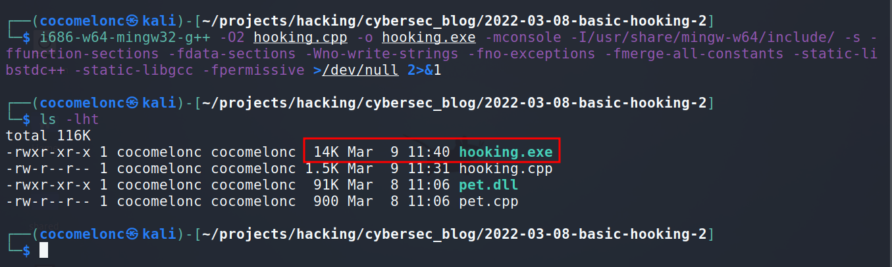
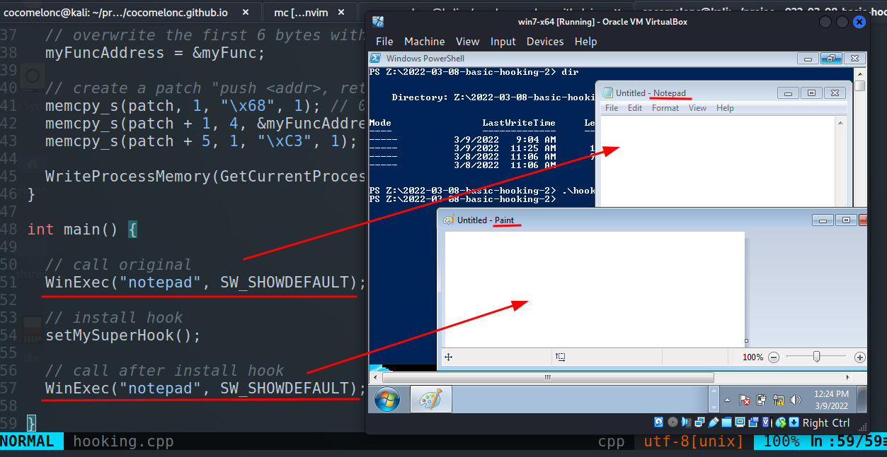

\newpage
\subsection{29. Хуки Windows API. Часть 2. Простой пример на C++.}

الرَّحِيمِ الرَّحْمَٰنِ للَّهِ بِسْمِ 

{width="80%"}    

### Что такое API-хуки?

API-хуки - это техника, позволяющая перехватывать и модифицировать поведение и поток API-вызовов. Эту технику также используют многие антивирусные решения для обнаружения вредоносного кода.    

Самый простой способ перехвата - вставка инструкции `jmp`. В этом разделе я покажу ещё одну технику.    

Этот метод занимает всего шесть байтов и выглядит следующим образом.    

Инструкция `push` помещает 32-битное значение в стек, а `retn` извлекает 32-битный адрес из стека в указатель на инструкцию (Instruction Pointer), другими словами, передаёт выполнение кода по адресу, который находится на вершине стека.    

### пример 1

Рассмотрим пример. В данном случае мы перехватим функцию `WinExec` из `kernel32.dll` (`hooking.cpp`):    

```cpp
/*
hooking.cpp
basic hooking example with push/retn method
author: @cocomelonc
https://cocomelonc.github.io/tutorial/
2022/03/08/basic-hooking-2.html
*/
#include <windows.h>

// buffer for saving original bytes
char originalBytes[6];

FARPROC hookedAddress;

// we will jump to after the hook has been installed
int __stdcall myFunc(LPCSTR lpCmdLine, UINT uCmdShow) {
  WriteProcessMemory(GetCurrentProcess(), 
  (LPVOID)hookedAddress, originalBytes, 6, NULL);
  return WinExec("mspaint", uCmdShow);
}

// hooking logic
void setMySuperHook() {
  HINSTANCE hLib;
  VOID *myFuncAddress;
  DWORD *rOffset;
  DWORD *hookAddress;
  DWORD src;
  DWORD dst;
  CHAR patch[6]= {0};

  // get memory address of function WinExec
  hLib = LoadLibraryA("kernel32.dll");
  hookedAddress = GetProcAddress(hLib, "WinExec");

  // save the first 6 bytes into originalBytes (buffer)
  ReadProcessMemory(GetCurrentProcess(), 
  (LPCVOID) hookedAddress, 
  originalBytes, 6, NULL);

  // overwrite the first 6 bytes with a jump to myFunc
  myFuncAddress = &myFunc;

  // create a patch "push <addr>, retn"
  memcpy_s(patch, 1, "\x68", 1); // 0x68 opcode for push
  memcpy_s(patch + 1, 4, &myFuncAddress, 4);
  memcpy_s(patch + 5, 1, "\xC3", 1); // opcode for retn

  WriteProcessMemory(GetCurrentProcess(), 
  (LPVOID)hookedAddress, patch, 6, NULL);
}

int main() {

  // call original
  WinExec("notepad", SW_SHOWDEFAULT);

  // install hook
  setMySuperHook();

  // call after install hook
  WinExec("notepad", SW_SHOWDEFAULT);

}

```

Как видно, исходный код идентичен примеру из первого раздела про хуки. Единственное отличие:    

{width="80%"}    

Этот код переводится в следующие инструкции ассемблера:    

`push myFunc`  ; поместить в стек адрес функции myFunc
`retn`         ; перейти к выполнению myFunc

### демо

Компилируем:    

```bash
i686-w64-mingw32-g++ -O2 hooking.cpp -o hooking.exe \
-mconsole -I/usr/share/mingw-w64/include/ -s \
-ffunction-sections -fdata-sections -Wno-write-strings \
-fno-exceptions -fmerge-all-constants -static-libstdc++ \
-static-libgcc -fpermissive >/dev/null 2>&1
```

{width="80%"}    

Запускаем на `Windows 7 x64`:    

```cmd
.\hooking.exe
```

{width="80%"}    

Как видно, всё работает идеально! :)

[x86 API Hooking Demystified](http://jbremer.org/x86-api-hooking-demystified/)    
[WinExec](https://docs.microsoft.com/en-us/windows/win32/api/winbase/nf-winbase-winexec)    
[исходный код на github](https://github.com/cocomelonc/2022-03-08-basic-hooking-2)
