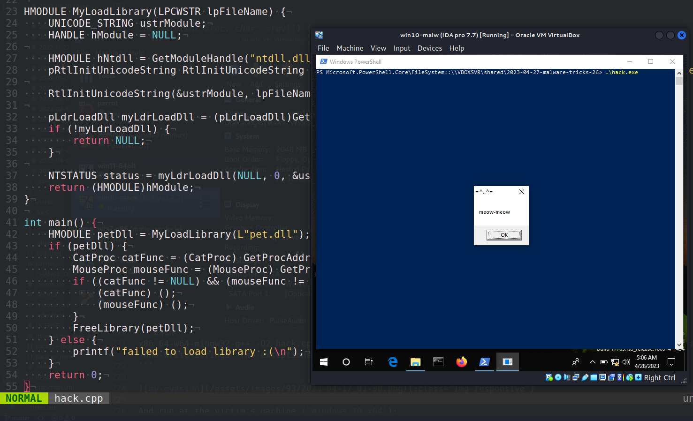
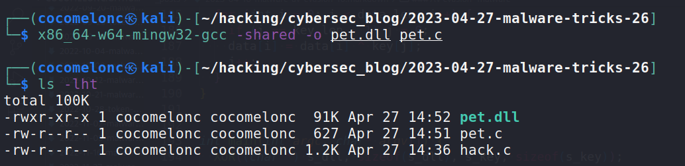
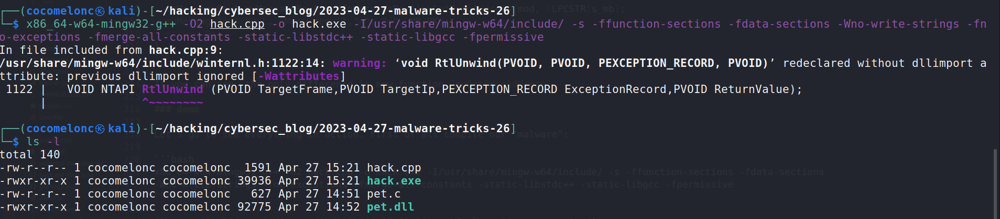
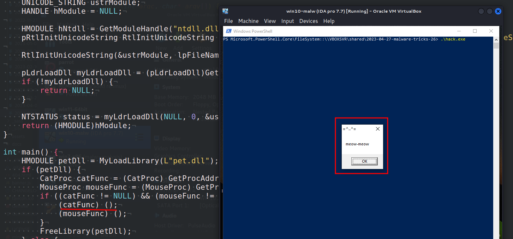
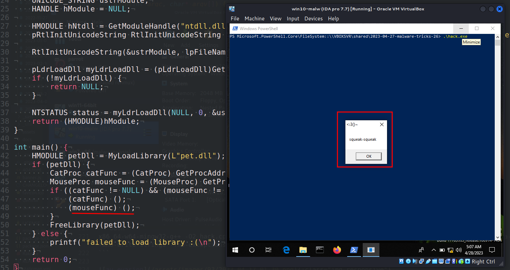
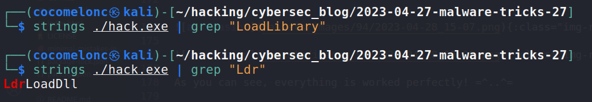

\newpage
\subsection{40. трюк разработки вредоносного ПО. Реализация WinAPI LoadLibrary. Простой пример на C++.}

الرَّحِيمِ الرَّحْمَٰنِ للَّهِ بِسْمِ 

{width="80%"}      

Сегодня я хочу сосредоточить своё исследование на ещё одном трюке разработки вредоносного ПО: он также может быть полезен для обхода антивирусов в некоторых случаях и сценариях. Как и в предыдущих постах с реализациями [GetModuleHandle](https://cocomelonc.github.io/malware/2023/04/08/malware-av-evasion-15.html) и [GetProcAddress](https://cocomelonc.github.io/malware/2023/04/16/malware-av-evasion-16.html), что если создать свою собственную реализацию `LoadLibrary`? Давайте попробуем.    

### LoadLibrary

`LoadLibrary` - это функция Windows API, которая позволяет загружать модуль динамической библиотеки (`DLL`) в адресное пространство вызывающего процесса. Функция принимает имя `DLL` в качестве аргумента и возвращает дескриптор загруженного модуля. В случае ошибки функция возвращает `NULL`:    

```cpp
HMODULE LoadLibraryA(
  LPCSTR lpLibFileName
);
```

`lpFileName` - null-терминированная строка, указывающая имя модуля (файл `.dll` или `.exe`).     

### практический пример

Сначала создадим свою собственную `DLL`. Например, вот такую (`pet.c`):     

```cpp
/*
pet.dll - пример DLL для LoadLibrary
*/

#include <windows.h>
#pragma comment (lib, "user32.lib")

BOOL APIENTRY DllMain(HMODULE hModule,  DWORD  ul_reason_for_call, LPVOID lpReserved) {
  switch (ul_reason_for_call) {
    case DLL_PROCESS_ATTACH:
      break;
    case DLL_PROCESS_DETACH:
      break;
    case DLL_THREAD_ATTACH:
      break;
    case DLL_THREAD_DETACH:
      break;
  }
  return TRUE;
}

__declspec(dllexport) int _cdecl Cat() {
  MessageBox(NULL, "meow-meow", "=^..^=", MB_OK);
  return 1;
}

__declspec(dllexport) int _cdecl Mouse() {
  MessageBox(NULL, "squeak-squeak", "<:3()~", MB_OK);
  return 1;
}
```

Затем создадим приложение, которое загружает эту `DLL`. Простая реализация логики `LoadLibrary` выглядит следующим образом:   

```cpp
/*
 * hack.c - LoadLibrary implementation. C++ implementation
 * @cocomelonc
 * https://cocomelonc.github.io/tutorial/2023/04/27/malware-tricks-27.html
*/
#include <stdlib.h>
#include <stdio.h>
#include <windows.h>
#include <winternl.h>

typedef int (__cdecl *CatProc)();
typedef int (__cdecl *MouseProc)();

typedef NTSTATUS(NTAPI *pLdrLoadDll) (
    PWCHAR PathToFile,
    ULONG Flags,
    PUNICODE_STRING ModuleFileName,
    PHANDLE ModuleHandle
);

typedef VOID (NTAPI *pRtlInitUnicodeString)(PUNICODE_STRING DestinationString,
 PCWSTR SourceString);

HMODULE MyLoadLibrary(LPCWSTR lpFileName) {
    UNICODE_STRING ustrModule;
    HANDLE hModule = NULL;

    HMODULE hNtdll = GetModuleHandle("ntdll.dll");
    pRtlInitUnicodeString RtlInitUnicodeString = 
    (pRtlInitUnicodeString)GetProcAddress(hNtdll, "RtlInitUnicodeString");

    RtlInitUnicodeString(&ustrModule, lpFileName);

    pLdrLoadDll myLdrLoadDll = (pLdrLoadDll)
    GetProcAddress(GetModuleHandle("ntdll.dll"), "LdrLoadDll");
    if (!myLdrLoadDll) {
        return NULL;
    }

    NTSTATUS status = myLdrLoadDll(NULL, 0, &ustrModule, &hModule);
    return (HMODULE)hModule;
}

int main() {
    HMODULE petDll = MyLoadLibrary(L"pet.dll");
    if (petDll) {
        CatProc catFunc = (CatProc) GetProcAddress(petDll, "Cat");
        MouseProc mouseFunc = (MouseProc) GetProcAddress(petDll, "Mouse");
        if ((catFunc != NULL) && (mouseFunc != NULL)) {
            (catFunc) ();
            (mouseFunc) ();
        }
        FreeLibrary(petDll);
    } else {
        printf("failed to load library :(\n");
    }
    return 0;
}
```

Эта реализация использует недокументированную функцию `LdrLoadDll`:    

```cpp
NTSYSAPI 
NTSTATUS
NTAPI
LdrLoadDll(
  IN PWCHAR               PathToFile OPTIONAL,
  IN ULONG                Flags OPTIONAL,
  IN PUNICODE_STRING      ModuleFileName,
  OUT PHANDLE             ModuleHandle );
```

которая является частью библиотеки `ntdll.dll`. Используя функцию `LdrLoadDll`, мы можем вручную загрузить библиотеку, передав необходимые параметры.    

Итак, можем ли мы использовать нашу `DLL` в других приложениях, загружая её с помощью `MyLoadLibrary`? Да, можем. Также, как можно заметить, мы можем получать адреса функций, используя `GetProcAddress`.     

Кроме того, мы используем указатель на функцию `RtlInitUnicodeString` вместо непосредственного вызова функции.        

### демонстрация

Давайте посмотрим всё в действии. Сначала компилируем наш `pet.c`:    

```bash
x86_64-w64-mingw32-gcc -shared -o pet.dll pet.c
```

{width="80%"}      

Затем компилируем наше "вредоносное" приложение (`hack.cpp`):     

```bash
x86_64-w64-mingw32-g++ -O2 hack.cpp -o hack.exe \
-I/usr/share/mingw-w64/include/ -s \
-ffunction-sections -fdata-sections -Wno-write-strings \
-fno-exceptions -fmerge-all-constants -static-libstdc++ \
-static-libgcc -fpermissive
```

{width="80%"}      

Наконец, запускаем его на машине жертвы (`Windows 10 x64`):     

```powershell
.\hack.exe
```

{width="80%"}      

{width="80%"}      

{width="80%"}        

Как можно заметить, всё сработало идеально! =^..^=    

Надеюсь, этот пост повысит осведомлённость синих команд об этой интересной технике разработки вредоносного ПО и добавит оружие в арсенал красных команд.      

[LoadLibrary](https://learn.microsoft.com/en-us/windows/win32/api/libloaderapi/nf-libloaderapi-loadlibrarya)     
[GetProcAddress](https://learn.microsoft.com/en-us/windows/win32/api/libloaderapi/nf-libloaderapi-getprocaddress)    
[GetModuleHandle](https://docs.microsoft.com/en-us/windows/win32/api/libloaderapi/nf-libloaderapi-getmodulehandlea)     
[RtlInitUnicodeString](https://learn.microsoft.com/en-us/windows-hardware/drivers/ddi/wdm/nf-wdm-rtlinitunicodestring)    
[исходный код на Github](https://github.com/cocomelonc/meow/tree/master/2023-04-27-malware-tricks-27)     
