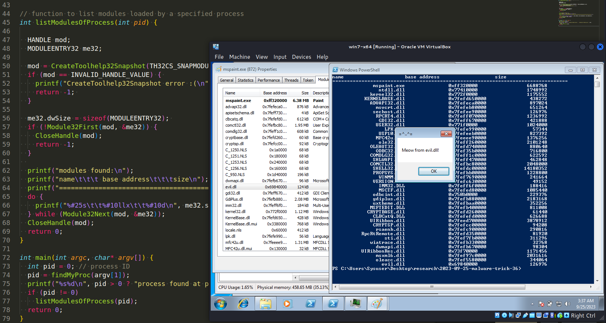
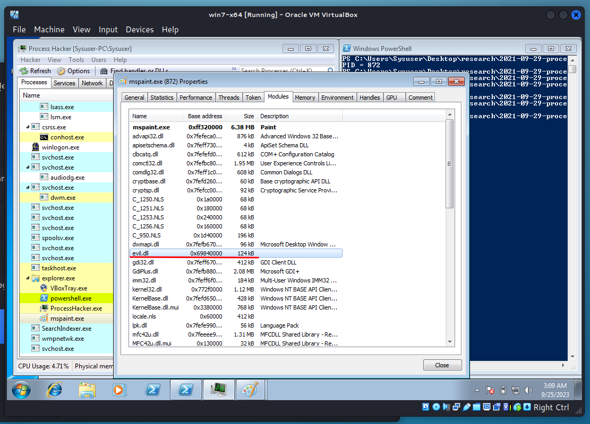
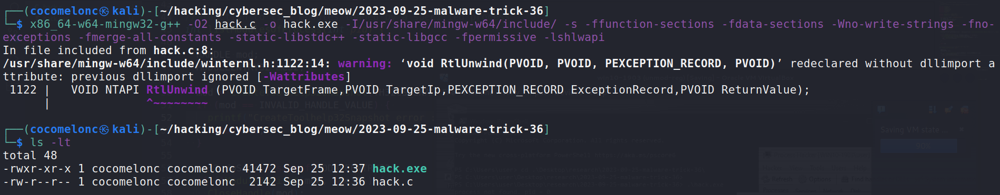
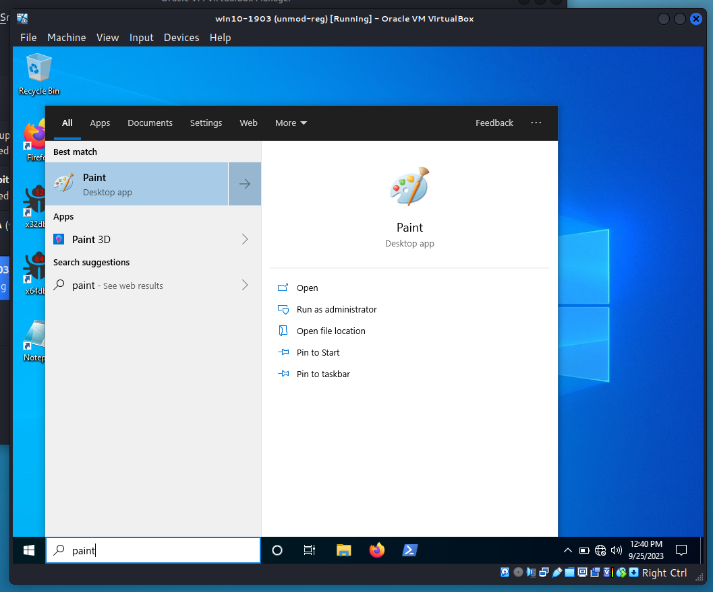
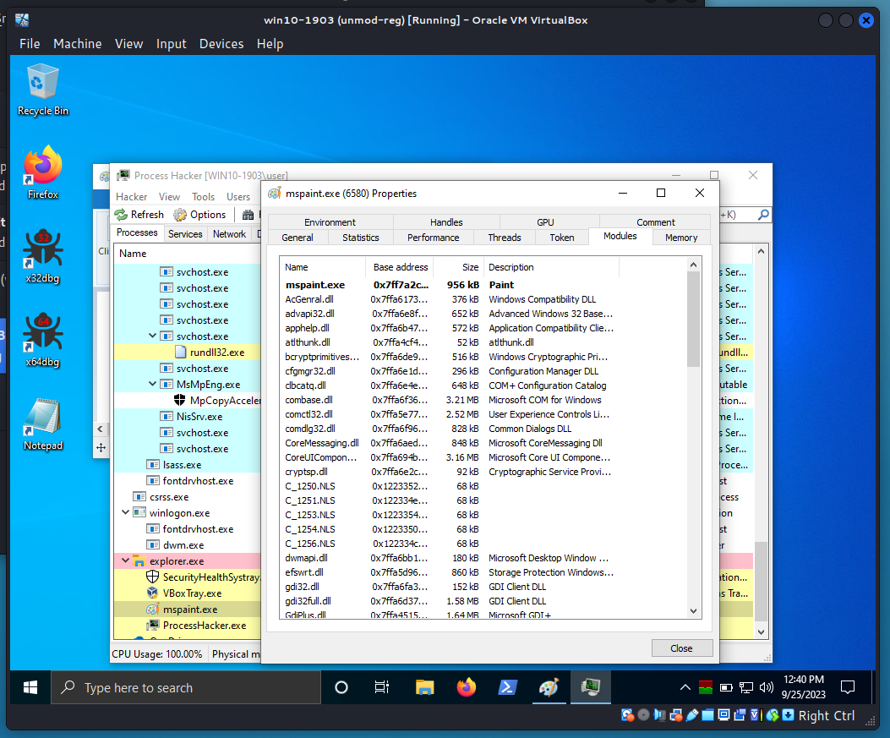
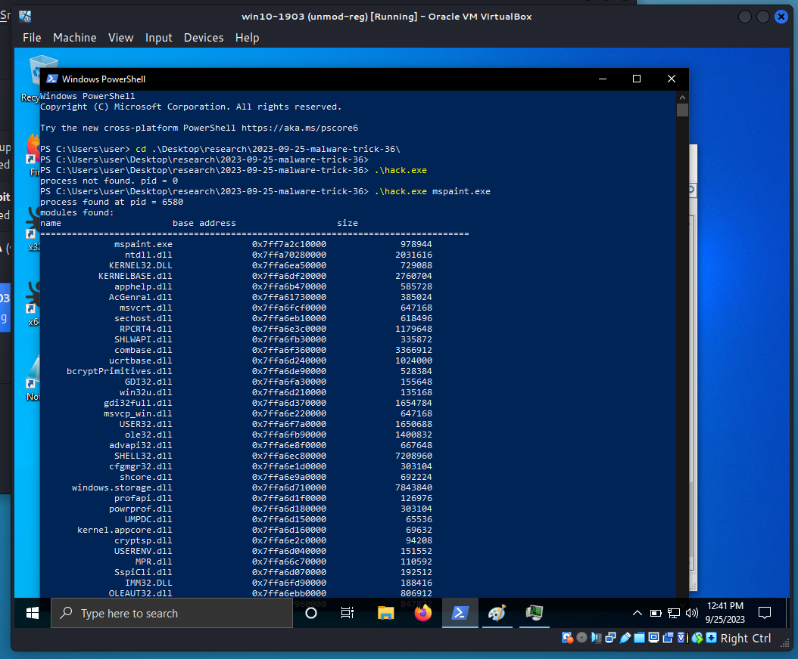
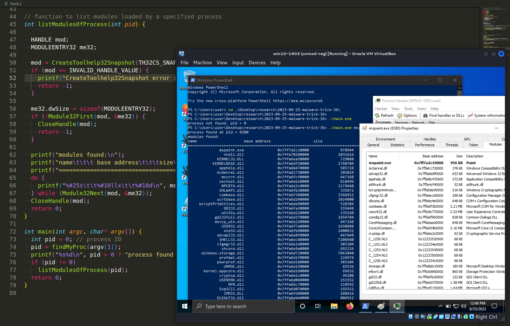
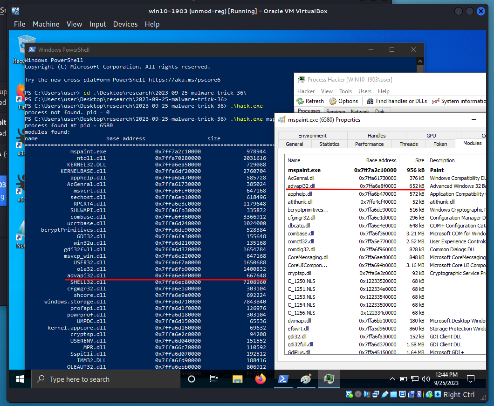
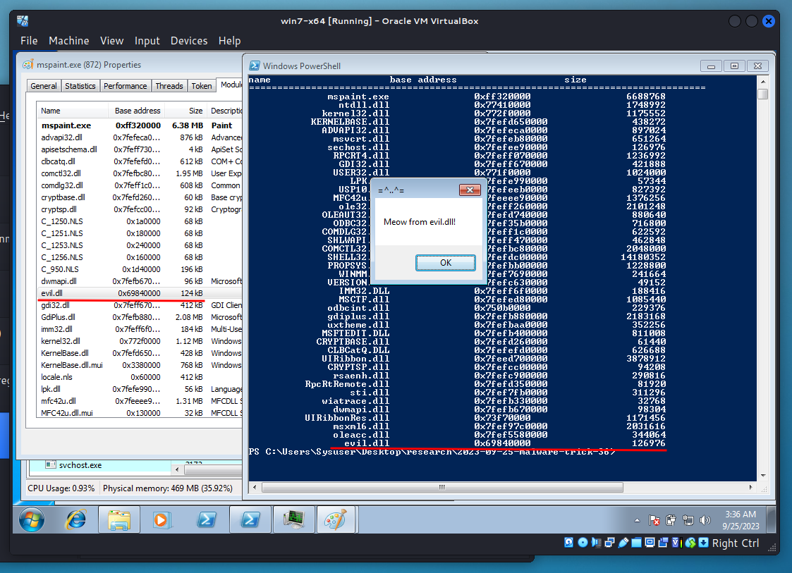

\newpage
\subsection{47. трюк разработки вредоносного ПО. Перечисление модулей процесса. Простой пример на C++.}

الرَّحِيمِ الرَّحْمَٰنِ للَّهِ بِسْمِ 

{width="80%"}      

Сегодня этот пост является результатом моего собственного исследования ещё одного популярного трюка разработки вредоносного ПО: получение списка модулей целевого процесса.     

Допустим, мы успешно внедрили DLL в процесс. Как проверить, находится ли DLL в списке модулей нашего процесса?     

{width="80%"}      

### практический пример

Прежде всего, мы используем один из методов для поиска PID целевого процесса. Например, я использовал [этот](https://cocomelonc.github.io/malware/2023/05/26/malware-tricks-30.html):     

```cpp
typedef NTSTATUS (NTAPI * fNtGetNextProcess)(
  _In_ HANDLE ph,
  _In_ ACCESS_MASK DesiredAccess,
  _In_ ULONG HandleAttributes,
  _In_ ULONG Flags,
  _Out_ PHANDLE Newph
);

int findMyProc(const char * procname) {
  int pid = 0;
  HANDLE current = NULL;
  char procName[MAX_PATH];

  // resolve function address
  fNtGetNextProcess myNtGetNextProcess = 
  (fNtGetNextProcess) GetProcAddress(GetModuleHandle("ntdll.dll"), "NtGetNextProcess");

  // loop through all processes
  while (!myNtGetNextProcess(current, MAXIMUM_ALLOWED, 0, 0, &current)) {
    GetProcessImageFileNameA(current, procName, MAX_PATH);
    if (lstrcmpiA(procname, PathFindFileName((LPCSTR) procName)) == 0) {
      pid = GetProcessId(current);
      break;
    }
  }

  return pid;
}
```

Затем просто используем функции `Module32First` и `Module32Next` из Windows API.     

```cpp
// function to list modules loaded by a specified process
int listModulesOfProcess(int pid) {

  HANDLE mod;
  MODULEENTRY32 me32;

  mod = CreateToolhelp32Snapshot(TH32CS_SNAPMODULE | TH32CS_SNAPMODULE32, pid);
  if (mod == INVALID_HANDLE_VALUE) { 
    printf("CreateToolhelp32Snapshot error :(\n"); 
    return -1; 
  }

  me32.dwSize = sizeof(MODULEENTRY32); 
  if (!Module32First(mod, &me32)) {
    CloseHandle(mod);
    return -1;
  }
  
  printf("modules found:\n");
  printf("name\t\t\t base address\t\t\tsize\n");
  printf("======================================================================\n");
  do {
    printf("%#25s\t\t%#10llx\t\t%#10d\n", me32.szModule, me32.modBaseAddr, 
    me32.modBaseSize);
  } while (Module32Next(mod, &me32));
  CloseHandle(mod);
  return 0;
}
```

Как можно заметить, этот код немного похож на логику поиска PID с использованием `CreateToolHelp32Snapshot`, `Process32First` и `Process32Next`.      

Таким образом, полный исходный код выглядит следующим образом (`hack.c`):     

```cpp
/*
 * hack.c - get the list of modules of the process. C++ implementation
 * @cocomelonc
 * https://cocomelonc.github.io/malware/2023/09/25/malware-tricks-36.html
*/
#include <windows.h>
#include <stdio.h>
#include <winternl.h>
#include <tlhelp32.h>
#include <shlwapi.h>
#include <psapi.h>

#pragma comment(lib, "ntdll.lib")
#pragma comment(lib, "shlwapi.lib")

typedef NTSTATUS (NTAPI * fNtGetNextProcess)(
  _In_ HANDLE ph,
  _In_ ACCESS_MASK DesiredAccess,
  _In_ ULONG HandleAttributes,
  _In_ ULONG Flags,
  _Out_ PHANDLE Newph
);

int findMyProc(const char * procname) {
  int pid = 0;
  HANDLE current = NULL;
  char procName[MAX_PATH];

  // resolve function address
  fNtGetNextProcess myNtGetNextProcess = 
  (fNtGetNextProcess) GetProcAddress(GetModuleHandle("ntdll.dll"), "NtGetNextProcess");

  // loop through all processes
  while (!myNtGetNextProcess(current, MAXIMUM_ALLOWED, 0, 0, &current)) {
    GetProcessImageFileNameA(current, procName, MAX_PATH);
    if (lstrcmpiA(procname, PathFindFileName((LPCSTR) procName)) == 0) {
      pid = GetProcessId(current);
      break;
    }
  }

  return pid;
}

// function to list modules loaded by a specified process
int listModulesOfProcess(int pid) {

  HANDLE mod;
  MODULEENTRY32 me32;

  mod = CreateToolhelp32Snapshot(TH32CS_SNAPMODULE | TH32CS_SNAPMODULE32, pid);
  if (mod == INVALID_HANDLE_VALUE) { 
    printf("CreateToolhelp32Snapshot error :(\n"); 
    return -1; 
  }

  me32.dwSize = sizeof(MODULEENTRY32); 
  if (!Module32First(mod, &me32)) {
    CloseHandle(mod);
    return -1;
  }
  
  printf("modules found:\n");
  printf("name\t\t\t base address\t\t\tsize\n");
  printf("======================================================================\n");
  do {
    printf("%#25s\t\t%#10llx\t\t%#10d\n", me32.szModule, me32.modBaseAddr, 
    me32.modBaseSize);
  } while (Module32Next(mod, &me32));
  CloseHandle(mod);
  return 0;
}

int main(int argc, char* argv[]) {
  int pid = 0; // process ID
  pid = findMyProc(argv[1]);
  printf("%s%d\n", pid > 0 ? "process found at pid = " : 
  "process not found. pid = ", pid);
  if (pid != 0)
    listModulesOfProcess(pid);
  return 0;
}
```

Вы можете использовать этот код, чтобы проверить, находится ли DLL в списке модулей целевого процесса.      

### демонстрация

Давайте посмотрим эту логику в действии.      

Компилируем:     

```bash
x86_64-w64-mingw32-g++ -O2 hack.c -o hack.exe \
-I/usr/share/mingw-w64/include/ \
-s -ffunction-sections \
-fdata-sections -Wno-write-strings -fno-exceptions \ -fmerge-all-constants -static-libstdc++ -static-libgcc \
-fpermissive -lshlwapi
```

{width="80%"}      

Затем открываем целевой процесс на машине жертвы:     

{width="80%"}      

{width="80%"}      

И просто запускаем наш `hack.exe`:    

```powershell
.\hack.exe mspaint.exe
```

{width="80%"}      

{width="80%"}      

{width="80%"}      

Также проверяем с логикой [DLL-инъекции](https://cocomelonc.github.io/tutorial/2021/09/20/malware-injection-2.html):    

{width="80%"}      

Как можно заметить, всё сработало идеально! =^..^=     

Имейте в виду, что этот код может иметь ограничения и зависеть от специфических API Windows. Кроме того, он использует имя процесса для идентификации, что может не быть уникальным.     

Этот трюк используется в реальной среде вредоносными программами, такими как [4H RAT](https://attack.mitre.org/software/S0065/) и [Aria-body](https://attack.mitre.org/software/S0456/).     

Надеюсь, этот пост повысит осведомлённость синих команд об этой интересной технике разработки вредоносного ПО и добавит оружие в арсенал красных команд.      

[Find process ID by name and inject to it](https://cocomelonc.github.io/pentest/2021/09/29/findmyprocess.html)     
[Find PID via NtGetNextProcess](https://cocomelonc.github.io/malware/2023/05/26/malware-tricks-30.html)     
[4H RAT](https://attack.mitre.org/software/S0065/)      
[Aria-body](https://attack.mitre.org/software/S0456/)      
[исходный код на github](https://github.com/cocomelonc/meow/tree/master/2023-09-25-malware-trick-36)           
