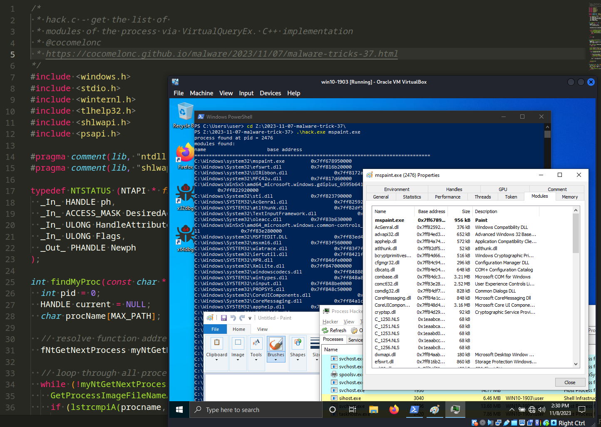
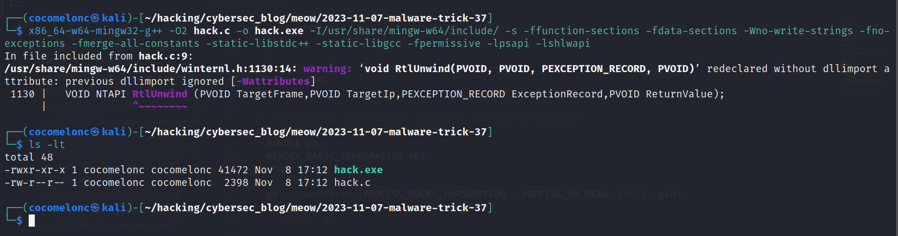
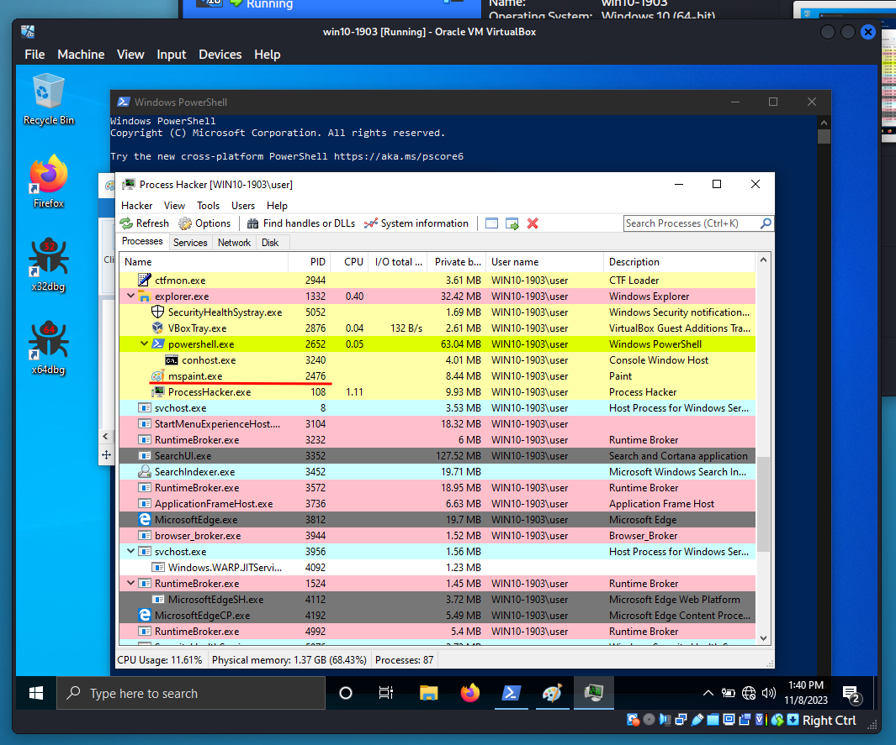
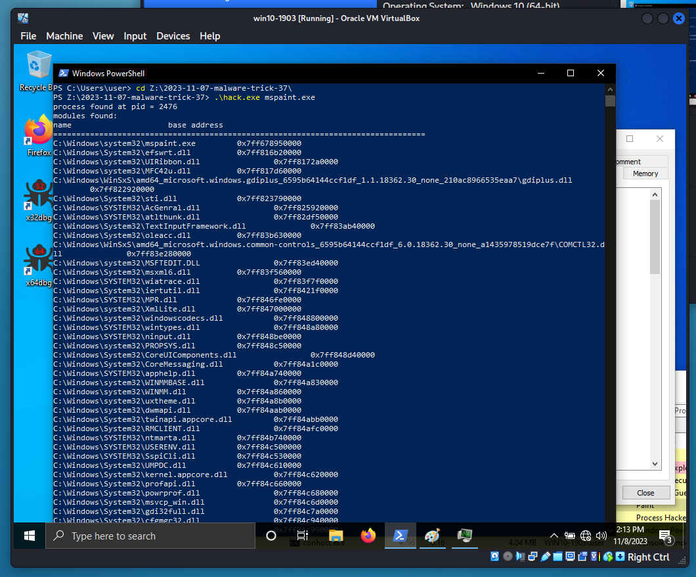
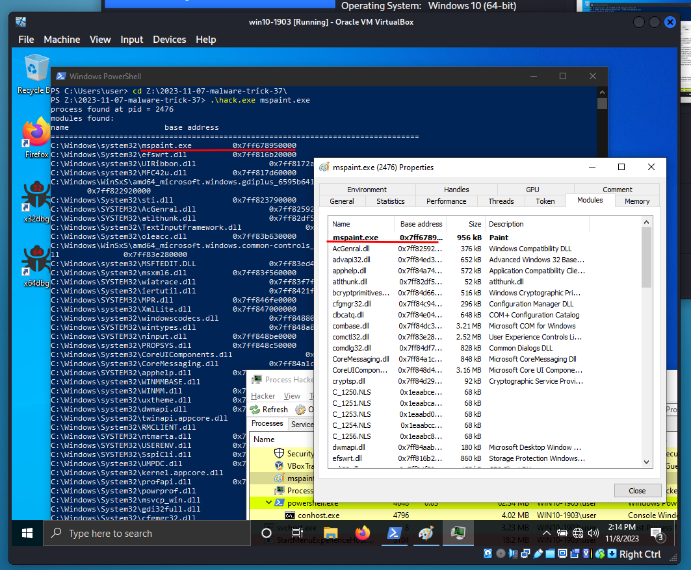

\newpage
\subsection{48. трюк разработки вредоносного ПО. Перечисление модулей процесса через VirtualQueryEx. Простой пример на C++.}

﷽

{width="80%"}      

Сегодня этот пост является результатом моего собственного исследования ещё одного популярного трюка разработки вредоносного ПО: получение списка модулей целевого процесса.     

Этот метод похож на мой предыдущий пост о перечислении списка модулей, но в данном случае я использовал [VirtualQueryEx](https://learn.microsoft.com/en-us/windows/win32/api/memoryapi/nf-memoryapi-virtualqueryex).     

### практический пример

Прежде всего, мы используем один из методов для поиска PID целевого процесса. Например, я использовал [этот](https://cocomelonc.github.io/malware/2023/05/26/malware-tricks-30.html):     

```cpp
typedef NTSTATUS (NTAPI * fNtGetNextProcess)(
  _In_ HANDLE ph,
  _In_ ACCESS_MASK DesiredAccess,
  _In_ ULONG HandleAttributes,
  _In_ ULONG Flags,
  _Out_ PHANDLE Newph
);

int findMyProc(const char * procname) {
  int pid = 0;
  HANDLE current = NULL;
  char procName[MAX_PATH];

  // получаем адрес функции
  fNtGetNextProcess myNtGetNextProcess = (fNtGetNextProcess) 
  GetProcAddress(GetModuleHandle("ntdll.dll"), "NtGetNextProcess");

  // перебираем все процессы
  while (!myNtGetNextProcess(current, MAXIMUM_ALLOWED, 0, 0, &current)) {
    GetProcessImageFileNameA(current, procName, MAX_PATH);
    if (lstrcmpiA(procname, PathFindFileName((LPCSTR) procName)) == 0) {
      pid = GetProcessId(current);
      break;
    }
  }

  return pid;
}
```

Затем создаём функцию, которая открывает указанный процесс, проходит по его регионам памяти с использованием `VirtualQueryEx` и получает информацию о загруженных модулях, включая их имена и базовые адреса:     

```cpp
// function to list modules loaded by a specified process
int listModulesOfProcess(int pid) {
  HANDLE ph;
  MEMORY_BASIC_INFORMATION mbi;
  char * base = NULL;

  ph = OpenProcess(PROCESS_QUERY_INFORMATION | PROCESS_VM_READ, FALSE, pid);
  if (ph == NULL)
    return -1;

  printf("modules found:\n");
  printf("name\t\t\t base address\n");
  printf("======================================================================\n");

  while (VirtualQueryEx(ph, base, &mbi, sizeof(mbi)) == 
  sizeof(MEMORY_BASIC_INFORMATION)) {
    char szModName[MAX_PATH];

    // only focus on the base address regions
    if ((mbi.AllocationBase == mbi.BaseAddress) && (mbi.AllocationBase != NULL)) {
      if (GetModuleFileNameEx(ph, (HMODULE) mbi.AllocationBase, 
      (LPSTR) szModName, sizeof(szModName) / sizeof(TCHAR)))
        printf("%#25s\t\t%#10llx\n", szModName, 
        (unsigned long long)mbi.AllocationBase);
      }
      // check the next region
      base += mbi.RegionSize;
    }
  
  CloseHandle(ph);
  return 0;
}
```

Как можно заметить, код входит в цикл `while`, который продолжается до тех пор, пока функция `VirtualQueryEx` успешно получает информацию о памяти. Этот цикл перебирает регионы памяти в целевом процессе.     

Затем проверяется, соответствует ли `AllocationBase` текущего региона памяти `BaseAddress`. Это условие гарантирует, что внимание уделяется только базовым адресам регионов. Если условия выполняются, программа переходит к получению имени модуля.     

`if (GetModuleFileNameEx(ph, (HMODULE) mbi.AllocationBase, (LPSTR) szModName, sizeof(szModName) / sizeof(TCHAR)))` - вызывается функция `GetModuleFileNameEx` для получения имени файла модуля, связанного с базовым адресом текущего региона памяти. Если операция успешна, имя файла сохраняется в `szModName`.    

Если имя модуля было успешно получено, код выводит имя модуля и базовый адрес в форматированном виде.     

После обработки текущего региона указатель `base` увеличивается на размер региона, чтобы перейти к следующему региону в следующей итерации цикла.     

Вот и всё.     

Таким образом, полный исходный код выглядит следующим образом (`hack.c`):     

```cpp
/*
 * hack.c - get the list of 
 * modules of the process via VirtualQueryEx. C++ implementation
 * @cocomelonc
 * https://cocomelonc.github.io/malware/2023/11/07/malware-tricks-37.html
*/
#include <windows.h>
#include <stdio.h>
#include <winternl.h>
#include <tlhelp32.h>
#include <shlwapi.h>
#include <psapi.h>

#pragma comment(lib, "ntdll.lib")
#pragma comment(lib, "shlwapi.lib")

typedef NTSTATUS (NTAPI * fNtGetNextProcess)(
  _In_ HANDLE ph,
  _In_ ACCESS_MASK DesiredAccess,
  _In_ ULONG HandleAttributes,
  _In_ ULONG Flags,
  _Out_ PHANDLE Newph
);

int findMyProc(const char * procname) {
  int pid = 0;
  HANDLE current = NULL;
  char procName[MAX_PATH];

  // resolve function address
  fNtGetNextProcess myNtGetNextProcess = (fNtGetNextProcess) 
  GetProcAddress(GetModuleHandle("ntdll.dll"), "NtGetNextProcess");

  // loop through all processes
  while (!myNtGetNextProcess(current, MAXIMUM_ALLOWED, 0, 0, &current)) {
    GetProcessImageFileNameA(current, procName, MAX_PATH);
    if (lstrcmpiA(procname, PathFindFileName((LPCSTR) procName)) == 0) {
      pid = GetProcessId(current);
      break;
    }
  }

  return pid;
}

// function to list modules loaded by a specified process
int listModulesOfProcess(int pid) {
  HANDLE ph;
  MEMORY_BASIC_INFORMATION mbi;
  char * base = NULL;

  ph = OpenProcess(PROCESS_QUERY_INFORMATION | PROCESS_VM_READ, FALSE, pid);
  if (ph == NULL)
    return -1;

  printf("modules found:\n");
  printf("name\t\t\t base address\n");
  printf("=====================================================================\n");

  while (VirtualQueryEx(ph, base, &mbi, sizeof(mbi)) == 
  sizeof(MEMORY_BASIC_INFORMATION)) {
    char szModName[MAX_PATH];

    // only focus on the base address regions
    if ((mbi.AllocationBase == mbi.BaseAddress) && (mbi.AllocationBase != NULL)) {
      if (GetModuleFileNameEx(ph, (HMODULE) mbi.AllocationBase, 
      (LPSTR) szModName, sizeof(szModName) / sizeof(TCHAR)))
        printf("%#25s\t\t%#10llx\n", szModName, (unsigned long long)mbi.AllocationBase);
      }
      // check the next region
      base += mbi.RegionSize;
    }
  
  CloseHandle(ph);
  return 0;
}

int main(int argc, char* argv[]) {
  int pid = 0; // process ID
  pid = findMyProc(argv[1]);
  printf("%s%d\n", pid > 0 ? "process found at pid = " : 
  "process not found. pid = ", pid);
  if (pid != 0)
    listModulesOfProcess(pid);
  return 0;
}
```

### демонстрация

Давайте посмотрим эту логику в действии.      

Компилируем:     

```bash
x86_64-w64-mingw32-g++ -O2 hack.c -o hack.exe \
-I/usr/share/mingw-w64/include/ \
-s -ffunction-sections -fdata-sections -Wno-write-strings -fno-exceptions \
-fmerge-all-constants -static-libstdc++ -static-libgcc \
-fpermissive -lpsapi -lshlwapi
```

{width="80%"}      

Затем открываем целевой процесс на машине жертвы:     

{width="80%"}      

И просто запускаем наш `hack.exe`:    

```powershell
.\hack.exe mspaint.exe
```

{width="80%"}      

{width="80%"}      

Как можно заметить, всё сработало идеально! =^..^=     

Имейте в виду, что этот код может иметь ограничения и зависеть от специфических API Windows. Кроме того, он использует имя процесса для идентификации, что может не быть уникальным.     

Этот код также может помочь вам разработать собственный скрипт для работы с памятью процесса, например, для судебного анализа или других задач на практике синих команд.     

Надеюсь, этот пост повысит осведомлённость синих команд об этой интересной технике разработки вредоносного ПО и добавит оружие в арсенал красных команд.      

[VirtualQueryEx](https://learn.microsoft.com/en-us/windows/win32/api/memoryapi/nf-memoryapi-virtualqueryex)    
[GetModuleFileNameEx](https://learn.microsoft.com/en-us/windows/win32/api/psapi/nf-psapi-getmodulefilenameexa)    
[Find process ID by name and inject to it](https://cocomelonc.github.io/pentest/2021/09/29/findmyprocess.html)     
[Find PID via NtGetNextProcess](https://cocomelonc.github.io/malware/2023/05/26/malware-tricks-30.html)     
[исходный код на github](https://github.com/cocomelonc/meow/tree/master/2023-11-07-malware-trick-37)           
